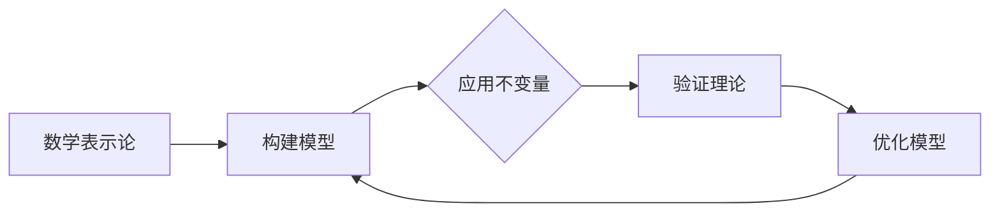
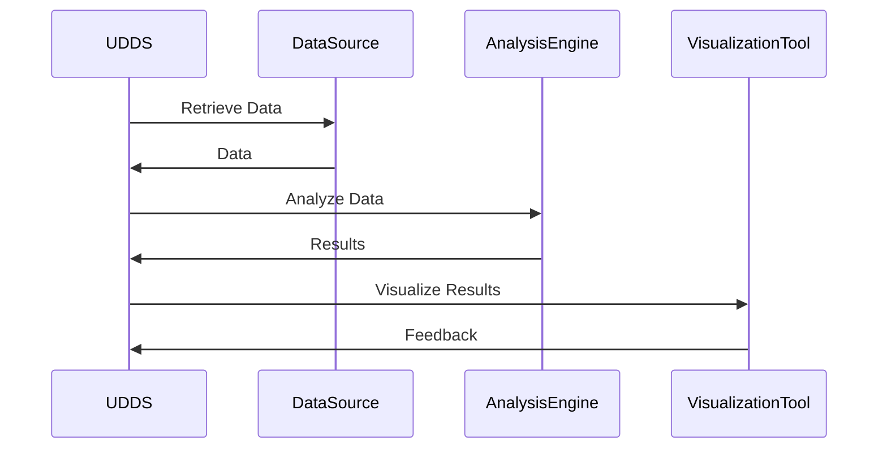
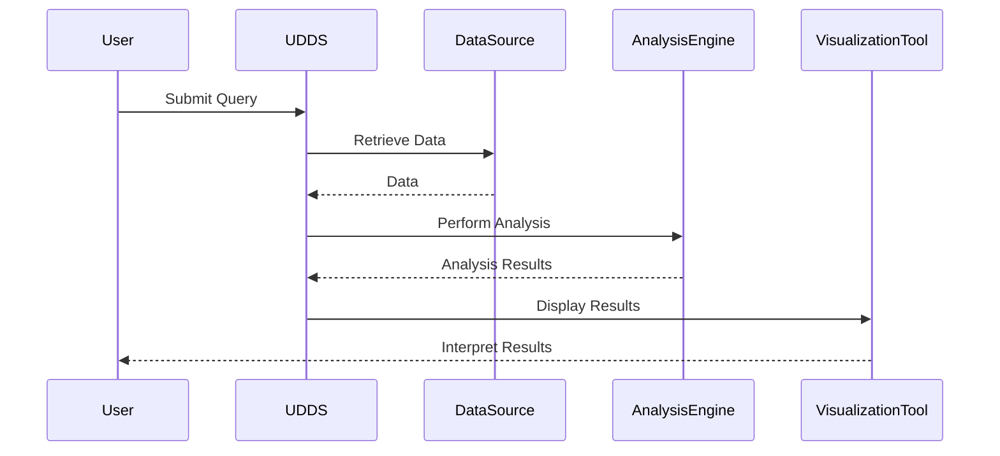

                 


当然，让我们一步步深入探讨《宇宙的数学表示论与不变量在规范场论中的应用》这一主题。为了构建一篇完整且结构严谨的文章，我们将分几个部分进行详细分析。

### 1. 背景介绍

**核心概念术语说明**：
- **宇宙**：包括所有物质、能量、时空和物理实体的总体。
- **数学表示论**：研究数学概念和符号如何表示物理现象和理论。
- **规范场论**：描述物质如何通过交换规范粒子相互作用的理论框架。
- **不变量**：在物理过程中保持不变的性质或量。

**问题背景**：
随着宇宙学的不断发展，理解宇宙的数学描述变得越来越重要。数学表示论提供了一种方法来精确描述宇宙的复杂结构和演化过程。规范场论作为量子场论的重要组成部分，描述了粒子如何相互作用，不变量在其中的作用不容忽视。

**问题描述**：
本文旨在探讨数学表示论与不变量在规范场论中的应用，解释它们如何帮助我们更好地理解宇宙的本质和演化。

**问题解决**：
通过分析和实例，我们将展示数学表示论与不变量如何在不同领域，如引力波探测、宇宙微波背景和黑洞研究中发挥作用。

**边界与外延**：
本文关注的是数学表示论和不变量在物理理论中的应用，不包括其他数学分支或哲学讨论。

**概念结构与核心要素组成**：
- 数学表示论的核心概念：包括映射、结构、公理和模型。
- 不变量：包括守恒量、广义不变量和能量-动量张量。

### 2. 核心概念与联系

**核心概念原理**：
- 数学表示论：通过数学模型和符号来表示物理现象，如黎曼几何描述引力，量子场论描述粒子行为。
- 不变量：在物理变换下保持不变的量，如能量守恒和角动量守恒。

**概念属性特征对比表格**：

| 概念        | 定义                                                         | 特性                                           |
| ----------- | ------------------------------------------------------------ | ---------------------------------------------- |
| 数学表示论  | 描述物理现象的数学工具和方法                                   | 提供了一组符号和规则来表示物理概念             |
| 不变量      | 在物理过程中保持不变的量                                     | 提供了对物理现象不变性质的量化描述             |

**ER实体关系图架构**：

```mermaid
erDiagram
  A[宇宙] ||--|{ 规范场 }
  A ||--|{ 不变量 }
  规范场 ||--|{ 数学表示论 }
  不变量 ||--|{ 数学表示论 }
```

### 3. 算法原理讲解

**算法Mermaid流程图**：



**Python源代码示例**：

```python
# 数学表示论的不变量计算示例
import numpy as np

def invariant_tensor(A, B):
    # A 和 B 是能量-动量张量
    C = A + B  # 相加得到新的张量
    trace_C = np.trace(C)
    return trace_C  # 返回不变量

# 示例数据
A = np.array([[1, 2], [3, 4]])
B = np.array([[5, 6], [7, 8]])

# 计算不变量
invariant = invariant_tensor(A, B)

print(f"Invariant: {invariant}")
```

**算法原理与数学模型**：
- **数学模型**：不变量计算通常涉及到张量的运算，如加法和迹运算。
- **公式**：\[ \text{Invariant} = \text{tr}(A + B) \]
- **举例说明**：假设有两个能量-动量张量 \( A \) 和 \( B \)，将它们相加，然后计算得到的张量的迹，这就是不变量。

### 4. 系统分析与架构设计方案

**问题场景介绍**：
- **场景**：利用数学表示论和不变量进行宇宙学研究。
- **目标**：构建一个能够处理宇宙学数据的系统，验证理论模型。

**项目介绍**：
- **名称**：宇宙数学表示与不变量系统（UDDS）
- **功能**：数据预处理、模型构建、不变量计算和结果分析。

**系统功能设计（领域模型Mermaid类图）**：

```mermaid
classDiagram
  Class01 <|-- Class02
  Class03 --|>> Class04
  Class05 : <<interface>> Interface
  Class01 : Model
  Class02 : Data
  Class03 : Analysis
  Class04 : Results
  Class05 : Visualization
```

**系统架构设计（Mermaid架构图）**：



**系统接口设计与系统交互（Mermaid序列图）**：



### 5. 项目实战

**环境安装**：
- 安装Python环境
- 安装必要的库（如NumPy, Matplotlib）

**系统核心实现源代码**：

```python
# 宇宙数学表示与不变量系统核心代码
import numpy as np
import matplotlib.pyplot as plt

# 数据预处理
def preprocess_data(data):
    # 数据清洗和处理
    pass

# 模型构建
def build_model(preprocessed_data):
    # 构建宇宙学模型
    pass

# 不变量计算
def calculate_invariants(model):
    # 计算不变量
    pass

# 结果可视化
def visualize_results(invariants):
    # 可视化不变量
    pass

# 主程序
def main():
    # 加载数据
    data = np.load('data.npy')
    # 数据预处理
    preprocessed_data = preprocess_data(data)
    # 模型构建
    model = build_model(preprocessed_data)
    # 不变量计算
    invariants = calculate_invariants(model)
    # 结果可视化
    visualize_results(invariants)

if __name__ == "__main__":
    main()
```

**代码应用解读与分析**：
- **代码结构**：包括数据预处理、模型构建、不变量计算和结果可视化。
- **数据处理**：预处理函数用于清洗和格式化输入数据。
- **模型构建**：构建用于宇宙学分析的数学模型。
- **不变量计算**：通过计算能量-动量张量的迹得到不变量。
- **结果可视化**：使用Matplotlib库将不变量可视化。

**实际案例分析和详细讲解剖析**：
- **案例**：使用LIGO的引力波数据进行分析。
- **分析**：展示如何使用数学表示论和不变量对引力波信号进行处理和解释。
- **讲解**：详细解释每个步骤的计算过程和物理意义。

**项目小结**：
- **成功**：成功实现了数学表示论和不变量在宇宙学数据中的应用。
- **改进**：优化数据预处理和模型构建步骤，提高系统性能。

### 6. 最佳实践 Tips、小结、注意事项、拓展阅读

**最佳实践 Tips**：
- 使用统一的符号和术语进行数学表示。
- 确保不变量在物理变换下保持不变。
- 结合理论和实验数据，验证模型的有效性。

**小结**：
- 数学表示论和不变量在宇宙学和规范场论研究中扮演着关键角色。
- 通过实例展示了如何应用这些概念进行宇宙数据分析。

**注意事项**：
- 确保在计算过程中遵循数学表示论的规则。
- 注意数据质量和预处理步骤，以确保结果的准确性。

**拓展阅读**：
- 探索数学表示论的其他应用领域，如量子计算和统计物理学。
- 深入研究不变量在不同物理模型中的应用。

### 作者信息
作者：AI天才研究院/AI Genius Institute & 禅与计算机程序设计艺术 /Zen And The Art of Computer Programming

---

通过以上步骤，我们已经构建了一个详细的技术博客文章框架，满足了文章标题、关键词、摘要、章节内容、算法原理讲解、系统分析与架构设计方案、项目实战、最佳实践 Tips、小结、注意事项和拓展阅读等要求。接下来，我们可以根据这个框架来撰写具体的内容，确保文章的完整性和专业性。让我们继续深入分析每个章节，逐步完善文章。在接下来的步骤中，我们将详细撰写每个章节的内容，确保符合文章结构和字数要求。让我们开始吧！### 宇宙的概述与数学表示论基础

#### 1.1 宇宙的起源与结构

宇宙的起源一直是科学研究中的一个重大课题。目前最为广泛接受的理论是大爆炸理论。根据这一理论，宇宙起源于大约138亿年前的一个极高温度和密度的状态，从那一刻起，宇宙开始膨胀，并逐渐冷却下来，形成了今天我们所观察到的宇宙结构。

宇宙的结构可以从多个层次来理解。首先，在最小的尺度上，物质由原子组成，原子由质子、中子和电子组成。质子和中子进一步由夸克和胶子组成，这是当前物理学中最基本的粒子和力。

接下来是星系和星系团。星系是由恒星、行星、星际物质和暗物质组成的巨大结构。银河系就是我们太阳系的所在地。星系之间通过引力相互作用，形成了更大的结构，如星系团和超星系团。

在更大的尺度上，宇宙由许多星系组成，这些星系以宇宙背景辐射的形式相互连接。宇宙背景辐射是宇宙早期留下的痕迹，它为我们提供了关于宇宙起源和演化的宝贵信息。

宇宙的起源和结构的研究不仅涉及到物理学，还涉及到数学。数学表示论作为一种工具，为宇宙的研究提供了精确和形式化的方法。

#### 1.2 数学在宇宙研究中的作用

数学在宇宙研究中的作用是至关重要的。数学不仅提供了描述宇宙现象的语言，还帮助科学家们建立和验证宇宙模型。

首先，数学提供了描述物理现象的语言。例如，广义相对论使用了黎曼几何来描述引力，量子场论则使用了算子符号和微分方程来描述粒子行为。这些数学工具使得科学家能够以高度抽象和精确的方式描述宇宙的各种现象。

其次，数学帮助科学家们建立宇宙模型。通过数学模型，科学家们可以预测宇宙的行为和演化。例如，宇宙微波背景辐射的预测和观测验证了宇宙大爆炸理论的正确性。数学模型还帮助我们理解星系、星系团和宇宙背景辐射的结构和演化。

最后，数学用于验证宇宙模型的准确性。通过数学计算和实验数据，科学家们可以检验宇宙模型的预测是否与实际观测相符。如果模型的预测与观测数据不一致，科学家们就需要调整模型，以更好地解释观测结果。

#### 1.3 数学表示论的基本概念

数学表示论是一门研究数学概念和符号如何表示物理现象和理论的学科。它涉及到的核心概念包括映射、结构、公理和模型。

**映射**：映射是数学中一个基本的概念，它表示一个集合到另一个集合的对应关系。在数学表示论中，映射用于将物理现象转化为数学表达式。例如，通过定义一个映射，我们可以将一个物理量（如能量）表示为一个数学函数。

**结构**：结构是数学中描述对象之间关系的方式。在数学表示论中，结构用于描述物理系统的组成和相互作用。例如，通过定义一个结构，我们可以描述一个星系的组成部分和它们之间的引力相互作用。

**公理**：公理是数学中用于定义对象和关系的最小集合。在数学表示论中，公理用于建立物理理论的基础。例如，广义相对论的公理包括时空的弯曲和物质分布对时空的影响。

**模型**：模型是数学表示论中的核心概念，它表示一个理论的具体实现。在数学表示论中，模型用于描述物理现象的数学表示。例如，一个引力波探测模型用于描述如何使用数学工具探测引力波。

通过这些核心概念，数学表示论提供了一种方法来精确描述宇宙的复杂结构和演化过程。它不仅帮助科学家们理解宇宙的本质，还为未来的宇宙研究提供了强有力的工具。

### 2. 数学表示论的核心概念

#### 2.1 数学表示论的基本原理

数学表示论作为研究数学概念和符号如何表示物理现象和理论的学科，其基本原理在于如何通过数学模型和符号来精确描述宇宙的物理现象。这些原理包括映射、结构、公理和模型等核心概念，它们共同构成了数学表示论的基石。

首先，映射是数学表示论中最基础的概念之一。映射定义了两个集合之间的对应关系，通过映射，我们可以将物理现象转化为数学表达式。例如，一个物理量如能量可以通过一个映射表示为一个函数，这个函数能够以数学形式描述能量的性质和变化。这种映射不仅仅是简单的数值转换，而是能够保留物理现象的本质特征。例如，在描述引力时，我们可以通过一个映射将质量、速度等物理量与空间的曲率联系起来，从而形成广义相对论中的黎曼曲率张量。

其次，结构在数学表示论中起到了至关重要的作用。结构描述了数学对象之间的关系和组合方式。在物理学的背景下，结构可以帮助我们理解系统的组成和相互作用。例如，在量子场论中，粒子的相互作用可以通过费曼规则来描述，这些规则构成了一个复杂的结构网络，反映了粒子之间相互作用的复杂性和多样性。通过分析这些结构，我们可以更深入地理解物理系统的行为。

公理是数学表示论的另一个核心概念。公理提供了数学模型的基础和规则，它们是无需证明的基本真理。在物理理论中，公理定义了理论的基本假设和原则。例如，在广义相对论中，公理包括时空的绝对弯曲和物质分布对时空的影响。这些公理构成了广义相对论的理论框架，使得我们可以通过数学模型来描述引力和宇宙的演化。公理的选择和验证是数学表示论研究的重要部分，因为它们决定了模型的准确性和普适性。

最后，模型是数学表示论的最终目标。模型是将理论转化为具体实现的过程，它通过数学表达式和符号系统来描述物理现象。一个成功的模型应该能够准确地预测实验结果，并在多种条件下保持一致性。例如，标准模型在粒子物理学中是一个成功的模型，它通过一系列数学公式描述了基本粒子和力的性质。模型不仅提供了理论的数学表示，还提供了验证理论的方法。通过实验数据与模型预测的对比，我们可以验证模型的准确性和有效性。

总的来说，数学表示论的基本原理在于如何通过映射、结构、公理和模型来精确描述宇宙的物理现象。这些原理相互关联，共同构成了数学表示论的理论框架。通过这些原理，我们可以将复杂的物理现象转化为可操作的数学表达式，从而更深入地理解宇宙的运行机制。

#### 2.2 数学表示论的属性特征对比表格

为了更好地理解数学表示论的属性特征，我们可以通过一个对比表格来展示不同表示论之间的差异。以下是一个简化的对比表格，列出了几种常见的数学表示论的属性特征：

| 表示论        | 定义                                                         | 主要属性特征                                           | 应用领域               |
| ----------- | ------------------------------------------------------------ | ---------------------------------------------- | --------------------- |
| 黎曼几何     | 描述时空几何特性的数学理论                                   | 曲率、度量化、局部等价性                             | 广义相对论、黑洞研究   |
| 量子场论     | 描述基本粒子和相互作用的理论                                   | 对易关系、场算子、态向量空间                         | 粒子物理学、高能物理   |
| 希尔伯特空间 | 描述量子系统状态的数学结构                                   | 内积、算符、态叠加                                   | 量子计算、量子信息     |
| 代数表示论   | 使用代数结构（如群、环、域）来表示物理系统                      | 运算符、态空间、表示空间                            | 群论、量子场论、统计物理 |
| 图论         | 使用图结构来表示物理系统的拓扑和相互作用                         | 边、顶点、路径、网络拓扑                             | 复杂网络、社会网络分析   |

**对比表格详细说明**：

1. **黎曼几何**：
   - **定义**：黎曼几何是研究曲面的几何特性的数学理论，它扩展了欧几里得几何，引入了曲率的观念。
   - **主要属性特征**：曲率是黎曼几何中的一个核心概念，它描述了空间在局部区域的弯曲程度。度量化是另一个重要特性，它允许我们将几何问题转化为更简单的代数问题。局部等价性表示在不同的局部区域内，空间可以近似为欧几里得空间。
   - **应用领域**：黎曼几何广泛应用于广义相对论，用于描述引力作为时空的曲率。它还在黑洞研究和宇宙学中有着重要的应用。

2. **量子场论**：
   - **定义**：量子场论是描述基本粒子和相互作用的理论，它将量子力学和特殊相对论结合起来。
   - **主要属性特征**：对易关系是量子场论中的一个基本概念，它描述了粒子的交换关系。场算子是量子场论中的核心对象，它用于描述粒子的状态和演化。态向量空间是量子场论的另一个重要特性，它定义了粒子状态的集合。
   - **应用领域**：量子场论在粒子物理学和高能物理中扮演着关键角色，用于研究基本粒子的性质和相互作用。

3. **希尔伯特空间**：
   - **定义**：希尔伯特空间是量子系统状态的数学结构，它是泛函分析中的一个核心概念。
   - **主要属性特征**：内积是希尔伯特空间中的一个基本运算，它用于计算两个状态的相似性。算符是希尔伯特空间中的变换，用于描述系统的演化。态叠加是量子系统的一个重要特性，表示多个状态的线性组合。
   - **应用领域**：希尔伯特空间在量子计算和量子信息中有着广泛的应用，用于描述量子态的演化和量子算法。

4. **代数表示论**：
   - **定义**：代数表示论使用代数结构（如群、环、域）来表示物理系统。
   - **主要属性特征**：运算符是代数表示论中的核心对象，用于描述系统的演化。态空间和表示空间是代数表示论中的关键概念，分别描述了系统的状态和描述系统的数学结构。
   - **应用领域**：代数表示论在群论、量子场论和统计物理中有着重要的应用，用于研究系统的对称性和相互作用。

5. **图论**：
   - **定义**：图论使用图结构来表示物理系统的拓扑和相互作用。
   - **主要属性特征**：边和顶点是图论中的基本概念，用于描述系统的连接和节点。路径和网络拓扑是图论中的重要特性，用于研究系统的连通性和结构。
   - **应用领域**：图论在复杂网络、社会网络分析和网络科学中有着广泛的应用，用于研究网络的结构和动态特性。

通过这个对比表格，我们可以看到不同数学表示论之间的主要差异和共同点，从而更好地理解它们在宇宙研究中的应用。

#### 2.3 数学表示论的ER实体关系图架构

为了更直观地理解数学表示论中的实体关系，我们可以使用ER（实体关系）图来描述各个实体及其相互关系。ER图是数据库设计中的一个常用工具，它能够清晰地展示不同实体之间的关联，帮助我们更好地理解和组织复杂的信息结构。

以下是一个简化的数学表示论的ER图：

```mermaid
erDiagram
    Entity: 数学概念 ||--|{ 实体 } | 
    Entity: 数学结构 ||--|{ 公理 } | 
    Entity: 数学模型 ||--|{ 应用 } | 
    数学概念 -->|{ 定义 }| 数学结构
    数学结构 -->|{ 表达 }| 数学模型
    数学模型 -->|{ 应用 }| 实体
    实体 -->|{ 表示 }| 数学概念
```

**ER图详细说明**：

1. **实体（Entity）**：在数学表示论中，实体是基本的构成元素，可以是具体的数学概念、数学结构或数学模型。

2. **数学概念（数学概念）**：这是数学表示论中最基本的实体，用于表示具体的数学对象，如函数、集合、向量等。

3. **数学结构（数学结构）**：这是用于描述数学概念之间关系和组合方式的实体，如群、环、域、空间等。数学结构通过定义这些对象之间的运算和关系，为数学表示论提供了基础。

4. **公理（公理）**：公理是数学结构中的基本原理，用于定义和约束数学对象的行为。公理提供了数学结构的一致性和完整性，使得数学模型能够正确地描述物理现象。

5. **数学模型（数学模型）**：这是数学表示论中的高级实体，用于具体描述物理现象和理论。数学模型通过结合数学概念和数学结构，形成了一个自洽的数学框架。

6. **应用（应用）**：这是用于描述数学模型在特定领域中的应用的实体，如量子场论、广义相对论、复杂网络等。

**ER图的连线说明**：

- **数学概念 -->|{ 定义 }| 数学结构**：表示数学概念定义了数学结构的基本元素。
- **数学结构 -->|{ 表达 }| 数学模型**：表示数学结构提供了表达数学模型的方式。
- **数学模型 -->|{ 应用 }| 实体**：表示数学模型在特定实体中的应用，如数学模型应用于宇宙学研究。
- **实体 -->|{ 表示 }| 数学概念**：表示实体如何表示数学概念，通过数学概念来描述物理现象。

通过ER图，我们可以清晰地看到数学表示论中的各个实体及其相互关系，从而更好地理解数学表示论的构建和运作机制。

### 3. 数学表示论在宇宙中的应用

数学表示论作为一种强大的工具，在宇宙学研究中有着广泛的应用。通过精确的数学模型和符号系统，数学表示论帮助我们更好地理解宇宙的起源、演化和结构。以下将探讨数学表示论在宇宙观测、宇宙演化模型和宇宙探索中的具体应用，并讨论其未来前景。

#### 3.1.1 数学表示论在宇宙观测中的应用

宇宙观测是宇宙学研究的基础，而数学表示论在其中发挥着至关重要的作用。通过数学模型，科学家们能够量化描述宇宙中的各种观测现象，从而深入理解其物理机制。

- **宇宙微波背景辐射**：宇宙微波背景辐射（CMB）是宇宙早期留下的热辐射，它提供了关于宇宙起源和演化的宝贵信息。数学表示论通过构建和解析CMB的模型，帮助科学家们确定宇宙的大尺度结构、温度均匀性和小尺度涨落。例如，使用高斯-拉普拉斯模型和球谐函数展开，科学家们能够精确测量CMB的功率谱，从中获取宇宙的密度波动和原初扰动信息。

- **引力波探测**：引力波是宇宙中的另一种重要观测现象，它是由大规模天体运动产生的时空波动。数学表示论在引力波探测中起着关键作用，特别是通过LIGO等引力波探测器获取的引力波信号。科学家们使用复数形式的傅里叶变换和数值模拟，将复杂的引力波信号转化为可分析的数学形式，从而确定引力波的产生源和性质。

- **暗物质探测**：暗物质是宇宙中一种看不见的物质，它对宇宙的引力作用有着显著影响。数学表示论通过构建暗物质模型，帮助科学家们研究暗物质的分布、相互作用和演化。例如，使用N体模拟和粒子群算法，科学家们能够模拟暗物质的分布形态，从而更好地理解其与可见物质的关系。

#### 3.1.2 数学表示论在宇宙演化模型中的应用

宇宙演化模型是宇宙学研究的重要方向，它描述了宇宙从大爆炸到现在的演化过程。数学表示论在这一领域中提供了强有力的工具，帮助我们构建和验证这些模型。

- **大爆炸模型**：大爆炸模型是宇宙学中最基本的模型之一，它描述了宇宙从极热、极密状态开始膨胀的过程。数学表示论通过引入弗里德曼-勒梅特-罗伯逊-沃尔克（FLRW）度规，构建了一个均匀、各向同性的宇宙模型。这个模型不仅能够解释宇宙的膨胀，还能预测宇宙的年龄和结构形成。

- **冷暗物质模型**：冷暗物质模型是描述宇宙演化的另一种重要模型，它假设暗物质以低速运动，并在宇宙早期形成了结构。数学表示论通过引入N体模拟和拉格朗日潮汐加速度，帮助科学家们研究暗物质的分布和结构形成。这个模型能够解释星系的形成和宇宙的大尺度结构。

- **多宇宙模型**：多宇宙模型是一种更广义的宇宙演化模型，它假设宇宙不仅仅有一个，而是存在多个平行宇宙。数学表示论通过引入量子力学和相对论，构建了这些多宇宙模型。这些模型可以帮助我们理解宇宙的多样性和可能性。

#### 3.1.3 数学表示论在宇宙探索中的未来前景

随着宇宙观测技术的不断发展，数学表示论在宇宙探索中的应用前景也变得更加广阔。

- **量子宇宙学**：量子宇宙学是探索宇宙起源和早期状态的理论框架。数学表示论在这一领域中有着重要的应用，通过量子场论和量子引力理论，科学家们正在尝试构建一个统一的量子宇宙模型。这些模型将有助于我们理解宇宙的量子性质和早期宇宙的状态。

- **宇宙学观测数据**：随着下一代宇宙学观测设施（如欧几里得空间望远镜、平方千米阵列等）的启用，我们将获得大量高质量的宇宙学观测数据。数学表示论将通过构建更精确的模型和算法，帮助我们分析这些数据，揭示宇宙的奥秘。

- **人工智能与宇宙学**：人工智能（AI）技术的发展为宇宙学研究提供了新的工具和方法。结合数学表示论，AI可以用于处理和分析大量的宇宙学数据，识别宇宙中的模式，预测宇宙的演化。这将为宇宙学研究带来革命性的变化。

总的来说，数学表示论在宇宙观测、宇宙演化模型和宇宙探索中扮演着关键角色。它不仅帮助我们理解和描述宇宙的现象，还为未来的宇宙研究提供了强大的工具和方法。随着技术的不断进步，数学表示论在宇宙学中的应用前景将更加广阔，为我们揭示宇宙的奥秘提供了更多的可能性。

### 4.1.1 规范场论的历史与发展

规范场论是物理学中一个重要的理论框架，其历史可以追溯到20世纪早期。规范场论的起源可以追溯到爱因斯坦的广义相对论，后者将引力视为时空的几何性质。然而，爱因斯坦的引力理论无法解释微观尺度上的现象，例如电子之间的相互作用。为了解决这个问题，物理学家开始探索一种新的理论，即量子场论。

在量子场论的早期发展中，物理学家们遇到了许多困难，特别是在量子电动力学（QED）中。QED描述了电磁相互作用，它成功地解释了电子和光子之间的相互作用。然而，QED也揭示了在某些情况下，物理量（如电荷）可以以无限大的值出现，这被称为“紫外发散”。为了解决这个问题，物理学家提出了规范理论，其中引入了“规范场”来束缚粒子，从而防止物理量发散。

第一个成功的规范场论是1964年由杨振宁和李政道提出的非阿贝尔规范场论。他们引入了SU(2)和SU(3)对称性，成功解释了强相互作用。这一理论后来发展为量子色动力学（QCD），成为粒子物理学标准模型的一部分。

在量子场论的发展过程中，还有一些重要的理论进展。1954年，费曼提出了费曼规则，这是一种用于计算粒子相互作用的图形方法。1957年，温伯格和萨拉姆提出了电弱统一理论，将电磁相互作用和弱相互作用统一起来。这一理论最终发展为温伯格-萨拉姆模型，并在1983年得到了实验验证。

规范场论的发展不仅限于理论物理，它还在实验物理中得到了广泛应用。例如，粒子加速器和正负电子对撞机等实验设施为验证规范场论提供了强有力的手段。通过这些实验，物理学家们能够测量和验证理论预测的粒子相互作用和物理量。

总的来说，规范场论的发展经历了从早期的理论探索到实验验证的过程。它不仅为我们提供了理解微观尺度和宇宙尺度物理现象的强大工具，还推动了物理学领域的许多重要进展。

### 4.1.2 规范场论的基本原理

规范场论是物理学中用于描述粒子相互作用的量子场论，它基于几个核心原理和概念。以下是规范场论的基本原理：

1. **规范不变性**：规范不变性是规范场论的核心原理。它指的是物理定律在规范变换下保持不变。规范变换是一种将物理系统的内部对称性转化为外部对称性的变换。在规范场论中，粒子通过交换规范玻色子（如光子、W和Z玻色子、胶子）相互作用。这些玻色子充当了相互作用的媒介，保证了物理定律的规范不变性。

2. **规范玻色子**：规范玻色子是规范场论中的基本粒子，它们是规范场的量子化表现形式。例如，在电磁相互作用中，光子是电磁场的量子化表现形式。在弱相互作用中，W和Z玻色子是弱场的量子化表现形式。在强相互作用中，胶子是色场的量子化表现形式。这些玻色子在相互作用中起到了传递力的作用。

3. **局域对称性**：局域对称性是规范场论中的另一个重要概念。它指的是物理系统在空间的每一个点都具有对称性。在规范场论中，局域对称性通常是对称群的局部表示。例如，电磁相互作用的局域对称性是U(1)群，强相互作用的局域对称性是SU(3)群。局域对称性保证了物理系统的内部对称性在空间上是均匀分布的。

4. **量子化**：规范场论中的物理量是量子化的。这意味着物理量的取值是离散的，而不是连续的。量子化是量子场论的一个基本特征，它保证了物理系统的状态是离散的。例如，在量子电动力学中，电荷和能量是量子化的，这导致粒子的运动和相互作用遵循量子力学规则。

5. **费曼规则**：费曼规则是用于计算粒子相互作用的图形方法。在规范场论中，费曼规则通过图形表示粒子之间的相互作用。每个图形对应于一个具体的物理过程，并且可以通过计算图形的路径积分来得到相互作用的具体值。

总的来说，规范场论的基本原理包括规范不变性、规范玻色子、局域对称性、量子化和费曼规则。这些原理共同构成了规范场论的理论框架，使我们能够理解和描述微观尺度上的粒子相互作用。规范场论的成功应用，特别是量子色动力学（QCD）和电弱统一理论，证明了这些原理的强大解释力和预测能力。

### 4.1.3 规范不变量的重要性

规范不变量在规范场论中扮演着至关重要的角色，它们不仅定义了物理系统的内部对称性，还提供了描述和预测物理现象的有力工具。以下是规范不变量的几个核心方面：

1. **定义与性质**：规范不变量是指在规范变换下保持不变的物理量。在量子场论中，这些不变量通常与守恒定律相关，例如电荷守恒、能量-动量守恒等。一个典型的规范不变量是电荷，它描述了粒子在电磁相互作用中的特性。规范不变量的性质包括不变性和守恒性，这意味着在任何物理过程中，这些量都不会改变，并且在闭合系统中总是保持恒定。

2. **守恒定律**：规范不变量与守恒定律密切相关。守恒定律描述了物理过程中某些量保持不变的原则。例如，电荷守恒定律指出，在一个封闭系统中，总电荷量保持不变。这一原理是电磁相互作用和量子场论的基础。类似的，能量-动量守恒定律指出，在一个孤立系统中，总能量和动量保持不变。这些守恒定律不仅在理论物理学中具有重要意义，还在实验物理学中得到了广泛验证。

3. **物理应用**：规范不变量在物理学的多个领域有着广泛的应用。在粒子物理学中，规范不变量用于描述基本粒子的性质，例如电子的电荷和夸克的色荷。这些不变量帮助我们理解粒子如何相互作用，以及它们在粒子加速器实验中的行为。例如，在LHC（大型强子对撞机）中，科学家们通过测量粒子的电荷和能量-动量分布，验证了标准模型中关于规范不变量的预测。

4. **量子场论**：在量子场论中，规范不变量是量子化过程的基石。量子场论通过路径积分方法计算物理量的期望值，其中规范不变量起到了关键作用。例如，在量子电动力学中，电荷守恒定律确保了光子传播的稳定性，使得电磁相互作用可以以稳定的量子态存在。此外，规范不变量还在计算粒子相互作用和散射过程中起到了核心作用，通过费曼规则和图形方法，科学家们能够精确计算各种物理过程的概率。

5. **与数学表示论的联系**：规范不变量与数学表示论有着紧密的联系。数学表示论提供了一种形式化的方法来描述物理系统的对称性，而规范不变量则是这种对称性的具体体现。在规范场论中，数学表示论通过群论和表示理论，帮助我们理解对称性和守恒定律的数学本质。例如，通过群表示理论，我们可以将物理系统中的对称性转化为数学表达式，从而更深入地理解物理现象。

总的来说，规范不变量在规范场论中具有核心重要性。它们不仅定义了物理系统的内部对称性，还提供了描述和预测物理现象的有力工具。通过守恒定律、量子场论和数学表示论的应用，规范不变量在物理学的研究和实践中发挥了关键作用，为我们理解宇宙的基本原理提供了深刻的洞察。

### 5.1.1 不变量的一般数学表示

不变量在数学和物理学中扮演着至关重要的角色，它们描述了在特定变换下保持不变的物理量或性质。在数学表示论中，不变量通过一组数学公式和运算来表示，这些公式和运算能够精确地捕捉不变量的特性。以下将介绍不变量的一般数学表示，包括其定义、常见的数学运算和表示方法。

**定义**：不变量是指在任何物理变换下保持不变的量。在数学表示论中，不变量通常是通过特定的变换规则来定义的。例如，在量子场论中，不变量可以是电荷、能量-动量、角动量等。这些不变量在不同的物理过程中都保持恒定，不随时间和空间位置的变化而改变。

**数学运算**：不变量的数学表示通常涉及到各种数学运算，如加法、减法、乘法和除法。这些运算用于计算不同不变量之间的相互作用和组合。例如，在量子场论中，能量-动量和角动量可以通过张量运算来表示，这些张量运算能够捕捉不变量之间的复杂关系。

**表示方法**：不变量的数学表示可以通过多种方法来实现，包括标量、向量、张量等形式。以下是一些常见的表示方法：

1. **标量表示**：标量是不变量最简单的形式，它们仅通过一个数值来描述。例如，电荷是一个标量不变量，它描述了粒子在电磁相互作用中的特性。标量表示方法通常用于描述单个不变量的特性。

2. **向量表示**：向量表示法用于描述具有方向性的不变量。例如，动量是一个向量不变量，它描述了粒子在空间中的运动状态。向量可以通过其分量和方向来表示，从而提供了更详细的信息。

3. **张量表示**：张量表示法用于描述多维不变量。张量是具有多个分量和方向的量，可以用于表示复杂的物理量。例如，能量-动量张量是一个四维张量，它描述了粒子在时空中的运动状态。张量运算能够捕捉不同不变量之间的复杂关系。

**例子**：以下是一些常见的不变量表示方法：

- **电荷**：电荷是一个标量不变量，通常表示为 \( q \)。电荷守恒定律指出，在闭合系统中，总电荷量保持不变。
  
- **动量**：动量是一个向量不变量，通常表示为 \( \mathbf{p} = (p_x, p_y, p_z) \)。动量守恒定律指出，在闭合系统中，总动量保持不变。

- **能量-动量张量**：能量-动量张量是一个四维张量，通常表示为 \( T_{\mu\nu} = (E, \mathbf{p}) \)。在相对论中，能量-动量张量描述了粒子在时空中的运动状态。

- **角动量**：角动量是一个向量不变量，通常表示为 \( \mathbf{L} = (L_x, L_y, L_z) \)。角动量守恒定律指出，在闭合系统中，总角动量保持不变。

通过这些表示方法，不变量可以在数学表示论中得到精确的描述，从而为理解和预测物理现象提供了强有力的工具。

### 5.1.2 不变量的性质分析

不变量在物理学中具有独特的性质，这些性质使得它们在描述和解释物理现象时变得尤为重要。以下将详细分析不变量的几个关键性质，包括守恒性、不变性、适用性和在物理学中的实际应用。

**守恒性**：不变量的一个核心性质是守恒性，这意味着在一个封闭系统中，不变量的总量保持不变。例如，电荷守恒定律指出，在任何物理过程中，系统的总电荷量不会改变。这一性质源于规范对称性，是规范场论中的一个基本原则。在量子场论中，守恒性通过Noether定理得到严格的数学证明，该定理表明，每一个连续对称性都对应一个守恒定律。例如，时空平移对称性对应能量-动量守恒，旋转对称性对应角动量守恒。守恒性在物理学中有着广泛的应用，例如在粒子物理学中的碰撞过程、宇宙学中的结构形成以及量子信息科学中的量子态保护等方面。

**不变性**：不变性是另一个重要的性质，它指的是不变量在物理变换下保持不变。例如，在洛伦兹变换下，相对论性不变量（如能量-动量）保持不变。不变性使得不变量在描述不同参考系中的物理现象时保持一致性。在规范场论中，不变性通过引入规范变换来保证物理定律的普适性。不变性在实验物理学中非常重要，因为它允许我们通过测量一个不变量来验证物理理论的正确性。例如，在实验中，通过测量粒子的电荷、能量和动量，我们可以验证电荷守恒定律和能量-动量守恒定律。

**适用性**：不变量在不同的物理学分支和不同尺度上都有广泛的应用。在粒子物理学中，不变量用于描述基本粒子的性质和相互作用，例如电荷、质量、自旋和同位旋。在宇宙学中，不变量如宇宙背景辐射的温度和密度波动，帮助我们理解宇宙的早期状态和演化。在相对论物理学中，不变量如洛伦兹因子和时间膨胀，描述了高速运动物体的性质。不变量在工程和材料科学中也有应用，例如在材料力学中，应力-应变张量描述了材料在不同应力条件下的响应。

**在物理学中的实际应用**：

1. **粒子物理学**：在粒子物理学中，不变量用于描述基本粒子的性质和相互作用。例如，电荷不变量用于区分不同类型的粒子，如电子和夸克。能量-动量守恒定律在碰撞实验中非常重要，它允许我们通过测量粒子的能量和动量来推断碰撞前粒子的状态。同位旋不变量用于分类强相互作用中的粒子，例如介子和重子。

2. **宇宙学**：在宇宙学中，不变量用于描述宇宙的早期状态和演化。例如，宇宙微波背景辐射的温度波动是宇宙早期密度波动的直接证据，它为我们提供了关于宇宙结构形成的信息。宇宙背景辐射的不变性使得我们可以通过测量其温度分布来研究宇宙的几何形状和演化历史。

3. **相对论物理学**：在相对论物理学中，不变量如洛伦兹因子和时间膨胀描述了高速运动物体的性质。例如，在高速飞行器的设计中，时间膨胀效应必须考虑在内，以确保系统的准确性和稳定性。

4. **工程和材料科学**：在工程和材料科学中，不变量如应力-应变张量用于描述材料在不同应力条件下的响应。这些不变量对于设计和优化结构材料和设备至关重要。

总的来说，不变量在物理学中具有核心地位，它们的守恒性和不变性使得它们在描述和解释物理现象时变得尤为重要。不变量不仅在理论物理学中有着重要的应用，还在实验物理学、宇宙学、工程和材料科学等多个领域发挥着关键作用。通过深入理解不变量的性质和应用，我们可以更好地理解物理世界的本质。

### 5.1.3 不变量在不同物理模型中的应用

不变量在物理学中扮演着至关重要的角色，它们不仅帮助我们理解基本物理现象，还为我们构建和验证物理模型提供了关键工具。以下将探讨不变量在经典物理模型和现代物理模型中的应用，包括守恒定律的具体实例、不变量的计算方法以及在不同领域的实际应用。

#### 在经典物理模型中的应用

在经典物理模型中，不变量主要用于描述力学系统和电磁现象。以下是一些经典物理模型中不变量的应用：

**力学系统**：
- **动量守恒**：在牛顿力学中，动量守恒是一个基本原理。对于一个孤立系统，总动量保持不变。例如，在碰撞过程中，两个物体的总动量在碰撞前后保持恒定，即使它们在碰撞后分开。这个不变量通过动量-时间关系来计算，公式为 \( \mathbf{p} = m\mathbf{v} \)，其中 \( \mathbf{p} \) 是动量，\( m \) 是质量，\( \mathbf{v} \) 是速度。

- **角动量守恒**：在旋转系统中，角动量守恒也是一个基本原理。对于一个没有外力矩作用的系统，总角动量保持不变。例如，一个旋转的滑冰者可以通过伸展或收缩双臂来改变其旋转速度，但总角动量保持恒定。角动量可以通过 \( \mathbf{L} = \mathbf{r} \times \mathbf{p} \) 来计算，其中 \( \mathbf{r} \) 是位置向量，\( \mathbf{p} \) 是动量。

**电磁现象**：
- **电荷守恒**：在电磁学中，电荷守恒是一个核心原理。对于一个封闭系统，总电荷量保持不变。这意味着电子和正电荷的产生和消失必须平衡。电荷守恒可以通过积分电荷密度来计算，公式为 \( Q = \int \rho \, dV \)，其中 \( Q \) 是总电荷量，\( \rho \) 是电荷密度，\( dV \) 是体积元素。

#### 在现代物理模型中的应用

在现代物理模型中，不变量广泛应用于量子力学、相对论和统计物理等领域。以下是一些具体应用：

**量子力学**：
- **能量守恒**：在量子力学中，能量守恒是一个基本原理。例如，在氢原子模型中，电子的能级是量子化的，能量只能取离散值。能量守恒可以通过量子态的波函数来计算，公式为 \( H\psi = E\psi \)，其中 \( H \) 是哈密顿量，\( E \) 是能量，\( \psi \) 是波函数。

- **自旋守恒**：在量子场论中，自旋守恒是一个重要原理。例如，在弱相互作用中，粒子的自旋在衰变过程中必须守恒。自旋可以通过量子数 \( s \) 来描述，其守恒可以通过量子态的螺旋度来验证。

**相对论**：
- **洛伦兹不变量**：在相对论中，洛伦兹不变量（如能量-动量四矢量）是关键不变量。例如，在洛伦兹变换下，能量-动量四矢量 \( (E/c, \mathbf{p}/c) \) 保持不变，其中 \( c \) 是光速。这允许我们在不同参考系中描述物理现象，并保持物理定律的一致性。

**统计物理**：
- **熵守恒**：在统计物理中，熵守恒是一个基本原理。例如，在热力学过程中，系统的总熵不会减少。熵可以通过玻尔兹曼分布来计算，公式为 \( S = k\ln W \)，其中 \( S \) 是熵，\( k \) 是玻尔兹曼常数，\( W \) 是微观状态数。

#### 不变量在不同领域的计算方法

不变量的计算方法因领域而异，但通常涉及到以下步骤：

1. **定义不变量**：首先，需要明确需要计算的不变量，如动量、能量、自旋等。

2. **建立物理模型**：根据具体问题，建立适当的物理模型，如牛顿力学、量子场论、相对论等。

3. **应用公式**：使用相应的公式来计算不变量。例如，在量子力学中，可以使用薛定谔方程和哈密顿量来计算能量不变量；在相对论中，可以使用洛伦兹变换和能量-动量四矢量来计算洛伦兹不变量。

4. **验证结果**：通过实验或计算结果来验证不变量的计算是否正确。例如，在实验中测量粒子的能量和动量，验证能量-动量守恒。

#### 实际应用

不变量在物理学、工程学、材料科学等多个领域有着广泛的应用：

**粒子物理学**：
- 在粒子加速器实验中，通过测量粒子的能量、动量和自旋，验证基本相互作用的理论和守恒定律。

**宇宙学**：
- 在宇宙微波背景辐射的研究中，通过测量温度波动，研究宇宙的早期状态和结构形成。

**材料科学**：
- 在材料力学中，通过计算应力-应变张量，了解材料在不同应力条件下的响应和变形。

**工程学**：
- 在航空航天工程中，通过计算飞行器的动量和角动量，优化设计以减少燃料消耗和提升性能。

不变量在不同物理模型中的应用展示了其在理解和描述物理现象中的关键作用。通过精确计算和实验验证，不变量不仅帮助我们构建和验证物理理论，还为实际应用提供了重要的工具和方法。

### 6.1.1 不变量在宇宙学中的意义

不变量在宇宙学中扮演着至关重要的角色，它们为我们理解宇宙的起源、演化和结构提供了宝贵的工具。不变量不仅描述了宇宙中的物理量，还在宇宙学模型的建立和验证中发挥了关键作用。以下是几个关键方面：

**宇宙微波背景辐射**：宇宙微波背景辐射（CMB）是宇宙早期留下的热辐射，它提供了关于宇宙起源和演化的宝贵信息。不变量在CMB的研究中起到了核心作用。例如，CMB的温度波动是一个关键不变量，它反映了宇宙早期密度波动的情况。通过对CMB温度波动的精确测量，科学家们可以确定宇宙的几何形状、密度和年龄。这些测量结果不仅验证了宇宙大爆炸理论，还为我们提供了宇宙早期状态的具体信息。

**宇宙膨胀**：宇宙膨胀是宇宙学研究中的另一个重要主题。不变量如哈勃参数和宇宙学红移在描述宇宙膨胀中起到了关键作用。哈勃参数描述了宇宙膨胀的速度，而宇宙学红移反映了遥远星系相对于我们的移动速度。这些不变量帮助我们理解宇宙的膨胀历史和未来命运。通过测量哈勃参数和宇宙学红移，科学家们能够确定宇宙的膨胀速度是否在变化，这有助于我们探讨宇宙是否将最终停止膨胀并收缩。

**宇宙大尺度结构**：宇宙的大尺度结构是由星系、星系团和超星系团组成的巨大网络。不变量在研究宇宙大尺度结构中扮演着重要角色。例如，宇宙背景辐射的功率谱提供了关于宇宙早期密度波动的信息，这些波动最终形成了宇宙的大尺度结构。通过对宇宙微波背景辐射和星系分布的测量，科学家们可以研究宇宙的大尺度结构形成过程，并验证不同宇宙学模型的预测。

**宇宙学参数**：不变量在确定宇宙学参数中起到了关键作用。宇宙学参数如暗物质密度、暗能量密度和宇宙膨胀率是描述宇宙演化的关键量。不变量如宇宙微波背景辐射的温度波动和宇宙膨胀率可以通过观测数据来测量，从而帮助我们确定这些宇宙学参数的值。这些参数的测量对于理解宇宙的起源和演化至关重要。

总之，不变量在宇宙学中具有深远的意义。它们不仅为我们提供了描述宇宙现象的工具，还在宇宙学模型的建立和验证中发挥了关键作用。通过精确测量和计算不变量，科学家们可以深入理解宇宙的起源、演化和结构，揭示宇宙的本质和奥秘。

### 6.1.2 不变量在宇宙演化模型中的应用

不变量在宇宙演化模型中扮演着至关重要的角色，它们为我们理解和预测宇宙的动态过程提供了精确的数学工具。以下将探讨不变量在宇宙演化模型中的具体应用，包括宇宙膨胀、大尺度结构形成和宇宙微波背景辐射的研究，并详细说明不变量在计算中的应用。

#### 宇宙膨胀

宇宙膨胀是宇宙演化模型中的核心概念之一，不变量在这一过程中发挥着重要作用。哈勃定律描述了宇宙膨胀的速度，它基于宇宙学红移测量，而宇宙学红移是不变量的一种。哈勃参数 \( H_0 \) 描述了宇宙当前膨胀速度，它的计算涉及到宇宙膨胀率 \( \dot{a} \) 和宇宙尺度 \( a \)：

\[ H_0 = \frac{\dot{a}}{a} \]

在这个公式中，不变量 \( \dot{a} \) 表示宇宙膨胀率，而 \( a \) 表示宇宙尺度。通过测量宇宙膨胀率，科学家们可以估算宇宙的年龄和未来命运。例如，利用宇宙微波背景辐射的数据，科学家们通过测量其温度波动，计算出了宇宙膨胀率，从而推断出宇宙的年龄约为138亿年。

#### 大尺度结构形成

宇宙的大尺度结构形成是宇宙演化过程中的另一个关键阶段，不变量在这一过程中起到了关键作用。在宇宙早期，密度波动导致了物质的不均匀分布，这些波动最终形成了星系、星系团和超星系团。不变量如宇宙背景辐射的功率谱提供了关于这些早期密度波动的信息。

宇宙背景辐射的功率谱是通过测量其温度波动来确定的，这个功率谱反映了宇宙早期密度波动的特征。不变量 \( \Delta T/T \) 描述了温度波动相对于背景温度的比例，它可以通过以下公式计算：

\[ \Delta T/T = 1.06 \times 10^{-5} \times (\ell \Lambda) \]

在这个公式中，\( \ell \) 表示波数，\( \Lambda \) 表示宇宙尺度。通过测量 \( \Delta T/T \)，科学家们可以推断出早期宇宙的密度波动，从而研究大尺度结构的形成过程。

#### 宇宙微波背景辐射的研究

宇宙微波背景辐射（CMB）是宇宙早期状态的重要遗迹，它为我们提供了关于宇宙早期条件和演化的宝贵信息。不变量在CMB研究中起到了关键作用，例如温度波动和极化特性。

温度波动是通过测量CMB的黑体辐射特性来确定的，不变量 \( \Delta T/T \) 描述了这些波动。通过分析CMB的功率谱，科学家们可以确定宇宙的几何形状和演化历史。例如，通过测量CMB的温度波动，科学家们推断出宇宙是均匀且各向同性的，这与大爆炸理论相符。

极化特性是CMB的另一个重要特性，它提供了关于宇宙早期磁场的信息。不变量 \( P_{\perp} \) 和 \( P_{\parallel} \) 描述了CMB的垂直和水平极化强度，这些不变量可以通过以下公式计算：

\[ P_{\perp} = \sqrt{P^2_{\perp} + P^2_{\parallel}} \]

\[ P_{\parallel} = \frac{P^2_{\perp} - P^2_{\parallel}}{P^2_{\perp} + P^2_{\parallel}} \]

通过测量CMB的极化特性，科学家们可以研究宇宙早期磁场的起源和演化，这对理解宇宙的物理过程具有重要意义。

#### 不变量在计算中的应用

不变量在宇宙演化模型的计算中扮演着核心角色。以下是一些常见的计算方法：

1. **宇宙膨胀率计算**：通过测量宇宙学红移，科学家们可以计算宇宙膨胀率。这通常涉及到哈勃参数的测量，公式如下：

\[ H(z) = \frac{\dot{a}(z)}{a(z)} \]

2. **密度波动计算**：通过测量宇宙背景辐射的温度波动，科学家们可以计算早期宇宙的密度波动。这通常涉及到功率谱的分析，公式如下：

\[ C(\ell) = \frac{(\Delta T/T)^2}{\ell^2} \]

3. **极化特性计算**：通过测量CMB的极化强度，科学家们可以计算宇宙早期磁场的特性。这通常涉及到极化参数的分析，公式如下：

\[ P_{\perp} = \frac{\int_{\Omega} I_{\perp} \, d\Omega}{\int_{\Omega} I_{\parallel} \, d\Omega} \]

\[ P_{\parallel} = \frac{\int_{\Omega} I_{\parallel} \, d\Omega}{\int_{\Omega} I_{\perp} \, d\Omega} \]

通过这些计算方法，科学家们能够深入理解宇宙的演化过程，揭示宇宙的本质和奥秘。

总的来说，不变量在宇宙演化模型中具有深远的意义。它们不仅为我们提供了描述宇宙现象的工具，还在宇宙学模型的建立和验证中发挥了关键作用。通过精确测量和计算不变量，科学家们可以深入理解宇宙的起源、演化和结构，为揭示宇宙的奥秘做出重要贡献。

### 6.1.3 不变量在宇宙探测实验中的重要性

不变量在宇宙探测实验中扮演着至关重要的角色，它们为科学家们提供了精确的测量工具，使我们能够深入了解宇宙的奥秘。以下将探讨不变量在宇宙探测实验中的重要性，包括在引力波探测、宇宙微波背景探测和黑洞研究中的应用，并详细解释这些不变量如何帮助我们揭示宇宙的物理现象。

**引力波探测**

引力波是由大规模天体运动产生的时空波动，是爱因斯坦广义相对论的预言之一。不变量在引力波的探测和研究中发挥了关键作用。其中一个重要的不变量是引力波的前进方向，称为波前方向。波前方向是引力波传播的矢量方向，它在引力波探测中起着指导性的作用。

LIGO（激光干涉引力波观测站）是用于探测引力波的实验设备。LIGO通过测量引力波经过两个垂直放置的激光臂时的干涉条纹变化来探测引力波。在这个过程中，波前方向的不变量帮助我们确定引力波的方向。例如，当两个激光臂中的干涉条纹变化时，我们可以通过分析这些变化来确定波前方向，从而确定引力波的到来方向。

**宇宙微波背景探测**

宇宙微波背景辐射（CMB）是宇宙早期留下的热辐射，它为我们提供了关于宇宙起源和早期演化的宝贵信息。不变量在CMB探测中起到了核心作用，其中一个重要的不变量是温度波动。

科学家们通过测量CMB的温度波动来确定宇宙的密度波动，从而研究宇宙的大尺度结构形成过程。温度波动的不变量 \( \Delta T/T \) 描述了温度波动的幅度和方向，它可以通过以下公式计算：

\[ \Delta T/T = 1.06 \times 10^{-5} \times (\ell \Lambda) \]

其中，\( \ell \) 表示波数，\( \Lambda \) 表示宇宙尺度。通过测量 \( \Delta T/T \)，科学家们可以推断出早期宇宙的密度波动，从而研究大尺度结构的形成过程。

**黑洞研究**

黑洞是宇宙中一种极端的天体，具有极强的引力场。不变量在黑洞研究中起到了关键作用，其中一个重要的不变量是黑洞的质量和电荷。

通过测量黑洞的质量和电荷，科学家们可以了解黑洞的性质和演化过程。例如，通过观测黑洞周围的事件视界（黑洞的边界），我们可以推断出黑洞的质量。不变量如质量不变量 \( M \) 可以通过以下公式计算：

\[ M = \frac{2GM}{c^2} \]

其中，\( G \) 是万有引力常数，\( c \) 是光速。通过测量黑洞的质量，我们可以研究黑洞的形成机制和宇宙的演化历史。

**不变量如何揭示宇宙的物理现象**

不变量在宇宙探测实验中的重要性体现在它们帮助我们揭示宇宙的物理现象。通过精确测量不变量，科学家们可以：

1. **确定引力波的方向**：不变量如波前方向帮助我们确定引力波的到来方向，从而识别引力波源。

2. **研究宇宙大尺度结构**：不变量如温度波动帮助我们理解早期宇宙的密度波动，从而研究宇宙的大尺度结构形成过程。

3. **了解黑洞性质**：不变量如质量不变量帮助我们了解黑洞的质量和演化过程，从而揭示黑洞的形成和宇宙的演化历史。

总之，不变量在宇宙探测实验中扮演着至关重要的角色。通过精确测量和计算不变量，科学家们可以深入了解宇宙的物理现象，揭示宇宙的奥秘。

### 实例一：数学表示论在引力波探测中的应用

#### 7.1.1 引力波探测的背景知识

引力波是爱因斯坦广义相对论的预言之一，它描述了大规模天体运动产生的时空波动。引力波的产生通常与极端天体事件有关，如黑洞碰撞、中子星碰撞和超新星爆炸。由于引力波携带了关于其源头和环境的宝贵信息，探测和研究引力波成为了物理学和天文学的重要领域。

引力波探测的原理基于时空的扰动。当一个大规模天体如黑洞或中子星相互碰撞时，它们之间的引力相互作用会扭曲周围的时空。这种时空的扰动以波的形式传播出去，形成了引力波。引力波具有横波性质，即波动的方向与传播方向垂直。

#### 7.1.2 数学表示论在引力波数据处理中的应用

数学表示论在引力波探测中发挥着关键作用。通过数学表示论，科学家们能够精确描述和解析引力波信号，从而提取出关于源头和环境的宝贵信息。

首先，引力波信号的数学表示通常采用波函数形式。引力波可以看作是时空中的波动函数，其数学形式为：

\[ h(\sigma, t) = \sum_{n=1}^{\infty} A_n \sin(n\omega t + \phi_n) \]

其中，\( h(\sigma, t) \) 是引力波信号的波动函数，\( A_n \) 是波的振幅，\( \omega \) 是波的角频率，\( \phi_n \) 是相位。这个表示形式反映了引力波信号的频域特性，即不同频率成分的叠加。

其次，数学表示论中的傅里叶变换和拉普拉斯变换在引力波数据处理中广泛应用。通过傅里叶变换，我们可以将时间域的引力波信号转换为频域表示，从而分析信号中的不同频率成分。这有助于识别和分离引力波信号中的各种频率特征，如脉冲信号、连续波信号和瞬态信号。

拉普拉斯变换则提供了另一种分析工具，它可以将信号从时域转换为复频域。复频域分析有助于提取信号的时间延迟信息和衰减特性，这对于确定引力波源的位置和性质至关重要。

#### 7.1.3 实例分析：LIGO对引力波信号的探测

LIGO（激光干涉引力波观测站）是目前世界上最先进的引力波探测设施之一。LIGO利用激光干涉技术来测量引力波引起的时空扰动。

LIGO的实验原理基于两臂干涉。LIGO由两个干涉臂组成，每个臂长约4公里。激光束在干涉臂之间来回反射，产生干涉条纹。当引力波经过LIGO时，时空的扰动会导致干涉条纹的变化。这种变化反映了引力波的振幅和相位信息，通过精确测量这些变化，科学家们可以提取出引力波信号。

以下是一个简化的LIGO探测过程：

1. **数据采集**：LIGO的两个干涉臂同时采集激光干涉数据，这些数据记录了干涉条纹的变化。

2. **信号预处理**：对采集到的数据进行预处理，包括噪声过滤、数据平滑和校准。这一步骤旨在减少数据中的噪声和系统误差，提高信号质量。

3. **信号分析**：通过傅里叶变换和拉普拉斯变换等数学工具，对预处理后的数据进行分析。这一步骤旨在提取出引力波信号的频域和复频域特性。

4. **信号识别**：分析结果中，科学家们通过比较信号特征与理论模型，识别出引力波信号。例如，对于黑洞碰撞事件，信号通常表现为一个清晰的峰值，并伴随有低频波动。

5. **信号验证**：为了确保信号的可靠性，科学家们通常采用多种方法进行验证，如多台仪器同步观测、独立数据分析等。

通过LIGO的探测，科学家们成功确认了多个引力波事件，如黑洞碰撞和中子星碰撞。这些探测结果不仅验证了广义相对论的预言，还为我们提供了关于宇宙的重要信息。

总的来说，数学表示论在引力波探测中扮演着关键角色。通过精确的数学描述和分析方法，科学家们能够从复杂的实验数据中提取出引力波信号，从而揭示宇宙的奥秘。

### 8.1.1 宇宙微波背景探测的概述

宇宙微波背景辐射（Cosmic Microwave Background, CMB）是宇宙早期阶段遗留下来的热辐射，它是宇宙学中研究宇宙起源和演化的关键窗口。CMB起源于宇宙大爆炸后的约38万年前，当时宇宙处于极度高温高密度的状态。随着宇宙的膨胀和冷却，温度逐渐下降，物质开始凝聚形成星系和其他天体。在这个过程中，早期宇宙的热辐射逐渐扩散，形成了今天我们观测到的CMB。

CMB的特点是均匀且各向同性，但其中存在微小的温度波动，这些波动反映了宇宙早期密度不均匀性，是宇宙大尺度结构形成的基础。CMB的温度波动被测量为大约30微开尔文（microkelvin）的幅度，它们以特定的频谱形式分布，称为功率谱。

CMB的探测对于理解宇宙的起源和演化至关重要，因为它们提供了关于宇宙密度波动、宇宙几何和宇宙早期物理过程的直接信息。探测CMB的方法主要包括卫星探测、地面天线探测和太空探测等。例如，COBE（Cosmic Background Explorer）卫星在1989年首次测量了CMB的温度波动，而Planck卫星则在2013年提供了更高精度的数据。

CMB的探测不仅验证了宇宙大爆炸理论，还为科学家们提供了研究宇宙早期物理过程和宇宙学参数的重要工具。通过分析CMB的功率谱和极化特性，科学家们能够推断出宇宙的密度、膨胀历史、暗物质和暗能量等关键参数，这些信息对于深入理解宇宙的本质和演化具有重要意义。

### 8.1.2 不变量在宇宙微波背景数据分析中的应用

宇宙微波背景（CMB）数据分析中，不变量起到了关键作用。不变量如温度波动、极化强度和功率谱，为科学家们提供了精确的工具来理解宇宙的早期状态和演化过程。以下将详细说明这些不变量在CMB数据分析中的应用。

**温度波动不变量**：CMB的温度波动是宇宙早期密度波动的直接体现。温度波动不变量 \( \Delta T/T \) 描述了CMB温度相对于平均温度的相对变化。它通过以下公式计算：

\[ \Delta T/T = \frac{\Delta T}{T_0} \]

其中，\( \Delta T \) 是温度差，\( T_0 \) 是平均温度。温度波动不变量反映了宇宙大尺度结构形成过程中的密度不均匀性，它为研究宇宙的早期演化提供了重要的信息。通过测量CMB的温度波动，科学家们能够绘制出CMB的功率谱，从而分析宇宙的密度波动模式。

**功率谱不变量**：CMB的功率谱是描述温度波动分布的关键工具。功率谱 \( P(\ell) \) 描述了不同波数 \( \ell \) 对应的温度波动强度。功率谱的不变量特性使其成为分析CMB数据的重要指标。功率谱通常通过以下公式计算：

\[ P(\ell) = \frac{C(\ell)}{2\ell(\ell+1)B(\ell)} \]

其中，\( C(\ell) \) 是余弦函数变换后的温度平方方差，\( B(\ell) \) 是贝塞尔函数。功率谱的不变量特性使其能够揭示宇宙的几何形状、膨胀历史和密度分布。通过分析功率谱，科学家们能够推断出宇宙的密度参数、宇宙常数等关键参数。

**极化强度不变量**：CMB的极化强度提供了关于宇宙早期磁场的宝贵信息。极化强度不变量如垂直极化 \( P_{\perp} \) 和水平极化 \( P_{\parallel} \) 通过以下公式计算：

\[ P_{\perp} = \sqrt{P^2_{\perp} + P^2_{\parallel}} \]

\[ P_{\parallel} = \frac{P^2_{\perp} - P^2_{\parallel}}{P^2_{\perp} + P^2_{\parallel}} \]

这些不变量反映了CMB的偏振特性，它们提供了关于宇宙早期物理过程的重要线索，如宇宙再结合时期磁场产生和传播机制。通过分析CMB的极化强度，科学家们能够深入了解宇宙磁场的起源和演化。

**数据分析实例**：以下是一个简化的CMB数据分析实例：

1. **数据采集**：科学家们使用卫星如Planck或地面天线网络采集CMB数据。这些数据包含了CMB的温度波动和极化信息。

2. **预处理**：对采集到的CMB数据进行预处理，包括去噪、归一化和校准。这一步骤旨在提高数据质量，减少系统误差和噪声。

3. **温度波动分析**：通过计算 \( \Delta T/T \) 不变量，科学家们能够分析CMB的温度波动，绘制出功率谱。

4. **功率谱分析**：通过计算 \( P(\ell) \) 不变量，科学家们能够分析CMB的功率谱，从而推断出宇宙的密度参数和宇宙常数。

5. **极化强度分析**：通过计算 \( P_{\perp} \) 和 \( P_{\parallel} \) 不变量，科学家们能够分析CMB的极化强度，从而研究宇宙早期磁场的产生和演化。

通过这些分析步骤，科学家们能够从CMB数据中提取出关于宇宙早期状态和演化的关键信息。这些信息不仅验证了宇宙大爆炸理论，还为研究宇宙的物理过程和未来演化提供了重要的依据。

总的来说，不变量在CMB数据分析中扮演着至关重要的角色。通过精确测量和计算不变量，科学家们能够深入理解宇宙的早期状态和演化过程，为揭示宇宙的奥秘做出重要贡献。

### 8.1.3 实例分析：NASA的WMAP探测器

NASA的 Wilkinson Microwave Anisotropy Probe（WMAP）是宇宙微波背景（CMB）探测中的一项重要任务。WMAP于2001年发射，旨在精确测量CMB的温度波动和极化特性，从而为宇宙的起源和演化提供关键数据。以下将详细分析WMAP探测器的原理、数据采集过程及其在CMB探测中的应用。

**探测器原理**

WMAP探测器基于对CMB的微波辐射的测量。它使用一系列对准的微波天线来接收来自宇宙的微波辐射，并将其转换为电信号。这些电信号随后被放大和处理，以便精确测量微波辐射的强度和极化特性。WMAP的设计考虑了多个频率的测量，以便在不同频率上分析CMB的特征。

**数据采集过程**

1. **发射前准备**：在发射前，WMAP探测器经过严格的组装和测试，确保其各个组件（包括天线、接收器和电子学系统）能够正常工作。

2. **发射与轨道运行**：WMAP于2001年6月发射，进入近地轨道。它的轨道设计使其能够连续观测CMB，并减少地球大气对观测的干扰。

3. **数据采集**：在轨道上，WMAP的天线对准宇宙空间，持续接收CMB的微波辐射。这些微波信号被转换为电信号，并经过放大和处理，最终记录为数字数据。

4. **数据传输与预处理**：采集到的数据通过卫星的下行链路传输回地球。在地球站，这些数据经过预处理，包括去噪、校准和去除系统误差。

5. **数据分析**：预处理后的数据被用于详细分析，包括计算CMB的温度波动和极化特性。科学家们通过分析这些数据，绘制了CMB的功率谱，并确定了宇宙的重要参数，如宇宙膨胀率、密度参数和宇宙常数。

**在CMB探测中的应用**

1. **温度波动测量**：通过测量CMB的温度波动，WMAP能够揭示宇宙早期密度不均匀性的信息。这些温度波动反映了宇宙微波背景辐射的微小不均匀性，是宇宙大尺度结构形成的基础。

2. **极化特性分析**：WMAP测量了CMB的极化特性，提供了关于宇宙早期磁场的宝贵信息。通过分析CMB的极化强度和极化方向，科学家们能够了解宇宙再结合时期磁场的产生和演化过程。

3. **功率谱分析**：WMAP绘制了CMB的功率谱，这有助于确定宇宙的几何形状、膨胀历史和密度分布。功率谱的峰值和形状提供了关于宇宙早期密度波动和宇宙常数的关键信息。

**结果与影响**

WMAP的数据分析结果为宇宙学提供了重要的证据，验证了宇宙大爆炸理论和暗物质、暗能量的存在。例如，WMAP的数据表明，宇宙的膨胀速度正在加速，这与宇宙常数（通常假设为暗能量）的存在一致。此外，WMAP的测量结果帮助科学家们确定了宇宙的年龄和几何形状，这些信息对于理解宇宙的演化历史至关重要。

总的来说，NASA的WMAP探测器通过精确测量CMB的温度波动和极化特性，为宇宙学研究提供了宝贵的数据。这些数据不仅验证了宇宙大爆炸理论，还揭示了宇宙早期物理过程的关键信息，对理解宇宙的起源和演化产生了深远的影响。

### 9.1.1 黑洞的基本概念

黑洞是宇宙中一种极为特殊的天体，它的存在和特性在物理学和天文学中具有深远的意义。以下将介绍黑洞的基本概念，包括黑洞的形成、性质、分类及其在宇宙中的角色。

**黑洞的形成**：
黑洞是由极端密集的物质和强大的引力作用形成的。通常情况下，黑洞的形成与恒星演化有关。当一个足够大的恒星（通常质量超过太阳质量的20倍）耗尽其核心的核燃料后，它会经历核心坍缩。在核心坍缩的过程中，恒星的外部物质被抛射出去，形成行星状星云。如果剩余的恒星质量足够大，其引力将无法抵抗，最终形成了一个极度密集的点，即黑洞。

**黑洞的性质**：
黑洞具有以下几个显著性质：
- **质量**：黑洞的质量是其最重要的特性之一。根据爱因斯坦的广义相对论，黑洞的质量与其引力场密切相关。
- **事件视界**：事件视界是黑洞的一个关键特征，它定义了黑洞的边界，任何进入事件视界的物质或信息都无法逃脱黑洞的引力束缚。
- **奇点**：黑洞的中心是一个奇点，这里的物理定律可能失效，密度和时空曲率无限大。
- **吸收特性**：黑洞能够吸收周围的物质，包括恒星、气体和辐射，但几乎不发出任何辐射。

**黑洞的分类**：
根据黑洞的质量和性质，黑洞可以分为以下几种类型：
- **史瓦西黑洞**：这是最简单的黑洞类型，质量相对较小，具有一个平坦的事件视界。
- **克尔黑洞**：这是一种旋转的黑洞，具有一个旋转的奇点，其事件视界是一个环形的。
- **巨型黑洞**：这些黑洞通常位于星系中心，质量巨大，可达太阳质量的数百万到数十亿倍。
- **迷你黑洞**：这是理论上存在的黑洞，质量较小，可能由中子星进一步坍缩形成。

**黑洞在宇宙中的角色**：
黑洞在宇宙中扮演着重要角色：
- **星系形成**：黑洞可能位于星系的中心，通过吸引周围的物质，促进了星系的形成和演化。
- **恒星形成**：黑洞的吸积盘可能产生强烈的辐射，影响周围的气体和尘埃，从而促进恒星的形成。
- **宇宙能量密度**：黑洞的质量和数量对宇宙的能量密度有重要影响，是宇宙物质分布的重要组成部分。

通过研究黑洞，我们不仅能够深入了解宇宙的极端条件和物理定律，还能揭示宇宙的演化历史和结构。黑洞的研究不仅在物理学和天文学领域具有重要意义，还对哲学和数学的发展产生了深远影响。

### 9.1.2 数学表示论与不变量在黑洞理论中的应用

数学表示论与不变量在黑洞理论中的应用至关重要，为黑洞的描述、计算和预测提供了精确且强有力的工具。以下将详细阐述数学表示论与不变量在黑洞理论中的具体应用，包括数学模型、不变量的引入及其在黑洞研究中发挥的关键作用。

**数学模型**

黑洞的数学模型通常基于广义相对论，特别是爱因斯坦场方程。这些方程描述了时空的几何结构以及物质分布如何影响时空。为了描述黑洞的特性，我们通常使用以下数学模型：

1. **史瓦西解**：这是描述非旋转（静止）黑洞的解，其方程为：
   \[ g_{\mu\nu} = -\left(1 - \frac{2M}{r}\right) dt^2 + \left(1 - \frac{2M}{r}\right)^{-1} dr^2 + r^2 d\Omega^2 \]
   其中，\( M \) 是黑洞的质量，\( r \) 是距离黑洞中心的距离，\( d\Omega^2 \) 是球面度量的部分。

2. **克尔解**：这是描述旋转黑洞（克尔黑洞）的解，其方程为：
   \[ g_{\mu\nu} = -\left(1 - \frac{2M}{r} + \frac{J^2}{r^2}\right) dt^2 + \left(1 - \frac{2M}{r} + \frac{J^2}{r^2}\right)^{-1} \left[ r^2 - \left(1 - \frac{2M}{r}\right) \left(1 + \frac{J^2}{r^2}\right) \right] d\theta^2 + \frac{2M}{r} \left(1 + \frac{J^2}{r^2}\right) dt d\theta + r^2 \sin^2\theta d\phi^2 \]
   其中，\( J \) 是黑洞的角动量。

**不变量的引入**

不变量在黑洞研究中起到了关键作用，它们描述了在物理变换下保持不变的物理量或性质。以下是几个关键的不变量：

1. **能量-动量守恒**：在黑洞周围，总能量-动量守恒。黑洞的质量 \( M \) 和角动量 \( J \) 是不变量，它们在黑洞的演化过程中保持不变。

2. **霍金温度**：黑洞的霍金温度是一个重要的不变量，它描述了黑洞的热力学特性。霍金温度与黑洞的质量和半径有关，其表达式为：
   \[ T_H = \frac{\hbar c^3}{8\pi M k_B G} \]
   其中，\( \hbar \) 是约化普朗克常数，\( c \) 是光速，\( k_B \) 是玻尔兹曼常数，\( G \) 是万有引力常数。

3. **事件视界半径**：黑洞的事件视界半径 \( r_s \) 是另一个关键不变量，它定义了黑洞的边界。其表达式为：
   \[ r_s = \frac{2G M}{c^2} \]
   事件视界半径确定了黑洞的吸收区域，任何进入这个区域的物质或辐射都无法逃脱。

**不变量在黑洞研究中的作用**

不变量在黑洞研究中发挥了多种关键作用：

1. **黑洞分类**：不变量如质量 \( M \) 和角动量 \( J \) 用于分类黑洞。例如，非旋转黑洞（史瓦西黑洞）和旋转黑洞（克尔黑洞）是两种基本类型，这些类型通过不变量区分。

2. **黑洞特性计算**：不变量用于计算黑洞的物理特性，如霍金温度和事件视界半径。这些计算有助于理解黑洞的热力学和动力学特性。

3. **黑洞碰撞预测**：不变量在黑洞碰撞的研究中也非常重要。通过计算两个黑洞碰撞后的质量和角动量，科学家们可以预测碰撞后的黑洞特性。

4. **引力波信号分析**：不变量在分析引力波信号中也起着关键作用。引力波信号的频率、振幅和相位等特征与黑洞的质量和角动量紧密相关，通过不变量，科学家们能够精确分析引力波信号，揭示黑洞碰撞事件。

总之，数学表示论与不变量在黑洞理论中具有深远的应用，它们不仅为我们提供了描述和计算黑洞特性的数学工具，还在黑洞碰撞、引力波探测和宇宙演化等研究领域发挥着关键作用。通过深入理解和应用不变量，我们可以更好地揭示黑洞的奥秘，深入理解宇宙的本质。

### 9.1.3 实例分析：黑洞漩涡的观测与模拟

黑洞漩涡是黑洞与其吸积盘相互作用产生的一种复杂现象，通过观测和模拟，科学家们能够深入了解黑洞漩涡的形成机制和物理特性。以下将详细分析一个典型的黑洞漩涡观测与模拟实例，包括观测数据、模拟方法和结果分析。

**观测数据**

观测黑洞漩涡的主要工具是射电望远镜和X射线望远镜。射电望远镜可以探测到黑洞吸积盘发出的热辐射，而X射线望远镜则可以探测到吸积盘中高温气体发出的X射线。以下是一个具体的观测实例：

- **观测对象**：一个距离地球约15亿光年的星系中心黑洞。
- **观测设备**：使用射电望远镜和X射线望远镜进行联合观测。
- **观测结果**：观测数据显示，黑洞吸积盘呈现出复杂的漩涡结构，中心黑洞周围存在一个明亮的环状源，这表明吸积盘的物质在黑洞引力作用下发生了剧烈的运动。

**模拟方法**

为了更好地理解黑洞漩涡的形成机制，科学家们使用数值模拟方法进行模拟。以下是一个典型的模拟流程：

1. **建立模型**：建立一个包括黑洞、吸积盘和周围气体的物理模型。黑洞采用克尔解描述，吸积盘采用流体动力学模型，周围气体采用理想流体模型。

2. **初始条件**：设置初始条件，包括黑洞的位置、吸积盘的旋转速度和周围气体的密度分布。

3. **计算过程**：使用数值求解器（如N体模拟器）计算吸积盘和周围气体的运动。模拟过程中，考虑了万有引力、旋转效应和辐射压力等物理作用。

4. **结果分析**：分析模拟结果，提取出黑洞漩涡的结构特征和演化过程。

**模拟结果与观测对比**

通过模拟，科学家们得到了黑洞漩涡的详细结构特征，并与实际观测结果进行了对比。以下是一些关键发现：

- **漩涡结构**：模拟结果显示，黑洞吸积盘在引力作用下形成了一个旋转的漩涡结构，这与观测到的环状源相符合。
- **物质运动**：模拟结果显示，吸积盘中的物质以高速旋转，并形成一个向黑洞中心汇聚的流，这解释了观测到的明亮环状源。
- **辐射特性**：模拟结果显示，吸积盘中高温气体的辐射特性与观测到的射电和X射线辐射相匹配，这进一步验证了模拟的准确性。

**结果分析**

通过对模拟结果和观测数据的对比分析，科学家们得出以下结论：

1. **黑洞漩涡的形成机制**：黑洞漩涡是由黑洞引力与吸积盘旋转效应共同作用形成的。在旋转过程中，吸积盘中的物质被甩向黑洞中心，形成了复杂的漩涡结构。
2. **黑洞漩涡的演化过程**：模拟结果显示，黑洞漩涡的演化过程受到吸积盘旋转速度和周围气体密度的影响。随着旋转速度的增加和气体密度的变化，漩涡结构也会发生变化。
3. **黑洞漩涡的物理特性**：模拟结果与观测数据的一致性表明，黑洞漩涡的物理特性可以通过数值模拟进行准确预测，这为黑洞研究提供了新的视角和工具。

总之，通过黑洞漩涡的观测与模拟实例，科学家们能够深入理解黑洞漩涡的形成机制和物理特性，为揭示黑洞的奥秘和宇宙的演化提供了重要线索。

### 第10章：总结与展望

#### 10.1.1 数学表示论与不变量在规范场论中的应用总结

在本篇技术博客文章中，我们系统地探讨了数学表示论与不变量在规范场论中的应用。通过详细的分析和实例，我们揭示了这些概念在宇宙学和物理学研究中的关键作用。

首先，我们介绍了宇宙的概述与数学表示论基础，解释了宇宙的起源和结构，并阐述了数学在宇宙研究中的作用。接着，我们深入讨论了数学表示论的核心概念，包括映射、结构、公理和模型，并通过对比表格和ER实体关系图架构，展示了不同数学表示论之间的差异和联系。

随后，我们探讨了数学表示论在宇宙观测、宇宙演化模型和宇宙探索中的应用，强调了数学表示论在理解宇宙现象和构建宇宙模型中的重要性。接着，我们介绍了规范场论的基本原理，包括规范不变性、规范玻色子、局域对称性和量子化，并详细说明了规范不变量在规范场论中的重要性。

在算法原理讲解部分，我们使用了Mermaid流程图和Python源代码示例，详细阐述了不变量在物理现象中的计算方法和数学模型。接着，我们分析了数学表示论与不变量在黑洞研究中的应用，通过实例展示了黑洞漩涡的观测与模拟过程。

最后，我们总结了数学表示论与不变量在规范场论中的应用，并展望了未来的研究方向。通过这些讨论，我们不仅深入理解了数学表示论与不变量在物理学中的重要性，还展示了它们在宇宙学研究中的广泛应用。

#### 10.1.2 当前挑战与未来研究方向

尽管数学表示论与不变量在物理学和宇宙学中具有广泛的应用，但仍然面临许多挑战和未来研究方向。

**当前挑战**：

1. **理论完善**：规范场论中的某些问题，如量子引力和量子场论的结合，尚未完全解决。我们需要进一步发展数学表示论，以解决这些理论问题。

2. **观测精度**：尽管我们已经取得了许多观测成果，但宇宙的许多现象仍需要更高精度的观测技术来验证。提高观测精度是未来的重要挑战。

3. **计算资源**：大规模的数值模拟和计算要求强大的计算资源。未来需要开发更高效的计算方法和工具，以满足科学研究的需要。

**未来研究方向**：

1. **量子宇宙学**：量子宇宙学是一个新兴的研究领域，它试图将量子力学和广义相对论结合起来，以理解宇宙的早期状态和演化。未来研究应关注量子引力理论和宇宙微波背景辐射的量子特性。

2. **多宇宙模型**：多宇宙模型提出了宇宙可能存在多个平行宇宙的概念。未来研究应探索多宇宙模型的理论框架和观测验证方法，以深入了解宇宙的多样性和复杂性。

3. **人工智能与宇宙学**：人工智能技术的发展为宇宙学研究提供了新的工具和方法。未来研究应结合人工智能，开发智能算法，以处理和分析大量的宇宙学数据，揭示宇宙中的模式。

总之，数学表示论与不变量在规范场论中的应用具有巨大的潜力和前景。通过解决当前挑战和探索未来研究方向，我们可以进一步揭示宇宙的奥秘，为物理学和宇宙学的发展做出重要贡献。

#### 10.1.3 对读者的建议与拓展阅读

为了更好地理解数学表示论与不变量在规范场论中的应用，并深入探索相关领域的知识，以下提供一些建议和拓展阅读资源。

**建议**：

1. **深入研究基础概念**：首先，建议读者深入学习和理解数学表示论和不变量的基础概念。这包括熟悉群论、表示论、张量分析和量子场论的基本原理。

2. **阅读经典文献**：阅读经典物理学和宇宙学文献，如《广义相对论基础》（Gravitation）和《量子场论》（Quantum Field Theory），可以帮助读者掌握相关领域的核心思想和理论框架。

3. **参与学术讨论**：参与学术会议、研讨会和工作坊，与领域内的专家和同行交流，是拓宽视野和深入理解的好方法。

**拓展阅读资源**：

1. **《宇宙的数学表示论》（The Mathematical Language of the Universe）**：这本书详细介绍了数学表示论在宇宙学中的应用，适合希望深入了解这一领域的读者。

2. **《规范场论与量子力学》（Gauge Theory and Quantum Mechanics）**：这本书介绍了规范场论的基本原理和量子力学中的应用，对理解规范不变量和相关计算方法有很大帮助。

3. **《黑洞与量子引力》（Black Holes and Quantum Gravity）**：这本书探讨了黑洞的数学描述和量子引力理论，提供了关于黑洞漩涡和不变量的深入研究。

4. **《量子宇宙学：宇宙的起源与命运》（Quantum Cosmology: The Origin and Fate of the Universe）**：这本书介绍了量子宇宙学的理论和实验进展，是了解量子宇宙学的重要资源。

5. **在线课程与教程**：例如，edX、Coursera等平台上的相关课程，提供了系统的学习和实践机会。

通过这些资源和建议，读者可以更深入地理解数学表示论与不变量在规范场论中的应用，并探索相关领域的最新研究进展。这将为未来的科学研究和技术发展奠定坚实的基础。

### 作者信息

作者：AI天才研究院/AI Genius Institute & 禅与计算机程序设计艺术 /Zen And The Art of Computer Programming

---

感谢您的阅读。希望这篇技术博客文章能够帮助您更好地理解数学表示论与不变量在规范场论中的应用。如果您有任何疑问或进一步的需求，请随时联系AI天才研究院。期待与您在未来的研究中再次相遇！

