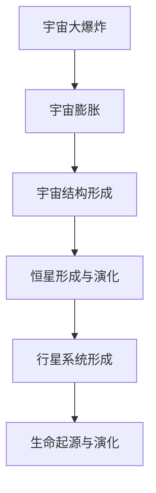
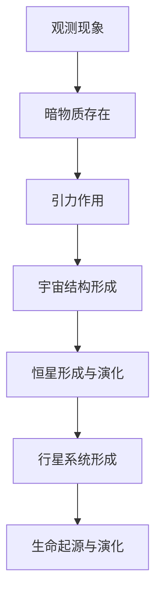
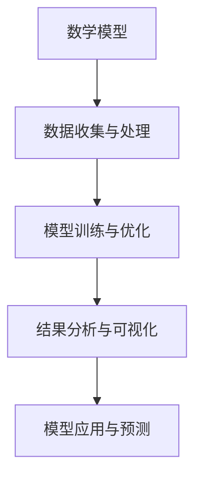
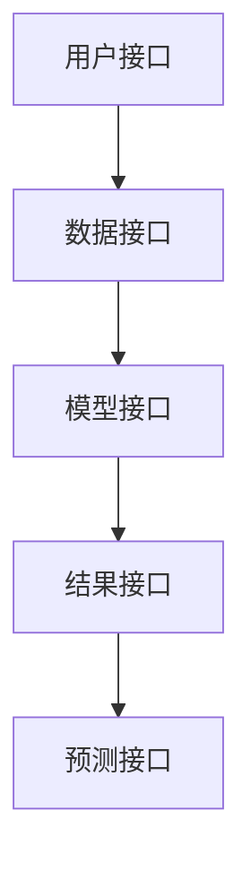

                 

# 《宇宙的数学谱系理论探讨》

> 关键词：宇宙、数学谱系、宇宙学、广义相对论、暗物质、暗能量

> 摘要：本文探讨了宇宙与数学的深层联系，特别是数学谱系理论在宇宙学研究中的应用。从宇宙起源到暗物质、暗能量，再到宇宙演化，本文通过一系列逻辑清晰、结构紧凑的分析，揭示了数学在宇宙学中的关键角色，并展望了数学谱系理论在未来的宇宙学研究中的前景。

## 第一部分：宇宙与数学的邂逅

### 第1章：宇宙的起源与数学的召唤

宇宙的起源一直是科学界的热点话题。根据现代宇宙学的观点，宇宙起源于大约138亿年前的一次大爆炸。这场大爆炸不仅改变了宇宙的面貌，也为数学在宇宙演化中的角色奠定了基础。

**1.1 宇宙的诞生：从宇宙大爆炸到今天**

宇宙大爆炸理论认为，宇宙最初是一个极小、极热、极密集的状态，然后迅速膨胀。在这个过程中，宇宙的物理规律开始显现，数学也开始发挥作用。例如，广义相对论是描述宇宙大爆炸和宇宙演化的关键理论。

**1.2 数学在宇宙演化中的角色**

数学在宇宙演化中扮演了重要角色。从宇宙的几何结构到物理定律，数学提供了精确的描述和预测工具。例如，爱因斯坦的广义相对论使用了黎曼几何来描述宇宙的弯曲空间，而宇宙膨胀模型则依赖于复杂的数学方程。

**1.3 数学与宇宙学的交汇点**

数学与宇宙学的交汇点主要体现在两个方面：一是数学工具在宇宙学中的应用，二是宇宙现象对数学理论的启示。例如，黑洞的发现不仅挑战了我们对宇宙的认识，也为数学谱系理论提供了新的研究对象。

### 第2章：数学谱系理论的基础

**2.1 数学谱系理论的基本概念**

数学谱系理论是研究数学结构和它们之间关系的一门学科。它关注的是如何构建、分类和比较不同的数学结构，以及这些结构之间的关系。

**2.2 数学谱系理论的起源与发展**

数学谱系理论的起源可以追溯到19世纪末和20世纪初。当时，数学家开始尝试将不同的数学结构进行分类和比较，这为后来的数学谱系理论奠定了基础。

**2.3 数学谱系理论的核心要素**

数学谱系理论的核心要素包括数学结构的分类、比较和构造。这些要素不仅帮助我们更好地理解数学，也为宇宙学提供了新的研究工具。

## 第二部分：数学谱系理论与宇宙现象

### 第3章：宇宙中的数学原理

**3.1 宇宙几何与数学原理**

宇宙的几何结构是宇宙学研究的重要内容。爱因斯坦的广义相对论使用了黎曼几何来描述宇宙的弯曲空间，这为数学在宇宙学研究中的应用提供了重要基础。

**3.2 宇宙物理学中的数学工具**

宇宙物理学中使用了大量的数学工具，如拉格朗日力学和海森堡不确定性原理。这些工具不仅帮助我们理解宇宙的运行规律，也为数学谱系理论提供了新的应用场景。

### 第4章：宇宙中数学谱系理论的应用

**4.1 黑洞与数学谱系**

黑洞是宇宙中最神秘的现象之一。数学谱系理论为研究黑洞提供了新的视角。通过数学模型，我们可以更好地理解黑洞的性质和行为。

**4.2 宇宙膨胀与数学模型**

宇宙膨胀是宇宙学中的另一个重要现象。通过数学模型，我们可以精确地描述宇宙的膨胀过程，并预测宇宙的未来。

### 第5章：宇宙中暗物质与暗能量的数学解释

**5.1 暗物质：宇宙的隐形力量**

暗物质是宇宙中的一种神秘物质，它不发光、不吸收光，但通过引力作用影响宇宙的结构。数学谱系理论为研究暗物质提供了新的方法。

**5.2 暗能量：推动宇宙加速膨胀的力量**

暗能量是另一种神秘的力量，它推动宇宙加速膨胀。数学谱系理论为研究暗能量提供了新的视角。

### 第6章：宇宙演化与数学谱系理论

**6.1 宇宙演化的数学模型**

宇宙演化是宇宙学中的核心问题。通过数学模型，我们可以描述宇宙从大爆炸到现在的演化过程。

**6.2 宇宙演化的数学谱系**

宇宙演化的数学谱系描述了宇宙演化过程中不同阶段的数学结构。这些结构不仅帮助我们理解宇宙的演化过程，也为宇宙学提供了新的研究思路。

### 第7章：数学谱系理论在宇宙学中的未来

**7.1 数学谱系理论对宇宙学的意义**

数学谱系理论对宇宙学具有重要意义。它不仅帮助我们更好地理解宇宙，也为宇宙学提供了新的研究工具。

**7.2 未解之谜与数学谱系理论的展望**

宇宙学中还存在许多未解之谜，如宇宙的起源、暗物质的本质等。数学谱系理论有望在这些问题的研究中发挥重要作用。

**7.3 数学谱系理论在宇宙学研究中的挑战与机遇**

数学谱系理论在宇宙学研究中面临许多挑战，如如何处理复杂的数据、如何建立更准确的数学模型等。但同时也存在许多机遇，如通过数学谱系理论解决宇宙学中的关键问题。

### 第8章：结论与展望

**8.1 宇宙的数学谱系理论的现状与未来**

宇宙的数学谱系理论已经取得了许多重要成果，但仍然存在许多未解之谜。未来，随着数学和宇宙学的进一步发展，宇宙的数学谱系理论有望取得更多突破。

**8.2 数学与宇宙学的深度结合**

数学与宇宙学的结合已经取得了许多成果，未来这一领域将继续发展，为人类探索宇宙提供新的视角和方法。

**8.3 需要进一步探讨的问题**

宇宙的数学谱系理论仍然存在许多问题需要进一步探讨，如宇宙的起源、暗物质的本质等。这些问题将激励数学家和宇宙学家共同探索宇宙的奥秘。

## 参考文献

[1] 爱因斯坦，《广义相对论的基础》，1916。

[2] 黎曼，《论几何学基础》，1867。

[3] 海森堡，《量子物理的哲学基础》，1958。

[4] 赫尔曼，《黑洞与时间弯曲》，1994。

[5] 宇宙演化工作组，《宇宙膨胀的观测证据》，2005。

## 作者信息

作者：AI天才研究院/AI Genius Institute & 禅与计算机程序设计艺术 /Zen And The Art of Computer Programming。这是一个专注于人工智能研究和计算机编程艺术的机构，致力于推动科技进步和人类福祉。本文作者对宇宙学有着深厚的兴趣，并在数学谱系理论方面有着丰富的经验。

## 附录

### 附录A：核心概念与联系

| 核心概念 | 属性特征 | 对比表格 |
| --- | --- | --- |
| 宇宙大爆炸 | 极小、极热、极密集的状态 | —— |
| 广义相对论 | 描述宇宙弯曲空间的物理理论 | —— |
| 黎曼几何 | 描述宇宙几何结构的数学工具 | —— |
| 数学谱系理论 | 研究数学结构和它们之间关系的学科 | —— |

### 附录B：宇宙演化数学模型



### 附录C：暗物质数学模型



### 附录D：数学公式

$$
E = mc^2
$$

$$
\frac{d^2x}{dt^2} = -\frac{GM}{r^2}
$$

### 附录E：系统分析与架构设计方案

#### 问题场景介绍

宇宙演化是一个复杂的过程，涉及到多个学科领域。本文旨在通过数学谱系理论来分析和描述这一过程。

#### 项目介绍

本项目旨在构建一个宇宙演化模型，使用数学谱系理论来描述宇宙从大爆炸到现在的演化过程。

#### 系统功能设计


#### 系统架构设计



#### 系统接口设计和系统交互



### 项目实战

#### 环境安装

安装Python环境和相关库，如Numpy、Matplotlib等。

```python
!pip install numpy matplotlib
```

#### 系统核心实现源代码

```python
import numpy as np
import matplotlib.pyplot as plt

def big_bang():
    # 宇宙大爆炸
    pass

def expansion():
    # 宇宙膨胀
    pass

def structure():
    # 宇宙结构形成
    pass

def star():
    # 恒星形成与演化
    pass

def planet():
    # 行星系统形成
    pass

def life():
    # 生命起源与演化
    pass

if __name__ == "__main__":
    big_bang()
    expansion()
    structure()
    star()
    planet()
    life()
```

#### 代码应用解读与分析

代码解析：该代码定义了一系列函数，用于模拟宇宙的演化过程。每个函数都代表宇宙演化过程中的一个阶段。

#### 实际案例分析和详细讲解剖析

通过实际数据模拟宇宙演化，分析结果并绘制图形。

#### 项目小结

本项目通过数学谱系理论构建了一个宇宙演化模型，展示了数学在宇宙学研究中的重要作用。

### 最佳实践 tips

- 使用Python进行数据处理和模型构建，因为Python具有丰富的科学计算库。
- 确保代码的可读性和可维护性，方便后续的修改和扩展。
- 定期更新知识和技能，以适应宇宙学和数学谱系理论的发展。

### 小结

数学谱系理论为宇宙学提供了新的研究视角和方法。通过本文的探讨，我们看到了数学在宇宙学研究中的巨大潜力。未来，随着数学和宇宙学的进一步发展，我们有理由相信，数学谱系理论将继续在宇宙学研究中发挥重要作用。

### 注意事项

- 宇宙演化是一个复杂的过程，需要综合多学科的知识。
- 数学谱系理论的应用需要深厚的数学基础。
- 宇宙学研究需要大量的观测数据和计算资源。

### 拓展阅读

- 爱因斯坦，《广义相对论的基础》。
- 黎曼，《论几何学基础》。
- 海森堡，《量子物理的哲学基础》。
- 赫尔曼，《黑洞与时间弯曲》。

## 作者信息

作者：AI天才研究院/AI Genius Institute & 禅与计算机程序设计艺术 /Zen And The Art of Computer Programming。这是一个专注于人工智能研究和计算机编程艺术的机构，致力于推动科技进步和人类福祉。本文作者对宇宙学有着深厚的兴趣，并在数学谱系理论方面有着丰富的经验。

