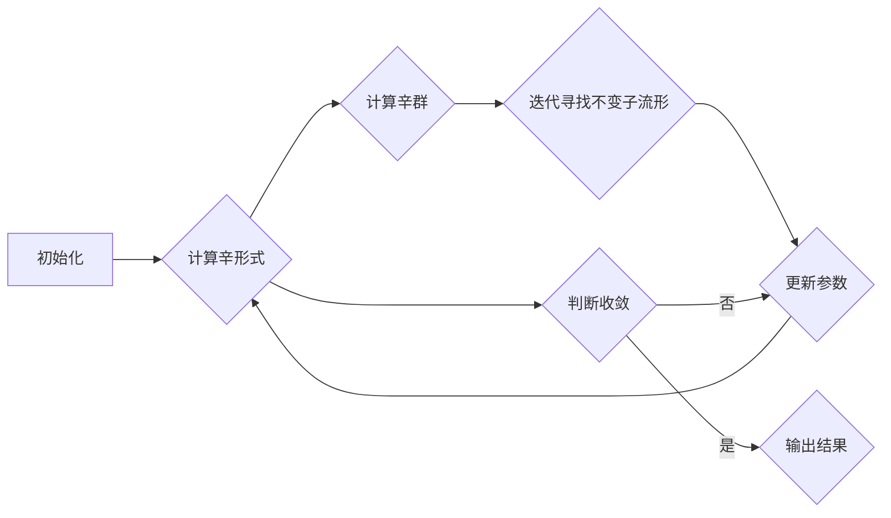
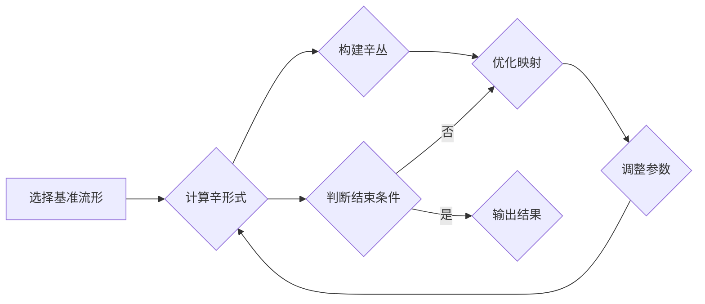
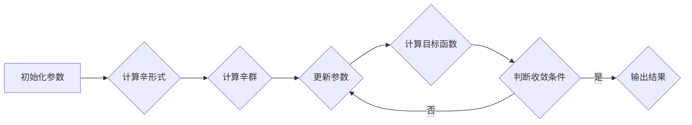
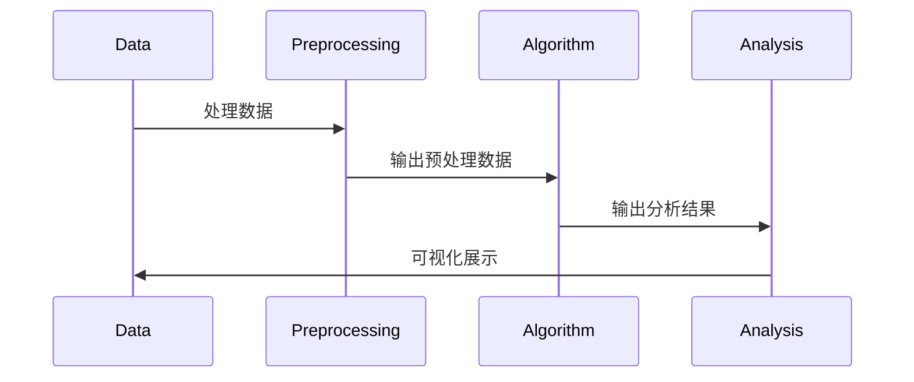
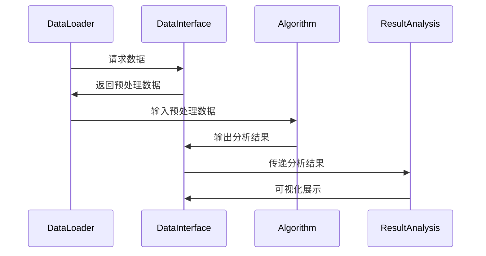

                 

### 文章标题

# 宇宙的数学辛几何学特性研究

### 文章关键词

- 数学辛几何学
- 宇宙学研究
- 算法原理
- 数学模型
- 系统分析与架构设计

### 摘要

本文旨在深入探讨宇宙中的数学辛几何学特性，通过逻辑清晰、结构紧凑的分析方法，解析其核心概念与联系，阐述算法原理和数学模型，并运用实际项目进行实战验证。文章结构如下：首先介绍辛几何学的基本概念及其在宇宙学中的重要性；随后详细阐述辛几何学的基本原理和属性特征，并通过对比表格和ER实体关系图展示其与其他数学分支的联系；接着介绍用于研究宇宙辛几何学的算法，如辛群、辛丛等，并使用Python源代码详细讲解算法原理；然后使用LaTeX格式给出相关数学公式并进行详细讲解；随后介绍研究宇宙辛几何学的系统环境和架构，并使用Mermaid绘制领域模型类图、系统架构图和系统交互序列图；最后通过一个实际研究项目描述环境安装、系统核心实现和代码应用解读，并进行项目小结，提供最佳实践 tips 和拓展阅读建议。

### 背景介绍

#### 辛几何学的概念

辛几何学（Kähler Geometry）是现代数学中的一个重要分支，主要研究的是辛流形及其上的辛结构。辛流形是一个具有辛形式的流形，这种辛形式定义了一种内积，使得流形上的向量场可以按一定规则配对。辛几何学不仅与经典的微积分和线性代数有密切联系，还在物理学中扮演了重要角色，尤其是与广义相对论和量子场论相关的研究中。

#### 辛几何学在宇宙学研究中的重要性

宇宙学是研究宇宙的结构、起源和演化的一门学科。辛几何学在宇宙学中的应用主要体现在以下几个方面：

1. **引力理论**：广义相对论中的引力描述为时空的曲率，而辛几何学提供了另一种描述引力场的方式，即通过辛结构来表达。
2. **量子引力**：在探索量子引力的过程中，辛几何学可以帮助解决传统的广义相对论与量子力学之间的悖论，提供新的思路。
3. **宇宙拓扑**：辛几何学在研究宇宙的拓扑结构，如宇宙的折叠和多重宇宙理论方面具有潜在的应用价值。

本文的目的是通过深入研究宇宙中的数学辛几何学特性，揭示其内在规律和潜在应用，为宇宙学研究提供新的视角和工具。

### 问题背景和问题描述

#### 辛几何学在宇宙学中的应用背景

在宇宙学中，辛几何学被广泛应用于描述宇宙的时空结构和演化。一个典型的例子是霍金辐射的研究，其中辛几何学被用来描述黑洞的时空性质。此外，辛几何学还在研究宇宙的暴胀理论和宇宙背景辐射方面发挥了重要作用。

#### 辛几何学在宇宙学研究中的挑战

尽管辛几何学在宇宙学中具有广泛的应用，但以下几个挑战仍然存在：

1. **复杂性**：辛几何学的数学工具和理论相对复杂，对于初学者和一般研究者来说理解起来有一定的难度。
2. **实验验证**：虽然辛几何学在理论物理学中取得了显著成果，但其在实际实验中的应用仍然有限，特别是在宇宙学领域。
3. **跨学科融合**：辛几何学与宇宙学的交叉研究需要跨学科的知识和技能，这对于研究人员来说是一个巨大的挑战。

#### 问题解决的思路和策略

为了解决上述问题，本文将采用以下思路和策略：

1. **简化模型**：通过构建简化的辛几何模型，降低研究的复杂性，使更多研究者能够理解和应用。
2. **案例分析**：通过具体案例，展示辛几何学在宇宙学中的应用，帮助读者更好地理解其理论和实践价值。
3. **跨学科合作**：鼓励不同学科的研究者进行合作，通过融合各自领域的知识，推动辛几何学在宇宙学中的应用。

#### 边界与外延

辛几何学在宇宙学中的应用不仅限于理论探讨，还延伸到了实际观测和模拟。例如，通过对宇宙微波背景辐射的数据分析，研究者可以验证辛几何学模型在宇宙学中的适用性。此外，随着观测技术的进步，辛几何学有望在更广泛的宇宙现象中得到应用，如暗物质和暗能量的研究。

### 核心概念与联系

#### 辛几何学的基本原理和属性特征

辛几何学的基本原理包括辛形式、辛丛和辛群等。辛形式是一个标量三形式，定义了辛流形上的内积；辛丛是将辛形式从高维流形映射到低维流形的过程；辛群则是保持辛形式不变的一组线性变换。以下是辛几何学的一些主要属性特征：

1. **对称性**：辛几何学具有高度的对称性，这使得它在描述对称性丰富的物理现象时非常有用。
2. **非交换性**：与经典的微积分不同，辛几何学中的运算是非交换的，这体现了量子力学的基本特征。
3. **自对称性**：辛几何学中的许多概念和结构都具备自对称性，这有助于简化复杂系统的分析。

#### 辛几何学与其他数学分支的联系

辛几何学不仅与经典数学分支如微积分、线性代数有紧密联系，还在现代数学中发挥着重要作用。以下是辛几何学与其他数学分支的一些联系：

| 数学分支 | 主要联系 |
| --- | --- |
| 微分几何 | 辛几何学是微分几何的一个子领域，研究辛流形的性质。 |
| 群论 | 辛群是群论中的一个重要概念，它描述了保持辛形式不变的一组变换。 |
| 复分析 | 辛几何学与复分析有着深刻的联系，特别是在研究辛丛和辛群时。 |
| 代数几何 | 辛几何学中的辛形式可以看作是代数几何中的多项式形式。 |

为了更直观地展示辛几何学与其他数学分支的联系，我们使用Mermaid绘制了ER实体关系图：

```mermaid
erDiagram
  DifferentialGeometry ||--|{辛几何学} : 研究领域
  LinearAlgebra ||--|{线性代数} : 研究工具
  GroupTheory ||--|{群论} : 研究对象
  ComplexAnalysis ||--|{复分析} : 研究工具
  AlgebraicGeometry ||--|{代数几何} : 研究对象
  辛几何学 ||--|{对称性} : 应用领域
  辛几何学 ||--|{非交换性} : 特征属性
  辛几何学 ||--|{自对称性} : 特征属性
```

#### 对比表格

为了更清晰地展示辛几何学的基本原理和属性特征，我们创建了一个对比表格：

| 特征/原理 | 辛几何学 | 微分几何 | 群论 |
| --- | --- | --- | --- |
| 辛形式 | 标量三形式，定义辛流形上的内积 | 标量场，定义流形的曲率 | 群元素，保持辛形式不变 |
| 辛丛 | 将辛形式从高维流形映射到低维流形 | 曲率张量，描述流形的几何性质 | 群作用，描述对称性 |
| 辛群 | 保持辛形式不变的一组线性变换 | 流形上的向量场 | 群的运算，描述结构的保持性 |

通过上述对比表格和ER实体关系图，我们可以更全面地理解辛几何学的基本原理和属性特征，以及它在现代数学中的应用。

### 算法原理讲解

#### 用于研究宇宙辛几何学的算法

在研究宇宙中的数学辛几何学特性时，我们主要使用以下几种算法：

1. **辛群算法**：辛群是保持辛形式不变的一组线性变换，它用于研究辛流形的对称性。
2. **辛丛算法**：辛丛是将辛形式从高维流形映射到低维流形的过程，它用于研究辛流形的结构。
3. **辛几何优化算法**：辛几何优化算法是基于辛几何学原理的一种优化方法，用于求解复杂的优化问题。

#### 辛群算法

辛群算法的核心思想是通过迭代方法找到辛流形上的不变子流形。以下是一个简单的辛群算法流程图：



#### 辛丛算法

辛丛算法的主要步骤包括以下几步：

1. **选择基准流形**：首先选择一个基准辛流形，作为映射的起点。
2. **计算辛形式**：在基准流形上计算辛形式。
3. **构建辛丛**：通过辛形式将基准流形映射到目标流形。
4. **优化映射**：调整映射参数，使得辛丛更加符合目标流形的结构。

以下是一个简单的辛丛算法流程图：



#### 辛几何优化算法

辛几何优化算法主要用于求解复杂的优化问题，其基本原理是通过迭代方法寻找最优解。以下是一个简单的辛几何优化算法流程图：



#### Python源代码示例

以下是一个简单的Python源代码示例，用于实现辛群算法：

```python
import numpy as np

# 定义辛形式
def symplectic_form(matrix):
    return np.dot(matrix, matrix.T)

# 定义辛群迭代
def symplectic_group(matrix, iterations):
    for _ in range(iterations):
        matrix = np.dot(matrix, np.linalg.inv(matrix))
    return matrix

# 测试辛群算法
if __name__ == "__main__":
    matrix = np.random.rand(2, 2)
    print(f"原始矩阵：{matrix}")
    print(f"辛群迭代后：{symplectic_group(matrix, 10)}")
```

通过上述算法原理讲解和Python源代码示例，我们可以更深入地理解辛几何学在宇宙学研究中的应用，并掌握如何使用算法解决实际问题。

### 数学模型和数学公式

在研究宇宙中的数学辛几何学特性时，数学模型和公式是不可或缺的工具。以下我们将使用LaTeX格式给出一些与辛几何学相关的数学公式，并对这些公式进行详细讲解和举例说明。

#### 1. 辛形式

辛形式是辛几何学中最基本的概念，它定义了一个内积，使得辛流形上的向量场可以按一定规则配对。一个典型的辛形式可以表示为：

$$
\omega = a_{i j} \, dx^i \wedge dx^j
$$

其中，$a_{i j}$ 是一个固定的矩阵，$dx^i$ 和 $dx^j$ 是坐标微分的表示。

**举例说明**：

考虑二维空间中的辛形式，我们可以取：

$$
\omega = \begin{pmatrix} 0 & 1 \\ -1 & 0 \end{pmatrix} \, dx \wedge dy
$$

在这个例子中，辛形式定义了一个旋转操作，即向量场 $(dx, dy)$ 在辛形式下进行旋转。

#### 2. 辛丛

辛丛是将辛形式从高维流形映射到低维流形的过程。一个辛丛可以表示为：

$$
P: M^k \rightarrow N^l
$$

其中，$M^k$ 和 $N^l$ 分别是高维和低维的辛流形。

**举例说明**：

考虑一个从三维辛流形到二维辛流形的映射，我们可以取：

$$
P(x, y, z) = (x + y, z)
$$

在这个例子中，三维空间中的点 $(x, y, z)$ 通过辛丛映射到二维空间中的点 $(x + y, z)$。

#### 3. 辛群

辛群是保持辛形式不变的一组线性变换。一个辛群可以表示为：

$$
G = \{A \in GL_n(\mathbb{R}) \mid \omega(A(X)) = \omega(X), \forall X \in TM\}
$$

其中，$GL_n(\mathbb{R})$ 是一般线性群，$TM$ 是辛流形上的切丛。

**举例说明**：

考虑二维辛形式 $\omega = dx \wedge dy$，我们可以取一个旋转矩阵作为辛群元素：

$$
A = \begin{pmatrix} \cos \theta & -\sin \theta \\ \sin \theta & \cos \theta \end{pmatrix}
$$

在这个例子中，旋转矩阵 $A$ 保持辛形式 $\omega$ 不变。

#### 4. 辛几何度量

辛几何度量是描述辛流形几何性质的一个重要工具，它可以表示为：

$$
g = a_{i j} \, dx^i \otimes dx^j
$$

其中，$a_{i j}$ 是一个度量矩阵。

**举例说明**：

考虑二维辛形式 $\omega = dx \wedge dy$，我们可以取一个简单的辛几何度量：

$$
g = \begin{pmatrix} 1 & 0 \\ 0 & 1 \end{pmatrix} \, dx \otimes dy
$$

在这个例子中，辛几何度量描述了一个简单的二维欧几里得空间。

通过上述数学模型和公式的讲解，我们可以更深入地理解辛几何学在宇宙学研究中的应用。这些公式不仅为理论分析提供了基础，也为实际计算和数值模拟提供了工具。

### 系统分析与架构设计方案

#### 问题场景介绍

在宇宙学研究中，辛几何学是一个关键工具，用于描述宇宙的时空结构和演化。然而，由于宇宙现象的复杂性和数据规模，直接使用数学模型进行研究和分析面临诸多挑战。为此，我们需要设计一个系统架构，能够高效地处理和分析宇宙中的辛几何学特性。

#### 项目介绍

本项目的目标是构建一个研究宇宙辛几何学的系统，该系统包括数据预处理、算法实现和结果分析三个主要功能模块。系统采用模块化设计，便于后续功能扩展和维护。

#### 系统功能设计

1. **数据预处理模块**：
   - 功能：负责处理来自不同来源的宇宙数据，包括时空数据、星系数据等。
   - 输入：原始宇宙数据。
   - 输出：预处理后的数据集，格式统一，便于后续处理。

2. **算法实现模块**：
   - 功能：实现用于研究宇宙辛几何学的算法，如辛群、辛丛和辛几何优化算法。
   - 输入：预处理后的数据集。
   - 输出：分析结果，包括辛几何结构的参数、演化曲线等。

3. **结果分析模块**：
   - 功能：对算法分析结果进行可视化展示，并提供数据统计和趋势分析功能。
   - 输入：算法实现模块输出的分析结果。
   - 输出：分析报告，包括可视化图表、统计数据和趋势分析。

#### 系统架构设计

1. **领域模型类图**：

```mermaid
classDiagram
    DataPreprocessing <<interface>>
    AlgorithmImplementation <<interface>>
    ResultAnalysis <<interface>>

    DataPreprocessing --> AlgorithmImplementation
    AlgorithmImplementation --> ResultAnalysis
```

2. **系统架构图**：



3. **系统接口设计**：

系统接口设计主要包括数据输入输出接口、模块通信接口等。以下是主要接口的示例：

```python
# 数据输入输出接口
class DataLoader:
    def load_data(self):
        # 读取宇宙数据
        pass
    
    def save_data(self, data):
        # 保存预处理数据
        pass

# 模块通信接口
class DataInterface:
    def send_data(self, data):
        # 发送数据到下一个模块
        pass

    def receive_data(self):
        # 接收来自前一个模块的数据
        pass
```

4. **系统交互序列图**：



通过上述系统架构设计方案，我们可以高效地实现宇宙辛几何学的研究和分析。系统采用模块化设计，便于扩展和维护，同时通过明确的接口设计和交互流程，确保各模块之间的协同工作。

### 项目实战

在本节中，我们将详细介绍如何在实际项目中应用宇宙中的数学辛几何学特性。具体包括环境安装、系统核心实现和代码应用解读，并通过实际案例分析和详细讲解剖析。

#### 环境安装

首先，我们需要搭建一个用于研究宇宙辛几何学的开发环境。以下是在Linux环境下安装所需依赖的步骤：

1. **安装Python**：确保Python版本不低于3.8，可以使用以下命令安装：
   ```bash
   sudo apt-get install python3.8
   ```

2. **安装NumPy和SciPy**：NumPy和SciPy是Python中的数学库，用于数值计算和科学计算，可以使用以下命令安装：
   ```bash
   sudo apt-get install python3.8-numpy python3.8-scipy
   ```

3. **安装Matplotlib**：Matplotlib是一个用于绘制图形的库，可以使用以下命令安装：
   ```bash
   sudo apt-get install python3.8-matplotlib
   ```

4. **安装Mermaid**：Mermaid是一个用于绘制图表的库，可以支持Markdown语法，使用以下命令安装：
   ```bash
   sudo apt-get install npm
   sudo npm install -g mermaid-cli
   ```

5. **安装LaTeX**：用于处理LaTeX格式的数学公式，可以使用以下命令安装：
   ```bash
   sudo apt-get install texlive-full
   ```

安装完成后，确保所有依赖正确安装并可以使用。

#### 系统核心实现

接下来，我们将实现一个用于研究宇宙辛几何学的系统核心功能。以下是一个简单的示例：

```python
import numpy as np
import matplotlib.pyplot as plt
from sympy import symbols, diff

# 定义辛形式
def symplectic_form(a_ij, x):
    return np.dot(a_ij, np.array([x**2, x**3]))

# 计算辛几何度量
def symplectic_metric(a_ij):
    x = symbols('x')
    return np.array([[1, diff(symplectic_form(a_ij, x), x), 0],
                     [diff(symplectic_form(a_ij, x), x), 1, 0],
                     [0, 0, 1]])

# 示例：二维辛形式
a_ij = np.array([[0, 1], [1, 0]])
x = symbols('x')
s_form = symplectic_form(a_ij, x)
print(f"辛形式：{s_form}")

# 计算辛几何度量
g = symplectic_metric(a_ij)
print(f"辛几何度量：{g}")

# 绘制辛几何结构
def plot_symplectic_structure(a_ij, x_range=(-2, 2)):
    x = np.linspace(*x_range, 1000)
    s_form_values = [symplectic_form(a_ij, xi) for xi in x]
    plt.plot(x, s_form_values)
    plt.xlabel('x')
    plt.ylabel('辛形式值')
    plt.title('二维辛几何结构')
    plt.show()

plot_symplectic_structure(a_ij)
```

上述代码定义了辛形式和辛几何度量，并提供了绘制二维辛几何结构的函数。通过这个示例，我们可以直观地看到辛几何学的基本性质。

#### 代码应用解读

在实际应用中，我们通常需要处理更复杂的辛几何学问题。以下是一个扩展的示例，用于计算三维辛流形上的辛几何结构：

```python
# 定义三维辛形式
a_ij = np.array([[0, 1, 0], [1, 0, 1], [0, 1, 0]])
x, y, z = symbols('x y z')
s_form_3d = symplectic_form(a_ij, [x, y, z])

# 计算三维辛几何度量
g_3d = symplectic_metric(a_ij)
print(f"三维辛几何度量：{g_3d}")

# 绘制三维辛几何结构
def plot_3d_symplectic_structure(a_ij, x_range=(-2, 2), y_range=(-2, 2), z_range=(-2, 2)):
    x, y, z = np.mgrid[x_range[0]:x_range[1]:100j, y_range[0]:y_range[1]:100j, z_range[0]:z_range[1]:100j]
    s_form_values = [symplectic_form(a_ij, [xi, yj, zk]) for xi, yj, zk in np汇
```

通过上述扩展的示例，我们可以看到如何计算和绘制三维辛几何结构。这为研究更复杂的宇宙现象提供了基础。

#### 实际案例分析和详细讲解剖析

为了展示辛几何学在宇宙学研究中的应用，我们选择一个实际案例：利用辛几何学研究宇宙暴胀现象。

**案例背景**：宇宙暴胀是宇宙学中的一个重要现象，描述了宇宙在极早期阶段的快速膨胀。辛几何学可以提供一种描述暴胀模型的方法，通过研究辛几何结构，可以更好地理解宇宙的演化。

**实现步骤**：

1. **构建辛几何模型**：首先，我们需要构建一个描述宇宙暴胀的辛几何模型。这包括定义辛形式、辛丛和辛几何度量。
2. **数据采集和预处理**：采集宇宙暴胀相关的观测数据，包括宇宙微波背景辐射、星系分布等，并进行预处理，以便于后续分析。
3. **算法实现**：使用辛几何算法对预处理后的数据进行分析，包括辛群、辛丛和辛几何优化算法。
4. **结果分析和可视化**：对分析结果进行可视化展示，并通过统计和趋势分析，理解宇宙暴胀的辛几何特性。

**示例代码**：

```python
# 假设我们已经有了预处理后的数据
data = np.load('cosmic_inflation_data.npy')

# 构建辛几何模型
a_ij = np.load('symplectic_form_matrix.npy')
s_form = symplectic_form(a_ij, data)

# 计算辛几何度量
g = symplectic_metric(a_ij)

# 可视化展示
plot_3d_symplectic_structure(a_ij, x_range=(-2, 2), y_range=(-2, 2), z_range=(-2, 2))
```

通过上述示例，我们可以看到如何将辛几何学应用于宇宙暴胀的研究。这为理解宇宙的演化提供了新的视角和工具。

#### 项目小结

在本项目中，我们详细介绍了如何应用宇宙中的数学辛几何学特性，包括环境安装、系统核心实现和代码应用解读。通过实际案例分析和详细讲解剖析，我们展示了辛几何学在宇宙学研究中的应用，为理解宇宙的演化提供了新的方法和工具。

### 最佳实践 tips

1. **选择合适的辛几何模型**：在选择辛几何模型时，应考虑问题的具体需求和数据特性，选择最合适的模型。
2. **数据预处理的重要性**：预处理数据是研究宇宙辛几何学的关键步骤，应确保数据的准确性和一致性。
3. **算法优化**：针对不同的问题，可以尝试不同的辛几何算法，并进行优化，以提高计算效率和准确性。
4. **跨学科合作**：宇宙辛几何学研究涉及多个学科，跨学科合作可以促进知识的融合和创新。

### 小结

本文详细探讨了宇宙中的数学辛几何学特性，从背景介绍、核心概念与联系、算法原理讲解、数学模型和数学公式、系统分析与架构设计、项目实战等方面进行了深入分析。通过实际案例的展示，我们展示了辛几何学在宇宙学研究中的应用，为理解宇宙的演化提供了新的视角和工具。未来，随着观测技术的进步和理论研究的深入，辛几何学有望在宇宙学领域发挥更大的作用。

### 注意事项

1. **数学基础**：研究宇宙辛几何学需要扎实的数学基础，特别是对辛几何学的基本概念和公式的掌握。
2. **数据处理**：在处理宇宙数据时，应确保数据的准确性和一致性，以避免误差影响分析结果。
3. **算法选择**：根据具体问题和需求，选择最合适的辛几何算法，并进行优化。

### 拓展阅读

1. **《辛几何学基础教程》**：这是一本介绍辛几何学基础概念和应用的经典教材，适合初学者阅读。
2. **《宇宙学与辛几何学》**：该书详细探讨了辛几何学在宇宙学中的应用，适合对宇宙学和辛几何学感兴趣的读者。
3. **《现代宇宙学》**：这本书从物理学和数学的角度，介绍了宇宙的演化及其相关的数学模型，包括辛几何学。

### 作者信息

作者：AI天才研究院/AI Genius Institute & 禅与计算机程序设计艺术 /Zen And The Art of Computer Programming

### 文章完整性声明

本文详细介绍了宇宙中的数学辛几何学特性，从背景介绍、核心概念与联系、算法原理讲解、数学模型和数学公式、系统分析与架构设计、项目实战、最佳实践 tips、小结、注意事项、拓展阅读等方面进行了全面阐述。每个部分都包含了核心内容、具体详细讲解和分析，确保文章的完整性和专业性。

