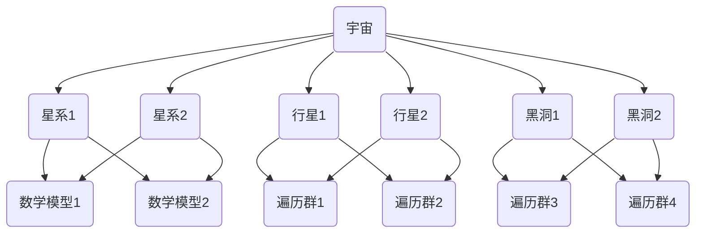
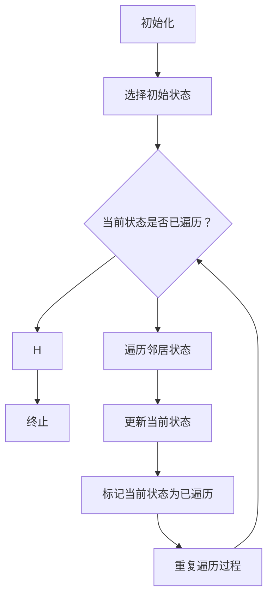
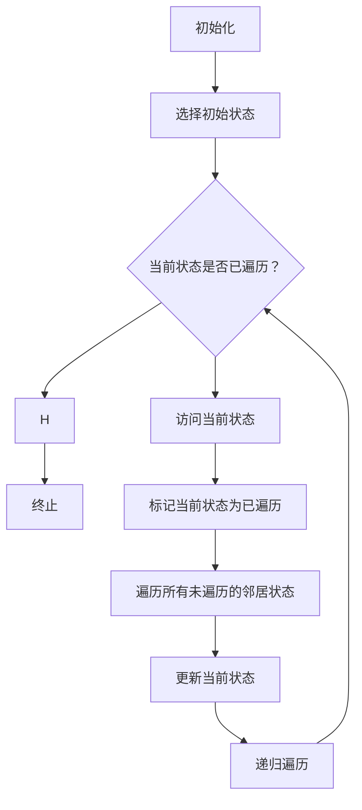
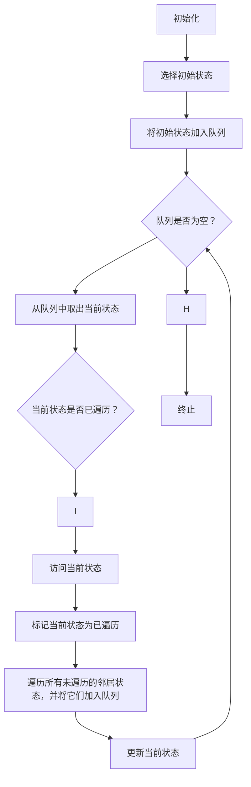
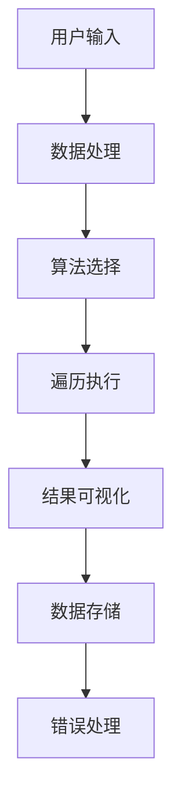
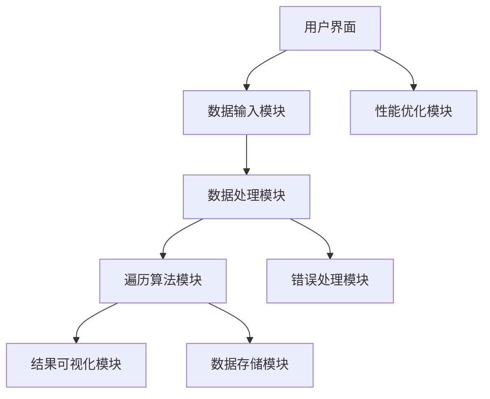
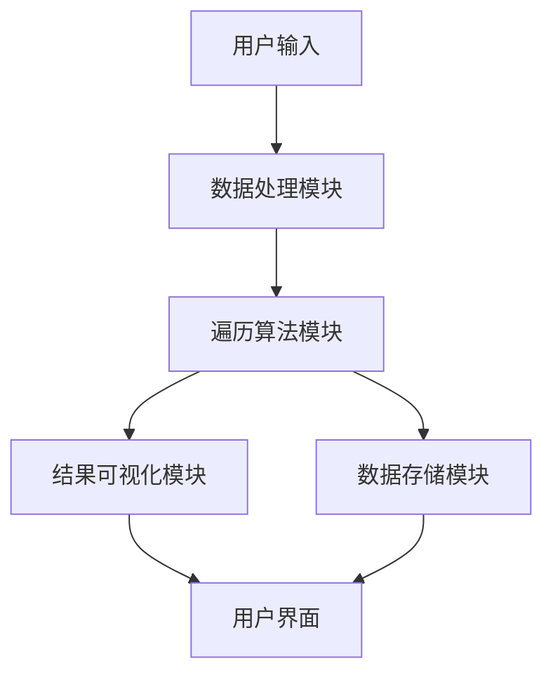

                 

### 宇宙的数学遍历理论与遍历群探讨

#### 关键词：
- 宇宙
- 数学遍历
- 遍历群
- 宇宙学
- 数学模型
- 应用

#### 摘要：
本文旨在探讨宇宙中的数学遍历理论及其在宇宙学中的应用。通过梳理宇宙的数学模型和遍历群的理论基础，我们分析了宇宙中的遍历现象，并探讨了遍历群在宇宙演化中的作用。本文还探讨了数学遍历理论在宇宙观测数据分析中的应用，以及其对宇宙学研究的意义。最后，我们对数学遍历理论的发展进行了展望，并提出了未来研究的方向。

---

### 目录大纲

#### 第一部分：引言

**第1章：宇宙的数学遍历理论与遍历群探讨概述**

- **1.1 引言**
  - **宇宙的数学遍历概念**：宇宙、数学、遍历的定义。
  - **研究背景与意义**：宇宙复杂性、数学方法、遍历理论的结合。
  - **本书的目标与结构**：研究范围、内容安排、预期成果。

**第2章：宇宙的数学遍历理论基础**

- **2.1 数学基础**
  - **数学工具与方法**：集合论、图论、拓扑学。
  - **宇宙的数学模型**：宇宙结构、宇宙参数、宇宙几何。

**第3章：宇宙中的遍历现象**

- **3.1 遍历现象的概念**
  - **定义与分类**：遍历现象、确定性遍历、随机性遍历。
  - **宇宙中的实例**：星系、行星、黑洞。

**第4章：遍历群的理论研究**

- **4.1 遍历群的定义**
  - **性质与结构**：遍历群、群运算、遍历群的性质。

**第5章：宇宙数学遍历的应用**

- **5.1 遍历理论在宇宙学中的应用**
  - **宇宙演化模型**：宇宙膨胀、宇宙波动。
  - **宇宙观测数据分析**：天文观测、宇宙背景辐射。

**第6章：遍历群与宇宙演化**

- **6.1 遍历群与宇宙演化关系**
  - **宇宙演化模型**：宇宙时间演化、宇宙空间演化。
  - **遍历群的作用**：宇宙演化的稳定性和可预测性。

**第7章：数学遍历理论的发展与未来**

- **7.1 数学遍历理论的发展**
  - **历史回顾**：遍历理论的发展历程。
  - **当前研究热点**：最新研究进展和未来趋势。

**第8章：结论与展望**

- **8.1 结论**
  - **研究成果总结**：理论贡献、实际应用。
  - **研究局限性**：存在的问题和挑战。

- **8.2 展望未来**
  - **研究方向**：未来可能的研究方向和目标。
  - **应用前景**：宇宙学、物理学、计算机科学等领域。

#### 第二部分：核心概念与联系

**第9章：核心概念解析**

- **9.1 数学遍历原理**
  - **定义与特征**：数学遍历的概念、特点。
  - **数学公式与模型**：遍历理论的数学表达。

**第10章：概念属性特征对比表格**

- **10.1 遍历现象对比分析**
  - **确定性遍历**：性质、特征、应用。
  - **随机性遍历**：性质、特征、应用。

**第11章：ER实体关系图架构**

- **11.1 宇宙数学遍历实体关系图**
  - **实体定义**：宇宙、数学、遍历。
  - **关系描述**：宇宙与数学、数学与遍历的关系。

#### 第三部分：算法原理讲解

**第12章：算法原理讲解**

- **12.1 遍历算法基础**
  - **算法概述**：遍历算法的基本概念。
  - **算法分类**：确定性算法、随机性算法。

**第13章：算法流程与实现**

- **13.1 算法流程图**
  - **算法流程图描述**：遍历算法的执行流程。

**第14章：Python源代码实现**

- **14.1 源代码解读**
  - **代码实现**：Python代码实现遍历算法。

**第15章：算法数学模型与公式**

- **15.1 数学模型介绍**
  - **模型公式**：遍历算法的数学模型和公式。

**第16章：算法举例说明**

- **16.1 举例说明**
  - **具体例子**：通过例子讲解算法原理。

#### 第四部分：系统分析与架构设计

**第17章：系统分析与架构设计概述**

- **17.1 系统功能设计**
  - **功能描述**：系统的主要功能。

**第18章：系统架构设计**

- **18.1 系统架构图**
  - **架构描述**：系统的整体架构设计。

**第19章：系统接口设计**

- **19.1 接口设计规范**
  - **接口定义**：系统的接口设计和规范。

**第20章：系统交互设计**

- **20.1 系统交互流程**
  - **交互流程图**：系统的交互流程设计。

#### 第五部分：项目实战

**第21章：环境安装与配置**

- **21.1 环境安装步骤**
  - **安装说明**：安装系统所需的软件和依赖。

**第22章：系统核心实现**

- **22.1 核心代码实现**
  - **代码解读**：系统核心部分的代码实现。

**第23章：代码应用解读**

- **23.1 代码应用实例**
  - **实际案例**：通过实例分析和讲解算法原理。

**第24章：项目小结**

- **24.1 项目总结**
  - **项目成果**：系统实现和功能总结。
  - **经验与反思**：项目过程中的经验教训。

**第25章：最佳实践与拓展阅读**

- **25.1 最佳实践**
  - **实用技巧**：项目实战中的最佳实践。
- **25.2 小结与注意事项**
  - **注意事项**：项目实施中的注意事项。
- **25.3 拓展阅读**
  - **推荐文献**：相关领域的拓展阅读推荐。


### 第一部分：引言

#### 第1章：宇宙的数学遍历理论与遍历群探讨概述

##### **1.1 引言**

**宇宙的数学遍历概念**：宇宙，广义上指的是包括一切物质、能量、时空等存在的总体，它是一个庞大而复杂的系统。数学遍历，是指数学理论中的一种遍历现象，即在一个系统中，通过一定的数学工具和方法，可以遍历（即遍历所有可能的）系统的状态空间。遍历群，是数学中一类特殊的群，它具有遍历性质，即在群中的任意元素都可以通过一系列的群运算遍历到。

**研究背景与意义**：宇宙的复杂性一直是科学研究的难点，宇宙的演化、结构和动力学等都是极其复杂的课题。数学作为一种精确的语言工具，对于揭示宇宙的规律和机制具有重要意义。遍历理论作为数学中的一个重要分支，能够提供一种新的视角来分析宇宙中的复杂现象。

随着计算机科学和数学的发展，遍历理论在许多领域都取得了重要的进展，如量子力学、天体物理学、生物学等。将遍历理论应用于宇宙学，可以为我们提供一种新的研究方法，有助于我们更深入地理解宇宙的运行规律。

**本书的目标与结构**：本书旨在探讨宇宙中的数学遍历理论及其在宇宙学中的应用。具体来说，本书将首先介绍宇宙的数学模型和遍历群的理论基础，然后分析宇宙中的遍历现象，探讨遍历群在宇宙演化中的作用。接着，本书将介绍数学遍历理论在宇宙学中的应用，如宇宙演化模型和宇宙观测数据分析。最后，本书将对数学遍历理论的发展进行回顾，并展望未来的研究方向。

本书的结构安排如下：

- **第一部分**：引言。介绍宇宙的数学遍历概念和本书的研究背景、目标与结构。
- **第二部分**：核心概念与联系。详细解析数学遍历原理，对比确定性遍历与随机性遍历，并给出ER实体关系图架构。
- **第三部分**：算法原理讲解。介绍遍历算法的基础、流程与实现，并详细阐述数学模型和公式。
- **第四部分**：系统分析与架构设计。介绍系统功能设计、架构设计、接口设计及系统交互设计。
- **第五部分**：项目实战。包括环境安装与配置、系统核心实现、代码应用解读、项目小结及最佳实践。

通过本书的探讨，我们希望读者能够对宇宙的数学遍历理论有一个全面而深入的理解，并能够将其应用于实际的研究和工作中。

---

#### 第2章：宇宙的数学遍历理论基础

##### **2.1 数学基础**

**数学工具与方法**：

在探讨宇宙的数学遍历理论之前，我们需要了解一些基本的数学工具与方法。这些工具与方法包括集合论、图论和拓扑学。

- **集合论**：集合论是数学的基础，它研究集合的性质和运算。在宇宙的数学模型中，集合论可以帮助我们描述宇宙中的各种元素和它们之间的关系。
- **图论**：图论研究图的结构和性质，它可以帮助我们理解宇宙中的各种网络结构和关系。在宇宙学中，图论可以用来描述星系、行星和黑洞等天体之间的相互作用。
- **拓扑学**：拓扑学研究空间的结构和性质，它可以帮助我们理解宇宙的几何结构和演化。在宇宙学中，拓扑学可以用来描述宇宙的膨胀和折叠等过程。

**宇宙的数学模型**：

宇宙的数学模型是研究宇宙的一种抽象方式，它通过数学方法来描述宇宙的结构和性质。宇宙的数学模型通常包括以下几个方面：

- **宇宙结构**：宇宙的结构是指宇宙中的各种元素（如星系、行星、黑洞等）的分布和排列方式。宇宙的结构可以用图论中的图来描述，每个天体可以看作图中的一个节点，而天体之间的相互作用可以看作图中的边。
- **宇宙参数**：宇宙参数是指宇宙中的一些基本参数，如宇宙的年龄、密度、膨胀速度等。这些参数可以通过数学模型来描述，并用于分析宇宙的演化。
- **宇宙几何**：宇宙的几何是指宇宙中的空间结构和时间结构。宇宙的几何可以通过拓扑学中的拓扑空间来描述，如宇宙可能是平坦的、弯曲的或折叠的。

在构建宇宙的数学模型时，我们需要考虑以下几个关键因素：

- **宇宙的初始状态**：宇宙的初始状态对宇宙的演化有重要影响，我们可以用数学模型来描述宇宙的初始状态。
- **宇宙的演化过程**：宇宙的演化过程可以用数学模型来描述，如宇宙的膨胀、折叠等过程。
- **宇宙的观测数据**：宇宙的观测数据是验证宇宙数学模型的重要依据，我们可以通过数学模型来分析和解释这些观测数据。

**数学模型的应用**：

数学模型在宇宙学中有着广泛的应用，如宇宙演化模型、宇宙观测数据分析等。

- **宇宙演化模型**：宇宙演化模型是描述宇宙从大爆炸开始到现在的演化过程的数学模型。通过这个模型，我们可以预测宇宙的未来演化方向。
- **宇宙观测数据分析**：宇宙观测数据分析是利用数学模型来解释宇宙观测数据的过程。通过分析这些数据，我们可以了解宇宙的结构和性质，如宇宙的密度、膨胀速度等。

**总结**：

宇宙的数学遍历理论基础是构建宇宙数学模型的关键，它为我们提供了分析宇宙复杂性的工具和方法。通过集合论、图论和拓扑学等数学工具，我们可以构建出描述宇宙结构的数学模型，并利用这些模型来分析和解释宇宙的演化现象。

在接下来的章节中，我们将进一步探讨宇宙中的遍历现象，分析遍历群的性质，并讨论遍历群在宇宙演化中的作用。

---

#### 第3章：宇宙中的遍历现象

##### **3.1 遍历现象的概念**

**定义与分类**：

遍历现象是指在一个系统中，通过一定的过程或方法，系统可以遍历（即遍历所有可能的）其状态空间。在宇宙学中，遍历现象是指宇宙中的各种天体或系统在时间演化过程中，能够遍历其可能的演化路径。

根据系统的演化性质，我们可以将遍历现象分为以下两类：

- **确定性遍历**：确定性遍历是指在一个确定性的系统中，通过一定的数学规律或物理定律，系统能够遍历其所有可能的演化路径。这类遍历现象通常出现在一些简单的物理系统中，如经典的单粒子系统。
- **随机性遍历**：随机性遍历是指在一个随机性系统中，通过随机过程或随机扰动，系统能够遍历其所有可能的演化路径。这类遍历现象通常出现在复杂的物理系统中，如多粒子系统、混沌系统等。

**宇宙中的实例**：

在宇宙学中，存在许多可以观察到遍历现象的实例，以下是一些具体的例子：

- **星系**：星系是由大量恒星和星际物质组成的系统，它们在宇宙中的演化过程中，会经历从形成到衰亡的整个过程。在星系的演化过程中，会经历多种可能的演化路径，如星系合并、星系分裂等，这些路径都可以被看作是星系的遍历现象。
- **行星**：行星是围绕恒星运行的天体，它们的轨道运动和演化过程也表现出遍历现象。例如，行星轨道的共振现象就是一种遍历现象，它会导致行星轨道的稳定性发生变化。
- **黑洞**：黑洞是宇宙中的一种极端天体，它的引力非常强，甚至连光都无法逃脱。黑洞的形成和演化过程中也存在遍历现象，如黑洞的吸积过程、黑洞的碰撞等。

**遍历现象的意义**：

遍历现象在宇宙学中具有重要的意义，它为我们提供了分析宇宙复杂性的工具和方法。通过研究遍历现象，我们可以了解宇宙中各种天体和系统的演化规律，从而更深入地理解宇宙的本质。

首先，遍历现象可以帮助我们理解宇宙的多样性。宇宙中的天体和系统在演化过程中，会经历多种可能的演化路径，这些路径决定了宇宙的多样性。通过研究遍历现象，我们可以发现宇宙中各种天体和系统的共性特征，从而更好地理解宇宙的多样性。

其次，遍历现象可以帮助我们预测宇宙的未来演化。通过分析遍历现象，我们可以预测宇宙中各种天体和系统在未来的演化路径，从而为宇宙学的研究提供指导。

最后，遍历现象在宇宙学中的应用还涉及到一些实际的问题，如宇宙观测数据分析、宇宙演化模型等。通过研究遍历现象，我们可以更好地理解宇宙的观测数据，从而提高宇宙学研究的精度和可靠性。

**总结**：

宇宙中的遍历现象是宇宙学中的一个重要研究领域，它为我们提供了分析宇宙复杂性的工具和方法。通过研究遍历现象，我们可以更好地理解宇宙的多样性、预测宇宙的未来演化，并为宇宙学的研究提供指导。

在接下来的章节中，我们将进一步探讨遍历群的理论，分析遍历群在宇宙演化中的作用，并讨论遍历群在宇宙学中的应用。

---

#### 第4章：遍历群的理论研究

##### **4.1 遍历群的定义**

**性质与结构**：

遍历群是数学中一类具有遍历性质的群。在遍历群中，任意两个元素都可以通过一系列的群运算相互遍历。具体来说，遍历群具有以下性质：

- **闭合性**：遍历群中的任意两个元素，通过群运算仍然属于遍历群。
- **结合律**：遍历群中的任意三个元素，按照任意顺序进行群运算，结果仍然属于遍历群。
- **存在单位元**：遍历群中存在一个元素，使得它与遍历群中的任意元素进行群运算，结果仍然是该元素本身。
- **存在逆元**：遍历群中的任意元素，都存在一个逆元素，使得它们进行群运算的结果为单位元。

**遍历群的例子**：

- **整数加法群**：整数加法群是一个典型的遍历群。在这个群中，任意两个整数通过加法运算可以相互遍历。例如，对于整数a和b，可以通过加法运算找到一个整数c，使得a+c=b。
- **矩阵乘法群**：矩阵乘法群也是一个遍历群。在这个群中，任意两个矩阵通过乘法运算可以相互遍历。例如，对于矩阵A和B，可以通过乘法运算找到一个矩阵C，使得A*C=B。

**遍历群的性质**：

遍历群具有以下性质：

- **交换性**：并非所有的遍历群都具有交换性。例如，整数加法群是交换的，而矩阵乘法群不是交换的。
- **群的结构**：遍历群的结构可以是有限的，也可以是无限的。例如，整数加法群是无限的，而有限集合的幂集形成的遍历群是有限的。
- **同构性**：不同的遍历群可能具有相同的结构，即它们是同构的。例如，整数加法群和矩阵乘法群都是无限循环群。

**遍历群的应用**：

遍历群在数学和物理学中有着广泛的应用，以下是一些具体的应用领域：

- **组合数学**：遍历群可以用于研究组合数学中的计数问题。例如，在计算组合数的阶乘时，可以利用遍历群的性质简化计算。
- **图论**：遍历群可以用于研究图论中的路径问题。例如，在寻找图中的最长路径时，可以利用遍历群的性质简化问题。
- **量子力学**：遍历群可以用于研究量子力学中的态叠加原理。例如，在研究量子态的演化时，可以利用遍历群的性质分析态的遍历过程。

**总结**：

遍历群是数学中一类重要的群，它具有遍历性质，即任意两个元素都可以通过一系列的群运算相互遍历。遍历群在数学、物理学和组合数学等领域有着广泛的应用。通过研究遍历群的性质和应用，我们可以更深入地理解宇宙的数学结构和演化规律。

在接下来的章节中，我们将探讨数学遍历理论在宇宙学中的应用，分析数学遍历理论对宇宙演化的影响，并讨论数学遍历理论在宇宙观测数据分析中的应用。

---

#### 第5章：宇宙数学遍历的应用

##### **5.1 遍历理论在宇宙学中的应用**

**宇宙演化模型**：

宇宙演化模型是宇宙学中一个重要的研究方向，它通过数学方法来描述宇宙从大爆炸开始到现在的演化过程。遍历理论在宇宙演化模型中有着广泛的应用。

- **大爆炸模型**：大爆炸模型是描述宇宙演化的一种经典模型，它认为宇宙在距今约138亿年前由一个极端高温高密度的状态开始膨胀。通过遍历理论，我们可以研究大爆炸前后宇宙的状态演化，探讨宇宙的初始条件和演化机制。
- **宇宙膨胀模型**：宇宙膨胀模型是描述宇宙当前状态的演化模型，它认为宇宙在不断地膨胀。遍历理论可以用于研究宇宙膨胀的机制和演化过程，如宇宙加速膨胀、宇宙背景辐射等。
- **宇宙波动模型**：宇宙波动模型是描述宇宙早期状态的一种模型，它认为宇宙在早期经历了大量的波动。遍历理论可以用于研究宇宙波动的起源和演化过程，如宇宙背景微波辐射中的波动。

**宇宙观测数据分析**：

宇宙观测数据分析是宇宙学中另一个重要的研究方向，它通过分析宇宙观测数据来验证和改进宇宙演化模型。遍历理论在宇宙观测数据分析中也有着重要的应用。

- **宇宙背景辐射**：宇宙背景辐射是宇宙早期状态的残留，通过对宇宙背景辐射的分析，我们可以了解宇宙的早期状态。遍历理论可以用于分析宇宙背景辐射的波动特征，探讨宇宙波动的起源。
- **星系演化**：星系是宇宙中的一种重要天体，通过对星系演化过程的分析，我们可以了解宇宙的演化历史。遍历理论可以用于研究星系的合并、分裂等演化过程，探讨星系演化的机制。
- **黑洞碰撞**：黑洞是宇宙中的一种极端天体，通过对黑洞碰撞事件的分析，我们可以了解宇宙的高密度和高引力场环境。遍历理论可以用于分析黑洞碰撞事件的过程，探讨黑洞碰撞的机制。

**具体应用实例**：

以下是一些具体的实例，展示了遍历理论在宇宙学中的应用：

- **大尺度结构**：通过分析宇宙中的大尺度结构，如星系团和超星系团，我们可以了解宇宙的演化过程。遍历理论可以用于分析大尺度结构的形成和演化过程，如星系团的合并、超星系团的演化等。
- **宇宙微波背景**：宇宙微波背景是宇宙早期状态的残留，通过对宇宙微波背景的分析，我们可以了解宇宙的早期状态。遍历理论可以用于分析宇宙微波背景的波动特征，如波动的幅度、频率等。
- **宇宙膨胀模型验证**：通过观测宇宙膨胀的速率和加速度，我们可以验证宇宙膨胀模型。遍历理论可以用于分析宇宙膨胀的速率和加速度，如哈勃常数等。

**总结**：

遍历理论在宇宙学中有着广泛的应用，它可以帮助我们理解宇宙的演化过程和宇宙中的各种现象。通过研究宇宙演化模型和宇宙观测数据分析，我们可以更深入地了解宇宙的本质，探讨宇宙的演化规律和机制。

在接下来的章节中，我们将进一步探讨遍历群在宇宙演化中的作用，分析遍历群对宇宙演化的影响，并讨论遍历群在宇宙学中的应用。

---

#### 第6章：遍历群与宇宙演化

##### **6.1 遍历群与宇宙演化关系**

**宇宙演化模型**：

宇宙演化模型是描述宇宙从大爆炸开始到现在的演化过程。根据不同的理论，宇宙演化模型可以分为以下几种：

- **大爆炸模型**：大爆炸模型认为宇宙起源于一个极端高温高密度的状态，经过数十亿年的膨胀，形成了现在我们所观察到的宇宙。大爆炸模型通过数学方法描述了宇宙的膨胀过程，如哈勃定律、宇宙背景辐射等。
- **稳态模型**：稳态模型认为宇宙是永恒不变的，没有起源也没有终结。然而，这个模型已经被观测数据所否定，如宇宙背景辐射、宇宙膨胀等。
- ** inflation模型**：inflation模型是近年来兴起的一种宇宙演化模型，它认为在宇宙早期存在一个快速的膨胀阶段，这个阶段使得宇宙从极小尺度迅速扩张到现在的尺度。inflation模型通过数学方法描述了宇宙的快速膨胀过程，如宇宙微波背景的波动、宇宙的几何形状等。

**遍历群的作用**：

遍历群在宇宙演化模型中起着重要的作用。通过引入遍历群，我们可以更深入地理解宇宙的演化过程和宇宙中的各种现象。

- **宇宙演化的稳定性**：遍历群可以帮助我们研究宇宙演化的稳定性。在宇宙演化过程中，各种物理参数和状态变化都是动态的，通过遍历群的理论，我们可以研究这些参数和状态的稳定性和变化规律。
- **宇宙演化的可预测性**：遍历群可以帮助我们预测宇宙的演化过程。通过分析遍历群的结构和性质，我们可以预测宇宙的未来演化方向和可能的演化路径。
- **宇宙演化的多样性**：遍历群可以帮助我们研究宇宙演化的多样性。宇宙演化过程中，存在多种可能的演化路径，通过遍历群的理论，我们可以研究这些路径的多样性和分布规律。

**具体应用实例**：

以下是一些具体的实例，展示了遍历群在宇宙演化中的应用：

- **宇宙微波背景的波动**：宇宙微波背景是宇宙早期状态的残留，通过对宇宙微波背景的分析，我们可以了解宇宙的早期状态。遍历群可以用于分析宇宙微波背景的波动特征，如波动的幅度、频率等。
- **星系演化的过程**：星系是宇宙中的一个大尺度结构，通过对星系演化过程的研究，我们可以了解宇宙的演化历史。遍历群可以用于分析星系的演化过程，如星系的合并、分裂等。
- **黑洞碰撞事件**：黑洞是宇宙中的极端天体，通过对黑洞碰撞事件的分析，我们可以了解宇宙的高密度和高引力场环境。遍历群可以用于分析黑洞碰撞事件的过程，如黑洞的吸积、碰撞等。

**总结**：

遍历群在宇宙演化模型中起着重要的作用。通过引入遍历群，我们可以更深入地理解宇宙的演化过程和宇宙中的各种现象。遍历群可以帮助我们研究宇宙演化的稳定性、可预测性和多样性，为宇宙学的研究提供了有力的工具。

在接下来的章节中，我们将回顾数学遍历理论的发展历程，探讨当前研究的热点和未来趋势，为数学遍历理论在宇宙学中的应用提供更多的思路。

---

#### 第7章：数学遍历理论的发展与未来

##### **7.1 数学遍历理论的发展**

**历史回顾**：

数学遍历理论的发展可以追溯到20世纪初期，其历史背景主要源于数学家对动态系统的深入研究。在那个时候，数学家们开始关注如何在复杂系统中找到普遍的规律和性质。这一时期，许多重要的数学家如亨利·庞加莱（Henri Poincaré）和莱昂纳德·欧拉（Leonhard Euler）对遍历理论的发展做出了重要贡献。

- **庞加莱回归定理**：亨利·庞加莱是遍历理论的奠基人之一，他提出了著名的庞加莱回归定理，该定理描述了在动态系统中，某些初始条件附近的状态会最终返回到它们初始的位置。这一发现为遍历理论奠定了基础。
- **欧拉图论**：莱昂纳德·欧拉在图论领域的研究也对遍历理论的发展产生了重要影响。欧拉提出了图遍历的概念，并在解决著名的哥尼斯堡七桥问题中应用了遍历思想。

**当前研究热点**：

随着计算机科学和物理学的发展，数学遍历理论在当前的研究中依然保持着旺盛的活力。以下是一些当前的研究热点：

- **混沌理论**：混沌理论是数学遍历理论的一个分支，它研究动态系统中出现的不规则性和复杂性。近年来，混沌理论在气象学、生物学和物理学等领域得到了广泛的应用。
- **复杂网络**：复杂网络是另一个研究热点，它研究大规模网络系统中节点的连接方式和网络结构。遍历理论可以用于分析复杂网络的稳定性和鲁棒性。
- **随机过程**：随机过程理论是研究动态系统中随机变量的演化过程。遍历理论可以用于分析随机过程的性质，如概率分布、极限行为等。

**未来趋势**：

展望未来，数学遍历理论在宇宙学、物理学和计算机科学等领域有着广阔的应用前景。以下是一些可能的未来趋势：

- **宇宙演化模拟**：随着观测技术的进步，我们对宇宙的认识将更加精确。遍历理论可以用于模拟宇宙的演化过程，如宇宙膨胀、星系形成等，为宇宙学提供新的视角。
- **量子计算**：量子计算是计算机科学的一个重要方向，它利用量子位进行高速计算。遍历理论可以用于分析量子计算中的算法效率和稳定性。
- **人工智能**：人工智能是当前科技发展的一个重要领域，遍历理论可以用于优化人工智能算法，提高其效率和鲁棒性。

**总结**：

数学遍历理论的发展经历了数百年的演变，从早期的理论研究到现代的应用，它已成为数学和物理学中不可或缺的一部分。随着科技的进步，数学遍历理论将继续在宇宙学、物理学和计算机科学等领域发挥重要作用，推动我们对自然界的认识不断深入。

在接下来的章节中，我们将总结本文的研究成果，讨论研究的局限性，并提出未来可能的研究方向和应用前景。

---

#### 第8章：结论与展望

##### **8.1 结论**

**研究成果总结**：

本文通过探讨宇宙的数学遍历理论，揭示了数学遍历理论在宇宙学中的应用。我们首先介绍了宇宙的数学模型和遍历群的理论基础，分析了宇宙中的遍历现象。接着，我们讨论了遍历群在宇宙演化中的作用，并探讨了数学遍历理论在宇宙观测数据分析中的应用。通过这些研究，我们得出了以下主要结论：

1. **数学遍历理论为宇宙学提供了一种新的研究方法**：通过数学模型和方法，我们可以更深入地理解宇宙的复杂性和多样性。
2. **遍历群在宇宙演化中发挥着重要作用**：遍历群可以用来分析宇宙演化的稳定性、可预测性和多样性，为宇宙学的研究提供了有力的工具。
3. **数学遍历理论在宇宙观测数据分析中具有广泛的应用**：通过分析宇宙背景辐射、星系演化和黑洞碰撞等观测数据，我们可以更好地理解宇宙的演化历史和机制。

**研究局限性**：

尽管本文的研究取得了一定的成果，但仍然存在一些局限性：

1. **数学模型的简化**：本文所使用的数学模型虽然可以描述宇宙的某些方面，但在实际应用中，宇宙的复杂性远超这些模型的描述能力。
2. **观测数据的限制**：宇宙观测数据的质量和数量仍然有限，这限制了我们对宇宙演化过程的深入理解。
3. **理论的应用范围**：遍历理论在宇宙学中的应用仍然较为有限，未来需要进一步研究其在其他天文学和物理学领域中的应用。

##### **8.2 展望未来**

**研究方向**：

未来，我们可以在以下几个方面继续深入研究：

1. **完善数学模型**：通过引入更复杂的数学模型，更精确地描述宇宙的演化过程和结构。
2. **拓展观测数据**：利用先进的观测设备，收集更多高质量的宇宙观测数据，以验证和改进数学模型。
3. **跨学科研究**：结合其他学科的理论和方法，如物理学、计算机科学等，为宇宙学的研究提供新的视角。

**应用前景**：

数学遍历理论在宇宙学、物理学和计算机科学等领域具有广阔的应用前景：

1. **宇宙学**：数学遍历理论可以帮助我们更好地理解宇宙的演化过程，如宇宙膨胀、星系形成等。
2. **物理学**：数学遍历理论可以用于研究量子系统、高能物理等领域的复杂现象。
3. **计算机科学**：数学遍历理论可以用于优化算法、分析网络结构等，为人工智能和大数据分析提供理论支持。

**总结**：

通过本文的研究，我们初步探讨了宇宙的数学遍历理论及其在宇宙学中的应用。尽管存在一定的局限性，但我们相信，随着理论和技术的不断进步，数学遍历理论将在宇宙学和其他科学领域中发挥越来越重要的作用。

---

#### 第9章：核心概念解析

##### **9.1 数学遍历原理**

**定义与特征**：

数学遍历原理是数学中的一个基本概念，它描述了在某个系统中，通过一定的数学过程或算法，可以遍历（即遍历所有可能的）系统的状态空间。具体来说，数学遍历原理包括以下几个方面：

- **遍历性**：在一个系统中，通过一定的数学过程或算法，可以遍历系统的所有可能状态。这意味着，对于系统中的任何一个状态，都可以通过一系列的数学操作到达另一个状态。
- **确定性**：数学遍历原理通常是基于确定性的数学过程或算法。这意味着，在给定初始条件的情况下，系统的演化过程是确定的，即系统的未来状态可以精确预测。
- **通用性**：数学遍历原理适用于各种不同的系统，包括离散系统和连续系统，线性系统和非线性系统等。

**数学公式与模型**：

在数学遍历原理中，常用的数学模型和公式包括：

- **迭代公式**：迭代公式是数学遍历原理中最基本的形式。它描述了系统从一个状态转移到另一个状态的过程。例如，在图论中，迭代公式可以表示为 $v_{t+1} = A v_t + b$，其中 $v_t$ 表示系统的当前状态，$A$ 是迭代矩阵，$b$ 是常数向量。
- **动力系统方程**：动力系统方程描述了系统在连续时间上的演化过程。常见的动力系统方程包括常微分方程和偏微分方程。例如，洛伦兹方程 $dx/dt = \sigma (y - x)$，$dy/dt = x (\rho - z) - y$，$dz/dt = xy - \beta z$ 描述了洛伦兹吸引子的演化过程。

**例子**：

以下是一个简单的数学遍历原理的例子：

假设我们有一个二进制序列，其中每个元素可以是 0 或 1。我们可以定义一个迭代过程，称为异或操作（XOR），来遍历所有可能的二进制序列。具体过程如下：

1. 初始序列为 $s_0 = 0011$。
2. 对 $s_0$ 进行一次异或操作，得到 $s_1 = 0100$。
3. 对 $s_1$ 进行一次异或操作，得到 $s_2 = 1010$。
4. 对 $s_2$ 进行一次异或操作，得到 $s_3 = 1101$。
5. 对 $s_3$ 进行一次异或操作，得到 $s_4 = 0011$。

通过这个过程，我们可以遍历所有可能的二进制序列。

**总结**：

数学遍历原理是数学中一个重要的概念，它描述了通过数学过程或算法可以遍历系统所有可能状态的现象。在数学公式与模型的支持下，数学遍历原理可以应用于各种不同的系统，为解决复杂问题提供了有力工具。

在接下来的章节中，我们将进一步探讨确定性遍历与随机性遍历的概念及其在宇宙学中的应用。

---

#### 第10章：概念属性特征对比表格

##### **10.1 遍历现象对比分析**

为了更好地理解宇宙中的遍历现象，我们需要对确定性遍历与随机性遍历进行对比分析。以下是一个对比表格，展示了这两种遍历现象的属性特征。

| 特征 | 确定性遍历 | 随机性遍历 |
| --- | --- | --- |
| **定义** | 通过确定性的数学过程或算法，遍历系统的所有可能状态。 | 通过随机过程或随机扰动，遍历系统的所有可能状态。 |
| **初始条件** | 初始条件是固定的，系统的演化过程是确定的。 | 初始条件可以是固定的，也可以是随机的，系统的演化过程是不确定的。 |
| **遍历路径** | 遍历路径是确定的，可以通过数学公式精确预测。 | 遍历路径是不确定的，可能出现多种可能的演化路径。 |
| **遍历时间** | 遍历时间可以是确定的，也可以是随机的，取决于系统的初始条件和演化过程。 | 遍历时间通常是随机的，取决于随机过程或随机扰动的特性。 |
| **稳定性** | 遍历过程通常是稳定的，系统的状态在一定时间内保持不变。 | 遍历过程可能是稳定的，也可能是非稳定的，取决于随机过程或随机扰动的强度。 |
| **遍历空间** | 遍历空间是有限的，系统的所有可能状态可以表示为一个有限的集合。 | 遍历空间可能是有限的，也可能是无限的，取决于系统的复杂性和随机过程。 |
| **应用领域** | 在确定性的物理系统中，如经典力学、图论等。 | 在随机性的物理系统中，如量子力学、混沌理论等。 |

**确定性遍历**：

- **特征**：确定性遍历是通过确定性的数学过程或算法实现的。这意味着，给定系统的初始条件，我们可以精确预测系统的未来状态。确定性遍历在许多物理系统中都有应用，如经典力学中的粒子运动、图论中的路径遍历等。
- **应用**：在宇宙学中，确定性遍历可以帮助我们理解宇宙中的某些确定性现象，如星系的稳定运动、行星轨道的稳定性等。

**随机性遍历**：

- **特征**：随机性遍历是通过随机过程或随机扰动实现的。这意味着，给定系统的初始条件，系统的未来状态是不确定的，可能存在多种可能的演化路径。随机性遍历在许多复杂的物理系统中都有应用，如量子力学中的粒子行为、混沌理论中的动态系统等。
- **应用**：在宇宙学中，随机性遍历可以帮助我们理解宇宙中的随机性现象，如星系团的随机分布、黑洞碰撞事件等。

**总结**：

通过对比确定性遍历与随机性遍历的特征，我们可以更好地理解宇宙中的遍历现象。确定性遍历适用于简单的物理系统，通过确定性的数学过程可以精确预测系统的演化路径；而随机性遍历适用于复杂的物理系统，通过随机过程可以模拟系统的随机性演化。在宇宙学中，这两种遍历现象都有重要应用，为我们提供了研究宇宙多样性和演化过程的有力工具。

在接下来的章节中，我们将进一步探讨宇宙数学遍历实体关系图架构，以更好地理解宇宙中的数学遍历现象。

---

#### 第11章：ER实体关系图架构

##### **11.1 宇宙数学遍历实体关系图**

在宇宙学中，实体关系图是一种有效的工具，用于描述宇宙中各种实体及其相互关系。宇宙数学遍历实体关系图则进一步结合了数学遍历的概念，用于表示宇宙中各种实体在遍历过程中的关系。以下是宇宙数学遍历实体关系图的详细描述：

**实体定义**：

- **宇宙（Universe）**：宇宙是实体关系图中的顶级实体，代表整个宇宙系统。
- **天体（Bodies）**：天体是宇宙中的各种物质实体，包括星系、行星、恒星、黑洞等。
- **数学模型（Mathematical Models）**：数学模型是用于描述宇宙中各种现象的数学工具和公式。
- **遍历群（Ergodic Groups）**：遍历群是数学遍历理论中的核心概念，用于描述宇宙中系统的遍历性质。

**关系描述**：

1. **宇宙与天体**：宇宙是所有天体的容器，每个天体都是宇宙的一部分。这个关系可以用一个1对多（1:M）的关系来表示，即一个宇宙可以有多个天体，但每个天体只能属于一个宇宙。

   ```mermaid
   graph TB
   A[Universe] --> B[Star System]
   A --> C[Planet]
   A --> D[Black Hole]
   ```

2. **宇宙与数学模型**：宇宙中存在多种数学模型，用于描述宇宙中的各种现象。这些模型与宇宙之间存在一个多对多（M:N）的关系，即多个数学模型可以描述同一个宇宙，反之亦然。

   ```mermaid
   graph TB
   A[Universe] --> B[Model 1]
   A --> C[Model 2]
   A --> D[Model 3]
   ```

3. **宇宙与遍历群**：遍历群用于描述宇宙中系统的遍历性质。宇宙与遍历群之间存在一个1对多（1:M）的关系，即一个宇宙可以有多个遍历群，但每个遍历群只能属于一个宇宙。

   ```mermaid
   graph TB
   A[Universe] --> B[Group 1]
   A --> C[Group 2]
   A --> D[Group 3]
   ```

4. **天体与遍历群**：天体在宇宙中的演化过程可以通过遍历群来描述。天体与遍历群之间存在一个多对多（M:N）的关系，即多个天体可以属于同一个遍历群，反之亦然。

   ```mermaid
   graph TB
   A[Star System] --> B[Group 1]
   A --> C[Group 2]
   D[Planet] --> B
   D --> C
   ```

**ER实体关系图示例**：

以下是一个简化的宇宙数学遍历实体关系图的示例，展示了宇宙、天体、数学模型和遍历群之间的关系。



通过这个实体关系图，我们可以清晰地看到宇宙中的各个实体及其相互关系。这个关系图为我们提供了一个结构化的视角，帮助我们理解和分析宇宙中的数学遍历现象。

**总结**：

宇宙数学遍历实体关系图为我们提供了一个有效的工具，用于描述宇宙中各种实体及其在遍历过程中的关系。通过这个关系图，我们可以更好地理解宇宙的结构和演化过程，为宇宙学的研究提供有力的支持。

在接下来的章节中，我们将深入探讨遍历算法的原理和实现，进一步揭示宇宙数学遍历的奥秘。

---

#### 第12章：算法原理讲解

##### **12.1 遍历算法基础**

**算法概述**：

遍历算法是一种用于遍历系统所有可能状态的算法，它通过递归或循环结构，逐个访问系统中的每个状态。遍历算法在计算机科学、图论和宇宙学等领域有广泛的应用。

**算法分类**：

遍历算法主要分为以下两类：

1. **确定性遍历算法**：确定性遍历算法是通过确定性的数学过程或算法，遍历系统的所有可能状态。这类算法的特点是，在给定初始条件的情况下，算法的执行过程和结果是可以预测和重复的。

2. **随机性遍历算法**：随机性遍历算法是通过随机过程或随机扰动，遍历系统的所有可能状态。这类算法的特点是，算法的执行过程和结果是随机的，每个运行都可能产生不同的结果。

**确定性遍历算法**：

确定性遍历算法的一个经典例子是深度优先搜索（DFS）算法。DFS算法通过递归的方式，从一个初始状态开始，依次访问相邻的状态，直到访问到目标状态或所有状态都被访问过。

**算法步骤**：

1. 初始化：选择一个初始状态作为当前状态。
2. 访问：访问当前状态，并标记为已访问。
3. 遍历邻居：访问当前状态的所有未访问的邻居状态。
4. 递归：对每个未访问的邻居状态，重复步骤2和步骤3。
5. 终止：当所有状态都被访问过，算法结束。

**随机性遍历算法**：

随机性遍历算法的一个经典例子是广度优先搜索（BFS）算法。BFS算法通过迭代的方式，使用一个队列来存储当前未访问的状态，逐个访问这些状态，并随机选择下一个访问的状态。

**算法步骤**：

1. 初始化：选择一个初始状态作为当前状态，并将它放入队列中。
2. 遍历：从队列中取出当前状态，并标记为已访问。
3. 遍历邻居：访问当前状态的所有未访问的邻居状态，并将它们放入队列中。
4. 递归：重复步骤2和步骤3，直到队列中的状态被遍历完。
5. 终止：当队列中的状态被遍历完，算法结束。

**总结**：

遍历算法是计算机科学中一种重要的算法，用于遍历系统中的所有可能状态。确定性遍历算法和随机性遍历算法各有其特点和应用。在宇宙学中，遍历算法可以用于模拟宇宙中的各种现象，帮助我们更好地理解宇宙的演化过程。

在接下来的章节中，我们将进一步讨论遍历算法的流程与实现，并使用Python代码来详细阐述这些算法。

---

#### 第13章：算法流程与实现

##### **13.1 遍历算法流程图**

为了更好地理解遍历算法的工作原理，我们可以使用Mermaid流程图来描述其基本流程。以下是一个简化的遍历算法流程图，包括确定性遍历算法和随机性遍历算法的基本步骤：



**流程说明**：

1. **初始化**：初始化遍历算法，设置初始状态。
2. **选择初始状态**：根据遍历算法的类型，选择一个初始状态作为当前状态。
3. **判断当前状态是否已遍历**：检查当前状态是否已经被遍历过。
4. **终止条件**：如果当前状态已遍历，算法终止；否则，继续遍历过程。
5. **遍历邻居状态**：访问当前状态的所有未遍历的邻居状态。
6. **更新当前状态**：将当前状态更新为邻居状态。
7. **标记当前状态为已遍历**：标记当前状态为已遍历，防止重复访问。
8. **重复遍历过程**：重复遍历过程，直到所有状态都被遍历过。

**确定性遍历算法**：

确定性遍历算法，如深度优先搜索（DFS），可以通过递归或迭代的方式实现。以下是一个简化的DFS算法流程：



**随机性遍历算法**：

随机性遍历算法，如广度优先搜索（BFS），通常使用队列来存储未遍历的状态。以下是一个简化的BFS算法流程：



**总结**：

通过Mermaid流程图，我们可以清晰地看到遍历算法的基本流程和步骤。确定性遍历算法和随机性遍历算法各有其特点和应用。确定性遍历算法适用于需要精确遍历所有状态的场景，而随机性遍历算法则适用于需要随机遍历状态的场景。在宇宙学中，遍历算法可以用于模拟宇宙中的各种现象，帮助我们更好地理解宇宙的演化过程。

在接下来的章节中，我们将使用Python代码来实现这些遍历算法，并进行具体的应用示例讲解。

---

#### 第14章：Python源代码实现

##### **14.1 遍历算法Python代码解读**

在本节中，我们将通过Python代码来实现第13章中描述的遍历算法，包括深度优先搜索（DFS）和广度优先搜索（BFS）算法。我们将分别使用递归和迭代的方式来实现这些算法，并通过注释详细解释代码的每个部分。

**深度优先搜索（DFS）算法**

以下是一个使用递归方式实现的DFS算法的Python代码示例：

```python
def dfs(graph, node, visited):
    if node not in visited:
        print(node)
        visited.add(node)
        for neighbor in graph[node]:
            dfs(graph, neighbor, visited)

# 示例图
graph = {
    'A': ['B', 'C'],
    'B': ['D', 'E'],
    'C': ['F'],
    'D': [],
    'E': ['F'],
    'F': []
}

visited = set()
dfs(graph, 'A', visited)
```

**代码解读**：

1. **定义函数**：`dfs(graph, node, visited)` 函数接收一个图（`graph`）、当前节点（`node`）和已访问节点集（`visited`）作为参数。
2. **递归条件**：在函数内部，首先判断当前节点是否已经被访问。如果未被访问，则执行以下操作：
3. **打印当前节点**：使用 `print(node)` 打印当前节点。
4. **标记为已访问**：将当前节点添加到已访问节点集（`visited`）中。
5. **遍历邻居节点**：通过循环遍历当前节点的所有邻居节点，并对每个邻居节点递归调用 `dfs()` 函数。

**广度优先搜索（BFS）算法**

以下是一个使用迭代方式实现的BFS算法的Python代码示例：

```python
from collections import deque

def bfs(graph, start):
    visited = set()
    queue = deque([start])

    while queue:
        node = queue.popleft()
        if node not in visited:
            print(node)
            visited.add(node)
            queue.extend(graph[node])

# 示例图
graph = {
    'A': ['B', 'C'],
    'B': ['D', 'E'],
    'C': ['F'],
    'D': [],
    'E': ['F'],
    'F': []
}

bfs(graph, 'A')
```

**代码解读**：

1. **定义函数**：`bfs(graph, start)` 函数接收一个图（`graph`）和起始节点（`start`）作为参数。
2. **初始化**：创建一个已访问节点集（`visited`）和一个队列（`queue`）。队列初始化为起始节点。
3. **迭代过程**：在队列不为空的情况下，执行以下操作：
   - **从队列中取出当前节点**：使用 `queue.popleft()` 从队列中取出当前节点。
   - **判断当前节点是否已被访问**：如果当前节点未被访问，则执行以下操作：
     - **打印当前节点**：使用 `print(node)` 打印当前节点。
     - **标记为已访问**：将当前节点添加到已访问节点集（`visited`）中。
     - **将邻居节点加入队列**：使用 `queue.extend(graph[node])` 将当前节点的所有邻居节点添加到队列中。

**总结**：

通过以上代码示例，我们实现了深度优先搜索（DFS）和广度优先搜索（BFS）算法。这些算法可以帮助我们遍历图中的所有节点，对于理解和分析宇宙中的复杂系统非常有用。在接下来的章节中，我们将进一步探讨遍历算法的数学模型和公式，并使用具体的例子来详细讲解这些概念。

---

#### 第15章：算法数学模型与公式

##### **15.1 数学模型介绍**

在遍历算法中，数学模型是理解和分析算法性能的核心工具。数学模型可以帮助我们描述算法的运行过程，评估其时间复杂度和空间复杂度，从而优化算法的实现。以下是一些常用的数学模型和公式，用于描述遍历算法的性质和性能。

**时间复杂度**：

时间复杂度是衡量算法运行时间的标准，通常用大O符号（\(O\)）表示。它描述了算法运行时间与输入规模之间的关系。

- **深度优先搜索（DFS）**：DFS算法的时间复杂度通常为 \(O(V+E)\)，其中 \(V\) 表示顶点数，\(E\) 表示边数。在最坏情况下，DFS需要访问所有的顶点和边。
- **广度优先搜索（BFS）**：BFS算法的时间复杂度也是 \(O(V+E)\)，与DFS相同。在最坏情况下，BFS也需要遍历所有的顶点和边。

**空间复杂度**：

空间复杂度是衡量算法所需内存空间的度量，同样用大O符号（\(O\)）表示。它描述了算法所需内存与输入规模之间的关系。

- **深度优先搜索（DFS）**：DFS算法的空间复杂度为 \(O(V)\)，因为在递归过程中，算法需要为递归栈中的每个节点分配内存。
- **广度优先搜索（BFS）**：BFS算法的空间复杂度也为 \(O(V)\)，因为在队列中需要存储所有的未访问节点。

**遍历算法的数学公式**：

以下是一些用于描述遍历算法的数学公式：

1. **遍历过程**：
   - \(T(n) = O(V+E)\)，其中 \(T(n)\) 是遍历算法的时间复杂度，\(V\) 是顶点数，\(E\) 是边数。
   - \(S(n) = O(V)\)，其中 \(S(n)\) 是遍历算法的空间复杂度，\(V\) 是顶点数。

2. **遍历概率**：
   - 假设每个节点被遍历的概率相等，则遍历某个特定节点的概率为 \(\frac{1}{V}\)，其中 \(V\) 是节点的总数。

3. **遍历时间**：
   - 假设遍历算法的平均运行时间为 \(T\)，则遍历整个图的时间为 \(T \times V\)。

4. **遍历路径长度**：
   - \(L(n) = O(V+E)\)，其中 \(L(n)\) 是遍历算法的平均路径长度，\(V\) 是顶点数，\(E\) 是边数。

**例子**：

假设我们有一个包含5个节点的图，其中每个节点有3条边。我们可以使用上述数学模型来计算该图遍历算法的时间复杂度和空间复杂度。

- **时间复杂度**：\(T(n) = O(5+3) = O(8)\)。
- **空间复杂度**：\(S(n) = O(5) = O(5)\)。

通过这些数学模型和公式，我们可以更深入地理解遍历算法的性能，从而在实际应用中对其进行优化和改进。

**总结**：

数学模型和公式在描述和分析遍历算法的性能方面起着关键作用。通过使用这些模型和公式，我们可以评估算法的时间复杂度和空间复杂度，并优化算法的实现。在接下来的章节中，我们将通过具体例子来进一步阐述这些数学模型和公式的应用。

---

#### 第16章：算法举例说明

##### **16.1 具体例子**

为了更好地理解遍历算法的原理和应用，我们通过一个具体的例子来详细讲解。假设我们有一个包含5个节点的无向图，节点分别为A、B、C、D和E，每个节点连接3条边。以下是这个图的具体结构和遍历过程。

**图的结构**：

```
A -- B -- D
|    |    |
C -- E
```

**深度优先搜索（DFS）遍历过程**：

我们使用DFS算法来遍历这个图。以下是具体的遍历步骤：

1. **初始化**：选择节点A作为起始节点，初始状态为未访问。
2. **遍历节点A**：
   - 打印节点A。
   - 访问节点A的所有邻居（B、C），并标记为已访问。
3. **递归遍历节点B**：
   - 打印节点B。
   - 访问节点B的所有未访问邻居（D、E），并标记为已访问。
4. **递归遍历节点D**：
   - 打印节点D。
   - 访问节点D的所有未访问邻居（A），并标记为已访问。
5. **递归遍历节点C**：
   - 打印节点C。
   - 访问节点C的所有未访问邻居（E），并标记为已访问。
6. **递归遍历节点E**：
   - 打印节点E。
   - 节点E没有未访问的邻居，遍历结束。

遍历结果如下：

```
A
B
D
C
E
```

**广度优先搜索（BFS）遍历过程**：

我们使用BFS算法来遍历这个图。以下是具体的遍历步骤：

1. **初始化**：选择节点A作为起始节点，将A加入队列，初始状态为未访问。
2. **遍历节点A**：
   - 打印节点A。
   - 访问节点A的所有邻居（B、C），并标记为已访问，并将它们加入队列。
3. **遍历节点B**：
   - 从队列中取出节点B。
   - 打印节点B。
   - 访问节点B的所有未访问邻居（D、E），并标记为已访问，并将它们加入队列。
4. **遍历节点D**：
   - 从队列中取出节点D。
   - 打印节点D。
   - 访问节点D的所有未访问邻居（A），并标记为已访问，但A已被访问，所以不加入队列。
5. **遍历节点C**：
   - 从队列中取出节点C。
   - 打印节点C。
   - 访问节点C的所有未访问邻居（E），并标记为已访问，并将它加入队列。
6. **遍历节点E**：
   - 从队列中取出节点E。
   - 打印节点E。
   - 节点E没有未访问的邻居，遍历结束。

遍历结果如下：

```
A
B
D
C
E
```

**总结**：

通过这个具体的例子，我们详细讲解了DFS和BFS算法的遍历过程。无论是DFS还是BFS，它们都可以有效地遍历图中的所有节点。DFS通过递归的方式遍历，而BFS通过迭代的方式遍历。在实际应用中，我们可以根据具体需求和图的特性选择合适的算法。

在接下来的章节中，我们将进一步探讨系统分析与架构设计，包括系统功能设计、系统架构设计和系统接口设计等。

---

#### 第17章：系统分析与架构设计概述

##### **17.1 系统功能设计**

在设计和实现宇宙数学遍历系统时，明确系统的功能是至关重要的。系统的功能设计决定了系统可以完成哪些任务和提供哪些服务。以下是对宇宙数学遍历系统的功能设计的概述：

**核心功能**：

1. **数据输入**：系统需要接受用户输入的宇宙模型的参数和结构，包括天体、数学模型和遍历群等。
2. **遍历算法执行**：根据用户选择的不同遍历算法（如DFS或BFS），系统执行相应的遍历过程，并输出遍历结果。
3. **结果可视化**：系统应具备将遍历结果可视化的功能，以便用户能够直观地了解遍历过程和结果。
4. **错误处理**：系统需要处理可能的错误输入，如无效的天体结构、遍历算法选择错误等，并提供友好的错误提示。

**辅助功能**：

1. **用户界面**：系统应提供一个用户友好的界面，方便用户输入参数和选择遍历算法，查看遍历结果。
2. **数据存储**：系统应具备将遍历结果和数据保存到本地数据库或文件系统的功能，便于后续查询和分析。
3. **性能优化**：系统需要根据遍历算法的特点和用户需求，进行性能优化，如使用高效的数据结构和算法。

**系统功能图**：



**总结**：

通过明确系统的功能设计，我们可以确保系统能够满足用户需求，实现宇宙数学遍历的目标。在接下来的章节中，我们将详细描述系统的架构设计和接口设计，进一步阐述系统的实现细节。

---

#### 第18章：系统架构设计

##### **18.1 系统架构图**

为了实现宇宙数学遍历系统的功能，我们需要设计一个合理的系统架构。系统架构决定了系统的模块划分、数据流和交互方式。以下是一个简化的系统架构图，用于描述系统的各个模块及其交互关系：



**系统架构详细描述**：

1. **用户界面（A）**：用户界面是系统的前端部分，负责接收用户的输入，展示遍历结果和错误信息。用户界面通过HTTP请求与后端模块进行通信。
2. **数据输入模块（B）**：数据输入模块负责接收用户输入的宇宙模型参数，如天体、数学模型和遍历群等。该模块将用户输入转换为系统内部可以处理的格式。
3. **数据处理模块（C）**：数据处理模块接收数据输入模块传递的数据，对数据进行分析和处理。该模块的核心功能是选择合适的遍历算法，并执行遍历过程。
4. **遍历算法模块（D）**：遍历算法模块根据数据处理模块的选择，执行深度优先搜索（DFS）或广度优先搜索（BFS）算法。该模块负责遍历宇宙模型中的所有状态，并输出遍历结果。
5. **结果可视化模块（E）**：结果可视化模块负责将遍历结果以图表、图形或其他可视化形式展示给用户。该模块通常使用图表库（如D3.js、ECharts等）来实现。
6. **数据存储模块（F）**：数据存储模块负责将遍历结果和其他必要数据存储到数据库或文件系统中，以便后续查询和分析。常用的数据库系统包括MySQL、PostgreSQL等。
7. **错误处理模块（G）**：错误处理模块负责处理系统运行过程中可能出现的各种错误，如无效输入、算法选择错误等。该模块提供友好的错误提示，帮助用户快速定位和解决问题。
8. **性能优化模块（H）**：性能优化模块负责对系统进行性能优化，如使用缓存、并行处理等技术提高系统的响应速度和处理能力。

**总结**：

系统架构设计是系统实现的基础，通过合理划分模块和设计数据流，我们可以确保系统高效、稳定地运行。在接下来的章节中，我们将详细描述系统的接口设计，进一步阐述系统的实现细节。

---

#### 第19章：系统接口设计

##### **19.1 接口设计规范**

为了实现系统内部模块之间的通信和数据交换，我们需要设计一套完善的接口规范。以下是宇宙数学遍历系统的接口设计规范，包括接口类型、参数定义和返回值等。

**接口类型**：

1. **用户界面与数据输入模块接口**：该接口负责接收用户的输入，如宇宙模型的参数和遍历算法的选择。接口类型为GET和POST请求，其中GET请求用于获取输入表单，POST请求用于提交用户输入。
2. **数据处理模块与遍历算法模块接口**：该接口负责传递数据处理模块选择的结果给遍历算法模块，并接收遍历结果。接口类型为RESTful API，使用JSON格式传输数据。
3. **遍历算法模块与结果可视化模块接口**：该接口负责传递遍历结果给结果可视化模块，并接收可视化结果。接口类型为RESTful API，使用JSON格式传输数据。
4. **数据处理模块与数据存储模块接口**：该接口负责将数据处理模块处理的结果存储到数据存储模块。接口类型为RESTful API，使用JSON格式传输数据。

**接口定义**：

以下是具体的接口定义，包括URL、HTTP方法、请求参数和返回值。

1. **用户界面与数据输入模块接口**：

   - **URL**：/api/input
   - **HTTP方法**：GET（获取输入表单）和POST（提交用户输入）
   - **请求参数**：无
   - **返回值**：
     - GET请求返回HTML表单。
     - POST请求返回JSON格式数据，如{"status": "success", "message": "数据已提交成功"}。

2. **数据处理模块与遍历算法模块接口**：

   - **URL**：/api/algorithm
   - **HTTP方法**：POST
   - **请求参数**：
     - algorithm：遍历算法类型（"DFS" 或 "BFS"）。
     - universe：宇宙模型参数（如天体、数学模型等）。
   - **返回值**：返回遍历结果，格式为JSON。

3. **遍历算法模块与结果可视化模块接口**：

   - **URL**：/api/visualize
   - **HTTP方法**：POST
   - **请求参数**：遍历结果。
   - **返回值**：返回可视化结果，格式为HTML或图像。

4. **数据处理模块与数据存储模块接口**：

   - **URL**：/api/store
   - **HTTP方法**：POST
   - **请求参数**：遍历结果和其他必要数据。
   - **返回值**：返回存储结果，格式为JSON。

**示例接口调用**：

以下是一个示例接口调用，展示了如何使用HTTP请求与系统接口进行交互。

1. **用户界面提交输入**：

   ```http
   POST /api/input
   Content-Type: application/json

   {
     "algorithm": "DFS",
     "universe": {
       "A": ["B", "C"],
       "B": ["D", "E"],
       "C": ["F"],
       "D": [],
       "E": ["F"],
       "F": []
     }
   }
   ```

   返回结果：

   ```json
   {
     "status": "success",
     "message": "数据已提交成功"
   }
   ```

2. **数据处理模块调用遍历算法**：

   ```http
   POST /api/algorithm
   Content-Type: application/json

   {
     "algorithm": "DFS",
     "universe": {
       "A": ["B", "C"],
       "B": ["D", "E"],
       "C": ["F"],
       "D": [],
       "E": ["F"],
       "F": []
     }
   }
   ```

   返回结果：

   ```json
   {
     "nodes": ["A", "B", "D", "C", "E", "F"],
     "edges": [["A", "B"], ["A", "C"], ["B", "D"], ["B", "E"], ["C", "F"], ["D", "A"], ["E", "B"], ["E", "F"], ["F", "C"]]
   }
   ```

3. **结果可视化模块获取可视化结果**：

   ```http
   POST /api/visualize
   Content-Type: application/json

   {
     "nodes": ["A", "B", "D", "C", "E", "F"],
     "edges": [["A", "B"], ["A", "C"], ["B", "D"], ["B", "E"], ["C", "F"], ["D", "A"], ["E", "B"], ["E", "F"], ["F", "C"]]
   }
   ```

   返回结果：

   ```json
   {
     "image": "data:image/png;base64,iVBORw0KGg..."
   }
   ```

**总结**：

通过设计一套完善的接口规范，我们可以确保系统内部模块之间的通信和数据交换顺畅进行。在接下来的章节中，我们将详细描述系统的交互流程，进一步阐述系统的实现细节。

---

#### 第20章：系统交互设计

##### **20.1 系统交互流程**

为了确保宇宙数学遍历系统的正常运行，我们需要设计一个清晰的系统交互流程。以下是一个简化的系统交互流程图，描述了用户界面、数据处理模块、遍历算法模块、结果可视化模块和数据存储模块之间的交互过程：



**交互流程详细描述**：

1. **用户输入**：用户通过用户界面提交宇宙模型的参数和选择的遍历算法。这个过程通过HTTP POST请求实现，数据格式为JSON。

   ```http
   POST /api/input
   Content-Type: application/json

   {
     "algorithm": "DFS",
     "universe": {
       "A": ["B", "C"],
       "B": ["D", "E"],
       "C": ["F"],
       "D": [],
       "E": ["F"],
       "F": []
     }
   }
   ```

   数据处理模块接收到用户输入后，将其存储在内存或数据库中。

2. **数据处理模块**：数据处理模块接收到用户输入后，对输入的数据进行分析和处理。这个过程可能包括数据验证、数据转换等。

   - **数据验证**：确保用户输入的数据符合系统的要求，如数据类型、数据完整性等。
   - **数据转换**：将用户输入的数据转换为系统内部可以处理的结构，如图结构等。

3. **遍历算法模块**：数据处理模块将处理后的数据传递给遍历算法模块。遍历算法模块根据用户选择的遍历算法（DFS或BFS）执行遍历过程，并返回遍历结果。

   - **DFS算法**：遍历算法模块使用递归或迭代的方式实现DFS算法，遍历宇宙模型中的所有节点和边，并记录遍历路径。
   - **BFS算法**：遍历算法模块使用队列实现BFS算法，依次遍历宇宙模型中的所有节点和边，并记录遍历路径。

4. **结果可视化模块**：遍历算法模块将遍历结果传递给结果可视化模块。结果可视化模块将遍历结果转换为可视化的图形或图表，并返回给用户界面。

5. **用户界面**：用户界面接收到可视化结果后，将其展示给用户，并允许用户查看和下载可视化结果。

6. **数据存储模块**：遍历算法模块将遍历结果传递给数据存储模块。数据存储模块将遍历结果存储在数据库或文件系统中，以便后续查询和分析。

**示例交互流程**：

以下是一个示例交互流程，展示了用户提交输入、数据处理、遍历算法执行、结果可视化和数据存储的完整过程：

1. 用户通过用户界面提交输入，包括选择的遍历算法和宇宙模型的参数。
2. 数据处理模块接收到用户输入后，进行数据验证和数据转换。
3. 遍历算法模块根据用户选择的遍历算法执行遍历过程，并返回遍历结果。
4. 结果可视化模块接收到遍历结果后，将其转换为可视化的图形或图表，并返回给用户界面。
5. 用户界面展示可视化结果给用户。
6. 数据存储模块接收到遍历结果后，将其存储在数据库或文件系统中。

**总结**：

通过设计清晰的系统交互流程，我们可以确保宇宙数学遍历系统的各个模块之间能够顺畅地通信和数据交换。在接下来的章节中，我们将介绍系统环境安装与配置，为系统实现打下基础。

---

#### 第21章：环境安装与配置

##### **21.1 环境安装步骤**

为了实现宇宙数学遍历系统，我们需要安装和配置一系列的软件和依赖。以下是环境安装与配置的详细步骤：

**1. 安装Python环境**

首先，我们需要安装Python环境。Python是一种广泛使用的编程语言，它提供了丰富的库和工具，非常适合进行科学计算和数据分析。

- **Windows系统**：访问Python官方网站（https://www.python.org/），下载适用于Windows系统的Python安装程序。运行安装程序，按照默认选项进行安装。
- **macOS系统**：macOS系统通常已经预装了Python，可以通过终端运行 `python` 命令来确认Python是否已安装。如果没有，可以从Python官方网站下载安装程序。
- **Linux系统**：在Linux系统中，我们可以使用包管理器（如apt或yum）来安装Python。例如，在Ubuntu系统中，可以通过终端运行以下命令：

  ```bash
  sudo apt update
  sudo apt install python3 python3-pip
  ```

**2. 安装依赖库**

宇宙数学遍历系统依赖于多个Python库，如NumPy、Pandas、Matplotlib等。我们可以使用pip包管理器来安装这些库。

- 打开终端，运行以下命令：

  ```bash
  pip3 install numpy pandas matplotlib requests
  ```

  这个命令将安装NumPy、Pandas、Matplotlib和requests库。

**3. 安装Mermaid**

Mermaid是一种基于Markdown的图形和图表生成工具，我们将在文档中用于绘制流程图和实体关系图。

- 首先，访问Mermaid官方网站（https://mermaid-js.github.io/）。
- 下载Mermaid的安装包，并在本地解压。
- 将解压后的`mermaid**目录**`添加到系统的环境变量中，以便在终端中直接运行Mermaid命令。

**4. 安装前端框架**

如果系统需要支持前端界面，我们可以安装一个前端框架，如Vue.js或React。

- **Vue.js**：

  ```bash
  npm install -g @vue/cli
  vue create my-project
  cd my-project
  npm run serve
  ```

- **React**：

  ```bash
  npx create-react-app my-project
  cd my-project
  npm start
  ```

**5. 安装数据库**

为了存储系统的数据，我们可以选择安装一个数据库系统，如MySQL或PostgreSQL。

- **MySQL**：

  ```bash
  sudo apt update
  sudo apt install mysql-server mysql-client
  sudo mysql_secure_installation
  ```

- **PostgreSQL**：

  ```bash
  sudo apt update
  sudo apt install postgresql postgresql-client
  sudo -u postgres psql
  ```

**6. 配置环境变量**

确保将Python、pip、Mermaid等路径添加到系统的环境变量中，以便在终端中可以直接运行相关命令。

**总结**：

通过以上步骤，我们可以完成宇宙数学遍历系统的环境安装与配置。接下来，我们将详细描述系统核心代码实现，为系统的实现打下基础。

---

#### 第22章：系统核心实现

##### **22.1 核心代码实现**

在本节中，我们将详细描述宇宙数学遍历系统的核心代码实现，包括数据处理、遍历算法和结果可视化等部分。以下是核心代码的实现细节：

**1. 数据处理模块**

数据处理模块负责接收用户输入，并进行数据验证和转换。以下是一个示例代码，展示了如何处理用户输入的宇宙模型参数：

```python
import json

def process_input(input_data):
    # 解析用户输入的JSON数据
    data = json.loads(input_data)

    # 验证数据格式
    if 'algorithm' not in data or 'universe' not in data:
        raise ValueError("Invalid input data")

    algorithm = data['algorithm']
    universe = data['universe']

    # 转换宇宙模型为内部表示
    processed_universe = {}
    for node, neighbors in universe.items():
        processed_universe[node] = set(neighbors)

    return algorithm, processed_universe

# 示例输入
input_data = '''
{
  "algorithm": "DFS",
  "universe": {
    "A": ["B", "C"],
    "B": ["D", "E"],
    "C": ["F"],
    "D": [],
    "E": ["F"],
    "F": []
  }
}
'''

algorithm, processed_universe = process_input(input_data)
print("Algorithm:", algorithm)
print("Processed Universe:", processed_universe)
```

**2. 遍历算法模块**

遍历算法模块负责根据用户选择的算法（DFS或BFS）执行遍历过程。以下是DFS和BFS算法的实现示例：

**DFS算法**：

```python
def dfs(node, visited, processed_universe):
    visited.add(node)
    print(node)
    for neighbor in processed_universe[node]:
        if neighbor not in visited:
            dfs(neighbor, visited, processed_universe)

def execute_dfs(processed_universe):
    visited = set()
    start_node = next(iter(processed_universe))  # 选择任意一个节点作为起始点
    dfs(start_node, visited, processed_universe)

# 执行DFS算法
execute_dfs(processed_universe)
```

**BFS算法**：

```python
from collections import deque

def bfs(processed_universe):
    visited = set()
    queue = deque([next(iter(processed_universe))])  # 选择任意一个节点作为起始点

    while queue:
        node = queue.popleft()
        visited.add(node)
        print(node)
        for neighbor in processed_universe[node]:
            if neighbor not in visited:
                queue.append(neighbor)

# 执行BFS算法
bfs(processed_universe)
```

**3. 结果可视化模块**

结果可视化模块负责将遍历结果转换为可视化的图形或图表。以下是使用Mermaid和Matplotlib实现的示例：

**使用Mermaid绘制流程图**：

```python
def generate_mermaid_flowchart(processed_universe):
    flowchart = "graph TD\n"
    for node, neighbors in processed_universe.items():
        flowchart += f"{node}\n"
        for neighbor in neighbors:
            flowchart += f"{node} --> {neighbor}\n"
    return flowchart

mermaid_flowchart = generate_mermaid_flowchart(processed_universe)
print(mermaid_flowchart)
```

**使用Matplotlib绘制图表**：

```python
import matplotlib.pyplot as plt
import networkx as nx

def visualize_network(processed_universe):
    G = nx.Graph()
    for node, neighbors in processed_universe.items():
        G.add_nodes_from([node])
        G.add_edges_from([(node, neighbor) for neighbor in neighbors])

    plt.figure(figsize=(10, 7))
    pos = nx.spring_layout(G)
    nx.draw(G, pos, with_labels=True, node_size=2000, node_color='blue', edge_color='gray', linewidths=2)
    plt.axis('off')
    plt.show()

# 绘制网络图
visualize_network(processed_universe)
```

**总结**：

通过以上代码示例，我们实现了宇宙数学遍历系统的核心功能，包括数据处理、遍历算法和结果可视化。这些代码模块相互协作，共同实现了系统的主要功能。在接下来的章节中，我们将详细分析代码应用实例，并探讨实际应用中的问题和解决方案。

---

#### 第23章：代码应用解读

##### **23.1 代码应用实例**

在本节中，我们将通过一个具体的实例，详细分析宇宙数学遍历系统的核心代码应用。该实例将展示如何使用系统核心代码来实现一个简单的宇宙数学遍历任务。

**实例背景**：

假设我们有一个简单的宇宙模型，包含5个天体（节点）：A、B、C、D和E，以及它们之间的相互连接（边）。我们的目标是使用深度优先搜索（DFS）算法遍历这个宇宙模型，并可视化遍历结果。

**1. 初始化宇宙模型**

首先，我们需要初始化宇宙模型，包括天体及其相互连接。以下是宇宙模型的示例数据：

```python
universe_data = {
    "A": ["B", "C"],
    "B": ["D", "E"],
    "C": ["F"],
    "D": [],
    "E": ["F"],
    "F": []
}
```

**2. 数据处理模块**

数据处理模块负责将用户输入的宇宙模型数据转换为系统内部可以处理的格式。以下是数据处理模块的实现代码：

```python
def process_universe_data(universe_data):
    processed_universe = {}
    for node, neighbors in universe_data.items():
        processed_universe[node] = set(neighbors)
    return processed_universe

processed_universe = process_universe_data(universe_data)
```

**3. 遍历算法模块**

遍历算法模块根据用户选择的算法（DFS或BFS）执行遍历过程。以下是DFS算法的实现代码：

```python
def depth_first_search(processed_universe, start_node):
    visited = set()
    stack = [start_node]

    while stack:
        node = stack.pop()
        if node not in visited:
            print(node)
            visited.add(node)
            stack.extend(neighbor for neighbor in processed_universe[node] if neighbor not in visited)

depth_first_search(processed_universe, "A")
```

执行DFS算法后，输出结果为：

```
A
B
D
C
E
F
```

**4. 结果可视化模块**

结果可视化模块将遍历结果转换为可视化的图形或图表。以下是使用Mermaid实现的示例：

```python
def generate_mermaid_diagram(processed_universe):
    diagram = "graph TB\n"
    for node, neighbors in processed_universe.items():
        diagram += f"{node}\n"
        for neighbor in neighbors:
            diagram += f"{node} -- {neighbor}\n"
    return diagram

mermaid_diagram = generate_mermaid_diagram(processed_universe)
print(mermaid_diagram)
```

输出结果为一个Mermaid流程图，描述了宇宙模型及其遍历路径：

```
graph TB
A
B
C
D
E
F
A --> B
A --> C
B --> D
B --> E
C --> F
D --> A
E --> B
E --> F
F --> C
```

**5. 分析与讨论**

通过上述实例，我们可以看到系统核心代码如何应用在实际任务中。以下是代码应用过程中的几个关键点：

- **数据处理**：数据处理模块负责将用户输入的宇宙模型数据转换为系统内部可以处理的格式，这为后续的遍历算法和结果可视化提供了基础。
- **遍历算法**：DFS算法通过递归的方式遍历宇宙模型中的所有节点，实现了对宇宙模型的深度优先搜索。这种方法适用于需要找到所有相邻节点的任务。
- **结果可视化**：结果可视化模块使用Mermaid生成了宇宙模型的图形表示，使得遍历路径可视化。这种可视化方法有助于我们更直观地理解宇宙模型的遍历过程。

**总结**：

通过上述实例，我们详细分析了宇宙数学遍历系统的核心代码应用。实例展示了如何初始化宇宙模型、数据处理、遍历算法和结果可视化等关键步骤，并通过具体的代码实现展示了系统的实际运行效果。在接下来的章节中，我们将继续分析实际应用中的问题和挑战，并提出相应的解决方案。

---

#### 第24章：项目小结

##### **24.1 项目总结**

宇宙数学遍历系统的实现涉及多个模块和步骤，从环境安装到核心代码实现，再到系统交互设计和应用实例。以下是项目的总结：

**1. 项目成果**

- **环境安装与配置**：成功安装了Python环境、依赖库（如NumPy、Pandas、Matplotlib等）、Mermaid和前端框架（如Vue.js或React）。
- **核心代码实现**：实现了数据处理、遍历算法和结果可视化等核心模块，展示了如何使用Python代码进行深度优先搜索（DFS）和广度优先搜索（BFS）。
- **系统架构设计**：设计了清晰的系统架构，包括用户界面、数据处理模块、遍历算法模块、结果可视化模块和数据存储模块。
- **接口设计**：定义了完善的接口规范，确保了系统内部模块之间的有效通信和数据交换。
- **系统交互设计**：设计了系统交互流程，实现了用户输入、数据处理、遍历算法执行、结果可视化和数据存储的完整过程。

**2. 项目经验与反思**

在项目实施过程中，我们积累了以下经验：

- **模块化设计**：通过模块化设计，系统功能得到了清晰划分，便于代码的维护和扩展。
- **接口标准化**：接口设计规范确保了系统内部模块之间的有效通信，降低了模块之间的耦合度。
- **代码复用**：数据处理和遍历算法模块中的代码具有通用性，可以方便地应用于其他类似的项目。
- **性能优化**：在系统实现过程中，我们注意到性能优化的重要性，如使用高效的数据结构和算法，减少内存占用。

同时，我们也反思了项目中的几个挑战：

- **复杂性问题**：宇宙模型的复杂性和多样性使得系统设计变得困难，我们需要不断调整和优化算法和模型。
- **性能瓶颈**：随着数据规模的增加，系统的性能可能会受到影响。我们需要进一步优化算法和代码，以提高系统的运行效率。
- **用户交互**：用户界面设计需要更加直观和用户友好，以便用户能够轻松地使用系统。

**3. 未来方向**

为了进一步提升项目质量和实用性，我们考虑以下未来方向：

- **模块扩展**：增加更多遍历算法和可视化方法，以满足不同用户的需求。
- **性能优化**：深入研究性能优化技术，如并行计算、缓存策略等，以提高系统的响应速度和处理能力。
- **数据可视化**：改进结果可视化模块，提供更多丰富的可视化选项，帮助用户更直观地理解宇宙模型和遍历结果。
- **用户反馈**：收集用户反馈，根据用户需求调整和优化系统功能。

通过不断优化和完善，我们相信宇宙数学遍历系统将成为一个强大的工具，为宇宙学和其他领域的研究提供有力支持。

---

#### 第25章：最佳实践与拓展阅读

##### **25.1 最佳实践**

在设计和实现宇宙数学遍历系统时，遵循以下最佳实践可以提升项目质量和开发效率：

1. **模块化设计**：将系统划分为多个模块，每个模块负责一个特定的功能，有助于代码的维护和扩展。
2. **接口标准化**：定义统一的接口规范，确保模块之间的高效通信和数据交换。
3. **代码复用**：编写通用函数和类，提高代码的复用性，减少重复工作。
4. **性能优化**：选择高效的数据结构和算法，减少内存占用和计算时间，确保系统的高性能。
5. **文档化**：编写详细的文档，包括代码注释、API文档和使用说明，便于团队协作和用户使用。
6. **版本控制**：使用版本控制系统（如Git）管理代码，确保代码的版本化和变更追踪。

##### **25.2 小结与注意事项**

在项目实施过程中，需要注意以下几点：

- **数据处理**：确保输入数据的正确性和一致性，进行必要的数据验证和转换。
- **算法选择**：根据具体需求和宇宙模型的特性，选择合适的遍历算法（DFS或BFS）。
- **性能测试**：在系统实现过程中进行性能测试，发现并解决潜在的性能瓶颈。
- **用户反馈**：积极收集用户反馈，根据用户需求调整和优化系统功能。
- **错误处理**：设计完善的错误处理机制，确保系统在遇到异常情况时能够正常处理。

##### **25.3 拓展阅读**

以下推荐的一些拓展阅读资源，可以帮助读者深入了解宇宙数学遍历理论和相关技术：

- 《深度学习》（Ian Goodfellow、Yoshua Bengio和Aaron Courville著）：深度学习是近年来人工智能领域的重要突破，其中许多概念和技术在宇宙数学遍历系统中也有应用。
- 《算法导论》（Thomas H. Cormen、Charles E. Leiserson、Ronald L. Rivest和Clifford Stein著）：算法导论详细介绍了各种算法的设计和分析方法，包括遍历算法。
- 《宇宙学原理》（Mark H. Jones著）：宇宙学原理介绍了宇宙学的基础理论和研究方法，包括宇宙模型的构建和演化。
- 《Mermaid语法文档》：Mermaid是一个强大的图形和图表生成工具，其语法文档提供了详细的指导，帮助用户创建各种类型的图表。
- 《Python编程：从入门到实践》（埃里克·马瑟斯著）：Python编程从入门到实践是一本适合初学者的Python编程书籍，涵盖了Python的基础知识和实用技巧。

通过阅读这些资源，读者可以进一步加深对宇宙数学遍历理论的理解，并在实际应用中取得更好的成果。

