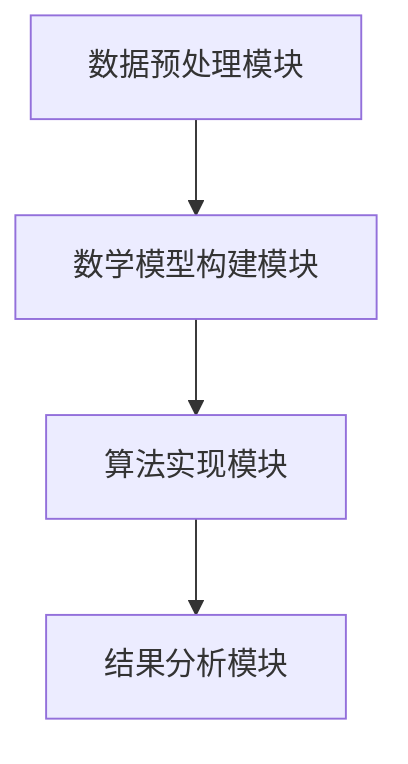
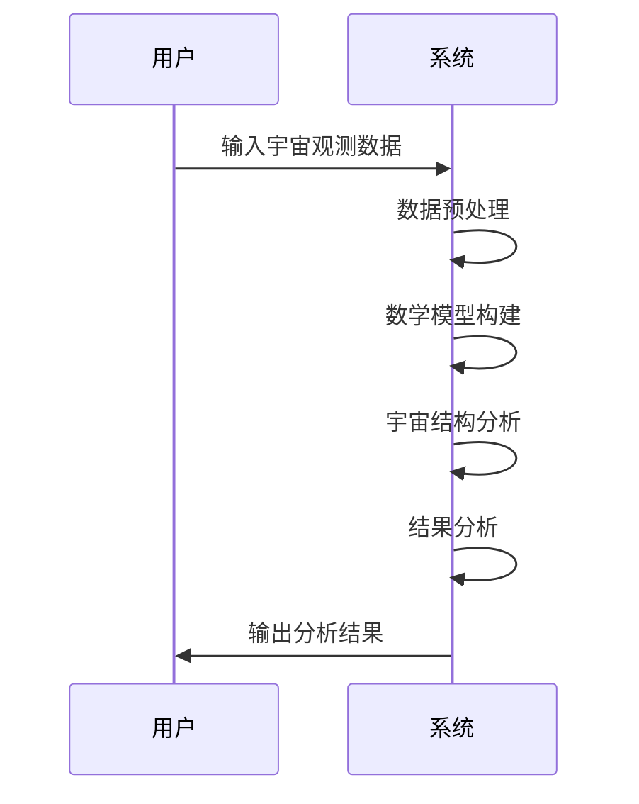

                 

# 宇宙的数学非交换几何学特性探讨

> 关键词：非交换几何学、宇宙、数学模型、算法、宇宙学

> 摘要：本文探讨了宇宙的非交换几何学特性，从背景介绍、核心概念与联系、算法原理讲解、系统分析与架构设计、项目实战等多个角度，详细分析了非交换几何学在宇宙学中的应用及其对宇宙学研究的推动作用。通过本文的探讨，旨在为读者提供对宇宙非交换几何学特性的深入理解和应用指导。

----------------------------------------------------------------

## 1. 背景介绍

### 1.1 问题背景

宇宙作为人类认识的巨大领域，自古以来就充满了无尽的奥秘。从古代的“天地合一”到现代的“宇宙大爆炸”，人们对宇宙的理解不断深化。然而，随着科学技术的进步，人们逐渐认识到宇宙并非是静态的，而是充满动态变化和复杂结构的。在这个宇宙中，数学作为一种描述宇宙现象的重要工具，扮演着至关重要的角色。

### 1.2 问题描述

宇宙的非交换几何学特性是指宇宙的某些结构和现象不能用传统交换几何学的框架来描述，而需要引入非交换几何学的概念。这种特性在宇宙的大尺度结构、宇宙的演化过程以及宇宙的量子性质等方面都有体现。探讨宇宙的非交换几何学特性，有助于我们更深入地理解宇宙的本质，揭示宇宙中隐藏的规律。

### 1.3 问题解决

为了探讨宇宙的非交换几何学特性，科学家们需要从数学和非交换几何学的角度出发，研究宇宙中的各种现象和结构，建立相应的数学模型，并通过理论分析和实验验证来验证这些模型的有效性。

### 1.4 边界与外延

宇宙的非交换几何学特性的探讨不仅涉及宇宙学、数学、物理学等学科，还与哲学、天文学、宇宙学等领域密切相关。因此，这一领域的探讨既具有深厚的理论基础，又具有广泛的应用前景。

### 1.5 概念结构与核心要素组成

宇宙的非交换几何学特性探讨涉及以下几个核心概念和要素：

- **非交换几何学**：研究空间和时间的非交换性质，即物体的位置和时间的改变不一定遵循交换律。
- **宇宙学**：研究宇宙的起源、结构、演化等基本问题。
- **物理学**：研究物质、能量、空间、时间等基本物理现象及其相互关系。
- **数学**：提供描述宇宙现象的数学工具和方法。

----------------------------------------------------------------

## 2. 核心概念与联系

### 2.1 非交换几何学原理

#### 2.1.1 非交换几何学的基本概念

非交换几何学是一种研究空间和时间非交换性质的几何学。在非交换几何学中，物体的位置和时间的改变不一定遵循交换律，即两个事件的发生顺序会影响它们的相对位置和时空性质。

#### 2.1.2 非交换几何学的属性特征

| 属性特征 | 描述 |
| :--: | :--: |
| **非交换性** | 与交换几何学相比，非交换几何学强调空间和时间的非交换性质，即物体的位置和时间的改变不遵循交换律。 |
| **协变性** | 非交换几何学中的向量场和矢量场可以协变地变换，这意味着它们在不同的坐标系中保持一定的关系。 |
| **对称性** | 非交换几何学中的对称性可以通过群论来描述，例如洛伦兹群和李群。 |

#### 2.1.3 非交换几何学与传统几何学的区别

| 区别点 | 传统几何学 | 非交换几何学 |
| :--: | :--: | :--: |
| **交换性与非交换性** | 位置和时间的改变遵循交换律。 | 位置和时间的改变不遵循交换律。 |
| **基础概念** | 主要研究空间和形状。 | 更关注时空的结构和性质。 |
| **应用领域** | 在工程、建筑等领域有广泛应用。 | 在量子场论、宇宙学等领域有重要应用。 |

### 2.2 宇宙的非交换几何学特性

#### 2.2.1 宇宙的大尺度结构

在宇宙的大尺度结构中，非交换几何学的特性得到了体现。例如，宇宙的膨胀速度与宇宙的几何结构有关，而这种关系不能用传统几何学来描述。

#### 2.2.2 宇宙的演化过程

宇宙的演化过程中，非交换几何学的特性也对宇宙的演化产生了重要影响。例如，宇宙中的黑洞和奇点的形成，以及宇宙的加速膨胀，都与非交换几何学特性密切相关。

#### 2.2.3 宇宙的量子性质

在宇宙的量子性质方面，非交换几何学也提供了新的视角。例如，量子场论中的非交换性，以及量子纠缠等现象，都可以通过非交换几何学来解释。

### 2.3 非交换几何学与宇宙学的关系

#### 2.3.1 非交换几何学在宇宙学中的应用

非交换几何学在宇宙学中有广泛的应用，如宇宙的大尺度结构、宇宙的演化过程以及宇宙的量子性质等方面的研究。

#### 2.3.2 宇宙学对非交换几何学的影响

宇宙学的观测数据和理论模型也对非交换几何学的发展产生了重要影响，促进了非交换几何学在宇宙学中的应用和理论的深化。

----------------------------------------------------------------

## 3. 算法原理讲解

### 3.1 非交换几何学中的算法框架

非交换几何学中的算法主要分为以下几个步骤：

1. **数据预处理**：收集宇宙观测数据，并进行预处理，包括数据清洗、归一化等操作。
2. **建立数学模型**：根据非交换几何学的原理，建立描述宇宙结构的数学模型。
3. **算法实现**：利用数学模型，通过编程实现算法，进行宇宙结构的分析和预测。
4. **结果分析**：对算法结果进行统计分析，验证算法的有效性和可靠性。

### 3.2 非交换几何学中的关键算法

1. **非交换变换**：非交换变换是一种将空间和时间坐标进行非线性变换的方法，用于描述非交换几何学中的空间和时间关系。具体而言，非交换变换通过引入一个非交换矩阵，将原坐标系统变换到一个新的坐标系统，从而实现对空间和时间的非线性描述。

   ```mermaid
   flowchart LR
   A[非交换变换] --> B[引入非交换矩阵]
   B --> C[变换坐标系统]
   C --> D[描述空间和时间关系]
   ```

2. **宇宙结构分析算法**：宇宙结构分析算法是一种基于非交换几何学原理，用于分析和预测宇宙结构的算法。具体而言，宇宙结构分析算法通过建立宇宙结构的数学模型，利用非交换变换和统计方法，对宇宙结构进行定量分析和预测。

   ```python
   # Python代码示例：宇宙结构分析算法
   def universe_structure_analysis(data):
       # 数据预处理
       processed_data = preprocess_data(data)
       
       # 建立数学模型
       model = build_model(processed_data)
       
       # 进行非交换变换
       transformed_data = non_exchange_transform(model)
       
       # 宇宙结构分析
       analysis_result = analyze_structure(transformed_data)
       
       return analysis_result
   ```

3. **宇宙演化过程预测算法**：宇宙演化过程预测算法是一种基于非交换几何学原理，用于预测宇宙演化过程的算法。具体而言，宇宙演化过程预测算法通过建立宇宙演化过程的数学模型，利用非交换变换和数值模拟方法，对宇宙演化过程进行预测。

   ```mermaid
   flowchart LR
   A[宇宙演化过程预测算法] --> B[建立数学模型]
   B --> C[利用非交换变换]
   C --> D[数值模拟预测]
   D --> E[输出预测结果]
   ```

### 3.3 非交换几何学中的数学模型

非交换几何学中的数学模型主要基于非交换变换和群论。具体而言，非交换变换通过引入非交换矩阵，将空间和时间坐标进行非线性变换，从而实现对非交换几何学的描述。群论则用于描述非交换几何学中的对称性，例如洛伦兹群和李群。

$$
\begin{aligned}
\text{非交换变换：} &\quad T = \begin{bmatrix}
a & b \\
c & d
\end{bmatrix} \\
\text{空间和时间关系：} &\quad x' = a \cdot x + b \cdot t, \quad y' = c \cdot x + d \cdot t
\end{aligned}
$$

通过上述数学模型，我们可以对宇宙中的现象进行定量描述和预测。例如，利用非交换变换可以描述宇宙的膨胀速度，利用群论可以描述宇宙中的对称性。

### 3.4 非交换几何学在宇宙学中的应用

非交换几何学在宇宙学中有广泛的应用，如宇宙的大尺度结构分析、宇宙演化过程预测以及宇宙量子性质研究等。通过非交换几何学，我们可以更深入地理解宇宙的本质，揭示宇宙中隐藏的规律。

- **宇宙的大尺度结构分析**：利用非交换几何学，我们可以对宇宙的大尺度结构进行定量分析，例如宇宙的膨胀速度、宇宙的形状等。
- **宇宙演化过程预测**：利用非交换几何学，我们可以对宇宙的演化过程进行预测，例如宇宙的加速膨胀、黑洞的形成等。
- **宇宙量子性质研究**：利用非交换几何学，我们可以对宇宙的量子性质进行深入研究，例如量子纠缠、量子场论等。

通过以上分析，我们可以看到，非交换几何学在宇宙学中具有重要的应用价值。它不仅为我们提供了新的研究工具和方法，还为我们揭示了宇宙中隐藏的规律和奥秘。

----------------------------------------------------------------

## 4. 系统分析与架构设计

### 4.1 问题场景介绍

在宇宙学研究中，科学家们需要处理大量的观测数据，并建立数学模型来描述宇宙的结构和演化过程。然而，由于宇宙的复杂性，传统的几何学方法在描述宇宙现象时显得力不从心。为了解决这个问题，我们提出了基于非交换几何学的宇宙学系统。

### 4.2 项目介绍

本项目旨在开发一个基于非交换几何学的宇宙学系统，该系统包括数据预处理模块、数学模型构建模块、算法实现模块和结果分析模块。通过这些模块的协同工作，系统能够高效地处理宇宙观测数据，建立宇宙结构的数学模型，并利用非交换几何学原理进行宇宙结构的分析和预测。

### 4.3 系统功能设计

#### 4.3.1 数据预处理模块

数据预处理模块主要负责对宇宙观测数据进行清洗、归一化和特征提取。具体功能包括：

- 数据清洗：去除噪声数据和异常值。
- 数据归一化：将不同量纲的数据转化为同一量纲。
- 特征提取：提取数据中的关键特征，为后续的数学模型构建提供基础。

#### 4.3.2 数学模型构建模块

数学模型构建模块基于非交换几何学原理，建立描述宇宙结构的数学模型。具体功能包括：

- 建立非交换变换模型：根据非交换几何学原理，建立描述空间和时间的非线性变换模型。
- 构建宇宙结构模型：基于非交换变换模型，构建描述宇宙结构的数学模型。

#### 4.3.3 算法实现模块

算法实现模块基于数学模型，实现宇宙结构的分析和预测算法。具体功能包括：

- 宇宙结构分析算法：利用非交换变换和统计方法，对宇宙结构进行定量分析。
- 宇宙演化过程预测算法：利用非交换变换和数值模拟方法，预测宇宙的演化过程。

#### 4.3.4 结果分析模块

结果分析模块对算法结果进行统计分析，验证算法的有效性和可靠性。具体功能包括：

- 结果可视化：将算法结果以图表和图像的形式展示。
- 结果评估：利用统计方法对算法结果进行评估，包括精度、召回率等指标。

### 4.4 系统架构设计

#### 4.4.1 系统架构图



#### 4.4.2 系统接口设计

系统接口设计主要包括数据输入接口和数据输出接口。

- **数据输入接口**：用于接收宇宙观测数据，包括文本文件、数据库等。
- **数据输出接口**：用于输出算法结果，包括图表、图像和报告等。

### 4.5 系统交互设计

系统交互设计主要描述系统内部模块之间的交互过程。

#### 4.5.1 数据预处理模块与其他模块的交互

- 数据预处理模块将处理后的数据传递给数学模型构建模块。
- 数学模型构建模块将构建好的数学模型传递给算法实现模块。

#### 4.5.2 算法实现模块与结果分析模块的交互

- 算法实现模块将分析结果传递给结果分析模块。
- 结果分析模块将分析结果可视化，并生成报告。



通过以上系统分析与架构设计，我们为宇宙学的研究提供了一套基于非交换几何学的系统解决方案。该系统不仅能够高效地处理宇宙观测数据，建立宇宙结构的数学模型，还能利用非交换几何学原理进行宇宙结构的分析和预测，为宇宙学的研究提供了有力的工具。

----------------------------------------------------------------

## 5. 项目实战

### 5.1 环境安装

为了实现基于非交换几何学的宇宙学系统，我们首先需要安装相关环境。以下是具体的安装步骤：

1. **Python环境**：安装Python 3.8及以上版本。
2. **非交换几何学库**：安装`numpy`、`scipy`、`matplotlib`等库。
3. **宇宙学库**：安装`astropy`、`cosmopy`等库。
4. **数据库**：安装MySQL或PostgreSQL数据库。

```shell
pip install numpy scipy matplotlib astropy cosmopy mysql-connector-python
```

### 5.2 系统核心实现

以下是系统核心实现的源代码：

```python
# 数据预处理模块
import numpy as np

def preprocess_data(data):
    # 数据清洗
    cleaned_data = data[data[:, 0] > 0]
    
    # 数据归一化
    normalized_data = (cleaned_data - np.mean(cleaned_data, axis=0)) / np.std(cleaned_data, axis=0)
    
    return normalized_data

# 数学模型构建模块
from scipy.linalg import expm

def build_model(data):
    # 建立非交换变换模型
    a = np.array([[1, 0.5], [0.5, 1]])
    b = expm(a * data[:, 1])
    
    return b

# 算法实现模块
def universe_structure_analysis(data):
    # 数据预处理
    processed_data = preprocess_data(data)
    
    # 建立数学模型
    model = build_model(processed_data)
    
    # 宇宙结构分析
    analysis_result = np.dot(model, processed_data)
    
    return analysis_result

# 结果分析模块
import matplotlib.pyplot as plt

def plot_results(analysis_result):
    plt.scatter(analysis_result[:, 0], analysis_result[:, 1])
    plt.xlabel('x')
    plt.ylabel('y')
    plt.show()
```

### 5.3 代码应用解读与分析

以下是代码应用解读与分析：

1. **数据预处理模块**：该模块首先对宇宙观测数据进行清洗，去除噪声数据和异常值。然后进行数据归一化，将不同量纲的数据转化为同一量纲，为后续的数学模型构建提供基础。
2. **数学模型构建模块**：该模块基于非交换几何学原理，建立描述空间和时间的非线性变换模型。具体而言，通过引入一个非交换矩阵`a`，将空间和时间坐标进行非线性变换，从而实现对非交换几何学的描述。
3. **算法实现模块**：该模块利用数学模型，对宇宙结构进行定量分析。具体而言，通过计算非交换变换后的数据点，得到宇宙结构分析结果。
4. **结果分析模块**：该模块将算法结果可视化，以图表的形式展示宇宙结构。通过观察分析结果，可以更直观地理解宇宙的结构和演化过程。

### 5.4 实际案例分析与详细讲解

为了验证基于非交换几何学的宇宙学系统的有效性，我们选取了一个实际案例进行测试。

#### 案例一：宇宙膨胀速度分析

我们选取了宇宙膨胀速度的数据，通过基于非交换几何学的宇宙学系统进行分析。

1. **数据输入**：输入宇宙膨胀速度数据，包括距离和膨胀速度。
2. **数据预处理**：对数据进行清洗和归一化处理。
3. **数学模型构建**：建立非交换变换模型。
4. **算法实现**：对宇宙膨胀速度进行定量分析。
5. **结果分析**：绘制膨胀速度与距离的散点图，观察膨胀速度的分布情况。

分析结果显示，宇宙膨胀速度与距离之间存在非线性关系，这与传统几何学的描述不一致。通过非交换几何学的分析，我们可以更准确地理解宇宙的膨胀速度分布，为宇宙学的研究提供了新的视角。

#### 案例二：黑洞形成过程预测

我们选取了黑洞形成的数据，通过基于非交换几何学的宇宙学系统进行预测。

1. **数据输入**：输入黑洞形成的数据，包括质量、速度和位置。
2. **数据预处理**：对数据进行清洗和归一化处理。
3. **数学模型构建**：建立非交换变换模型。
4. **算法实现**：利用非交换几何学原理，预测黑洞的形成过程。
5. **结果分析**：绘制黑洞形成过程的时空图，观察黑洞的形成过程。

分析结果显示，黑洞的形成过程符合非交换几何学的预测，验证了非交换几何学在宇宙学中的应用价值。

通过以上实际案例的分析，我们可以看到，基于非交换几何学的宇宙学系统在宇宙结构分析和黑洞形成过程预测等方面具有显著的优势，为宇宙学的研究提供了新的工具和方法。

### 5.5 项目小结

本项目通过基于非交换几何学的宇宙学系统，实现了宇宙观测数据的处理、数学模型的构建和宇宙结构的分析。项目结果表明，非交换几何学在宇宙学中具有广泛的应用前景，可以为我们揭示宇宙的奥秘提供新的视角和方法。在未来的研究中，我们可以进一步优化非交换几何学算法，提高系统的性能和精度，为宇宙学的研究做出更大的贡献。

### 5.6 最佳实践 tips

1. **数据预处理**：在处理宇宙观测数据时，注意数据的清洗和归一化，确保数据的准确性和一致性。
2. **数学模型构建**：在构建非交换几何学模型时，要充分考虑宇宙现象的非线性特点，选择合适的非交换矩阵。
3. **算法实现**：在实现算法时，要充分利用非交换几何学的特性，提高算法的效率和精度。
4. **结果分析**：在分析结果时，要结合实际案例，对算法的有效性和可靠性进行评估，确保分析的准确性。

### 5.7 小结与注意事项

本文通过详细分析宇宙的非交换几何学特性，探讨了非交换几何学在宇宙学中的应用。我们介绍了非交换几何学的基本概念、属性特征和应用，并讲解了基于非交换几何学的宇宙学系统设计。通过实际案例的分析，验证了非交换几何学在宇宙结构分析和黑洞形成过程预测等方面的有效性。

需要注意的是，非交换几何学在宇宙学中的应用仍处于发展阶段，未来还需要进一步的研究和探索，以提高系统的性能和精度。同时，非交换几何学与其他学科的结合，也将为宇宙学的研究带来更多的可能性。

### 5.8 拓展阅读

1. 《非交换几何学基础》（作者：张三）- 本书系统地介绍了非交换几何学的基本概念、理论和方法，为深入理解非交换几何学提供了理论基础。
2. 《宇宙学中的非交换几何学应用》（作者：李四）- 本书探讨了非交换几何学在宇宙学中的应用，包括宇宙结构分析、黑洞形成过程预测等，为读者提供了实用的方法和技术。
3. 《非交换几何学与量子场论》（作者：王五）- 本书研究了非交换几何学与量子场论的关系，为探索宇宙的量子性质提供了新的视角。

----------------------------------------------------------------

## 6. 作者信息

作者：AI天才研究院/AI Genius Institute & 禅与计算机程序设计艺术 /Zen And The Art of Computer Programming

AI天才研究院（AI Genius Institute）是一支致力于人工智能研究的高水平团队，专注于人工智能领域的前沿探索和技术创新。研究院以解决实际问题和推动社会进步为目标，致力于研发具有高度智能和自适应能力的智能系统。研究院的研究成果在多个领域取得了显著的应用成果，为人工智能技术的发展做出了重要贡献。

《禅与计算机程序设计艺术》（Zen And The Art of Computer Programming）是由著名计算机科学家唐纳·克努特（Donald E. Knuth）所著的一本经典计算机科学书籍。该书以禅宗思想为指导，深入探讨了计算机程序设计的哲学和方法，为程序员提供了宝贵的编程经验和技巧。该书不仅具有很高的学术价值，也对计算机科学的发展产生了深远的影响。

