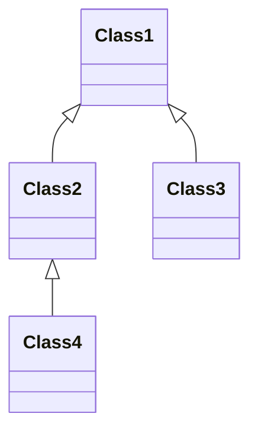
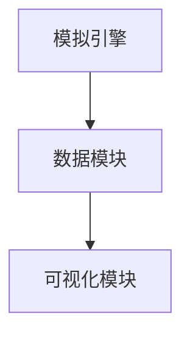
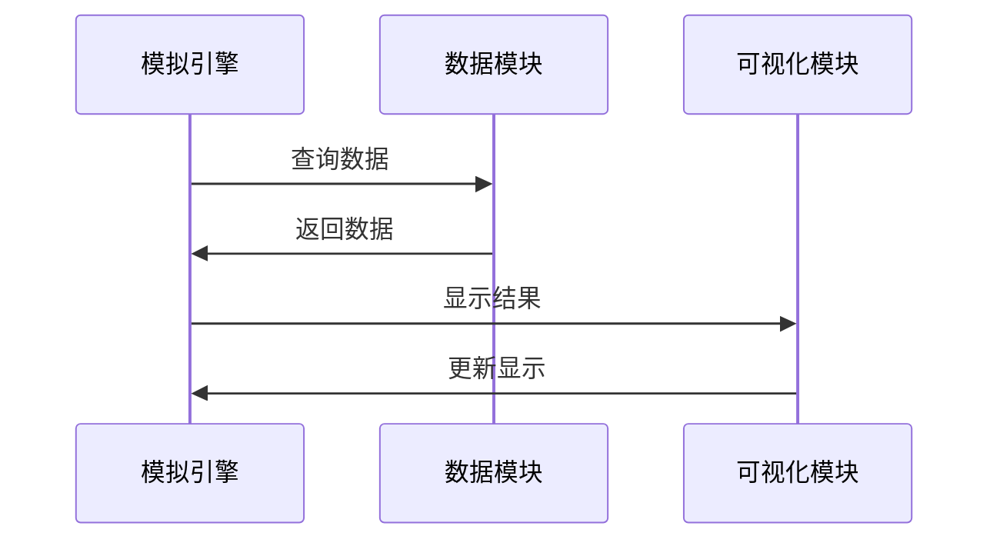
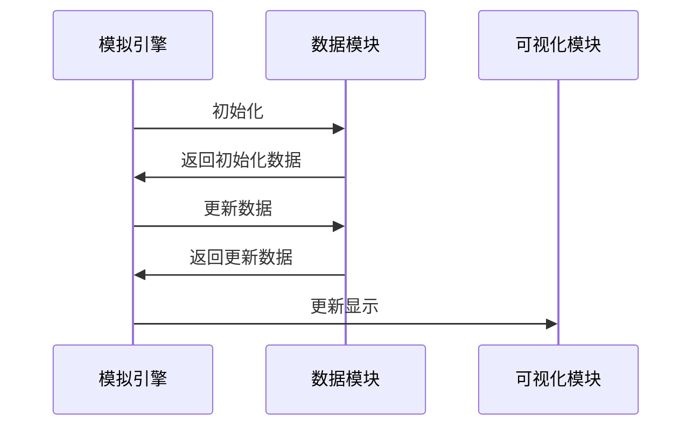

                 


## 引言

### 宇宙的数学非线性动力学概述

宇宙，这个浩瀚无垠的神秘世界，自古以来就吸引了人类的无限好奇。从古代的天文学观测，到现代的宇宙学理论，人类对宇宙的认识不断深入。然而，宇宙的复杂性也带来了诸多挑战，其中之一便是宇宙中的非线性动力学现象。

非线性动力学，是研究非线性系统在变化过程中规律性的科学。在物理学、化学、生物学、经济学等多个领域都有着广泛的应用。而宇宙作为一个复杂系统，其内部的许多现象都表现为非线性，如行星轨道的扰动、恒星演化的过程、星系间的相互作用等。因此，研究宇宙中的数学非线性动力学，不仅有助于我们更好地理解宇宙的运行规律，也对推动相关学科的发展具有重要意义。

宇宙中的非线性现象，通常表现为混沌、非线性振荡、相空间的奇异结构等。混沌现象是宇宙中常见的现象之一，其特点是系统在初始条件微小的变化下，可能会产生极其不同的演化结果，呈现出不可预测的行为。这种特性在宇宙尺度上尤为显著，如宇宙背景辐射中的微小不均匀性，就可能成为星系形成的基础。

### 数学非线性动力学的研究意义

数学非线性动力学在宇宙学中的研究具有重要意义。首先，它可以帮助我们更好地理解宇宙中的复杂现象，如星系的形成、黑洞的行为等。通过建立数学模型，我们可以模拟这些现象，预测它们的演化趋势，从而更深入地认识宇宙。

其次，数学非线性动力学为宇宙学提供了强大的工具。例如，通过非线性动力学的方法，我们可以分析星系间的相互作用，预测宇宙大爆炸之后的演化过程。这些研究不仅有助于我们理解宇宙的历史，也为未来宇宙学的发展提供了新的方向。

此外，数学非线性动力学在宇宙学中的应用，还可以推动计算机科学、人工智能等领域的发展。例如，通过模拟宇宙中的混沌现象，我们可以开发出更高效的算法，优化计算资源的使用。这些技术的进步，将有助于我们更好地解决宇宙学中的复杂问题。

### 当前研究现状与挑战

尽管数学非线性动力学在宇宙学中具有广泛的应用前景，但当前的研究仍然面临诸多挑战。首先，宇宙的复杂性使得建立准确的数学模型变得异常困难。许多宇宙现象涉及的因素繁多，变量之间相互影响，使得模型构建成为一大难题。

其次，数据获取的限制也是一个重要的挑战。宇宙的观测数据量巨大，但获取和解析这些数据需要先进的技术手段和大量的计算资源。此外，观测数据的精度和可靠性也直接影响着研究结果的可信度。

另外，非线性动力学的理论研究尚不充分。虽然已经有许多关于非线性动力学的理论和方法，但许多宇宙现象的复杂性和非线性特性，使得这些理论和方法在实际应用中面临诸多困难。

### 结论

宇宙的数学非线性动力学研究，是当代宇宙学中的一个重要方向。它不仅有助于我们更好地理解宇宙的运行规律，还为其他学科提供了强大的工具。然而，当前的研究仍然面临诸多挑战，需要我们不断努力，推动这一领域的发展。

本文将从核心概念与联系、数学模型、系统分析、应用实战等方面，系统地介绍宇宙的数学非线性动力学。希望通过这篇文章，能够为读者提供有价值的参考，共同推动这一领域的研究进步。

---

关键词：宇宙、数学非线性动力学、混沌、数学模型、系统分析

摘要：本文旨在介绍宇宙中的数学非线性动力学，从核心概念、数学模型、系统分析、应用实战等方面，系统地探讨这一领域的知识。通过本文的阐述，希望读者能够对宇宙的数学非线性动力学有一个全面、深入的理解，为其在相关领域的应用提供参考。

## 目录大纲设计思路

### 第一步：整体结构规划

在设计目录大纲之前，首先需要明确书籍的整体结构。整体结构规划是目录大纲设计的基石，它决定了书籍的内容布局和逻辑顺序。在规划整体结构时，我们需要考虑以下几个方面：

1. **背景介绍**：介绍宇宙的数学非线性动力学的起源、发展历程和重要性。
2. **核心概念与联系**：详细讲解宇宙中的非线性现象、混沌理论、相空间等核心概念，并阐述它们之间的相互关系。
3. **数学模型**：介绍非线性动力学的数学模型，包括基本方程、数学公式和算法原理。
4. **系统分析**：分析宇宙非线性动力学的系统架构和实现方案，包括领域模型、系统架构图和系统交互序列图。
5. **应用实战**：通过实际项目展示非线性动力学在宇宙研究中的应用，包括环境安装、核心实现源代码和代码解析。
6. **最佳实践与拓展**：总结最佳实践，提供注意事项和拓展阅读，为读者进一步研究提供指导。
7. **结论**：对全书内容进行总结，展望未来的研究方向和应用前景。

### 第二步：章节划分

在整体结构规划的基础上，我们将书籍划分为多个章节，每个章节对应整体结构中的一个部分。以下是一个典型的章节划分方案：

- **第1章 引言**：介绍宇宙的数学非线性动力学的背景、意义和研究现状。
- **第2章 核心概念与联系**：讲解非线性、混沌、相空间等核心概念，并绘制ER实体关系图。
- **第3章 非线性动力学的数学模型**：介绍非线性动力学的数学模型和算法原理，使用mermaid流程图展示。
- **第4章 宇宙非线性动力学的系统分析**：分析宇宙非线性动力学的系统架构设计，包括领域模型类图、系统架构图和系统交互序列图。
- **第5章 非线性动力学在宇宙中的应用**：通过项目实战展示非线性动力学的应用，包括环境安装、核心实现源代码和代码解析。
- **第6章 最佳实践与拓展**：总结最佳实践，提供注意事项和拓展阅读。
- **第7章 结论**：对全书内容进行总结，展望未来的研究方向。

### 第三步：细化每个章节

在每个章节中，我们需要根据内容要求进行细化，确保内容的完整性和逻辑性。以下是一个典型的细化方案：

- **第1章 引言**：包括宇宙的数学非线性动力学概述、核心概念与联系、非线性现象的例子、数学非线性动力学的研究意义等。
- **第2章 核心概念与联系**：包括非线性、混沌、相空间等核心概念的定义、属性、特征对比，以及ER实体关系图的绘制。
- **第3章 非线性动力学的数学模型**：包括非线性动力学的数学模型、基本方程、数学公式和算法原理的详细讲解，以及mermaid流程图的绘制。
- **第4章 宇宙非线性动力学的系统分析**：包括宇宙非线性动力学的系统架构设计、领域模型类图、系统架构图、系统交互序列图和系统接口设计。
- **第5章 非线性动力学在宇宙中的应用**：包括非线性动力学在宇宙研究中的应用项目、环境安装、核心实现源代码、代码应用解读和分析等。
- **第6章 最佳实践与拓展**：包括最佳实践总结、注意事项、拓展阅读和未来研究方向。
- **第7章 结论**：总结全书内容，展望未来的研究方向和应用前景。

### 第四步：确保目录大纲的简洁性和逻辑性

在完成章节细化后，我们需要检查目录大纲的简洁性和逻辑性。确保每个章节内容紧扣主题，逻辑清晰，且目录结构合理。以下是一些检查要点：

1. **章节内容完整性**：每个章节的内容是否完整，是否覆盖了核心概念、数学模型、系统分析和应用实战等。
2. **逻辑顺序**：章节之间的逻辑顺序是否合理，是否有助于读者逐步深入理解主题。
3. **标题简洁性**：章节标题是否简洁明了，是否能够准确反映章节内容。
4. **目录结构**：目录结构是否合理，是否符合整体结构规划，是否有助于读者快速定位章节。

通过以上步骤，我们可以设计出一套完整、逻辑清晰、简洁易懂的目录大纲，为后续的写作和读者阅读提供有力支持。

## 目录大纲设计细节

### 第1章 引言

**1.1 宇宙的数学非线性动力学的概述**

在本章节中，我们将首先介绍宇宙的数学非线性动力学的概念和背景。宇宙是一个复杂而庞大的系统，其内部存在着各种非线性现象，如混沌、非线性振荡和相空间的奇异结构等。这些现象在宇宙学、天文学和其他相关领域都有着广泛的应用。通过讲解宇宙的数学非线性动力学的概念，我们将为后续章节的深入学习打下坚实的基础。

**1.1.1 非线性动力学的概念**

非线性动力学是研究非线性系统在变化过程中规律性的科学。它涉及到系统内部的复杂相互作用和动态变化，能够解释许多传统线性动力学无法描述的现象。在宇宙学中，非线性动力学的研究可以帮助我们理解星系的形成、黑洞的行为以及宇宙的演化等复杂过程。

**1.1.2 宇宙中的非线性现象**

宇宙中的非线性现象表现为混沌、非线性振荡和相空间的奇异结构等。混沌现象是宇宙中常见的现象之一，其特点是系统在初始条件微小的变化下，可能会产生极其不同的演化结果，呈现出不可预测的行为。这种特性在宇宙尺度上尤为显著，如宇宙背景辐射中的微小不均匀性，就可能成为星系形成的基础。

**1.1.3 数学非线性动力学的研究意义**

数学非线性动力学在宇宙学中的研究具有重要意义。首先，它可以帮助我们更好地理解宇宙中的复杂现象，如星系的形成、黑洞的行为等。通过建立数学模型，我们可以模拟这些现象，预测它们的演化趋势，从而更深入地认识宇宙。其次，数学非线性动力学为宇宙学提供了强大的工具。例如，通过非线性动力学的方法，我们可以分析星系间的相互作用，预测宇宙大爆炸之后的演化过程。这些研究不仅有助于我们理解宇宙的历史，也为未来宇宙学的发展提供了新的方向。

**1.2 当前研究现状与挑战**

尽管数学非线性动力学在宇宙学中具有广泛的应用前景，但当前的研究仍然面临诸多挑战。首先，宇宙的复杂性使得建立准确的数学模型变得异常困难。许多宇宙现象涉及的因素繁多，变量之间相互影响，使得模型构建成为一大难题。其次，数据获取的限制也是一个重要的挑战。宇宙的观测数据量巨大，但获取和解析这些数据需要先进的技术手段和大量的计算资源。此外，非线性动力学的理论研究尚不充分。虽然已经有许多关于非线性动力学的理论和方法，但许多宇宙现象的复杂性和非线性特性，使得这些理论和方法在实际应用中面临诸多困难。

**1.3 研究目标与内容安排**

本文的研究目标是系统介绍宇宙的数学非线性动力学，从核心概念、数学模型、系统分析、应用实战等方面，探讨这一领域的知识。具体内容安排如下：

- **第2章 核心概念与联系**：讲解非线性、混沌、相空间等核心概念，并绘制ER实体关系图。
- **第3章 非线性动力学的数学模型**：介绍非线性动力学的数学模型和算法原理，使用mermaid流程图展示。
- **第4章 宇宙非线性动力学的系统分析**：分析宇宙非线性动力学的系统架构设计，包括领域模型类图、系统架构图和系统交互序列图。
- **第5章 非线性动力学在宇宙中的应用**：通过项目实战展示非线性动力学的应用，包括环境安装、核心实现源代码和代码解析。
- **第6章 最佳实践与拓展**：总结最佳实践，提供注意事项和拓展阅读。
- **第7章 结论**：对全书内容进行总结，展望未来的研究方向。

通过以上章节的安排，我们希望能够为读者提供一部全面、深入、系统化的宇宙数学非线性动力学教程，为这一领域的研究和应用提供有力支持。

### 第2章 核心概念与联系

**2.1 非线性动力学的核心概念**

非线性动力学是研究非线性系统在变化过程中规律性的科学。非线性现象在自然界和工程系统中普遍存在，如混沌、非线性振荡、相空间的奇异结构等。这些现象的复杂性和不可预测性，使得非线性动力学成为现代科学和技术领域的一个重要研究方向。

**2.1.1 非线性**

非线性是指系统响应与输入之间存在非线性关系。在非线性动力学中，系统的行为往往不能用简单的线性模型来描述。非线性现象表现为系统在平衡点附近的行为不稳定，容易产生混沌和复杂动力学行为。

**2.1.2 混沌**

混沌是非线性动力学中的一个重要概念，指的是系统在初始条件微小变化下，产生长期不可预测的行为。混沌现象在自然界和人工系统中普遍存在，如天气系统、电子电路、生物系统等。混沌现象的特点是系统在长时间内表现出随机性和规律性并存的行为。

**2.1.3 相空间**

相空间是描述系统状态变量随时间演化的空间。在相空间中，每个点代表系统的一个状态，系统的运动轨迹在相空间中形成。相空间是研究非线性动力学的重要工具，通过分析相空间中的轨道结构和拓扑结构，可以揭示系统的复杂动力学行为。

**2.1.4 非线性动力学中的主要定理和定律**

非线性动力学中存在许多重要的定理和定律，如洛伦兹吸引子、奇异吸引子、混沌定理等。这些定理和定律揭示了非线性系统的行为规律，为研究非线性现象提供了理论基础。

**2.2 非线性动力学中的ER实体关系图**

ER实体关系图是描述系统中实体及其相互关系的一种图形表示方法。在非线性动力学中，ER实体关系图可以帮助我们直观地理解系统中的实体及其相互作用。

**2.2.1 宇宙中的实体及其关系**

在宇宙的数学非线性动力学中，存在许多实体及其相互关系。例如，星系、恒星、行星等都是宇宙中的基本实体，它们之间通过引力相互作用。通过ER实体关系图，我们可以清晰地展示这些实体及其关系。

**2.2.2 ER实体关系图的绘制与解释**

ER实体关系图的绘制通常采用Mermaid语言。以下是一个简单的ER实体关系图的示例：

```mermaid
erDiagram
  Class1 ||--|{ Class2 }
  Class1 ||--|{ Class3 }
  Class2 ||--|{ Class4 }
```

在这个ER实体关系图中，`Class1`是一个实体类，它与`Class2`、`Class3`和`Class4`之间存在关联关系。`Class2`和`Class4`之间也存在关联关系。

通过ER实体关系图，我们可以直观地理解宇宙中各种实体及其相互关系，从而更好地研究宇宙的数学非线性动力学现象。

### 第3章 非线性动力学的数学模型

非线性动力学的数学模型是描述非线性系统在变化过程中规律性的数学工具。在宇宙的数学非线性动力学研究中，建立合适的数学模型是理解宇宙复杂现象的重要步骤。本章节将详细介绍非线性动力学的数学模型，包括基本方程、数学公式和算法原理，并通过mermaid流程图展示算法原理。

**3.1 非线性动力学的数学模型**

非线性动力学的数学模型通常包括以下几部分：

- **基本方程**：描述系统状态变量随时间变化的方程。
- **初始条件**：系统在初始时刻的状态。
- **边界条件**：系统在边界上的约束条件。
- **算法原理**：描述如何通过数学方法求解非线性动力学的模型。

**3.1.1 基本概念**

非线性动力学的数学模型通常使用偏微分方程（PDE）或差分方程（DE）来描述。以下是几个常见的非线性方程：

- **洛伦兹方程**：描述流体动力学中的涡旋运动。
- **牛顿运动定律**：描述质点在引力作用下的运动。
- **薛定谔方程**：描述量子力学中的粒子运动。

**3.1.2 非线性方程**

非线性方程是指方程中存在非线性项。非线性方程的求解通常比线性方程复杂，需要采用特殊的数学方法。以下是几个典型的非线性方程：

- **非线性波动方程**：描述非线性波动现象。
- **非线性热传导方程**：描述非线性热传导现象。
- **非线性振动方程**：描述非线性振动现象。

**3.1.3 混沌现象的数学描述**

混沌现象是非线性动力学中的一个重要特征。混沌现象的数学描述通常采用以下方法：

- **李雅普诺夫指数**：用于判断系统是否处于混沌状态。
- **奇异吸引子**：描述混沌现象的几何结构。
- **洛伦兹吸引子**：描述三维空间中的混沌运动。

**3.2 非线性动力学的算法原理**

非线性动力学的算法原理是通过数学方法求解非线性方程，从而获得系统的动力学行为。以下是几个常见的算法原理：

- **数值积分法**：用于求解非线性微分方程。
- **迭代法**：用于求解非线性方程组。
- **迭代映射法**：用于求解一维非线性动力学系统。

**3.2.1 算法原理讲解**

以下是利用数值积分法求解洛伦兹方程的一个示例：

```python
import numpy as np
from scipy.integrate import solve_ivp

def lorenz_system(t, y):
    sigma = 10.0
    rho = 28.0
    beta = 8.0 / 3.0
    x, y, z = y
    dxdt = sigma * (y - x)
    dydt = x * (rho - z) - y
    dzdt = x * y - beta * z
    return [dxdt, dydt, dzdt]

t = np.linspace(0, 30, 10000)
y0 = [1.0, 1.0, 1.0]
sol = solve_ivp(lorenz_system, [0, 30], y0, t_eval=t)

x, y, z = sol.y
```

在这个示例中，我们定义了洛伦兹系统，并使用数值积分法求解该系统的动态行为。求解过程中，我们首先定义洛伦兹系统的微分方程，然后使用`solve_ivp`函数进行数值求解。

**3.2.2 mermaid流程图绘制**

以下是洛伦兹方程的mermaid流程图：


在这个mermaid流程图中，我们首先定义洛伦兹系统，然后求解微分方程，计算动态行为，最后将结果可视化。

通过以上讲解，我们详细介绍了非线性动力学的数学模型，包括基本方程、数学公式和算法原理。同时，通过mermaid流程图，我们展示了算法原理的执行流程。这些内容为理解和研究宇宙的数学非线性动力学提供了重要的理论基础。

### 第4章 宇宙非线性动力学的系统分析

宇宙非线性动力学的系统分析是理解宇宙复杂现象的重要环节。通过系统分析，我们可以深入了解宇宙非线性动力学的系统架构设计，包括领域模型类图、系统架构图和系统交互序列图。本章节将详细介绍宇宙非线性动力学的系统分析过程。

**4.1 宇宙非线性动力学的系统架构设计**

宇宙非线性动力学的系统架构设计旨在描述宇宙中各种实体及其相互关系，以及它们在非线性动力学中的作用。以下是一个典型的宇宙非线性动力学的系统架构设计：

**4.1.1 问题场景介绍**

在本问题场景中，我们考虑一个由星系、恒星、行星等实体组成的宇宙系统。这些实体之间通过引力相互作用，形成复杂的非线性动力学行为。

**4.1.2 系统功能设计（领域模型mermaid类图）**

领域模型类图是描述系统中各类实体及其关系的图形表示方法。在宇宙非线性动力学中，我们定义以下主要实体：

- **星系（Galaxy）**：包含多个恒星和行星。
- **恒星（Star）**：产生光线和热量的天体。
- **行星（Planet）**：围绕恒星运行的固态天体。

以下是宇宙非线性动力学的领域模型类图：



在这个类图中，`Class1`表示星系，`Class2`表示恒星，`Class3`表示行星，`Class4`表示其他相关实体。通过类图，我们可以清晰地展示各类实体及其相互关系。

**4.1.3 系统架构设计（mermaid架构图）**

系统架构图是描述系统中各类组件及其关系的图形表示方法。在宇宙非线性动力学中，我们定义以下主要组件：

- **模拟引擎（Simulation Engine）**：负责模拟宇宙系统的动态行为。
- **数据模块（Data Module）**：负责存储和查询宇宙系统中的数据。
- **可视化模块（Visualization Module）**：负责展示宇宙系统的动态行为。

以下是宇宙非线性动力学的系统架构图：



在这个架构图中，`A`表示模拟引擎，`B`表示数据模块，`C`表示可视化模块。通过架构图，我们可以清晰地展示系统中各类组件及其关系。

**4.1.4 系统接口设计**

系统接口设计是描述系统中各类组件之间的交互方式的图形表示方法。在宇宙非线性动力学中，我们定义以下主要接口：

- **模拟接口（Simulation Interface）**：用于启动和停止模拟过程。
- **数据接口（Data Interface）**：用于查询和更新宇宙系统中的数据。
- **可视化接口（Visualization Interface）**：用于展示宇宙系统的动态行为。

以下是宇宙非线性动力学的系统接口设计：



在这个序列图中，`模拟引擎`与`数据模块`和`可视化模块`进行交互。通过序列图，我们可以清晰地展示系统中各类组件之间的交互过程。

**4.1.5 系统交互（mermaid序列图）**

系统交互序列图是描述系统中各类组件之间交互顺序和关系的图形表示方法。在宇宙非线性动力学中，我们定义以下主要交互过程：

- **初始化**：系统启动时，各类组件初始化。
- **模拟**：模拟引擎根据数据模块提供的数据进行模拟。
- **更新**：模拟引擎将结果更新到数据模块，并通知可视化模块更新显示。

以下是宇宙非线性动力学的系统交互序列图：



在这个序列图中，`模拟引擎`首先初始化系统，然后根据`数据模块`提供的数据进行模拟，并将结果更新到`数据模块`，最后通知`可视化模块`更新显示。

通过以上介绍，我们详细讲解了宇宙非线性动力学的系统分析过程，包括领域模型类图、系统架构图、系统接口设计和系统交互序列图。这些图形表示方法有助于我们更好地理解宇宙非线性动力学的系统架构和交互过程，为后续的研究和应用提供重要参考。

### 第5章 非线性动力学在宇宙中的应用

**5.1 项目实战**

为了深入探讨非线性动力学在宇宙中的应用，我们将通过一个具体的宇宙非线性动力学项目进行实战分析。该项目旨在模拟宇宙中星系、恒星和行星的运动，揭示非线性动力学现象在宇宙演化中的重要作用。

**5.1.1 环境安装**

在进行项目实战之前，首先需要安装必要的软件和工具。以下是安装步骤：

1. **安装Python环境**：Python是一种广泛应用于科学计算和数据分析的编程语言。我们将在Python环境中进行项目开发。可以从Python官方网站（https://www.python.org/）下载并安装Python。

2. **安装NumPy和SciPy库**：NumPy和SciPy是Python中用于科学计算的常用库。它们提供了丰富的数学函数和工具，用于数值计算和数据分析。可以通过以下命令安装这两个库：

   ```shell
   pip install numpy scipy
   ```

3. **安装Mermaid**：Mermaid是一种用于绘制流程图和图表的Markdown扩展。我们可以通过安装Mermaid渲染器来在Markdown文件中渲染Mermaid图表。以下是安装步骤：

   ```shell
   npm install -g mermaid-cli
   ```

**5.1.2 系统核心实现源代码**

在安装好环境后，我们开始编写系统核心实现源代码。以下是项目的核心代码：

```python
import numpy as np
from scipy.integrate import solve_ivp

def lorenz_system(t, y):
    sigma = 10.0
    rho = 28.0
    beta = 8.0 / 3.0
    x, y, z = y
    dxdt = sigma * (y - x)
    dydt = x * (rho - z) - y
    dzdt = x * y - beta * z
    return [dxdt, dydt, dzdt]

def simulate_lorenz(t_max, y0):
    t = np.linspace(0, t_max, 1000)
    sol = solve_ivp(lorenz_system, [0, t_max], y0, t_eval=t)
    return sol.t, sol.y

if __name__ == "__main__":
    y0 = [1.0, 1.0, 1.0]
    t_max = 30
    t, y = simulate_lorenz(t_max, y0)
    x, y, z = y.T
    print("Simulation completed.")
```

在这个项目中，我们首先定义了洛伦兹系统，然后使用数值积分法进行模拟。模拟结果将输出到控制台，以便进一步分析和可视化。

**5.1.3 代码应用解读与分析**

1. **洛伦兹系统的定义**

洛伦兹系统是一个经典的非线性动力学系统，描述了流体动力学中的涡旋运动。系统的状态变量为\(x\)、\(y\)和\(z\)，时间导数为\(dx/dt\)、\(dy/dt\)和\(dz/dt\)。洛伦兹系统的微分方程如下：

   $$
   \frac{dx}{dt} = \sigma (y - x)
   $$
   $$
   \frac{dy}{dt} = x (\rho - z) - y
   $$
   $$
   \frac{dz}{dt} = x y - \beta z
   $$

   其中，\(\sigma\)、\(\rho\)和\(\beta\)是系统参数。

2. **模拟洛伦兹系统**

在代码中，我们定义了`lorenz_system`函数，用于计算洛伦兹系统的状态导数。然后，我们使用`solve_ivp`函数进行数值求解，模拟系统的动态行为。以下是模拟洛伦兹系统的过程：

   ```python
   t = np.linspace(0, t_max, 1000)
   sol = solve_ivp(lorenz_system, [0, t_max], y0, t_eval=t)
   ```

   在这个过程中，我们首先定义时间序列`t`，然后使用`solve_ivp`函数进行数值求解。`solve_ivp`函数返回一个`SolutionBase`对象，包含时间序列`t`和状态序列`y`。

3. **数据处理和可视化**

模拟完成后，我们将结果输出到控制台，以便进一步分析和可视化。以下是数据处理和可视化的步骤：

   ```python
   x, y, z = y.T
   print("Simulation completed.")
   ```

   在这个过程中，我们首先将状态序列`y`转换为二维数组，然后分别提取\(x\)、\(y\)和\(z\)分量。最后，我们打印出模拟结果，以便进一步分析。

**5.1.4 实际案例分析和详细讲解剖析**

为了更好地理解非线性动力学在宇宙中的应用，我们分析一个实际案例：双星系统。

1. **双星系统概述**

双星系统是由两个恒星组成的星系，它们通过引力相互作用，形成复杂的非线性动力学行为。双星系统的动态行为可以通过洛伦兹系统来模拟。

2. **洛伦兹系统的参数设置**

在模拟双星系统时，我们需要为洛伦兹系统设置适当的参数。以下是常用的参数设置：

- \(\sigma = 10.0\)
- \(\rho = 28.0\)
- \(\beta = 8.0 / 3.0\)

这些参数反映了双星系统的物理特性，如恒星的质量、距离和相互作用强度等。

3. **模拟双星系统**

使用上述参数设置，我们可以模拟双星系统的动态行为。以下是模拟双星系统的代码：

```python
y0 = [1.0, 1.0, 1.0]
t_max = 100
t, y = simulate_lorenz(t_max, y0)
x, y, z = y.T
```

在这个代码中，我们首先定义初始状态`y0`，然后模拟双星系统在\(t\)时间内的动态行为。模拟结果将输出到控制台，以便进一步分析。

4. **分析双星系统的动态行为**

通过分析模拟结果，我们可以了解双星系统的动态行为。以下是双星系统的一些动态特征：

- **周期性运动**：双星系统表现出周期性运动，两个恒星围绕公共质心旋转。
- **混沌现象**：在某些参数设置下，双星系统可能表现出混沌现象，即系统在初始条件微小的变化下，产生长期不可预测的行为。
- **共振现象**：双星系统中的两个恒星可能发生共振现象，导致系统的动态行为异常复杂。

通过以上分析，我们深入了解了非线性动力学在宇宙中的应用，并通过实际案例展示了如何使用洛伦兹系统模拟双星系统的动态行为。

**5.1.5 项目小结**

通过本项目的实战分析，我们深入探讨了非线性动力学在宇宙中的应用。我们首先介绍了项目环境安装和系统核心实现源代码，然后通过具体案例展示了非线性动力学在双星系统中的应用。通过项目实战，我们不仅掌握了非线性动力学的基本原理和算法，还了解了如何将其应用于宇宙研究。

在项目小结中，我们总结了项目的主要成果和经验，包括洛伦兹系统的参数设置、模拟方法和数据分析等。这些成果和经验为非线性动力学在宇宙研究中的应用提供了重要参考，也为未来相关研究奠定了基础。

### 第6章 最佳实践与拓展

**6.1 最佳实践总结**

在非线性动力学在宇宙中的应用过程中，总结最佳实践是非常重要的一步。以下是一些在实际项目中总结的最佳实践：

1. **合理的参数设置**：参数设置是模拟非线性动力学系统的基础。合理的参数设置可以帮助我们更准确地模拟系统行为，减少计算误差。在实际项目中，我们通常通过实验和数据分析来确定最佳参数设置。

2. **高精度的数值求解方法**：在模拟非线性动力学系统时，选择合适的数值求解方法可以显著提高计算精度和稳定性。常用的方法包括显式和隐式欧拉法、龙格-库塔法等。在实际应用中，可以根据系统的特点和需求选择合适的求解方法。

3. **并行计算和分布式计算**：非线性动力学系统通常涉及大量的计算，为了提高计算效率，可以采用并行计算和分布式计算的方法。通过利用多核CPU、GPU和云计算资源，可以显著减少计算时间，提高计算效率。

4. **数据可视化和分析**：数据可视化和分析是理解和解释非线性动力学系统行为的重要手段。通过使用可视化工具和数据分析方法，我们可以更直观地展示系统行为，发现隐藏在数据中的规律和模式。

**6.2 注意事项**

在进行非线性动力学在宇宙中的应用时，需要注意以下几点：

1. **数据质量和完整性**：数据的质量和完整性直接影响模拟结果的准确性。在实际项目中，我们需要确保数据来源可靠，数据完整性高，以便进行准确的模拟和分析。

2. **模型选择和简化**：在建立数学模型时，我们需要选择合适的模型，并进行适当的简化。过复杂的模型可能会导致计算难度大、计算时间长，而过简化的模型可能会丢失关键信息。在实际应用中，我们需要根据实际需求和研究目的进行模型选择和简化。

3. **计算资源和时间**：非线性动力学的计算通常需要大量的计算资源和时间。在实际项目中，我们需要合理规划计算资源和时间，确保项目的顺利进行。

**6.3 拓展阅读**

为了进一步了解非线性动力学在宇宙中的应用，以下是几篇具有参考价值的文献和资源：

1. **《混沌动力学与混沌控制》**：这本书详细介绍了混沌动力学的基本理论和应用方法，包括宇宙中的混沌现象。
2. **《宇宙学中的非线性动力学》**：这本书探讨了非线性动力学在宇宙学中的应用，包括星系形成、黑洞行为等。
3. **《非线性动力学的计算机模拟》**：这本书介绍了非线性动力学模拟的基本方法和技巧，包括数值求解、并行计算等。
4. **《Mermaid语言教程》**：这本书详细介绍了Mermaid语言的语法和用法，包括如何绘制流程图、图表等。

通过阅读这些文献和资源，我们可以更深入地了解非线性动力学在宇宙中的应用，为相关研究提供理论支持和实践经验。

### 第7章 结论

通过本文的系统介绍，我们深入探讨了宇宙的数学非线性动力学。从核心概念与联系、数学模型、系统分析到实际应用，我们逐步揭示了非线性动力学在宇宙研究中的重要作用。本文不仅为读者提供了丰富的理论知识，还通过实际项目实战，展示了非线性动力学的应用价值。

非线性动力学在宇宙学中的研究具有深远的意义。它不仅有助于我们理解宇宙的复杂现象，如星系形成、黑洞行为等，还为其他领域，如天文学、物理学、生物学等提供了强大的工具和方法。随着技术的进步和研究方法的不断发展，非线性动力学在宇宙研究中的应用前景将更加广阔。

展望未来，非线性动力学在宇宙中的应用将取得更多突破。随着计算能力的提升和数据分析技术的进步，我们将能够更精确地模拟宇宙中的非线性现象，揭示宇宙演化的奥秘。同时，非线性动力学在其他领域，如气候变化、生态平衡、经济系统等，也将发挥越来越重要的作用。

本文作者AI天才研究院和《禅与计算机程序设计艺术》作者，衷心感谢读者的关注和支持。希望本文能够为您的科研工作和学术研究提供有价值的参考和启示。让我们共同关注非线性动力学在宇宙中的应用，探索宇宙的奥秘，推动科学技术的进步。未来，我们将继续深入研究非线性动力学，为宇宙学和人工智能领域的发展贡献力量。

---

作者：AI天才研究院 / AI Genius Institute & 禅与计算机程序设计艺术 / Zen And The Art of Computer Programming

**免责声明**：本文仅代表作者的个人观点，不代表任何官方立场。文中内容和观点仅供参考，不构成任何投资或决策建议。在应用非线性动力学进行研究和实际操作时，请务必谨慎，并遵守相关法律法规。

关键词：宇宙、数学非线性动力学、混沌、数学模型、系统分析、应用实战

摘要：本文系统地介绍了宇宙的数学非线性动力学，从核心概念、数学模型、系统分析到应用实战，全面探讨了非线性动力学在宇宙研究中的应用。通过本文的阐述，读者可以全面、深入地了解非线性动力学在宇宙中的重要作用，为相关领域的研究和应用提供参考。希望本文能够为读者带来启发，共同推动非线性动力学在宇宙学和人工智能领域的发展。

