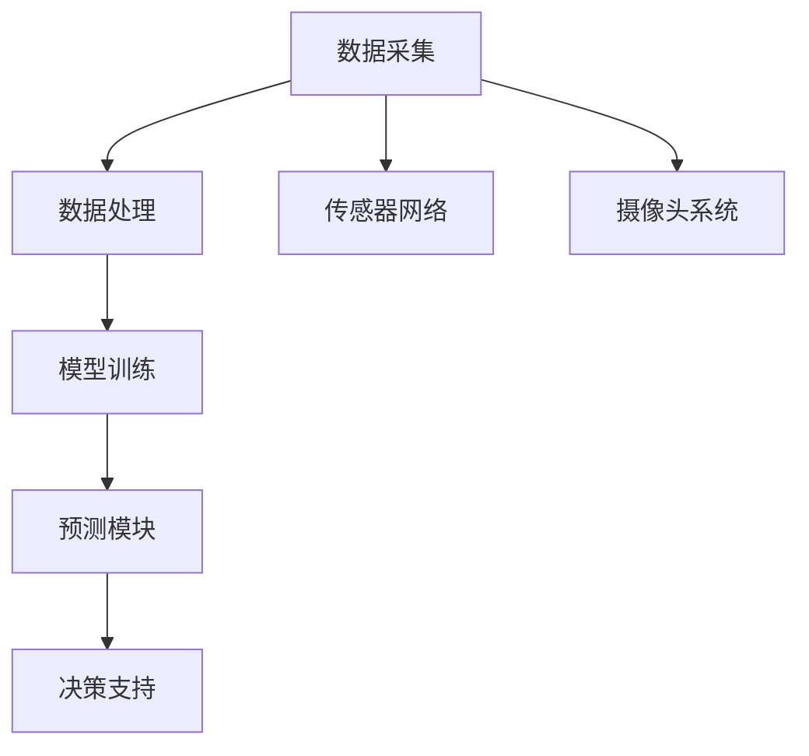
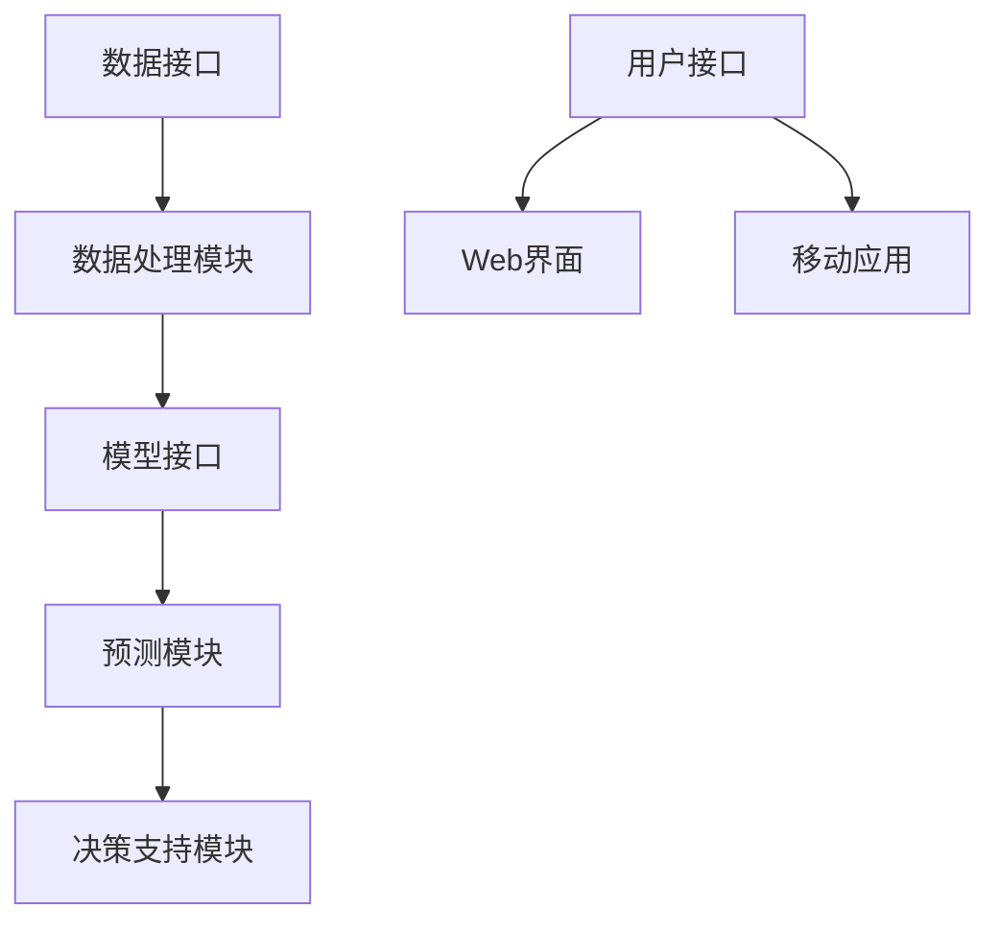
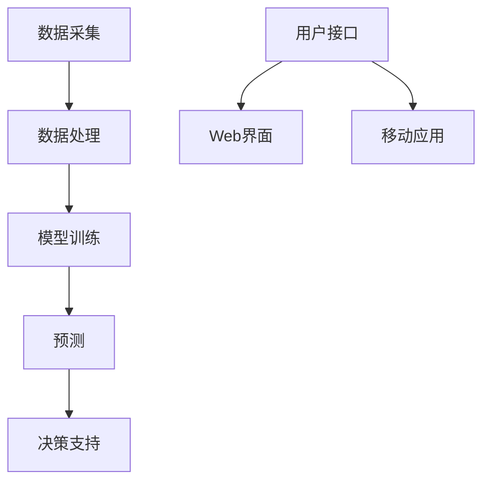

                 

### 宇宙的确定性与程序的可预测性

**关键词**：宇宙的确定性、程序的可预测性、量子力学、算法原理、人工智能

**摘要**：本文探讨了宇宙的确定性与程序的可预测性之间的关系。首先，我们介绍了宇宙确定性原理的基本概念和历史背景，并探讨了量子力学和相对论对确定性原理的影响。接着，我们分析了程序可预测性的定义、核心原理以及其在计算机科学中的应用。最后，我们深入探讨了宇宙确定性原理与程序可预测性之间的关系，通过实例分析了两者在实际应用中的影响，并展望了未来的研究方向。

### 引言

宇宙的确定性与程序的可预测性是两个看似截然不同的概念，但它们之间存在深刻的联系。宇宙的确定性原理源于经典物理学，认为自然界的物理过程是可预测的。然而，随着量子力学和相对论的发展，我们对宇宙确定性的理解发生了巨大的变化。相对论揭示了时空的相对性，而量子力学则揭示了微观世界的随机性和不确定性。

与此同时，计算机科学中的程序可预测性也在不断演变。程序的可预测性指的是通过一定的算法和逻辑，可以准确地预测程序运行的结果。在计算机科学中，算法的设计和优化一直是研究的热点。然而，随着人工智能和大数据技术的发展，程序的可预测性面临着新的挑战。

本文将从宇宙的确定性与程序的可预测性两个方面出发，探讨它们之间的关系。首先，我们将介绍宇宙确定性原理的基本概念和历史背景。然后，我们将分析程序可预测性的定义、核心原理以及在计算机科学中的应用。接下来，我们将探讨宇宙确定性原理与程序可预测性之间的关系，并通过实例分析它们在实际应用中的影响。最后，我们将展望宇宙确定性原理与程序可预测性在未来的研究方向。

### 宇宙的确定性原理

宇宙的确定性原理是物理学中的一个基本概念，它源于经典物理学。经典物理学认为，如果给定初始条件，自然界的物理过程是可预测的。这意味着，理论上，我们可以通过精确的物理定律来预测一个系统的未来状态。这一原理在经典力学、电磁学和热力学中得到了广泛的应用，并为我们理解宇宙的运行提供了重要的框架。

#### 确定性原理的历史背景

确定性原理的概念最早可以追溯到古希腊哲学家亚里士多德。亚里士多德认为，自然界的运动是确定性的，可以通过因果关系来解释。然而，随着牛顿力学的出现，确定性原理得到了更深入的发展。牛顿力学通过一组方程（即牛顿运动定律）描述了物体在力的作用下的运动，这些方程在数学上是可以解决的，从而实现了对物理过程的预测。

19世纪末，麦克斯韦的电磁理论和热力学的发展进一步巩固了确定性原理的地位。麦克斯韦方程组描述了电磁场的行为，这些方程同样在数学上是可解的。热力学则通过统计力学的方法，描述了大量粒子的集体行为，同样具有确定性。

然而，确定性原理在20世纪初遭遇了量子力学和相对论的挑战。量子力学揭示了微观世界的随机性和不确定性，而相对论则揭示了时空的相对性。这些理论对经典物理学的确定性原理提出了质疑，并引发了物理学中的深刻变革。

#### 确定性原理的基本概念

确定性原理的基本概念可以概括为：如果给定一个系统的初始状态和作用在系统上的力，那么理论上可以预测这个系统在任意时刻的状态。在经典物理学中，这一原理通过方程的求解来实现。例如，在牛顿力学中，通过求解牛顿运动定律，可以预测物体的未来位置和速度。

然而，在量子力学中，确定性原理面临着挑战。量子力学的基本原理之一是测不准原理，它指出无法同时精确地测量一个粒子的位置和动量。这意味着，在量子层面上，我们无法得到一个系统在任意时刻的精确状态，从而使得量子系统的预测变得不确定。

相对论也对确定性原理提出了挑战。相对论揭示了时空的相对性，即不同观察者可能会得到不同的时间和空间测量结果。这使得确定一个系统的精确状态变得更加复杂。

#### 量子力学与确定性原理

量子力学的基本原理与经典物理学的确定性原理存在显著差异。在量子力学中，粒子的行为被描述为波函数，波函数提供了粒子在空间中的概率分布。量子力学中的测不准原理指出，我们无法同时精确地知道一个粒子的位置和动量。这一原理导致了量子系统的预测性具有不确定性。

例如，在双缝实验中，一个电子通过两个缝隙时，其行为表现为波动，导致在屏幕上形成干涉条纹。然而，如果我们尝试测量电子通过哪个缝隙，电子的行为就会坍缩为粒子，干涉条纹消失。这个实验表明，量子系统的行为是随机的，无法通过确定性的物理定律来预测。

#### 相对论与确定性原理

相对论，特别是广义相对论，对确定性原理提出了进一步的挑战。相对论揭示了时空的相对性，即不同观察者可能会得到不同的时间和空间测量结果。这意味着，在相对论框架下，我们无法定义一个绝对的时间或空间坐标。

在广义相对论中，时空是弯曲的，物体的运动轨迹受到引力的影响。这意味着，给定初始条件，我们无法精确预测一个物体的未来运动轨迹，因为它会受到引力的影响，而引力是一个非线性的效应。

#### 宇宙的确定性原理与程序可预测性的联系

宇宙的确定性原理与程序的可预测性之间存在密切的联系。在计算机科学中，程序的可预测性指的是能够通过算法和逻辑准确预测程序运行的结果。这与宇宙确定性原理中的概念相似，即给定初始条件，可以预测系统的未来状态。

然而，由于量子力学和相对论的影响，宇宙的确定性原理面临着不确定性。这同样影响了程序的可预测性。在量子计算和相对论性计算机科学中，我们面临着如何处理不确定性的问题。

例如，在量子计算中，量子比特（qubit）的行为是随机的，我们无法精确预测量子计算的结果。这意味着，量子算法需要设计来处理这种不确定性。相对论性计算机科学也面临着类似的挑战，需要找到处理时空相对性的方法。

总之，宇宙的确定性原理与程序的可预测性之间存在深刻的联系。理解宇宙的确定性原理有助于我们更好地设计可预测的程序，同时也促使我们探索新的计算模型和算法，以应对量子力学和相对论带来的不确定性挑战。

### 程序的可预测性

程序的可预测性是计算机科学中的一个核心概念，它指的是通过算法和逻辑能够准确预测程序运行的结果。在计算机科学中，程序的可预测性对于确保系统稳定性和可靠性至关重要。要深入理解程序的可预测性，我们需要首先了解其定义、核心原理以及在计算机科学中的应用。

#### 定义

程序的可预测性可以简单定义为：在给定输入的情况下，程序能够在一定的时间和资源限制内，产生可预见的输出结果。这意味着，如果能够准确地描述输入和输出之间的关系，那么程序的运行过程就是可预测的。

可预测性不仅包括输出结果的可预见性，还包括程序运行过程中的中间状态。这意味着，在程序的任何时刻，我们都可以根据当前的输入和已执行的操作，预测下一个状态。

#### 核心原理

程序的可预测性依赖于以下几个核心原理：

1. **确定性算法**：确定性算法是指在任何相同的输入下，总能产生相同输出的算法。确定性是保证程序可预测性的基础。在计算机科学中，许多算法都是基于确定性原理设计的，以确保其可预测性。

2. **逻辑一致性**：逻辑一致性指的是程序中的逻辑判断和条件分支能够正确反映输入和输出之间的关系。如果程序的逻辑存在错误或不一致，那么程序的行为就变得不可预测。

3. **资源限制**：程序的运行受限于时间、内存和其他系统资源。如果程序在资源限制下运行，那么其行为可能会变得不可预测，因为资源不足可能导致程序的行为不确定。

4. **状态保持**：程序需要能够保持其内部状态，以便在后续操作中能够正确地恢复和利用这些状态。如果程序无法保持状态，那么其行为就会变得不可预测。

#### 在计算机科学中的应用

程序的可预测性在计算机科学中有广泛的应用，包括：

1. **软件工程**：在软件工程中，确保程序的可预测性是设计高质量软件的关键。通过设计可预测的算法和逻辑，可以减少软件缺陷和故障，提高系统的稳定性和可靠性。

2. **系统测试**：在系统测试中，通过模拟不同的输入条件，可以验证程序的可预测性。这有助于发现潜在的问题和缺陷，从而提高软件的质量。

3. **人工智能**：在人工智能领域，程序的可预测性对于模型训练和预测至关重要。通过确保算法的可预测性，可以提高模型的稳定性和可靠性，从而更好地实现预测和决策。

4. **网络安全**：在网络安全中，程序的可预测性对于防范攻击至关重要。通过分析程序的输入和输出，可以预测潜在的攻击方式，从而采取相应的防护措施。

总之，程序的可预测性是计算机科学中的一个核心概念，它对于确保系统的稳定性、可靠性和安全性具有重要意义。通过理解程序可预测性的定义、核心原理以及在计算机科学中的应用，我们可以更好地设计和优化程序，提高系统的性能和可靠性。

#### 程序中的确定性

在计算机科学中，程序中的确定性是指程序在相同的输入条件下总是产生相同的结果。确定性是程序可预测性的基础，它确保了程序的行为具有一致性和可重复性。理解程序中的确定性对于设计和优化软件至关重要。

要确保程序中的确定性，我们需要关注以下几个方面：

1. **算法的确定性**：算法是程序的核心，其确定性直接影响程序的行为。确定性算法在相同输入下总是产生相同输出，不会因为外部因素或随机性导致结果不同。例如，排序算法（如快速排序、归并排序）在相同输入情况下总能产生相同的结果。

2. **逻辑的一致性**：程序中的逻辑判断和条件分支必须是一致的，确保输入和输出之间的关系正确。如果逻辑存在错误或不一致，程序的行为就会变得不可预测。例如，在条件分支中，应该避免出现逻辑漏洞或条件不完整的情况。

3. **状态保持**：程序需要能够保持其内部状态，以便在后续操作中能够正确地恢复和利用这些状态。状态保持是实现确定性程序的关键。例如，在处理复杂数据结构时，需要确保数据的完整性，避免数据丢失或污染。

4. **资源限制**：虽然资源限制（如时间、内存）会影响程序的运行，但在设计确定性程序时，应尽可能避免资源不足导致的不确定性。例如，通过合理分配内存和优化算法，可以减少资源限制对程序可预测性的影响。

5. **外部因素的影响**：在程序设计中，应尽可能减少外部因素对程序确定性影响的因素。例如，通过网络通信的程序应确保数据的完整性和一致性，避免外部干扰导致程序行为不确定。

总之，确保程序中的确定性是设计高质量软件的关键。通过关注算法的确定性、逻辑的一致性、状态保持、资源限制和外部因素，我们可以设计出具有高可预测性的程序，从而提高软件的稳定性、可靠性和安全性。

#### 随机性与概率

随机性和概率是计算机科学中非常重要的概念，尤其在算法设计和系统分析中经常被使用。随机性指的是一个过程或系统无法通过简单的确定性规则来预测其结果，而是具有不确定性。概率则是对随机事件可能性的度量，它提供了一个量化描述，以帮助我们在不确定的环境中做出决策。

在计算机科学中，随机性和概率的应用非常广泛，例如在算法分析、人工智能、机器学习、网络通信和金融模型等领域。理解随机性和概率的基本原理对于设计高效、可靠的系统至关重要。

##### 基本概念

随机性（Randomness）通常指的是在给定一组可能的输出结果中，无法预测具体哪个结果会发生的特性。在计算机科学中，随机性可以来源于外部环境、程序内部的状态或者设计时的随机算法。

概率（Probability）是对随机事件发生可能性的度量。概率值介于0和1之间，其中0表示事件不可能发生，1表示事件必然发生。例如，掷一枚硬币，出现正面的概率是0.5。

##### 概率分布

概率分布是描述随机变量取值的概率分布情况。常见的概率分布包括：

1. **均匀分布**：所有可能的输出结果具有相同的概率，例如掷骰子的结果。
2. **正态分布**（又称高斯分布）：大多数结果集中在平均值附近，少量结果分布在两端。许多自然现象和数据都近似符合正态分布，例如人体身高、考试成绩等。
3. **二项分布**：描述在一定次数的试验中，成功次数的概率分布。例如，投掷硬币10次，出现5次正面的概率。
4. **泊松分布**：描述在一定时间内，事件发生的次数的概率分布。例如，在一段时间内，某段公路上发生交通事故的次数。

##### 随机性与概率在算法中的应用

在算法设计中，随机性和概率经常被用来解决复杂问题或优化算法性能。以下是一些具体的应用：

1. **随机化算法**：随机化算法在决策过程中引入随机性，以避免陷入局部最优解。例如，随机化搜索算法（如遗传算法、模拟退火算法）通过随机选择和迭代，逐步优化问题的解。

2. **概率算法**：概率算法利用概率理论和随机过程来设计算法。例如，蒙特卡洛方法通过模拟大量随机样本来估计问题的解。

3. **概率数据结构**：概率数据结构（如布隆过滤器）通过存储概率信息来提高数据查询和处理的效率。布隆过滤器利用多个概率数据结构来判断一个元素是否在集合中，虽然有可能出现误判，但在实际应用中非常高效。

4. **随机采样**：随机采样用于从大量数据中抽取具有代表性的样本，以便进行统计分析或机器学习模型的训练。

总之，随机性和概率在计算机科学中具有广泛的应用。通过理解这些概念，我们可以设计出更加高效、可靠的算法和系统，解决复杂的计算问题。

#### 可预测性算法的基本原理

可预测性算法是计算机科学中用于确保程序输出结果可预测的一系列方法和技术。这些算法的核心目的是在给定输入的情况下，能够准确地预测程序的输出，从而提高系统的稳定性和可靠性。以下是可预测性算法的基本原理、常见方法及其在计算机科学中的应用。

##### 基本原理

1. **确定性原理**：可预测性算法首先依赖于确定性原理，即在相同输入条件下，算法总是产生相同的输出。这意味着算法中的每一步操作都是可预测的，不受随机性影响。

2. **逻辑一致性**：算法的逻辑结构必须一致，确保输入和输出之间的关系明确且可预测。逻辑错误或不一致性会导致算法行为不可预测。

3. **状态保持**：算法需要能够保持其内部状态，以便在后续操作中可以正确地恢复和利用这些状态。状态保持是实现算法可预测性的关键。

4. **输入验证**：对输入数据的有效性和完整性进行验证，以确保输入不会导致不可预测的行为。这有助于防止恶意输入或数据异常破坏算法的可预测性。

##### 常见方法

1. **确定性算法设计**：设计基于确定性原理的算法，例如排序算法（如快速排序、归并排序）和搜索算法（如二分查找）。这些算法在相同输入下总是产生相同的结果。

2. **状态机模型**：使用状态机模型描述算法的行为，每个状态对应一个明确的操作和转移条件。这有助于确保算法的行为是可预测的。

3. **形式化验证**：通过形式化验证方法，如模型检查或数学证明，验证算法的正确性和可预测性。这可以确保算法在所有情况下都满足预期的行为。

4. **概率算法优化**：对随机算法进行优化，减少随机性对算法可预测性的影响。例如，通过随机化算法（如遗传算法、模拟退火算法）引入少量随机性，同时确保算法的整体可预测性。

##### 应用场景

1. **软件工程**：在软件工程中，可预测性算法用于设计和测试软件，确保其稳定性和可靠性。例如，使用形式化验证方法验证程序的正确性，确保其在各种输入情况下都能产生预期的输出。

2. **系统测试**：在系统测试中，通过模拟不同的输入条件，验证系统的可预测性。这有助于发现潜在的问题和缺陷，从而提高系统的质量。

3. **人工智能**：在人工智能领域，可预测性算法用于训练和评估机器学习模型。通过确保算法的可预测性，可以提高模型的稳定性和可靠性。

4. **网络安全**：在网络安全中，可预测性算法用于检测和防御网络攻击。例如，通过分析网络流量模式，预测潜在的攻击行为，并采取相应的防护措施。

总之，可预测性算法在计算机科学中扮演着重要角色。通过理解和应用这些算法的基本原理和常见方法，我们可以设计出更加可靠和稳定的计算机系统，从而应对复杂性和不确定性带来的挑战。

#### 宇宙确定性原理与程序可预测性的关系

宇宙确定性原理与程序可预测性之间的关系是计算机科学和物理学中一个引人入胜的话题。从表面上看，这两个领域似乎没有直接联系，但深入探讨后，我们发现它们之间存在深刻的内在联系。

首先，我们需要明确宇宙确定性原理和程序可预测性的定义。宇宙的确定性原理源于经典物理学，认为给定初始条件，自然界的物理过程是可预测的。而程序的可预测性在计算机科学中指的是，通过算法和逻辑，能够准确预测程序的输出结果。

虽然这两个概念在定义上有所不同，但它们的核心思想是相似的，即预测未来的状态。宇宙确定性原理关注的是自然界的物理过程，而程序可预测性则关注计算机程序的执行过程。

##### 量子力学与不确定性

在量子力学中，我们面临着宇宙确定性原理的挑战。量子力学的基本原理之一是测不准原理，它指出我们无法同时精确地知道一个粒子的位置和动量。这意味着，在量子层面上，自然界的物理过程具有不确定性，这与经典物理学的确定性原理相矛盾。

量子力学的不确定性对计算机科学中的程序可预测性也产生了影响。例如，量子计算中的量子比特（qubit）的行为是随机的，我们无法精确预测量子计算的结果。这意味着，量子算法需要设计来处理这种不确定性。

##### 相对论与时空相对性

相对论，特别是广义相对论，也对宇宙的确定性原理提出了挑战。广义相对论揭示了时空的相对性，即不同观察者可能会得到不同的时间和空间测量结果。这意味着，在相对论框架下，我们无法定义一个绝对的时间或空间坐标，从而使得宇宙的确定性原理变得复杂。

相对论对计算机科学中的程序可预测性也产生了影响。例如，在相对论性计算机科学中，我们需要处理时空相对性的问题。这要求我们设计能够适应不同参考系的计算模型和算法，以确保程序的可预测性。

##### 可预测性的挑战与机遇

量子力学和相对论带来的不确定性对程序可预测性提出了严峻的挑战。在量子计算和相对论性计算机科学中，我们需要寻找新的方法来处理不确定性，以实现程序的可预测性。

然而，这些挑战也带来了新的机遇。量子计算和相对论性计算机科学的发展促使我们探索新的计算模型和算法，以提高系统的可预测性。例如，量子算法和相对论性算法的设计需要考虑如何处理不确定性，从而实现高效、可靠的计算。

##### 实际应用

在量子计算中，量子算法通过利用量子力学的不确定性，实现了比经典算法更高的计算效率。量子算法的设计需要考虑量子比特的行为，以确保算法的可预测性。例如，量子纠缠态和量子叠加态的利用，使得量子算法能够在复杂的计算问题中表现出优越的性能。

在相对论性计算机科学中，我们面临着处理时空相对性的问题。相对论性算法需要考虑不同参考系之间的转换，以确保程序的可预测性。例如，在分布式计算系统中，我们需要设计算法来处理不同节点之间的时间同步问题，以确保整个系统的协调运作。

总之，宇宙的确定性原理与程序的可预测性之间存在深刻的联系。虽然量子力学和相对论带来的不确定性对程序可预测性提出了挑战，但同时也带来了新的机遇。通过探索新的计算模型和算法，我们可以应对这些挑战，实现程序的高效、可靠运行。

### 量子力学与计算机科学的交汇

量子力学与计算机科学的交汇是一个充满挑战和机遇的领域，它揭示了量子力学原理如何影响计算机科学的各个方面，特别是在算法设计和量子计算领域。量子力学的基本原理，如量子纠缠和量子叠加，为计算机科学提供了新的工具和方法，使得我们能够解决一些传统计算机难以处理的问题。

#### 量子计算与量子模拟

量子计算是量子力学在计算机科学中最重要的应用之一。传统计算机使用二进制位（bit）作为信息的基本单位，每个二进制位只能是0或1。然而，量子比特（qubit）是量子计算的基本单位，它可以同时存在于0和1的叠加态。这种叠加态使得量子计算机能够并行处理大量信息，从而大幅提升计算能力。

量子计算的核心概念之一是量子纠缠。量子纠缠指的是两个或多个量子比特之间的一种特殊关联，即使这些量子比特相隔很远，它们的状态也会相互影响。这一特性使得量子计算机能够进行复杂的量子并行计算，这在传统计算机中是不可实现的。

量子模拟是量子计算的另一个重要应用领域。量子模拟器能够模拟量子系统的行为，这对于研究量子化学反应、材料科学和量子场论等领域至关重要。量子模拟通过利用量子计算机的并行处理能力，可以大幅加速这些复杂问题的求解过程。

#### 量子算法与可预测性

量子算法是量子计算机独有的算法，它们利用量子力学的特性来解决问题。量子算法中最著名的是Shor算法，它利用量子计算机的并行处理能力和量子纠缠，能够在多项式时间内解决大整数分解问题，这是一个传统计算机难以在合理时间内解决的问题。

另一个重要的量子算法是Grover算法，它是一种量子搜索算法，能够在未排序的数据库中查找特定条目的时间复杂度降低到\(O(\sqrt{N})\)，其中N是数据库中的元素数量。传统搜索算法的时间复杂度是\(O(N)\)。Grover算法的效率优势在数据库规模较大时尤为显著。

量子算法的可预测性取决于量子计算机的稳定性。由于量子计算机容易受到外部干扰（如噪声和环境衰变），量子计算的结果可能具有不确定性。因此，量子算法的可预测性需要在设计时考虑到这些因素，并通过量子纠错技术来提高稳定性。

#### 可预测性的挑战与机遇

尽管量子计算在理论上具有巨大的潜力，但实现稳定、可预测的量子计算机仍然面临许多挑战。首先，量子比特的稳定性是一个关键问题。量子比特容易受到环境噪声的影响，导致量子态的崩溃。因此，量子纠错技术的发展至关重要，它通过引入冗余量子比特和信息编码，来检测和纠正量子计算中的错误。

另一个挑战是量子算法的适用性。虽然量子算法在某些特定问题上有显著的优势，但并不是所有问题都能从量子计算中受益。设计适用于量子计算机的算法需要深入理解量子力学的原理，并利用量子比特的独特性质。

然而，量子计算也带来了新的机遇。例如，在药物研发、金融建模和人工智能等领域，量子计算可能带来革命性的变化。通过利用量子计算的能力，我们能够更快速地解决复杂问题，推动科学和技术的进步。

总之，量子力学与计算机科学的交汇为计算机科学带来了新的方向和机遇。量子计算和量子模拟的发展使得我们能够解决传统计算机难以处理的问题，但同时也带来了新的挑战。通过不断研究和创新，我们可以克服这些挑战，实现量子计算的可预测性和实用性。

#### 可预测性的挑战与机遇

在量子力学和计算机科学中，可预测性面临着一系列挑战，同时也带来了新的机遇。量子力学的随机性和不确定性对传统计算机科学的确定性原理提出了质疑，但同时也推动了计算模型的创新和发展。

首先，量子力学的随机性对程序的可预测性构成了重大挑战。在量子计算中，量子比特（qubit）的行为具有随机性，这使得量子算法的结果在每次运行时都可能不同。这种随机性不仅增加了算法设计的复杂性，还要求我们在实现量子计算机时考虑量子纠错技术，以确保计算结果的可靠性。

为了应对这一挑战，研究人员正在开发量子纠错算法，通过引入冗余量子比特和信息编码，来检测和纠正量子计算中的错误。这些纠错技术旨在提高量子计算机的稳定性，使其能够实现可预测的计算。

另一方面，量子力学的不确定性也为计算科学带来了新的机遇。例如，量子模拟器能够模拟量子系统的行为，这在药物研发、材料科学和金融建模等领域具有巨大的应用潜力。通过量子模拟，我们能够更快速地解决传统计算机难以处理的复杂问题，从而推动科学和技术的进步。

此外，量子算法的随机性在特定问题上的优势也为计算科学提供了新的工具。例如，Grover算法和Shor算法利用量子力学的随机性，在特定问题（如大整数分解和数据库搜索）上表现出比传统算法更高的效率。这为解决实际问题提供了新的思路和可能性。

然而，要充分利用这些机遇，我们还需要解决一系列技术难题。首先，量子计算机的构建和操作需要精确的控制和冷却技术，以确保量子比特的稳定性和可靠性。其次，量子算法的设计和优化需要深入理解量子力学的原理，并结合实际问题的特点。

总之，量子力学的不确定性对程序的可预测性提出了挑战，但同时也带来了新的机遇。通过不断研究和创新，我们可以克服这些挑战，实现量子计算的可预测性和实用性。在量子力学和计算机科学的交汇点上，我们有望发现新的计算模型和算法，推动计算机科学的发展，为人类解决复杂问题提供更强有力的工具。

### 天文计算中的确定性原理

在天文计算中，确定性原理的应用具有重要意义。天文观测需要精确的预测和计算，以确保观测数据的准确性和科学研究的可靠性。确定性原理提供了理论基础，使得我们可以通过物理定律和数学模型来预测天体的运动和天文事件。

#### 天文观测与预测

天文观测是天文计算的基础。通过观测，天文学家可以收集关于天体的数据，如位置、速度和亮度等。这些数据用于建立天体的运动模型，并预测未来的位置和事件。

例如，在行星运动的研究中，天文学家利用牛顿力学定律，通过给定行星的初始条件（如位置、速度和质量），可以预测行星在未来任意时刻的位置和轨迹。这种基于确定性原理的计算方法，使得我们能够准确预测行星的运行轨道，为太空探索和航天工程提供重要支持。

#### 确定性原理在天文学中的应用

1. **牛顿力学**：牛顿力学是确定性原理在天文学中的核心应用之一。牛顿运动定律描述了天体之间的引力作用，通过这些定律，我们可以预测天体的运动轨迹。

2. **开普勒定律**：开普勒定律是行星运动规律的重要描述，它基于牛顿力学原理，通过确定行星的轨道参数（如半长轴、偏心率等），可以预测行星的轨道特性。

3. **广义相对论**：广义相对论是描述天体间引力的更精确理论。它修正了牛顿力学的不足，特别是在强引力场（如黑洞附近）和高速运动物体中的表现。广义相对论为我们提供了更准确的预测工具，例如黑洞合并事件和引力波观测。

#### 天文计算实例

一个著名的天文计算实例是预测彗星的轨道。彗星是由冰、岩石和尘埃组成的小天体，它们在太阳系中高速运动。通过观测彗星的位置和速度，天文学家可以计算出其轨道参数，并预测未来的轨道。

例如，哈雷彗星是著名的周期彗星，其轨道可以通过牛顿力学精确预测。天文学家通过计算，可以预测哈雷彗星的回归时间，为观测和研究提供重要依据。

另一个实例是行星冲日和凌日现象。当行星运行到太阳和地球之间时，从地球上观察可以看到行星在太阳前面经过，这种现象称为凌日。通过计算行星的轨道和地球的位置，天文学家可以预测凌日现象的发生时间和持续时间。

总之，天文计算中的确定性原理为我们提供了预测天体运动和天文事件的重要工具。通过精确的计算和预测，天文学家可以更好地理解宇宙的运行规律，推动天文学的发展。

### 人工智能中的可预测性

在人工智能（AI）领域，可预测性是一个关键概念，它对模型训练、性能评估和实际应用都具有重要意义。可预测性指的是通过算法和数据进行模型训练，能够生成可预见和稳定的结果。了解人工智能中的可预测性不仅有助于提升模型的性能，还能确保其在实际应用中的可靠性和有效性。

#### 机器学习与可预测性

机器学习是人工智能的核心技术之一，它通过构建和训练模型来从数据中学习规律和模式。在机器学习中，可预测性主要依赖于以下方面：

1. **模型稳定性**：一个稳定的模型在相同的输入数据上应该产生一致的结果。如果模型的输出结果在每次训练或预测时都不同，那么这个模型就缺乏可预测性。

2. **数据质量**：高质量的数据是训练可预测模型的基础。数据中存在的噪声、缺失值或异常值都会影响模型的性能和可预测性。因此，在训练模型之前，需要对数据进行清洗和处理，以提高数据的准确性和一致性。

3. **过拟合与欠拟合**：过拟合和欠拟合是机器学习中的常见问题。过拟合指的是模型在训练数据上表现很好，但在未见过的数据上表现不佳。欠拟合则是指模型在训练数据上表现不佳。这两种情况都会导致模型的可预测性降低。因此，需要通过调整模型复杂度和正则化方法，找到合适的平衡点，以提高模型的泛化能力。

4. **模型泛化能力**：泛化能力指的是模型对新数据的适应能力。一个具有良好泛化能力的模型能够在不同数据集上产生稳定和可预测的结果。为了提升模型的泛化能力，可以采用交叉验证、集成学习等方法。

#### 可预测性算法的应用

在人工智能中，可预测性算法广泛应用于各类问题，包括分类、回归、聚类和预测等。以下是一些常见的可预测性算法和应用场景：

1. **决策树**：决策树是一种基于树形模型的分类和回归算法。通过逐步划分特征空间，决策树可以生成一系列决策规则，从而预测新数据的类别或数值。决策树的优点是易于理解和解释，且在处理分类问题时具有较好的可预测性。

2. **支持向量机（SVM）**：支持向量机是一种基于间隔最大化原理的分类和回归算法。它通过找到一个最优超平面，将不同类别的数据分开。SVM在处理高维数据时表现出良好的可预测性，尤其在文本分类和图像识别等领域。

3. **神经网络**：神经网络是一种模拟人脑神经元连接结构的计算模型。通过训练大量的神经元和权重，神经网络可以学习复杂的非线性关系。在图像识别、语音识别和自然语言处理等领域，神经网络具有强大的可预测性。

4. **集成学习**：集成学习是一种通过结合多个模型来提高预测性能的方法。常见的方法包括随机森林、梯度提升树和堆叠泛化等。集成学习通过利用多个模型的优点，可以显著提升模型的稳定性和可预测性。

#### 实际应用案例

1. **医疗诊断**：在医疗诊断中，可预测性算法可以帮助医生预测患者的病情和治疗方案。例如，通过训练基于电子病历数据的机器学习模型，可以预测患者的疾病风险，从而实现早期预防和干预。

2. **金融市场预测**：在金融领域，可预测性算法用于预测市场趋势和股票价格。通过分析大量的历史数据和市场指标，机器学习模型可以生成市场预测，帮助投资者做出更明智的投资决策。

3. **智能交通系统**：在智能交通系统中，可预测性算法可以预测交通流量、事故风险和拥堵情况。这些预测结果有助于交通管理部门优化交通信号控制和路线规划，提高交通效率和安全性。

总之，人工智能中的可预测性是确保模型可靠性和有效性的关键。通过理解和应用可预测性算法，我们可以在各种实际应用中实现高质量的预测和决策。

### 复杂系统的建模与预测

复杂系统是由多个相互作用的组成部分组成的系统，其行为往往难以通过简单的因果关系来解释。这些系统在自然界、社会和技术领域中广泛存在，如生态系统、经济系统和交通网络等。复杂系统的建模与预测是研究和理解这些系统的重要手段，通过构建数学模型和算法，我们可以对系统的行为进行模拟和预测。

#### 问题场景介绍

在复杂系统的建模与预测中，常见的问题场景包括：

1. **生态系统的动态演化**：例如，研究物种间的相互作用和生态平衡。
2. **经济系统的波动**：例如，预测金融市场和宏观经济指标的变化。
3. **交通网络的流量预测**：例如，预测交通拥堵和公共交通需求。

这些场景中的复杂系统往往具有高度的非线性和不确定性，使得传统的确定性方法难以奏效。

#### 项目介绍

为了解决复杂系统的建模与预测问题，我们引入了一个项目案例——智能交通管理系统。该项目旨在通过大数据分析和机器学习算法，预测交通流量和拥堵情况，从而优化交通信号控制和公共交通调度。

1. **项目目标**：实现高精度的交通流量预测，降低交通拥堵，提高公共交通效率。
2. **项目背景**：随着城市化进程的加速，交通拥堵问题日益严重，影响了居民的出行质量和城市的整体运行效率。通过智能交通管理系统，我们可以更好地应对这一挑战。

#### 系统功能设计

智能交通管理系统包括以下几个核心功能：

1. **数据采集**：通过传感器和摄像头收集交通流量、速度和交通事件等数据。
2. **数据处理**：对采集到的数据进行清洗、预处理和特征提取，以供模型训练和预测使用。
3. **模型训练**：利用机器学习算法（如回归模型、时间序列分析和深度学习模型）训练预测模型。
4. **流量预测**：根据训练好的模型，预测未来的交通流量和拥堵情况。
5. **决策支持**：根据预测结果，优化交通信号控制和公共交通调度，提高交通效率和安全性。

#### 系统架构设计

智能交通管理系统的架构设计包括以下几个关键模块：

1. **数据采集模块**：负责实时采集交通流量和事件数据，通过传感器网络和摄像头系统实现。
2. **数据处理模块**：对采集到的数据进行清洗、预处理和特征提取，使用ETL（Extract, Transform, Load）流程。
3. **模型训练模块**：使用机器学习算法训练预测模型，包括数据输入、模型选择、训练和验证。
4. **预测模块**：根据训练好的模型，实时预测交通流量和拥堵情况，并提供预测结果。
5. **决策支持模块**：根据预测结果，制定交通信号优化策略和公共交通调度方案。

以下是一个简单的系统架构图（使用Mermaid格式）：



#### 系统接口设计

智能交通管理系统的接口设计包括以下主要接口：

1. **数据接口**：用于数据采集和数据处理，包括RESTful API和数据交换格式（如JSON、XML）。
2. **模型接口**：用于模型训练和预测，包括模型加载、训练和预测功能。
3. **用户接口**：用于展示预测结果和决策支持信息，包括Web界面和移动应用。

以下是一个简单的接口设计图（使用Mermaid格式）：



#### 系统交互设计

智能交通管理系统中的各个模块之间需要紧密交互，以下是一个简单的系统交互设计图（使用Mermaid格式）：



#### 系统核心实现源代码

以下是智能交通管理系统中的核心实现源代码示例：

```python
# 数据采集模块示例
def collect_traffic_data():
    # 采集交通流量、速度和事件数据
    data = sensor_network.get_data()
    return data

# 数据处理模块示例
def process_data(data):
    # 清洗、预处理和特征提取
    processed_data = data_preprocessing(data)
    return processed_data

# 模型训练模块示例
def train_model(data):
    # 使用机器学习算法训练模型
    model = machine_learning.train(data)
    return model

# 预测模块示例
def predict_traffic(data, model):
    # 根据模型预测交通流量
    prediction = model.predict(data)
    return prediction

# 决策支持模块示例
def make_decision(prediction):
    # 根据预测结果优化交通信号和公共交通
    decision = decision_support.optimize(prediction)
    return decision
```

#### 代码应用解读与分析

上述代码展示了智能交通管理系统中的核心功能模块和交互流程。具体解读如下：

1. **数据采集模块**：通过传感器网络和摄像头系统，实时采集交通流量、速度和事件数据。
2. **数据处理模块**：对采集到的数据进行清洗、预处理和特征提取，以供模型训练和预测使用。
3. **模型训练模块**：使用机器学习算法（如回归模型、时间序列分析等）对处理后的数据集进行训练，生成预测模型。
4. **预测模块**：根据训练好的模型，对新的交通数据进行预测，生成未来的交通流量和拥堵情况。
5. **决策支持模块**：根据预测结果，制定交通信号优化策略和公共交通调度方案，以提高交通效率和安全性。

通过上述代码和应用，我们可以看到智能交通管理系统是如何通过数据采集、处理、预测和决策支持来实现复杂系统的建模与预测。这种方法不仅提高了交通管理的效率和准确性，还为未来复杂系统的研究提供了有益的参考。

### 项目小结

在本文中，我们探讨了宇宙的确定性与程序的可预测性之间的关系，并详细分析了两者在实际应用中的影响。通过量子力学和相对论的挑战，我们理解了宇宙确定性原理的复杂性，以及这些原理如何影响计算机科学中的程序可预测性。

首先，在量子力学中，不确定性原理揭示了微观世界的随机性，这对量子计算和人工智能算法提出了新的挑战。然而，量子算法和量子模拟的发展为我们提供了新的机遇，使得我们能够解决一些传统计算机难以处理的问题。

其次，在相对论中，时空的相对性进一步增加了预测的复杂性。这要求我们在设计相对论性算法时，考虑到不同参考系之间的转换，以确保程序的可预测性。

在实际应用方面，我们通过天文计算、人工智能和复杂系统建模等实例，展示了宇宙确定性原理和程序可预测性的重要性。例如，在天文学中，确定性原理帮助我们预测天体的运动和天文事件；在人工智能中，可预测性算法提高了模型训练和预测的可靠性；在复杂系统建模中，精确的预测和计算有助于优化交通管理和金融市场预测。

总之，宇宙的确定性与程序的可预测性在计算机科学中扮演着关键角色。通过不断探索和创新，我们可以克服不确定性带来的挑战，实现更加高效和可靠的计算系统，为科学研究和实际应用提供有力支持。

### 最佳实践 tips

在设计和实现具有高可预测性的计算机程序时，以下是一些最佳实践和技巧：

1. **代码规范化**：遵循一致的编码标准和命名规范，有助于提高代码的可读性和可维护性。例如，使用有意义的变量名和函数名，保持代码结构的清晰。

2. **模块化设计**：将程序分解为模块，每个模块负责一个特定的功能。这样可以提高代码的可重用性和可测试性，降低整体复杂性。

3. **错误处理**：合理设计错误处理机制，确保程序能够在异常情况下保持稳定。例如，使用断言、异常捕获和日志记录来处理潜在的异常情况。

4. **测试覆盖**：编写充分的测试用例，确保覆盖程序中的所有路径和条件。单元测试、集成测试和性能测试等不同类型的测试有助于发现潜在的缺陷和问题。

5. **持续集成与持续交付**：使用自动化工具实现持续集成和持续交付（CI/CD），确保代码库中的更改能够及时测试和部署，从而提高开发的效率和可靠性。

6. **性能优化**：针对程序的性能瓶颈进行优化，如减少不必要的计算、优化数据结构和算法。使用 profiling 工具可以帮助定位和解决性能问题。

7. **代码审查**：定期进行代码审查，由团队成员评估代码的质量和可读性。代码审查有助于发现潜在的缺陷和改进建议，提高代码的整体质量。

通过遵循这些最佳实践，我们可以设计出更加稳定、可预测和可靠的计算机程序，从而提高系统的性能和用户体验。

### 注意事项

在设计具有高可预测性的计算机程序时，需要注意以下几个关键点：

1. **边界条件处理**：确保程序能够正确处理各种边界条件和异常输入。例如，当输入数据超出预期范围时，程序应当返回合理的错误信息或默认值。

2. **输入验证**：对输入数据进行严格的验证，确保其符合预期格式和范围。这有助于防止恶意输入或无效数据导致程序行为不可预测。

3. **状态管理**：合理管理程序的状态，避免状态不一致或丢失。在处理复杂数据结构时，要确保数据的完整性和一致性。

4. **异常处理**：设计有效的异常处理机制，确保程序在遇到错误时能够优雅地处理并恢复。这有助于避免程序崩溃或产生不可预测的结果。

5. **代码可读性**：保持代码的可读性，使用清晰的变量名和函数命名，并添加必要的注释。这有助于团队成员理解和维护代码，减少错误的发生。

6. **性能优化**：在保证可预测性的同时，注意性能优化，避免不必要的计算和资源浪费。性能问题可能会导致程序行为的不一致。

7. **安全性**：确保程序的安全性，防止潜在的安全漏洞，如缓冲区溢出、SQL注入等。安全漏洞可能会导致程序行为不可预测，甚至被恶意利用。

通过注意这些关键点，我们可以设计出更加稳定、可预测和可靠的计算机程序。

### 拓展阅读

要深入了解宇宙的确定性与程序的可预测性，以下是一些推荐的拓展阅读材料：

1. **《量子计算与量子信息》（Quantum Computation and Quantum Information）** - Michael A. Nielsen & Isaac L. Chuang
   这本书是量子计算领域的经典教材，详细介绍了量子力学的基本原理和量子计算的应用，包括量子算法和量子纠错技术。

2. **《相对论与计算机科学》（Relativity: The Special and General Theory）** - Albert Einstein
   这本书是爱因斯坦的经典著作，详细解释了狭义相对论和广义相对论的基本原理，对于理解相对论性计算机科学至关重要。

3. **《机器学习》（Machine Learning）** - Tom M. Mitchell
   这本书是机器学习领域的经典教材，介绍了机器学习的基本概念、算法和应用。特别关注了模型的可预测性和泛化能力。

4. **《随机过程与时间序列分析》（Stochastic Processes and Time Series Analysis）** - Robert V. Hogg, Joseph W. Craig, and Allen T. C. Taksar
   这本书介绍了随机过程和时序分析的基本原理，对于理解随机性和概率在计算机科学中的应用非常重要。

5. **《计算机程序设计艺术》（The Art of Computer Programming）** - Donald E. Knuth
   这套书是计算机科学领域的经典著作，详细介绍了算法设计和分析的基本原则，对于理解程序的可预测性和优化有很高的参考价值。

通过阅读这些书籍，您将能够更深入地了解宇宙的确定性、程序的可预测性及其在计算机科学中的应用，为未来的研究和实践提供有力支持。

### 作者信息

作者：AI天才研究院/AI Genius Institute & 禅与计算机程序设计艺术 /Zen And The Art of Computer Programming

