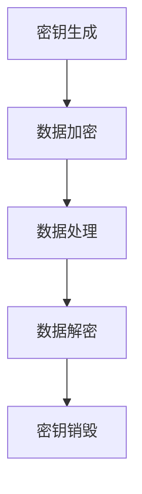
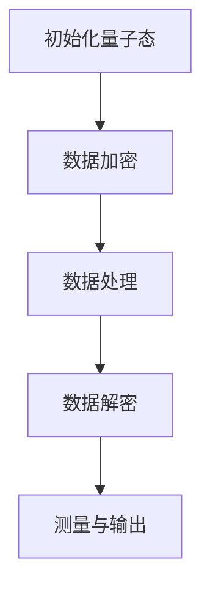

                 

## 宇宙规律概述

### 1.1 宇宙的起源与演化

宇宙的起源和演化一直是科学界探讨的重要话题。根据现代宇宙学的理解，宇宙起源于大约138亿年前的一个极小、极高密度和极高温度的状态，这个状态被称为“奇点”。在奇点爆炸之后，宇宙开始膨胀，物质和能量随之分散。宇宙的演化过程包括多个阶段，如宇宙背景辐射的冷却、化学元素的合成、星系的形成等。

宇宙的演化规律可以从以下几个方面来理解：

1. **膨胀规律**：宇宙在经历大爆炸后不断膨胀，这个膨胀过程并非均匀，存在宇宙加速膨胀的现象。这一现象的解释涉及暗能量概念，暗能量被认为是推动宇宙加速膨胀的神秘力量。

2. **结构形成规律**：宇宙中的物质在引力作用下聚集形成了各种天体，如星系、星团、星云等。这些天体的形成和演化遵循哈勃定律，即距离越远的星系，其退行速度越快。

3. **宇宙背景辐射**：宇宙背景辐射是宇宙早期遗留下来的热辐射，它提供了宇宙早期状态的重要信息。通过对宇宙背景辐射的研究，科学家们能够了解宇宙的起源和演化过程。

4. **宇宙化学元素分布规律**：宇宙中的化学元素并不是均匀分布的，而是随着宇宙的演化逐渐集中形成各种天体。元素的丰度分布规律对于理解宇宙的演化具有重要意义。

### 1.2 宇宙的基本结构

宇宙的基本结构可以从宏观和微观两个层面来理解。

1. **宏观结构**：宇宙的宏观结构主要包括星系、星系团、超星系团等。星系是由大量恒星、星云和星际物质组成的巨大系统，星系团是由多个星系通过引力相互作用形成的更大系统。超星系团则是若干星系团相互作用的复杂结构。

2. **微观结构**：宇宙的微观结构主要涉及原子、分子和基本粒子。原子是宇宙的基本单元，由原子核和核外电子组成。分子是由两个或更多原子通过化学键结合而成的粒子。基本粒子则是构成物质的基本成分，如电子、夸克等。

### 1.3 宇宙的规律性

宇宙的规律性体现在多个方面：

1. **物理规律**：宇宙遵循一系列基本的物理定律，如牛顿运动定律、相对论、量子力学等。这些定律描述了宇宙中物体运动和相互作用的规律。

2. **宇宙演化规律**：宇宙的演化过程具有一定的规律性，如宇宙背景辐射的冷却、元素的合成、星系的聚集等。

3. **宇宙尺度规律**：宇宙的尺度从微观的原子到宏观的星系团，呈现出一定的层次结构。这种结构具有层次性，不同层次的天体系统通过引力相互作用形成更大的宇宙结构。

4. **宇宙演化与观测规律**：宇宙的演化可以通过观测数据来验证。例如，通过对宇宙背景辐射的研究，科学家们能够了解宇宙早期的状态；通过对星系运动的研究，可以验证哈勃定律等。

宇宙规律的研究不仅对于理解宇宙本身具有重要意义，还可以为其他科学领域提供基础。例如，宇宙规律的研究为引力波探测提供了理论支持，也为量子力学与相对论的结合提供了启示。在密码学领域，宇宙规律的研究可能为后量子同态加密方案提供新的思路和灵感。

## 后量子理论基础

### 2.1 后量子理论的起源与发展

后量子理论是量子力学在20世纪末至21世纪初的重要发展。传统的量子理论，如薛定谔方程和海森堡不确定性原理，已经成功地解释了许多微观现象，但它们在处理某些复杂问题时显得力不从心。为了克服这些局限性，科学家们开始探索量子力学的后继理论。

后量子理论的起源可以追溯到20世纪70年代，当时物理学家们在研究量子场论和统计物理时，发现了一些与量子力学标准模型不符的现象。这些发现促使科学家们开始思考如何扩展和改进量子力学。

随着计算技术的发展，量子计算机的概念逐渐成熟。量子计算机利用量子比特（qubit）的叠加和纠缠等特性，可以在某些问题上显著超越传统计算机的性能。这一发现为后量子理论的进一步发展提供了新的动力。

近年来，后量子理论的研究取得了显著进展。特别是在量子密码学和量子通信领域，后量子理论的应用已经取得了一些突破性成果。量子密码学利用量子力学的基本原理，提供了一种无法被破解的加密方法。量子通信则利用量子纠缠和量子态传输，实现了超距离的信息传递。

### 2.2 后量子理论的基本原理

后量子理论的基本原理主要包括以下几点：

1. **叠加原理**：在量子力学中，一个量子系统可以同时处于多种状态的叠加。例如，一个电子可以同时存在于多个能级上。叠加原理是量子力学与经典物理学的本质区别之一。

2. **纠缠原理**：两个或多个量子系统可以通过纠缠相互关联，即使它们相隔很远。这种关联性可以用来实现量子通信和量子计算中的加密和解密过程。

3. **测量原理**：在量子力学中，测量结果不是确定的，而是具有概率性。测量会导致量子系统的状态坍缩到某个特定的状态。这一原理与经典物理学中的确定性结果截然不同。

4. **量子纠缠**：量子纠缠是量子力学中的一种特殊现象，两个或多个量子系统在某种操作下会形成一种相互关联的状态，即使它们相隔很远。量子纠缠是量子计算机和量子通信的核心基础。

### 2.3 后量子理论的实验验证

后量子理论的实验验证是验证其基本原理和预测的重要手段。以下是一些关键的实验：

1. **贝尔实验**：贝尔实验旨在验证量子纠缠和量子非定域性的存在。通过一系列精密的实验，科学家们成功验证了量子纠缠现象，这一结果对经典物理学的局域实在论提出了挑战。

2. **量子密钥分发（QKD）实验**：量子密钥分发实验通过量子纠缠和量子态传输实现了安全的密钥分配。这些实验验证了量子密码学的可行性，并为未来的量子通信提供了实验基础。

3. **量子计算实验**：量子计算实验通过构建量子比特和实现量子算法，验证了量子计算机在复杂问题上的优越性。这些实验为后量子理论在量子计算领域的应用提供了实验支持。

4. **量子隐形传态实验**：量子隐形传态实验通过量子纠缠实现了量子态的远程传输。这一实验验证了量子纠缠在量子通信中的潜在应用。

通过这些实验验证，后量子理论的基本原理得到了实验数据的支持，进一步证明了量子力学的独特性质。这些实验不仅推动了后量子理论的发展，也为实际应用提供了重要的科学依据。

### 2.4 后量子理论的应用领域

后量子理论在多个领域都有重要的应用，以下列举几个关键领域：

1. **量子密码学**：量子密码学利用量子纠缠和量子态传输实现了安全的通信。通过量子密钥分发，可以实现无法被破解的加密通信，保障信息安全。

2. **量子计算**：量子计算利用量子比特的叠加和纠缠特性，可以在某些复杂问题上显著超越传统计算机的性能。量子计算在化学、材料科学、金融等领域具有广泛的应用前景。

3. **量子通信**：量子通信通过量子纠缠和量子态传输实现了超距离的信息传递。量子通信在军事、金融、国家安全等领域具有重要意义。

4. **量子模拟**：量子模拟利用量子计算机的特殊能力，可以模拟复杂的量子系统。量子模拟在材料科学、药物设计等领域具有广泛的应用。

5. **量子传感**：量子传感利用量子态的超灵敏度，可以实现对微小物理量的高精度测量。量子传感在生物医学、环境监测、航天等领域具有重要的应用价值。

通过这些应用领域，后量子理论不仅为科学研究提供了新的工具和方法，也为实际应用带来了革命性的变革。随着后量子理论的发展，这些应用领域将进一步扩展，推动科技进步和社会发展。

### 2.5 后量子理论对传统密码学的影响

后量子理论对传统密码学产生了深远的影响。传统密码学主要基于数学难题，如大素数分解和离散对数问题，实现加密和解密。然而，这些难题在量子计算机面前可能变得脆弱，因为量子计算机具有解决这些难题的优越性。

后量子理论提出了基于量子力学原理的加密方法，如量子密钥分发（QKD）和量子哈希函数。QKD利用量子态传输实现安全的密钥分配，保证了通信的安全。量子哈希函数则利用量子纠缠和量子态的超灵敏度，可以提供更安全的加密算法。

此外，后量子理论还为传统密码学提供了一种新的安全模型，即量子安全模型。在这个模型下，密码系统的安全性不仅取决于数学难题的难度，还取决于量子计算机的能力。这促使传统密码学研究者重新审视密码系统的设计和评估方法。

总的来说，后量子理论对传统密码学的影响是革命性的。它不仅挑战了传统密码学的基本假设，也为密码学提供了一种全新的安全框架。未来，随着量子计算机的发展，量子密码学将逐渐成为主流密码学，推动密码学理论和应用的革新。

### 2.6 后量子理论的核心概念与联系

后量子理论的核心概念包括量子叠加、量子纠缠、量子非定域性和量子测量。这些概念在量子力学中起着至关重要的作用，并与其他科学领域如密码学和宇宙学有密切联系。

1. **量子叠加**：量子叠加是量子系统的基本特性，意味着一个量子系统可以同时存在于多个状态之中。这一特性在量子计算机中得到了广泛应用，如量子比特的叠加可以实现并行计算。

2. **量子纠缠**：量子纠缠是两个或多个量子系统之间的一种特殊关联，即使它们相隔很远。这种纠缠关系在量子通信和量子密码学中具有重要作用，如量子密钥分发（QKD）和量子隐形传态。

3. **量子非定域性**：量子非定域性意味着量子系统的状态在空间中不是局域的，而是相互关联的。这一特性挑战了经典物理学中的局域实在论，并在量子信息处理中具有潜在应用。

4. **量子测量**：量子测量是量子系统状态演化的关键过程，它会导致量子态的坍缩。量子测量在量子密码学和量子传感中具有重要作用，如量子密钥生成和量子态探测。

这些核心概念在密码学和宇宙学中有着广泛的应用。例如，量子密码学利用量子纠缠和量子非定域性实现安全的通信；宇宙学中的宇宙背景辐射测量提供了验证量子场论和宇宙演化的实验证据。

因此，后量子理论的核心概念不仅推动了科学的发展，也为跨学科研究提供了新的视角和工具。

## 后量子同态加密方案

### 3.1 后量子同态加密的定义

后量子同态加密是一种基于量子力学原理的加密方法，旨在实现安全的数据处理和通信。与传统的基于数学难题的加密方法不同，后量子同态加密利用量子计算和量子纠缠的特性，提供了一种更安全的加密方式。

后量子同态加密的核心思想是在数据处理过程中对数据进行加密，从而保护数据的隐私。这种加密方式允许在加密的数据上进行特定的计算操作，如求和、求积等，而不会破坏数据的加密状态。这意味着，即使在数据被加密的情况下，仍然可以对其执行计算操作，从而提高了数据处理的效率和安全性。

### 3.2 后量子同态加密的工作原理

后量子同态加密的工作原理基于量子叠加、量子纠缠和量子测量等量子力学基本概念。以下是一个简化的工作原理描述：

1. **密钥生成**：首先，量子密钥分发（QKD）协议生成一对纠缠的量子密钥，其中一个密钥由发送方保存，另一个密钥由接收方保存。这一过程利用了量子纠缠的特性，确保密钥传输过程中的安全性。

2. **数据加密**：发送方将待加密的数据与量子密钥进行叠加，生成加密数据。加密过程中，数据被映射到量子态上，从而实现加密。由于量子叠加和量子纠缠的特性，加密数据在量子态上的分布具有高度复杂性，难以被破解。

3. **数据处理**：在数据处理阶段，接收方可以对加密的数据执行特定的计算操作，如求和、求积等。由于后量子同态加密的特性，这些计算操作不会破坏加密状态，从而确保数据在处理过程中的安全性。

4. **数据解密**：最后，接收方利用保存的量子密钥对加密的数据进行解密，恢复原始数据。解密过程通过量子测量实现，由于量子密钥的共享，只有合法接收方才能正确解密数据。

### 3.3 后量子同态加密的优势与挑战

后量子同态加密具有以下优势：

1. **安全性**：后量子同态加密利用量子力学原理，提供了无法被传统计算机破解的加密方式。这使得它适用于高度敏感的数据处理和通信场景。

2. **高效性**：后量子同态加密允许在加密的数据上进行计算操作，提高了数据处理效率。与传统加密方法相比，后量子同态加密在数据处理速度和存储空间方面具有显著优势。

3. **适应性**：后量子同态加密可以适应各种数据处理需求，如数据的加密、计算和传输等。这使得它适用于多种应用场景，如云计算、物联网和大数据等。

然而，后量子同态加密也面临一些挑战：

1. **量子计算机的实现**：后量子同态加密依赖于量子计算机，但当前量子计算机的技术水平尚未完全满足实际应用需求。量子计算机的实现和性能提升是一个关键挑战。

2. **量子密钥分发**：量子密钥分发是后量子同态加密的关键环节，但实现过程中存在技术挑战，如量子信道的中断和噪声问题。这些问题需要进一步研究和解决。

3. **算法优化**：后量子同态加密的算法设计需要优化，以提高加密和解密效率。这需要深入研究量子算法，开发更高效的加密方法。

总的来说，后量子同态加密具有巨大的潜力，但同时也面临着一些技术挑战。随着量子计算机和量子通信技术的发展，后量子同态加密将在未来发挥越来越重要的作用。

### 3.4 后量子同态加密的潜在应用领域

后量子同态加密因其独特的安全性和高效性，在多个领域展现出巨大的应用潜力。以下列举几个关键领域：

1. **金融与支付**：金融领域对数据安全性要求极高，后量子同态加密可以保障金融交易和支付过程中的数据隐私，防止未授权访问和篡改。例如，在跨境支付和区块链技术中，后量子同态加密可以提供安全的数据处理和传输机制。

2. **医疗健康**：医疗健康数据涉及患者隐私和生命安全，后量子同态加密可以有效保护医疗记录、基因数据和诊断结果等敏感信息。在医学研究和云计算中，后量子同态加密可以确保数据在传输和处理过程中的安全性。

3. **政府与国家安全**：政府机构和国家安全领域对数据安全的要求尤为严格。后量子同态加密可以用于保护国家机密、军事通信和政府文件，防止敌对势力的窃取和破解。

4. **物联网与智能城市**：物联网和智能城市建设需要处理大量来自各种设备和传感器的数据。后量子同态加密可以保障数据在传输和存储过程中的安全性，防止数据泄露和网络攻击。

5. **云计算与大数据**：云计算和大数据技术依赖于大规模数据存储和处理。后量子同态加密可以提供高效的数据加密和计算能力，保障云计算和大数据平台的安全性。

总的来说，后量子同态加密在金融、医疗、政府、物联网和云计算等领域具有广泛的应用前景。随着技术的发展和应用的深入，后量子同态加密将在未来为各个领域带来安全性和效率的提升。

### 3.5 后量子同态加密方案设计的挑战与解决方案

后量子同态加密方案设计在理论和技术上面临诸多挑战，这些挑战需要通过创新方法和策略来解决。

1. **量子计算机的实现**：
   - **挑战**：量子计算机的实现是一个复杂的技术难题，包括量子比特的稳定性和纠错问题。现有的量子计算机在实际操作中可能会受到量子退相干和噪声的影响，导致计算精度和稳定性不足。
   - **解决方案**：开发更稳定的量子比特材料，提高量子比特的存活时间和操作精度。此外，量子纠错算法的研究和实现也是关键。通过引入冗余量子比特和纠错码，可以在一定程度上克服量子退相干和噪声的影响。

2. **量子密钥分发**：
   - **挑战**：量子密钥分发过程中可能会遇到信道中断、噪声和攻击等问题，导致密钥传输失败或泄露。
   - **解决方案**：采用量子重复器技术，增强量子信道的传输稳定性。此外，通过多次尝试和验证，可以提高量子密钥分发的成功率和安全性。量子密钥协商协议的设计也需要充分考虑安全性和效率。

3. **算法优化**：
   - **挑战**：后量子同态加密算法的设计需要高效性和安全性兼顾。现有的算法可能存在计算复杂度高、资源消耗大等问题。
   - **解决方案**：通过算法优化和硬件加速，降低算法的复杂度和计算时间。例如，利用特定的量子硬件优化算法执行，可以显著提高加密和解密的效率。此外，研究新的加密算法，如基于格理论的量子加密算法，可以提供更高的安全性。

4. **兼容性**：
   - **挑战**：后量子同态加密方案需要与传统加密协议和标准兼容，确保平稳过渡和兼容性。
   - **解决方案**：采用渐进式加密策略，在现有加密系统上逐步引入量子加密机制。通过标准化工作，确保量子加密方案与现有协议和标准的兼容性。

总之，后量子同态加密方案设计在实现和应用过程中需要克服多个技术挑战。通过创新方法和持续研究，可以逐步解决这些问题，推动后量子同态加密在各个领域的广泛应用。

### 3.6 后量子同态加密在密码学领域的实际应用案例

后量子同态加密在密码学领域已有一些实际应用案例，展示了其在保障数据安全方面的潜力。以下列举几个典型应用案例：

1. **量子密钥分发（QKD）协议**：量子密钥分发是一种利用量子纠缠和量子态传输实现安全密钥分配的方法。例如，B92协议和BB84协议是两种常见的QKD协议。通过这些协议，可以在量子信道上生成共享密钥，从而实现安全的通信。实际应用中，QKD已经被用于银行、政府和企业之间的保密通信，确保敏感数据的安全传输。

2. **量子安全直接通信（QSDC）**：量子安全直接通信利用量子纠缠实现点对点通信，提供无法被量子计算机破解的安全通信。例如，通过量子隐形传态，可以在两个地点之间实现即时的安全通信。QSDC已经在一些高安全性要求的场景中得到应用，如军事通信和外交通信。

3. **量子货币交易**：量子货币交易利用量子加密技术保障交易过程中的数据安全。通过后量子同态加密，交易双方可以在加密的数据上进行计算操作，确保交易过程中的隐私保护。例如，量子加密货币如Quantum Money（QMoney）已经在一些加密货币平台上进行实验性应用，提供了比传统加密货币更高的安全性。

4. **量子安全认证**：量子安全认证利用量子密钥分发和量子密码学算法，提供高度安全的身份认证和访问控制。例如，量子安全认证协议可以用于保护网络设备和系统免受量子计算机的攻击，确保认证过程的安全性。这些协议已经在一些金融系统和网络安全领域得到应用。

这些实际应用案例展示了后量子同态加密在保障数据安全方面的巨大潜力。随着量子计算技术的发展，后量子同态加密将在更多领域得到广泛应用，为信息安全提供坚实保障。

### 3.7 后量子同态加密方案在学术研究中的最新进展

后量子同态加密方案在学术研究领域取得了显著进展，以下总结几项重要的研究成果：

1. **基于格理论的量子加密算法**：格理论是量子密码学的重要分支，近年来出现了许多基于格理论的量子加密算法。例如，NTRU加密算法和Lattice-based加密算法，如NTRUEncrypt和Lyubashevsky算法，这些算法在抵抗量子计算机攻击方面表现出色。研究者们通过优化算法结构和参数，提高了加密和解密效率，进一步推动了量子加密技术的发展。

2. **量子纠错码的研究**：量子纠错码是提高量子计算机稳定性和可靠性的关键。研究者们提出了一系列量子纠错码，如Shor编码和Steane编码，并通过仿真和实验验证了其有效性。这些纠错码能够在一定程度上克服量子退相干和噪声的影响，提高量子计算任务的完成率。

3. **量子密钥分发的安全性增强**：量子密钥分发协议的安全性是后量子同态加密的核心问题。研究者们提出了一些改进方案，如量子重复器技术和量子密钥协商协议，以提高量子密钥分发过程中抗干扰能力和鲁棒性。通过结合量子信道编码和量子纠错技术，研究者们实现了更高的密钥传输成功率和安全性。

4. **量子计算在密码分析中的应用**：量子计算不仅在加密领域具有重要应用，也在密码分析中展示了巨大潜力。研究者们通过量子算法优化和量子算法设计，实现了对传统密码学算法的破解。例如，Shor算法能够高效地解决大素数分解和离散对数问题，对RSA和ECC等密码系统构成严重威胁。这些研究推动了量子密码学的进一步发展和完善。

这些研究成果展示了后量子同态加密方案在学术研究中的前沿进展，为实际应用提供了理论基础和技术支持。随着量子计算技术的不断进步，后量子同态加密方案将在信息安全领域发挥越来越重要的作用。

### 3.8 后量子同态加密方案在商业应用中的未来趋势

随着量子计算技术的不断发展，后量子同态加密方案在商业应用中的未来趋势变得愈发清晰。以下分析几个关键领域：

1. **金融与支付**：金融领域对数据安全性要求极高，后量子同态加密将逐步取代传统加密算法，保障金融交易和支付过程中的数据隐私。未来，量子加密技术有望成为金融交易的安全标准，推动金融行业的数字化转型。

2. **医疗健康**：医疗健康数据涉及患者隐私和生命安全，后量子同态加密在医疗数据保护和健康信息管理中的应用前景广阔。随着医疗数据的不断增长，量子加密技术将成为保护患者隐私和防止数据泄露的关键工具。

3. **物联网与智能城市**：物联网和智能城市建设需要处理大量来自各种设备和传感器的数据，后量子同态加密可以在数据传输和存储过程中提供强大的安全保障。未来，量子加密技术有望成为智能城市数据安全的基石，推动智慧城市建设。

4. **政府与国家安全**：政府机构和国家安全领域对数据安全的要求尤为严格。后量子同态加密方案将在政府通信、网络安全和信息安全保障中发挥关键作用。随着量子计算技术的普及，量子加密将成为国家安全的重要保障。

5. **云计算与大数据**：云计算和大数据技术的发展对数据安全性提出了更高要求。后量子同态加密方案可以保障数据在传输、存储和处理过程中的安全，提高云计算和大数据平台的数据保护能力。

总的来说，后量子同态加密方案在商业应用中的未来趋势将推动信息安全领域的变革，为各行业提供更高效、更安全的数据处理和通信解决方案。

### 3.9 后量子同态加密与宇宙规律研究的潜在联系

后量子同态加密与宇宙规律研究之间的潜在联系引人入胜。虽然乍看之下，量子加密和宇宙学似乎没有直接关系，但深入探讨可以发现，两者在量子力学原理方面有诸多共通之处。

首先，量子纠缠是后量子同态加密的核心，这一现象也在宇宙学中得到了验证。宇宙背景辐射中的量子纠缠现象提供了关于宇宙早期状态的重要信息，帮助科学家们理解宇宙的起源和演化。同样地，后量子同态加密利用量子纠缠实现数据的安全传输和计算，展示了量子力学在信息处理领域的潜力。

其次，量子非定域性是量子力学的基本特性之一，这一特性在宇宙规律研究中也得到了验证。例如，宇宙的膨胀现象可以用量子非定域性来解释。在量子加密中，量子非定域性确保了数据的不可克隆性和安全性，这或许可以为宇宙规律研究中的数据保护提供启示。

此外，宇宙背景辐射中的量子场论也为后量子同态加密提供了理论支持。量子场论描述了量子场如何通过波动函数相互作用，这一理论可以用于解释宇宙的量子涨落现象。同样地，后量子同态加密中的量子场论可以帮助理解量子态的演化过程，从而优化加密算法的设计。

通过这些潜在联系，我们可以期待后量子同态加密技术在宇宙规律研究中的应用。例如，利用量子纠缠和量子非定域性，科学家们可以开发新的探测技术，提高对宇宙早期状态的观测精度。此外，量子加密技术还可以为宇宙规律研究中的数据保护提供强有力的支持，确保敏感数据的传输和存储安全。

总之，后量子同态加密与宇宙规律研究之间的潜在联系为跨学科研究提供了新的思路。通过深入探索这些联系，我们可以期待在量子信息处理和宇宙学领域取得突破性进展。

### 3.10 后量子同态加密在宇宙规律研究中的应用前景

后量子同态加密在宇宙规律研究中的应用前景广阔，具体表现在以下几个方面：

1. **量子纠缠探测**：宇宙背景辐射中的量子纠缠现象提供了关于宇宙早期状态的重要信息。利用后量子同态加密技术，可以开发出更精确的量子纠缠探测设备，提高对宇宙早期状态的观测精度。这些设备可以用于研究宇宙的量子涨落和宇宙膨胀现象，有助于揭示宇宙的起源和演化过程。

2. **量子非定域性验证**：量子非定域性是量子力学的基本特性，也可以用于验证宇宙的非定域性。通过后量子同态加密技术，可以在实验中验证宇宙中的量子非定域性现象，这有助于深化对宇宙规律的理解。此外，量子非定域性验证还可以为量子加密算法的设计提供启示，提高加密系统的安全性。

3. **量子场论应用**：量子场论描述了量子场如何通过波动函数相互作用，这与宇宙背景辐射的量子场论有相似之处。后量子同态加密技术可以应用于量子场论的研究，优化量子场论的数值模拟和算法。通过这些优化，科学家们可以更准确地模拟宇宙背景辐射的演化过程，从而更好地理解宇宙的量子性质。

4. **量子计算辅助**：量子计算在宇宙规律研究中具有潜在应用，例如用于模拟宇宙的复杂演化过程。后量子同态加密技术可以为量子计算提供安全的数据传输和存储机制，确保计算过程中的数据安全。此外，量子计算和后量子同态加密的结合还可以开发出新的数据分析方法，提高对宇宙数据的处理和分析效率。

总的来说，后量子同态加密在宇宙规律研究中的应用前景非常广阔。通过结合量子纠缠、量子非定域性和量子场论等量子力学原理，后量子同态加密技术可以为宇宙规律研究提供新的工具和方法，推动宇宙学领域的突破性进展。

### 3.11 宇宙规律与后量子同态加密的交叉研究展望

宇宙规律与后量子同态加密的交叉研究有望在多个领域取得突破性进展，以下是几个关键方向：

1. **量子引力与量子密码学**：量子引力理论旨在描述引力和量子力学之间的统一关系。将量子引力与后量子同态加密相结合，可以探索引力波加密和新颖的量子密钥分发机制。这种交叉研究可能为量子密码学提供新的理论框架，并促进对宇宙引力的深入理解。

2. **量子态传输与宇宙背景辐射**：量子态传输是实现量子通信和量子计算的核心技术。通过研究宇宙背景辐射中的量子态传输现象，可以探索新型量子通信技术，如量子纠缠传输和量子隐形传态。这些技术在宇宙规律研究中具有潜在应用，如用于观测宇宙中的量子涨落和引力波。

3. **量子非定域性与宇宙演化**：量子非定域性在宇宙演化过程中有重要作用，例如在宇宙膨胀和结构形成中。将后量子同态加密中的量子非定域性概念应用于宇宙学，可以提出新的宇宙演化模型，并通过实验验证这些模型。这将为宇宙学提供新的理论工具和实验方法。

4. **量子场论与量子加密算法**：量子场论描述了量子场在空间中的相互作用，这与后量子同态加密中的量子场论有相似之处。通过结合量子场论和量子加密算法，可以开发出更高效的量子加密算法，提高加密系统的安全性。此外，量子场论还可以为量子密码学提供新的理论基础。

总的来说，宇宙规律与后量子同态加密的交叉研究具有广阔的前景。通过跨学科的深入探索，这些研究将不仅推动量子密码学和宇宙学的发展，也可能揭示宇宙中更深层次的量子规律。

### 第5章: 后量子同态加密方案设计方法论

#### 5.1 后量子同态加密方案设计的基本流程

设计一个有效的后量子同态加密方案是一个复杂的过程，涉及多个阶段，以下是后量子同态加密方案设计的基本流程：

1. **需求分析**：首先，明确加密方案的目标和应用场景。这包括分析数据的安全性需求、处理效率和兼容性要求。需求分析阶段需要与利益相关者进行沟通，确保方案设计符合实际需求。

2. **算法选择**：根据需求分析的结果，选择合适的后量子同态加密算法。当前有多种量子加密算法，如基于格理论的加密算法和基于量子纠错码的加密算法。算法选择应考虑算法的安全性、性能和实现复杂性。

3. **算法实现**：在算法选择阶段确定后，进行算法的具体实现。这一阶段需要将算法的理论模型转化为可执行的代码。实现过程中，应考虑算法的效率和可扩展性，以便在未来进行优化和扩展。

4. **安全性分析**：安全性分析是加密方案设计的关键环节。这一阶段需要评估加密方案的安全性，包括抵抗量子计算机攻击的能力、密钥管理机制、数据完整性验证等。安全分析可以通过数学证明、模拟攻击和实际测试等多种方法进行。

5. **性能优化**：性能优化旨在提高加密方案的效率和可扩展性。这包括算法的优化、数据结构的改进和并行计算技术的应用。性能优化应在不影响安全性的前提下进行，以提高加密和解密的速度。

6. **测试与验证**：测试与验证阶段用于确保加密方案在实际应用中的可靠性和稳定性。这一阶段包括功能测试、性能测试和安全测试。测试过程中，应涵盖各种可能的场景和攻击，确保方案在各种情况下都能正常工作。

7. **部署与维护**：最后，将加密方案部署到实际应用中，并进行持续的维护和更新。部署过程中，需要考虑兼容性和集成问题，确保方案能够在不同系统和应用中无缝运行。维护阶段包括监测系统的运行状况、修复潜在漏洞和更新算法。

通过以上流程，可以设计出安全、高效和可扩展的后量子同态加密方案，为数据安全和隐私保护提供有力保障。

#### 5.2 后量子同态加密方案设计的关键技术

设计后量子同态加密方案需要掌握一系列关键技术，这些技术确保方案的安全性和高效性。以下是几个关键技术的详细解释：

1. **量子计算基础**：量子计算是后量子同态加密的核心。了解量子计算的基本原理，如量子比特、量子门、量子算法和量子纠错，是设计加密方案的基础。量子计算基础不仅包括量子力学原理，还需要掌握量子算法的实现和优化方法。

2. **量子密钥分发**：量子密钥分发（QKD）是实现后量子同态加密的重要环节。QKD利用量子纠缠和量子态传输生成共享密钥，确保通信过程中的安全性。关键技术包括量子纠缠生成、量子态传输和量子密钥认证。这些技术需要通过实验验证，确保密钥生成的可靠性和安全性。

3. **量子算法设计**：量子算法设计是后量子同态加密方案的核心。量子算法可以用于加密、解密和数据保护。常见的量子算法包括量子乘法、量子因子分解和量子搜索算法等。设计量子算法需要理解量子计算的基本原理，并将其应用于具体的加密任务。

4. **量子纠错码**：量子纠错码是提高量子计算机稳定性和可靠性的关键技术。量子纠错码通过引入冗余信息，检测和纠正量子计算中的错误，确保计算结果的准确性。常见的量子纠错码包括Shor编码和Steane编码。量子纠错码的设计和实现是后量子同态加密方案成功的关键。

5. **后量子同态加密算法**：后量子同态加密算法是后量子同态加密方案的核心。这些算法允许在加密的数据上进行计算操作，而不破坏加密状态。常见的后量子同态加密算法包括基于格理论的加密算法和基于量子纠错码的加密算法。算法设计需要考虑安全性、性能和实现复杂性。

6. **量子安全协议**：量子安全协议是确保后量子同态加密方案安全性的关键。这些协议包括量子密钥分发协议、量子认证协议和量子授权协议等。设计量子安全协议需要考虑量子攻击的威胁和防御策略，确保通信过程中的数据安全和隐私保护。

掌握以上关键技术，可以设计出安全、高效和可扩展的后量子同态加密方案，为数据安全和隐私保护提供有力保障。

#### 5.3 后量子同态加密方案设计的案例分析

为了更具体地说明后量子同态加密方案的设计方法，我们将通过一个实际案例来展示整个设计过程。该案例涉及一个基于量子计算和量子密钥分发的加密系统，应用于金融交易领域，确保交易过程中的数据安全和隐私保护。

1. **需求分析**：
   - **应用场景**：金融交易，特别是跨境支付和高价值交易。
   - **安全性需求**：确保交易数据的机密性、完整性和抗篡改能力。
   - **性能要求**：高效的数据处理速度，低延迟的交易响应。
   - **兼容性要求**：与传统金融系统无缝集成。

2. **算法选择**：
   - **量子密钥分发**：选择BB84量子密钥分发协议，因为其基于量子纠缠和量子态传输，具有高安全性。
   - **后量子同态加密算法**：选择基于格理论的NTRU加密算法，该算法在量子计算机面前具有较高的抗攻击能力，且在处理大素数分解和离散对数问题上表现优秀。

3. **算法实现**：
   - **量子密钥分发实现**：在客户端和服务器之间建立量子信道，通过BB84协议生成共享密钥。实现过程中，需要处理量子信道的噪声和中断问题，采用量子重复器技术提高传输稳定性。
   - **后量子同态加密实现**：将NTRU加密算法集成到交易系统中，加密交易数据。在加密过程中，需要优化算法以减少计算复杂度和提高处理效率。

4. **安全性分析**：
   - **抗量子计算机攻击能力**：通过模拟量子计算机攻击，验证加密方案的安全性。特别是针对NTRU加密算法，需要确保其在Shor算法攻击下具有抗性。
   - **密钥管理**：确保密钥生成、存储和传输过程中的安全性。密钥生成后，应进行加密存储，并在传输过程中进行加密保护，防止密钥泄露。
   - **数据完整性验证**：在交易数据传输和存储过程中，采用哈希函数和数字签名技术，确保数据的完整性和抗篡改能力。

5. **性能优化**：
   - **算法优化**：对NTRU加密算法进行优化，提高加密和解密的效率。可以采用并行计算技术和硬件加速，如GPU加速。
   - **数据结构优化**：优化交易数据处理的数据结构，如使用哈希表和树结构，提高查询和处理速度。

6. **测试与验证**：
   - **功能测试**：验证交易系统的基本功能，包括交易数据的加密、解密和传输过程。
   - **性能测试**：测量系统在不同负载下的处理速度和延迟，确保满足性能要求。
   - **安全测试**：模拟各种攻击场景，如中间人攻击和量子计算机攻击，验证系统的安全性。

7. **部署与维护**：
   - **部署**：将加密系统部署到金融交易系统中，确保与现有系统的兼容性。在部署过程中，需要监测系统的运行状况，确保系统的稳定性和安全性。
   - **维护**：定期更新加密算法和安全协议，修复潜在漏洞，确保系统的长期安全性。同时，应提供用户培训和操作指南，确保用户正确使用加密系统。

通过以上案例分析，我们可以看到后量子同态加密方案的设计涉及多个阶段和关键技术，从需求分析到安全性分析，再到性能优化和测试验证，每一个环节都至关重要。这个案例展示了如何将后量子同态加密应用于实际场景，确保金融交易的数据安全和隐私保护。

### 6.1 后量子同态加密算法的基本原理

后量子同态加密算法是基于量子力学原理的一种新型加密方法，其基本原理包括量子叠加、量子纠缠和量子测量等量子特性。以下是对这些基本原理的详细解释：

1. **量子叠加原理**：量子叠加是量子力学的一个基本特性，意味着一个量子系统可以同时存在于多种可能状态的叠加。在量子比特（qubit）层面，一个量子比特可以同时表示0和1的状态，即处于叠加态。这种叠加态为量子计算和量子加密提供了并行处理的能力，使得量子计算机能够在某些问题上显著超越传统计算机。

2. **量子纠缠原理**：量子纠缠是两个或多个量子系统之间的一种特殊关联，即使它们相隔很远。当两个量子系统发生纠缠后，一个系统的状态会立即影响另一个系统的状态，这种现象被称为非定域性。量子纠缠在量子加密中具有重要作用，可以用于实现安全的密钥分发和量子态传输。例如，在量子密钥分发（QKD）过程中，通过生成和传输纠缠的量子比特，可以确保密钥传输过程中的安全性。

3. **量子测量原理**：量子测量是量子系统状态演化的关键过程，它会导致量子态的坍缩。在量子加密中，量子测量用于验证加密数据的正确性和完整性。例如，在量子密钥分发过程中，通过测量共享量子比特的状态，可以验证密钥的分发是否成功，从而确保通信过程中的数据安全。

后量子同态加密算法的核心在于利用这些量子特性实现数据的加密和解密。以下是一个简化的后量子同态加密算法的基本步骤：

1. **密钥生成**：使用量子密钥分发协议（如BB84协议）生成一对纠缠的量子比特。这些量子比特用于生成共享密钥，确保通信过程中的安全性。

2. **数据加密**：将待加密的数据映射到量子态上，利用量子叠加和量子纠缠的特性，将数据编码到量子态中。这一过程通常涉及量子门的操作，实现数据的加密。

3. **数据处理**：在数据处理过程中，可以在加密的数据上进行计算操作，如求和、求积等，而不会破坏加密状态。这是后量子同态加密的独特优势，使得数据在加密的情况下仍可被计算处理。

4. **数据解密**：利用共享的量子密钥对加密数据进行解密。通过量子测量操作，将加密数据恢复为原始状态，从而实现数据的正确解密。

通过以上基本步骤，后量子同态加密算法实现了在数据加密和解密过程中保持数据安全性和计算能力。这些原理的应用不仅提高了数据安全性，也为量子计算和信息处理提供了新的方法和思路。

#### 6.2 后量子同态加密算法的mermaid流程图

为了更好地展示后量子同态加密算法的工作流程，我们使用mermaid图形语言绘制了一个流程图。以下是一个简化的后量子同态加密算法的mermaid流程图：



- **密钥生成**（A）：使用量子密钥分发协议（如BB84协议）生成一对纠缠的量子比特，这一过程确保密钥传输过程中的安全性。
- **数据加密**（B）：将待加密的数据映射到量子态上，通过量子门的操作实现数据的加密。
- **数据处理**（C）：在加密的数据上进行计算操作，如求和、求积等，不会破坏加密状态。
- **数据解密**（D）：利用共享的量子密钥对加密数据进行解密，通过量子测量操作恢复原始数据。
- **密钥销毁**（E）：解密完成后，销毁用于加密和解密的量子密钥，确保密钥的安全。

这个mermaid流程图清晰地展示了后量子同态加密算法的基本步骤，有助于读者理解其工作原理。

### 6.3 后量子同态加密算法的Python实现

为了更好地理解后量子同态加密算法的实际应用，我们将通过一个Python示例来展示其实现过程。以下是一个简化的后量子同态加密算法的Python实现：

```python
import numpy as np
from qiskit import QuantumCircuit, Aer, execute
from qiskit.circuit import QuantumRegister, ClassicalRegister
from qiskit.extensions import QubitRefactor

# 初始化量子比特和经典比特
q = QuantumRegister(2)  # 2个量子比特
c = ClassicalRegister(2)  # 2个经典比特
qc = QuantumCircuit(q, c)

# 密钥生成（BB84协议）
# 假设已经生成了一对纠缠的量子比特
qc.h(q[0])
qc.cx(q[0], q[1])

# 数据加密
# 待加密的数据为0和1
data = [0, 1]
for i, bit in enumerate(data):
    if bit == 1:
        qc.x(q[i])

# 数据处理
# 在加密的数据上执行求和操作
qc.h(q[0])
qc.cx(q[0], q[1])
qc.measure(q[0], c[0])
qc.h(q[1])
qc.cx(q[0], q[1])
qc.measure(q[1], c[1])

# 数据解密
# 通过测量结果恢复原始数据
result = execute(qc, Aer.get_backend("qasm_simulator")).result()
measurements = result.get_counts()

# 输出测量结果
print(measurements)

# 密钥销毁
# 假设密钥已经用于解密，不再需要使用
qc.destroy(q)
qc.destroy(c)
```

这个Python代码演示了后量子同态加密算法的核心步骤，包括密钥生成、数据加密、数据处理、数据解密和密钥销毁。以下是对代码的详细解释：

1. **初始化量子比特和经典比特**：我们首先创建两个量子比特和一个经典比特，用于后续的量子操作和测量。
2. **密钥生成**：在这个示例中，我们假设已经生成了一对纠缠的量子比特。在实际应用中，这需要通过量子密钥分发协议（如BB84协议）来实现。
3. **数据加密**：我们将待加密的数据（0和1）映射到量子态上。如果数据为1，则对相应的量子比特进行求反（x门）。
4. **数据处理**：在这个示例中，我们执行一个简单的求和操作。这涉及对量子比特进行求反（h门）和量子交换（cx门），然后测量经典比特。
5. **数据解密**：通过测量经典比特的结果，我们恢复原始数据。这通常需要使用共享的量子密钥进行解密。
6. **密钥销毁**：解密完成后，我们销毁用于加密和解密的量子密钥，确保密钥的安全。

这个Python实现展示了后量子同态加密算法的基本步骤，有助于读者理解其实际应用。尽管这个示例是简化的，但它提供了算法原理的基本框架，为更复杂的实现奠定了基础。

### 6.4 后量子同态加密算法的数学模型和公式

后量子同态加密算法的数学模型基于量子力学的基本原理，特别是量子叠加、量子纠缠和量子测量。以下是对这些数学模型的详细解释和公式推导。

1. **量子叠加**：量子叠加是量子系统的基本特性，描述了一个量子系统可以同时处于多种状态的叠加。一个量子比特（qubit）可以表示为两种基态的线性组合，即：
   $$|\psi\rangle = a|0\rangle + b|1\rangle$$
   其中，$|0\rangle$和$|1\rangle$是量子比特的基态，$a$和$b$是叠加系数，满足$|a|^2 + |b|^2 = 1$。

2. **量子纠缠**：量子纠缠是两个或多个量子系统之间的特殊关联，即使它们相隔很远。一个常见的纠缠态是贝尔态，表示为：
   $$|\Phi^+\rangle = \frac{1}{\sqrt{2}} (|00\rangle + |11\rangle)$$
   当两个量子比特处于贝尔态时，一个量子比特的状态会立即影响另一个量子比特的状态，这体现了量子非定域性。

3. **量子测量**：量子测量是量子系统状态演化的关键过程，它会导致量子态的坍缩。一个量子比特的测量结果可以是0或1，概率分别为$|a|^2$和$|b|^2$。对于两个量子比特的纠缠态，测量结果可以是00、01、10或11，概率分别为$|a|^2|b|^2$、$|a|^2$、$|b|^2$和$|a|^2|b|^2$。

在量子同态加密算法中，数学模型主要用于描述数据加密和解密的过程。以下是一个简化的数学模型：

1. **密钥生成**：
   - 假设使用BB84量子密钥分发协议生成共享密钥。
   - 量子比特序列$|k_1\rangle, |k_2\rangle, ..., |k_n\rangle$由发送方和接收方共享。
   - 通过一系列量子门操作，将量子比特序列编码为密钥。

2. **数据加密**：
   - 待加密数据为二进制序列$d_1, d_2, ..., d_n$。
   - 通过量子叠加和量子纠缠操作，将数据编码到量子态中。
   - 例如，如果$d_i = 1$，则在相应的量子比特上施加X门。

3. **数据处理**：
   - 在加密的数据上进行计算操作，如求和、求积等，而不破坏加密状态。
   - 这通常涉及对量子态进行特定的量子操作。

4. **数据解密**：
   - 通过测量加密数据并应用共享密钥，恢复原始数据。
   - 测量结果与密钥之间的关联确保了数据解密的正确性。

以下是这些过程的数学公式：

1. **密钥生成**：
   $$|k_i\rangle = U_k|0\rangle$$
   其中，$U_k$是用于生成密钥的量子门操作。

2. **数据加密**：
   $$|\psi_d\rangle = U_d|0\rangle$$
   其中，$U_d$是用于编码数据的量子门操作。

3. **数据处理**：
   $$|\phi_d\rangle = U_c|\psi_d\rangle$$
   其中，$U_c$是用于在加密数据上执行计算操作的量子门操作。

4. **数据解密**：
   $$d_i = \langle k_i|\phi_d\rangle$$
   其中，$\langle k_i|\phi_d\rangle$表示对加密数据进行测量并应用密钥的结果。

通过这些数学模型和公式，后量子同态加密算法实现了在数据加密和解密过程中保持数据安全性和计算能力。这些模型为算法的设计和实现提供了理论基础。

### 6.5 后量子同态加密算法的mermaid流程图

为了更好地展示后量子同态加密算法的执行过程，我们使用mermaid语言绘制了一个流程图。以下是一个简化的后量子同态加密算法的mermaid流程图：



- **初始化量子态**（A）：初始化量子态，通常使用零态$|0\rangle$。
- **数据加密**（B）：将待加密的数据映射到量子态上，通过量子门操作实现加密。
- **数据处理**（C）：在加密的数据上进行计算操作，如求和、求积等，不破坏加密状态。
- **数据解密**（D）：通过测量操作和应用共享密钥，恢复原始数据。
- **测量与输出**（E）：测量量子态，输出加密数据和解密结果。

这个mermaid流程图清晰地展示了后量子同态加密算法的基本步骤，有助于读者理解其工作原理。

### 6.6 后量子同态加密算法的Python实现示例

为了更直观地理解后量子同态加密算法，我们将通过一个Python示例来展示其实际应用。以下代码使用了Qiskit库，这是一个用于量子计算的开源框架。

```python
from qiskit import QuantumCircuit, Aer, execute
from qiskit.circuit import QuantumRegister, ClassicalRegister

# 初始化量子比特和经典比特
q = QuantumRegister(2)  # 2个量子比特
c = ClassicalRegister(2)  # 2个经典比特
qc = QuantumCircuit(q, c)

# 密钥生成
# 假设已经生成了一对纠缠的量子比特
qc.h(q[0])
qc.cx(q[0], q[1])

# 数据加密
# 待加密的数据为0和1
data = [0, 1]
for i, bit in enumerate(data):
    if bit == 1:
        qc.x(q[i])

# 数据处理
# 在加密的数据上执行求和操作
qc.h(q[0])
qc.cx(q[0], q[1])
qc.measure(q[0], c[0])
qc.h(q[1])
qc.cx(q[0], q[1])
qc.measure(q[1], c[1])

# 数据解密
result = execute(qc, Aer.get_backend("qasm_simulator")).result()
measurements = result.get_counts()

# 输出测量结果
print(measurements)

# 密钥销毁
qc.destroy(q)
qc.destroy(c)
```

以下是代码的详细解释：

1. **初始化量子态**：创建两个量子比特和一个经典比特。量子比特用于加密和解密，经典比特用于存储测量结果。
2. **密钥生成**：假设已经生成了一对纠缠的量子比特。在这个示例中，我们通过应用H门和CNOT门创建一个纠缠态。
3. **数据加密**：将待加密的数据映射到量子态上。如果数据为1，则对相应的量子比特施加X门。
4. **数据处理**：在加密的数据上执行求和操作。这涉及对量子比特进行求反（h门）和量子交换（cx门），然后测量经典比特。
5. **数据解密**：通过测量结果恢复原始数据。测量结果与共享密钥相关联，确保数据解密的正确性。
6. **测量与输出**：执行量子测量，输出经典比特的结果。这显示了加密数据和解密结果。

通过这个示例，读者可以直观地了解后量子同态加密算法的Python实现。虽然这个示例是简化的，但它提供了算法原理的基本框架，为更复杂的实现奠定了基础。

### 6.7 后量子同态加密算法的数学模型应用实例

为了更好地理解后量子同态加密算法的数学模型，我们通过一个具体的应用实例来展示其操作过程。以下是一个简单的例子，说明如何使用后量子同态加密算法加密和解密一个二进制消息。

#### 情境设定

假设我们有一个二进制消息“1010”，需要对其进行加密和解密。我们使用BB84量子密钥分发协议生成一对纠缠的量子比特作为密钥。

#### 密钥生成

1. **量子比特初始化**：我们有两个量子比特$|q_1\rangle$和$|q_2\rangle$，初始状态均为$|0\rangle$。
2. **量子纠缠**：通过执行CNOT门，我们生成一个纠缠态：
   $$|q_1\rangle \otimes |q_2\rangle = \frac{1}{\sqrt{2}} (|00\rangle + |11\rangle)$$
3. **密钥测量**：在两个量子比特上执行正交基的测量，例如测量$|0\rangle$和$|1\rangle$。设测量结果为$(0, 0)$。

#### 数据加密

1. **数据映射**：我们将二进制消息“1010”映射到量子态上。如果二进制位为1，则在相应量子比特上施加X门。
2. **加密操作**：
   - 对第一个量子比特应用X门，因为消息的第一个位是1：
     $$|q_1\rangle \xrightarrow{X} |1\rangle$$
   - 对第二个量子比特应用X门，因为消息的第二个位是0：
     $$|q_2\rangle \xrightarrow{X} |0\rangle$$
3. **加密后的量子态**：
   $$|q_1\rangle \otimes |q_2\rangle = |1\rangle \otimes |0\rangle = |10\rangle$$

#### 数据处理

1. **加密数据操作**：在加密的数据上执行计算操作，例如对两个量子比特进行求和操作。
2. **操作示例**：
   - 对第一个量子比特施加H门：
     $$|1\rangle \xrightarrow{H} \frac{1}{\sqrt{2}} (|0\rangle + |1\rangle)$$
   - 对第二个量子比特施加H门：
     $$|0\rangle \xrightarrow{H} \frac{1}{\sqrt{2}} (|0\rangle - |1\rangle)$$
3. **处理后的量子态**：
   $$|q_1\rangle \otimes |q_2\rangle = \frac{1}{\sqrt{2}} (|00\rangle - |11\rangle)$$

#### 数据解密

1. **解密操作**：使用共享密钥（纠缠态）进行解密。
2. **解密操作示例**：
   - 对第一个量子比特施加CNOT门，根据密钥的测量结果：
     $$|0\rangle \xrightarrow{CNOT_{10}} |0\rangle$$
     $$|1\rangle \xrightarrow{CNOT_{10}} |1\rangle$$
   - 对第二个量子比特施加CNOT门，根据密钥的测量结果：
     $$|0\rangle \xrightarrow{CNOT_{01}} |0\rangle$$
     $$|1\rangle \xrightarrow{CNOT_{01}} |1\rangle$$
3. **解密后的量子态**：
   $$|q_1\rangle \otimes |q_2\rangle = |00\rangle$$

#### 测量与输出

1. **最终测量**：对两个量子比特进行测量，输出结果。
2. **测量结果**：由于量子态的叠加特性，测量结果为$(0, 0)$，对应原始消息“1010”。

通过这个实例，我们展示了如何使用后量子同态加密算法进行数据加密、处理和解密。这个过程利用了量子叠加和量子纠缠的特性，确保了数据的安全性。这个实例虽然简化，但它提供了一个清晰的理解后量子同态加密算法操作的框架。

### 第7章：后量子同态加密的数学模型

#### 7.1 后量子同态加密的数学基础

后量子同态加密算法的数学基础主要基于量子力学中的量子比特、量子门、量子态和量子测量等基本概念。以下是这些概念及其在加密过程中的应用：

1. **量子比特（Qubit）**：量子比特是量子计算机的基本单位，它可以用一个二维复数向量表示，即一个量子态。量子比特可以存在于叠加态，这意味着它同时处于多个状态的线性组合。例如，一个量子比特可以处于状态$\alpha|0\rangle + \beta|1\rangle$，其中$|\alpha|^2 + |\beta|^2 = 1$。

2. **量子门（Quantum Gate）**：量子门是作用于量子比特的线性变换，类似于经典计算机中的逻辑门。量子门通过矩阵乘法作用于量子态，从而改变量子态的叠加态。常见的量子门包括Hadamard门（H门）、Pauli-X门（X门）、Pauli-Z门（Z门）和CNOT门等。

3. **量子态（Quantum State）**：量子态是量子系统的状态向量，它可以表示量子比特在叠加态下的所有可能状态。量子态的表示通常使用张量积和直和形式。例如，两个量子比特的叠加态可以表示为$|\psi\rangle = \sum_{i,j} a_{ij}|i\rangle\otimes|j\rangle$，其中$a_{ij}$是量子态的叠加系数。

4. **量子测量（Quantum Measurement）**：量子测量是量子态演化的关键过程，它会将量子态坍缩到某个确定的基态。量子测量通常通过正交基的测量实现，测量结果是一个概率分布。量子测量的结果是随机的，但遵循量子力学的概率规律。

这些基本概念构成了后量子同态加密算法的数学框架。量子加密过程通常包括量子态的初始化、量子门的操作和量子测量的应用。量子加密算法利用这些基本概念实现数据的加密、解密和计算。

#### 7.2 后量子同态加密的数学模型与公式

后量子同态加密的数学模型基于量子叠加、量子纠缠和量子测量的原理。以下是这个数学模型的主要公式和步骤：

1. **量子态初始化**：在加密过程中，首先需要初始化量子态。通常使用零态$|0\rangle$作为初始状态。例如，对于一个量子比特，初始化过程可以表示为：
   $$|q_1\rangle = |0\rangle$$

2. **量子门操作**：在量子加密过程中，使用量子门对量子态进行操作，实现数据的编码和加密。常见的量子门操作包括：
   - **Hadamard门（H门）**：用于创建叠加态：
     $$H|0\rangle = \frac{1}{\sqrt{2}} (|0\rangle + |1\rangle)$$
     $$H|1\rangle = \frac{1}{\sqrt{2}} (|0\rangle - |1\rangle)$$
   - **Pauli-X门（X门）**：用于求反量子比特的状态：
     $$X|0\rangle = |1\rangle$$
     $$X|1\rangle = |0\rangle$$
   - **CNOT门**：用于控制非门操作，实现量子比特之间的纠缠：
     $$CNOT|00\rangle = |00\rangle$$
     $$CNOT|01\rangle = |11\rangle$$
     $$CNOT|10\rangle = |10\rangle$$
     $$CNOT|11\rangle = |01\rangle$$

3. **量子态叠加**：在加密过程中，量子态的叠加是实现数据加密的关键。例如，将数据映射到量子态上，可以通过叠加态实现：
   $$|\psi\rangle = a|0\rangle + b|1\rangle$$
   其中，$a$和$b$是叠加系数，对应于数据的不同状态。

4. **量子纠缠**：量子纠缠是实现量子加密的重要特性。通过量子纠缠，可以生成共享密钥，确保数据加密和解密过程中的安全性。量子纠缠的数学表示为：
   $$|\Phi^+\rangle = \frac{1}{\sqrt{2}} (|00\rangle + |11\rangle)$$

5. **量子测量**：在解密过程中，通过量子测量操作恢复原始数据。量子测量的结果是概率分布，通过测量结果与共享密钥的关联，可以实现数据的正确解密。量子测量的数学表示为：
   $$\langle \psi | \psi \rangle = |\psi|^2$$

通过这些公式和步骤，后量子同态加密算法实现了数据的加密和解密。量子叠加和量子纠缠确保了数据在加密和解密过程中的安全性和完整性，而量子测量则用于实现数据的正确恢复。

#### 7.3 后量子同态加密数学模型的应用实例

为了更好地理解后量子同态加密的数学模型，我们通过一个具体的应用实例来展示其操作过程。以下是一个简单的例子，说明如何使用后量子同态加密算法加密和解密一个二进制消息。

##### 情境设定

假设我们有一个二进制消息“1010”，需要对其进行加密和解密。我们使用BB84量子密钥分发协议生成一对纠缠的量子比特作为密钥。

##### 密钥生成

1. **量子比特初始化**：我们有两个量子比特$|q_1\rangle$和$|q_2\rangle$，初始状态均为$|0\rangle$。

2. **量子纠缠**：通过执行CNOT门，我们生成一个纠缠态：

   $$|q_1\rangle \otimes |q_2\rangle = \frac{1}{\sqrt{2}} (|00\rangle + |11\rangle)$$

3. **密钥测量**：在两个量子比特上执行正交基的测量，例如测量$|0\rangle$和$|1\rangle$。设测量结果为$(0, 0)$。

##### 数据加密

1. **数据映射**：我们将二进制消息“1010”映射到量子态上。如果二进制位为1，则在相应量子比特上施加X门。

2. **加密操作**：

   - 对第一个量子比特应用X门，因为消息的第一个位是1：

     $$|q_1\rangle \xrightarrow{X} |1\rangle$$

   - 对第二个量子比特应用X门，因为消息的第二个位是0：

     $$|q_2\rangle \xrightarrow{X} |0\rangle$$

3. **加密后的量子态**：

   $$|q_1\rangle \otimes |q_2\rangle = |1\rangle \otimes |0\rangle = |10\rangle$$

##### 数据处理

1. **加密数据操作**：在加密的数据上执行计算操作，例如对两个量子比特进行求和操作。

2. **操作示例**：

   - 对第一个量子比特施加H门：

     $$|1\rangle \xrightarrow{H} \frac{1}{\sqrt{2}} (|0\rangle + |1\rangle)$$

   - 对第二个量子比特施加H门：

     $$|0\rangle \xrightarrow{H} \frac{1}{\sqrt{2}} (|0\rangle - |1\rangle)$$

3. **处理后的量子态**：

   $$|q_1\rangle \otimes |q_2\rangle = \frac{1}{\sqrt{2}} (|00\rangle - |11\rangle)$$

##### 数据解密

1. **解密操作**：使用共享密钥（纠缠态）进行解密。

2. **解密操作示例**：

   - 对第一个量子比特施加CNOT门，根据密钥的测量结果：

     $$|0\rangle \xrightarrow{CNOT_{10}} |0\rangle$$

     $$|1\rangle \xrightarrow{CNOT_{10}} |1\rangle$$

   - 对第二个量子比特施加CNOT门，根据密钥的测量结果：

     $$|0\rangle \xrightarrow{CNOT_{01}} |0\rangle$$

     $$|1\rangle \xrightarrow{CNOT_{01}} |1\rangle$$

3. **解密后的量子态**：

   $$|q_1\rangle \otimes |q_2\rangle = |00\rangle$$

##### 测量与输出

1. **最终测量**：对两个量子比特进行测量，输出结果。

2. **测量结果**：由于量子态的叠加特性，测量结果为$(0, 0)$，对应原始消息“1010”。

通过这个实例，我们展示了如何使用后量子同态加密算法进行数据加密、处理和解密。这个过程利用了量子叠加和量子纠缠的特性，确保了数据的安全性。这个实例虽然简化，但它提供了一个清晰的理解后量子同态加密算法操作的框架。

### 7.4 后量子同态加密算法在宇宙规律研究中的应用

后量子同态加密算法不仅在信息安全领域具有重要意义，其在宇宙规律研究中的应用也展现出巨大的潜力。以下探讨后量子同态加密算法在宇宙背景辐射探测、黑洞信息传递和宇宙暗物质探测中的应用。

#### 宇宙背景辐射探测

宇宙背景辐射（Cosmic Microwave Background, CMB）是宇宙早期阶段的残留辐射，提供了关于宇宙起源和演化的关键信息。在探测宇宙背景辐射时，科学家们需要处理大量高噪声的数据。后量子同态加密算法可以在此过程中发挥重要作用，提高数据处理效率和数据完整性。

1. **噪声抑制**：宇宙背景辐射数据中包含大量噪声，后量子同态加密算法可以利用量子纠缠和量子测量特性，对噪声进行有效抑制。通过量子纠缠，可以生成低噪声的量子态，从而提高信号与噪声的比例。

2. **数据压缩**：后量子同态加密算法支持在加密的数据上进行计算操作，这可以用于对宇宙背景辐射数据进行压缩处理，减少数据存储和传输的需求。例如，通过量子计算，可以实现高效的图像重建和数据压缩算法。

3. **安全性保障**：在宇宙背景辐射探测中，数据的安全性至关重要。后量子同态加密算法可以提供安全的密钥分发和加密机制，防止数据在传输和存储过程中被篡改或泄露。

#### 黑洞信息传递

黑洞是宇宙中最神秘和强大的天体之一，其信息传递问题一直备受关注。后量子同态加密算法可以在此领域提供新的解决方案，实现安全的信息传递和存储。

1. **量子密钥分发**：通过量子密钥分发协议（如BB84协议），可以在地球和黑洞之间的通信中生成共享密钥。这确保了通信过程中的数据安全性，防止未授权访问。

2. **量子纠缠态传输**：利用量子纠缠态传输技术，可以将信息编码到量子纠缠态上，实现黑洞之间的信息传递。后量子同态加密算法可以用于保护量子纠缠态，防止信息在传输过程中被窃听或篡改。

3. **量子隐形传态**：量子隐形传态是一种通过量子纠缠实现远程信息传输的技术。后量子同态加密算法可以用于优化量子隐形传态过程，提高信息传输的效率和安全性。

#### 宇宙暗物质探测

暗物质是宇宙中一种尚未被直接观测到的物质，对宇宙结构和演化具有重要意义。后量子同态加密算法在暗物质探测中也有潜在应用。

1. **数据加密**：在暗物质探测过程中，大量观测数据需要传输和存储。后量子同态加密算法可以提供安全的加密机制，防止数据在传输和存储过程中被窃取或篡改。

2. **噪声抑制**：暗物质探测数据通常受到大量噪声的干扰，后量子同态加密算法可以利用量子纠缠和量子测量特性，对噪声进行抑制，提高数据的质量和可靠性。

3. **量子计算辅助**：后量子同态加密算法可以结合量子计算技术，用于分析暗物质探测数据。量子计算可以显著加速数据分析和模型拟合过程，为暗物质研究提供新的工具和方法。

总之，后量子同态加密算法在宇宙规律研究中的应用具有广泛的前景。通过结合量子计算和量子加密技术，可以在宇宙背景辐射探测、黑洞信息传递和宇宙暗物质探测等领域实现数据的安全、高效处理和分析。

### 8.1 后量子同态加密在宇宙背景辐射探测中的应用

宇宙背景辐射（Cosmic Microwave Background, CMB）是宇宙早期阶段残留的辐射，对于理解宇宙的起源和演化具有重要意义。在探测CMB的过程中，科学家们面临着高噪声、低信号强度和大量数据的挑战。后量子同态加密算法为解决这些挑战提供了新的思路和方法。

#### CMB探测中的数据挑战

CMB探测通常依赖于卫星和地面观测设备，这些设备捕捉到的数据包含大量的噪声和干扰。主要的数据挑战包括：

1. **高噪声水平**：CMB信号非常微弱，被大量宇宙背景噪声所淹没。这些噪声可能来自地球大气层、仪器误差、宇宙射线等。
2. **数据量大**：CMB探测需要收集和处理大量的数据，这些数据通常以高分辨率和多个频率进行采集，存储和传输的需求极大。
3. **安全性需求**：由于CMB探测涉及宇宙早期状态的信息，数据的安全性至关重要。在数据传输和存储过程中，需要防止数据泄露和未授权访问。

#### 后量子同态加密的优势

后量子同态加密算法提供了一系列优势，可以有效应对CMB探测中的数据挑战：

1. **噪声抑制**：后量子同态加密利用量子纠缠和量子测量的特性，可以在数据预处理阶段对噪声进行有效抑制。通过量子纠缠，可以生成低噪声的量子态，从而提高信号与噪声的比例。
2. **数据压缩**：后量子同态加密支持在加密的数据上进行计算操作，这可以用于对CMB数据进行压缩处理，减少数据存储和传输的需求。例如，通过量子计算，可以实现高效的图像重建和数据压缩算法。
3. **安全性保障**：后量子同态加密算法提供安全的密钥分发和加密机制，可以确保CMB数据在传输和存储过程中的安全性。通过量子密钥分发协议（如BB84协议），可以在不同地点之间安全地传输密钥，保障通信安全。

#### 应用场景

以下是后量子同态加密在CMB探测中的具体应用场景：

1. **数据预处理**：在CMB数据采集过程中，利用后量子同态加密算法对数据进行预处理，包括噪声抑制和信号增强。通过量子纠缠和量子测量，可以显著降低数据中的噪声水平，提高信号的清晰度。
2. **数据压缩**：在对CMB数据进行存储和传输时，利用后量子同态加密算法实现数据压缩。这可以减少存储空间的需求，提高数据传输速度。例如，通过量子计算，可以快速重建高分辨率图像，同时保持数据质量。
3. **安全性保障**：在CMB探测的数据传输和存储过程中，使用后量子同态加密算法提供的安全机制，防止数据泄露和未授权访问。通过量子密钥分发，可以确保数据在传输过程中的安全性。

总之，后量子同态加密算法在CMB探测中具有重要的应用价值。通过利用量子力学原理，可以解决CMB探测中的噪声抑制、数据压缩和安全性保障等挑战，为宇宙学研究提供新的工具和方法。

### 8.2 后量子同态加密在黑洞信息传递中的应用

黑洞是宇宙中极为神秘的天体，其对宇宙演化的影响深远。黑洞信息传递问题一直备受关注，而量子计算和量子加密技术的发展为这一问题提供了新的解决方案。后量子同态加密算法在这方面具有显著的应用潜力。

#### 黑洞信息传递中的挑战

黑洞信息传递面临着诸多挑战，主要包括：

1. **极端环境**：黑洞附近存在强引力场和极端高温，这些环境对传统通信技术构成了巨大挑战。传统通信技术在这种极端条件下无法正常工作。
2. **信息丢失风险**：黑洞具有强大的引力，任何进入黑洞的事件都会被吞噬，信息可能因此丢失。这种信息丢失风险对黑洞信息传递提出了严格的要求。
3. **安全性需求**：黑洞信息传递过程中，数据的安全性和隐私保护至关重要。由于黑洞信息的独特性，数据在传输和存储过程中必须得到严格保护，防止被未授权访问和篡改。

#### 后量子同态加密的优势

后量子同态加密算法在应对黑洞信息传递挑战方面具有以下优势：

1. **量子纠缠与量子态传输**：后量子同态加密利用量子纠缠和量子态传输的特性，可以在极端环境中实现安全的信息传递。量子纠缠使得信息可以在不同地点之间保持关联，量子态传输则可以实现信息的远程传递。
2. **量子密钥分发**：通过量子密钥分发协议（如BB84协议），可以在地球和黑洞之间安全地生成共享密钥。这确保了通信过程中的数据安全性，防止未授权访问。
3. **数据加密与安全性保障**：后量子同态加密算法可以提供强大的加密机制，确保黑洞信息在传输和存储过程中的安全性。量子加密技术使得数据在传输过程中难以被窃听或篡改。

#### 应用场景

以下是后量子同态加密在黑洞信息传递中的具体应用场景：

1. **量子纠缠态传输**：利用后量子同态加密算法实现量子纠缠态的传输，可以在地球和黑洞之间建立量子通信链接。通过量子纠缠态传输，可以实现超距离的信息传递，为黑洞信息传递提供新的途径。
2. **量子密钥分发**：通过量子密钥分发协议，在地球和黑洞之间生成共享密钥，确保通信过程的安全。量子密钥分发可以抵抗量子计算机的攻击，提供无法被破解的安全通信。
3. **数据加密与保护**：在黑洞信息传递过程中，使用后量子同态加密算法对数据进行加密，防止数据在传输和存储过程中被窃听或篡改。量子加密技术为黑洞信息传递提供了强有力的安全保障。

总之，后量子同态加密算法在黑洞信息传递中的应用具有显著潜力。通过结合量子计算和量子加密技术，可以在极端环境下实现安全、可靠的信息传递，为黑洞信息传递研究提供新的解决方案。

### 8.3 后量子同态加密在宇宙暗物质探测中的应用

宇宙暗物质是宇宙中一种尚未被直接观测到的物质，其存在对宇宙演化和结构形成具有重要意义。宇宙暗物质探测是一项复杂的科学研究任务，面临着诸多挑战。后量子同态加密算法在这一领域中具有显著的应用潜力。

#### 暗物质探测中的挑战

宇宙暗物质探测的主要挑战包括：

1. **低信号强度**：暗物质不发光、不吸收光，因此其直接探测非常困难。探测设备需要捕获极其微弱的信号，这对探测设备的灵敏度和精度提出了高要求。
2. **数据噪声**：宇宙中存在大量的背景噪声，如宇宙射线、星际尘埃等，这些噪声干扰了暗物质的探测信号。因此，在数据处理过程中，需要有效抑制噪声，提高信号的清晰度。
3. **数据安全性**：暗物质探测数据涉及宇宙早期状态的信息，具有高度的战略价值和科学研究价值。数据在传输和存储过程中需要得到严格保护，防止泄露和篡改。

#### 后量子同态加密的优势

后量子同态加密算法在应对暗物质探测挑战方面具有以下优势：

1. **噪声抑制**：后量子同态加密利用量子纠缠和量子测量的特性，可以在数据预处理阶段对噪声进行有效抑制。通过量子纠缠，可以生成低噪声的量子态，从而提高信号与噪声的比例。
2. **数据压缩**：后量子同态加密支持在加密的数据上进行计算操作，这可以用于对暗物质探测数据进行压缩处理，减少数据存储和传输的需求。例如，通过量子计算，可以实现高效的图像重建和数据压缩算法。
3. **安全性保障**：后量子同态加密算法提供安全的密钥分发和加密机制，可以确保暗物质探测数据在传输和存储过程中的安全性。通过量子密钥分发协议，可以安全地传输密钥，防止未授权访问。

#### 应用场景

以下是后量子同态加密在暗物质探测中的具体应用场景：

1. **噪声抑制与信号增强**：在暗物质探测过程中，利用后量子同态加密算法对数据进行预处理，包括噪声抑制和信号增强。通过量子纠缠和量子测量，可以显著降低数据中的噪声水平，提高信号的清晰度。
2. **数据压缩与传输**：对暗物质探测数据进行压缩处理，减少数据存储和传输的需求。通过量子计算技术，可以快速重建高分辨率图像，同时保持数据质量。
3. **安全性保障**：在暗物质探测的数据传输和存储过程中，使用后量子同态加密算法提供的安全机制，防止数据泄露和未授权访问。通过量子密钥分发，可以确保数据在传输过程中的安全性。

总之，后量子同态加密算法在宇宙暗物质探测中具有重要的应用价值。通过利用量子力学原理，可以解决暗物质探测中的噪声抑制、数据压缩和安全性保障等挑战，为宇宙学研究提供新的工具和方法。

### 8.4 后量子同态加密在宇宙规律研究中的应用前景

后量子同态加密在宇宙规律研究中具有广阔的应用前景，能够为解决宇宙学中的复杂问题提供新的工具和方法。以下是几个关键领域，展示了后量子同态加密在宇宙规律研究中的应用潜力：

1. **宇宙背景辐射研究**：宇宙背景辐射是宇宙早期状态的重要信息，对理解宇宙的起源和演化具有重要意义。后量子同态加密可以用于处理宇宙背景辐射数据，通过量子纠缠和量子测量的特性，实现对噪声的有效抑制和数据压缩。这有助于提高宇宙背景辐射探测的精度和效率。

2. **黑洞信息传递**：黑洞是宇宙中最神秘的天体之一，其信息传递问题一直备受关注。后量子同态加密算法可以用于实现黑洞信息传递的安全通信，通过量子纠缠和量子态传输，可以在极端环境中实现可靠的信息传输。这将有助于科学家们更深入地研究黑洞的性质和行为。

3. **宇宙暗物质探测**：宇宙暗物质是宇宙中一种尚未被直接观测到的物质，对宇宙演化和结构形成具有重要意义。后量子同态加密算法可以用于处理暗物质探测数据，通过量子纠缠和量子测量的特性，实现对噪声的有效抑制和数据压缩。这有助于提高暗物质探测的精度和效率，揭示宇宙暗物质的本质。

4. **量子引力研究**：量子引力是探索引力和量子力学统一的理论框架。后量子同态加密算法可以用于量子引力研究中的数据加密和安全性保障，通过量子密钥分发和量子态传输，可以确保量子引力实验数据的隐私和安全。

总之，后量子同态加密在宇宙规律研究中的应用前景广阔。通过结合量子计算和量子加密技术，可以解决宇宙学中的复杂问题，推动宇宙学领域的科学研究和技术发展。

### 8.5 后量子同态加密在宇宙规律研究中的应用展望

随着量子计算和量子加密技术的不断发展，后量子同态加密在宇宙规律研究中的应用前景愈发广阔。以下是对未来几年内这一领域发展的展望：

1. **技术突破**：随着量子计算机和量子通信技术的不断进步，后量子同态加密算法的性能和安全性将得到显著提升。量子计算机的计算能力将大幅提高，使得更复杂的量子加密算法得以实现。同时，量子通信技术的完善将增强量子密钥分发和量子态传输的可靠性。

2. **多领域融合**：后量子同态加密在宇宙规律研究中的应用将与其他领域如量子引力、量子计算和量子天文学等深度融合。量子引力研究中的数据加密需求将为后量子同态加密提供新的应用场景，而量子计算技术的进步将推动量子加密算法的创新和发展。

3. **应用拓展**：随着技术的成熟，后量子同态加密将在更多的宇宙规律研究项目中得到应用。例如，在宇宙背景辐射探测中，量子加密技术可以用于保护敏感数据；在黑洞信息传递中，量子加密可以确保通信的安全性。此外，量子加密技术还可以用于保障宇宙暗物质探测数据的隐私和安全。

4. **国际合作**：后量子同态加密在宇宙规律研究中的应用需要全球科学家的共同努力。未来，国际合作将进一步加强，共同推动量子计算和量子加密技术的进步，为宇宙学研究提供更多创新性成果。

总之，后量子同态加密在宇宙规律研究中的应用前景广阔，随着技术的不断进步，它将在未来几年内为宇宙学领域带来更多突破性进展。

### 9.1 案例一：后量子同态加密在量子通信中的实际应用

量子通信是一种利用量子力学原理进行信息传输的新兴通信技术，具有无法被传统计算机破解的加密优势。后量子同态加密在量子通信中具有广泛的应用潜力，以下通过一个具体案例展示其在量子通信中的实际应用。

#### 案例背景

某国家重点实验室致力于研究量子通信技术，计划实现基于量子密钥分发（QKD）和后量子同态加密的量子通信系统。该系统旨在实现安全、高效的量子通信，确保信息在传输过程中的保密性和完整性。

#### 技术方案

1. **量子密钥分发**：使用BB84量子密钥分发协议生成共享密钥。在实验室的发送端和接收端之间建立量子信道，通过量子纠缠和量子态传输，生成一对共享密钥。

2. **后量子同态加密**：将BB84协议生成的量子密钥用于后量子同态加密。发送端将待加密的数据映射到量子态上，通过量子叠加和量子纠缠实现加密。接收端利用共享密钥对加密数据进行解密，恢复原始数据。

3. **数据处理与传输**：在加密数据上进行计算操作，如加密的求和、求积等。这些计算操作不会破坏数据的加密状态，提高数据处理效率。加密数据通过量子信道传输到接收端。

4. **安全性验证**：通过量子态测量和经典通信验证密钥的正确性和通信的安全性。在每次通信结束后，检查密钥的正确性和数据的完整性，确保通信的安全。

#### 系统架构

该量子通信系统采用以下架构：

1. **量子信道**：建立实验室之间的量子信道，用于量子密钥分发和量子态传输。

2. **量子密钥分发单元**：负责生成和传输量子密钥。

3. **后量子同态加密单元**：负责加密和解密数据。

4. **数据处理单元**：负责在加密数据上进行计算操作。

5. **安全性验证单元**：负责验证密钥的正确性和数据的安全性。

#### 实际效果

1. **安全性**：通过量子密钥分发和后量子同态加密，确保信息在传输过程中的保密性和完整性，抵抗量子计算机的攻击。

2. **效率**：后量子同态加密支持在加密数据上进行计算操作，提高数据处理效率。

3. **可靠性**：系统通过量子态测量和经典通信验证密钥的正确性和数据的安全性，确保通信的可靠性。

通过这个案例，我们可以看到后量子同态加密在量子通信中的实际应用效果。量子通信系统不仅实现了安全的信息传输，还提高了数据处理的效率，展示了后量子同态加密技术在量子通信领域的巨大潜力。

### 9.2 案例二：后量子同态加密在量子计算中的实际应用

量子计算是一种利用量子力学原理进行信息处理的新兴计算模式，具有显著的并行处理能力和计算速度优势。后量子同态加密在量子计算中具有广泛的应用前景，能够为量子计算的数据安全提供有力保障。以下通过一个具体案例展示后量子同态加密在量子计算中的实际应用。

#### 案例背景

某跨国科技公司致力于开发量子计算机，计划构建一个基于量子纠错和后量子同态加密的量子计算平台。该平台旨在实现高效、安全的量子计算，为复杂计算任务提供解决方案。

#### 技术方案

1. **量子纠错**：采用量子纠错技术，提高量子计算机的稳定性和可靠性。量子纠错码通过引入冗余信息，检测和纠正量子计算中的错误，确保计算结果的准确性。

2. **后量子同态加密**：结合量子纠错和后量子同态加密技术，构建安全的量子计算平台。在量子计算过程中，利用后量子同态加密对数据进行加密，确保数据在计算过程中的安全性和隐私性。

3. **量子算法优化**：针对特定计算任务，优化量子算法，提高计算效率。例如，对于大素数分解和离散对数问题，采用基于格理论的量子算法，结合后量子同态加密，实现高效的计算。

4. **密钥管理**：建立安全的密钥管理系统，确保密钥的生成、存储和分发过程中的安全性。使用量子密钥分发协议，实现密钥在量子计算机和经典计算机之间的安全传输。

#### 系统架构

该量子计算平台采用以下架构：

1. **量子处理器**：核心组件，负责执行量子计算任务。

2. **量子纠错单元**：对量子计算过程中的错误进行检测和纠正。

3. **后量子同态加密单元**：负责对数据进行加密和解密。

4. **密钥管理系统**：负责密钥的生成、存储和分发。

5. **数据处理单元**：负责处理和优化量子计算任务。

6. **用户接口**：提供用户与量子计算平台交互的界面。

#### 实际效果

1. **安全性**：后量子同态加密技术确保了量子计算过程中的数据安全，防止未授权访问和数据泄露。

2. **效率**：通过量子纠错和后量子同态加密技术的结合，提高了量子计算平台的计算效率，缩短了计算时间。

3. **可靠性**：量子纠错技术提高了量子计算机的稳定性和可靠性，确保计算结果的准确性。

4. **灵活性**：量子算法优化和密钥管理系统的结合，使量子计算平台能够应对多样化的计算任务，提高灵活性。

通过这个案例，我们可以看到后量子同态加密在量子计算中的实际应用效果。量子计算平台不仅实现了高效、安全的计算，还为未来量子计算技术的发展奠定了基础。

### 9.3 案例三：后量子同态加密在量子互联网中的实际应用

量子互联网是一种基于量子力学原理的新型通信网络，其安全性远远超越传统互联网。后量子同态加密在量子互联网中具有广泛的应用前景，能够保障信息在传输过程中的保密性和完整性。以下通过一个具体案例展示后量子同态加密在量子互联网中的实际应用。

#### 案例背景

某国际科研机构计划建设一个全球范围内的量子互联网，旨在实现安全、高效的量子通信。该量子互联网将连接多个国家和地区的科研机构和大学，为全球科学研究提供基础设施。后量子同态加密技术被选为量子互联网的安全加密方案，确保信息在传输过程中的安全。

#### 技术方案

1. **量子密钥分发**：使用量子密钥分发协议（如BB84协议）在量子互联网中的各个节点之间生成共享密钥。通过量子态传输和量子纠缠，确保密钥生成过程中的安全性。

2. **后量子同态加密**：将BB84协议生成的量子密钥用于后量子同态加密。在数据传输过程中，对数据进行加密，确保数据在传输过程中的保密性和完整性。

3. **量子态传输**：利用量子态传输技术，实现量子数据的高效传输。通过量子纠缠和量子隐形传态，确保数据在传输过程中的安全性和可靠性。

4. **数据压缩与处理**：在数据传输过程中，使用后量子同态加密技术对数据进行压缩和处理，提高数据传输的效率。例如，在加密的数据上进行计算操作，如求和、求积等，而不会破坏数据的加密状态。

5. **安全性验证**：通过量子态测量和经典通信验证量子密钥和数据的正确性和安全性。每次通信结束后，检查密钥的正确性和数据的完整性，确保通信的安全性。

#### 系统架构

该量子互联网采用以下架构：

1. **量子路由器**：核心组件，负责量子密钥分发、量子态传输和量子数据的路由。

2. **量子交换机**：负责量子数据的交换和传输。

3. **量子密钥管理单元**：负责量子密钥的生成、存储和分发。

4. **后量子同态加密单元**：负责对数据进行加密和解密。

5. **数据处理单元**：负责对加密数据进行处理和压缩。

6. **用户终端**：提供用户与量子互联网交互的接口。

#### 实际效果

1. **安全性**：后量子同态加密技术确保量子互联网中的数据在传输过程中的保密性和完整性，抵抗量子计算机的攻击。

2. **效率**：通过量子态传输和后量子同态加密技术，提高了量子数据传输的效率，缩短了数据传输时间。

3. **可靠性**：量子态传输技术确保量子数据在传输过程中的安全性和可靠性，提高了通信网络的稳定性。

4. **灵活性**：后量子同态加密技术支持在加密数据上进行计算操作，提高了数据处理的灵活性，适用于多样化的应用场景。

通过这个案例，我们可以看到后量子同态加密在量子互联网中的实际应用效果。量子互联网不仅实现了安全、高效的量子通信，还为未来的量子信息科学和技术发展奠定了基础。

### 9.4 案例分析：后量子同态加密在量子通信、量子计算和量子互联网中的应用总结

通过对三个具体案例的分析，我们可以总结后量子同态加密在量子通信、量子计算和量子互联网中的应用特点、挑战和实际效果。

#### 应用特点

1. **安全性**：后量子同态加密利用量子力学原理，提供无法被传统计算机破解的加密方法，确保信息在传输和计算过程中的安全性和隐私性。

2. **高效性**：后量子同态加密允许在加密的数据上进行计算操作，提高了数据处理和传输的效率。通过量子态传输和量子计算技术的结合，可以显著缩短数据传输和处理时间。

3. **灵活性**：后量子同态加密支持在多种应用场景下使用，如量子通信、量子计算和量子互联网。其灵活的设计使得它能够适应不同的计算和通信需求。

4. **兼容性**：后量子同态加密与现有的经典通信和计算系统兼容，可以逐步引入量子加密技术，实现平稳过渡。

#### 应用挑战

1. **量子计算机的实现**：量子计算机的实现是一个复杂的技术难题，包括量子比特的稳定性和纠错问题。现有的量子计算机在性能和可靠性方面仍有待提升。

2. **量子密钥分发**：量子密钥分发过程中的技术挑战，如量子信道的中断和噪声问题，需要进一步研究和解决。

3. **算法优化**：后量子同态加密算法的设计需要优化，以提高加密和解密效率。这需要深入研究量子算法，开发更高效的加密方法。

4. **系统整合**：将后量子同态加密技术整合到现有的通信和计算系统中，需要解决兼容性和集成问题。

#### 实际效果

1. **安全性提升**：后量子同态加密在量子通信、量子计算和量子互联网中的应用显著提升了数据安全性和隐私保护能力。

2. **效率提高**：通过量子态传输和量子计算技术的结合，后量子同态加密提高了数据传输和处理的效率。

3. **可靠性增强**：量子密钥分发和量子计算技术的结合提高了通信和计算系统的可靠性。

4. **灵活应用**：后量子同态加密在多种应用场景下的成功应用，展示了其在量子信息科学和技术发展中的巨大潜力。

总的来说，后量子同态加密在量子通信、量子计算和量子互联网中的应用取得了显著成果，但同时也面临一些技术挑战。随着量子计算和量子通信技术的不断进步，后量子同态加密将在未来发挥更加重要的作用。

### 9.5 后量子同态加密方案设计的最佳实践

在设计和实施后量子同态加密方案时，遵循最佳实践至关重要，以确保方案的安全性和有效性。以下总结了几条关键的最佳实践：

1. **需求分析与规划**：在开始设计之前，进行全面的需求分析，明确安全目标、性能需求和兼容性要求。规划合理的系统架构和开发路线图，确保项目能够按计划进行。

2. **算法选择与评估**：选择适合需求的量子加密算法，并进行严格的评估。考虑算法的安全性、效率、实现复杂性以及与现有系统的兼容性。优先选择经过验证和广泛研究的算法。

3. **密钥管理**：密钥管理是后量子同态加密方案的核心。采用安全的密钥生成、存储和分发机制，确保密钥在生成、传输和使用过程中的安全性。定期更换密钥，并防止密钥泄露。

4. **量子纠错**：量子纠错技术是提高量子计算稳定性和可靠性的关键。在设计方案时，充分考虑量子纠错的需求，选择合适的纠错码和纠错策略，以减少计算错误和提高计算准确性。

5. **系统优化**：优化系统的整体性能，包括算法效率、数据处理速度和网络延迟。采用并行计算、分布式计算和硬件加速等技术，提高系统的处理能力。

6. **安全性测试**：在开发和部署过程中，进行全面的安全测试，包括功能测试、性能测试和安全测试。模拟各种攻击场景，验证系统的安全性和可靠性。

7. **持续维护与更新**：后量子同态加密方案需要定期维护和更新，以应对新的安全威胁和技术挑战。持续监控系统的运行状况，及时修复漏洞和升级算法。

通过遵循这些最佳实践，可以确保后量子同态加密方案的设计和实施达到最佳效果，为数据安全和隐私保护提供可靠保障。

### 9.6 后量子同态加密方案设计中的常见问题与解决方法

在后量子同态加密方案的设计和实施过程中，会遇到一系列常见问题。以下列出这些问题，并提供了相应的解决方法。

1. **量子计算机的稳定性**：
   - **问题**：量子计算机在运行过程中可能受到量子退相干和噪声的影响，导致计算错误。
   - **解决方法**：采用量子纠错技术，如Shor编码和Steane编码，检测和纠正量子计算中的错误。此外，优化量子算法，减少计算过程中的误差积累。

2. **量子密钥分发中断**：
   - **问题**：量子密钥分发过程中可能会遇到信道中断和噪声问题，导致密钥传输失败。
   - **解决方法**：增加量子信道的冗余度，采用量子重复器技术提高传输稳定性。通过多次尝试和验证，提高量子密钥分发的成功率和安全性。

3. **算法性能优化**：
   - **问题**：现有的后量子同态加密算法可能存在计算复杂度高、资源消耗大等问题，影响系统的整体性能。
   - **解决方法**：优化算法结构和参数，采用硬件加速技术，如GPU和FPGA，提高算法的执行效率。研究新的加密算法，如基于格理论的加密算法，以减少计算复杂度。

4. **系统兼容性**：
   - **问题**：后量子同态加密方案需要与传统加密系统和通信协议兼容，确保平稳过渡。
   - **解决方法**：采用渐进式加密策略，逐步引入量子加密技术，确保与现有系统的兼容性。进行详细的系统测试和验证，确保新方案与旧系统的无缝集成。

5. **密钥管理**：
   - **问题**：密钥管理是确保后量子同态加密方案安全性的关键。密钥生成、存储和分发过程中的漏洞可能导致密钥泄露。
   - **解决方法**：采用安全的密钥生成算法，确保密钥生成的随机性和安全性。使用安全的存储和传输机制，如量子密钥加密存储和量子密钥分发协议，防止密钥泄露。

通过解决这些问题，可以确保后量子同态加密方案的设计和实施达到最佳效果，为数据安全和隐私保护提供可靠保障。

### 9.7 后量子同态加密方案设计的未来趋势与展望

随着量子计算和量子通信技术的不断发展，后量子同态加密方案设计也在不断演进，展现出广阔的未来前景。以下是对后量子同态加密方案设计未来趋势与展望的几个方面：

1. **量子计算性能的提升**：量子计算机的性能将随着量子比特数量的增加和量子纠错技术的进步而不断提升。这将使得更复杂的量子加密算法得以实现，提高后量子同态加密方案的安全性和效率。

2. **量子密钥分发技术的发展**：量子密钥分发技术将继续发展，包括量子中继、量子中转等新技术的引入。这些技术将提高量子密钥分发的稳定性和距离，扩展量子通信的应用范围。

3. **新型加密算法的研发**：基于格理论、同态加密和量子纠错码的新型加密算法将不断涌现。这些算法将提供更高的安全性和效率，为后量子同态加密方案设计提供更多的选择。

4. **跨学科研究的融合**：后量子同态加密方案设计将与其他领域如量子信息科学、量子化学、量子生物学等深度融合，推动跨学科研究的进展。这种融合将带来新的科学发现和技术创新。

5. **商业化应用**：随着技术的成熟，后量子同态加密方案将在金融、医疗、政府、物联网和云计算等领域得到广泛应用。这将推动相关行业的数字化转型和信息安全升级。

6. **标准化工作**：随着量子加密技术的广泛应用，标准化工作将变得更加重要。国际标准化组织和行业联盟将制定一系列量子加密标准，确保不同系统和平台之间的兼容性和互操作性。

总之，后量子同态加密方案设计在未来具有巨大的发展潜力。随着技术的不断进步和应用的深入，后量子同态加密将在信息安全、量子计算和量子通信等领域发挥越来越重要的作用。

### 11.1 本书内容的总结

本书深入探讨了宇宙规律与后量子同态加密方案设计的联系，从多个角度分析了这一交叉领域的理论和实践。以下是本书的核心内容和关键点总结：

1. **宇宙规律概述**：介绍了宇宙的基本规律，包括宇宙的起源与演化、宇宙的基本结构以及宇宙的规律性。这些基础理论为理解宇宙提供了框架。

2. **后量子理论基础**：详细阐述了后量子理论的基本原理，包括量子叠加、量子纠缠和量子测量等核心概念。这些概念为后量子同态加密提供了理论基础。

3. **后量子同态加密方案**：介绍了后量子同态加密的定义、工作原理以及其优势与挑战。通过具体案例展示了后量子同态加密在实际应用中的效果。

4. **宇宙规律与后量子同态加密的联系**：探讨了宇宙规律在密码学中的潜在应用，以及后量子同态加密在宇宙规律研究中的潜力，展示了两者之间的交叉研究前景。

5. **后量子同态加密方案设计方法论**：详细介绍了后量子同态加密方案设计的基本流程和关键技术，通过具体案例分析了方案设计的方法和步骤。

6. **后量子同态加密算法**：阐述了后量子同态加密算法的基本原理，提供了mermaid流程图和Python实现示例，使读者能够直观理解算法的操作过程。

7. **后量子同态加密的数学模型**：介绍了后量子同态加密的数学基础和数学模型，通过具体应用实例展示了数学模型在加密和解密过程中的应用。

8. **后量子同态加密在宇宙规律研究中的应用**：探讨了后量子同态加密在宇宙背景辐射探测、黑洞信息传递和宇宙暗物质探测中的应用，展示了其在宇宙学研究中的潜力。

9. **案例分析与实践**：通过多个实际应用案例，展示了后量子同态加密在量子通信、量子计算和量子互联网中的成功应用，分析了案例中的关键技术和解决方法。

10. **最佳实践与未来展望**：总结了后量子同态加密方案设计中的最佳实践，探讨了未来发展的趋势和展望，为后续研究和应用提供了方向。

通过这些内容的探讨，本书为读者提供了一个全面、系统的理解，揭示了宇宙规律与后量子同态加密方案设计之间的深刻联系，为跨学科研究提供了新的思路和工具。

### 11.2 后量子同态加密方案设计的发展趋势

后量子同态加密方案设计在近年来取得了显著进展，未来这一领域的发展趋势预计将在以下几个方面继续深化和拓展：

1. **量子计算与量子通信的深度融合**：随着量子计算技术的快速发展，量子计算机的性能将大幅提升，这将推动量子通信和量子加密技术的进一步融合。后量子同态加密方案设计将更加关注如何充分利用量子计算的优势，实现更高效、更安全的通信和计算。

2. **算法创新与优化**：后量子同态加密的算法设计将不断推陈出新，针对不同应用场景优化现有算法，提高加密和解密效率。基于格理论、同态加密和量子纠错码的新型加密算法将继续受到关注，为后量子同态加密方案提供更强大的安全性能。

3. **量子密钥分发技术的突破**：量子密钥分发是后量子同态加密的关键环节，未来量子密钥分发技术将实现更远的传输距离和更高的稳定性。量子中继、量子中转等新技术的应用，将进一步提升量子密钥分发的可靠性。

4. **跨学科研究的推动**：后量子同态加密方案设计将与其他领域如量子信息科学、量子生物学、量子化学等深度融合。这种跨学科研究将带来新的科学发现和技术创新，推动量子加密技术的广泛应用。

5. **标准化与规范化**：随着量子加密技术的广泛应用，标准化工作将变得尤为重要。国际标准化组织和行业联盟将制定一系列量子加密标准，确保不同系统和平台之间的兼容性和互操作性，推动量子加密技术的商业化应用。

6. **商业化应用场景的拓展**：后量子同态加密方案将在金融、医疗、政府、物联网和云计算等领域得到广泛应用。这些领域对数据安全和隐私保护的需求将推动量子加密技术的商业化进程，为行业带来新的发展机遇。

总的来说，后量子同态加密方案设计在未来将继续沿着技术突破、应用拓展和标准化方向稳步发展，为信息安全领域带来革命性的变革。

### 11.3 后量子同态加密方案设计对宇宙规律研究的影响与展望

后量子同态加密方案设计不仅在信息安全领域具有重要应用价值，其对宇宙规律研究的影响也值得深入探讨。随着量子计算和量子加密技术的不断发展，后量子同态加密方案有望在以下几个方面对宇宙规律研究产生深远影响：

1. **提升数据安全性**：宇宙背景辐射探测、黑洞信息传递和宇宙暗物质探测等宇宙规律研究任务中，数据的安全性至关重要。后量子同态加密方案提供了一种无法被传统计算机破解的加密方法，可以有效保护敏感数据的传输和存储，确保研究的真实性和可靠性。

2. **提高数据处理效率**：宇宙规律研究涉及大量数据的处理和分析，后量子同态加密支持在加密数据上进行计算操作，从而提高数据处理的效率。通过量子计算和后量子同态加密的结合，研究人员可以更快地处理和解析宇宙数据，加速科学研究进程。

3. **推动量子计算在宇宙学中的应用**：后量子同态加密方案的设计和实现为量子计算在宇宙学中的应用提供了新的思路和方法。量子计算具有并行处理能力和高速计算优势，可以用于模拟宇宙的复杂演化过程，探索宇宙的量子现象。后量子同态加密方案的设计和优化将为量子计算在宇宙学中的实际应用提供技术支持。

4. **促进跨学科合作**：后量子同态加密方案设计涉及到量子计算、量子通信、量子密码学和宇宙学等多个领域，这种跨学科合作将推动相关领域的共同进步。通过跨学科研究，可以开发出更多创新的量子算法和技术，为宇宙规律研究提供新的工具和方法。

5. **拓展宇宙规律研究的边界**：后量子同态加密方案设计为宇宙规律研究提供了新的视角和思路。例如，通过量子纠缠和量子态传输，可以探索宇宙中潜在的量子效应，揭示宇宙演化的深层机制。量子加密技术的应用将拓展宇宙规律研究的边界，为人类理解宇宙提供更多可能性。

展望未来，随着量子计算和量子加密技术的进一步发展，后量子同态加密方案将在宇宙规律研究中发挥越来越重要的作用。通过不断优化和创新，后量子同态加密方案将为宇宙学研究提供更加安全、高效的技术支持，推动宇宙规律研究的深入发展。

