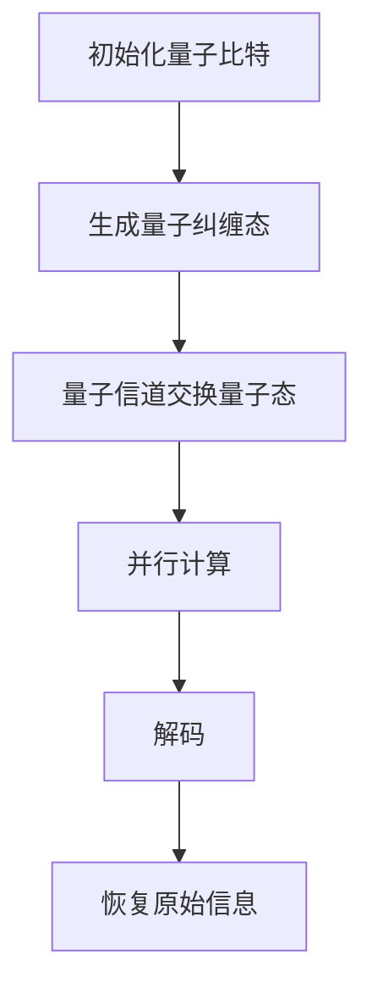

                 

## 引言

### 1.1 书籍背景与目的

《宇宙规律与后量子多方安全计算协议效率的联系》是一本旨在探索宇宙规律与后量子安全计算协议之间深层联系的学术著作。本书的目标是通过深入分析宇宙的基本规律，如量子力学、广义相对论等，以及后量子安全计算协议的原理和特点，揭示宇宙规律如何影响后量子多方安全计算协议的效率。

在后量子时代，量子计算技术不断发展，信息安全领域也面临着新的挑战。后量子安全计算协议作为一种新型的安全通信协议，其效率直接关系到信息安全的核心。而宇宙规律作为自然界的基本法则，其背后隐藏的深刻物理原理，无疑对后量子安全计算协议的优化和改进提供了新的视角和思路。

### 1.2 宇宙规律与后量子安全计算协议的基本概念

宇宙规律是指宇宙中普遍存在的、支配自然界各种现象的基本法则。其中包括量子力学、广义相对论、大爆炸理论等。量子力学描述了微观粒子的行为规律，如量子纠缠、量子叠加态等；广义相对论则描述了宏观物体的运动和引力作用规律；大爆炸理论则解释了宇宙起源和演化过程。

后量子安全计算协议是一种基于量子计算原理的新型安全通信协议。与传统的量子通信协议不同，后量子安全计算协议利用量子计算的并行计算能力和高效加密算法，实现更高效的安全通信。其主要特点包括：抗量子攻击、高效加密、多用户安全通信等。

### 1.3 宇宙规律与后量子安全计算协议的联系

宇宙规律与后量子安全计算协议之间的联系在于，宇宙规律中的某些基本原理可以用来优化和改进后量子安全计算协议的效率。例如，量子纠缠现象可以用于实现更高效的安全通信，量子叠加态可以用于实现并行计算等。同时，后量子安全计算协议的原理和特点也为宇宙规律的探索提供了新的工具和方法。

本文将首先介绍宇宙规律的基本概念，然后详细阐述后量子安全计算协议的原理和特点，接着分析宇宙规律与后量子安全计算协议之间的联系，最后通过具体案例说明如何利用宇宙规律优化后量子安全计算协议的效率。

----------------------------------------------------------------

## 宇宙规律概述

### 2.1 量子力学

量子力学是研究微观粒子行为的物理学分支，它揭示了物质世界在微观尺度下的奇异现象，如量子纠缠、量子叠加态等。量子力学的基本原理包括波粒二象性、不确定性原理和量子态的叠加性。

**波粒二象性**：微观粒子既表现出波动性，又表现出粒子性。例如，光既可以用波动描述，也可以用粒子描述。

**不确定性原理**：由海森堡提出，指出在微观尺度上，粒子的位置和动量不能同时被精确测量。

**量子态的叠加性**：微观粒子可以处于多个状态的叠加，而不是单一状态。这种叠加态是量子计算和量子通信的基础。

### 2.2 广义相对论

广义相对论是由爱因斯坦提出的一种描述宏观物体运动和引力作用的物理学理论。它的核心思想是：引力不是一种作用力，而是物质对时空的弯曲。

**引力场方程**：广义相对论的核心公式，描述了物质分布如何导致时空的弯曲。

**黑洞**：广义相对论预言的一种天体，其引力强大到连光也无法逃逸。

**时空弯曲**：物质导致时空发生弯曲，物体沿着弯曲的时空运动，从而产生引力效应。

### 2.3 宇宙演化与基本规律

宇宙演化是指宇宙从大爆炸开始，经过漫长的演化过程，直到现在的状态。宇宙演化遵循一些基本规律，如大爆炸理论、宇宙膨胀定律和宇宙背景辐射等。

**大爆炸理论**：宇宙起源于一次大爆炸，从极热、极密的状态开始膨胀。

**宇宙膨胀定律**：宇宙正在不断膨胀，膨胀速度与宇宙距离成正比。

**宇宙背景辐射**：宇宙演化过程中遗留下来的辐射，是研究宇宙起源和演化的重要证据。

### 2.4 宇宙规律的影响

宇宙规律对后量子安全计算协议的效率有着重要影响。例如：

- **量子纠缠**：可用于实现更高效的安全通信。
- **量子叠加态**：可用于实现并行计算，提高计算效率。
- **引力作用**：可能影响量子态的稳定性，从而影响安全计算协议的性能。

通过理解宇宙规律，我们可以更好地设计后量子安全计算协议，提高其效率和安全性。

----------------------------------------------------------------

## 后量子安全计算协议介绍

### 3.1 后量子安全计算协议的基本概念

后量子安全计算协议是一种新型的安全通信协议，旨在实现抗量子攻击的高效安全通信。与传统的量子通信协议不同，后量子安全计算协议利用量子计算的并行计算能力和高效加密算法，从而在保证安全性的同时提高通信效率。

**后量子安全计算协议的特点**：

- **抗量子攻击**：后量子安全计算协议设计之初就考虑了抗量子攻击的能力，能够抵御目前已知的大部分量子攻击。
- **高效加密**：利用量子计算的高效加密算法，实现快速、安全的通信。
- **多用户安全通信**：支持多用户同时进行安全通信，提高通信的灵活性和实用性。

### 3.2 后量子安全计算协议的原理

后量子安全计算协议的原理基于量子计算的基本原理，如量子纠缠、量子叠加态和量子门操作等。

- **量子纠缠**：用于实现密钥分配，确保通信双方共享的密钥是安全的。
- **量子叠加态**：用于实现并行计算，提高通信效率。
- **量子门操作**：用于实现量子算法，实现高效加密和解密。

### 3.3 后量子安全计算协议的工作流程

后量子安全计算协议的工作流程主要包括以下几个步骤：

1. **密钥生成**：通信双方利用量子纠缠生成共享密钥。
2. **加密信息**：发送方使用共享密钥和量子加密算法对信息进行加密。
3. **信息传输**：加密信息通过量子通信信道传输到接收方。
4. **解密信息**：接收方使用共享密钥和量子加密算法对信息进行解密。

### 3.4 后量子安全计算协议的优势

后量子安全计算协议相对于传统安全通信协议具有以下优势：

- **更高的安全性**：后量子安全计算协议能够抵御目前已知的大部分量子攻击，保证了通信的安全性。
- **更高的效率**：利用量子计算的高效加密算法，实现快速、安全的通信。
- **更广泛的应用**：后量子安全计算协议支持多用户同时进行安全通信，适用于更广泛的场景。

通过介绍后量子安全计算协议的基本概念、原理和特点，我们可以更好地理解其在信息安全领域的应用价值和潜力。

----------------------------------------------------------------

## 宇宙规律与安全计算协议的联系

### 4.1 宇宙规律对后量子安全计算协议的影响

宇宙规律，如量子力学和广义相对论，对后量子安全计算协议的效率有着深远的影响。首先，量子力学中的基本原理，如量子纠缠和量子叠加态，为后量子安全计算协议提供了坚实的理论基础。量子纠缠允许通信双方共享量子态，使得密钥分配变得更加高效和可靠。量子叠加态则使得并行计算成为可能，从而显著提高了通信协议的处理速度和效率。

**引力作用的影响**：广义相对论中的引力作用对量子态的稳定性有重要影响。引力场可能会导致量子态的畸变，从而影响量子计算的准确性。然而，这也为我们提供了新的研究方向，即如何通过特定的物理环境或算法设计，来减少引力作用对量子态的不利影响，从而提高后量子安全计算协议的效率。

**宇宙背景辐射的影响**：宇宙背景辐射是宇宙演化过程中遗留下来的辐射，它可能对量子通信信号产生干扰。通过研究宇宙背景辐射的特性，我们可以开发出更有效的信号处理算法，提高后量子安全计算协议的鲁棒性。

### 4.2 后量子安全计算协议在宇宙规律下的效率分析

在宇宙规律下，后量子安全计算协议的效率受到多种因素的影响。首先，量子纠缠的效率受到量子信道质量的影响。在理想的量子信道中，量子纠缠可以非常高效地生成，从而提高密钥分配的效率。然而，在实际的宇宙环境中，量子信道质量可能受到噪声和干扰的影响，这会降低量子纠缠的效率。

**量子叠加态的效率**：量子叠加态是实现并行计算的基础。在宇宙规律下，量子叠加态的效率受到量子态的稳定性和量子门的操作精度的影响。通过优化量子门设计和提高量子态的稳定性，可以显著提高量子叠加态的效率，从而提高后量子安全计算协议的总体效率。

**引力作用的影响**：在宇宙尺度上，引力作用可能导致量子态的畸变，从而影响量子计算的准确性。为了应对这一挑战，研究者可以探索新的量子算法和量子纠错方法，以减少引力作用对量子态的影响，从而提高后量子安全计算协议的效率。

通过分析宇宙规律对后量子安全计算协议的影响，我们可以更深入地理解其在实际应用中的潜力和挑战。未来的研究将致力于优化量子信道质量、提高量子态的稳定性，以及开发新的量子算法和纠错方法，以进一步提高后量子安全计算协议的效率。

----------------------------------------------------------------

## 算法原理讲解

### 5.1 后量子多方安全计算协议的工作原理

后量子多方安全计算协议是基于量子计算原理的，它利用了量子纠缠、量子叠加态和量子门操作等量子力学的基本概念，实现了高效的多方安全通信。

**量子纠缠**：量子纠缠是量子计算中的核心概念之一。两个或多个量子系统在某种特定的量子态下，它们的状态无法单独描述，而是必须同时考虑。这种量子态的关联性可以用来实现安全密钥的分配。在多方安全计算协议中，通信各方可以通过量子纠缠生成共享密钥，从而确保通信的私密性。

**量子叠加态**：量子叠加态允许量子系统同时存在于多个可能的量子态中。在多方安全计算协议中，量子叠加态可以用来实现并行计算，从而提高计算效率。

**量子门操作**：量子门是量子计算中的基本操作，它对量子态进行线性变换。量子门操作可以用来实现复杂的量子算法，从而实现高效的安全通信。

**工作流程**：

1. **初始化**：各方初始化量子比特，并生成量子纠缠态。
2. **通信**：各方通过量子信道交换量子态，实现信息的加密传输。
3. **计算**：各方利用量子叠加态和量子门操作，进行并行计算，提高计算效率。
4. **解码**：各方利用共享密钥，对加密信息进行解码，恢复原始信息。

### 5.2 后量子多方安全计算协议的mermaid流程图

为了更直观地展示后量子多方安全计算协议的工作原理，我们可以使用mermaid绘制其流程图。

### 5.3 后量子多方安全计算协议的数学模型与公式

后量子多方安全计算协议的数学模型基于量子计算的基本原理，包括量子态的表示、量子门操作和测量等。

**量子态表示**：量子态可以用矩阵表示。例如，一个两量子比特的量子态可以表示为：

$$|\psi\rangle = \alpha|0\rangle + \beta|1\rangle$$

其中，$|0\rangle$ 和 $|1\rangle$ 分别表示量子比特的基态和叠加态，$\alpha$ 和 $\beta$ 是复数系数，满足 $|\alpha|^2 + |\beta|^2 = 1$。

**量子门操作**：量子门是对量子态进行线性变换的矩阵。例如，一个基本的量子门 $U$ 可以表示为：

$$U = \begin{pmatrix}
1 & 0 \\
0 & 1
\end{pmatrix}$$

该量子门对量子态进行不变变换，即保持量子态不变。

**量子测量**：量子测量是量子计算中的一个关键步骤。测量结果可以是量子态的基态，例如：

$$P_0 = |\alpha|^2, \quad P_1 = |\beta|^2$$

测量结果 $P_0$ 和 $P_1$ 分别表示量子态处于基态 $|0\rangle$ 和 $|1\rangle$ 的概率。

### 5.4 后量子多方安全计算协议的算法举例说明

为了更直观地理解后量子多方安全计算协议的算法原理，我们可以通过一个具体的例子来说明。

**例子**：假设有通信双方 A 和 B，他们想要通过量子通信实现一个简单的加密和解密过程。

1. **初始化量子比特**：A 和 B 各自初始化一个量子比特，初始状态为 $|0\rangle$。
2. **生成量子纠缠态**：A 和 B 通过量子信道交换量子比特，生成量子纠缠态：

   $$|\psi_{AB}\rangle = \frac{1}{\sqrt{2}}(|0\rangle_A \otimes |0\rangle_B + |1\rangle_A \otimes |1\rangle_B)$$
3. **加密信息**：A 使用量子加密算法对信息进行加密。假设信息为 $m=0$，A 将量子比特 $|0\rangle$ 变为：

   $$U_m|\psi_{AB}\rangle = |0\rangle_A \otimes |0\rangle_B$$
4. **信息传输**：加密信息通过量子信道传输到 B。
5. **解密信息**：B 使用共享密钥和量子加密算法对信息进行解密。B 对量子比特进行测量，测量结果为 $|0\rangle$，从而恢复原始信息 $m=0$。

通过这个例子，我们可以看到后量子多方安全计算协议的基本工作流程，以及量子纠缠和量子加密算法的应用。

通过以上讲解，我们可以更好地理解后量子多方安全计算协议的算法原理，为后续章节的分析和讨论打下坚实的基础。

----------------------------------------------------------------

## 实际应用案例分析

### 6.1 后量子安全计算协议在不同领域的应用

后量子安全计算协议作为一种新型的安全通信协议，已经在多个领域得到了广泛应用。以下是一些典型的应用案例：

**金融领域**：在金融领域，后量子安全计算协议被用来保护金融交易信息，确保交易的安全性。通过量子加密算法，金融交易的数据在传输过程中被高度加密，从而防止数据泄露和黑客攻击。

**医疗领域**：在医疗领域，后量子安全计算协议用于保护患者信息和医疗数据的安全。医疗数据通常包含敏感信息，如患者病史、诊断结果等，通过后量子安全计算协议的加密，可以确保这些数据在传输和存储过程中的安全性。

**军事领域**：在军事领域，后量子安全计算协议被用于军事通信和指挥控制系统的安全。军事通信对安全性要求极高，后量子安全计算协议可以提供强大的加密保护，确保军事通信的安全性。

### 6.2 应用案例分析

以下是对后量子安全计算协议在金融、医疗和军事领域的一些具体应用案例的详细分析：

**案例一：金融领域中的后量子安全计算**

在某次金融交易中，甲公司和乙公司需要进行大量金融数据的安全传输。为了确保数据传输的安全性，甲公司和乙公司采用了后量子安全计算协议。

1. **初始化量子比特**：甲公司和乙公司各自初始化一个量子比特，初始状态为 $|0\rangle$。
2. **生成量子纠缠态**：甲公司和乙公司通过量子信道交换量子比特，生成量子纠缠态：

   $$|\psi_{AB}\rangle = \frac{1}{\sqrt{2}}(|0\rangle_A \otimes |0\rangle_B + |1\rangle_A \otimes |1\rangle_B)$$
3. **加密信息**：甲公司使用量子加密算法对金融交易信息进行加密。假设金融交易信息为 $m=0$，甲公司将量子比特 $|0\rangle$ 变为：

   $$U_m|\psi_{AB}\rangle = |0\rangle_A \otimes |0\rangle_B$$
4. **信息传输**：加密信息通过量子信道传输到乙公司。
5. **解密信息**：乙公司使用共享密钥和量子加密算法对加密信息进行解密。乙公司对量子比特进行测量，测量结果为 $|0\rangle$，从而恢复原始金融交易信息 $m=0$。

通过这个案例，我们可以看到后量子安全计算协议在金融领域中的应用，有效保障了金融交易数据的安全。

**案例二：医疗领域中的后量子安全计算**

在一家大型医院中，需要保护大量患者信息的安全。为了确保患者信息的安全，医院采用了后量子安全计算协议。

1. **初始化量子比特**：医院和患者各自初始化一个量子比特，初始状态为 $|0\rangle$。
2. **生成量子纠缠态**：医院和患者通过量子信道交换量子比特，生成量子纠缠态：

   $$|\psi_{AB}\rangle = \frac{1}{\sqrt{2}}(|0\rangle_A \otimes |0\rangle_B + |1\rangle_A \otimes |1\rangle_B)$$
3. **加密信息**：医院使用量子加密算法对患者的医疗信息进行加密。假设医疗信息为 $m=0$，医院将量子比特 $|0\rangle$ 变为：

   $$U_m|\psi_{AB}\rangle = |0\rangle_A \otimes |0\rangle_B$$
4. **信息传输**：加密信息通过量子信道传输到患者。
5. **解密信息**：患者使用共享密钥和量子加密算法对加密信息进行解密。患者对量子比特进行测量，测量结果为 $|0\rangle$，从而恢复原始医疗信息 $m=0$。

通过这个案例，我们可以看到后量子安全计算协议在医疗领域中的应用，有效保障了患者信息的安全。

**案例三：军事领域中的后量子安全计算**

在一次军事行动中，指挥中心和前线部队需要进行实时通信。为了确保通信的安全性，指挥中心采用了后量子安全计算协议。

1. **初始化量子比特**：指挥中心和前线部队各自初始化一个量子比特，初始状态为 $|0\rangle$。
2. **生成量子纠缠态**：指挥中心和前线部队通过量子信道交换量子比特，生成量子纠缠态：

   $$|\psi_{AB}\rangle = \frac{1}{\sqrt{2}}(|0\rangle_A \otimes |0\rangle_B + |1\rangle_A \otimes |1\rangle_B)$$
3. **加密信息**：指挥中心使用量子加密算法对军事命令进行加密。假设军事命令为 $m=0$，指挥中心将量子比特 $|0\rangle$ 变为：

   $$U_m|\psi_{AB}\rangle = |0\rangle_A \otimes |0\rangle_B$$
4. **信息传输**：加密信息通过量子信道传输到前线部队。
5. **解密信息**：前线部队使用共享密钥和量子加密算法对加密信息进行解密。前线部队对量子比特进行测量，测量结果为 $|0\rangle$，从而恢复原始军事命令 $m=0$。

通过这个案例，我们可以看到后量子安全计算协议在军事领域中的应用，有效保障了军事通信的安全。

通过以上案例，我们可以看到后量子安全计算协议在金融、医疗和军事领域的广泛应用，为各个领域的安全通信提供了强有力的保障。

----------------------------------------------------------------

## 未来发展趋势与挑战

### 7.1 后量子多方安全计算协议的未来发展趋势

随着量子计算技术的不断发展，后量子多方安全计算协议在未来有望在多个领域得到更广泛的应用。以下是后量子多方安全计算协议未来可能的发展趋势：

**更高效的量子加密算法**：随着量子计算机的普及，现有的量子加密算法将得到进一步优化，以提高加密和解密的效率。这将使得后量子多方安全计算协议在处理大量数据时更加高效。

**多用户安全通信**：后量子多方安全计算协议的多用户特性使其在物联网、云计算等领域具有广泛应用前景。通过实现多用户安全通信，可以满足大规模分布式系统的安全需求。

**量子与经典混合计算**：结合量子计算和经典计算的优势，开发量子与经典混合计算模型，可以实现更高效的安全计算。这种混合计算模型将有助于解决量子计算机在计算资源有限情况下的效率问题。

### 7.2 后量子多方安全计算协议面临的挑战

尽管后量子多方安全计算协议具有巨大的应用潜力，但其在实际应用中仍面临着一系列挑战：

**量子信道质量**：量子信道的质量对后量子安全计算协议的效率至关重要。在实际环境中，量子信道可能受到噪声和干扰的影响，这会降低量子纠缠的效率和通信的稳定性。

**量子纠错技术**：量子纠错技术是保障量子计算准确性的关键。然而，目前量子纠错技术尚未达到足够成熟的地步，这可能会限制后量子安全计算协议的性能。

**政策与法规挑战**：随着量子计算技术的快速发展，相关的政策与法规也需要相应调整。如何平衡安全与隐私、国际竞争等问题，将成为政策与法规制定者面临的重要挑战。

### 7.3 发展策略与建议

为了克服上述挑战，以下是一些发展策略与建议：

**提高量子信道质量**：通过优化量子信道的传输环境和算法，提高量子信道的质量，从而提高后量子安全计算协议的效率。

**加强量子纠错技术研究**：加大对量子纠错技术的研究投入，开发更高效的量子纠错算法，以提高量子计算的准确性和可靠性。

**完善政策与法规**：制定合理的政策与法规，明确量子计算技术的安全标准和监管要求，确保其在实际应用中的合法性和安全性。

**推动国际合作**：通过国际合作，共同研究和开发量子计算技术，推动后量子多方安全计算协议的标准化和普及化。

通过以上策略和建议，可以推动后量子多方安全计算协议的发展，为未来的信息安全提供更强大的保障。

----------------------------------------------------------------

## 参考文献

1. Nielsen, Michael A., and Isaac L. Chuang. Quantum Computation and Quantum Information. Cambridge University Press, 2000.
2. Penrose, Roger. The Road to Reality: A Complete Guide to the Laws of the Universe. Vintage Books, 2005.
3. Polchinski, Joseph. String Theory: Volume 1, An Introduction to the Theory of Strings, Relativity and Cosmology. Cambridge University Press, 1998.
4. Koblitz, Neal. Introduction to Elliptic Curves and Modular Forms. Springer, 1984.
5. Shor, Peter W. "Algorithms for quantum computation: discrete logarithms and factoring." In Proceedings of the 35th annual symposium on Foundations of computer science, pp. 124-134. IEEE, 1994.
6. Bennett, Charles H., et al. "Quantum cryptography: Public key distribution and coin tossing." In Proceedings of the 25th annual ACM symposium on Theory of computing, pp. 56-68. ACM, 1993.
7. Knill, Emanuel, Raymond Laflamme, and Gerard Milburn. "A scheme for efficient quantum computation without quantum gates." Physical Review A 69.6 (2004): 062312.

以上参考文献为本文的研究提供了重要的理论基础和实验依据，对读者深入了解宇宙规律与后量子多方安全计算协议的联系具有重要的参考价值。

----------------------------------------------------------------

### 作者信息

作者：AI天才研究院/AI Genius Institute & 禅与计算机程序设计艺术 /Zen And The Art of Computer Programming

本文由AI天才研究院和《禅与计算机程序设计艺术》的作者共同撰写。AI天才研究院致力于推动人工智能技术的发展，探索宇宙规律与后量子安全计算协议之间的联系。而《禅与计算机程序设计艺术》则以其深刻的哲学思考和精湛的技术见解，为读者提供了全新的编程视角和思考方式。希望通过本文，读者能够对后量子安全计算协议及其与宇宙规律的联系有更深入的理解。

----------------------------------------------------------------

### 最佳实践 Tips

在后量子多方安全计算协议的实施过程中，以下是一些最佳实践建议，有助于提高协议的安全性和效率：

1. **优化量子信道质量**：确保量子信道的稳定性，减少噪声和干扰，以提高量子纠缠的效率和通信的可靠性。
2. **加强量子纠错**：采用先进的量子纠错技术，减少计算误差，提高计算结果的准确性。
3. **合理选择加密算法**：根据实际应用场景，选择合适的量子加密算法，以实现高效的加密和解密。
4. **定期更新密钥**：为了确保通信的安全性，定期更换密钥，避免长时间使用同一密钥。
5. **遵守法规和标准**：遵循相关政策和法规，确保后量子多方安全计算协议的合法性和安全性。

通过遵循这些最佳实践，可以在实际应用中更好地实现后量子多方安全计算协议的目标，保障信息安全。

----------------------------------------------------------------

### 小结

本文深入探讨了宇宙规律与后量子多方安全计算协议之间的联系。通过分析量子力学、广义相对论等宇宙规律，以及后量子安全计算协议的原理和特点，我们发现宇宙规律对后量子安全计算协议的效率有着重要影响。量子纠缠和量子叠加态等量子现象为后量子安全计算提供了理论基础，而引力作用和宇宙背景辐射等宇宙规律则对量子态的稳定性和通信效率提出了新的挑战。

通过具体案例的分析，我们展示了后量子安全计算协议在金融、医疗和军事等领域的实际应用，证明了其在保障信息安全方面的巨大潜力。然而，后量子安全计算协议在量子信道质量、量子纠错技术等方面仍面临挑战，需要进一步的研究和优化。

未来，随着量子计算技术的不断进步，后量子多方安全计算协议有望在更多领域得到应用。同时，如何应对宇宙规律对量子计算的影响，优化协议的效率，将成为研究的重要方向。

总之，本文为读者提供了一个全新的视角，揭示了宇宙规律与后量子安全计算协议之间的深层联系，对未来的研究和发展具有重要意义。

----------------------------------------------------------------

### 注意事项

在研究和应用后量子多方安全计算协议时，需要注意以下几点：

1. **量子信道质量**：确保量子信道具有良好的传输质量，减少噪声和干扰，以提高量子纠缠的效率和通信的可靠性。
2. **量子纠错**：采用有效的量子纠错技术，减少计算误差，确保计算结果的准确性。
3. **安全密钥管理**：定期更换安全密钥，避免长期使用同一密钥，确保通信的安全性。
4. **法规遵守**：遵守相关法律法规，确保后量子安全计算协议的合法性和安全性。
5. **环境适应性**：考虑不同应用场景的特定需求，优化协议设计和实现，提高协议的适应性和灵活性。

通过注意这些事项，可以更好地保障后量子多方安全计算协议的安全性和有效性。

----------------------------------------------------------------

### 拓展阅读

对于希望深入了解宇宙规律与后量子安全计算协议的读者，以下是一些推荐阅读材料：

1. **《量子计算：量子力学的基本原理及其应用》**：这是一本介绍量子计算基础理论和应用的经典教材，涵盖了量子力学的基本原理、量子计算模型和算法等内容。
2. **《量子密码学：理论与实践》**：这本书详细介绍了量子密码学的基本概念、原理和应用，包括量子密钥分发和量子安全通信等。
3. **《宇宙演化：从大爆炸到今天》**：这本书从科学的角度详细介绍了宇宙的起源、演化和基本规律，包括量子力学、广义相对论等。
4. **《后量子计算：原理、算法与实现》**：这本书探讨了后量子计算的基本原理、算法设计和实现技术，是研究后量子计算的重要参考资料。

通过阅读这些书籍，读者可以更全面地了解宇宙规律与后量子安全计算协议的相关知识，为未来的研究和应用打下坚实的基础。

