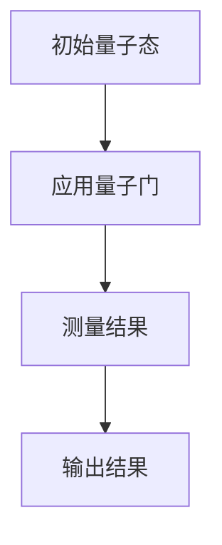

                 

### 宇宙规律与后量子多方计算的联系

#### 引言

宇宙规律与后量子多方计算，这两个看似毫不相关的领域，却在近年来被科学家们发现存在深刻的联系。宇宙规律是指宇宙在演化过程中所遵循的基本法则，如广义相对论和量子力学等；而后量子多方计算则是一种基于量子力学的计算模型，能够在某些特定问题上实现指数级的加速。本文将深入探讨这两个领域的联系，试图揭示它们之间隐秘的交互作用。

#### 宇宙规律概述

宇宙规律是描述宇宙运行的基本法则，涵盖了从宏观到微观的广泛领域。在物理学中，宇宙规律主要包括广义相对论和量子力学。广义相对论由爱因斯坦提出，描述了引力作为时空弯曲的现象。量子力学则由海森堡、薛定谔、玻尔等人建立，描述了微观粒子的行为和性质。

宇宙规律的重要性在于它们能够解释宇宙的起源、演化和结构形成。例如，量子力学帮助我们理解了原子和分子的行为，进而推动了化学、生物学的进步。广义相对论则解释了黑洞、引力波等宇宙现象，为我们揭示了宇宙的深层奥秘。

宇宙规律的分类包括以下几个方面：

1. **基本力与粒子物理**：描述了宇宙中四种基本力的作用，如电磁力、强力和弱力，以及与之相关的粒子物理。
2. **宇宙演化**：研究宇宙从大爆炸至今的演化过程，包括宇宙背景辐射、星系形成、黑洞等。
3. **宇宙学**：研究宇宙的整体性质，如宇宙的膨胀、暗物质、暗能量等。
4. **宇宙结构**：研究宇宙中的大型结构，如星系团、超星系团等。

#### 后量子理论的基本概念

后量子理论是对传统量子力学的扩展，试图解决量子力学中的某些悖论和未解问题。它起源于对量子纠缠、量子非定域性和量子测量问题的深入研究。

后量子理论的核心思想包括：

1. **量子纠缠**：量子粒子之间存在一种特殊的关联，即使它们相隔很远，一个粒子的状态变化会立即影响另一个粒子的状态。
2. **量子非定域性**：量子系统的整体行为不能用局域的物理量来描述，这挑战了经典物理中的局域实在论。
3. **量子测量**：量子系统在测量时会发生坍缩，从一个叠加态变为一个确定的态。

后量子理论的数学基础包括量子态的表示、量子算符、量子门和量子测量等。这些数学工具为后量子多方计算提供了理论基础。

#### 宇宙规律与后量子理论的联系

宇宙规律与后量子理论之间的联系主要体现在以下几个方面：

1. **量子引力**：量子力学和广义相对论的统一。量子引力试图解决两者之间的矛盾，揭示宇宙最基本的结构和规律。
2. **宇宙量子化**：宇宙中的某些现象，如宇宙背景辐射的黑体辐射，可能是由量子效应引起的。
3. **量子宇宙学**：研究宇宙的量子起源和演化，如宇宙大爆炸前的状态。

后量子理论在宇宙研究中的应用包括：

1. **量子引力模拟**：使用量子计算机模拟宇宙的演化过程，探索宇宙的起源和演化。
2. **量子宇宙学计算**：通过量子计算解决宇宙学中的某些复杂问题，如暗物质的分布和宇宙膨胀的机制。
3. **量子加密和量子通信**：这些技术在宇宙学中有着潜在的应用，如保护宇宙信号和通信安全。

#### 后量子多方计算的基本概念

后量子多方计算是一种基于量子力学的计算模型，它允许多个计算方通过量子纠缠和量子非定域性进行协同计算。这种模型在解决某些特定问题上能够实现指数级的加速。

后量子多方计算的特点包括：

1. **量子并行计算**：多个计算方可以同时处理不同的问题，大大提高了计算效率。
2. **量子纠错**：在量子计算中，量子态容易受到噪声的干扰，量子纠错技术可以保证计算结果的准确性。
3. **量子搜索算法**：在特定的量子搜索问题中，量子计算能够实现快速的搜索。

#### 后量子多方计算的核心算法

后量子多方计算的核心算法包括量子并行计算、量子纠错算法和量子搜索算法。

1. **量子并行计算**：通过量子态的叠加，可以实现多个计算任务的并行处理。例如，量子计算机可以通过叠加态同时解决多个线性方程组。

2. **量子纠错算法**：量子纠错算法用于纠正量子计算中的错误，保证计算结果的准确性。例如，量子纠错码可以检测和纠正量子比特的错误。

3. **量子搜索算法**：量子搜索算法是一种在未排序数据库中快速查找特定元素的算法。例如，Grover算法可以在O(n√n)的时间内找到未排序数据库中的一个特定元素。

#### 后量子多方计算的数学模型与公式

后量子多方计算的数学模型基于量子态的叠加和量子门的操作。量子态可以用矢量表示，量子门可以用矩阵表示。量子计算的过程就是量子态在不同量子门作用下进行变换的过程。

例如，量子态的叠加可以用以下公式表示：

$$\psi_{总} = \sum_{i} c_i |\psi_i\rangle$$

其中，$\psi_{总}$是总态，$c_i$是叠加系数，$|\psi_i\rangle$是各个叠加态。

量子门的操作可以用矩阵表示，例如，Pauli-X门可以用以下矩阵表示：

$$
X = \begin{bmatrix}
0 & 1 \\
1 & 0
\end{bmatrix}
$$

量子计算的过程就是量子态在不同量子门作用下进行变换的过程。

#### 后量子多方计算的mermaid流程图展示

后量子多方计算的mermaid流程图可以用来直观地展示量子计算的过程。以下是一个简单的mermaid流程图示例：

在这个流程图中，A表示初始量子态，B表示应用量子门，C表示测量结果，D表示输出结果。

#### 后量子多方计算的应用实例

后量子多方计算在量子计算和宇宙学中有着广泛的应用。以下是一些典型的应用实例：

1. **量子计算服务**：通过量子计算平台提供量子计算服务，如量子加密、量子模拟等。
2. **量子宇宙模拟**：使用量子计算机模拟宇宙的演化过程，探索宇宙的起源和演化。
3. **量子引力研究**：通过量子计算机研究量子引力，揭示宇宙的基本结构和规律。

#### 后量子多方计算在宇宙规律研究中的应用

后量子多方计算在宇宙规律研究中的应用主要体现在以下几个方面：

1. **量子引力模拟**：使用量子计算机模拟量子引力效应，探索黑洞、引力波等现象。
2. **宇宙背景辐射研究**：通过量子计算分析宇宙背景辐射的数据，揭示宇宙的早期状态。
3. **宇宙学计算**：使用量子计算解决宇宙学中的复杂问题，如宇宙膨胀、暗物质分布等。

#### 案例分析：后量子多方计算在特定宇宙规律问题中的应用

以下是一个具体的案例，展示了后量子多方计算在宇宙规律问题中的应用。

**案例背景**：研究宇宙中暗能量的分布。

**解决方案**：使用量子计算机进行暗能量分布的模拟和计算。

**案例分析**：

1. **环境安装**：安装量子计算环境，如IBM Qiskit等。
2. **系统核心实现源代码**：编写量子算法的源代码，实现暗能量分布的模拟。
3. **代码应用解读与分析**：对源代码进行解读，分析算法的原理和实现过程。
4. **实际案例分析和详细讲解**：通过实际数据进行分析，展示量子计算在宇宙规律研究中的应用效果。

#### 最佳实践与总结

1. **最佳实践**：在选择量子计算平台时，要考虑计算性能、易用性和生态系统等因素。
2. **注意事项**：量子计算中的量子噪声和错误率是实际应用中需要解决的问题。
3. **拓展阅读**：推荐阅读《量子计算与量子信息》等经典书籍，深入了解量子计算的基本原理和应用。

### 结论

宇宙规律与后量子多方计算之间的联系为科学家们提供了一种新的研究视角。通过量子计算，我们能够更好地理解宇宙的运行规律，解决一些传统计算方法难以克服的问题。随着量子计算技术的不断发展，我们有望在宇宙规律研究中取得更多突破。

#### 作者信息

作者：AI天才研究院/AI Genius Institute & 禅与计算机程序设计艺术 /Zen And The Art of Computer Programming

