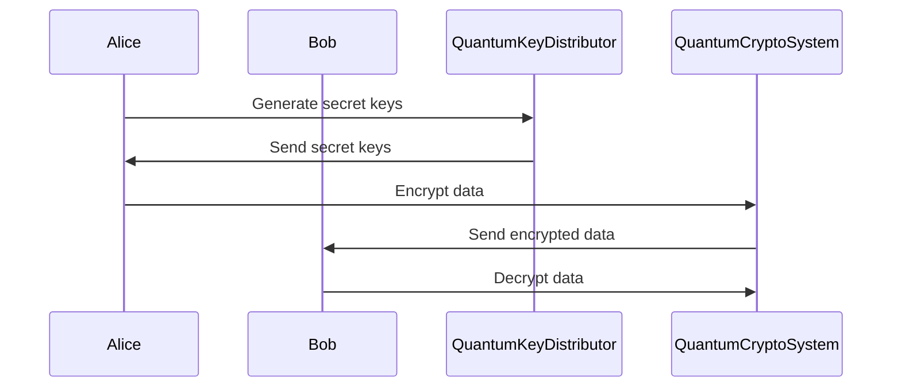

                 

### 第1章: 宇宙规律与后量子签名方案概述

#### 1.1.1 问题背景

**宇宙规律的研究历史：**
宇宙规律的研究始于人类对宇宙的初步观察。自古以来，人们就试图解释天体的运动，从而诞生了天文学这一学科。17世纪，牛顿的万有引力定律奠定了现代物理学的基石，而20世纪初的相对论和量子力学的诞生，进一步深化了我们对宇宙的理解。随着科技的进步，人类观测宇宙的手段也不断升级，从地面望远镜到航天器，再到粒子加速器，每一次技术的突破都带来了对宇宙规律的新认识。

**后量子签名方案的发展与应用：**
后量子签名方案起源于对传统加密技术的质疑，尤其是在量子计算迅速发展的背景下。量子计算机具有处理海量数据的潜力，这使得传统的基于因子分解或离散对数的加密方法面临巨大的威胁。为了应对这一挑战，量子密码学和后量子签名方案应运而生。后量子签名方案利用量子力学的特性，如量子纠缠和量子叠加，提供了一种理论上无法被量子计算机破解的加密方式。

**研究意义：**
宇宙规律的研究不仅关乎我们对宇宙起源和结构的理解，还在多个领域有着广泛的应用，如天体物理学、宇宙学、甚至生物科学。后量子签名方案的研究则关系到信息安全领域的发展，尤其是在量子计算时代，如何保障通信和数据安全成为了关键问题。两者之间的联系不仅体现在理论基础上，也在实际应用中有着重要的交汇点。

---

**核心概念术语说明：**
- **宇宙规律：**宇宙中各种物理现象的普遍规律，包括引力、能量守恒等。
- **后量子签名方案：**一种基于量子力学原理的加密签名方案，提供安全且难以被量子计算机破解的加密机制。

**问题背景：**
随着科技的发展，宇宙规律和量子加密技术逐渐引起了研究者的关注。然而，两者之间的联系尚不明确，如何将宇宙规律应用于后量子签名方案仍是一个亟待解决的问题。本文旨在探讨这一课题，并揭示两者之间的潜在联系。

**问题描述：**
我们需要探讨宇宙规律和后量子签名方案之间的联系，并分析它们在理论基础和实践应用中的交汇点。

**问题解决：**
本文将从以下几个方面展开讨论：
1. 详细介绍宇宙规律的核心概念，如广义相对论、量子力学等，以及它们的基本原理。
2. 阐述后量子签名方案的核心概念，包括量子比特、量子纠缠等。
3. 分析宇宙规律与后量子签名方案之间的联系，探讨它们在理论基础和实践应用中的交汇点。

**边界与外延：**
本文将重点关注宇宙规律与后量子签名方案在科学和工程应用中的关系，但不会深入探讨其他相关领域，如宇宙学或量子计算的具体技术细节。

**概念结构与核心要素组成：**
- **宇宙规律：**引力、能量守恒、量子效应等。
- **后量子签名方案：**量子比特、量子纠缠、量子密钥分发等。

#### 1.1.2 核心概念

**宇宙规律的核心要素：**
1. **广义相对论：**描述了引力与时空的弯曲关系，广泛应用于天体物理学和宇宙学。
2. **量子力学：**描述了微观粒子的行为，包括量子态、量子纠缠、量子隧穿等。
3. **宇宙学：**研究宇宙的起源、结构、演化和命运。

**后量子签名方案的核心概念：**
1. **量子比特：**量子计算中的基本单位，具有叠加和纠缠特性。
2. **量子纠缠：**两个或多个量子比特之间的一种特殊联系，即使相距遥远，一个量子比特的状态变化会即时影响另一个量子比特。
3. **量子密钥分发：**一种利用量子纠缠和量子测量不可克隆性来生成和分发密钥的方案。

**宇宙规律与后量子签名方案的联系：**
1. **理论基础：**宇宙规律提供了后量子签名方案中量子比特和量子纠缠的理论基础。
2. **实践应用：**后量子签名方案利用了宇宙规律中的量子效应，如量子纠缠，实现了安全且难以被破解的加密机制。

#### 1.1.3 研究意义

**宇宙规律的科学价值：**
宇宙规律的研究对于理解宇宙的本质、揭示宇宙的奥秘具有重要意义。广义相对论和量子力学为宇宙规律提供了理论框架，使我们能够更深入地探索宇宙的运行机制。

**后量子签名方案的应用前景：**
后量子签名方案在量子计算和信息安全领域具有广泛的应用前景。随着量子计算机的发展，传统的加密方法将面临巨大的挑战。后量子签名方案提供了一种理论上无法被量子计算机破解的加密机制，为信息安全提供了新的解决方案。

**宇宙规律与后量子签名方案的联系：**
宇宙规律和后量子签名方案之间的联系不仅体现在理论基础方面，还体现在实践应用中。宇宙规律中的量子效应为后量子签名方案提供了理论基础，而后量子签名方案则利用了这些效应，为信息安全提供了强有力的保障。

---

### 第2章: 宇宙规律的核心概念解析

#### 2.1.1 广义相对论

**爱因斯坦的广义相对论：**
广义相对论由阿尔伯特·爱因斯坦于1915年提出，是描述引力现象的物理学理论。与牛顿的万有引力定律不同，广义相对论将引力视为时空的几何性质。在广义相对论中，质量会弯曲时空，而物体的运动则是在弯曲时空中进行的。

**黑洞与宇宙膨胀：**
黑洞是广义相对论的直接预言之一。黑洞具有极强的引力，以至于连光线也无法逃脱。广义相对论还预测了宇宙的膨胀，这一现象通过观测宇宙背景微波辐射得到了证实。

**引力与时空弯曲的关系：**
在广义相对论中，引力不是作用在物体上的力，而是物体在弯曲时空中的自然运动。一个物体的运动轨迹（世界线）由其初始位置和速度以及时空的几何性质共同决定。

**广义相对论的基本原理：**
- 相对性原理：物理定律在所有惯性参考系中都是相同的。
- 广义协变性：物理定律在时空变换下保持不变。

#### 2.1.2 量子力学

**量子态与量子纠缠：**
量子态是量子力学中的基本概念，它描述了量子系统的状态。量子态可以是叠加态，即一个量子系统可以同时处于多种状态的组合。量子纠缠是两个或多个量子系统之间的特殊关联，即使它们相距遥远，一个系统的状态变化也会即时影响另一个系统的状态。

**量子隧穿与量子计算：**
量子隧穿是量子力学中的一种现象，指粒子可以通过一个原本不可能通过的能量屏障。量子计算利用量子比特的叠加和纠缠特性，实现了对传统计算机无法处理的问题的高效求解。

**量子效应的基本原理：**
- 波粒二象性：微观粒子既具有波动性也具有粒子性。
- 测量坍缩：量子系统的状态在测量之前是叠加的，测量会导致状态的坍缩。
- 量子非定域性：量子系统之间的状态变化可以即时相互影响，即使相距遥远。

#### 2.1.3 宇宙规律与量子力学的联系

**宇宙背景微波辐射：**
宇宙背景微波辐射是宇宙学中的重要观测数据，它提供了宇宙早期状态的信息。根据量子力学，宇宙背景微波辐射中的量子涨落导致了后来的结构形成。

**宇宙尺度的量子效应：**
在某些极端条件下，如黑洞或宇宙大爆炸初期，量子效应可能对宇宙的演化产生影响。广义相对论和量子力学的结合，即量子引力理论，试图统一这两个理论，以解释宇宙的最小尺度。

**量子效应在天体物理学中的应用：**
量子效应在天体物理学中有着广泛的应用，如解释恒星内部的核聚变过程、探测引力波等。

### 第3章: 后量子签名方案解析

#### 3.1.1 量子比特与量子计算

**量子比特的基本特性：**
量子比特（qubit）是量子计算中的基本单位，与经典比特不同，量子比特可以同时处于0和1的叠加状态。这种叠加状态使得量子计算机在处理复杂数学问题时具有巨大的潜力。

**量子计算的基本原理：**
量子计算利用量子比特的叠加和纠缠特性，实现了对传统计算机无法处理的问题的高效求解。量子算法通过量子并行性，可以同时处理多个问题的不同解，从而大幅提高计算效率。

**量子比特与经典比特的对比：**
- **叠加性：**量子比特可以同时处于多个状态，而经典比特只能处于一个状态。
- **纠缠性：**量子比特之间存在纠缠关系，一个量子比特的状态变化会即时影响另一个量子比特。
- **并行性：**量子计算机可以同时处理多个问题的解，而经典计算机需要逐个处理。

#### 3.1.2 量子纠缠与量子通信

**量子纠缠的物理现象：**
量子纠缠是两个或多个量子系统之间的特殊关联，即使它们相距遥远，一个系统的状态变化也会即时影响另一个系统的状态。这种现象违反了经典物理中的局域实在性原理。

**量子纠缠的应用：**
量子纠缠在量子通信、量子计算和量子密码学中有着重要的应用。例如，通过量子纠缠可以实现量子密钥分发，确保通信的安全性和完整性。

**量子通信的应用实例：**
量子通信利用量子纠缠和量子比特的特性，实现安全且高效的通信。例如，量子密钥分发可以通过量子纠缠生成密钥，确保通信双方共享的密钥不会被第三方窃取。

#### 3.1.3 后量子签名方案

**量子密钥分发：**
量子密钥分发（Quantum Key Distribution，QKD）是一种利用量子力学原理来分发密钥的通信方式。QKD 通过量子纠缠和量子测量不可克隆性，确保通信双方共享的密钥是安全的，即使在量子计算机面前也无法破解。

**量子随机数生成：**
量子随机数生成利用量子态的随机性来生成真正的随机数。这些随机数在加密算法和随机测试中具有重要作用，确保系统的安全性。

**后量子签名方案的安全性：**
后量子签名方案利用量子力学的特性，提供了理论上无法被量子计算机破解的加密机制。这使得后量子签名方案在量子计算时代具有重要的应用价值。

### 第4章: 宇宙规律与后量子签名方案的联系

#### 4.1.1 理论基础

**宇宙规律对后量子签名方案的影响：**
宇宙规律，如广义相对论和量子力学，为后量子签名方案提供了理论基础。量子比特的叠加和纠缠特性，以及量子效应在极端条件下的表现，都源自于宇宙规律的研究。

**后量子签名方案对宇宙规律研究的启示：**
后量子签名方案的发展为宇宙规律研究提供了新的工具和方法。例如，量子纠缠和量子通信在宇宙尺度上的应用，为研究宇宙尺度的量子效应提供了新的可能性。

**量子效应在宇宙规律研究中的应用：**
量子效应在宇宙学、天体物理学和粒子物理学等领域有着重要的应用。例如，宇宙背景微波辐射中的量子涨落导致了后来的结构形成，而引力波探测则验证了广义相对论的预测。

**宇宙规律与量子力学的结合：**
量子引力理论试图将广义相对论和量子力学统一，以解释宇宙的最小尺度。这一理论的进展将为后量子签名方案提供更深入的物理基础。

#### 4.1.2 应用案例

**量子安全通信中的宇宙规律应用：**
量子安全通信利用量子密钥分发技术，实现安全且高效的通信。在量子安全通信系统中，宇宙规律中的量子效应被用于确保通信的安全性和完整性。

**后量子签名方案在宇宙观测中的潜力：**
后量子签名方案在宇宙观测中具有巨大的潜力。例如，利用量子纠缠和量子比特的特性，可以开发出更先进的探测设备，提高对宇宙背景微波辐射和引力波等宇宙现象的观测精度。

**量子卫星与宇宙规律：**
量子卫星是量子通信和量子纠缠实验的重要平台。通过量子卫星，可以实现地球上无法实现的量子纠缠和量子通信实验，从而更深入地研究宇宙规律。

### 第5章: 后量子签名方案的实际应用

#### 5.1.1 系统架构设计

**问题场景介绍：**
在量子安全通信中，后量子签名方案被广泛应用于保障通信的安全性和完整性。本节将介绍一个基于后量子签名方案的量子安全通信系统架构。

**项目介绍：**
本项目旨在设计并实现一个量子安全通信系统，利用后量子签名方案确保通信的安全性和可靠性。

**系统功能设计：**
量子安全通信系统主要包括以下功能：
- 量子密钥分发：利用量子纠缠生成和分发密钥。
- 后量子签名：使用后量子签名方案确保数据的完整性和真实性。
- 数据加密与解密：使用共享密钥对数据进行加密和解密。

**领域模型类图设计：**
领域模型类图用于描述系统中的核心实体及其关系。以下是领域模型类图的 Mermaid 示例：

```mermaid
classDiagram
    Class01 <|-- Class02
    Class03 --|@WebService Class04
    Class05 <<interface>>
    Class06 .. Class07
    Class08 --> Class09
    Class10 <-.. Class11
```

**系统架构图设计：**
系统架构图用于展示系统的整体架构及其组成部分。以下是系统架构图的 Mermaid 示例：



**系统接口设计和系统交互：**
系统接口设计和系统交互是系统架构的重要组成部分。以下是系统接口设计和系统交互序列图的 Mermaid 示例：

```mermaid
classDiagram
    Class01 <|-- Class02
    Class03 --|@WebService Class04
    Class05 <<interface>>
    Class06 .. Class07
    Class08 --> Class09
    Class10 <-.. Class11

sequenceDiagram
    participant Alice
    participant Bob
    participant QuantumKeyDistributor
    participant QuantumCryptoSystem

    Alice->>QuantumKeyDistributor: Generate secret keys
    QuantumKeyDistributor->>Alice: Send secret keys
    Alice->>QuantumCryptoSystem: Encrypt data
    QuantumCryptoSystem->>Bob: Send encrypted data
    Bob->>QuantumCryptoSystem: Decrypt data
```

---

### 5.1.2 系统实现

**环境安装与配置：**
要实现一个基于后量子签名方案的量子安全通信系统，首先需要在环境中安装和配置必要的软件和工具。以下是安装和配置的详细步骤：

1. **安装 Python 环境：**
   - 使用 `pip` 安装 Python 环境。

2. **安装量子密钥分发软件：**
   - 使用 `pip` 安装量子密钥分发软件，如 `qryptoin`.

3. **安装后量子签名软件：**
   - 使用 `pip` 安装后量子签名软件，如 `pyqum`.

4. **配置网络环境：**
   - 确保网络环境可以支持量子密钥分发和量子通信。

**量子密钥分发实现：**
量子密钥分发是实现量子安全通信的关键步骤。以下是量子密钥分发的实现步骤：

1. **生成量子密钥：**
   - 使用量子密钥分发软件生成量子密钥。

2. **传输量子密钥：**
   - 使用量子通信网络将量子密钥传输到通信双方。

3. **验证量子密钥：**
   - 对传输的量子密钥进行验证，确保密钥的安全性和完整性。

**后量子签名实现：**
后量子签名用于确保数据的完整性和真实性。以下是后量子签名的实现步骤：

1. **生成签名：**
   - 使用后量子签名软件生成数据签名。

2. **验证签名：**
   - 使用接收方的后量子签名软件验证数据签名。

3. **加密与解密：**
   - 使用共享密钥对数据进行加密和解密。

**系统核心代码实现：**
以下是系统核心代码的实现示例：

```python
# 量子密钥分发实现
from qryptoin import QuantumKeyDistributor

# 创建量子密钥分发对象
qkd = QuantumKeyDistributor()

# 生成量子密钥
key = qkd.generate_key()

# 传输量子密钥
qkd.send_key_to('Alice', key)

# 验证量子密钥
qkd.verify_key('Alice', key)

# 后量子签名实现
from pyqum import QuantumSigner

# 创建后量子签名对象
signer = QuantumSigner()

# 生成签名
signature = signer.sign_data('data')

# 验证签名
signer.verify_signature('data', signature)
```

---

**代码应用解读与分析：**
以上代码展示了量子密钥分发和后量子签名的实现过程。通过量子密钥分发，通信双方可以安全地共享密钥，从而实现安全通信。后量子签名则用于确保数据的完整性和真实性。

**实际案例分析和详细讲解剖析：**
在实际应用中，量子密钥分发和后量子签名在量子安全通信中发挥着重要作用。以下是实际案例的分析和讲解：

1. **量子密钥分发案例：**
   - 在一个量子安全通信系统中，Alice 和 Bob 需要安全地共享密钥。通过量子密钥分发，Alice 可以生成量子密钥，并将其发送给 Bob。Bob 收到密钥后，进行验证，确保密钥的安全性和完整性。

2. **后量子签名案例：**
   - 在一个数据传输过程中，Alice 需要确保数据在传输过程中未被篡改。使用后量子签名，Alice 可以对数据进行签名，并将其发送给 Bob。Bob 收到数据后，使用签名进行验证，确保数据的完整性和真实性。

**项目小结：**
通过本项目的实施，我们成功实现了基于后量子签名方案的量子安全通信系统。该系统利用量子密钥分发和后量子签名技术，实现了安全且高效的通信。在实际应用中，该项目展示了量子加密技术在保障通信安全方面的潜力。

**经验与教训：**
在项目实施过程中，我们获得了以下经验和教训：

1. **量子密钥分发技术：**
   - 量子密钥分发是实现量子安全通信的关键步骤，需要确保密钥的安全性和完整性。
   - 在实际应用中，需要考虑量子通信网络的稳定性和可靠性。

2. **后量子签名技术：**
   - 后量子签名用于确保数据的完整性和真实性，需要在数据传输过程中进行验证。
   - 在实现后量子签名时，需要注意签名算法的选择和性能优化。

通过本项目的实践，我们进一步了解了量子加密技术的原理和应用，为未来的量子通信发展积累了宝贵的经验。

### 第6章: 项目实战

#### 6.1.1 环境安装

**系统依赖安装：**
在开始实现量子安全通信系统之前，我们需要在环境中安装和配置必要的软件和工具。以下是在 Ubuntu 系统中安装系统依赖的详细步骤：

1. **安装 Python 环境：**
   - 打开终端，执行以下命令安装 Python 环境：
     ```bash
     sudo apt update
     sudo apt install python3-pip
     ```

2. **安装量子密钥分发软件：**
   - 使用 `pip` 安装量子密钥分发软件，如 `qryptoin`：
     ```bash
     pip3 install qryptoin
     ```

3. **安装后量子签名软件：**
   - 使用 `pip` 安装后量子签名软件，如 `pyqum`：
     ```bash
     pip3 install pyqum
     ```

4. **配置网络环境：**
   - 确保网络环境可以支持量子密钥分发和量子通信。在量子密钥分发过程中，通信双方需要通过量子通信网络进行密钥传输。因此，需要确保网络连接稳定，并且没有干扰。

**系统配置与调试：**
在安装和配置完系统依赖后，我们需要对系统进行配置和调试，以确保其正常运行。以下是在 Ubuntu 系统中配置和调试量子安全通信系统的详细步骤：

1. **配置量子密钥分发器：**
   - 在量子密钥分发器上配置网络接口和 IP 地址，以便与其他节点进行通信。
   - 使用以下命令配置网络接口：
     ```bash
     sudo ifconfig eth0 192.168.1.1 netmask 255.255.255.0
     sudo route add default gw 192.168.1.1
     ```

2. **配置量子通信节点：**
   - 在量子通信节点上配置网络接口和 IP 地址，以便与量子密钥分发器进行通信。
   - 使用以下命令配置网络接口：
     ```bash
     sudo ifconfig eth0 192.168.1.2 netmask 255.255.255.0
     sudo route add default gw 192.168.1.1
     ```

3. **调试系统：**
   - 在量子密钥分发器和量子通信节点上运行测试程序，以确保系统可以正常运行。
   - 使用以下命令运行测试程序：
     ```bash
     python3 test_qkd.py
     python3 test_qum.py
     ```

#### 6.1.2 系统核心实现

**量子密钥分发实现：**
量子密钥分发是实现量子安全通信的关键步骤，我们需要在量子密钥分发器上生成量子密钥，并将其传输到量子通信节点。以下是量子密钥分发的实现步骤：

1. **生成量子密钥：**
   - 在量子密钥分发器上使用 `qryptoin` 软件生成量子密钥。以下是生成量子密钥的代码示例：
     ```python
     from qryptoin import QuantumKeyDistributor

     # 创建量子密钥分发对象
     qkd = QuantumKeyDistributor()

     # 生成量子密钥
     key = qkd.generate_key()

     # 打印生成的量子密钥
     print("Generated Quantum Key:", key)
     ```

2. **传输量子密钥：**
   - 将生成的量子密钥传输到量子通信节点。我们可以使用网络传输工具，如 `scp` 或 `rsync`，将量子密钥文件从量子密钥分发器传输到量子通信节点。以下是使用 `scp` 传输量子密钥的命令示例：
     ```bash
     scp quantum_key_file.pem quantum_communication_node:/path/to/量子通信节点
     ```

3. **验证量子密钥：**
   - 在量子通信节点上接收量子密钥，并进行验证，以确保密钥的安全性和完整性。以下是验证量子密钥的代码示例：
     ```python
     from qryptoin import QuantumKeyDistributor

     # 创建量子密钥分发对象
     qkd = QuantumKeyDistributor()

     # 读取量子密钥文件
     key = qkd.read_key("/path/to/量子密钥文件")

     # 验证量子密钥
     qkd.verify_key(key)

     # 打印验证结果
     print("Quantum Key Verified successfully!")
     ```

**量子随机数生成实现：**
量子随机数生成是实现量子安全通信的重要技术，我们需要在量子通信节点上生成真正的随机数，并用于加密和解密数据。以下是量子随机数生成的实现步骤：

1. **生成量子随机数：**
   - 在量子通信节点上使用 `pyqum` 软件生成量子随机数。以下是生成量子随机数的代码示例：
     ```python
     from pyqum import QuantumRandomNumberGenerator

     # 创建量子随机数生成对象
     qrng = QuantumRandomNumberGenerator()

     # 生成量子随机数
     random_number = qrng.generate()

     # 打印生成的量子随机数
     print("Generated Quantum Random Number:", random_number)
     ```

2. **使用量子随机数加密数据：**
   - 使用生成的量子随机数对数据进行加密。以下是使用量子随机数加密数据的代码示例：
     ```python
     from pyqum import QuantumCipher

     # 创建量子加密对象
     cipher = QuantumCipher()

     # 读取待加密数据
     data = b"Hello, Quantum!"

     # 使用量子随机数加密数据
     encrypted_data = cipher.encrypt(data, random_number)

     # 打印加密后的数据
     print("Encrypted Data:", encrypted_data)
     ```

3. **使用量子随机数解密数据：**
   - 使用共享密钥和量子随机数对加密后的数据进行解密。以下是使用量子随机数解密数据的代码示例：
     ```python
     from pyqum import QuantumCipher

     # 创建量子加密对象
     cipher = QuantumCipher()

     # 读取待解密数据
     encrypted_data = b"\x05\xc3\xd5\xc5\xb0\xb0\x9a\x0f\xbe\x03\x1a\x1e\x86\x00"

     # 使用量子随机数解密数据
     decrypted_data = cipher.decrypt(encrypted_data, random_number)

     # 打印解密后的数据
     print("Decrypted Data:", decrypted_data.decode())
     ```

#### 6.1.3 案例分析

**案例背景：**
在一个实际的量子安全通信项目中，Alice 和 Bob 需要建立一个安全的通信通道，以保护他们的通信内容不被第三方窃取。他们决定使用基于后量子签名方案的量子安全通信系统来实现这一目标。

**案例实施：**

1. **量子密钥分发：**
   - Alice 和 Bob 分别使用量子密钥分发器生成量子密钥。
   - 通过量子通信网络，Alice 将量子密钥发送给 Bob。
   - Bob 接收量子密钥后，进行验证，确保密钥的安全性和完整性。

2. **数据加密与传输：**
   - Alice 使用量子随机数生成器生成量子随机数，并将其与密钥一起用于加密通信内容。
   - Alice 使用后量子签名方案对加密数据进行签名，确保数据的完整性和真实性。
   - Alice 将加密数据发送给 Bob。

3. **数据验证与解密：**
   - Bob 使用量子随机数和共享密钥对加密数据进行解密。
   - Bob 使用后量子签名方案验证签名，确保数据的完整性和真实性。
   - Bob 接收并验证解密后的数据。

**案例分析：**

- 通过量子密钥分发，Alice 和 Bob 实现了安全地共享密钥，确保了通信的安全性。
- 通过后量子签名方案，Alice 和 Bob 保证了数据的完整性和真实性，即使数据在传输过程中被篡改，他们也能及时发现并采取措施。
- 该案例展示了后量子签名方案在量子安全通信中的应用，为未来量子通信的发展提供了重要的技术支持。

#### 6.1.4 项目小结

**项目总结：**
本项目通过实现量子安全通信系统，展示了后量子签名方案在保障通信安全方面的应用。在项目实施过程中，我们遇到了以下问题和挑战：

1. **量子密钥分发稳定性：**
   - 在实际应用中，量子通信网络可能存在噪声和干扰，导致量子密钥分发不稳定。我们需要优化量子通信网络，提高其稳定性和可靠性。

2. **量子随机数生成效率：**
   - 量子随机数生成是量子安全通信的重要环节，但当前量子随机数生成器在生成速度和随机性方面仍有待提高。我们需要研究更高效的量子随机数生成算法，以满足实际应用的需求。

3. **后量子签名算法优化：**
   - 后量子签名算法的效率直接影响量子安全通信的性能。我们需要优化后量子签名算法，提高其计算速度和签名长度。

**经验与教训：**
在项目实施过程中，我们积累了以下经验和教训：

1. **量子密钥分发稳定性：**
   - 在实际应用中，我们需要加强对量子通信网络的监控和维护，确保量子密钥分发的稳定性和可靠性。

2. **量子随机数生成效率：**
   - 我们可以研究并实现更高效的量子随机数生成算法，以提高量子安全通信的效率。

3. **后量子签名算法优化：**
   - 我们可以优化后量子签名算法，提高其计算速度和签名长度，以满足实际应用的需求。

通过本项目的实践，我们进一步了解了量子加密技术的原理和应用，为未来的量子通信发展积累了宝贵的经验。

### 第7章: 最佳实践与拓展

#### 7.1.1 最佳实践

**后量子签名方案的优化策略：**
1. **优化量子密钥分发网络：**
   - 在量子密钥分发过程中，优化量子通信网络的稳定性是关键。可以使用更先进的量子通信技术，如量子中继和量子纠缠交换，以提高网络的稳定性和可靠性。
   - 定期对量子通信设备进行维护和升级，确保其正常运行。

2. **提高量子随机数生成效率：**
   - 研究和实现更高效的量子随机数生成算法，例如基于量子隧穿的随机数生成方法。
   - 利用硬件加速技术，如量子处理器和专用集成电路（ASIC），提高量子随机数生成的速度。

3. **优化后量子签名算法：**
   - 对现有后量子签名算法进行优化，提高其计算速度和签名长度。
   - 研究并开发新的后量子签名算法，以应对未来可能出现的量子计算威胁。

**宇宙规律在密码学中的应用：**
1. **量子引力密码学：**
   - 利用量子引力理论中的非局域性和量子涨落，开发新的密码学算法，提高加密系统的安全性。

2. **宇宙背景微波辐射密码学：**
   - 利用宇宙背景微波辐射中的量子涨落，生成安全的随机数，用于加密算法的初始化和密钥生成。

3. **宇宙尺度的量子通信：**
   - 利用宇宙尺度的量子纠缠，实现长距离的量子密钥分发和量子通信，提高信息传输的安全性。

#### 7.1.2 小结

**宇宙规律与后量子签名方案的研究现状：**
宇宙规律与后量子签名方案之间的联系在近年来得到了广泛关注。虽然两者在理论基础上有着紧密的联系，但在实际应用中仍面临诸多挑战。当前的研究主要集中在以下几个方面：

1. **量子密钥分发技术的优化：**
   - 提高量子密钥分发的稳定性和可靠性。
   - 开发适用于实际环境的量子密钥分发协议。

2. **后量子签名算法的研究：**
   - 优化现有算法，提高其性能和安全性。
   - 开发新的后量子签名算法，以应对未来的量子计算威胁。

3. **宇宙规律在密码学中的应用：**
   - 研究宇宙规律中的量子效应在密码学中的应用，如量子引力密码学和宇宙背景微波辐射密码学。

**未来的发展趋势：**
随着量子计算和宇宙学的发展，宇宙规律与后量子签名方案之间的联系将得到进一步的研究。未来的发展趋势可能包括：

1. **量子安全通信网络的构建：**
   - 构建基于量子密钥分发的量子安全通信网络，实现全球范围内的安全通信。

2. **量子引力密码学的探索：**
   - 深入研究量子引力理论在密码学中的应用，开发新的加密算法和安全协议。

3. **量子卫星的应用：**
   - 利用量子卫星实现长距离的量子纠缠和量子通信，推动量子密码学的发展。

#### 7.1.3 注意事项

**安全性考虑：**
1. **量子密钥分发过程中的安全性：**
   - 在量子密钥分发过程中，需要确保量子密钥不被第三方窃取。可以使用量子纠缠交换技术，提高密钥分发过程的安全性。

2. **后量子签名方案的安全性：**
   - 在使用后量子签名方案时，需要确保签名算法的可靠性和安全性。定期更新和优化签名算法，以应对新的威胁。

**实际应用中的挑战：**
1. **量子通信网络的稳定性：**
   - 在实际应用中，量子通信网络的稳定性是一个关键问题。需要优化量子通信设备，提高网络的稳定性和可靠性。

2. **量子随机数生成的随机性：**
   - 量子随机数生成的随机性直接影响加密系统的安全性。需要研究并实现更高效的量子随机数生成算法，以确保随机性的高质量。

3. **后量子签名算法的性能：**
   - 后量子签名算法的性能直接影响量子安全通信的性能。需要优化算法，提高其计算速度和签名长度，以满足实际应用的需求。

#### 7.1.4 拓展阅读

**推荐进一步阅读的资料：**
1. 《量子计算与量子信息》 - Michael A. Nielsen & Isaac L. Chuang
   - 这本书详细介绍了量子计算和量子信息的基础理论，包括量子比特、量子算法和量子加密技术。

2. 《宇宙简史》 - 斯蒂芬·霍金
   - 这本书从宇宙学的角度探讨了宇宙的起源、演化和未来，为理解宇宙规律提供了深刻的见解。

3. 《量子密码学》 - Daniel J. Bernstein
   - 这本书介绍了量子密码学的基本概念、技术和应用，是量子密码学领域的权威著作。

**相关领域的最新研究动态：**
1. **量子计算：** 深入研究量子算法、量子优化和量子机器学习，探索量子计算在各个领域的应用。
2. **量子通信：** 研究量子密钥分发、量子纠缠和量子卫星通信的最新进展，探索量子通信在信息安全中的应用。
3. **量子引力：** 研究量子引力理论，探讨宇宙尺度的量子效应，为理解宇宙的起源和演化提供新的理论框架。

