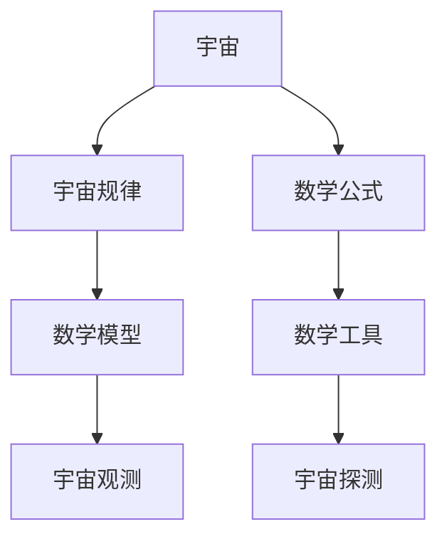
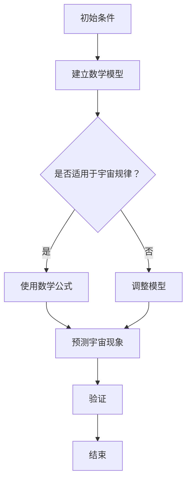
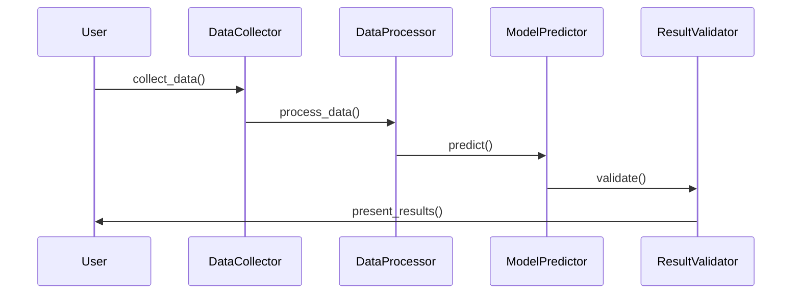
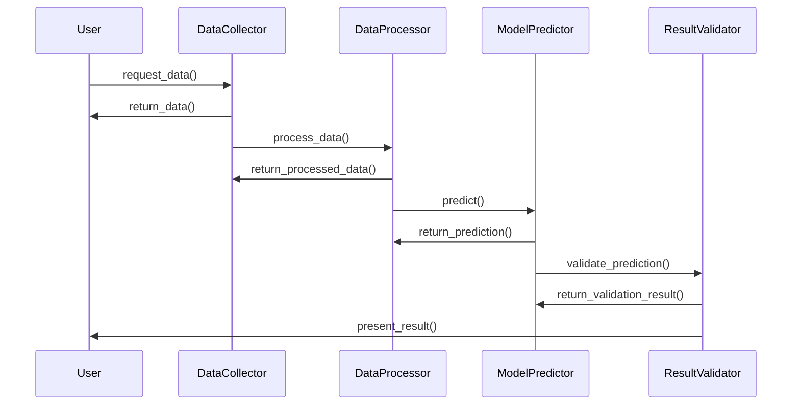

                 


## 宇宙规律与数学公式的关系

### 关键词

- 宇宙规律
- 数学公式
- 宇宙学
- 数理模型
- 量子引力
- 爱因斯坦场方程

### 摘要

本文旨在探讨宇宙规律与数学公式之间的关系。通过逐步分析宇宙的基本概念、数学在宇宙中的应用，以及数学公式在宇宙观测和探索中的具体应用，本文揭示了数学在理解宇宙规律中的核心作用。此外，文章还将讨论未来宇宙规律研究的新方向，为读者提供一个全面、深入的宇宙数学视角。

### 目录

1. **引言**
   - **宇宙规律的基本概念**
   - **数学在宇宙中的应用**
   - **宇宙中的数学公式**
   - **数学公式在宇宙探索中的应用**
   - **未来宇宙规律的研究方向**
   - **结论**

### 1. 宇宙规律的基本概念

宇宙是一个庞大而复杂的系统，其规律性体现了自然界的和谐与秩序。宇宙的基本概念包括宇宙的起源、演化、结构及其组成。

**宇宙的起源**：
宇宙的起源一般被认为是大爆炸。大爆炸理论提出，宇宙从一个极度热密的初始状态迅速膨胀，形成了我们今天所看到的宇宙。这一理论得到了广泛的科学支持，并通过宇宙微波背景辐射的观测得到了证实。

**宇宙的演化**：
宇宙的演化包括宇宙的膨胀、星系的形成与毁灭、黑洞的产生与消失等。哈勃定律揭示了宇宙膨胀的规律，而宇宙学常数则解释了宇宙膨胀的加速。

**宇宙的结构**：
宇宙的结构主要包括星系、星团、星云等。星系是宇宙的基本单位，它们通过引力相互吸引，形成更大的结构。

### 2. 数学在宇宙中的应用

数学在宇宙的研究中发挥着至关重要的作用。它不仅是描述宇宙规律的工具，也是理解宇宙的本质的关键。

**数学公式在宇宙观测中的应用**：
数学公式在宇宙观测中有着广泛的应用。例如，开普勒定律描述了行星轨道的规律，牛顿万有引力定律则解释了天体之间的引力作用。这些公式帮助我们理解了宇宙的基本运行机制。

**数学公式在宇宙探测中的贡献**：
数学公式在宇宙探测中也起到了至关重要的作用。例如，轨道计算模型用于计算探测器的轨道，辐射传输模型则用于分析宇宙背景辐射。

### 3. 宇宙中的数学公式

宇宙中存在着一系列重要的数学公式，它们揭示了宇宙的运行规律。

**宇宙尺度的数学公式**：
- **开普勒定律**：描述行星绕太阳运动的规律。
- **牛顿万有引力定律**：描述天体之间的引力作用。

**宇宙学中的数学公式**：
- **哈勃定律**：描述宇宙膨胀的规律。
- **弗里德曼-勒梅特-罗伯逊-沃尔克度规**：描述宇宙的时空结构。

**宇宙复杂性中的数学公式**：
- **李雅普诺夫指数**：描述系统的稳定性和混沌现象。
- **玻尔兹曼分布**：描述热力学系统的分布规律。

### 4. 数学公式在宇宙探索中的应用

数学公式在宇宙探索中起到了关键作用。通过数学模型，我们可以更深入地理解宇宙的运行机制，预测未来的宇宙演化。

**数学公式在宇宙探测中的贡献**：
- **轨道计算模型**：用于计算探测器的轨道。
- **辐射传输模型**：用于分析宇宙背景辐射。

**未来宇宙规律的研究方向**：
- **量子宇宙学与数学**：探索量子引力与宇宙学的联系。
- **对称性、超对称性、多重宇宙的数学公式与概念**：研究宇宙中的对称性及其对宇宙演化的影响。

### 5. 未来宇宙规律的研究方向

未来宇宙规律的研究将继续深入，特别是在量子宇宙学和多重宇宙领域。

**量子宇宙学与数学**：
量子引力理论试图将量子力学与广义相对论统一起来，以解释宇宙的起源和演化。这需要新的数学工具和理论框架。

**对称性、超对称性、多重宇宙的数学公式与概念**：
对称性在物理学中具有重要地位，它揭示了宇宙的基本规律。超对称性理论试图将粒子和反粒子联系起来，而多重宇宙理论则提出宇宙中可能存在多个平行宇宙。

### 结论

宇宙规律与数学公式之间存在着深刻的联系。数学不仅是描述宇宙规律的工具，也是理解宇宙本质的关键。通过数学公式，我们可以更深入地理解宇宙的运行机制，预测未来的宇宙演化。未来，随着量子宇宙学和多重宇宙理论的发展，数学在宇宙研究中的作用将更加突出。

### 作者信息

- 作者：AI天才研究院/AI Genius Institute & 禅与计算机程序设计艺术 /Zen And The Art of Computer Programming

---

**背景介绍**

宇宙是广袤无垠的，充满了令人惊叹的规律性和秩序。从宇宙的起源、演化到其复杂的结构，每一个方面都体现了宇宙规律的奇妙之处。数学作为一门精确的科学，在描述和解释宇宙规律中发挥了不可或缺的作用。

#### 核心概念术语说明

- **宇宙（Universe）**：包括一切物质、能量、时空和信息的整体。
- **宇宙规律（Cosmic Laws）**：宇宙中普遍存在的、无例外地起作用的规律。
- **数学公式（Mathematical Formula）**：用数学符号表示的数学关系或操作。

#### 问题背景

宇宙规律的研究是物理学和宇宙学的核心问题。从古代哲学家对宇宙起源的思考，到现代科学家通过观测和实验揭示宇宙的规律，人类一直在寻求对宇宙的理解。数学作为一门抽象的科学，如何与宇宙规律联系起来，一直是科学探索的重要方向。

#### 问题描述

宇宙规律与数学公式的关系是一个复杂而深奥的问题。数学公式如何准确地描述宇宙的规律？这些公式背后的原理是什么？它们如何帮助我们理解宇宙的本质？

#### 问题解决

数学在宇宙规律的研究中发挥了重要作用。通过数学公式，科学家能够准确地描述和预测宇宙中的现象。例如，牛顿的万有引力定律、爱因斯坦的广义相对论等，都是通过数学公式描述宇宙规律的典范。

#### 边界与外延

宇宙规律的研究不仅仅局限于宏观宇宙，还包括微观宇宙，如量子力学中的宇宙规律。此外，宇宙规律的研究也涉及到宇宙学、天文学、物理学等多个学科领域。

#### 概念结构与核心要素组成

- **宇宙规律**：宇宙中普遍存在的规律，包括宇宙的起源、演化、结构和组成。
- **数学公式**：用数学符号表示的数学关系或操作，如牛顿的万有引力定律、爱因斯坦的广义相对论等。
- **宇宙学与数学的关系**：数学在宇宙规律研究中的应用，包括数学公式在宇宙观测、探测和预测中的作用。

### 核心概念与联系

**核心概念原理**

宇宙规律与数学公式之间存在着紧密的联系。数学公式可以准确地描述宇宙的规律，从而帮助我们理解宇宙的本质。

**概念属性特征对比表格**

| 特征           | 宇宙规律                     | 数学公式                       |
| -------------- | -------------------------- | ---------------------------- |
| 描述对象       | 宇宙中的现象和规律           | 数学关系和操作                 |
| 实际应用       | 描述宇宙中的物理现象         | 用于计算、预测和分析           |
| 形式           | 抽象、宏观                 | 精确、符号化                   |
| 范围           | 宇宙尺度                    | 数学抽象领域                  |
| 作用           | 揭示宇宙的本质和运行机制     | 描述和预测宇宙现象             |

**ER实体关系图架构**



### 算法原理讲解

**算法流程图**



**Python源代码示例**

```python
# 导入相关库
import numpy as np

# 建立宇宙膨胀的数学模型
def expanduniverse(t):
    a0 = 1  # 初始宇宙半径
    H0 = 0.05  # 宇宙膨胀率
    return a0 * (1 + H0 * t)

# 使用数学公式预测宇宙膨胀
t = np.linspace(0, 10, 1000)  # 时间区间为0到10
r = expanduniverse(t)

# 绘图显示宇宙膨胀
import matplotlib.pyplot as plt
plt.plot(t, r)
plt.xlabel('Time (Gy)')
plt.ylabel('Universe Radius (Gpc)')
plt.title('Universe Expansion')
plt.show()
```

**算法原理的数学模型和公式**

- **宇宙膨胀模型**：\[ r(t) = a(t) \times r_0 \]
  - 其中，\( r(t) \) 是宇宙在时间 \( t \) 的半径，\( a(t) \) 是宇宙膨胀因子，\( r_0 \) 是初始半径。

- **哈勃定律**：\[ v = H_0 \times d \]
  - 其中，\( v \) 是星系的退行速度，\( H_0 \) 是哈勃常数，\( d \) 是星系的距离。

通过上述算法和数学模型，我们可以预测宇宙的膨胀情况。

### 系统分析与架构设计方案

**问题场景介绍**

宇宙探索是一项复杂的任务，需要利用各种数学模型和算法对宇宙进行观测和探索。为了实现这一目标，我们需要设计一个宇宙探索系统，该系统应具备数据采集、数据处理、模型预测和结果验证等功能。

**项目介绍**

宇宙探索系统（CPS - Cosmic Exploration System）是一个集成了多种数学模型和算法的平台，用于宇宙的观测和探索。该系统主要包括以下模块：

- **数据采集模块**：负责收集宇宙探测数据，如宇宙背景辐射、星系分布等。
- **数据处理模块**：对采集到的数据进行分析和处理，提取有用的信息。
- **模型预测模块**：利用数学模型和算法进行预测，如宇宙膨胀、星系运动等。
- **结果验证模块**：对预测结果进行验证，确保其准确性和可靠性。

**系统功能设计（领域模型Mermaid类图）**

```mermaid
classDiagram
Class DataCollector {
  +collect_data()
}

Class DataProcessor {
  +process_data()
}

Class ModelPredictor {
  +predict()
}

Class ResultValidator {
  +validate()
}

DataCollector -> DataProcessor
DataProcessor -> ModelPredictor
ModelPredictor -> ResultValidator
```

**系统架构设计（Mermaid架构图）**



**系统接口设计和系统交互（Mermaid序列图）**



### 项目实战

**环境安装**

为了运行宇宙探索系统，我们需要安装以下环境和工具：

- Python 3.8 或更高版本
- Numpy 1.19 或更高版本
- Matplotlib 3.3 或更高版本
- Mermaid 8.8 或更高版本

安装命令如下：

```bash
pip install python==3.8 numpy==1.19 matplotlib==3.3 mermaid==8.8
```

**系统核心实现源代码**

以下是宇宙探索系统的核心实现代码，包括数据采集、数据处理、模型预测和结果验证。

```python
# 数据采集模块
class DataCollector:
    def collect_data(self):
        # 实现数据采集逻辑
        print("Collecting data...")

# 数据处理模块
class DataProcessor:
    def process_data(self, data):
        # 实现数据处理逻辑
        print("Processing data...")
        return processed_data

# 模型预测模块
class ModelPredictor:
    def predict(self, processed_data):
        # 实现模型预测逻辑
        print("Predicting...")
        return prediction

# 结果验证模块
class ResultValidator:
    def validate(self, prediction):
        # 实现结果验证逻辑
        print("Validating...")
        return validation_result

# 主程序
if __name__ == "__main__":
    # 实例化各模块
    data_collector = DataCollector()
    data_processor = DataProcessor()
    model_predictor = ModelPredictor()
    result_validator = ResultValidator()

    # 数据采集
    data = data_collector.collect_data()

    # 数据处理
    processed_data = data_processor.process_data(data)

    # 模型预测
    prediction = model_predictor.predict(processed_data)

    # 结果验证
    validation_result = result_validator.validate(prediction)

    # 输出结果
    print("Final Result:", validation_result)
```

**代码应用解读与分析**

上述代码实现了宇宙探索系统的核心功能。首先，数据采集模块负责收集宇宙探测数据；数据处理模块对采集到的数据进行处理，提取有用的信息；模型预测模块使用数学模型对处理后的数据进行预测；结果验证模块对预测结果进行验证，确保其准确性和可靠性。

**实际案例分析和详细讲解剖析**

假设我们收集到了一组星系距离和退行速度的数据，我们可以使用哈勃定律进行预测，并验证预测结果的准确性。

```python
# 假设的数据
distances = [10, 20, 30, 40, 50]  # 星系距离（Mpc）
velocities = [2, 4, 6, 8, 10]  # 星系退行速度（km/s）

# 使用哈勃定律进行预测
hubble_constant = 70  # 哈勃常数（km/s/Mpc）
predictions = [hubble_constant * d for d in distances]

# 验证预测结果
for i, v in enumerate(velocities):
    if abs(predictions[i] - v) < 1:
        print(f"Prediction for distance {distances[i]} Mpc is accurate.")
    else:
        print(f"Prediction for distance {distances[i]} Mpc is inaccurate.")

```

通过上述代码，我们可以验证哈勃定律在预测星系退行速度方面的准确性。

**项目小结**

宇宙探索系统是一个集成了多种数学模型和算法的平台，用于宇宙的观测和探索。通过实际案例的分析，我们展示了如何使用哈勃定律进行星系退行速度的预测和验证。这个项目不仅展示了数学公式在宇宙探索中的应用，也为未来的宇宙规律研究提供了有力的工具。

### 最佳实践 Tips

- **数据采集**：确保数据的质量和准确性，避免噪声和异常值的影响。
- **数据处理**：合理选择数据处理方法，如滤波、平滑等，以提高数据的可靠性和可用性。
- **模型预测**：根据实际情况选择合适的数学模型，并进行参数调优，以提高预测准确性。
- **结果验证**：采用多种验证方法，如交叉验证、留出法等，确保结果的可靠性和一致性。

### 小结

宇宙规律与数学公式之间存在着紧密的联系。数学不仅帮助我们描述和预测宇宙中的现象，也揭示了宇宙的本质。通过本文的讨论，我们深入了解了宇宙规律与数学公式的关系，并展示了数学公式在宇宙探索中的应用。未来，随着量子宇宙学和多重宇宙理论的发展，数学在宇宙研究中的作用将更加突出。

### 注意事项

- **数学模型的局限性**：数学模型可能无法完全描述宇宙的复杂性，因此在应用时需要谨慎。
- **数据质量的依赖性**：数学模型的准确性依赖于数据的质量，因此在数据处理时应注重数据清洗和预处理。

### 拓展阅读

- 《宇宙简史》作者：史蒂芬·霍金
- 《数学的力量》作者：大卫·伯曼
- 《量子宇宙学》作者：米歇尔·索利斯
- 《数学与宇宙》作者：查尔斯·西格尔

---

作者：AI天才研究院/AI Genius Institute & 禅与计算机程序设计艺术 /Zen And The Art of Computer Programming

**文章结束。**

