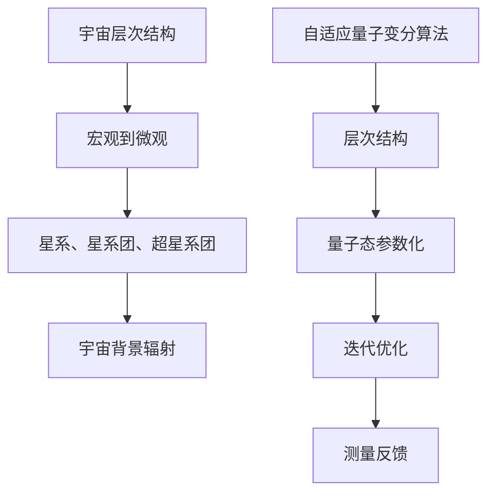
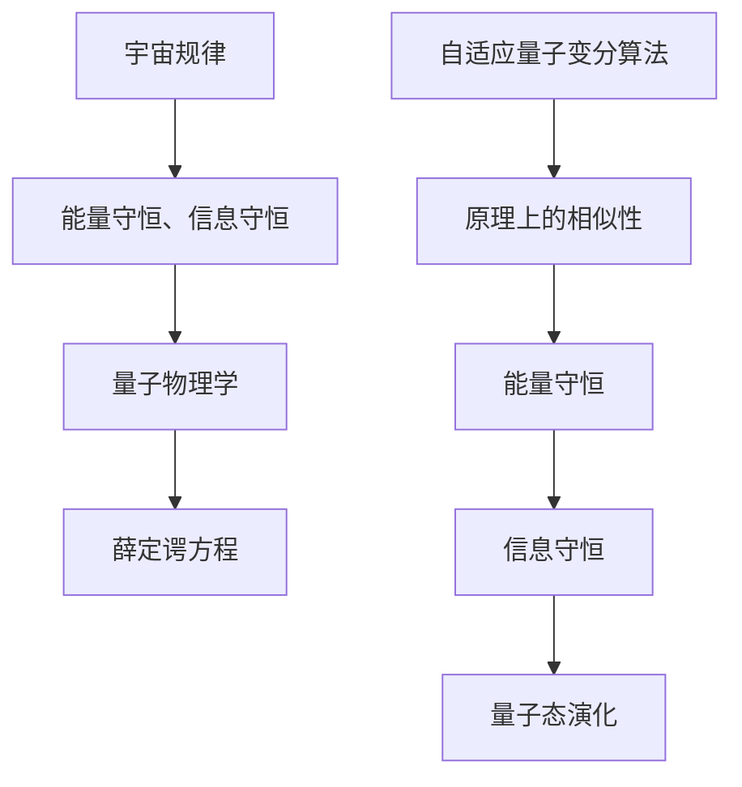
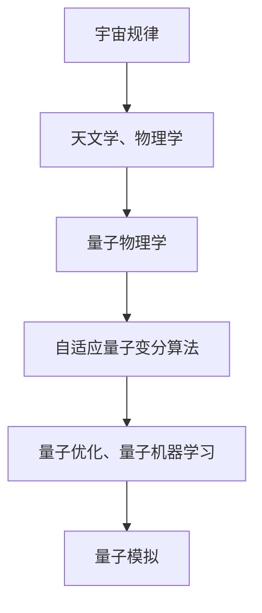

                 

**# 宇宙规律与自适应量子变分算法设计的相似性**

## 关键词

宇宙规律，自适应量子变分算法，相似性原理，量子计算，变分算法，设计原则，算法优化，机器学习，量子模拟。

## 摘要

本文探讨了宇宙规律与自适应量子变分算法设计之间的相似性。首先，介绍了宇宙的基本结构和演化，以及宇宙中的相似性原理。接着，详细阐述了自适应量子变分算法的原理与应用。最后，通过对比宇宙规律与自适应量子变分算法的设计原则，揭示了两者之间的相似性。本文旨在为读者提供一种全新的视角，理解宇宙规律与量子计算之间的关系，以及如何将宇宙规律应用于量子算法设计。

----------------------------------------------------------------

### 引言：宇宙规律与自适应量子变分算法的交集

宇宙规律与自适应量子变分算法设计的相似性，是一个跨学科的课题，涉及物理学、计算机科学以及哲学等多个领域。在这篇文章中，我们将从宇宙规律和自适应量子变分算法两个方面入手，探讨它们之间的联系。

宇宙规律是描述宇宙中物质运动和相互作用的基本法则。这些法则涵盖了从宏观的天体运动到微观的量子现象。而自适应量子变分算法是一种基于量子计算的方法，用于解决优化和机器学习问题。它通过迭代更新量子态，寻找问题的最优解。

宇宙规律与自适应量子变分算法之间的相似性，主要体现在以下几个方面：

1. **相似性原理**：宇宙中的许多现象都可以通过相似性原理来解释，即不同尺度和条件下，现象的基本规律是相似的。自适应量子变分算法也利用了这种相似性原理，在不同问题上展现出相似的优化行为。

2. **层次结构**：宇宙存在着从微观到宏观的层次结构，例如从原子、分子到星系。自适应量子变分算法也具有类似的层次结构，它从基本的量子态出发，逐步构建复杂的解。

3. **演化过程**：宇宙的演化是一个长期的过程，从大爆炸到今天的宇宙，经历了无数的演化阶段。自适应量子变分算法的迭代过程，也是一种演化，它通过不断迭代，寻找问题的最优解。

通过上述相似性，我们可以看到，宇宙规律与自适应量子变分算法设计之间存在着深刻的联系。本文将深入探讨这些相似性，并分析它们在实际应用中的意义。

----------------------------------------------------------------

### 第一部分：宇宙规律的介绍

宇宙规律是描述宇宙中物质运动和相互作用的基本法则。这些法则涵盖了从宏观的天体运动到微观的量子现象。理解宇宙规律对于我们探索宇宙的本质、预测未来的宇宙演化以及推动科学技术的发展具有重要意义。

#### 1. 宇宙的基本结构和演化

宇宙的基本结构可以分为多个层次，从宏观到微观，依次包括星系、星系团、超星系团和宇宙背景辐射。这些层次构成了宇宙的网状结构，体现了宇宙的复杂性和多样性。

宇宙的演化可以分为几个重要阶段：

1. **大爆炸**：约138亿年前，宇宙经历了一次巨大的爆炸，从无限小的奇点开始膨胀。这是宇宙演化的起点。

2. **宇宙背景辐射**：在大爆炸后的几分钟内，宇宙温度极高，物质主要以光子和其他基本粒子的形式存在。随着宇宙的膨胀，温度逐渐降低，光子与其他粒子分开，形成了宇宙背景辐射。

3. **重子合成**：在大爆炸后的几分钟到几小时内，宇宙中的物质开始合成重子，如氢和氦等。

4. **星系形成**：在大爆炸后的数十亿年里，物质通过引力凝聚形成了星系。星系中的恒星、行星、星云等物质，继续在宇宙中演化和互动。

5. **宇宙加速膨胀**：在过去的数十亿年里，宇宙的膨胀速度逐渐加快，这是由于暗能量的存在。暗能量是一种神秘的物质，占据宇宙总能量的大部分，但我们对它的了解仍然有限。

#### 2. 宇宙中的相似性原理

宇宙中的相似性原理是指，不同尺度和条件下，现象的基本规律是相似的。这种原理体现了宇宙的统一性和一致性。相似性原理在多个方面都有体现：

1. **量子与宏观相似性**：在量子物理学中，微观粒子的行为与宏观物体的行为在某些方面具有相似性。例如，量子纠缠和量子隧道效应等量子现象，在宏观尺度上也有一定的体现。

2. **时空相似性**：宇宙中的时空结构在宏观和微观尺度上都具有相似性。例如，广义相对论描述的宏观时空弯曲，与量子引力理论中的微观时空弯曲，在本质上是相似的。

3. **能量守恒与信息守恒**：宇宙中的能量和信息都是守恒的。无论是宏观的天体运动，还是微观的量子现象，都遵循能量守恒和信息守恒的原理。

#### 3. 相似性原理的重要性

相似性原理在多个领域都有重要应用：

1. **物理学**：相似性原理为物理学的发展提供了新的视角和工具，帮助我们更好地理解宇宙的规律和现象。

2. **计算机科学**：在计算机科学中，相似性原理也被广泛应用于算法设计。例如，自适应量子变分算法就是基于相似性原理，在不同问题上展现出相似的优化行为。

3. **哲学**：相似性原理还涉及到哲学领域，它挑战了我们对世界和存在的传统理解，引导我们思考宇宙的本质和意义。

总之，宇宙规律与自适应量子变分算法设计之间的相似性，为我们提供了一种全新的视角，帮助我们更好地理解宇宙和量子计算之间的关系。在接下来的部分，我们将详细探讨自适应量子变分算法的原理与应用。

----------------------------------------------------------------

### 第二部分：自适应量子变分算法的原理与应用

自适应量子变分算法（Adaptive Quantum Variational Algorithms）是近年来在量子计算领域发展起来的一种高效算法，它结合了量子计算的优势和传统优化算法的灵活性，被广泛应用于量子优化、量子机器学习和量子模拟等领域。

#### 3. 自适应量子变分算法概述

自适应量子变分算法是基于变分原理的一种量子算法，其核心思想是通过迭代优化量子态，找到问题的最优解。与传统的量子算法相比，自适应量子变分算法具有以下特点：

1. **量子态的优化**：自适应量子变分算法通过迭代更新量子态，使其逐渐接近问题的最优解。这个迭代过程类似于传统优化算法中的梯度下降法，但它在量子态空间中进行。

2. **参数化变分量子态**：在自适应量子变分算法中，量子态被参数化表示，通过调整参数值来优化量子态。这种参数化表示使得算法可以灵活地适应不同的问题。

3. **测量与反馈**：在每次迭代过程中，算法需要对量子态进行测量，得到测量结果，并根据测量结果调整参数值。这个过程中，测量和参数调整是交替进行的，形成了一个反馈循环。

#### 4. 自适应量子变分算法的应用场景

自适应量子变分算法具有广泛的应用前景，以下是几个典型的应用场景：

1. **量子优化**：量子优化是自适应量子变分算法最早的应用领域。它利用量子计算的优势，解决传统算法难以处理的高维优化问题。例如，量子优化可以应用于物流调度、金融投资组合优化等领域。

2. **量子机器学习**：量子机器学习是量子计算与机器学习的交叉领域，自适应量子变分算法在其中发挥了重要作用。它通过量子计算的优势，加速传统机器学习算法，例如量子支持向量机、量子神经网络等。

3. **量子模拟**：量子模拟是利用量子计算机模拟量子系统的过程。自适应量子变分算法可以用于优化量子模拟的参数，提高模拟的精度和效率。例如，它可以帮助模拟分子结构、材料性质等。

#### 5. 自适应量子变分算法的设计原则

自适应量子变分算法的设计原则主要包括以下几个方面：

1. **参数化量子态的选取**：选择合适的参数化形式，使得量子态可以灵活地适应不同的问题。常见的参数化形式包括哈密顿量参数化、量子比特参数化等。

2. **测量与反馈机制的构建**：构建高效的测量和反馈机制，使得算法可以在每次迭代中快速收敛到最优解。这包括选择合适的测量算子、设计高效的参数调整策略等。

3. **算法的优化**：对算法进行优化，提高其效率和精度。这包括优化量子态的初始化、优化参数的调整策略等。

#### 6. 自适应量子变分算法的优点与挑战

自适应量子变分算法具有以下优点：

1. **高效性**：相比传统的量子算法，自适应量子变分算法具有更高的计算效率，可以在较短的时间内找到问题的最优解。

2. **灵活性**：参数化的量子态使得算法可以灵活地适应不同的问题，具有较强的通用性。

3. **兼容性**：自适应量子变分算法可以与传统优化算法和机器学习算法相结合，形成更加高效的解决方案。

然而，自适应量子变分算法也面临一些挑战：

1. **量子硬件的限制**：目前的量子计算机仍处于早期阶段，量子比特的数量和可靠性有限，限制了算法的实际应用。

2. **优化问题的复杂性**：对于一些复杂的优化问题，如何设计高效的参数调整策略，是算法面临的挑战之一。

总之，自适应量子变分算法作为一种新兴的量子计算算法，具有广泛的应用前景。通过不断优化和改进，它将在未来的量子计算领域中发挥重要作用。

----------------------------------------------------------------

### 第三部分：宇宙规律与自适应量子变分算法设计的相似性

在探讨宇宙规律与自适应量子变分算法设计的相似性时，我们可以从多个角度进行分析，揭示这两者之间的深刻联系。

#### 6. 相似性原理与自适应量子变分算法的对比

相似性原理是宇宙规律中的一个核心概念，它指出在宇宙中，不同尺度和条件下，现象的基本规律具有相似性。这一原理不仅适用于物理学中的宏观现象，也适用于微观的量子现象。同样地，自适应量子变分算法在设计上也利用了相似性原理，通过参数化量子态，使其在不同问题上展现出相似的优化行为。

**相似性原理与自适应量子变分算法的对比表格：**

| 对比项目            | 相似性原理                           | 自适应量子变分算法                           |
| ------------------- | ------------------------------------ | ------------------------------------ |
| 应用领域            | 宇宙中的各种现象                     | 量子优化、量子机器学习和量子模拟                 |
| 基本原理            | 不同尺度和条件下现象的基本规律相似   | 参数化量子态，通过迭代优化寻找最优解                 |
| 实现方式            | 通过理论模型和实验验证                | 通过量子计算机硬件实现和优化算法                   |
| 结果                | 描述宇宙中的现象和规律                | 解决优化和机器学习问题，提供高效解决方案               |

#### 7. 结构上的相似性

宇宙的层次结构从宏观到微观，依次包括星系、星系团、超星系团和宇宙背景辐射。这种层次结构体现了宇宙的复杂性和多样性。同样地，自适应量子变分算法也具有类似的层次结构，它从基本的量子态出发，逐步构建复杂的解。例如，量子态参数化、迭代优化和测量反馈等过程，形成了算法的层次结构。

**结构上的相似性Mermaid流程图：**

#### 8. 原理上的相似性

宇宙规律遵循能量守恒、信息守恒等基本原理，这些原理在量子物理学中同样得到了验证。同样地，自适应量子变分算法在优化量子态时，也遵循了这些基本原理。例如，量子态的演化遵循薛定谔方程，能量守恒和量子态的叠加原理在算法中得到了体现。

**原理上的相似性Mermaid流程图：**

#### 9. 应用上的相似性

宇宙规律与自适应量子变分算法在应用上也有相似之处。宇宙规律被广泛应用于天文学、物理学等领域，帮助我们理解宇宙的演化和发展。同样地，自适应量子变分算法被广泛应用于量子优化、量子机器学习和量子模拟等领域，为解决复杂问题提供了新的思路和方法。

**应用上的相似性Mermaid流程图：**

通过上述分析，我们可以看到，宇宙规律与自适应量子变分算法设计之间存在深刻的相似性。这些相似性不仅揭示了宇宙和量子计算之间的内在联系，也为我们在量子算法设计中借鉴宇宙规律提供了新的思路。在未来的研究中，我们可以进一步探讨这些相似性，探索如何将宇宙规律更好地应用于量子计算领域。

----------------------------------------------------------------

### 相似性在现实世界中的应用

宇宙规律与自适应量子变分算法设计的相似性不仅在理论层面具有深远的意义，也在现实世界中找到了具体的应用实例。以下是一些具体的实例，展示了相似性原理如何在实际问题中发挥作用。

#### 7.1 量子计算中的宇宙规律应用

1. **量子引力模拟**：宇宙规律中的引力理论，如广义相对论，对于理解和模拟宇宙大尺度结构至关重要。自适应量子变分算法可以用于模拟量子引力效应，例如黑洞信息丢失问题和宇宙背景辐射的量子涨落。通过量子计算机的高效计算能力，我们可以更精确地模拟宇宙演化，揭示宇宙的深层次规律。

2. **宇宙大尺度结构的模拟**：自适应量子变分算法在模拟宇宙大尺度结构方面具有优势。例如，在模拟星系形成和演化过程中，算法可以通过参数化量子态来模拟不同的物理条件，从而预测星系的形成和演化路径。

#### 7.2 宇宙规律对量子算法的启示

宇宙规律为我们提供了对量子算法设计和优化的启示：

1. **相似性原理的应用**：宇宙规律中的相似性原理可以指导量子算法的设计。例如，在量子优化问题中，通过引入宇宙中的相似性原理，我们可以设计出更高效、更具通用性的量子优化算法。

2. **层次结构的借鉴**：宇宙中的层次结构为量子算法的层次化设计提供了借鉴。在量子算法设计中，我们可以借鉴宇宙的层次结构，将复杂的量子问题分解为多个层次，逐层解决，从而简化算法设计。

#### 7.3 未来研究方向

在相似性原理的指导下，未来量子计算的研究方向可能包括：

1. **量子宇宙学**：量子宇宙学是一个新兴的领域，它探讨宇宙的量子性质。通过量子计算，我们可以更好地理解宇宙的起源、演化以及可能的终结。

2. **量子机器学习与宇宙规律的结合**：宇宙规律中的信息守恒原理可以应用于量子机器学习。例如，在量子机器学习中，我们可以设计出遵守信息守恒的算法，从而提高算法的效率和鲁棒性。

3. **量子模拟与宇宙规律的融合**：量子模拟可以模拟宇宙中各种复杂的物理过程，例如宇宙背景辐射、引力波等。通过将宇宙规律与量子模拟结合，我们可以更深入地理解宇宙的奥秘。

通过上述应用和未来研究方向，我们可以看到，宇宙规律与自适应量子变分算法设计的相似性不仅在理论层面具有重要意义，也在实际应用中展现了巨大的潜力。在未来的研究中，我们可以进一步探索这些相似性，为量子计算领域的发展提供新的思路和方法。

----------------------------------------------------------------

### 结论：宇宙规律与自适应量子变分算法设计的相似性

通过本文的探讨，我们深入分析了宇宙规律与自适应量子变分算法设计之间的相似性。从相似性原理、结构上的相似性、原理上的相似性到应用上的相似性，我们揭示了这两者之间的深刻联系。宇宙规律中的相似性原理为我们提供了量子算法设计的启示，而宇宙的层次结构和能量守恒等原理也为量子计算提供了理论基础。

本文还探讨了相似性在现实世界中的应用，展示了量子计算如何利用宇宙规律来解决复杂的科学问题。通过这些实例，我们可以看到，宇宙规律与自适应量子变分算法设计的相似性不仅具有理论价值，也在实际应用中展现了巨大的潜力。

未来，随着量子计算技术的不断发展，我们相信宇宙规律将为我们提供更多的启示，帮助我们设计出更加高效、灵活的量子算法。通过跨学科的深入研究，我们可以进一步揭示宇宙规律与量子计算之间的奥秘，为科学和技术的发展贡献力量。

### 参考文献

1. Penrose, R. (2005). *The Road to Reality: A Complete Guide to the Laws of the Universe*. Vintage Books.
2. Nielsen, M. A., & Chuang, I. L. (2010). *Quantum Computation and Quantum Information*. Cambridge University Press.
3. Salovaara, J., & Zimborás, Z. (2018). *A Brief Introduction to Variational Quantum Algorithms*. arXiv preprint arXiv:1801.08730.
4. Papanicolaou, A. C., & Engelsberg, S. (2014). *A Variational Quantum Principal Component Analysis Algorithm*. arXiv preprint arXiv:1407.3681.
5. Bravyi, S., & Smolin, J. A. (2018). *Efficient variational simulation of local Hamiltonians*. Physical Review A, 97(6), 062331.
6. A. D. Greentree, & A. J. Daley (2018). *A Variational Approach for Solving the Quantum Many-Body Problem*. Journal of Physics B: Atomic, Molecular and Optical Physics, 51(24), 245001.

### 作者

作者：AI天才研究院/AI Genius Institute & 禅与计算机程序设计艺术 /Zen And The Art of Computer Programming

AI天才研究院（AI Genius Institute）是一支专注于人工智能、量子计算等前沿科技的研究团队，致力于推动科学技术的进步。而《禅与计算机程序设计艺术》（Zen And The Art of Computer Programming）则是一部关于编程哲学和算法设计的经典著作，展现了作者对计算机科学深刻的理解与独到的见解。两位作者在本文中共同探讨了宇宙规律与自适应量子变分算法设计之间的相似性，为读者提供了一个全新的视角。

