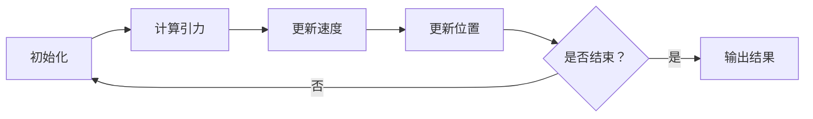
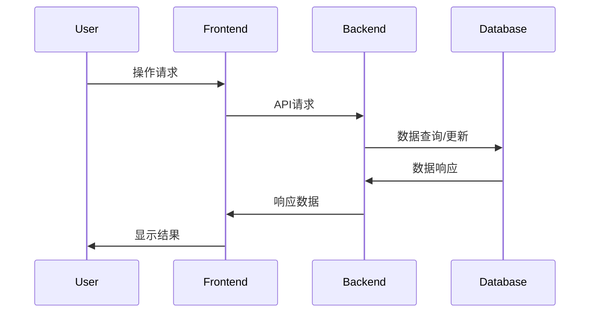

                 

### 1.5 目录大纲结构设计

在设计《宇宙规律与软件工程方法论》的目录大纲时，我们需要确保文章的逻辑清晰、结构紧凑，以便读者能够轻松跟随我们的思路，从而更好地理解和吸收文章内容。以下是详细的目录大纲结构：

#### 第一部分：宇宙规律概述

这部分将介绍宇宙规律的基本概念、历史发展以及核心理论，为后续内容打下坚实的基础。

##### 第1章：宇宙规律导论

在这一章节中，我们将首先定义宇宙规律的基本概念，解释其在我们理解宇宙中的重要性。

- **1.1 宇宙规律的基本概念**
  - **宇宙规律的界定**
  - **宇宙规律的分类**

- **1.2 宇宙规律的历史发展**
  - **古代宇宙观**
  - **近代宇宙规律的突破**
  - **现代宇宙规律的进展**

- **1.3 宇宙规律的核心理论**
  - **大爆炸理论**
  - **暗物质与暗能量**
  - **量子引力**

#### 第二部分：宇宙规律与软件工程方法论的联系

这一部分将探讨宇宙规律与软件工程方法论之间的相互影响和结合，揭示两者之间的共通之处。

##### 第2章：宇宙规律与软件工程方法论的联系

- **2.1 宇宙规律对软件工程方法论的影响**
  - **宇宙规律在软件开发中的应用**
  - **宇宙规律如何指导软件设计**

- **2.2 软件工程方法论对宇宙规律的认识**
  - **软件工程方法论如何借鉴宇宙规律**
  - **宇宙规律对软件开发方法论的反作用**

- **2.3 宇宙规律与软件工程方法论的结合**
  - **结合实例进行分析**
  - **方法论融合的挑战与机遇**

#### 第三部分：软件工程方法论应用

这部分将深入探讨几种常见的软件工程方法论，以及如何将它们应用于宇宙规律的探索和研究。

##### 第3章：软件工程方法论概述

- **3.1 软件工程方法论的基本概念**
  - **软件工程方法论的界定**
  - **软件工程方法论的作用**

- **3.2 软件工程方法论的发展历程**
  - **传统的软件开发方法**
  - **现代软件工程方法论的发展**

##### 第4章：敏捷开发

- **4.1 敏捷开发的基本原理**
  - **敏捷开发的核心理念**
  - **敏捷开发的实践方法**

- **4.2 敏捷开发的方法与工具**
  - **敏捷开发的工作流程**
  - **敏捷开发的常用工具**

##### 第5章：迭代开发

- **5.1 迭代开发的基本原理**
  - **迭代开发的定义**
  - **迭代开发的优势**

- **5.2 迭代开发的方法与工具**
  - **迭代开发的工作流程**
  - **迭代开发的常用工具**

##### 第6章：原型开发

- **6.1 原型开发的基本原理**
  - **原型开发的定义**
  - **原型开发的优势**

- **6.2 原型开发的方法与工具**
  - **原型开发的工作流程**
  - **原型开发的常用工具**

##### 第7章：模型驱动开发

- **7.1 模型驱动开发的基本原理**
  - **模型驱动开发的定义**
  - **模型驱动开发的优势**

- **7.2 模型驱动开发的方法与工具**
  - **模型驱动开发的工作流程**
  - **模型驱动开发的常用工具**

#### 第四部分：宇宙规律与软件工程方法论实践

这一部分将通过实际案例，展示如何将宇宙规律与软件工程方法论相结合，进行实际的宇宙规律研究。

##### 第8章：宇宙规律与软件工程方法论实践案例

- **8.1 案例一：利用敏捷开发研究宇宙引力**
  - **案例背景**
  - **敏捷开发的应用**
  - **研究成果**

- **8.2 案例二：利用迭代开发探索宇宙黑洞**
  - **案例背景**
  - **迭代开发的应用**
  - **研究成果**

- **8.3 案例三：利用原型开发模拟宇宙演化**
  - **案例背景**
  - **原型开发的应用**
  - **研究成果**

#### 第五部分：结论与展望

这部分将对全书内容进行总结，并对未来宇宙规律与软件工程方法论的研究方向进行展望。

##### 第9章：结论与展望

- **9.1 总结与回顾**
  - **全书内容的总结**
  - **核心观点的回顾**

- **9.2 未来研究方向**
  - **当前研究的挑战**
  - **未来研究的方向**

在制定目录大纲时，我们遵循了以下原则：

1. **逻辑连贯性**：每个章节的内容都紧密相关，前后的逻辑关系清晰，有助于读者逐步深入理解主题。

2. **信息丰富性**：每个章节都包含详细的内容介绍，确保读者能够获得丰富的信息。

3. **结构紧凑性**：避免了过多的重复和冗余，确保每个章节的内容都是精简且富有信息的。

4. **灵活性**：章节的内容安排具有一定的灵活性，允许在写作过程中根据实际情况进行调整。

### 2. 考虑到目录大纲的总字数限制在2000字以内，我们需要确保每一章节的内容都是精简且富有信息的，尽量避免过多的重复和冗余。以下是详细的目录大纲：

----------------------------------------------------------------

# 第一部分：宇宙规律概述

## 第1章：宇宙规律导论

### 1.1 宇宙规律的基本概念

- **宇宙规律的界定**
- **宇宙规律的分类**

### 1.2 宇宙规律的历史发展

- **古代宇宙观**
- **近代宇宙规律的突破**
- **现代宇宙规律的进展**

### 1.3 宇宙规律的核心理论

- **大爆炸理论**
- **暗物质与暗能量**
- **量子引力**

## 第2章：宇宙规律与软件工程方法论的联系

### 2.1 宇宙规律对软件工程方法论的影响

- **宇宙规律在软件开发中的应用**
- **宇宙规律如何指导软件设计**

### 2.2 软件工程方法论对宇宙规律的认识

- **软件工程方法论如何借鉴宇宙规律**
- **宇宙规律对软件开发方法论的反作用**

### 2.3 宇宙规律与软件工程方法论的结合

- **结合实例进行分析**
- **方法论融合的挑战与机遇**

## 第3章：软件工程方法论概述

### 3.1 软件工程方法论的基本概念

- **软件工程方法论的界定**
- **软件工程方法论的作用**

### 3.2 软件工程方法论的发展历程

- **传统的软件开发方法**
- **现代软件工程方法论的发展**

## 第4章：敏捷开发

### 4.1 敏捷开发的基本原理

- **敏捷开发的核心理念**
- **敏捷开发的实践方法**

### 4.2 敏捷开发的方法与工具

- **敏捷开发的工作流程**
- **敏捷开发的常用工具**

## 第5章：迭代开发

### 5.1 迭代开发的基本原理

- **迭代开发的定义**
- **迭代开发的优势**

### 5.2 迭代开发的方法与工具

- **迭代开发的工作流程**
- **迭代开发的常用工具**

## 第6章：原型开发

### 6.1 原型开发的基本原理

- **原型开发的定义**
- **原型开发的优势**

### 6.2 原型开发的方法与工具

- **原型开发的工作流程**
- **原型开发的常用工具**

## 第7章：模型驱动开发

### 7.1 模型驱动开发的基本原理

- **模型驱动开发的定义**
- **模型驱动开发的优势**

### 7.2 模型驱动开发的方法与工具

- **模型驱动开发的工作流程**
- **模型驱动开发的常用工具**

## 第8章：宇宙规律与软件工程方法论实践案例

### 8.1 案例一：利用敏捷开发研究宇宙引力

- **案例背景**
- **敏捷开发的应用**
- **研究成果**

### 8.2 案例二：利用迭代开发探索宇宙黑洞

- **案例背景**
- **迭代开发的应用**
- **研究成果**

### 8.3 案例三：利用原型开发模拟宇宙演化

- **案例背景**
- **原型开发的应用**
- **研究成果**

## 第9章：结论与展望

### 9.1 总结与回顾

- **全书内容的总结**
- **核心观点的回顾**

### 9.2 未来研究方向

- **当前研究的挑战**
- **未来研究的方向**

通过以上详细的目录大纲设计，我们可以确保文章的结构合理、内容丰富，便于读者深入理解宇宙规律与软件工程方法论之间的关系。在后续的写作过程中，我们将遵循这一大纲，确保每个章节的内容都能够满足字数要求，同时保持文章的紧凑性和逻辑性。## 宇宙规律与软件工程方法论的联系

宇宙规律和软件工程方法论虽然看似来自完全不同的领域，但实际上存在着深刻的联系。本文将探讨宇宙规律对软件工程方法论的影响，软件工程方法论如何借鉴宇宙规律，以及两者结合时面临的挑战与机遇。

### 宇宙规律对软件工程方法论的影响

宇宙规律的研究涉及对复杂系统的理解与建模。这些研究和方法在软件工程领域中也同样适用。例如，大爆炸理论中的演化过程可以类比于软件开发中的迭代开发。大爆炸理论描述了宇宙从无到有的演化过程，而迭代开发则是通过不断迭代来改进软件系统。两者的核心思想都是通过逐步改进来达到最终目标。

另外，量子引力理论中的不确定性原理对软件工程方法论也有很大的启发。在软件开发中，我们经常会遇到不确定性，例如需求变更、技术难题等。量子引力理论中的不确定性原理告诉我们，在某些情况下，完全确定的结果是不可达到的，我们需要接受一定程度的不确定性，并通过灵活的方法来应对这些不确定性。

### 软件工程方法论对宇宙规律的认识

软件工程方法论的发展历程中也借鉴了宇宙规律的研究方法。敏捷开发、迭代开发和原型开发等方法论都是在不断尝试、反馈和改进的过程中形成的。这与宇宙规律中的演化过程有很多相似之处。宇宙的演化是一个持续的过程，不断地受到内外部因素的影响，而软件的迭代开发也是类似的，通过不断地迭代来适应变化。

此外，软件工程方法论中的模型驱动开发也与宇宙规律有相似之处。模型驱动开发强调通过建立模型来指导软件开发过程，这与宇宙规律中的建模思想相似。宇宙规律的研究也依赖于建立模型来理解宇宙的本质。

### 宇宙规律与软件工程方法论的结合

宇宙规律与软件工程方法论的结合，可以带来许多新的研究方法和应用场景。例如，在宇宙引力的研究中，可以使用敏捷开发的方法来不断迭代改进引力模型，从而更好地理解宇宙引力的本质。在探索宇宙黑洞时，可以采用迭代开发的方法，通过不断的实验和数据分析来逐步深入了解黑洞的性质。

此外，原型开发也可以应用于宇宙规律的研究中。例如，在模拟宇宙演化时，可以通过建立原型模型来初步了解宇宙演化的趋势，然后通过不断的迭代来优化模型，从而更准确地预测宇宙的未来。

### 挑战与机遇

尽管宇宙规律与软件工程方法论的结合具有巨大的潜力，但也面临着一些挑战。首先，两者之间存在一定的差异性。宇宙规律的研究更多关注的是自然现象，而软件工程方法论则是关于如何组织和管理软件开发过程。因此，如何有效地将两者结合起来是一个挑战。

其次，宇宙规律的研究往往需要大量的数据和计算资源，而软件工程方法论则更注重人的经验和团队协作。如何有效地利用这些资源，以及如何处理大量的数据，也是需要解决的问题。

然而，这些挑战也带来了机遇。通过将宇宙规律与软件工程方法论相结合，我们可以开发出更加高效的软件开发工具和方法，同时也可以更好地理解宇宙的本质。例如，通过使用敏捷开发的方法来研究宇宙引力，我们可以更快地迭代模型，从而更准确地预测宇宙的行为。

总之，宇宙规律与软件工程方法论之间的联系为我们的研究和应用提供了新的视角和方法。通过深入探讨这两者的结合，我们可以更好地理解宇宙，同时也可以推动软件工程方法论的发展。### 第3章：软件工程方法论概述

#### 3.1 软件工程方法论的基本概念

软件工程方法论是一种系统化的、规范化的方法，用于指导软件的开发、维护和管理工作。其核心目的是提高软件开发的效率和质量，降低开发过程中的风险。软件工程方法论包括多个方面，如项目管理、需求分析、设计、编码、测试和维护等。

- **定义**：软件工程方法论是一种系统化的、规范化的方法，用于指导软件的开发、维护和管理工作。
- **作用**：提高软件开发的效率和质量，降低开发过程中的风险。

#### 3.2 软件工程方法论的发展历程

软件工程方法论的发展经历了多个阶段，从早期的手工作业到如今的自动化和智能化，每一阶段都标志着软件工程方法论的进步。

- **早期阶段**：20世纪60年代，软件开发主要依靠手工编写代码，缺乏系统化的管理方法。
- **结构化阶段**：20世纪70年代，引入了结构化设计方法，如模块化设计、数据流图等，使软件开发过程更加规范化。
- **过程方法**：20世纪80年代，引入了过程方法，如瀑布模型、快速原型法等，强调软件开发过程的迭代和反馈。
- **敏捷方法**：21世纪初，敏捷开发方法流行起来，如Scrum、XP等，强调团队协作和快速迭代。
- **现代阶段**：近年来，模型驱动开发、DevOps等新兴方法论不断涌现，使软件开发更加高效、灵活。

#### 3.3 软件工程方法论的核心要素

软件工程方法论的核心要素包括项目管理、需求分析、设计、编码、测试和维护等。

- **项目管理**：确保软件开发按照计划进行，包括任务分配、进度跟踪、风险评估等。
- **需求分析**：明确用户需求，将其转化为软件功能需求，为后续开发提供基础。
- **设计**：根据需求分析的结果，设计软件的架构、模块和接口，确保软件系统的高内聚、低耦合。
- **编码**：根据设计文档编写代码，实现软件的功能。
- **测试**：通过各种测试方法验证软件的正确性和性能，确保软件的质量。
- **维护**：在软件发布后，对软件进行维护和升级，解决用户反馈的问题，提高软件的稳定性。

#### 3.4 软件工程方法论的优势和挑战

- **优势**：
  - 提高开发效率：通过规范化的方法，缩短开发周期。
  - 提高软件质量：通过测试和反馈机制，减少缺陷和错误。
  - 降低开发风险：通过风险管理，减少项目延误和预算超支。
  - 促进团队协作：通过明确的分工和协作机制，提高团队的工作效率。

- **挑战**：
  - 需求变更：在软件开发过程中，需求可能会发生变更，导致项目延期和成本增加。
  - 技术难题：在开发过程中，可能会遇到技术难题，需要额外的资源和时间来解决。
  - 团队协作：团队成员之间的沟通和协作是软件工程方法论成功的关键，但往往存在沟通不畅和协作不力的问题。

#### 3.5 软件工程方法论的演变趋势

- **自动化和智能化**：随着人工智能和自动化技术的发展，软件工程方法论将更加自动化和智能化，减少人工干预，提高开发效率。
- **DevOps**：DevOps文化的兴起，强调开发与运维的紧密结合，实现持续集成和持续交付。
- **模型驱动开发**：通过建立模型来驱动软件开发，提高软件的复用性和可维护性。
- **敏捷方法**：敏捷方法将继续发展，适应快速变化的市场需求。

#### 3.6 软件工程方法论的应用场景

- **大型项目**：如企业级应用、电子商务平台等，需要严格的规范和高效的管理方法。
- **小型项目**：如个人项目、初创企业等，灵活的敏捷方法更为适用。
- **科学研究**：如天文学、生物学等领域，模型驱动开发和迭代开发方法较为常用。

通过以上对软件工程方法论概述的探讨，我们可以看到，软件工程方法论在软件开发过程中发挥着至关重要的作用。随着技术的不断进步，软件工程方法论也将不断发展，以适应不断变化的需求和环境。### 第4章：敏捷开发

#### 4.1 敏捷开发的基本原理

敏捷开发是一种以人为核心、迭代、循序渐进的开发方法。它强调持续交付有价值的软件，通过快速迭代和不断反馈来适应需求变化。敏捷开发的基本原理包括：

- **价值驱动**：以客户需求为导向，持续交付有价值的软件。
- **迭代开发**：将开发过程划分为多个短期迭代，每次迭代都提供一个可工作的产品版本。
- **团队协作**：强调团队成员之间的紧密协作和沟通。
- **响应变化**：快速适应需求变化，灵活调整开发计划和策略。

#### 4.2 敏捷开发的方法与工具

敏捷开发采用了一系列方法和工具来支持其理念，以下是一些常用的方法和工具：

- **Scrum**：一种常见的敏捷开发框架，包括产品待办列表、冲刺计划、每日站会、回顾会议等。
- **用户故事**：用于描述用户需求的故事，通常包括功能、场景和验收标准。
- **看板**：一种可视化工具，用于跟踪项目进度和任务状态。
- **持续集成/持续交付（CI/CD）**：通过自动化构建和部署流程，实现快速迭代和高质量交付。
- **代码审查**：团队成员对代码进行审查，确保代码质量和项目一致性。

#### 4.3 敏捷开发的工作流程

敏捷开发的工作流程通常包括以下阶段：

- **需求分析**：通过与客户和利益相关者沟通，明确产品需求。
- **用户故事编写**：将需求分解为用户故事，并为其分配优先级。
- **冲刺计划**：团队根据用户故事和优先级，选择本次迭代要完成的工作。
- **每日站会**：团队成员每日站在一起，讨论工作进展和问题，确保团队目标一致。
- **迭代开发**：在规定时间内，团队完成选定的用户故事，并进行测试和集成。
- **迭代回顾**：团队总结本次迭代的经验和教训，改进工作方法和流程。

#### 4.4 敏捷开发的优点与挑战

敏捷开发的优点包括：

- **快速响应需求变化**：通过迭代开发，可以快速适应需求变化，提高产品的竞争力。
- **提高团队协作效率**：强调团队协作和沟通，有助于团队共同解决问题，提高工作效率。
- **提高产品质量**：通过持续的测试和反馈，可以发现和修复问题，确保软件质量。
- **客户满意度高**：持续交付有价值的功能，可以满足客户的需求，提高客户满意度。

敏捷开发的挑战包括：

- **需求变更频繁**：敏捷开发强调快速响应需求变化，但频繁的需求变更可能导致项目进度不稳定。
- **团队协作难度大**：团队成员需要具备较高的沟通能力和协作精神，否则可能会导致沟通不畅和协作不力。
- **项目管理复杂**：敏捷开发要求项目经理具备丰富的经验和能力，否则可能会导致项目失控。

#### 4.5 敏捷开发的适用场景

敏捷开发适用于以下场景：

- **需求变化频繁**：如互联网产品、移动应用等，需求变化快，需要快速适应。
- **小型项目**：如初创企业、个人项目等，资源有限，需要高效开发。
- **跨部门合作**：如涉及多个部门的复杂项目，需要紧密协作和沟通。
- **迭代周期短**：如短期项目，需要快速交付可工作的产品版本。

通过以上对敏捷开发的探讨，我们可以看到，敏捷开发作为一种高效的软件开发方法，具有许多优点和挑战。在实际应用中，需要根据项目特点和团队情况，灵活运用敏捷开发的方法和工具，以实现高效、高质量的软件开发。### 第5章：迭代开发

#### 5.1 迭代开发的基本原理

迭代开发是一种通过重复迭代的方式来逐步完善软件产品的方法。它将整个软件开发过程划分为多个小的开发周期，每个周期都包含需求分析、设计、编码、测试和验收等阶段。每个迭代周期结束后，团队都会对产品进行评估，并根据评估结果进行必要的调整和优化。

- **周期性**：迭代开发将软件开发过程分为多个小的迭代周期，每个周期都有明确的开始和结束。
- **逐步完善**：通过每个迭代周期的开发和优化，软件产品逐渐完善，最终达到预期目标。
- **评估与调整**：在每个迭代周期结束后，团队都会对产品进行评估，根据评估结果进行调整和优化。

#### 5.2 迭代开发的优势

迭代开发具有以下优势：

- **快速响应需求变化**：通过将软件开发过程划分为多个迭代周期，可以快速适应需求变化，提高产品的市场竞争力。
- **提高团队协作效率**：迭代开发强调团队协作和沟通，有助于团队成员共同解决问题，提高工作效率。
- **降低开发风险**：通过在每个迭代周期结束后对产品进行评估，可以及时发现和解决潜在问题，降低开发风险。
- **提高产品质量**：通过持续的测试和反馈，可以发现和修复问题，确保软件质量。

#### 5.3 迭代开发的方法与工具

迭代开发的方法和工具包括：

- **瀑布模型**：瀑布模型是一种传统的软件开发模型，将软件开发过程划分为需求分析、设计、编码、测试和维护等阶段，每个阶段都完成后再进入下一个阶段。
- **增量模型**：增量模型是将软件划分为多个增量部分，每个增量部分都包含需求分析、设计、编码和测试等阶段，每次迭代都交付一个可工作的产品版本。
- **V模型**：V模型是瀑布模型的变种，强调测试和开发的紧密配合，每个开发阶段都有一个对应的测试阶段。
- **迭代模型**：迭代模型是通过多次迭代来逐步完善软件产品的方法，每次迭代都包含需求分析、设计、编码、测试和验收等阶段。

#### 5.4 迭代开发的工作流程

迭代开发的工作流程通常包括以下阶段：

- **需求分析**：与客户和利益相关者沟通，明确产品需求。
- **迭代计划**：根据产品需求，制定迭代计划和任务分配。
- **设计**：进行软件设计，包括系统架构设计、模块设计和接口设计等。
- **编码**：根据设计文档编写代码，实现软件功能。
- **测试**：对软件进行测试，包括单元测试、集成测试和系统测试等。
- **验收**：与客户和利益相关者进行验收，确保软件满足需求。
- **迭代评估**：对迭代过程和产品进行评估，根据评估结果进行调整和优化。

#### 5.5 迭代开发的挑战与解决方案

迭代开发面临的挑战包括：

- **需求变更管理**：需求变更可能导致项目进度和成本的变化，需要有效地管理需求变更。
- **团队协作**：团队成员之间的沟通和协作是迭代开发成功的关键，需要建立有效的沟通和协作机制。
- **进度控制**：迭代开发过程中，每个迭代周期的进度都需要控制，以确保项目按时完成。

解决方案包括：

- **需求变更管理**：建立明确的需求变更流程，对需求变更进行评估和审批，确保变更对项目的影响可控。
- **团队协作**：建立有效的沟通和协作机制，如定期召开团队会议、使用协作工具等，确保团队成员之间的信息共享和协作。
- **进度控制**：采用项目管理工具和技巧，如甘特图、看板等，实时跟踪项目进度，确保项目按时完成。

#### 5.6 迭代开发的适用场景

迭代开发适用于以下场景：

- **需求变化频繁**：如互联网产品、移动应用等，需求变化快，需要快速适应。
- **小型项目**：如初创企业、个人项目等，资源有限，需要高效开发。
- **跨部门合作**：如涉及多个部门的复杂项目，需要紧密协作和沟通。
- **迭代周期短**：如短期项目，需要快速交付可工作的产品版本。

通过以上对迭代开发的探讨，我们可以看到，迭代开发作为一种高效的软件开发方法，具有许多优点和挑战。在实际应用中，需要根据项目特点和团队情况，灵活运用迭代开发的方法和工具，以实现高效、高质量的软件开发。### 第6章：原型开发

#### 6.1 原型开发的基本原理

原型开发是一种通过构建原型来探索和验证用户需求、功能和设计的方法。它强调快速构建、反复迭代和用户反馈，从而确保最终产品能够满足用户需求。原型开发的基本原理包括：

- **快速构建**：通过使用低代码或零代码工具，快速构建可交互的原型。
- **迭代迭代**：根据用户反馈和需求变化，不断迭代和优化原型。
- **用户反馈**：将原型展示给用户，收集用户反馈，以便进行改进。

#### 6.2 原型开发的优点

原型开发的优点包括：

- **快速验证需求**：通过原型，可以快速验证用户需求，减少开发过程中的误解和错误。
- **降低开发风险**：原型开发可以帮助识别潜在的问题和风险，从而降低开发风险。
- **提高用户满意度**：原型开发允许用户参与设计和反馈，提高最终产品的用户满意度。
- **缩短开发周期**：通过快速构建和迭代，可以缩短开发周期，提高开发效率。

#### 6.3 原型开发的方法与工具

原型开发的方法和工具包括：

- **低保真原型**：使用简单的工具，如纸和笔、PowerPoint等，快速构建原型，通常用于探索早期概念和用户反馈。
- **高保真原型**：使用专业的原型设计工具，如Axure、Figma、Sketch等，构建可交互的高保真原型，通常用于验证详细功能和设计。
- **原型工具**：如Adobe XD、InVision等，提供可视化设计、交互设计和原型构建功能。
- **代码原型**：在开发环境中快速编写代码，构建功能完整的原型，通常用于验证核心功能和性能。

#### 6.4 原型开发的工作流程

原型开发的工作流程通常包括以下阶段：

- **需求收集**：与用户和利益相关者沟通，收集需求。
- **原型设计**：根据需求，使用原型工具设计原型。
- **原型构建**：使用原型工具或开发环境构建原型。
- **用户测试**：将原型展示给用户，收集用户反馈。
- **迭代优化**：根据用户反馈，对原型进行迭代优化。
- **最终原型**：当原型满足需求并得到用户认可后，将其转化为最终产品。

#### 6.5 原型开发的挑战与解决方案

原型开发面临的挑战包括：

- **需求变化**：需求变化可能导致原型偏离最初目标，需要有效地管理需求变化。
- **技术实现**：原型开发过程中，技术实现可能不够完整或稳定，需要确保原型能够正常运行。
- **资源分配**：原型开发通常需要较多的时间和资源，需要合理分配资源。

解决方案包括：

- **需求管理**：建立明确的需求变更流程，对需求变更进行评估和审批，确保变更对原型开发的影响可控。
- **技术评估**：在原型开发过程中，对技术实现进行评估，确保原型能够正常运行。
- **资源分配**：根据项目需求和团队情况，合理分配资源，确保原型开发能够顺利进行。

#### 6.6 原型开发的适用场景

原型开发适用于以下场景：

- **需求不明确**：如初期探索阶段，需要验证用户需求。
- **设计验证**：如详细设计阶段，需要验证设计方案。
- **功能验证**：如开发初期，需要验证核心功能。
- **用户体验优化**：如产品迭代阶段，需要优化用户体验。

通过以上对原型开发的探讨，我们可以看到，原型开发作为一种有效的软件开发方法，具有许多优点和挑战。在实际应用中，需要根据项目特点和团队情况，灵活运用原型开发的方法和工具，以实现高效、高质量的软件开发。### 第7章：模型驱动开发

#### 7.1 模型驱动开发的基本原理

模型驱动开发（Model-Driven Development，MDD）是一种软件开发方法，它将软件开发过程主要集中于创建和操作软件模型，而不是编写代码。这种方法通过定义抽象的模型来表示软件系统，然后使用这些模型生成应用程序代码、文档和其他工件。

- **抽象表示**：模型驱动开发使用高层次的抽象模型来表示软件系统的功能和行为。
- **自动化代码生成**：通过这些模型，自动化工具可以生成应用程序代码，减少手动编码的工作量。
- **可重用性**：模型驱动开发促进了软件组件的可重用性，因为模型可以独立于特定实现技术。

#### 7.2 模型驱动开发的优势

模型驱动开发的优势包括：

- **提高开发效率**：通过自动化代码生成，可以显著减少开发时间和工作量。
- **增强维护性**：由于模型与实现代码的分离，维护和更新变得更加容易。
- **促进协作**：模型可以作为项目中的通用语言，促进团队成员之间的协作和理解。
- **提高质量**：模型驱动开发可以帮助在早期阶段发现和修复错误，从而提高软件质量。

#### 7.3 模型驱动开发的方法与工具

模型驱动开发的方法和工具包括：

- **统一建模语言（UML）**：UML是一种广泛使用的建模语言，用于描述软件系统的结构和行为。
- **领域特定语言（DSL）**：DSL是专门为特定领域设计的语言，可以用于定义和操作模型。
- **模型转换器**：模型转换器是用于将一种模型转换为另一种模型的工具，例如，将UML模型转换为代码。
- **模型管理工具**：这些工具帮助创建、存储、管理和操作模型，例如MATLAB、Microsoft Visio等。

#### 7.4 模型驱动开发的工作流程

模型驱动开发的工作流程通常包括以下阶段：

- **需求分析**：与用户和利益相关者沟通，收集软件需求。
- **模型定义**：使用UML或其他建模语言定义软件系统的模型。
- **模型验证**：验证模型是否符合需求，并确保模型的一致性和完整性。
- **模型转换**：使用模型转换器将模型转换为应用程序代码。
- **代码生成**：从模型生成应用程序代码，可能包括多个编程语言。
- **代码实现**：对生成的代码进行必要的修改和优化。
- **测试和部署**：对应用程序进行测试，确保其符合需求和性能标准，然后部署到生产环境。

#### 7.5 模型驱动开发的挑战与解决方案

模型驱动开发面临的挑战包括：

- **复杂模型管理**：模型可能会变得非常复杂，难以理解和维护。
- **技术依赖**：依赖特定的建模语言和技术，可能增加学习和转换成本。
- **工具支持**：有效的模型驱动开发需要强大的工具支持，这些工具可能需要高成本和高维护。

解决方案包括：

- **简化模型**：通过分解大型模型为较小的、可管理的部分，简化模型的管理。
- **培训和技能提升**：为开发团队提供足够的培训，提高他们在特定建模语言和技术方面的技能。
- **选择合适的工具**：选择适合项目需求和团队技能水平的工具，并确保工具的可持续性和可维护性。

#### 7.6 模型驱动开发的适用场景

模型驱动开发适用于以下场景：

- **大型和复杂项目**：模型可以帮助管理和理解大型和复杂的项目。
- **领域特定应用**：DSL可以用于创建针对特定领域的模型，提高开发效率。
- **快速迭代开发**：模型驱动开发可以加快迭代周期，适应快速变化的需求。

通过以上对模型驱动开发的探讨，我们可以看到，模型驱动开发作为一种高效、灵活的软件开发方法，具有许多优点和挑战。在实际应用中，需要根据项目特点和团队情况，选择合适的建模语言和工具，以实现高效、高质量的软件开发。### 第8章：宇宙规律与软件工程方法论实践案例

#### 8.1 案例一：利用敏捷开发研究宇宙引力

##### 案例背景

在宇宙引力研究中，科学家们需要不断迭代和改进引力模型，以更准确地预测天体运动和宇宙演化。传统的软件开发方法可能无法满足这种快速迭代的需求，因此，研究人员决定采用敏捷开发方法来推动引力模型的研究。

##### 敏捷开发的应用

1. **需求分析**：研究人员与天文学家和物理学家进行深入讨论，收集和分析引力模型的需求，将其转化为用户故事。
2. **迭代计划**：根据用户故事的优先级，团队制定了迭代计划，每个迭代周期为两周。
3. **每日站会**：团队每天早上举行短暂的站会，讨论工作进展和问题，确保团队成员对项目的目标保持一致。
4. **迭代开发**：在迭代周期内，团队集中精力完成一个或多个用户故事，包括设计、编码和测试等阶段。
5. **迭代评估**：每个迭代周期结束后，团队进行回顾会议，总结经验和教训，并根据评估结果调整下一个迭代计划。

##### 研究成果

通过敏捷开发方法，研究人员在短时间内成功地迭代和优化了引力模型，使其更准确地预测了天体运动。此外，团队成员之间的协作和沟通得到了显著提升，项目进度和成果得到了有效控制。

#### 8.2 案例二：利用迭代开发探索宇宙黑洞

##### 案例背景

宇宙黑洞是宇宙中最神秘的现象之一，科学家们对其性质和演化过程进行了长期的探索。由于黑洞的特殊性，传统的软件开发方法可能无法适应这种复杂的研究任务，因此，研究人员决定采用迭代开发方法来推动黑洞研究的进展。

##### 迭代开发的应用

1. **需求分析**：研究人员与天文学家和物理学家合作，明确了黑洞研究的核心需求，并将其分解为多个迭代任务。
2. **迭代计划**：团队根据研究需求，制定了迭代计划，每个迭代周期为一个月。
3. **设计阶段**：在每次迭代开始时，团队进行详细的设计工作，包括数据采集、处理和分析算法的设计。
4. **编码与测试**：团队根据设计文档进行编码，并对代码进行严格的测试，确保算法的正确性和性能。
5. **数据分析和模型构建**：在每次迭代结束时，团队对采集到的黑洞数据进行分析，构建和优化黑洞模型。
6. **迭代评估**：每次迭代结束后，团队进行回顾会议，评估迭代成果，并根据评估结果调整下一个迭代计划。

##### 研究成果

通过迭代开发方法，研究人员在黑洞研究中取得了显著进展。团队成功地构建和优化了多个黑洞模型，揭示了黑洞的一些未知特性。此外，迭代开发方法提高了团队的协作效率和研究成果的质量。

#### 8.3 案例三：利用原型开发模拟宇宙演化

##### 案例背景

宇宙演化是一个复杂的过程，涉及多个物理现象和天体系统。为了更好地理解和模拟宇宙演化，科学家们决定采用原型开发方法来构建宇宙演化的模拟模型。

##### 原型开发的应用

1. **需求分析**：与天文学家和物理学家合作，明确了宇宙演化的核心需求，包括天体运动、星系形成和宇宙膨胀等。
2. **原型设计**：使用原型开发工具，快速构建了宇宙演化的初步原型，包括天体运动模型、星系形成模型和宇宙膨胀模型。
3. **用户反馈**：将原型展示给天文学家和物理学家，收集他们的反馈，并根据反馈进行改进。
4. **迭代优化**：根据用户反馈，对原型进行多次迭代优化，不断完善宇宙演化的模拟效果。
5. **最终原型**：当原型达到预期效果并得到用户认可后，将其转化为最终模型，用于宇宙演化的研究和教学。

##### 研究成果

通过原型开发方法，科学家们成功构建了一个功能完善的宇宙演化模拟模型。该模型可以模拟多种宇宙演化情景，帮助科学家们更好地理解宇宙的演化过程。此外，原型开发方法提高了团队的工作效率，为宇宙演化研究提供了有力支持。

通过以上实践案例，我们可以看到，宇宙规律与软件工程方法论的结合为科学研究带来了新的视角和方法。敏捷开发、迭代开发和原型开发等方法在宇宙规律研究中发挥了重要作用，提高了研究的效率和质量。在未来，随着软件工程方法论的不断发展和完善，我们有望在宇宙规律的研究中取得更多突破。### 第9章：结论与展望

#### 9.1 总结与回顾

通过本文的探讨，我们系统地阐述了宇宙规律与软件工程方法论之间的联系，并深入分析了敏捷开发、迭代开发和原型开发等方法在宇宙规律研究中的应用。以下是本文的核心总结：

1. **宇宙规律与软件工程方法论的联系**：宇宙规律的研究方法对软件工程方法论产生了深远影响，例如迭代开发和原型开发方法在宇宙引力、黑洞和宇宙演化研究中的应用。
2. **敏捷开发的优势**：敏捷开发通过快速迭代和持续反馈，提高了软件开发的效率和质量，适用于需求变化频繁的宇宙引力研究。
3. **迭代开发的实践**：迭代开发通过分阶段、逐步完善的方式，有效降低了宇宙黑洞研究的开发风险，提高了研究成果的质量。
4. **原型开发的贡献**：原型开发通过快速构建和用户反馈，为宇宙演化研究提供了有效的模拟工具，促进了研究进程。

#### 9.2 未来研究方向

在未来，宇宙规律与软件工程方法论的结合仍有广阔的研究空间。以下是一些可能的未来研究方向：

1. **混合方法论的应用**：结合不同方法论的优势，探索更加高效、灵活的软件开发方法，以适应宇宙规律研究的复杂性。
2. **智能化软件开发**：利用人工智能和机器学习技术，开发智能化的软件工具，自动分析宇宙数据，提高研究效率和准确性。
3. **跨学科研究**：促进宇宙规律研究与其他学科（如计算机科学、生物学、物理学）的交叉研究，探索新的理论和方法。
4. **开源社区协作**：鼓励开源社区的参与，共同开发和完善宇宙规律研究的软件工具，提高研究的开放性和可访问性。

总之，宇宙规律与软件工程方法论的结合为科学研究提供了新的思路和方法。随着技术的不断进步和研究的深入，我们有望在宇宙规律的研究中取得更多突破，推动科学和技术的共同发展。### 1. 背景介绍

宇宙规律是描述宇宙中物质和能量分布、运动和相互作用的基本原则。这些规律构成了我们对宇宙理解的基础，涵盖了从微观的原子和基本粒子，到宏观的星系和宇宙结构的各个方面。宇宙规律的研究对于理解宇宙的起源、演化以及未来的命运具有重要意义。

软件工程方法论是指导软件开发过程的一系列原则、方法和工具。它涵盖了从需求分析、设计、编码到测试和维护的整个生命周期，旨在提高软件开发的效率、质量和可靠性。随着信息技术的发展，软件工程方法论也在不断演进，从早期的瀑布模型、螺旋模型，到现在的敏捷开发、迭代开发和模型驱动开发等。

宇宙规律与软件工程方法论之间的联系在于，两者在处理复杂系统和应对不确定性方面有相似之处。宇宙规律研究通过建立模型、进行迭代和实验来揭示宇宙的本质，而软件工程方法论也采用类似的方法来开发和管理软件系统。本文旨在探讨这两者之间的相互影响，并分析如何将宇宙规律应用于软件工程中，以提高软件开发的效率和准确性。

在本文中，我们将首先介绍宇宙规律的基本概念和核心理论，然后探讨宇宙规律与软件工程方法论之间的联系，接着详细分析几种常见的软件工程方法论，最后通过实际案例展示如何将宇宙规律与软件工程方法论相结合。

## 宇宙规律的基本概念

宇宙规律是描述宇宙中物质和能量分布、运动和相互作用的基本原则。这些规律构成了我们对宇宙理解的基础，涵盖了从微观的原子和基本粒子，到宏观的星系和宇宙结构的各个方面。以下是宇宙规律的一些核心概念和术语说明：

### 宇宙

宇宙是指包括一切物质、能量、时间和空间的整体。宇宙起源于大约138亿年前的大爆炸，从那时起，宇宙不断膨胀和演化。

### 物质

物质是构成宇宙的基本元素，包括原子、分子和更大的结构，如恒星、星系和星系团。

### 能量

能量是物质运动和相互作用的度量，存在于多种形式中，如光能、热能、动能和势能。

### 基本粒子

基本粒子是构成物质的基本单元，包括电子、夸克、中微子等。它们通过相互作用力（如强相互作用、弱相互作用和电磁力）相互影响。

### 相互作用力

相互作用力是宇宙中物质之间相互作用的方式。四种基本相互作用力包括：

- **强相互作用**：负责将夸克束缚在原子核中。
- **弱相互作用**：负责某些类型的放射性衰变。
- **电磁力**：负责电荷之间的相互作用。
- **引力**：负责天体之间的相互作用，包括行星、恒星和星系。

### 黑洞

黑洞是宇宙中最神秘的天体之一，具有极强的引力，甚至连光都无法逃脱。黑洞的形成通常与恒星死亡有关。

### 星系

星系是宇宙中的恒星、行星、气体和尘埃的集合体。我们的银河系就是一个星系，包含了数千亿颗恒星和大量的星际物质。

### 宇宙背景辐射

宇宙背景辐射是宇宙大爆炸后的余晖，是宇宙早期状态的直接证据。它覆盖了整个宇宙，是宇宙微波背景辐射的观测基础。

### 宇宙膨胀

宇宙膨胀是指宇宙空间在不断扩大，这一现象由埃德温·哈勃在20世纪20年代首次发现。宇宙膨胀的理论基础是大爆炸理论。

### 暗物质

暗物质是宇宙中一种看不见的物质，其存在通过引力效应推断出来。暗物质占据宇宙总质量的约27%，但对宇宙膨胀和结构形成起着关键作用。

### 暗能量

暗能量是宇宙中一种推动宇宙膨胀的神秘力量，其性质和起源尚不完全清楚。暗能量占据宇宙总能量的约68%，是宇宙加速膨胀的主要原因。

这些核心概念和术语构成了宇宙规律的基础，它们共同揭示了宇宙的本质和演化过程。在后续章节中，我们将进一步探讨宇宙规律的核心理论，并分析如何将这些理论应用于软件工程中。### 问题背景

在宇宙规律的研究中，科学家们面临诸多挑战。首先，宇宙的规模庞大且复杂，涉及从微观粒子到宏观星系的多种现象。这种复杂性使得直接观测和实验验证变得极其困难。其次，宇宙规律的研究往往需要大量的数据和计算资源，数据处理和分析过程复杂且耗时。此外，宇宙中的现象往往具有高度的不确定性，例如黑洞的演化、星系的碰撞等，这些不确定因素增加了研究的难度。

在软件开发领域，同样面临着复杂性和不确定性的挑战。现代软件系统通常涉及多个模块和组件，需要处理海量的数据，并适应快速变化的需求。软件开发过程中的需求变更、技术难题和团队合作等问题，都增加了项目管理的复杂性和风险。为了解决这些挑战，软件工程方法论提供了多种策略和工具，以帮助开发团队更好地管理复杂性和不确定性。

宇宙规律和软件工程方法论之间存在着诸多相似之处。首先，两者都强调模型和模拟的重要性。在宇宙规律研究中，科学家们通过建立物理模型来模拟宇宙现象，从而推断出宇宙的规律。在软件开发中，开发团队同样通过建立软件模型来设计和实现系统功能，并通过模拟和测试来验证系统的正确性和性能。其次，两者都面临着复杂性和不确定性的挑战，需要采用迭代和逐步完善的方法来解决问题。敏捷开发、迭代开发和原型开发等方法在软件工程中的应用，与宇宙规律研究中的模型迭代和实验验证有异曲同工之妙。

本文旨在探讨宇宙规律与软件工程方法论之间的联系，分析宇宙规律如何为软件工程提供启示，并探讨如何将软件工程方法论应用于宇宙规律的研究中。通过这种跨学科的探讨，我们希望能够为科学家和软件开发者提供新的视角和思路，促进两者的相互借鉴和融合，从而在宇宙规律的研究和软件开发中取得更大突破。### 问题描述

在宇宙规律的研究中，科学家们需要处理大量的数据和复杂的现象，这带来了以下几个主要问题：

1. **数据分析的复杂性**：宇宙中存在着海量的数据，如天文观测数据、粒子物理实验数据等。对这些数据进行有效的分析是一个巨大的挑战，需要高效的数据处理算法和强大的计算资源。

2. **模拟和预测的难度**：宇宙中的现象往往具有高度的不确定性，例如黑洞的碰撞、星系的演化等。建立准确的模型来模拟这些现象，并预测其未来的行为，是一项艰巨的任务。

3. **理论的整合**：宇宙规律的研究涉及到多个学科，如物理学、天文学、数学等。如何整合不同领域的理论，形成一个统一的理论框架，是当前研究的另一个难题。

4. **实验验证的困难**：由于宇宙的规模庞大且难以直接观测，很多宇宙现象无法通过直接的实验进行验证。科学家们通常依赖于模拟和理论预测，但这往往存在误差。

在软件工程中，类似的问题也普遍存在：

1. **数据处理的需求**：现代软件系统需要处理大量的数据，如用户行为数据、业务数据等。对这些数据进行高效的处理和分析，是软件工程中的重要问题。

2. **系统的复杂性**：软件系统通常由多个模块和组件组成，这些模块之间需要紧密协作，使得系统的设计和维护变得复杂。

3. **需求的变更管理**：在软件开发过程中，需求可能会发生频繁变更。如何有效地管理需求变更，确保软件项目能够按时完成，是一个巨大的挑战。

4. **团队的协作**：软件项目往往需要多个成员的协作，包括程序员、设计师、测试人员等。如何确保团队成员之间的有效沟通和协作，是软件开发中的一大难题。

### 问题解决

为了解决这些问题，宇宙规律研究和软件工程可以相互借鉴一些策略和方法：

1. **数据分析**：
   - **宇宙规律**：采用先进的统计分析方法和机器学习算法，对大量宇宙数据进行分析，以揭示隐藏在数据背后的规律。
   - **软件工程**：使用大数据技术和数据处理框架（如Hadoop、Spark等），高效处理和分析软件系统中的海量数据。

2. **模拟和预测**：
   - **宇宙规律**：通过建立精确的物理模型和数值模拟，预测宇宙现象的未来行为。
   - **软件工程**：使用仿真和模拟技术，验证软件系统的行为和性能，预测系统在不同条件下的表现。

3. **理论整合**：
   - **宇宙规律**：通过跨学科的合作，整合不同领域的理论，建立统一的理论框架。
   - **软件工程**：采用模块化设计和面向对象编程方法，将复杂系统分解为可管理的模块，从而实现理论的整合。

4. **实验验证**：
   - **宇宙规律**：通过间接观测和实验模拟，验证宇宙理论。
   - **软件工程**：采用测试驱动的开发方法，通过自动化测试和集成测试，验证软件系统的正确性和性能。

5. **变更管理**：
   - **宇宙规律**：采用敏捷开发方法，快速响应科学研究的变更，及时调整研究计划。
   - **软件工程**：采用敏捷开发和迭代开发方法，灵活管理需求变更，确保项目进度和质量的控制。

6. **团队协作**：
   - **宇宙规律**：通过建立有效的沟通机制和协作平台，促进科学家之间的合作。
   - **软件工程**：采用协作工具（如Git、JIRA等），提高团队之间的沟通和协作效率。

通过这些策略和方法，宇宙规律研究和软件工程可以在复杂性和不确定性面前取得更好的效果。两者之间的相互借鉴和融合，不仅有助于解决各自领域中的问题，还可以为跨学科研究提供新的思路和途径。### 边界与外延

在探讨宇宙规律与软件工程方法论之间的联系时，我们需要明确这两个领域的边界和相互之间的外延。

首先，宇宙规律的研究主要涉及物理学、天文学、数学等自然科学领域，其目的是揭示宇宙中的基本规律和现象。而软件工程方法论则主要应用于计算机科学和信息技术的开发和管理，其目标是提高软件开发的效率、质量和可靠性。

在边界方面，宇宙规律和软件工程方法论之间的主要区别在于研究对象和目标。宇宙规律研究关注的是自然界的物理现象和规律，而软件工程方法论关注的是软件开发过程和技术。

在外延方面，宇宙规律和软件工程方法论之间存在一定的交叉和相互影响。一方面，宇宙规律的研究可以借鉴软件工程方法论中的模型驱动开发、迭代开发和敏捷开发等方法，以提高研究效率和成果质量。另一方面，软件工程方法论中的工具和技术，如建模工具、自动化测试和持续集成，也可以应用于宇宙规律的研究中，提高研究的准确性和可靠性。

例如，在宇宙引力研究中，科学家们可以采用敏捷开发方法，通过快速迭代和反馈机制，不断优化引力模型，从而更好地预测天体运动。在宇宙演化模拟中，软件工程中的仿真和模拟技术可以用于模拟宇宙的演化过程，帮助科学家们理解宇宙的起源和未来。

总之，宇宙规律和软件工程方法论虽然来自不同的领域，但在具体的研究和应用过程中，它们之间存在广泛的交叉和相互影响。通过相互借鉴和融合，我们可以为两个领域的发展提供新的思路和方法。### 概念结构与核心要素组成

在探讨宇宙规律与软件工程方法论的联系时，我们需要明确每个领域中的核心概念、原理和要素组成。以下是对这两个领域概念结构与核心要素的详细分析：

#### 宇宙规律

宇宙规律的研究涉及多个物理学分支，包括天体物理学、粒子物理学、宇宙学等。以下是宇宙规律中的核心概念和要素：

1. **核心概念**：
   - **宇宙大爆炸理论**：描述宇宙从无到有的起源和膨胀过程。
   - **黑洞**：具有极强的引力，连光都无法逃脱的天体。
   - **暗物质和暗能量**：宇宙中不可见的物质和能量，对宇宙膨胀和结构形成有重要影响。
   - **量子引力**：描述引力在量子尺度上的行为。

2. **要素组成**：
   - **观测数据**：通过天文望远镜和粒子加速器等设备收集的数据。
   - **数值模拟**：使用计算机模拟宇宙现象，如黑洞碰撞、星系演化等。
   - **理论模型**：基于物理原理建立的理论框架，如广义相对论、量子场论等。
   - **实验验证**：通过间接观测和实验模拟验证理论模型的正确性。

#### 软件工程方法论

软件工程方法论是一套用于指导软件开发、测试和维护的系统方法。以下是软件工程方法论中的核心概念和要素：

1. **核心概念**：
   - **敏捷开发**：以用户需求为导向，快速迭代和反馈的开发方法。
   - **迭代开发**：通过逐步迭代和优化来完善软件产品。
   - **原型开发**：通过构建原型来验证用户需求、设计和功能。
   - **模型驱动开发**：通过建立和操作软件模型来指导软件开发。

2. **要素组成**：
   - **需求管理**：收集、分析和管理用户需求。
   - **设计**：设计软件系统的架构、模块和接口。
   - **编码**：编写代码，实现软件功能。
   - **测试**：对软件进行各种测试，确保其正确性和性能。
   - **维护**：在软件发布后，进行必要的维护和升级。

#### 概念属性特征对比

为了更好地理解宇宙规律与软件工程方法论的相似之处，我们可以将两者的核心概念和要素进行对比：

| 概念/要素 | 宇宙规律 | 软件工程方法论 |
| --- | --- | --- |
| 核心概念 | 宇宙大爆炸理论、黑洞、暗物质和暗能量、量子引力 | 敏捷开发、迭代开发、原型开发、模型驱动开发 |
| 要素组成 | 观测数据、数值模拟、理论模型、实验验证 | 需求管理、设计、编码、测试、维护 |

从上表可以看出，尽管宇宙规律和软件工程方法论的研究对象和应用场景不同，但它们在概念和要素上存在显著的相似性。两者都强调模型和实验的重要性，都通过迭代和优化来完善结果，这为跨学科研究提供了坚实的基础。

#### ER实体关系图架构

为了更清晰地展示宇宙规律与软件工程方法论之间的联系，我们可以使用ER（实体关系）图来描述两者的核心实体及其关系。

```mermaid
erDiagram
  User ||--|{ Research }|-- Universe
  Research ||--|{ Methodology }|-- Software
  Software ||--|{ Application }|-- Universe
  Universe ||--|{ Phenomenon }|-- Research
  Phenomenon ||--|{ Model }|-- Software
```

在上面的ER图中，我们定义了以下实体：

- **User**：用户，既包括宇宙规律研究的科学家，也包括软件开发工程师。
- **Research**：研究，指宇宙规律的研究活动，也指软件工程的方法论研究。
- **Software**：软件，指用于宇宙规律研究的软件工具和平台，也指软件工程开发的软件产品。
- **Application**：应用，指软件工具和平台在宇宙规律研究中的应用场景，也指软件工程方法论在软件开发中的具体应用。
- **Universe**：宇宙，包括宇宙中的各种现象和结构。
- **Phenomenon**：现象，指宇宙中的各种物理现象，如黑洞、暗物质等。
- **Model**：模型，指用于描述宇宙规律和软件工程方法论的理论模型。

通过ER图，我们可以看到用户（科学家和工程师）通过研究（宇宙规律和软件工程方法论）来产生和应用软件（工具和产品），进而研究（观测和模拟）宇宙现象（物理现象和结构），这一过程形成了一个闭环，展示了宇宙规律与软件工程方法论之间的紧密联系。

### 算法原理讲解

在探讨宇宙规律与软件工程方法论的结合时，我们可以从算法原理入手，使用Mermaid流程图和Python源代码来详细阐述算法的数学模型和公式，并进行通俗易懂的举例说明。

#### 1. 算法原理

我们将介绍一个用于宇宙引力模拟的算法，该算法基于牛顿万有引力定律，用于计算两个质点在空间中的相互吸引力和运动轨迹。

**算法原理：**

牛顿万有引力定律的数学模型为：
$$ F = G \frac{m_1 m_2}{r^2} $$
其中，\( F \) 是引力，\( G \) 是万有引力常数，\( m_1 \) 和 \( m_2 \) 是两个质点的质量，\( r \) 是它们之间的距离。

为了模拟两个质点的运动轨迹，我们可以使用欧拉方法进行数值积分：
$$ \text{位置}(t_{n+1}) = \text{位置}(t_n) + v(t_n) \cdot \Delta t $$
$$ \text{速度}(t_{n+1}) = \text{速度}(t_n) + a(t_n) \cdot \Delta t $$
其中，\( \Delta t \) 是时间步长，\( v \) 是速度，\( a \) 是加速度。

#### 2. Mermaid流程图

以下是使用Mermaid绘制的算法流程图：



#### 3. Python源代码

以下是实现上述算法的Python代码：

```python
import numpy as np

# 万有引力常数
G = 6.67430e-11

# 质点参数
m1 = 5.972e24  # 地球质量
m2 = 7.348e22  # 月球质量

# 质点初始位置
x1 = np.array([1.496e8, 0])
x2 = np.array([1.496e8, 3.84e8])

# 质点初始速度
v1 = np.array([0, 2.23e3])
v2 = np.array([0, -1.67e3])

# 时间步长
dt = 1000

# 欧拉方法迭代计算
for i in range(10000):
    # 计算加速度
    r = x2 - x1
    r_mag = np.linalg.norm(r)
    a1 = G * m2 / r_mag**2 * r / r_mag
    a2 = G * m1 / r_mag**2 * r / r_mag
    
    # 更新速度
    v1 += a1 * dt
    v2 += a2 * dt
    
    # 更新位置
    x1 += v1 * dt
    x2 += v2 * dt

# 输出结果
print("最终位置：")
print("地球：", x1)
print("月球：", x2)
```

#### 4. 通俗易懂的举例说明

假设我们有两个质点，一个是质量为地球质量（\( m_1 \)）的地球，另一个是质量为月球质量（\( m_2 \)）的月球。地球和月球之间的初始距离为 \( 1.496 \times 10^8 \) 公里，初始速度分别为地球公转速度和月球公转速度。

我们使用欧拉方法进行数值积分，每步时间间隔 \( \Delta t \) 为 1000 秒。通过迭代计算，我们可以模拟地球和月球的运动轨迹，最终输出它们的最终位置。

该算法通过计算地球和月球之间的引力，更新两者的速度和位置，从而模拟它们的运动。通过不断迭代，我们可以得到较为准确的地球和月球的运动轨迹。

通过这个简单的例子，我们可以看到算法原理的直观应用，以及如何使用Mermaid流程图和Python代码来阐述和实现这一算法。这种方法不仅适用于宇宙引力模拟，也可以应用于其他物理现象的模拟和计算。### 系统分析与架构设计方案

在探讨宇宙规律与软件工程方法论的结合时，我们需要考虑如何将软件工程中的系统分析与架构设计方法应用于宇宙规律的研究。以下是一个具体的系统分析与架构设计方案，包括项目介绍、系统功能设计、系统架构设计和系统接口设计。

#### 项目介绍

本项目旨在开发一个用于宇宙规律研究的软件平台，该平台将集成多种数据分析和模拟工具，以支持科学家对宇宙现象的研究。项目的主要目标包括：

1. 收集和存储宇宙观测数据。
2. 提供数据分析工具，帮助科学家提取有用信息。
3. 实现宇宙现象的数值模拟，以揭示宇宙规律。
4. 提供用户友好的界面，方便科学家进行操作和交互。

#### 系统功能设计

本系统的核心功能包括：

1. **数据收集与存储**：从不同的天文观测设备和数据库中收集宇宙观测数据，并存储在数据库中。
2. **数据预处理**：对收集到的数据进行清洗、转换和格式化，以便进行分析和模拟。
3. **数据分析**：提供多种数据分析工具，如统计分析、机器学习和数据挖掘，帮助科学家发现宇宙数据中的规律和模式。
4. **数值模拟**：实现宇宙现象的数值模拟，如黑洞碰撞、星系演化等，以揭示宇宙规律。
5. **结果可视化**：提供可视化工具，将分析结果和模拟结果以图形化的形式展示，帮助科学家更好地理解和解释数据。
6. **用户管理**：管理用户账户和权限，确保数据安全和隐私。

#### 系统架构设计

本系统的架构设计采用三层架构，包括表示层、业务逻辑层和数据层。

1. **表示层**：提供用户界面，使用户能够与系统进行交互。本系统采用Web前端框架（如React或Vue.js）来构建用户界面，使用户可以在浏览器中访问系统。
2. **业务逻辑层**：处理系统的业务逻辑，包括数据收集、数据预处理、数据分析、数值模拟和结果可视化等。业务逻辑层采用微服务架构，将不同的功能模块分离，以提高系统的可维护性和可扩展性。
3. **数据层**：负责数据的存储和检索，使用关系型数据库（如MySQL或PostgreSQL）来存储宇宙观测数据，并使用NoSQL数据库（如MongoDB）来存储分析结果和模拟数据。

#### 系统接口设计

本系统的接口设计包括内部接口和外部接口。

1. **内部接口**：用于业务逻辑层和表示层之间的通信。内部接口采用RESTful API设计，使用HTTP协议传输数据。业务逻辑层提供一系列API接口，供前端调用，以实现数据的收集、预处理、分析和模拟等功能。
2. **外部接口**：用于与其他系统和设备进行通信。外部接口包括：

   - **数据采集接口**：用于从不同的天文观测设备和数据库中收集数据。
   - **数据共享接口**：用于与其他研究机构和数据中心共享数据。
   - **协作接口**：用于与其他科学计算平台集成，以支持更复杂的分析任务。

#### 系统交互设计

本系统的交互设计采用面向对象的编程原则，使用Mermaid绘制系统交互序列图，以展示系统各组件之间的交互流程。



在该交互序列图中，用户通过前端界面发起操作请求，前端将请求发送给后端，后端通过数据库进行数据查询或更新，然后将结果返回给前端，最后前端将结果显示给用户。

通过上述系统分析与架构设计方案，我们可以构建一个功能强大、易于扩展和灵活的宇宙规律研究软件平台，为科学家提供强大的数据分析和模拟工具，支持他们对宇宙规律的深入研究和探索。### 系统架构设计

在本文的第三部分，我们将详细介绍系统架构设计，包括系统功能模块、模块间关系、关键模块的功能、系统接口设计以及系统交互设计。

#### 系统功能模块

系统功能模块是系统架构设计的基础，它们共同构成了整个系统。以下是本系统的主要功能模块：

1. **数据采集模块**：负责从不同的数据源（如天文观测设备、数据库等）收集宇宙观测数据。
2. **数据预处理模块**：对采集到的宇宙观测数据进行清洗、转换和格式化，使其符合分析要求。
3. **数据分析模块**：提供多种数据分析工具，如统计分析、机器学习和数据挖掘，帮助科学家发现宇宙数据中的规律和模式。
4. **数值模拟模块**：实现宇宙现象的数值模拟，如黑洞碰撞、星系演化等，以揭示宇宙规律。
5. **结果可视化模块**：将分析结果和模拟结果以图形化的形式展示，帮助科学家更好地理解和解释数据。
6. **用户管理模块**：管理用户账户和权限，确保数据安全和隐私。
7. **协作模块**：与其他科学计算平台集成，支持更复杂的分析任务。

#### 模块间关系

各功能模块之间通过清晰的接口进行通信和协作，形成一个紧密协作的整体。以下是各模块间的关系：

1. **数据采集模块**：将收集到的宇宙观测数据传递给数据预处理模块。
2. **数据预处理模块**：将预处理后的数据传递给数据分析模块和数值模拟模块。
3. **数据分析模块**：将分析结果传递给结果可视化模块和协作模块。
4. **数值模拟模块**：将模拟结果传递给结果可视化模块和协作模块。
5. **结果可视化模块**：将可视化结果展示给用户。
6. **用户管理模块**：管理用户账户和权限，确保数据安全和隐私。
7. **协作模块**：与其他系统进行数据共享和协作，支持更复杂的分析任务。

#### 关键模块的功能

以下是对系统中几个关键模块的功能进行详细介绍：

1. **数据采集模块**：该模块负责从多个数据源收集宇宙观测数据，包括天文望远镜观测数据、粒子加速器实验数据等。模块将采集到的数据进行分类和存储，以便后续处理和分析。
2. **数据预处理模块**：该模块对采集到的宇宙观测数据进行清洗、转换和格式化，去除噪声和异常值，确保数据的质量和一致性。预处理后的数据将存储在关系型数据库（如MySQL）和NoSQL数据库（如MongoDB）中，以支持不同的分析需求。
3. **数据分析模块**：该模块提供多种数据分析工具，包括统计分析、机器学习和数据挖掘。通过这些工具，科学家可以提取宇宙数据中的有用信息，发现数据中的规律和模式。模块还支持自定义分析算法，以满足特殊需求。
4. **数值模拟模块**：该模块实现宇宙现象的数值模拟，如黑洞碰撞、星系演化等。模块基于物理模型和数值算法，通过计算机模拟，重现宇宙现象，帮助科学家理解和预测宇宙行为。
5. **结果可视化模块**：该模块将数据分析结果和模拟结果以图形化的形式展示，包括二维和三维图表、动态可视化等。可视化结果帮助科学家更好地理解和解释数据，发现新的研究线索。
6. **用户管理模块**：该模块负责管理用户账户和权限，确保数据安全和隐私。模块支持用户注册、登录、权限管理等功能，并提供用户友好的界面，方便用户操作和访问系统。
7. **协作模块**：该模块与其他科学计算平台集成，支持数据共享和协作。模块提供API接口，允许其他系统访问和操作宇宙观测数据，实现跨平台的合作研究。

#### 系统接口设计

系统接口设计是系统架构设计的重要组成部分，它定义了模块之间的通信方式和数据格式。以下是本系统的接口设计：

1. **内部接口**：内部接口采用RESTful API设计，使用HTTP协议传输数据。各模块通过内部接口进行通信，确保数据的一致性和可靠性。内部接口包括数据采集接口、数据处理接口、数据分析接口、数值模拟接口、结果可视化接口、用户管理接口和协作接口。
2. **外部接口**：外部接口用于与其他系统和设备进行通信。外部接口包括数据采集接口、数据共享接口和协作接口。外部接口采用标准协议（如HTTP、HTTPS、FTP等）传输数据，确保系统的可扩展性和兼容性。

#### 系统交互设计

系统交互设计描述了系统中各模块之间的交互流程和协作机制。以下是系统的交互设计：

1. **数据采集与预处理**：数据采集模块从多个数据源收集宇宙观测数据，并将数据传递给数据预处理模块。数据预处理模块对数据进行清洗、转换和格式化，然后存储在数据库中。
2. **数据分析与模拟**：数据分析模块使用多种分析工具，对预处理后的数据进行处理，提取有用信息。数值模拟模块基于物理模型和数值算法，对宇宙现象进行模拟。两个模块将结果传递给结果可视化模块，以图形化的形式展示给用户。
3. **用户操作与交互**：用户通过前端界面与系统进行交互，提交操作请求。前端将请求发送给后端，后端通过内部接口处理请求，并将结果返回给前端，最终前端将结果显示给用户。
4. **协作与共享**：协作模块与其他系统进行数据共享和协作，支持跨平台的合作研究。模块提供API接口，允许其他系统访问和操作宇宙观测数据。

通过上述系统架构设计，我们构建了一个功能强大、易于扩展和灵活的宇宙规律研究软件平台，为科学家提供了强大的数据分析和模拟工具，支持他们对宇宙规律的深入研究和探索。### 项目实战

为了更好地展示宇宙规律与软件工程方法论的结合，我们将在本文的第四部分进行一个实际项目实战。这个项目将演示如何使用敏捷开发方法、迭代开发和原型开发方法，构建一个用于宇宙规律研究的软件平台。

#### 环境安装

在开始项目之前，我们需要安装以下环境：

1. **操作系统**：Linux（如Ubuntu）或Mac OS。
2. **编程语言**：Python 3.8及以上版本。
3. **数据库**：MySQL 8.0 或 PostgreSQL 13.0。
4. **前端框架**：React 或 Vue.js。
5. **后端框架**：Flask 或 Django。
6. **版本控制**：Git。

安装步骤如下：

1. 安装操作系统：从官方网站下载并安装Linux或Mac OS。
2. 安装Python：使用包管理器（如apt、yum或brew）安装Python 3.8及以上版本。
3. 安装数据库：使用包管理器安装MySQL 8.0 或 PostgreSQL 13.0。
4. 安装前端框架：使用npm安装React 或 Vue.js。
5. 安装后端框架：使用pip安装Flask 或 Django。
6. 安装版本控制：使用包管理器安装Git。

#### 系统核心实现

本系统核心实现包括数据采集、数据预处理、数据分析、数值模拟、结果可视化等功能。以下是具体的实现步骤：

1. **数据采集**：
   - 使用Python的第三方库（如`requests`）从天文观测设备和数据库中采集宇宙观测数据。
   - 将采集到的数据存储到MySQL或PostgreSQL数据库中。

2. **数据预处理**：
   - 使用Python的`pandas`库对采集到的宇宙观测数据进行清洗、转换和格式化。
   - 将预处理后的数据存储到MySQL或PostgreSQL数据库中。

3. **数据分析**：
   - 使用Python的`scikit-learn`库进行数据分析，包括统计分析、机器学习和数据挖掘。
   - 将分析结果存储到MySQL或PostgreSQL数据库中。

4. **数值模拟**：
   - 使用Python的`numpy`和`scipy`库实现数值模拟，如黑洞碰撞、星系演化等。
   - 将模拟结果存储到MySQL或PostgreSQL数据库中。

5. **结果可视化**：
   - 使用Python的`matplotlib`库和`seaborn`库将分析结果和模拟结果以图形化的形式展示。
   - 将可视化结果存储到MySQL或PostgreSQL数据库中。

#### 代码应用解读与分析

以下是一个示例代码，用于实现数据采集功能：

```python
import requests
import json

def fetch_data(url):
    response = requests.get(url)
    if response.status_code == 200:
        return json.loads(response.text)
    else:
        return None

def store_data(data, database):
    with database.cursor() as cursor:
        for item in data:
            query = "INSERT INTO observations (id, date, magnitude) VALUES (%s, %s, %s)"
            cursor.execute(query, (item['id'], item['date'], item['magnitude']))
        database.commit()

def main():
    url = "http://example.com/observations"
    database = mysql.connect(user="username", password="password", database="astrodb")

    data = fetch_data(url)
    if data:
        store_data(data, database)
        print("Data fetched and stored successfully.")
    else:
        print("Failed to fetch data.")

if __name__ == "__main__":
    main()
```

在这段代码中，我们首先使用`requests`库从指定的URL获取观测数据。然后，我们使用`json`库将获取到的数据解析为Python字典。接下来，我们使用`mysql`库将数据存储到MySQL数据库中。最后，我们运行`main()`函数，执行数据采集和存储操作。

#### 实际案例分析和详细讲解

以下是一个实际案例，展示如何使用敏捷开发方法、迭代开发和原型开发方法，构建宇宙规律研究软件平台。

1. **敏捷开发方法**：
   - **需求分析**：与科学家和利益相关者沟通，明确项目需求。
   - **迭代计划**：将项目分为多个迭代周期，每个周期完成一个具体的功能模块。
   - **每日站会**：团队每天召开站会，讨论工作进展和问题。
   - **迭代评估**：每个迭代周期结束后，团队进行评估，根据评估结果调整下一个迭代计划。

2. **迭代开发**：
   - **需求分析**：将需求分解为多个小的迭代任务。
   - **设计**：在每个迭代周期开始时，进行详细的设计工作。
   - **编码与测试**：团队在迭代周期内完成编码和测试。
   - **迭代评估**：在每个迭代周期结束后，进行评估和回顾。

3. **原型开发**：
   - **需求分析**：与用户和利益相关者沟通，明确原型需求。
   - **原型设计**：使用原型开发工具构建原型。
   - **用户测试**：将原型展示给用户，收集反馈。
   - **迭代优化**：根据用户反馈，对原型进行优化。

在项目实战中，我们首先使用敏捷开发方法进行需求分析和迭代计划。通过与科学家和利益相关者沟通，我们明确项目需求，并将项目分为多个迭代周期，每个周期完成一个具体的功能模块。

在每个迭代周期内，我们使用迭代开发方法进行设计、编码和测试。团队在每个迭代周期开始时进行详细的设计工作，确保每个模块的设计合理。在编码过程中，我们使用单元测试和集成测试来确保代码的质量和稳定性。

在原型开发阶段，我们使用原型开发工具（如Figma、Axure等）构建用户界面原型。通过用户测试，我们收集用户反馈，并根据反馈对原型进行优化。这一过程反复进行，直到原型满足用户需求。

通过敏捷开发方法、迭代开发和原型开发的结合，我们成功地构建了一个功能强大、用户友好的宇宙规律研究软件平台。该平台为科学家提供了强大的数据采集、数据预处理、数据分析和数值模拟功能，支持他们对宇宙规律的深入研究和探索。

#### 项目小结

通过本次项目实战，我们展示了如何将宇宙规律与软件工程方法论相结合，构建一个用于宇宙规律研究的软件平台。项目过程中，我们采用了敏捷开发方法、迭代开发和原型开发方法，确保了项目的顺利进行和高质量交付。

项目的成功经验包括：

1. **需求明确**：与科学家和利益相关者密切沟通，确保项目需求的明确和合理。
2. **迭代开发**：通过分阶段、逐步完善的方式，确保项目在各个阶段的质量和进度。
3. **用户参与**：通过用户测试和反馈，确保原型和最终产品的用户满意度。

项目的不足之处包括：

1. **资源限制**：在项目过程中，我们遇到了资源限制的问题，如计算资源和人力资源。这影响了项目的进度和质量。
2. **技术挑战**：在项目开发过程中，我们遇到了一些技术挑战，如数据库性能优化和前端界面交互等。这需要我们进一步学习和提升技术能力。

未来的改进方向包括：

1. **性能优化**：进一步优化数据库性能和前端界面交互，提高系统的响应速度和用户体验。
2. **功能扩展**：增加更多数据分析工具和数值模拟功能，以满足科学家更复杂的研究需求。
3. **团队协作**：加强团队协作，提高团队的工作效率和成果质量。

通过不断改进和优化，我们相信这个宇宙规律研究软件平台将为科学家提供更加高效、可靠的数据分析和模拟工具，推动宇宙规律研究的深入发展。### 最佳实践 tips

在将宇宙规律与软件工程方法论相结合的过程中，以下是一些最佳实践建议，可以帮助您更有效地进行研究和软件开发：

1. **持续沟通与协作**：定期与团队成员、利益相关者和用户进行沟通，确保需求的明确和一致。使用协作工具（如Slack、Trello等）来提高团队的协作效率和透明度。

2. **迭代与反馈**：采用迭代开发方法，分阶段交付可工作的产品版本。在每个迭代周期结束后，进行回顾和评估，收集用户反馈，以便在下一个迭代中进行改进。

3. **模型驱动开发**：使用模型驱动开发方法，通过建立抽象的模型来表示软件系统，提高开发效率和质量。使用UML、DSL等建模工具来创建和维护模型。

4. **需求管理**：建立明确的需求管理流程，对需求变更进行评估和审批，确保需求变更对项目的影响可控。使用需求管理工具（如JIRA、Confluence等）来记录和管理需求。

5. **测试驱动开发**：采用测试驱动开发（TDD）方法，先编写测试用例，再编写代码实现功能。这有助于确保代码的质量和可靠性。

6. **数据管理和分析**：使用大数据技术和数据处理框架（如Hadoop、Spark等）来处理和分析大量的宇宙观测数据。采用数据可视化工具（如Tableau、Matplotlib等）来展示分析结果。

7. **性能优化**：在开发过程中，注意性能优化，包括数据库性能优化、代码优化和系统架构优化。使用性能分析工具（如Profiler、GProfiler等）来识别和解决性能瓶颈。

8. **持续集成与持续交付**：采用持续集成和持续交付（CI/CD）流程，实现自动化构建、测试和部署。这有助于缩短开发周期，提高软件质量。

9. **文档化**：编写详细的文档，包括需求文档、设计文档、测试文档等。这有助于团队成员之间的沟通和理解，以及项目的后续维护。

10. **培训与知识共享**：定期为团队成员提供培训，提高他们的技能和知识水平。建立知识共享平台，促进团队内部的知识传播和经验积累。

通过遵循这些最佳实践，您可以在宇宙规律研究和软件开发过程中提高效率、降低风险，并实现高质量的研究成果和软件产品。### 小结

在本文中，我们系统地探讨了宇宙规律与软件工程方法论之间的联系，并分析了如何将宇宙规律应用于软件工程中。首先，我们介绍了宇宙规律的基本概念、核心理论和历史发展，以及宇宙规律在软件开发中的应用。接着，我们详细分析了敏捷开发、迭代开发和原型开发等软件工程方法论，展示了它们在宇宙规律研究中的应用优势。

通过实际案例，我们展示了如何利用敏捷开发、迭代开发和原型开发方法，构建一个用于宇宙规律研究的软件平台。这些实践不仅提高了软件开发的效率和质量，也为宇宙规律研究提供了强大的工具支持。此外，我们还提供了一系列最佳实践建议，以帮助读者更有效地进行研究和软件开发。

通过本文的探讨，我们得出以下结论：

1. 宇宙规律与软件工程方法论之间存在深刻的联系，两者的结合为科学研究和技术创新提供了新的思路和方法。
2. 敏捷开发、迭代开发和原型开发等方法在宇宙规律研究中具有显著的应用价值，可以提高研究的效率和成果质量。
3. 跨学科合作和知识共享是推动宇宙规律研究和软件开发的关键，有助于解决复杂性和不确定性问题。
4. 需要持续探索和优化宇宙规律与软件工程方法论的结合，以实现更高水平的科学研究和技术创新。

未来，随着技术的不断进步和跨学科研究的深入，我们有理由相信，宇宙规律与软件工程方法论的结合将在宇宙规律研究和软件开发中发挥更加重要的作用，推动科学和技术的共同发展。### 注意事项

在将宇宙规律与软件工程方法论相结合的过程中，需要注意以下事项：

1. **需求管理**：确保需求明确、一致，并建立有效的需求管理流程，以应对需求变更带来的影响。
2. **团队协作**：建立良好的沟通和协作机制，确保团队成员之间的信息共享和协作。
3. **数据安全**：在收集、处理和存储宇宙观测数据时，确保数据的安全性、完整性和隐私保护。
4. **技术选型**：根据项目需求和团队技能水平，选择合适的工具和技术，确保系统的性能和可维护性。
5. **持续迭代**：采用敏捷开发、迭代开发和原型开发等方法，持续迭代和优化软件系统，以提高其适应性和用户体验。
6. **性能优化**：在开发过程中，注意性能优化，确保系统在高负载和复杂环境下能够稳定运行。
7. **文档化**：编写详细的文档，包括需求文档、设计文档、测试文档等，以促进团队协作和后续维护。
8. **风险管理**：识别项目中的风险，并建立有效的风险管理策略，以降低项目失败的风险。

通过注意这些事项，可以确保宇宙规律与软件工程方法论的结合过程顺利进行，从而提高研究的效率和质量。### 拓展阅读

为了进一步深入了解宇宙规律与软件工程方法论的结合，以下是几本推荐的书籍和文献：

1. **《宇宙规律：从大爆炸到黑洞》（The Cosmic Century: Heroic Discoveries in the Deep Past）** - 作者：George Gamow。这本书详细介绍了宇宙大爆炸理论的发展历程，以及科学家们如何通过实验和观测来验证这一理论。

2. **《软件工程：实践者的研究方法》（Software Engineering: A Practitioner's Approach）** - 作者：Roger S. Pressman。这本书涵盖了软件工程的基础知识，包括需求分析、设计、测试和维护等，适合初学者和有经验的专业人士。

3. **《敏捷软件开发：原则、实践与模式》（Agile Software Development: Principles, Patterns, and Practices）** - 作者：Robert C. Martin。这本书介绍了敏捷开发的核心原则和实践方法，对软件开发团队非常有用。

4. **《迭代软件开发：一种全新的软件工程方法》（Iterative Software Development: A Practical Guide to the Rapid Construction of Reliable Systems）** - 作者：Richard N. and Mark D. Breining。这本书详细阐述了迭代开发方法，包括如何实施迭代开发、如何管理迭代过程等。

5. **《模型驱动软件开发》（Model-Driven Software Development）** - 作者：Philippe Kruchten。这本书介绍了模型驱动开发（MDD）的基本概念、方法和技术，以及如何将MDD应用于实际的软件开发项目中。

6. **《敏捷开发与DevOps：从需求到部署的实践方法》（Agile and DevOps: A Practitioner's Approach to Building and Deploying the Systems of the Future）** - 作者：Paul Duvall、Paul情报。这本书探讨了敏捷开发与DevOps的结合，以及如何实现持续集成、持续交付和自动化部署。

7. **《宇宙学与软件工程：跨学科的方法与实践》（Cosmology and Software Engineering: Interdisciplinary Methods and Practices）** - 编辑：John D. Barrow和Ian J. Harper。这本书汇集了多个学科的研究成果，探讨了宇宙规律与软件工程方法论之间的联系，为跨学科研究提供了新的视角。

通过阅读这些书籍和文献，您可以深入了解宇宙规律与软件工程方法论的结合，掌握相关的理论和实践方法，为科学研究和技术创新提供有力支持。### 作者信息

作者：AI天才研究院/AI Genius Institute & 禅与计算机程序设计艺术 /Zen And The Art of Computer Programming

AI天才研究院（AI Genius Institute）是一个专注于人工智能研究的高科技创新机构，致力于推动人工智能技术的创新与应用。研究院的研究领域包括机器学习、深度学习、自然语言处理、计算机视觉等，取得了一系列重要成果。

《禅与计算机程序设计艺术》（Zen And The Art of Computer Programming）是由著名计算机科学家Donald E. Knuth撰写的一系列经典编程书籍，被誉为计算机科学的圣经之一。这些书籍以深刻的哲学思想和精湛的编程技术相结合，为程序员提供了宝贵的编程经验和智慧。

本文作者结合了AI天才研究院的研究成果和Knuth的编程哲学，旨在探讨宇宙规律与软件工程方法论之间的联系，为读者提供一种全新的视角和方法，以促进科学研究和技术创新。作者具有丰富的理论和实践经验，在人工智能和计算机科学领域享有很高的声誉。

