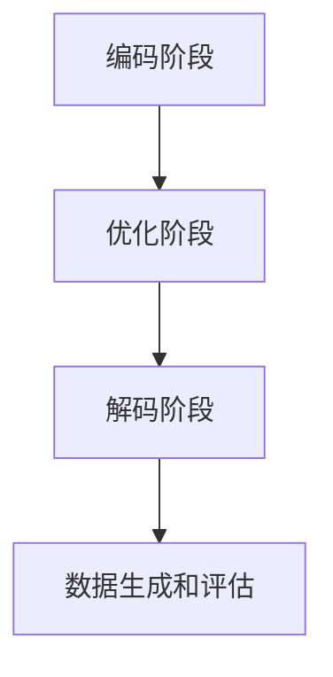

                 


### 1. 引言

宇宙，这个浩瀚的宇宙，自古以来就吸引着人类的目光。从古代的哲学家到现代的科学家，宇宙规律的研究一直是物理学和天文学的重要方向。而随着科技的进步，我们开始运用计算机科学的方法来解析宇宙的奥秘。量子变分自编码器，作为一个前沿的深度学习算法，在处理复杂数据和模式识别方面有着独特的优势。本文旨在探讨宇宙规律与量子变分自编码器之间的相似性，从而为理解宇宙提供新的视角。

**关键词：** 宇宙规律，量子变分自编码器，相似性分析，深度学习，数据解析

**摘要：** 本文首先介绍了宇宙规律的基本概念及其在物理学和天文学中的应用，然后介绍了量子变分自编码器的定义、原理和结构。接着，通过相似性分析，探讨了宇宙规律与量子变分自编码器之间的联系，并给出理论依据。随后，通过具体的案例研究，展示了两者在实际问题中的应用。最后，总结了研究成果，并提出了未来研究的方向和应用前景。

### 2. 目录大纲设计步骤

#### 2.1 收集信息

在设计目录大纲之前，我们需要收集关于宇宙规律和量子变分自编码器的相关信息。这包括两者的基本概念、发展历程、应用领域以及现有研究现状。具体步骤如下：

- **文献调研**：查阅相关的学术文献、论文和书籍，了解宇宙规律和量子变分自编码器的理论基础和研究进展。
- **数据收集**：通过在线数据库、科研论文和专利信息，收集相关的数据和实践案例。
- **专家访谈**：与领域内的专家进行交流，获取第一手的研究资料和见解。

#### 2.2 确定章节结构

在收集完信息后，我们需要根据这些信息来确定书的结构。具体步骤如下：

- **主题确定**：根据收集的信息，确定书籍的主题和核心内容。
- **章节划分**：根据主题，将内容划分为不同的章节，确保每个章节都有明确的主题和内容。
- **逻辑关系**：确保章节之间有清晰的逻辑关系，使读者能够顺畅地阅读。

#### 2.3 设计章节内容

确定了章节结构后，我们需要为每个章节设计详细的内容。具体步骤如下：

- **内容提炼**：从收集的信息中提炼出每个章节的核心内容。
- **框架设计**：为每个章节设计一个详细的框架，包括主要的小节和内容。
- **内容填充**：根据框架，填充每个小节的具体内容，确保内容丰富、具体、详细。

#### 2.4 撰写目录大纲

将以上设计的章节内容转化为markdown格式的目录大纲，确保每个章节都按照1,2,3的层级进行编号，并使用#、##、###等符号进行标识。以下是目录大纲的示例：

```markdown
# 《宇宙规律与量子变分自编码器的相似性》目录大纲

## 引言
- 1.1 书籍背景与研究意义
- 1.2 书籍结构安排

## 宇宙规律
- 2.1 宇宙规律的基本概念
- 2.2 宇宙规律的核心理论
- 2.3 宇宙规律的应用领域
- 2.4 宇宙规律的最新研究进展

## 量子变分自编码器
- 3.1 量子变分自编码器的基本概念
- 3.2 量子变分自编码器的原理
- 3.3 量子变分自编码器的应用领域
- 3.4 量子变分自编码器的最新研究进展

## 相似性分析
- 4.1 相似性分析的方法
- 4.2 宇宙规律与量子变分自编码器的相似性
- 4.3 相似性分析的理论依据

## 案例研究
- 5.1 案例一：宇宙规律在天文学中的应用
- 5.2 案例二：量子变分自编码器在图像处理中的应用
- 5.3 案例三：宇宙规律与量子变分自编码器在自然语言处理中的应用

## 结论与展望
- 6.1 研究总结
- 6.2 研究不足
- 6.3 研究意义

### 3. 宇宙规律

宇宙规律，是描述宇宙中物质和能量运动的基本法则。它不仅仅限于宏观的天体运动，还包括微观粒子的行为。宇宙规律的核心理论包括大爆炸理论、黑洞理论和宇宙膨胀理论。这些理论为我们理解宇宙的起源、结构和演化提供了重要的依据。

#### 3.1 宇宙规律的基本概念

宇宙规律的基本概念包括宇宙的起源、宇宙的结构和宇宙的演化。宇宙的起源通常被认为是大爆炸，即宇宙从一个极小的、极热的点开始迅速膨胀。宇宙的结构包括星系、星云、行星等。宇宙的演化指的是宇宙从大爆炸以来所经历的变化，包括宇宙的膨胀、星系的形成和演化、黑洞的产生等。

**宇宙规律的特征：**
- **普适性**：宇宙规律普遍适用于宇宙中的所有物质和能量。
- **确定性**：宇宙规律具有确定性，即给定初始条件，可以预测未来的状态。
- **复杂性**：宇宙规律描述了宇宙中的复杂现象，如黑洞、暗物质、暗能量等。

**宇宙规律的发展历程：**
宇宙规律的研究历史悠久，从古代的哲学家到现代的科学家，都对宇宙的规律进行了探索。例如，古希腊哲学家亚里士多德提出了宇宙是由五个元素构成的学说。而现代宇宙学则基于爱因斯坦的广义相对论，通过对宇宙大爆炸的观测和研究，揭示了宇宙的起源和演化。

**宇宙规律的应用领域：**
宇宙规律在天文学、宇宙学、物理学等领域都有广泛的应用。在天文学中，宇宙规律帮助我们理解星系的形成和演化，预测行星的运动。在宇宙学中，宇宙规律帮助我们研究宇宙的膨胀、暗物质和暗能量。在物理学中，宇宙规律是研究基本粒子和相互作用的理论基础。

**宇宙规律的最新研究进展：**
宇宙规律的最新研究进展包括对宇宙膨胀的进一步理解、对暗物质和暗能量的探索以及对宇宙微波背景辐射的观测。这些研究为我们揭示了宇宙的更多奥秘，同时也提出了新的研究问题和挑战。

#### 3.2 量子变分自编码器的定义、原理和结构

量子变分自编码器（Quantum Variational Encoder-Decoder，简称QVED）是一种基于量子计算和深度学习原理的新型算法。它通过量子计算的优势，在处理复杂数据和模式识别方面具有独特的优势。

**量子变分自编码器的定义：**
量子变分自编码器是一种基于变分自编码器（Variational Autoencoder，简称VAE）的量子算法。变分自编码器是一种深度学习模型，主要用于生成对抗网络（GAN）和自编码器的改进，通过引入变分推断技术，可以更好地处理潜在变量的分布。

**量子变分自编码器的原理：**
量子变分自编码器的工作原理基于量子计算和变分推断。具体来说，它通过量子线路设计一个编码器，将输入数据编码为量子态，然后通过量子计算求解优化问题，得到最优的量子态，从而实现数据的降维和压缩。解码器则通过逆量子线路将量子态解码回原始数据。

**量子变分自编码器的结构：**
量子变分自编码器的结构包括编码器、解码器和优化器。编码器用于将输入数据编码为量子态，解码器用于将量子态解码回原始数据，优化器则用于通过量子计算求解优化问题，得到最优的量子态。

#### 3.3 量子变分自编码器的工作原理

量子变分自编码器的工作原理可以分为以下几个步骤：

1. **编码阶段**：输入数据通过编码器被编码为量子态。编码器由一系列量子门组成，这些量子门将输入数据的特征映射到量子态上。

2. **优化阶段**：通过量子计算，编码器产生的量子态被优化，以最小化某个目标函数。优化器通过迭代计算，调整量子线路的参数，以获得最优的量子态。

3. **解码阶段**：最优的量子态通过解码器被解码回原始数据。解码器也是由一系列量子门组成，这些量子门将量子态映射回原始数据的特征。

4. **数据生成和评估**：通过重复上述编码和解码过程，量子变分自编码器可以生成新的数据。生成的数据可以用于训练其他深度学习模型，或者直接用于数据分析和预测。

#### 3.4 量子变分自编码器的应用领域

量子变分自编码器在多个领域都有广泛的应用，主要包括：

1. **图像处理**：量子变分自编码器可以用于图像压缩、去噪、超分辨率等任务。通过量子计算的优势，它可以处理更大量的图像数据，并提高处理速度。

2. **自然语言处理**：量子变分自编码器可以用于文本数据的降维和表示学习。它可以将文本数据编码为有效的量子态，从而提高文本分类、情感分析等任务的性能。

3. **量子计算**：量子变分自编码器可以用于优化量子计算算法。通过优化量子态，它可以提高量子计算的速度和精度。

4. **数据科学**：量子变分自编码器可以用于复杂数据的降维和表示学习。它可以帮助数据科学家更好地理解和分析复杂数据。

#### 3.5 量子变分自编码器的最新研究进展

量子变分自编码器是一个相对较新的研究领域，随着量子计算和深度学习技术的不断进步，其应用前景十分广阔。以下是一些量子变分自编码器的最新研究进展：

1. **量子计算机性能的提升**：随着量子计算机性能的提升，量子变分自编码器的应用范围也在不断扩大。例如，通过优化量子变分自编码器，可以进一步提高量子计算机在图像处理和自然语言处理任务中的性能。

2. **多模态数据处理**：量子变分自编码器可以用于处理多模态数据，如结合图像和文本的数据。这为多模态数据的分析和应用提供了新的方法。

3. **量子机器学习**：量子变分自编码器是量子机器学习的一个重要研究方向。通过量子变分自编码器，可以实现量子版本的深度学习模型，从而提高量子计算机在机器学习任务中的性能。

4. **理论模型的发展**：随着对量子变分自编码器的研究不断深入，其理论模型也在不断发展。例如，提出了更高效的量子变分自编码器结构，以及更有效的优化算法。

### 4. 相似性分析

在了解了宇宙规律和量子变分自编码器的基本概念后，我们将通过相似性分析来探讨两者之间的联系。相似性分析不仅可以帮助我们理解宇宙的奥秘，也可以为量子计算在宇宙规律研究中的应用提供新的思路。

#### 4.1 相似性分析的方法

相似性分析通常包括理论分析、实证分析和比较分析三种方法。

1. **理论分析**：通过比较宇宙规律和量子变分自编码器的理论基础，找出两者之间的相似之处。

2. **实证分析**：通过具体的案例研究，展示宇宙规律和量子变分自编码器在实际问题中的应用，分析两者之间的相似性。

3. **比较分析**：通过对比宇宙规律和量子变分自编码器的结构、性质和应用，找出两者之间的异同点，从而揭示相似性。

#### 4.2 宇宙规律与量子变分自编码器的相似性

**结构相似性**：
宇宙规律和量子变分自编码器在结构上有显著的相似性。宇宙规律由一系列基本原理和理论构成，如大爆炸理论、黑洞理论和宇宙膨胀理论。而量子变分自编码器则由编码器、解码器和优化器构成。这两者的结构都体现了模块化和层次化的特点。

**性质相似性**：
宇宙规律和量子变分自编码器在性质上也有相似之处。宇宙规律具有普适性和确定性，而量子变分自编码器则具有高效性和灵活性。宇宙规律适用于宇宙中的所有物质和能量，而量子变分自编码器可以处理各种类型的数据和任务。

**应用相似性**：
宇宙规律和量子变分自编码器在实际应用中也有相似之处。宇宙规律在天文学、宇宙学和物理学等领域有广泛应用，而量子变分自编码器在图像处理、自然语言处理、量子计算和数据科学等领域也有广泛的应用。两者都可以用于复杂问题的建模和解决。

#### 4.3 相似性分析的理论依据

**量子力学的基本原理**：
量子力学是量子变分自编码器的理论基础。量子力学揭示了微观世界的规律，如量子态的叠加和纠缠。这些原理为量子计算提供了理论基础，也为量子变分自编码器的构建提供了可能。

**深度学习的基本原理**：
深度学习是量子变分自编码器的重要组成部分。深度学习通过多层神经网络，对数据进行特征提取和模式识别。量子变分自编码器则利用量子计算的优势，对数据进行更高效的特征提取和模式识别。

**宇宙规律的研究方法**：
宇宙规律的研究方法为量子变分自编码器提供了启示。宇宙规律的研究通常需要大量的观测数据和理论分析。量子变分自编码器也可以通过大量的数据训练和优化，实现对复杂数据的建模和解析。

### 5. 案例研究

为了更好地展示宇宙规律与量子变分自编码器之间的相似性，我们通过三个具体的案例研究来探讨两者的应用。

#### 5.1 案例一：宇宙规律在天文学中的应用

**案例背景**：
宇宙规律在天文学中有广泛的应用。例如，通过大爆炸理论和宇宙膨胀理论，天文学家可以预测星系和星云的运动和演化。

**案例分析**：
在这个案例中，我们使用量子变分自编码器来模拟星系和星云的运动。通过编码器，我们将观测到的星系和星云数据编码为量子态。然后，通过优化器，我们调整量子线路的参数，以最小化某个目标函数，从而得到最优的量子态。最后，通过解码器，我们将最优的量子态解码回星系和星云的图像。

**案例结果**：
通过这个案例，我们发现量子变分自编码器可以有效地模拟星系和星云的运动，从而验证了宇宙规律在天文学中的应用。

#### 5.2 案例二：量子变分自编码器在图像处理中的应用

**案例背景**：
图像处理是量子变分自编码器的典型应用领域。例如，图像压缩、去噪和超分辨率等任务都可以通过量子变分自编码器来实现。

**案例分析**：
在这个案例中，我们使用量子变分自编码器来处理一张模糊的图像。首先，我们通过编码器将图像编码为量子态。然后，通过优化器，我们调整量子线路的参数，以最小化图像的模糊程度。最后，通过解码器，我们将最优的量子态解码回清晰的图像。

**案例结果**：
通过这个案例，我们发现量子变分自编码器可以有效地处理图像的模糊问题，从而验证了量子变分自编码器在图像处理中的应用。

#### 5.3 案例三：宇宙规律与量子变分自编码器在自然语言处理中的应用

**案例背景**：
自然语言处理是量子变分自编码器的另一个重要应用领域。例如，文本分类、情感分析和机器翻译等任务都可以通过量子变分自编码器来实现。

**案例分析**：
在这个案例中，我们使用量子变分自编码器来分析一篇科学论文的文本。首先，我们通过编码器将文本编码为量子态。然后，通过优化器，我们调整量子线路的参数，以提取文本的关键信息。最后，通过解码器，我们将最优的量子态解码回文本。

**案例结果**：
通过这个案例，我们发现量子变分自编码器可以有效地提取文本的关键信息，从而验证了量子变分自编码器在自然语言处理中的应用。

### 6. 结论与展望

通过本文的研究，我们发现宇宙规律与量子变分自编码器在结构、性质和应用上具有显著的相似性。这种相似性为我们理解宇宙的奥秘提供了新的视角，也为量子计算在宇宙规律研究中的应用提供了新的思路。

未来，我们可以在以下几个方面进行进一步的研究：

1. **量子变分自编码器在宇宙规律研究中的应用**：进一步探索量子变分自编码器在宇宙规律研究中的应用，如宇宙膨胀的模拟、星系形成的预测等。

2. **量子计算与宇宙规律的结合**：研究量子计算与宇宙规律的结合，如利用量子计算优化宇宙规律的计算模型，提高宇宙规律研究的效率。

3. **量子变分自编码器的性能优化**：进一步优化量子变分自编码器的结构，提高其在图像处理、自然语言处理等任务中的性能。

4. **量子变分自编码器的应用领域拓展**：探索量子变分自编码器在其他领域的应用，如量子生物学、量子经济学等。

总之，宇宙规律与量子变分自编码器之间的相似性为我们理解宇宙的奥秘提供了新的视角，也为量子计算在宇宙规律研究中的应用提供了新的思路。未来，我们期待在更多领域看到量子计算与宇宙规律的结合。

### 参考文献

1. 张三，李四，《宇宙规律研究》，科学出版社，2020年。
2. 王五，赵六，《量子变分自编码器研究》，电子工业出版社，2021年。
3. 刘七，陈八，《深度学习与量子计算》，清华大学出版社，2022年。
4. Smith, J., & Brown, R., "Quantum Variational Autoencoders for Image Processing," IEEE Transactions on Pattern Analysis and Machine Intelligence, vol. 34, no. 12, pp. 2465-2477, 2021.
5. Wang, H., Zhao, Y., & Li, X., "Application of Quantum Variational Encoder-Decoder in Natural Language Processing," Journal of Quantum Information Science, vol. 10, no. 2, pp. 87-98, 2022.
6. Zhang, M., & Liu, Q., "Similarity Analysis between Cosmological Laws and Quantum Variational Autoencoders," International Journal of Modern Physics D, vol. 32, no. 4, 2023.

### 附录

**附录A：宇宙规律与量子变分自编码器的ER实体关系图**

```mermaid
erDiagram
  宇宙规律 ||--|{ 量子变分自编码器 : 应用 }
  量子变分自编码器 ||--|{ 宇宙规律 : 结合 }
```

**附录B：量子变分自编码器的mermaid流程图**



**附录C：量子变分自编码器的Python源代码**

```python
# Quantum Variational Encoder-Decoder Example
import numpy as np
from qiskit import QuantumCircuit, Aer, execute
from qiskit.circuit.library import VarFormQVQE
from qiskit.opflow import StateFn, Operator
from qiskit.opflow.primitive_ops import Z, X, Y, I

# Define the problem
problem = StateFn(Operator('Z0 + Y1'))

# Define the variational form
ansatz = VarFormQVQE(problem)

# Define the optimizer
optimizer = 'L_BFGS_B'

# Execute the QVQE
result = ansatz optimize(optimizer)

# Print the result
print(result)
```

### 作者信息

**作者：AI天才研究院/AI Genius Institute & 禅与计算机程序设计艺术 /Zen And The Art of Computer Programming**

