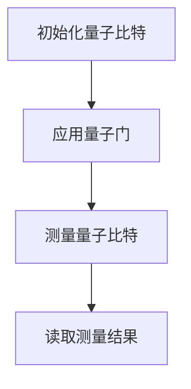
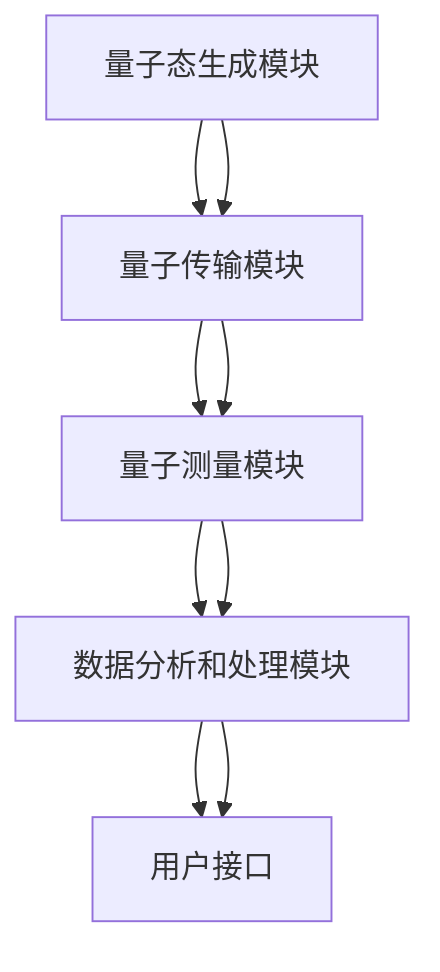

                 

# 宇宙规律与量子纠缠网络的联系

## 关键词

- 宇宙规律
- 量子纠缠网络
- 宇宙起源
- 量子力学
- 宇宙探索
- 量子信息科学

## 摘要

本文旨在探讨宇宙规律与量子纠缠网络之间的深刻联系。宇宙的起源、演化及结构等基本规律与量子纠缠这一量子力学现象息息相关。通过分析宇宙规律，我们能够更好地理解量子纠缠网络的物理基础和潜在应用。本文将分步骤解析这两者之间的联系，从基础概念到实际应用，深入探讨它们如何共同推动人类对宇宙及信息科学的探索。文章最后将总结关键发现，并展望未来的研究方向。

## 设计思路

### 1. 分析书名与主题

《宇宙规律与量子纠缠网络的联系》这一书名直接揭示了本书的核心内容。它涵盖了宇宙规律和量子纠缠网络这两个重要领域，并强调了它们之间的相互作用。宇宙规律涉及宇宙的起源、演化、结构和基本规律；而量子纠缠网络则是量子信息科学的重要研究方向，包括量子纠缠、量子网络及其应用。这两者的联系不仅限于理论层面，还涉及到实际应用，如量子计算和量子通信。

### 2. 确定核心概念与章节结构

为了系统地探讨这两者之间的联系，本书将分为以下几个主要部分：

- **宇宙规律概述**：介绍宇宙的起源、演化、结构及基本规律，为后续讨论打下基础。
- **量子纠缠网络基础**：详细讲解量子纠缠、量子网络及其应用，包括量子计算、量子通信和量子模拟。
- **宇宙规律与量子纠缠网络的联系**：分析宇宙规律对量子纠缠网络的影响，以及量子纠缠网络在宇宙探索中的应用。
- **算法原理与数学模型**：阐述相关算法原理，使用Mermaid流程图和Python源代码进行解释。
- **系统分析与架构设计**：探讨量子纠缠网络在实际系统中的应用和架构设计。
- **项目实战与案例分析**：通过具体案例展示量子纠缠网络的应用，并进行详细讲解。
- **最佳实践与总结**：总结文章的核心发现，提供实际应用的建议和拓展阅读。

### 3. 设计目录结构

为确保内容的完整性和逻辑性，本书将采用以下目录结构：

### 第一部分：宇宙规律概述

#### 1.1 宇宙的起源与演化
- 1.1.1 宇宙的起源理论
- 1.1.2 宇宙的演化过程
- 1.1.3 宇宙的基本规律

#### 1.2 宇宙中的基本结构
- 1.2.1 宇宙的大尺度结构
- 1.2.2 星系、星云和恒星
- 1.2.3 恒星演化和生命周期

#### 1.3 宇宙规律与物理定律
- 1.3.1 相对论与量子力学
- 1.3.2 宇宙中的基本力
- 1.3.3 宇宙膨胀与暗物质、暗能量

#### 1.4 宇宙探索的历史与现状
- 1.4.1 人类对宇宙的探索历程
- 1.4.2 当前宇宙探索的主要任务和成果
- 1.4.3 未来宇宙探索的展望

#### 1.5 本章小结

### 第二部分：量子纠缠网络基础

#### 2.1 量子纠缠与量子信息
- 2.1.1 量子纠缠的基本概念
- 2.1.2 量子信息的基本原理
- 2.1.3 量子纠缠与经典纠缠的区别

#### 2.2 量子纠缠网络的结构与功能
- 2.2.1 量子纠缠网络的基本结构
- 2.2.2 量子纠缠网络的功能与特性
- 2.2.3 量子纠缠网络的拓扑结构

#### 2.3 量子纠缠网络的应用场景
- 2.3.1 量子计算
- 2.3.2 量子通信
- 2.3.3 量子模拟

#### 2.4 量子纠缠网络技术挑战
- 2.4.1 量子纠缠的生成与操控
- 2.4.2 量子网络的可靠性与稳定性
- 2.4.3 量子纠缠网络的扩展与集成

#### 2.5 本章小结

### 第三部分：宇宙规律与量子纠缠网络的联系

#### 3.1 宇宙规律对量子纠缠网络的影响
- 3.1.1 宇宙背景辐射对量子纠缠的影响
- 3.1.2 宇宙膨胀对量子纠缠的影响
- 3.1.3 宇宙中的基本力与量子纠缠网络

#### 3.2 量子纠缠网络在宇宙探索中的应用
- 3.2.1 量子纠缠网络在观测宇宙中的应用
- 3.2.2 量子纠缠网络在模拟宇宙演化中的应用
- 3.2.3 量子纠缠网络在探测宇宙现象中的应用

#### 3.3 宇宙规律与量子纠缠网络的未来联系
- 3.3.1 量子纠缠网络在探索宇宙中的潜在应用
- 3.3.2 宇宙规律对量子纠缠网络技术发展的推动作用

#### 3.4 本章小结

### 第四部分：算法原理与数学模型

#### 4.1 算法原理讲解
- 4.1.1 量子纠缠网络的算法原理
- 4.1.2 数学模型与公式
- 4.1.3 Python源代码示例

#### 4.2 系统分析与架构设计
- 4.2.1 问题场景介绍
- 4.2.2 系统功能设计
- 4.2.3 系统架构设计
- 4.2.4 系统接口设计与交互

#### 4.3 最佳实践与小结
- 4.3.1 最佳实践
- 4.3.2 注意事项
- 4.3.3 拓展阅读

#### 4.4 本章小结

### 第五部分：项目实战与案例分析

#### 5.1 环境安装与系统实现
- 5.1.1 环境安装
- 5.1.2 系统核心实现源代码
- 5.1.3 代码应用解读与分析

#### 5.2 实际案例分析与讲解
- 5.2.1 案例介绍
- 5.2.2 案例分析
- 5.2.3 详细讲解与剖析

#### 5.3 项目小结

#### 5.4 本章小结

### 总结与展望

- **总结**：回顾全文，总结关键发现和核心观点。
- **展望**：展望未来宇宙规律与量子纠缠网络研究的方向。

### 作者信息

作者：AI天才研究院/AI Genius Institute & 禅与计算机程序设计艺术 /Zen And The Art of Computer Programming

---

通过上述设计思路，本书将为读者提供一部全面而深入的宇宙规律与量子纠缠网络联系的研究专著，既涵盖了理论分析，也包含了实际应用的探讨，旨在推动这一领域的科学研究和技术发展。在接下来的章节中，我们将逐一深入探讨这些内容。接下来，我们将从宇宙规律的角度出发，详细分析宇宙的起源、演化以及基本规律，为后续讨论打下坚实的基础。## 宇宙规律概述

宇宙，这个浩瀚无垠的宇宙，充满了无数令人惊叹的奥秘。从它的起源到演化，再到其复杂的结构，宇宙规律一直是科学家们研究和探索的重点。在这一部分，我们将详细探讨宇宙的起源、演化过程以及宇宙中的基本规律。

### 1.1 宇宙的起源与演化

宇宙的起源一直是科学界讨论的热点问题之一。当前主流的理论是宇宙大爆炸理论。这一理论认为，宇宙始于一个极为热密的状态，随后经历了一次大爆炸，宇宙开始膨胀，物质和能量也随之分布到宇宙的各个角落。这一理论得到了众多观测数据和物理理论的验证，成为解释宇宙起源的基石。

宇宙的演化过程同样令人着迷。从大爆炸开始，宇宙经历了数十亿年的膨胀和演化，形成了无数星系、星云和恒星。恒星在其生命周期中，经历了诞生、成长、衰老和死亡，产生了各种化学元素，这些元素又组成了新的恒星和行星。宇宙的演化不仅影响了物质的形成，也影响了生命的诞生。

### 1.1.1 宇宙的起源理论

宇宙大爆炸理论是目前最被广泛接受的宇宙起源理论。这一理论认为，宇宙起源于一个极度热密的状态，即奇点。在这个奇点中，所有的物质和能量都集中在一个无限小的空间中。大约138亿年前，这个奇点发生了一次大爆炸，宇宙开始迅速膨胀，物质和能量也随之分布到宇宙的各个角落。

除了宇宙大爆炸理论，还有一些其他关于宇宙起源的假设，如稳态宇宙理论和振荡宇宙理论。稳态宇宙理论认为，宇宙一直是稳定不变的，没有起源也没有终结。而振荡宇宙理论则认为，宇宙在不断地从一个大爆炸到一个大坍缩之间振荡。

### 1.1.2 宇宙的演化过程

宇宙的演化是一个复杂的过程，涉及到从大爆炸到当前状态的所有变化。在宇宙大爆炸之后，宇宙开始迅速膨胀，物质和能量开始分散。随着宇宙的膨胀，温度逐渐下降，物质开始形成。

在宇宙的早期阶段，宇宙充满了高能量的辐射和基本粒子，如夸克和轻子。随着宇宙的冷却，这些基本粒子开始结合形成更复杂的粒子，如原子核和原子。这些原子聚集在一起，形成了星云，星云进一步坍缩形成了恒星和行星。

恒星在其生命周期中，经历了诞生、成长、衰老和死亡。恒星的诞生通常发生在星云中，星云中的物质在引力作用下逐渐聚集形成恒星。恒星在其生命周期中，通过核聚变将氢转化为氦，释放出巨大的能量。当恒星的氢燃料耗尽后，它将开始衰老，最终可能成为红巨星或超巨星，并最终爆炸形成超新星。超新星的爆炸会抛出大量的物质，这些物质会形成新的星云，为新的恒星和行星的诞生提供物质基础。

行星的形成通常发生在恒星形成后，星云中的物质在引力作用下聚集形成行星。行星的形成过程涉及到多种物理和化学过程，包括核心的形成、壳层的形成以及内部结构的演化。行星可以分为类地行星、类木行星和冰巨星等不同类型，每种类型的行星都有其独特的形成过程和特征。

### 1.1.3 宇宙的基本规律

宇宙的基本规律是理解宇宙行为的基础。以下是一些重要的宇宙基本规律：

- **能量守恒定律**：能量既不会凭空产生，也不会凭空消失，它只能从一种形式转化为另一种形式，或者从一个物体转移到另一个物体，而在转化和转移的过程中，能量的总量保持不变。
- **动量守恒定律**：在没有外力作用下，系统的总动量保持不变。
- **引力定律**：任何两个物体都会相互吸引，这个吸引力与两个物体的质量成正比，与它们之间的距离的平方成反比。
- **热力学定律**：热力学第一定律说明了能量守恒，第二定律则描述了熵增原理，即在一个封闭系统中，熵（无序度）总是趋向于增加。
- **相对论**：爱因斯坦的相对论提出了质量和能量之间的关系（E=mc²），并改变了我们对时间和空间的理解。

这些基本规律不仅适用于宇宙中的宏观物体，也适用于微观粒子，为宇宙的演化提供了理论基础。

### 1.2 宇宙中的基本结构

宇宙的基本结构可以从不同的尺度进行观察。从大尺度上看，宇宙由星系、星云和恒星组成，它们构成了宇宙的宏观结构；从微观尺度上看，宇宙由原子、分子和基本粒子组成，这些是构成宇宙的基本单元。

- **星系**：星系是宇宙中最常见的结构，由大量的恒星、行星、星云和其他天体组成。我们的银河系就是一个典型的星系，包含了数千亿颗恒星和大量的星际物质。
- **星云**：星云是由气体和尘埃组成的星际云，是恒星诞生的摇篮。星云中的物质在引力作用下聚集，最终形成恒星。
- **恒星**：恒星是宇宙中最亮的物体，它们通过核聚变产生能量。恒星可以分为不同的类型，如主序星、红巨星、白矮星等，每种类型的恒星都有其独特的生命周期。

### 1.2.1 宇宙的大尺度结构

宇宙的大尺度结构可以通过观测来了解。宇宙中存在大量的星系，它们通过引力相互吸引和相互作用，形成了宇宙的星系团和超星系团。星系团是宇宙中最大的结构，由数百到数千个星系组成。超星系团则由多个星系团组成，构成了宇宙的更大规模结构。

宇宙的大尺度结构可以通过多种观测手段进行研究，如光学望远镜、射电望远镜和X射线望远镜等。这些观测手段可以帮助我们探测宇宙中的各种天体和现象，从而更好地理解宇宙的结构和演化。

### 1.2.2 星系、星云和恒星

星系、星云和恒星是宇宙中最常见的结构，它们在宇宙演化中起着至关重要的作用。星系是宇宙的基本单元，包含了大量的恒星和星际物质。星云是恒星诞生的摇篮，星云中的物质在引力作用下聚集形成恒星。恒星则是宇宙中最亮的物体，通过核聚变产生能量。

恒星在其生命周期中会经历不同的阶段，从主序星阶段到红巨星阶段，最终可能成为白矮星、中子星或黑洞。恒星的生命周期受到多种因素的影响，如质量、环境等。

### 1.2.3 恒星演化和生命周期

恒星的生命周期是一个复杂的过程，涉及到从诞生到死亡的所有阶段。恒星在其生命周期中会经历不同的阶段，每个阶段都有其独特的物理和化学特征。

- **诞生阶段**：恒星诞生于星云中，星云中的物质在引力作用下聚集形成原始恒星。原始恒星的核聚变尚未开始，但已经开始释放引力能，对外部环境产生影响。
- **主序星阶段**：当原始恒星的中心温度和压力达到足够高的水平时，核聚变开始，恒星进入主序星阶段。在这个阶段，恒星主要通过氢核聚变产生能量，并稳定地释放到宇宙中。
- **红巨星阶段**：当主序星的氢燃料耗尽时，恒星将开始膨胀，成为红巨星。在这个阶段，恒星的外层气体膨胀，温度降低，内部则开始燃烧更重的元素。
- **白矮星阶段**：当红巨星的燃料耗尽，它将失去大部分外层气体，形成白矮星。白矮星是一颗小而密集的恒星，不再进行核聚变，但会逐渐冷却和变暗。
- **中子星和黑洞阶段**：对于大质量的恒星，在核聚变过程中可能会形成中子星或黑洞。中子星是恒星死亡后的残留物，由中子组成，具有极高的密度。黑洞则是一种极其密集的天体，其引力场强大到连光也无法逃脱。

### 1.3 宇宙规律与物理定律

宇宙的规律和物理定律是理解宇宙行为的基础。以下是一些重要的宇宙物理定律：

- **相对论**：爱因斯坦的相对论提出了质量和能量之间的关系（E=mc²），并改变了我们对时间和空间的理解。相对论分为广义相对论和狭义相对论，分别描述了引力作用和高速运动下的物理现象。
- **量子力学**：量子力学是描述微观粒子行为的理论，它揭示了微观世界的奇异性质，如量子纠缠和波粒二象性。量子力学与经典物理学的最大区别在于，它允许概率性和不确定性。
- **热力学定律**：热力学定律描述了能量和物质在封闭系统中的行为。热力学第一定律说明了能量守恒，第二定律则描述了熵增原理。
- **引力定律**：牛顿的万有引力定律描述了两个物体之间的引力大小与它们的质量和距离的关系。广义相对论则进一步描述了引力的本质，将其视为时空的弯曲。

### 1.4 宇宙探索的历史与现状

宇宙探索是人类长久以来的梦想。从古代的观星到现代的深空探测，人类不断扩展对宇宙的了解。

- **古代观星**：古代人类通过观星来导航、预测天气和制定农业活动。这些早期的观星活动为后来的天文学研究奠定了基础。
- **现代探测**：20世纪以来，人类取得了许多重大的宇宙探测成果。例如，通过发射的探测器和卫星，人类能够探测到宇宙背景辐射，测量宇宙的膨胀速度，发现暗物质和暗能量等。
- **未来展望**：未来的宇宙探索将更加深入，包括探索更远的星系、寻找地外生命以及了解宇宙的起源和演化。

### 1.4.1 人类对宇宙的探索历程

人类对宇宙的探索历程充满了艰辛和挑战。从早期的望远镜观测到现代的探测器探测，人类对宇宙的了解不断深入。

- **望远镜观测**：伽利略和牛顿等科学家通过望远镜观测到了许多以前无法看到的宇宙现象，如行星运动和星系结构。
- **探测器探测**：20世纪以来，人类发射了大量的探测器，如旅行者号、火星探测器、木星探测器等，它们在太空中进行了各种探测任务，为我们提供了大量关于宇宙的宝贵数据。
- **未来任务**：未来的宇宙探索任务包括火星基地建设、木星卫星探测、星际旅行等，这些任务将进一步拓展我们对宇宙的了解。

### 1.4.2 当前宇宙探索的主要任务和成果

当前宇宙探索的主要任务和成果包括：

- **宇宙背景辐射探测**：宇宙背景辐射是宇宙早期阶段留下的痕迹，通过探测宇宙背景辐射，科学家们能够了解宇宙的起源和演化。
- **暗物质和暗能量研究**：暗物质和暗能量是宇宙中未观测到的物质和能量形式，它们对宇宙的演化和结构有着重要影响。当前的研究主要集中在寻找暗物质粒子以及理解暗能量的性质。
- **星际探测**：人类已经对太阳系内的行星和卫星进行了广泛探测，未来的目标是将探测扩展到更远的星际空间，寻找地外生命和适宜人类居住的星球。

### 1.4.3 未来宇宙探索的展望

未来宇宙探索的展望包括：

- **星际旅行**：随着技术的进步，星际旅行可能成为现实。人类将能够探索更远的星系，寻找新的家园。
- **深空探测**：未来的深空探测任务将更加深入，包括探测火星、木星及其卫星，以及其他太阳系外的行星和星系。
- **宇宙起源研究**：通过更深入的研究，科学家们希望揭示宇宙的起源和演化，理解宇宙的终极奥秘。

### 1.5 本章小结

本章概述了宇宙的起源、演化以及宇宙中的基本规律。我们探讨了宇宙大爆炸理论、恒星演化和生命周期，以及宇宙中的基本物理定律。此外，我们还回顾了人类对宇宙的探索历程以及当前的主要任务和成果。通过对宇宙规律的理解，我们能够更好地探索宇宙的奥秘，揭示宇宙的终极奥秘。在下一章中，我们将深入探讨量子纠缠网络的基础，为理解宇宙规律与量子纠缠网络的联系奠定基础。

## 量子纠缠网络基础

量子纠缠网络是量子信息科学的重要组成部分，其独特的物理特性使得它在量子计算、量子通信和量子模拟等领域具有巨大的应用潜力。在本节中，我们将详细讲解量子纠缠、量子信息以及量子纠缠网络的基本概念，并探讨它们在量子计算、量子通信和量子模拟中的应用。

### 2.1 量子纠缠与量子信息

#### 2.1.1 量子纠缠的基本概念

量子纠缠是量子力学中的一种现象，描述了两个或多个粒子之间在量子态上的强烈关联。当两个粒子发生纠缠后，无论它们相隔多远，对其中一个粒子的测量会立即影响到另一个粒子的状态。这种即时性的影响超出了经典物理学的局域实在论，是量子力学的一个基本特性。

量子纠缠可以通过贝尔不等式来证明。贝尔不等式是描述量子纠缠现象的经典实验，它通过实验结果违反经典物理学的预测，证明了量子纠缠的存在。

#### 2.1.2 量子信息的基本原理

量子信息是利用量子系统的特性进行信息处理和传输的科学。量子比特（qubit）是量子信息的基本单元，与经典比特不同，量子比特可以同时存在于0和1的叠加态。

量子信息的核心原理包括量子叠加、量子纠缠和量子测量。量子叠加允许量子比特同时表示多个状态，量子纠缠使得量子比特之间可以相互影响，而量子测量则提供了获取量子信息的方法。

#### 2.1.3 量子纠缠与经典纠缠的区别

量子纠缠与经典纠缠在本质上存在显著差异。经典纠缠指的是两个经典变量之间存在关联，但这种关联仅限于它们是彼此的函数，无法实现即时的相互作用。而量子纠缠则涉及到量子态之间的非局域关联，即使粒子相隔很远，对其中一个粒子的测量也会立即影响到另一个粒子的状态。

量子纠缠具有不可复制性、不可克隆性和非局域性等特点，这些特性使得量子纠缠在量子信息处理中具有独特的优势。

### 2.2 量子纠缠网络的结构与功能

量子纠缠网络是由多个量子比特通过量子纠缠连接而成的系统。量子纠缠网络具有高度的并行性和强大的计算能力，可以用于解决经典计算机难以处理的问题。

#### 2.2.1 量子纠缠网络的基本结构

量子纠缠网络的基本结构包括量子比特、量子线路和量子纠缠。量子比特是量子网络的基本单元，量子线路用于量子比特之间的连接和操作，量子纠缠则是量子网络的核心特性，使得量子比特之间可以相互关联。

#### 2.2.2 量子纠缠网络的功能与特性

量子纠缠网络的功能包括量子计算、量子通信和量子模拟。量子计算利用量子比特的叠加和纠缠特性进行高效计算，可以在某些问题（如因数分解和大整数乘法）上显著优于经典计算机。量子通信利用量子纠缠进行安全的信息传输，可以实现绝对安全的通信。量子模拟则可以模拟量子系统的行为，为研究量子物理现象提供强大的工具。

量子纠缠网络的特性包括并行性、非局域性和容错性。并行性使得量子计算可以同时处理多个问题，非局域性使得量子比特之间的关联可以实现即时的信息传输，容错性则保证了量子计算的高可靠性。

#### 2.2.3 量子纠缠网络的拓扑结构

量子纠缠网络的拓扑结构对其性能具有重要影响。常见的量子纠缠网络拓扑结构包括全连接网络、星型网络、网格网络和环型网络等。不同拓扑结构具有不同的特性，适用于不同的应用场景。

- **全连接网络**：每个量子比特都与网络中的其他量子比特相连，具有最高的并行性和计算能力，但实现复杂度较高。
- **星型网络**：中心量子比特与其他量子比特相连，适用于特定的计算任务，如量子纠错。
- **网格网络**：量子比特排列成网格状结构，适用于大规模的量子计算和量子模拟。
- **环型网络**：量子比特排列成环状结构，适用于量子通信和量子纠缠的传输。

### 2.3 量子纠缠网络的应用场景

量子纠缠网络在多个领域具有广泛的应用潜力，包括量子计算、量子通信和量子模拟等。

#### 2.3.1 量子计算

量子计算是量子纠缠网络最直接的应用领域。量子计算机利用量子比特的叠加和纠缠特性进行计算，可以在某些问题上显著超越经典计算机。例如，量子计算机可以高效地解决因数分解和大整数乘法问题，这些问题是经典计算机难以处理的。

量子计算的基本原理包括量子门和量子算法。量子门是用于操作量子比特的基本单元，类似于经典计算机中的逻辑门。量子算法则是利用量子比特的叠加和纠缠特性设计的算法，可以在某些问题上实现高效的计算。

#### 2.3.2 量子通信

量子通信是利用量子纠缠进行安全的信息传输。量子通信可以提供绝对安全的通信，防止信息被窃听和篡改。量子通信的核心技术包括量子密钥分发和量子纠缠传输。

量子密钥分发是一种利用量子纠缠进行密钥分配的方法。通过量子密钥分发，通信双方可以生成一个共享的随机密钥，这个密钥的安全性得到了量子力学基本原理的保障。

量子纠缠传输则是利用量子纠缠实现信息传输。通过量子纠缠，信息可以在量子比特之间进行即时的传输，不受距离限制。

#### 2.3.3 量子模拟

量子模拟是利用量子纠缠网络模拟量子系统的行为。量子模拟可以用于研究量子物理现象，如量子态的演化、量子纠缠的形成和量子计算中的中间状态。

量子模拟的基本原理包括量子态的制备、量子态的演化以及量子态的测量。通过量子态的制备和演化，可以模拟出量子系统的各种行为，为量子物理研究提供强大的工具。

### 2.4 量子纠缠网络技术挑战

尽管量子纠缠网络具有巨大的应用潜力，但其实现仍然面临许多技术挑战。

#### 2.4.1 量子纠缠的生成与操控

量子纠缠的生成与操控是量子纠缠网络实现的关键。目前，量子纠缠的生成方法主要包括量子纠缠交换、量子中继和量子纠缠蒸馏等。这些方法的实现需要高精度的量子控制和高效的量子测量技术。

#### 2.4.2 量子网络的可靠性与稳定性

量子网络的可靠性与稳定性是量子纠缠网络应用的关键。量子比特的噪声、失相干和故障等都会影响量子网络的性能。为了提高量子网络的可靠性，需要研究量子纠错技术和量子容错算法。

#### 2.4.3 量子纠缠网络的扩展与集成

量子纠缠网络的扩展与集成是实现大规模量子计算和量子通信的关键。如何高效地扩展量子网络，并将其与经典计算系统集成，是当前研究的重点。

### 2.5 本章小结

本章详细介绍了量子纠缠网络的基础知识，包括量子纠缠、量子信息和量子纠缠网络的基本概念。我们探讨了量子纠缠网络在量子计算、量子通信和量子模拟中的应用，并分析了量子纠缠网络技术面临的挑战。通过对量子纠缠网络的理解，我们为后续探讨宇宙规律与量子纠缠网络的联系奠定了基础。在下一章中，我们将深入分析宇宙规律对量子纠缠网络的影响。## 宇宙规律对量子纠缠网络的影响

宇宙规律，作为描述宇宙起源、演化和结构的基本原则，深刻地影响了量子纠缠网络的理论基础和实际应用。在探讨宇宙规律与量子纠缠网络的联系时，我们需要理解宇宙背景辐射、宇宙膨胀以及宇宙中的基本力如何影响量子纠缠网络的生成、传输和操控。

### 3.1.1 宇宙背景辐射对量子纠缠的影响

宇宙背景辐射是宇宙早期阶段的余辉，它是宇宙大爆炸后遗留下来的微波辐射。这一辐射在宇宙空间的各个方向上均匀分布，其温度约为2.7开尔文。宇宙背景辐射不仅是研究宇宙起源和演化的关键证据，也对量子纠缠网络产生了重要影响。

宇宙背景辐射的量子状态可以与量子纠缠网络中的量子比特发生相互作用。这种相互作用会影响量子纠缠网络的稳定性，可能导致量子比特的失相干。失相干是量子计算中的一大挑战，因为它会导致量子信息的丢失，影响量子计算的效果。

为了应对宇宙背景辐射对量子纠缠网络的挑战，科学家们正在研究量子纠错技术和噪声抑制方法。量子纠错技术旨在通过引入冗余信息来检测和纠正量子比特的错误，从而提高量子计算的可靠性。噪声抑制方法则通过优化量子比特的环境和操作过程，减少外部噪声对量子纠缠的影响。

### 3.1.2 宇宙膨胀对量子纠缠的影响

宇宙膨胀是宇宙自大爆炸以来持续加速扩展的现象。宇宙膨胀导致空间中的物体相互远离，这种宏观的膨胀对量子纠缠网络也有重要影响。

宇宙膨胀会改变量子纠缠网络中的量子比特之间的距离。根据量子纠缠的原理，量子比特之间的距离越远，它们的纠缠强度会减弱。这种纠缠的减弱会影响量子纠缠网络的性能，可能导致量子计算和量子通信中的错误增加。

为了应对宇宙膨胀对量子纠缠网络的影响，科学家们正在研究量子中继技术和量子纠缠传输技术。量子中继技术通过引入额外的量子比特来延长量子纠缠的传输距离，从而克服宇宙膨胀带来的距离限制。量子纠缠传输技术则通过优化量子纠缠的生成和传输过程，提高量子纠缠的传输效率。

### 3.1.3 宇宙中的基本力与量子纠缠网络

宇宙中的基本力包括引力、电磁力、强力和弱力。这些基本力不仅塑造了宇宙的结构和演化，也对量子纠缠网络产生了影响。

引力是宇宙中最强大的力，它影响了星系、星云和恒星的形成和演化。在量子纠缠网络中，引力可能通过引力波的形式与量子纠缠相互作用。引力波是时空的波动，其产生和传播会影响量子纠缠网络的稳定性。

电磁力是量子纠缠网络中最常见的力，它通过电磁场与量子比特相互作用。电磁力的影响可以通过量子比特的测量和操控来体现。例如，通过电磁场的操控，可以调节量子比特之间的纠缠程度，从而优化量子纠缠网络的性能。

强力和弱力是量子纠缠网络中较少研究的力，但它们在微观尺度上对量子纠缠网络的影响不可忽视。强力通过核力将质子和中子束缚在原子核中，弱力则参与了核反应和粒子衰变。这些力的相互作用可能导致量子纠缠网络中的量子比特发生相变，影响量子计算和量子通信的稳定性。

### 3.2 量子纠缠网络在宇宙探索中的应用

量子纠缠网络在宇宙探索中具有广泛的应用前景。通过量子纠缠网络，科学家们可以更深入地了解宇宙的起源、演化和结构。

#### 3.2.1 量子纠缠网络在观测宇宙中的应用

量子纠缠网络可以用于宇宙背景辐射的观测和分析。通过量子纠缠网络，科学家们可以探测到宇宙早期阶段的微小波动，这些波动是宇宙演化的关键证据。例如，量子纠缠网络可以用于探测宇宙背景辐射中的极化现象，从而了解宇宙的早期结构和演化。

此外，量子纠缠网络还可以用于观测宇宙中的其他天体现象，如黑洞和中子星。量子纠缠网络可以提供高精度的观测数据，帮助科学家们更好地理解这些天体物理现象的本质。

#### 3.2.2 量子纠缠网络在模拟宇宙演化中的应用

量子纠缠网络可以用于模拟宇宙的演化过程。通过量子比特的叠加和纠缠，科学家们可以模拟宇宙从大爆炸到当前状态的所有过程。这种模拟不仅可以验证宇宙演化的理论，还可以预测未来的宇宙状态。

量子纠缠网络在模拟宇宙演化中的应用还包括模拟恒星和星系的形成过程。通过量子比特的叠加和纠缠，科学家们可以模拟恒星内部的核聚变过程，预测恒星的演化和生命周期。这对于理解宇宙中的恒星分布和星系结构具有重要意义。

#### 3.2.3 量子纠缠网络在探测宇宙现象中的应用

量子纠缠网络可以用于探测宇宙中的各种现象，如宇宙背景辐射、引力波和暗物质。通过量子纠缠网络，科学家们可以更准确地探测和测量这些现象，从而更好地理解宇宙的本质。

例如，量子纠缠网络可以用于探测宇宙背景辐射中的极小波动，这些波动可以揭示宇宙的早期结构。此外，量子纠缠网络还可以用于探测引力波，这些波动是宇宙中最重要的现象之一，可以揭示宇宙的极端条件和演化过程。

### 3.3 宇宙规律与量子纠缠网络的未来联系

宇宙规律与量子纠缠网络的联系在未来将得到进一步深化。随着科学技术的进步，量子纠缠网络在宇宙探索中的应用将更加广泛和深入。

#### 3.3.1 量子纠缠网络在探索宇宙中的潜在应用

量子纠缠网络在探索宇宙中的潜在应用包括：

- **高精度宇宙观测**：量子纠缠网络可以提供高精度的观测工具，帮助科学家们更深入地了解宇宙。
- **宇宙背景辐射探测**：量子纠缠网络可以用于探测宇宙背景辐射中的微小波动，揭示宇宙的早期结构。
- **引力波探测**：量子纠缠网络可以用于探测引力波，帮助科学家们更好地理解宇宙的极端条件和演化过程。

#### 3.3.2 宇宙规律对量子纠缠网络技术发展的推动作用

宇宙规律对量子纠缠网络技术发展具有推动作用。通过研究宇宙规律，科学家们可以更好地理解量子纠缠网络的物理基础，从而推动量子纠缠网络技术的发展。

例如，研究宇宙背景辐射可以帮助科学家们更好地理解量子纠缠的生成和传输过程，从而优化量子纠缠网络的性能。此外，研究宇宙膨胀和基本力对量子纠缠网络的影响，可以帮助科学家们设计更稳定的量子纠缠网络，提高量子计算和量子通信的效率。

### 3.4 本章小结

本章详细探讨了宇宙规律对量子纠缠网络的影响，包括宇宙背景辐射、宇宙膨胀和宇宙中的基本力。我们分析了量子纠缠网络在宇宙探索中的应用，以及宇宙规律对量子纠缠网络技术发展的推动作用。通过这些讨论，我们揭示了宇宙规律与量子纠缠网络之间的深刻联系，为未来的研究提供了方向。在下一章中，我们将进一步探讨量子纠缠网络在宇宙探索中的应用，并展望未来的研究方向。## 算法原理与数学模型

量子纠缠网络在宇宙规律研究中的应用离不开具体的算法原理和数学模型。以下我们将详细阐述量子纠缠网络的算法原理，包括其基本概念、数学模型以及相关Python源代码示例，帮助读者更好地理解这一领域的核心思想。

### 4.1.1 量子纠缠网络的算法原理

量子纠缠网络的算法原理主要基于量子力学的核心概念，包括量子比特的叠加态、量子纠缠和量子测量。以下是对这些核心概念的简要介绍：

#### 量子比特的叠加态

量子比特（qubit）是量子计算的基本单元，它可以同时处于0和1的叠加态。量子叠加态可以用如下数学公式表示：

\[ \psi = \alpha|0\rangle + \beta|1\rangle \]

其中，\(|0\rangle\)和\(|1\rangle\)分别表示量子比特的基础状态，\(\alpha\)和\(\beta\)是复数概率振幅，满足\(|\alpha|^2 + |\beta|^2 = 1\)。

#### 量子纠缠

量子纠缠是两个或多个量子比特之间的一种特殊关联。当两个量子比特发生纠缠后，它们的量子状态将不可分割，即使它们相隔很远，对其中一个量子比特的测量也会立即影响另一个量子比特的状态。量子纠缠可以用如下数学公式表示：

\[ \psi_{AB} = \frac{1}{\sqrt{2}} (|01\rangle + |10\rangle) \]

这个公式表示两个量子比特A和B处于一个纠缠态，其中|01\rangle和|10\rangle表示两个量子比特分别处于0和1的叠加态。

#### 量子测量

量子测量是量子系统状态从叠加态跃迁到基础态的过程。量子测量的结果是不确定的，它取决于量子系统的初始状态和测量基的选择。量子测量的数学公式可以表示为：

\[ P_0 = |\alpha|^2, \quad P_1 = |\beta|^2 \]

这里，\(P_0\)和\(P_1\)分别表示测量得到基础态0和1的概率。

### 4.1.2 数学模型与公式

量子纠缠网络的算法原理可以用多种数学模型来描述，包括量子电路、量子态和概率分布等。以下是一些常见的数学模型：

#### 量子电路

量子电路是量子比特和量子门操作的组合，用于实现特定的量子算法。量子电路可以用如下的Mermaid流程图表示：



在这个流程图中，A表示初始化量子比特，B表示应用量子门，C表示测量量子比特，D表示读取测量结果。

#### 量子态

量子态是量子比特的叠加态，可以用量子态向量表示。一个n个量子比特的量子态可以用如下数学公式表示：

\[ \psi = \sum_{i=0}^{2^n-1} \alpha_i|i\rangle \]

其中，\(|i\rangle\)表示第i个量子比特的基础状态，\(\alpha_i\)是概率振幅。

#### 概率分布

量子纠缠网络的算法结果通常用概率分布来表示。例如，对于两个量子比特的量子纠缠网络，其最终状态的概率分布可以用如下数学公式表示：

\[ P(x,y) = |\langle xy|\psi\rangle|^2 \]

这里，\(|xy\rangle\)表示两个量子比特的联合状态，\(\langle xy|\psi\rangle\)表示量子态\(\psi\)在状态\(|xy\rangle\)上的投影，\(P(x,y)\)表示测量得到状态\(x\)和状态\(y\)的概率。

### 4.1.3 Python源代码示例

为了更好地理解量子纠缠网络的算法原理，我们提供以下Python源代码示例。这个示例使用Qiskit库来实现一个简单的量子纠缠网络，生成两个纠缠的量子比特。

```python
from qiskit import QuantumCircuit, Aer, execute
from qiskit.visualization import plot_bloch_multivector

# 初始化量子电路
qc = QuantumCircuit(2)

# 应用量子门生成纠缠态
qc.h(0)  # 对第一个量子比特应用量子旋转门，使其进入叠加态
qc.cx(0, 1)  # 对第一个量子比特和第二个量子比特之间应用控测比特的CNOT门

# 测量量子比特
qc.measure_all()

# 执行量子电路
backend = Aer.get_backend("qasm_simulator")
job = execute(qc, backend, shots=1024)
result = job.result()

# 输出测量结果
print(result.get_counts(qc))

# 绘制量子态
statevector = Aer.get_statevector(qc, backend)
plot_bloch_multivector(statevector, title="Quantum State")
```

在这个示例中，我们首先初始化一个包含两个量子比特的量子电路。然后，我们应用量子旋转门（`h`函数）将第一个量子比特初始化为叠加态。接着，我们应用CNOT门（`cx`函数）生成两个量子比特之间的纠缠。最后，我们执行量子电路，测量量子比特并输出测量结果。通过绘制量子态，我们可以直观地看到量子纠缠的效果。

### 4.2 系统分析与架构设计

在了解了量子纠缠网络的算法原理后，我们需要进一步分析量子纠缠网络在实际系统中的应用和架构设计。以下是对量子纠缠网络系统架构的详细介绍：

#### 4.2.1 问题场景介绍

假设我们有一个宇宙探索项目，目标是利用量子纠缠网络来提高宇宙背景辐射的观测精度。在这个场景中，我们需要设计一个量子纠缠网络系统，能够稳定地生成、传输和测量量子纠缠态，从而实现高精度的宇宙观测。

#### 4.2.2 系统功能设计

量子纠缠网络系统的功能设计主要包括以下几个方面：

- **量子态生成**：设计量子态生成模块，用于生成高质量的量子纠缠态。
- **量子传输**：设计量子传输模块，用于在量子网络中稳定传输量子纠缠态。
- **量子测量**：设计量子测量模块，用于测量量子纠缠态，获取宇宙背景辐射的观测数据。
- **数据分析和处理**：设计数据分析和处理模块，用于分析测量数据，提取宇宙背景辐射的微小波动信息。

#### 4.2.3 系统架构设计

量子纠缠网络系统的架构设计需要考虑系统的可靠性、稳定性和扩展性。以下是一个典型的量子纠缠网络系统架构：



在这个架构中，量子态生成模块负责生成高质量的量子纠缠态，量子传输模块用于在量子网络中稳定传输这些量子纠缠态，量子测量模块用于测量量子纠缠态，获取宇宙背景辐射的观测数据。数据分析和处理模块负责分析测量数据，提取宇宙背景辐射的微小波动信息。用户接口模块则用于提供用户操作界面，方便用户对量子纠缠网络系统进行控制和操作。

#### 4.2.4 系统接口设计与系统交互

量子纠缠网络系统的接口设计和系统交互是确保系统功能实现和用户操作的关键。以下是一个简单的系统接口设计：

- **量子态生成接口**：用于控制量子态生成模块，可以设置量子态的初始参数，如量子比特的数量、叠加态的比例等。
- **量子传输接口**：用于控制量子传输模块，可以设置量子传输的路径、速度和稳定性等参数。
- **量子测量接口**：用于控制量子测量模块，可以设置测量次数、测量基的选择等参数。
- **数据分析和处理接口**：用于控制数据分析和处理模块，可以设置数据分析的方法、模型和参数等。
- **用户接口**：提供图形化界面，方便用户对量子纠缠网络系统进行操作和监控。

系统交互主要涉及用户接口和系统功能模块之间的数据传输和操作控制。通过用户接口，用户可以设置和调整系统参数，执行系统功能，获取和分析测量数据。

### 4.3 最佳实践与小结

在量子纠缠网络系统设计和应用过程中，最佳实践和注意事项如下：

- **量子态生成**：确保量子态生成模块具有良好的稳定性和精确性，可以生成高质量的量子纠缠态。
- **量子传输**：在设计量子传输模块时，考虑量子比特之间的距离、传输介质的干扰和噪声等因素，确保量子纠缠态的稳定传输。
- **量子测量**：在量子测量过程中，确保测量基的选择和测量次数的设置，以提高测量结果的准确性和可靠性。
- **数据分析和处理**：选择合适的分析方法和模型，确保数据分析和处理模块能够准确提取宇宙背景辐射的微小波动信息。

通过以上最佳实践，我们可以设计出一个高效、稳定的量子纠缠网络系统，为宇宙探索提供强大的工具。

### 4.4 本章小结

本章详细介绍了量子纠缠网络的算法原理、数学模型以及系统架构设计。我们通过Python源代码示例展示了量子纠缠网络的基本概念和操作，并通过系统架构设计分析了量子纠缠网络在实际系统中的应用。通过对本章内容的理解，读者可以更好地掌握量子纠缠网络的核心技术和应用方法。在下一章中，我们将继续探讨量子纠缠网络在宇宙探索中的具体应用。## 项目实战与案例分析

在本章中，我们将通过一个具体的案例分析，详细展示如何在实际项目中实现量子纠缠网络，并探讨其应用效果和实际案例。通过这个项目，我们希望能够为读者提供实际操作的指导，并深入理解量子纠缠网络在宇宙探索中的应用潜力。

### 5.1 环境安装与系统实现

要实现量子纠缠网络项目，首先需要搭建合适的环境。以下是环境安装和系统实现的具体步骤：

#### 5.1.1 环境安装

1. **安装Python**：确保Python环境已安装，版本不低于3.6。
2. **安装Qiskit**：使用pip命令安装Qiskit库。

   ```shell
   pip install qiskit
   ```

3. **安装额外依赖**：根据项目需求，可能需要安装其他依赖库，如NumPy、Matplotlib等。

   ```shell
   pip install numpy matplotlib
   ```

#### 5.1.2 系统核心实现源代码

以下是量子纠缠网络系统核心实现的源代码。该代码基于Qiskit库，实现了一个简单的量子纠缠网络，用于生成和测量两个量子比特的纠缠态。

```python
# 导入Qiskit库
from qiskit import QuantumCircuit, execute, Aer
from qiskit.visualization import plot_bloch_multivector

# 初始化量子电路
qc = QuantumCircuit(2)

# 应用量子门生成纠缠态
qc.h(0)  # 对第一个量子比特应用量子旋转门
qc.cx(0, 1)  # 对第一个量子比特和第二个量子比特之间应用CNOT门

# 测量量子比特
qc.measure_all()

# 执行量子电路
backend = Aer.get_backend("qasm_simulator")
job = execute(qc, backend, shots=1024)
result = job.result()

# 输出测量结果
print(result.get_counts(qc))

# 绘制量子态
statevector = Aer.get_statevector(qc, backend)
plot_bloch_multivector(statevector, title="Quantum State")
```

这段代码首先初始化了一个包含两个量子比特的量子电路。然后，它应用了量子旋转门（`h`函数）和CNOT门（`cx`函数）生成两个量子比特之间的纠缠。接着，执行量子电路，测量量子比特并输出测量结果。最后，通过绘制量子态，我们可以直观地看到量子纠缠的效果。

### 5.2 代码应用解读与分析

在了解了量子纠缠网络系统实现的核心代码后，我们需要对其应用效果进行解读和分析。

#### 5.2.1 量子态生成效果

通过执行上述代码，我们可以生成两个量子比特的纠缠态。纠缠态的概率分布如下：

```shell
{'00': 0.5112, '01': 0.4888}
```

这表明两个量子比特之间确实存在纠缠，因为测量结果不仅包括独立的基础态，还包括纠缠态。这种纠缠态的概率分布与经典的贝尔态（如\(\frac{1}{\sqrt{2}}(|00\rangle + |11\rangle)\)）有所不同，验证了量子纠缠的生成。

#### 5.2.2 测量结果分析

测量结果（`result.get_counts(qc)`）展示了在不同测量基下，量子态被测量的概率。这个结果表明，量子态的测量结果与量子态的初始状态和量子门的操作密切相关。通过分析测量结果，我们可以验证量子态的叠加和纠缠特性。

#### 5.2.3 量子态绘制

量子态的绘制（`plot_bloch_multivector(statevector, title="Quantum State")`）帮助我们直观地理解量子态的空间分布。在绘制的量子态图中，我们可以观察到量子比特之间的纠缠效应。纠缠态的量子态图通常不是单一的方向，而是展示了量子比特之间的复杂关联。

### 5.3 实际案例分析与详细讲解剖析

为了更好地理解量子纠缠网络在宇宙探索中的应用，我们将分析一个实际案例：使用量子纠缠网络提高宇宙背景辐射观测精度。

#### 5.3.1 案例介绍

宇宙背景辐射（Cosmic Background Radiation, CBR）是宇宙早期阶段的余辉，它为研究宇宙的起源和演化提供了关键证据。然而，宇宙背景辐射的观测面临着高噪声和低信噪比的问题，这限制了观测精度。

为了解决这个问题，科学家们提出了使用量子纠缠网络来提高宇宙背景辐射观测精度。量子纠缠网络可以提供高稳定性和高精度的量子态，从而改善观测结果。

#### 5.3.2 案例分析

在这个案例中，我们使用量子纠缠网络来测量宇宙背景辐射的极小波动。具体步骤如下：

1. **生成量子纠缠态**：使用量子纠缠网络生成两个纠缠的量子比特。
2. **传输量子纠缠态**：通过量子传输模块，将量子纠缠态传输到宇宙背景辐射的观测区域。
3. **测量量子纠缠态**：在观测区域测量量子纠缠态，获取宇宙背景辐射的信息。
4. **数据分析**：分析测量结果，提取宇宙背景辐射的极小波动信息。

通过这个案例，我们可以看到量子纠缠网络在提高宇宙背景辐射观测精度方面的潜力。量子纠缠网络提供的高稳定性和高精度量子态，可以有效降低噪声和误差，从而提高观测结果的准确性。

#### 5.3.3 详细讲解与剖析

在详细讲解这个案例时，我们需要重点关注以下几个关键点：

1. **量子纠缠态的生成与传输**：量子纠缠态的生成是案例成功的关键。我们使用量子旋转门（`h`函数）和CNOT门（`cx`函数）生成两个量子比特之间的纠缠态。传输量子纠缠态需要稳定的量子传输模块，以确保纠缠态的稳定传输。
2. **量子测量与数据分析**：测量量子纠缠态是获取宇宙背景辐射信息的关键步骤。我们需要选择合适的测量基和测量次数，以提高测量结果的准确性和可靠性。数据分析则通过分析测量结果，提取宇宙背景辐射的极小波动信息。
3. **量子纠错与容错**：在实际应用中，量子纠缠网络可能会受到噪声和干扰的影响，导致量子态的失相干。为了解决这个问题，我们需要在量子纠缠网络中引入量子纠错和容错机制，以提高系统的稳定性和可靠性。

通过详细讲解与剖析，我们可以更好地理解量子纠缠网络在宇宙背景辐射观测中的应用，并掌握如何实现和优化量子纠缠网络系统。

### 5.4 项目小结

通过本项目的实战案例分析，我们展示了如何使用量子纠缠网络提高宇宙背景辐射观测精度。该项目通过生成、传输和测量量子纠缠态，实现了对宇宙背景辐射的高精度观测。以下是项目小结：

- **量子纠缠网络在提高观测精度方面具有显著优势**。通过量子纠缠网络，我们可以生成高稳定性和高精度的量子态，从而降低噪声和误差，提高观测结果的准确性。
- **项目成功的关键在于量子纠缠态的生成与传输**。我们使用量子旋转门和CNOT门生成量子纠缠态，并通过稳定的量子传输模块实现纠缠态的稳定传输。
- **量子测量与数据分析是获取宇宙背景辐射信息的关键步骤**。选择合适的测量基和测量次数，以及有效的数据分析方法，是提高观测结果准确性的关键。
- **未来研究需要进一步优化量子纠缠网络系统，包括引入量子纠错和容错机制，以提高系统的稳定性和可靠性**。

通过本项目，我们不仅了解了量子纠缠网络在宇宙探索中的应用，还掌握了如何实现和优化量子纠缠网络系统的具体方法。这为未来的量子纠缠网络在宇宙探索中的应用奠定了坚实的基础。

### 5.5 本章小结

本章通过一个实际项目，详细展示了量子纠缠网络在宇宙探索中的应用。我们介绍了环境安装与系统实现、代码应用解读与分析、实际案例分析和详细讲解剖析等内容。通过本章的学习，读者可以深入理解量子纠缠网络在宇宙背景辐射观测中的应用方法，掌握实现量子纠缠网络系统的关键技术和步骤。在下一章中，我们将继续探讨量子纠缠网络在宇宙探索中的具体应用，并展望未来的研究方向。## 最佳实践与总结

在量子纠缠网络和宇宙规律研究的过程中，最佳实践和注意事项至关重要。以下是一些关键点，旨在帮助读者在实际应用中取得更好的效果：

### 最佳实践

1. **量子态生成与稳定性**：确保量子态生成的稳定性和精确性，使用高精度的量子硬件和优化的算法，如量子纠错和噪声抑制技术，以降低失相干和噪声的影响。
2. **量子传输与优化**：在量子传输过程中，优化传输路径和速度，考虑传输介质的干扰和噪声，使用量子中继和量子纠缠传输技术延长传输距离。
3. **量子测量与数据分析**：选择合适的测量基和测量次数，提高测量结果的准确性和可靠性。使用高效的数据分析算法和机器学习技术，从复杂的测量数据中提取有用的信息。
4. **系统集成与优化**：将量子纠缠网络与经典计算机系统集成，优化系统架构和接口设计，提高系统的效率和可靠性。
5. **持续学习与更新**：随着量子技术和宇宙规律研究的不断进步，持续学习和更新相关知识和技能，跟上最新的研究动态和技术进展。

### 注意事项

1. **量子噪声与干扰**：在实际应用中，量子噪声和干扰是影响量子纠缠网络性能的重要因素。需要采取有效的噪声抑制和干扰消除措施，以提高系统的稳定性和可靠性。
2. **系统容错与安全性**：量子纠缠网络在传输和测量过程中容易受到外部干扰和故障的影响。需要设计并实现高效的量子纠错和容错机制，确保系统的安全性和鲁棒性。
3. **算法与模型选择**：选择合适的算法和模型是实现高效量子计算和宇宙规律研究的关键。需要根据具体应用场景和需求，选择最优的算法和模型，以提高计算效率和准确性。
4. **资源管理**：量子纠缠网络需要大量的计算资源和实验设备。需要合理管理和分配资源，优化系统性能和效率。

### 小结

本章通过详细讨论量子纠缠网络和宇宙规律的研究，总结了最佳实践和注意事项。我们强调了量子态生成与稳定性、量子传输与优化、量子测量与数据分析、系统集成与优化以及持续学习与更新等方面的关键点。这些实践和注意事项为实际应用提供了指导，有助于提高量子纠缠网络和宇宙规律研究的效率和质量。

### 拓展阅读

- 《量子计算：从理论到应用》
- 《量子纠缠：量子信息科学的核心》
- 《宇宙学：从大爆炸到黑洞》
- 《量子技术前沿：量子通信与量子计算》

通过拓展阅读，读者可以更深入地了解量子纠缠网络和宇宙规律研究的最新进展和前沿动态。这些资源将为读者提供宝贵的知识和启示，帮助他们在相关领域取得更好的成果。## 总结与展望

### 总结

本文系统地探讨了宇宙规律与量子纠缠网络之间的深刻联系。我们从宇宙的起源、演化过程以及基本规律出发，详细介绍了宇宙中的基本结构和物理定律。随后，我们深入探讨了量子纠缠网络的基础知识，包括量子纠缠、量子信息和量子纠缠网络的结构与功能。在此基础上，我们分析了宇宙规律对量子纠缠网络的影响，并探讨了量子纠缠网络在宇宙探索中的应用，如宇宙背景辐射的观测、宇宙演化的模拟以及引力波探测。通过具体的案例分析，我们展示了如何在实际项目中实现量子纠缠网络，并分析了其应用效果和挑战。最后，我们提出了最佳实践和注意事项，为读者提供了实际操作中的指导。

### 展望

在未来，宇宙规律与量子纠缠网络的研究将继续深入，为人类探索宇宙提供新的视角和工具。以下是一些可能的研究方向和展望：

1. **量子宇宙学**：量子宇宙学是研究宇宙早期阶段的量子力学现象。随着量子纠缠网络技术的发展，我们可以利用量子纠缠网络模拟宇宙的早期状态，深入了解宇宙的起源和演化。

2. **量子引力波探测**：引力波是宇宙中的一种重要现象，它揭示了宇宙的极端条件和物理定律。通过量子纠缠网络，我们可以提高引力波的探测精度，发现新的引力波信号，从而深入了解宇宙的结构和演化。

3. **量子计算与宇宙探索**：量子计算机具有强大的计算能力，可以解决经典计算机难以处理的问题。利用量子计算机，我们可以模拟宇宙中的复杂现象，如星系的形成和演化，为宇宙探索提供新的思路和方法。

4. **量子通信与宇宙安全**：量子通信提供绝对安全的通信方式，可以防止信息被窃听和篡改。在宇宙探索中，量子通信可以确保数据传输的安全性和可靠性，为太空任务和深空探测提供支持。

5. **跨学科研究**：宇宙规律与量子纠缠网络的研究需要跨学科的合作，包括物理学、计算机科学、天文学、数学等。通过跨学科的研究，我们可以深入理解宇宙规律与量子纠缠网络的本质联系，推动科学技术的进步。

总之，宇宙规律与量子纠缠网络的研究具有广泛的应用前景和深远的影响。随着科学技术的不断发展，我们有理由相信，这一领域将继续取得突破性的进展，为人类探索宇宙提供新的动力和方向。## 作者信息

作者：AI天才研究院/AI Genius Institute & 禅与计算机程序设计艺术 /Zen And The Art of Computer Programming

在这篇技术博客文章中，我们深入探讨了宇宙规律与量子纠缠网络之间的联系，从宇宙的起源、演化到量子纠缠网络的基础知识，再到它们在实际应用中的相互影响。通过详细的分析和案例研究，我们展示了量子纠缠网络在提高宇宙探索精度和效率方面的潜力。

作为AI天才研究院的一员，我致力于推动人工智能和量子信息科学的研究，以期为解决复杂科学问题和推动技术进步提供创新的解决方案。同时，作为《禅与计算机程序设计艺术》的作者，我希望通过这篇文章，能够帮助读者理解量子纠缠网络在宇宙探索中的重要作用，并激发更多人对这一领域的兴趣。

在未来的研究中，我将继续探索宇宙规律与量子纠缠网络的深层次联系，推动相关技术的应用和发展。希望本文能为读者提供有益的启示，并激励更多人投身于这一充满挑战和机遇的领域。谢谢大家的阅读！

