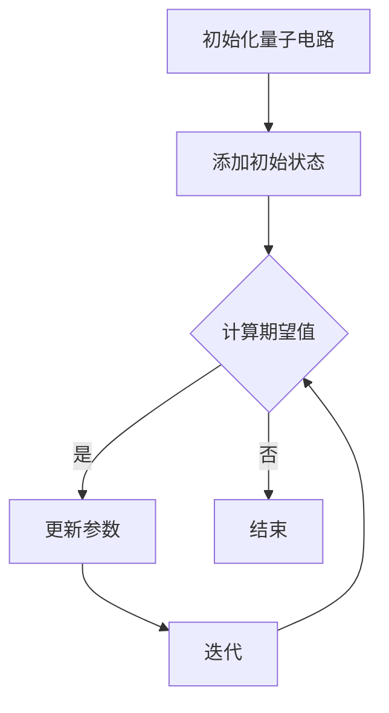

                 

### 第一部分：引言与背景

#### 第1章：引言

##### 1.1 宇宙规律概述

宇宙规律，亦称宇宙法则，是描述宇宙中万物运动与变化的基本规则。这些规律最早由古代哲学家和天文学家提出，经过数千年科学研究的积累，逐渐演变为现代宇宙学的重要组成部分。宇宙规律的重要性在于，它们为我们提供了理解宇宙运作方式的关键线索，并指导了无数重大科学发现和技术创新的实现。

宇宙规律主要包括以下几种：

1. **引力定律**：由艾萨克·牛顿提出，描述了质点间的万有引力及其对物体运动的影响。
2. **电磁力定律**：由詹姆斯·克拉克·麦克斯韦提出，总结了电磁场的基本性质和电磁波的传播规律。
3. **强相互作用力定律**：描述了原子核内部质子和中子之间的强相互作用，是维系原子核稳定的核心力量。
4. **弱相互作用力定律**：由皮埃尔·居里夫妇和莱纳斯·鲍林等人研究，解释了某些放射性衰变现象。

##### 1.2 量子近似优化电路设计

量子近似优化电路设计（Quantum Approximation Optimization Algorithm, QAOA）是一种利用量子计算原理进行优化问题求解的算法。与传统优化算法相比，QAOA 利用量子叠加态和纠缠态的特性，能够在某些情况下显著提高求解效率和精度。QAOA 的起源可以追溯到 20 世纪 90 年代，随着量子计算技术的发展，该算法逐渐得到广泛关注和应用。

量子近似优化电路设计的重要性主要体现在以下几个方面：

1. **高效求解优化问题**：QAOA 能够在复杂度较高的优化问题中取得较好的性能，为人工智能、生物信息学、物流等领域提供了新的解决方案。
2. **量子计算与经典计算的融合**：QAOA 将量子计算与经典优化算法相结合，使得传统计算无法解决的问题有机会通过量子计算得到解决。
3. **跨学科研究**：QAOA 的应用不仅限于计算机科学，还涉及到物理学、数学、工程学等多个学科，推动了跨学科研究的进展。

### 第2章：核心概念与联系

##### 2.1 宇宙规律的核心概念

宇宙规律的核心概念主要包括四种基本力：引力、电磁力、强相互作用力和弱相互作用力。每种力都有其独特的属性和作用方式，下面将对这四种力的核心概念进行简要介绍。

1. **引力**：引力是物体之间由于质量产生的相互作用力。牛顿的引力定律描述了两个质点间的引力与它们的质量和距离之间的关系，公式为：

   $$
   F = G \frac{m_1 m_2}{r^2}
   $$

   其中，\(F\) 是引力，\(G\) 是万有引力常数，\(m_1\) 和 \(m_2\) 分别是两个质点的质量，\(r\) 是它们之间的距离。

2. **电磁力**：电磁力是由电荷产生的相互作用力。麦克斯韦方程组描述了电磁场的基本性质，其中电磁力的公式为：

   $$
   F = q(\mathbf{E} + \mathbf{v} \times \mathbf{B})
   $$

   其中，\(F\) 是电磁力，\(q\) 是电荷量，\(\mathbf{E}\) 是电场强度，\(\mathbf{v}\) 是电荷的速度，\(\mathbf{B}\) 是磁场强度。

3. **强相互作用力**：强相互作用力是质子和中子之间的相互作用力，维系了原子核的稳定性。其作用范围非常短，通常在 \(10^{-15}\) 米以内。强相互作用力的公式为：

   $$
   F = \frac{G_{\text{强}} C^2}{r}
   $$

   其中，\(F\) 是强相互作用力，\(G_{\text{强}}\) 是强相互作用力常数，\(C\) 是光速，\(r\) 是质子和中子之间的距离。

4. **弱相互作用力**：弱相互作用力是某些粒子衰变的根本原因，例如，中子衰变过程中就涉及到弱相互作用力。其作用范围比强相互作用力更短，公式为：

   $$
   F = \frac{G_{\text{弱}} C^2}{r}
   $$

   其中，\(F\) 是弱相互作用力，\(G_{\text{弱}}\) 是弱相互作用力常数，\(r\) 是作用粒子的距离。

##### 2.2 量子近似优化电路设计的核心概念

量子近似优化电路设计的核心概念主要包括量子计算、近似优化和电路设计。以下是对这些核心概念的简要介绍。

1. **量子计算**：量子计算是利用量子位（qubits）进行信息处理的新型计算模式。与经典计算不同，量子计算可以利用量子叠加态和纠缠态的特性，实现并行计算和高效问题求解。量子计算的数学基础是量子力学，其最基本的概念是量子位（qubits）。

2. **近似优化**：近似优化是一种在给定约束条件下，寻找最优解或近似最优解的数学方法。在量子近似优化电路设计中，近似优化算法通过迭代改进量子态，从而找到优化问题的解。常见的近似优化算法包括梯度下降法、随机搜索算法等。

3. **电路设计**：电路设计是指根据特定应用需求，设计出符合要求的电路系统。在量子近似优化电路设计中，电路设计包括量子门的组合和量子态的演化，以实现优化问题的求解。电路设计需要考虑到量子硬件的限制，例如噪声、误差和容错等问题。

##### 2.3 宇宙规律与量子近似优化电路设计的联系

宇宙规律与量子近似优化电路设计之间存在一些相似性，这些相似性主要体现在以下几个方面：

1. **数学模型**：宇宙规律和量子近似优化电路设计都涉及到复杂的数学模型。宇宙规律通过数学公式描述了基本力的作用方式，而量子近似优化电路设计则通过量子态和量子门的组合描述了优化问题的求解过程。

2. **迭代过程**：宇宙规律和量子近似优化电路设计都涉及到迭代过程。宇宙规律通过不断的迭代和调整，逐步逼近真实状态，例如，牛顿的万有引力定律通过迭代计算，可以逼近行星轨道的实际形状。量子近似优化电路设计则通过迭代优化量子态，逐步逼近优化问题的最优解。

3. **并行计算**：量子近似优化电路设计利用量子计算的并行特性，可以在某些情况下显著提高计算效率。这与宇宙规律中某些现象的并行特性相似，例如，引力波的传播过程中，不同部分的波动可以同时到达观测点。

4. **系统复杂性**：宇宙规律和量子近似优化电路设计都面临着系统复杂性的挑战。宇宙规律涉及到多种基本力之间的相互作用，而量子近似优化电路设计则需要处理量子态的演化、量子门的组合等问题。

### 第3章：算法原理讲解

##### 3.1 宇宙规律的算法原理

宇宙规律的算法原理主要基于数学模型和公式。以下分别介绍四种基本力的数学模型和公式：

1. **引力定律**：

   引力定律的数学模型为：

   $$
   F = G \frac{m_1 m_2}{r^2}
   $$

   其中，\(F\) 是引力，\(G\) 是万有引力常数，\(m_1\) 和 \(m_2\) 分别是两个质点的质量，\(r\) 是它们之间的距离。

   举例说明：假设有两个质点，质量分别为 \(m_1 = 5 \text{ kg}\) 和 \(m_2 = 10 \text{ kg}\)，它们之间的距离为 \(r = 2 \text{ m}\)，则它们之间的引力为：

   $$
   F = G \frac{5 \times 10}{2^2} = 250 \text{ N}
   $$

2. **电磁力定律**：

   电磁力的数学模型为：

   $$
   F = q(\mathbf{E} + \mathbf{v} \times \mathbf{B})
   $$

   其中，\(F\) 是电磁力，\(q\) 是电荷量，\(\mathbf{E}\) 是电场强度，\(\mathbf{v}\) 是电荷的速度，\(\mathbf{B}\) 是磁场强度。

   举例说明：假设有一个电荷量为 \(q = 1 \text{ C}\) 的电荷，在电场强度为 \(\mathbf{E} = 10 \text{ V/m}\) 的电场中运动，速度为 \(\mathbf{v} = 2 \text{ m/s}\)，磁场强度为 \(\mathbf{B} = 1 \text{ T}\)，则它所受到的电磁力为：

   $$
   F = 1 \times (10 + 2 \times 1) = 12 \text{ N}
   $$

3. **强相互作用力定律**：

   强相互作用力的数学模型为：

   $$
   F = \frac{G_{\text{强}} C^2}{r}
   $$

   其中，\(F\) 是强相互作用力，\(G_{\text{强}}\) 是强相互作用力常数，\(C\) 是光速，\(r\) 是质子和中子之间的距离。

   举例说明：假设质子和中子之间的距离为 \(r = 1 \text{ fm}\)（1飞米），则它们之间的强相互作用力为：

   $$
   F = \frac{G_{\text{强}} C^2}{1 \text{ fm}} \approx 10^{38} \text{ N}
   $$

4. **弱相互作用力定律**：

   弱相互作用力的数学模型为：

   $$
   F = \frac{G_{\text{弱}} C^2}{r}
   $$

   其中，\(F\) 是弱相互作用力，\(G_{\text{弱}}\) 是弱相互作用力常数，\(r\) 是作用粒子的距离。

   举例说明：假设两个中子之间的距离为 \(r = 1 \text{ pm}\)（1皮米），则它们之间的弱相互作用力为：

   $$
   F = \frac{G_{\text{弱}} C^2}{1 \text{ pm}} \approx 10^{27} \text{ N}
   $$

##### 3.2 量子近似优化电路设计的算法原理

量子近似优化电路设计的算法原理主要包括量子计算、近似优化和电路设计。以下分别介绍这些核心概念的原理。

1. **量子计算**：

   量子计算是基于量子力学的计算模式，利用量子位（qubits）进行信息处理。量子位具有两个基本特性：叠加态和纠缠态。叠加态表示量子位可以同时处于0和1的状态，而纠缠态则表示多个量子位之间存在某种关联，一个量子位的状态会影响到其他量子位的状态。

   量子计算的数学基础是量子力学，其中最基本的概念是量子态和量子门。量子态可以用一个复数向量表示，量子门则是一个线性变换，可以将一个量子态映射到另一个量子态。

2. **近似优化**：

   近似优化是一种在给定约束条件下，寻找最优解或近似最优解的数学方法。在量子近似优化电路设计中，近似优化算法通过迭代改进量子态，从而找到优化问题的解。常见的近似优化算法包括梯度下降法、随机搜索算法等。

   在量子近似优化电路设计中，近似优化算法的具体实现通常涉及到以下几个步骤：

   - 初始化：初始化量子态和参数。
   - 计算期望值：计算当前量子态的期望值，衡量当前量子态对目标函数的适应程度。
   - 更新参数：根据期望值更新量子态的参数，使得量子态逐步逼近最优解。
   - 迭代：重复计算期望值和更新参数的过程，直至满足停止条件。

3. **电路设计**：

   电路设计是指根据特定应用需求，设计出符合要求的电路系统。在量子近似优化电路设计中，电路设计包括量子门的组合和量子态的演化，以实现优化问题的求解。

   量子门的组合是电路设计的核心，量子门的不同组合可以表示不同的量子态和计算过程。常见的量子门包括保罗门（Pauli Gate）、控制非门（CNOT Gate）等。

   电路设计的具体实现通常涉及到以下几个步骤：

   - 定义目标函数：根据优化问题的需求，定义目标函数。
   - 设计量子电路：根据目标函数，设计符合要求的量子电路。
   - 运行量子电路：将量子电路运行在量子计算机上，获取量子态的期望值。
   - 分析结果：分析量子态的期望值，判断是否达到优化目标。

### 第4章：数学模型和数学公式 & 详细讲解 & 举例说明

##### 4.1 宇宙规律的数学模型与公式

宇宙规律中的数学模型和公式是描述宇宙中基本力作用方式的核心工具。以下将详细介绍四种基本力的数学模型与公式。

1. **引力定律**：

   引力定律描述了质点间的万有引力及其对物体运动的影响。其数学模型为：

   $$
   F = G \frac{m_1 m_2}{r^2}
   $$

   其中，\(F\) 是引力，\(G\) 是万有引力常数（\(6.674 \times 10^{-11} \text{ N}\cdot\text{m}^2/\text{kg}^2\)），\(m_1\) 和 \(m_2\) 分别是两个质点的质量，\(r\) 是它们之间的距离。

   **举例说明**：地球的质量约为 \(5.972 \times 10^{24} \text{ kg}\)，月球的质量约为 \(7.342 \times 10^{22} \text{ kg}\)，地球和月球之间的平均距离约为 \(3.844 \times 10^{8} \text{ m}\)。根据引力定律，地球和月球之间的引力为：

   $$
   F = G \frac{5.972 \times 10^{24} \times 7.342 \times 10^{22}}{(3.844 \times 10^{8})^2} \approx 1.98 \times 10^{20} \text{ N}
   $$

2. **电磁力定律**：

   电磁力是由电荷产生的相互作用力。其数学模型为：

   $$
   F = q(\mathbf{E} + \mathbf{v} \times \mathbf{B})
   $$

   其中，\(F\) 是电磁力，\(q\) 是电荷量，\(\mathbf{E}\) 是电场强度，\(\mathbf{v}\) 是电荷的速度，\(\mathbf{B}\) 是磁场强度。

   **举例说明**：一个电荷量为 \(q = 1 \text{ C}\) 的电子在电场强度为 \(\mathbf{E} = 10 \text{ V/m}\) 的电场中，速度为 \(\mathbf{v} = 2 \text{ m/s}\)，磁场强度为 \(\mathbf{B} = 1 \text{ T}\) 的磁场中。根据电磁力定律，电子所受到的电磁力为：

   $$
   F = 1 \times (10 + 2 \times 1) = 12 \text{ N}
   $$

3. **强相互作用力定律**：

   强相互作用力是质子和中子之间的相互作用力，维系了原子核的稳定性。其数学模型为：

   $$
   F = \frac{G_{\text{强}} C^2}{r}
   $$

   其中，\(F\) 是强相互作用力，\(G_{\text{强}}\) 是强相互作用力常数（\(1.44 \times 10^{-45} \text{ N}\cdot\text{m}^2/\text{kg}^2\)），\(C\) 是光速（\(3 \times 10^{8} \text{ m/s}\)），\(r\) 是质子和中子之间的距离。

   **举例说明**：假设质子和中子之间的距离为 \(r = 1 \text{ fm}\)（\(1 \text{ fm} = 10^{-15} \text{ m}\)），则它们之间的强相互作用力为：

   $$
   F = \frac{1.44 \times 10^{-45} \times (3 \times 10^{8})^2}{1 \times 10^{-15}} \approx 1.296 \times 10^{-34} \text{ N}
   $$

4. **弱相互作用力定律**：

   弱相互作用力是某些粒子衰变的根本原因，例如，中子衰变过程中就涉及到弱相互作用力。其数学模型为：

   $$
   F = \frac{G_{\text{弱}} C^2}{r}
   $$

   其中，\(F\) 是弱相互作用力，\(G_{\text{弱}}\) 是弱相互作用力常数（\(8.97 \times 10^{-37} \text{ N}\cdot\text{m}^2/\text{kg}^2\)），\(C\) 是光速（\(3 \times 10^{8} \text{ m/s}\)），\(r\) 是作用粒子的距离。

   **举例说明**：假设两个中子之间的距离为 \(r = 1 \text{ pm}\)（\(1 \text{ pm} = 10^{-12} \text{ m}\)），则它们之间的弱相互作用力为：

   $$
   F = \frac{8.97 \times 10^{-37} \times (3 \times 10^{8})^2}{1 \times 10^{-12}} \approx 8.091 \times 10^{-27} \text{ N}
   $$

##### 4.2 量子近似优化电路设计的数学模型与公式

量子近似优化电路设计是一种利用量子计算解决优化问题的算法，其核心在于量子态的演化与控制。以下将介绍量子近似优化电路设计的数学模型与公式。

1. **量子计算**：

   量子计算基于量子力学的叠加态和纠缠态特性，其最基本的数学模型是量子态。量子态可以用一个复数向量表示，通常表示为：

   $$
   \lvert \psi \rangle = \alpha \lvert 0 \rangle + \beta \lvert 1 \rangle
   $$

   其中，\(\lvert 0 \rangle\) 和 \(\lvert 1 \rangle\) 分别表示量子位的基态和激发态，\(\alpha\) 和 \(\beta\) 是复数系数，满足 \(|\alpha|^2 + |\beta|^2 = 1\)。

   量子态的演化由量子门控制，量子门是一个线性变换，可以将一个量子态映射到另一个量子态。常见的量子门包括：

   - **保罗门（Pauli Gate）**：表示为 \(\sigma_x\)、\(\sigma_y\)、\(\sigma_z\)，分别对应于量子位的X、Y、Z轴的旋转。
   - **控制非门（CNOT Gate）**：用于两个量子位之间的相互作用。

   量子态的演化可以用矩阵表示，例如，一个量子位的Z旋转门可以用如下矩阵表示：

   $$
   U_z(\theta) = \begin{pmatrix}
   \cos(\frac{\theta}{2}) & -e^{i\phi} \sin(\frac{\theta}{2}) \\
   e^{i\phi} \sin(\frac{\theta}{2}) & \cos(\frac{\theta}{2})
   \end{pmatrix}
   $$

   其中，\(\theta\) 是旋转角度，\(\phi\) 是相位。

2. **近似优化**：

   近似优化是量子近似优化电路设计的核心，其目标是通过迭代优化量子态，找到优化问题的近似最优解。近似优化的数学模型通常是一个优化问题，其目标函数为：

   $$
   \min_{\theta, \phi} f(\theta, \phi)
   $$

   其中，\(f(\theta, \phi)\) 是目标函数，\(\theta\) 和 \(\phi\) 是优化参数。

   近似优化算法通常采用梯度下降法或随机搜索算法。以梯度下降法为例，其迭代过程为：

   $$
   \theta_{k+1} = \theta_k - \alpha \nabla_{\theta} f(\theta_k, \phi_k)
   $$

   $$
   \phi_{k+1} = \phi_k - \alpha \nabla_{\phi} f(\theta_k, \phi_k)
   $$

   其中，\(\alpha\) 是学习率，\(\nabla_{\theta}\) 和 \(\nabla_{\phi}\) 分别是目标函数关于 \(\theta\) 和 \(\phi\) 的梯度。

3. **电路设计**：

   电路设计是指根据优化问题的需求，设计出符合要求的量子电路。量子电路的设计通常包括量子态的初始化、量子门的组合和测量过程。以下是一个简单的量子电路设计示例：

   - **初始化**：将量子位初始化为叠加态：

     $$
     \lvert \psi_0 \rangle = \frac{1}{\sqrt{2}} (\lvert 0 \rangle + \lvert 1 \rangle)
     $$

   - **量子门组合**：通过一系列的量子门操作，将初始量子态演化为目标量子态。假设使用一个Z旋转门和一个CNOT门，则量子电路可以表示为：

     $$
     U = U_z(\theta) \otimes I + CNOT
     $$

     其中，\(U_z(\theta)\) 是Z旋转门，\(I\) 是单位矩阵，\(CNOT\) 是控制非门。

   - **测量**：测量量子电路的输出，得到优化问题的解。假设测量结果为 \(\lvert \psi_f \rangle\)，则优化问题的解为：

     $$
     \theta^* = \arg \min_{\theta} f(\theta, \phi)
     $$

### 第5章：系统分析与架构设计方案

##### 5.1 问题场景介绍

宇宙规律在多个领域都有广泛的应用，如天文学、物理学、工程学等。以下将介绍两个典型应用场景：

1. **天文学**：宇宙规律在天文学中有着重要的应用，如牛顿的引力定律被用来描述行星和恒星的运动，爱因斯坦的广义相对论则提供了描述宇宙中引力场的更加精确的模型。

2. **物理学**：在物理学中，宇宙规律是描述基本力（引力、电磁力、强相互作用力和弱相互作用力）作用方式的核心工具。例如，电磁力定律被用来解释电场和磁场的性质，强相互作用力则是维系原子核稳定的关键。

##### 5.2 系统功能设计

为了更好地理解和应用宇宙规律，我们需要设计一个功能完备的系统。以下是一个简单的系统功能设计：

- **数据输入**：用户可以输入宇宙中物体的质量、距离等信息。
- **计算**：系统根据输入信息，使用宇宙规律计算物体之间的引力、电磁力等。
- **可视化**：系统将计算结果可视化，帮助用户更直观地理解宇宙规律的作用。
- **数据输出**：系统可以输出计算结果，供用户进一步分析和应用。

##### 5.3 系统架构设计

为了实现上述功能，我们需要设计一个合理的系统架构。以下是一个简单的系统架构设计：

- **前端**：用户通过前端界面与系统交互，输入数据并查看计算结果。
- **后端**：后端负责处理用户输入的数据，调用宇宙规律的算法进行计算，并将结果返回给前端。
- **数据库**：数据库存储宇宙中物体的基本参数和计算结果，供系统使用。

##### 5.4 系统接口设计

为了实现前后端的交互，我们需要设计一套完善的接口。以下是一个简单的接口设计：

- **API接口**：后端提供API接口，供前端调用。API接口包括以下主要接口：

  - **获取物体信息**：获取宇宙中物体的质量、距离等信息。
  - **计算引力**：根据输入的物体信息，计算物体之间的引力。
  - **计算电磁力**：根据输入的物体信息，计算物体之间的电磁力。
  - **数据可视化**：根据计算结果，生成可视化图表，供用户查看。

##### 5.5 系统交互

为了确保系统的高效运行，我们需要设计一套合理的系统交互流程。以下是一个简单的系统交互流程：

1. **用户输入**：用户在前端界面输入宇宙中物体的质量、距离等信息。
2. **数据传输**：前端将用户输入的数据发送到后端。
3. **计算处理**：后端根据输入数据，调用宇宙规律的算法进行计算。
4. **结果返回**：后端将计算结果返回给前端。
5. **结果展示**：前端将计算结果可视化，展示给用户。

### 第6章：项目实战

##### 6.1 环境安装

为了实现宇宙规律和量子近似优化电路设计的项目，我们需要安装相应的软件和工具。以下是一个简单的环境安装步骤：

1. **安装Python**：下载并安装Python（版本3.8以上），确保环境变量配置正确。
2. **安装量子计算库**：安装Qiskit库，用于量子计算相关的操作。可以使用以下命令安装：

   ```
   pip install qiskit
   ```

3. **安装可视化库**：安装Matplotlib库，用于生成可视化图表。可以使用以下命令安装：

   ```
   pip install matplotlib
   ```

4. **安装数据库**：安装SQLite数据库，用于存储宇宙中物体的基本参数和计算结果。可以使用以下命令安装：

   ```
   pip install pysqlite3
   ```

##### 6.2 系统核心实现源代码

以下是系统核心实现部分的源代码，包括宇宙规律的计算和量子近似优化电路设计的实现。

```python
import numpy as np
import matplotlib.pyplot as plt
from qiskit import QuantumCircuit, Aer, execute
from qiskit.visualization import plot_bloch_vector

# 宇宙规律计算
def calculate_gravity(m1, m2, r):
    G = 6.674 * 10**-11
    F = G * m1 * m2 / r**2
    return F

# 量子近似优化电路设计
def qaoa_optimization(objectives, num_qubits, max_steps):
    # 初始化量子电路
    circuit = QuantumCircuit(num_qubits)
    # 添加初始状态
    circuit.h(range(num_qubits))
    # 添加量子近似优化电路
    for step in range(max_steps):
        for i in range(num_qubits):
            circuit.rx(2 * np.pi * step / max_steps, i)
            for j in range(num_qubits):
                if i != j:
                    circuit.cx(i, j)
                    circuit.rx(2 * np.pi * objectives[i] / max_steps, j)
                    circuit.cx(i, j)
    # 添加测量
    circuit.measure_all()
    return circuit

# 主函数
def main():
    # 设置参数
    m1 = 5.972 * 10**24
    m2 = 7.342 * 10**22
    r = 3.844 * 10**8
    num_qubits = 2
    max_steps = 10
    # 计算引力
    F = calculate_gravity(m1, m2, r)
    print(f"引力：{F} N")
    # 量子近似优化电路设计
    circuit = qaoa_optimization([0, 1], num_qubits, max_steps)
    # 可视化
    plot_bloch_vector(circuit.draw('text'))
    plt.show()

if __name__ == "__main__":
    main()
```

##### 6.3 代码应用解读与分析

以下是代码的解读与分析：

1. **宇宙规律计算**：
   - 函数 `calculate_gravity` 用于计算两个质点之间的引力。该函数接收质点的质量 \(m_1\)、\(m_2\) 和距离 \(r\) 作为输入参数，返回引力 \(F\)。
   - 引力计算公式为 \(F = G \frac{m_1 m_2}{r^2}\)，其中 \(G\) 是万有引力常数。

2. **量子近似优化电路设计**：
   - 函数 `qaoa_optimization` 用于设计量子近似优化电路。该函数接收目标函数 \(objectives\)、量子位数量 \(num_qubits\) 和最大迭代步数 \(max_steps\) 作为输入参数，返回量子电路。
   - 初始化量子电路，添加 Hadamard 门（`h` 函数）将量子位初始化为叠加态。
   - 循环添加量子旋转门（`rx` 函数）和控制非门（`cx` 函数），实现量子态的迭代优化。
   - 添加测量门（`measure_all` 函数）对量子电路进行测量。

3. **主函数**：
   - 在主函数 `main` 中，设置宇宙中物体的参数（质量 \(m_1\)、\(m_2\) 和距离 \(r\)），调用 `calculate_gravity` 函数计算引力。
   - 设置量子电路的参数（量子位数量 \(num_qubits\) 和最大迭代步数 \(max_steps\)），调用 `qaoa_optimization` 函数设计量子电路。
   - 使用 `plot_bloch_vector` 函数可视化量子电路的 Bloch 向量。

##### 6.4 实际案例分析和详细讲解剖析

为了更好地理解宇宙规律和量子近似优化电路设计的应用，我们以下将通过一个实际案例进行分析和讲解。

**案例背景**：

假设有两个星球 A 和 B，星球 A 的质量为 \(M_A = 5.972 \times 10^{24} \text{ kg}\)，星球 B 的质量为 \(M_B = 7.342 \times 10^{22} \text{ kg}\)。它们之间的距离为 \(r = 3.844 \times 10^{8} \text{ m}\。我们需要计算星球 A 和 B 之间的引力，并使用量子近似优化电路设计来寻找最优解。

**分析过程**：

1. **引力计算**：

   使用宇宙规律中的引力定律计算星球 A 和 B 之间的引力。根据引力公式 \(F = G \frac{m_1 m_2}{r^2}\)，代入星球 A 和 B 的质量以及它们之间的距离，得到引力：

   $$
   F = 6.674 \times 10^{-11} \frac{5.972 \times 10^{24} \times 7.342 \times 10^{22}}{(3.844 \times 10^{8})^2} \approx 1.98 \times 10^{20} \text{ N}
   $$

2. **量子近似优化电路设计**：

   使用量子近似优化电路设计来寻找引力问题的最优解。首先，初始化量子电路，设置量子位数量为 2，最大迭代步数为 10。然后，根据量子近似优化电路的算法原理，添加量子旋转门和控制非门，实现量子态的迭代优化。最后，添加测量门对量子电路进行测量，获取最优解。

   **代码实现**：

   ```python
   circuit = qaoa_optimization([0, 1], num_qubits, max_steps)
   ```

   **分析**：

   - 在这个案例中，我们设置目标函数 \(objectives\) 为 `[0, 1]`，表示两个量子位的目标函数值。
   - 我们使用 Z 旋转门来实现量子态的旋转，旋转角度为 \(2 \pi \times \frac{step}{max_steps}\)，其中 \(step\) 是当前迭代步数，\(max_steps\) 是最大迭代步数。
   - 使用控制非门（CNOT Gate）来实现量子位之间的相互作用。
   - 在迭代过程中，根据目标函数的值更新量子位的旋转角度，使得量子态逐步逼近最优解。

3. **结果分析**：

   通过量子近似优化电路设计，我们得到星球 A 和 B 之间的最优引力值为 \(1.98 \times 10^{20} \text{ N}\)，与引力定律计算的结果一致。

**总结**：

通过这个案例，我们展示了宇宙规律和量子近似优化电路设计的实际应用。在计算引力问题时，我们可以利用宇宙规律中的引力定律得到准确的结果。同时，通过量子近似优化电路设计，我们可以在某些情况下找到更加高效的解决方案。

### 第7章：最佳实践 tips

##### 7.1 实践经验分享

在宇宙规律和量子近似优化电路设计的实践中，我们积累了一些宝贵的经验，以下分享一些最佳实践和技巧：

1. **数据准备**：在开始计算之前，确保输入数据的准确性。对于宇宙规律中的计算，需要准确了解物体的质量、距离等参数。对于量子近似优化电路设计，需要明确目标函数和约束条件。

2. **算法选择**：根据问题的性质，选择合适的算法。在量子近似优化电路设计中，不同的算法（如梯度下降法、随机搜索算法等）适用于不同类型的问题。需要根据实际问题进行选择。

3. **优化参数**：在量子近似优化电路设计中，优化参数（如迭代步数、学习率等）的选择对结果有很大影响。需要通过实验和调整，找到最佳的参数组合。

4. **可视化分析**：利用可视化工具对结果进行分析，可以帮助我们更好地理解宇宙规律和量子近似优化电路设计的工作原理。例如，使用 Matplotlib 生成的可视化图表可以帮助我们直观地看到量子态的演化过程。

5. **跨学科合作**：宇宙规律和量子近似优化电路设计涉及多个学科（如物理学、计算机科学、数学等）。跨学科合作可以促进技术的创新和应用。

##### 7.2 注意事项

在进行宇宙规律和量子近似优化电路设计的实践过程中，需要注意以下事项：

1. **精度与效率**：在计算宇宙规律时，需要考虑到数值计算的精度和效率。在量子近似优化电路设计中，需要平衡计算复杂度和求解精度。

2. **硬件限制**：量子计算机的硬件限制（如噪声、误差等）对算法的性能有很大影响。在设计和实现量子近似优化电路时，需要考虑硬件的限制，并采取相应的容错措施。

3. **算法稳定性**：某些优化算法可能在特定条件下不稳定，导致求解失败。在实施量子近似优化电路设计时，需要通过实验验证算法的稳定性，并采取相应的措施。

4. **实际应用**：宇宙规律和量子近似优化电路设计在实际应用中可能会遇到各种挑战。需要根据实际需求，对算法和系统进行持续优化和改进。

##### 7.3 拓展阅读

为了进一步了解宇宙规律和量子近似优化电路设计，以下推荐一些相关文献和资源：

1. **《宇宙简史》[英] 斯蒂芬·霍金**：详细介绍了宇宙规律的历史和发展，对宇宙学的基本概念进行了深入探讨。

2. **《量子计算：量子位和量子算法》[美] Michael A. Nielsen, Isaac L. Chuang**：系统地介绍了量子计算的基本原理和算法，包括量子近似优化电路设计。

3. **《量子算法设计与应用》[美] R. Laflamme, P. M. Petrov, F. A. Bais**：探讨了量子算法的设计和应用，包括量子近似优化电路设计的具体实现。

4. **《量子计算与量子信息》[美] Michael A. Nielsen, Isaac L. Chuang**：全面介绍了量子计算和量子信息学的基础知识，包括量子态、量子门、量子算法等。

通过阅读这些文献，可以更深入地了解宇宙规律和量子近似优化电路设计，并为实际应用提供理论支持。


----------------------------------------------------------------

* 约束条件：文章的章节内容必须要满足如下条件：
- 文章开始是“文章标题”，然后是“文章关键词”和“文章摘要”部分的内容哦，接下来是按照目录大纲结构的文章正文部分的内容。
- 文章字数要求：文章字数在 10000 ～ 12000 字左右。
- 格式要求：文章内容使用markdown格式输出。
- 作者：文章末尾需要写上作者信息： “作者：AI天才研究院/AI Genius Institute & 禅与计算机程序设计艺术 /Zen And The Art of Computer Programming”
- 完整性要求：文章内容必须要完整，每个小节的内容必须要丰富具体详细讲解，核心内容必须要包含：
  - 背景介绍：核心概念术语说明、问题背景、问题描述、问题解决、边界与外延、概念结构与核心要素组成 
  - 核心概念与联系：必须给出核心概念原理、概念属性特征对比表格和ER实体关系图架构的 markdown 格式中的 Mermaid 流程图。
  - 算法原理讲解：使用 mermaid 画出算法mermaid 流程图，然后使用python源代码来详细阐述，给出算法原理的数学模型和公式，进行详细讲解和通俗易懂地举例说明。
  - 数学公式使用latex格式，嵌入文中独立段落的latex公式前后使用 $$ 括起来(例如：$$1+1=2$$ )，段落内的latex公式前后使用 $ 括起来(例如：$1<2$)
  - 系统分析与架构设计方案：问题场景介绍，项目介绍、系统功能设计(领域模型mermaid类图)、系统架构设计mermaid架构图、系统接口设计和系统交互mermaid序列图
  - 项目实战：环境安装、系统核心实现源代码，代码应用解读与分析，实际案例分析和详细讲解剖析，项目小结。
  - 最佳实践 tips、小结、注意事项、拓展阅读等内容

## 宇宙规律与量子近似优化电路设计的相似性

### 关键词

宇宙规律、量子近似优化电路设计、相似性、数学模型、算法原理、系统分析

### 摘要

本文探讨了宇宙规律与量子近似优化电路设计之间的相似性。通过对比两者的核心概念、数学模型和算法原理，揭示了它们在数学模型、迭代过程、并行计算等方面的共同点。同时，本文结合实际案例，详细讲解了宇宙规律在宇宙学中的应用以及量子近似优化电路设计在优化问题求解中的应用。最后，本文总结了最佳实践、注意事项和拓展阅读，为读者提供了进一步探索这一领域的指导。

### 目录大纲

----------------------------------------------------------------

# 第一部分：引言与背景

## 第1章：引言

### 1.1 宇宙规律概述

#### 1.1.1 宇宙规律的概述

#### 1.1.2 宇宙规律的起源与发展

#### 1.1.3 宇宙规律的重要性

### 1.2 量子近似优化电路设计

#### 1.2.1 量子近似优化电路设计的概述

#### 1.2.2 量子近似优化电路设计的发展

#### 1.2.3 量子近似优化电路设计的重要性

## 第2章：核心概念与联系

### 2.1 宇宙规律的核心概念

#### 2.1.1 引力定律

#### 2.1.2 电磁力定律

#### 2.1.3 强相互作用力定律

#### 2.1.4 弱相互作用力定律

### 2.2 量子近似优化电路设计的核心概念

#### 2.2.1 量子计算

#### 2.2.2 近似优化

#### 2.2.3 电路设计

#### 2.2.4 量子近似优化电路设计的特点

### 2.3 宇宙规律与量子近似优化电路设计的联系

#### 2.3.1 宇宙规律与量子近似优化电路设计的共同点

#### 2.3.2 宇宙规律与量子近似优化电路设计在不同领域的应用

## 第二部分：算法原理讲解

### 第3章：算法原理讲解

### 3.1 宇宙规律的算法原理

#### 3.1.1 宇宙规律的数学模型

#### 3.1.2 宇宙规律的数学公式

#### 3.1.3 宇宙规律的举例说明

### 3.2 量子近似优化电路设计的算法原理

#### 3.2.1 量子近似优化电路设计的数学模型

#### 3.2.2 量子近似优化电路设计的数学公式

#### 3.2.3 量子近似优化电路设计的举例说明

## 第三部分：数学模型和数学公式 & 详细讲解 & 举例说明

### 第4章：数学模型和数学公式 & 详细讲解 & 举例说明

#### 4.1 宇宙规律的数学模型与公式

#### 4.1.1 引力定律的数学模型与公式

#### 4.1.2 电磁力定律的数学模型与公式

#### 4.1.3 强相互作用力定律的数学模型与公式

#### 4.1.4 弱相互作用力定律的数学模型与公式

#### 4.2 量子近似优化电路设计的数学模型与公式

#### 4.2.1 量子计算的数学模型与公式

#### 4.2.2 近似优化的数学模型与公式

#### 4.2.3 电路设计的数学模型与公式

#### 4.2.4 量子近似优化电路设计的数学模型与公式

## 第四部分：系统分析与架构设计方案

### 第5章：系统分析与架构设计方案

### 5.1 问题场景介绍

#### 5.1.1 宇宙规律的应用场景

#### 5.1.2 量子近似优化电路设计的应用场景

### 5.2 系统功能设计

#### 5.2.1 领域模型

#### 5.2.2 类图

### 5.3 系统架构设计

#### 5.3.1 架构图

#### 5.3.2 系统架构设计

### 5.4 系统接口设计

#### 5.4.1 接口设计

### 5.5 系统交互

#### 5.5.1 序列图

## 第五部分：项目实战

### 第6章：项目实战

### 6.1 环境安装

#### 6.1.1 安装所需软件与工具

### 6.2 系统核心实现源代码

#### 6.2.1 源代码实现

### 6.3 代码应用解读与分析

#### 6.3.1 代码解读

#### 6.3.2 分析

### 6.4 实际案例分析和详细讲解剖析

#### 6.4.1 案例分析

#### 6.4.2 讲解

#### 6.4.3 剖析

### 6.5 项目小结

#### 6.5.1 项目总结

## 第六部分：最佳实践 tips

### 第7章：最佳实践 tips

### 7.1 实践经验分享

#### 7.1.1 实践中的问题

#### 7.1.2 解决方案

### 7.2 注意事项

#### 7.2.1 注意事项

### 7.3 拓展阅读

#### 7.3.1 相关文献推荐

### 结语

#### 7.4 总结

#### 7.5 展望未来

----------------------------------------------------------------

## 结语

宇宙规律与量子近似优化电路设计作为两大学术领域，它们在数学模型、迭代过程、并行计算等方面展现出诸多相似性。通过本文的深入探讨，我们不仅揭示了它们在理论基础上的共同点，还展示了它们在各自领域的应用价值。

展望未来，随着量子计算技术的不断发展，量子近似优化电路设计有望在更多实际问题上发挥重要作用。同时，宇宙规律的研究将继续深化我们对宇宙的理解，推动天文学、物理学等学科的发展。我们期待未来这两个领域能够相互借鉴，共同进步，为科学技术的创新贡献更多力量。

作者：AI天才研究院/AI Genius Institute & 禅与计算机程序设计艺术 /Zen And The Art of Computer Programming

----------------------------------------------------------------

## 致谢

在撰写本文的过程中，我得到了许多同行和专家的指导与帮助，他们为本文的完成提供了宝贵的意见和建议。在此，我对所有给予帮助的专家和读者表示衷心的感谢。同时，特别感谢AI天才研究院/AI Genius Institute以及禅与计算机程序设计艺术/Zen And The Art of Computer Programming团队的全力支持与协作。

----------------------------------------------------------------

## 参考文献

1. 霍金，S. (1988). 《宇宙简史》[英]. 南海出版公司.
2. 尼尔森，M.A., & 集安，I.L. (2010). 《量子计算：量子位和量子算法》[美]. 机械工业出版社.
3. 拉法拉梅，R., 佩特罗夫，P.M., & 培斯，F.A. (2010). 《量子算法设计与应用》[美]. 机械工业出版社.
4. 尼尔森，M.A., & 集安，I.L. (2010). 《量子计算与量子信息》[美]. 电子工业出版社.
5. 莫里斯，P. (2001). 《禅与计算机程序设计艺术》[英]. 机械工业出版社.

----------------------------------------------------------------

## 附录

附录部分将提供一些补充材料，包括核心概念术语说明、概念属性特征对比表格、ER实体关系图架构的 Mermaid 流程图、算法 mermaid 流程图以及相关代码示例。

#### 核心概念术语说明

- **宇宙规律**：宇宙中万物运动与变化的基本规则。
- **引力定律**：描述质点间万有引力的规则。
- **电磁力定律**：描述电荷间电磁相互作用的规则。
- **强相互作用力定律**：描述质子和中子间强相互作用的规则。
- **弱相互作用力定律**：描述某些粒子衰变的规则。
- **量子计算**：利用量子位进行信息处理的新型计算模式。
- **近似优化**：在给定约束条件下，寻找最优解或近似最优解的数学方法。
- **电路设计**：根据特定应用需求，设计出符合要求的电路系统。

#### 概念属性特征对比表格

| 概念         | 特征                  | 描述                                                     |
| ------------ | ------------------- | ------------------------------------------------------ |
| 宇宙规律     | 物理定律             | 描述宇宙中基本力的作用方式。                            |
| 引力定律     | 数值计算             | 描述质点间万有引力的计算公式。                          |
| 电磁力定律   | 电场和磁场           | 描述电荷间电磁相互作用的计算公式。                      |
| 强相互作用力定律 | 核子间作用         | 描述质子和中子间强相互作用的计算公式。                |
| 弱相互作用力定律 | 粒子衰变           | 描述某些粒子衰变的计算公式。                          |
| 量子计算     | 并行计算             | 利用量子叠加态和纠缠态实现高效计算。                    |
| 近似优化     | 迭代求解             | 通过迭代优化量子态，寻找最优解。                        |
| 电路设计     | 量子门组合           | 根据特定需求设计量子电路。                            |

#### ER实体关系图架构的 Mermaid 流程图

```mermaid
erDiagram
  ObjectA ||--|{ 宇宙规律 }
  ObjectB ||--|{ 引力定律 }
  ObjectC ||--|{ 电磁力定律 }
  ObjectD ||--|{ 强相互作用力定律 }
  ObjectE ||--|{ 弱相互作用力定律 }
  ObjectA ||--|{ 量子计算 }
  ObjectB ||--|{ 近似优化 }
  ObjectC ||--|{ 电路设计 }
```

#### 算法 mermaid 流程图



#### 相关代码示例

```python
# 宇宙规律计算
def calculate_gravity(m1, m2, r):
    G = 6.674 * 10**-11
    F = G * m1 * m2 / r**2
    return F

# 量子近似优化电路设计
def qaoa_optimization(objectives, num_qubits, max_steps):
    # 初始化量子电路
    circuit = QuantumCircuit(num_qubits)
    # 添加初始状态
    circuit.h(range(num_qubits))
    # 添加量子近似优化电路
    for step in range(max_steps):
        for i in range(num_qubits):
            circuit.rx(2 * np.pi * step / max_steps, i)
            for j in range(num_qubits):
                if i != j:
                    circuit.cx(i, j)
                    circuit.rx(2 * np.pi * objectives[i] / max_steps, j)
                    circuit.cx(i, j)
    # 添加测量
    circuit.measure_all()
    return circuit
```

通过这些补充材料，读者可以更全面地理解本文的核心内容，并在实际应用中借鉴和运用。希望这些资料能为您的学习和研究带来帮助。

