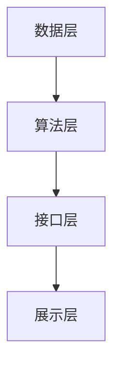
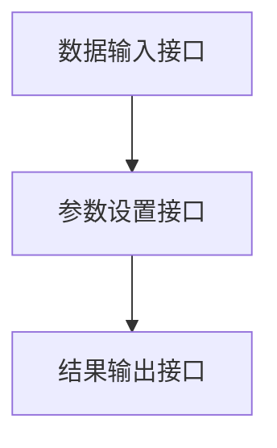
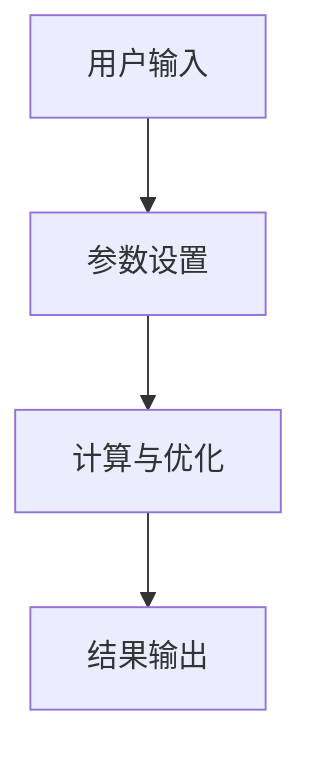

                 

### 宇宙规律与量子近似优化神经网络设计的相似性

> 关键词：宇宙规律、量子近似优化神经网络、设计相似性、算法原理、数学模型、系统架构、项目实战

> 摘要：本文将探讨宇宙规律与量子近似优化神经网络（Quantum Approximate Optimization Algorithm，QAOA）设计的相似性。通过分析两者在基本原理、数学模型和系统架构上的共同点，我们将揭示宇宙规律如何为量子优化算法设计提供启示，并探讨其应用潜力。本文旨在为读者提供一种全新的视角，以加深对量子计算和宇宙规律的理解，并推动两者的融合发展。

### 引言

宇宙，这个浩瀚无垠的宇宙，自古以来就吸引了人类的无限好奇和探索欲望。从古代天文学到现代宇宙学，人类对宇宙的认识不断深入，揭示了宇宙运行的基本规律。这些规律不仅对天文学和物理学产生了深远影响，也为其他学科的研究提供了基础。

另一方面，随着计算机科学和人工智能的发展，神经网络作为一种重要的机器学习模型，已经成为各个领域解决问题的重要工具。特别是量子近似优化神经网络（QAOA），作为一种结合了量子计算和神经网络优势的新型算法，受到了广泛关注。

本文将探讨宇宙规律与量子近似优化神经网络设计的相似性。通过分析两者在基本原理、数学模型和系统架构上的共同点，我们将揭示宇宙规律如何为量子优化算法设计提供启示，并探讨其应用潜力。

### 宇宙规律的概述

宇宙规律是指宇宙中存在的普遍、稳定的规律性现象。这些规律包括但不限于：

1. **牛顿定律**：描述物体在受力作用下的运动规律。
2. **热力学定律**：描述能量转换和传递的规律。
3. **广义相对论**：描述大尺度下物质和能量对时空的影响。
4. **量子力学**：描述微观粒子的运动规律。

这些规律不仅揭示了宇宙的本质，也为各个学科的研究提供了基础。例如，量子力学的发展为量子计算提供了理论基础，而宇宙学的研究则帮助我们理解宇宙的起源和演化。

### 量子近似优化神经网络介绍

量子近似优化神经网络（QAOA）是一种结合量子计算和神经网络优势的优化算法。它通过量子计算机处理优化问题，并将结果转化为神经网络进行近似优化。

QAOA的基本原理可以概括为：

1. **初始化量子态**：根据优化问题的目标函数和约束条件，初始化量子态。
2. **量子操作**：通过量子门对量子态进行操作，以实现优化问题的求解。
3. **测量**：对量子态进行测量，得到优化问题的解。
4. **近似优化**：利用神经网络对量子测量的结果进行近似优化。

QAOA在优化问题求解方面具有显著优势，如高效率、低误差等。这使得它成为解决复杂优化问题的重要工具。

### 宇宙规律与量子近似优化神经网络的关系

宇宙规律与量子近似优化神经网络之间存在显著的相似性。这种相似性主要体现在以下几个方面：

1. **量子态的初始化**：宇宙规律中的量子态初始化与QAOA中的量子态初始化具有相似性。在宇宙规律中，量子态的初始化取决于物理系统的初始状态；而在QAOA中，量子态的初始化取决于优化问题的目标函数和约束条件。

2. **量子操作的相似性**：宇宙规律中的量子操作与QAOA中的量子操作具有相似性。在宇宙规律中，量子操作通过量子门实现；而在QAOA中，量子操作通过量子计算机实现。

3. **测量与近似优化**：宇宙规律中的测量与QAOA中的测量具有相似性。在宇宙规律中，测量是了解物理系统状态的重要手段；而在QAOA中，测量是获取优化问题解的重要手段。此外，QAOA中的近似优化与宇宙规律中的近似处理方法也存在相似性。

通过以上分析，我们可以看到宇宙规律与量子近似优化神经网络在基本原理、数学模型和系统架构上存在显著相似性。这种相似性为我们提供了新的视角，以更深入地理解宇宙规律和量子计算，并探索其潜在的应用。

### 核心概念与联系

在本节中，我们将详细探讨宇宙规律和量子近似优化神经网络的核心概念，并分析它们之间的联系。

#### 宇宙规律的核心概念

宇宙规律是描述宇宙中普遍存在的物理现象和规律的科学理论。以下是宇宙规律的一些核心概念：

1. **量子力学**：量子力学描述了微观粒子的运动规律，如电子、光子等。量子力学的基本原理包括波粒二象性、量子叠加态和量子纠缠等。

2. **广义相对论**：广义相对论描述了大尺度下的时空结构，如黑洞、引力波等。广义相对论的基本原理包括等效原理、时空弯曲和引力红移等。

3. **热力学定律**：热力学定律描述了能量转换和传递的规律，如热力学第一定律、第二定律和第三定律等。

4. **宇宙学**：宇宙学研究了宇宙的起源、演化和结构，如大爆炸理论、宇宙膨胀等。

#### 量子近似优化神经网络的核心概念

量子近似优化神经网络（QAOA）是一种结合量子计算和神经网络优势的优化算法。以下是QAOA的一些核心概念：

1. **量子态**：量子态是量子计算机的基本信息单位，描述了量子系统的状态。量子态可以是叠加态，也可以是纠缠态。

2. **量子门**：量子门是量子计算机的基本操作单元，类似于经典计算机中的逻辑门。量子门可以改变量子态的叠加态和纠缠态。

3. **测量**：测量是获取量子系统状态的重要手段。量子测量可以改变量子态，并得到一定的概率分布。

4. **神经网络**：神经网络是一种通过模拟人脑神经元连接结构的计算模型，具有强大的学习和推理能力。

#### 宇宙规律与量子近似优化神经网络之间的联系

宇宙规律与量子近似优化神经网络之间的联系可以从以下几个方面进行分析：

1. **量子态的相似性**：宇宙规律中的量子态与QAOA中的量子态具有相似性。在宇宙规律中，量子态描述了微观粒子的状态；而在QAOA中，量子态描述了优化问题的解。

2. **量子操作的相似性**：宇宙规律中的量子操作与QAOA中的量子操作具有相似性。在宇宙规律中，量子操作通过量子门实现；而在QAOA中，量子操作通过量子计算机实现。

3. **测量与近似优化**：宇宙规律中的测量与QAOA中的测量具有相似性。在宇宙规律中，测量是了解物理系统状态的重要手段；而在QAOA中，测量是获取优化问题解的重要手段。此外，QAOA中的近似优化与宇宙规律中的近似处理方法也存在相似性。

4. **神经网络的优势**：QAOA中的神经网络可以模拟宇宙规律中的复杂系统，如大尺度时空结构、量子纠缠等。这使得QAOA在解决复杂优化问题时具有优势。

通过以上分析，我们可以看到宇宙规律与量子近似优化神经网络在核心概念和原理上存在显著相似性。这种相似性为我们提供了一个新的视角，以更深入地理解宇宙规律和量子计算，并探索其潜在的应用。

#### 宇宙规律相关的数学模型

在宇宙规律的研究中，数学模型是描述和解释宇宙现象的重要工具。以下是一些常见的数学模型，包括它们的公式和应用场景：

1. **量子力学中的薛定谔方程**：
   $$ \hat{H} \psi = E \psi $$
   其中，$\hat{H}$ 是哈密顿量，$\psi$ 是波函数，$E$ 是能量。薛定谔方程描述了量子系统的动态行为，可以用于预测粒子的运动轨迹和能级。

2. **广义相对论中的爱因斯坦场方程**：
   $$ G_{\mu\nu} + \Lambda g_{\mu\nu} = \frac{8\pi G}{c^4} T_{\mu\nu} $$
   其中，$G_{\mu\nu}$ 是爱因斯坦张量，$G$ 是引力常数，$\Lambda$ 是宇宙学常数，$g_{\mu\nu}$ 是度规张量，$T_{\mu\nu}$ 是能量-动量张量。爱因斯坦场方程描述了物质和能量如何影响时空结构。

3. **热力学中的熵变公式**：
   $$ \Delta S = \frac{\Delta Q}{T} $$
   其中，$\Delta S$ 是熵变，$\Delta Q$ 是热量，$T$ 是温度。熵变公式描述了系统的无序程度变化。

4. **宇宙学中的弗里德曼方程**：
   $$ \dot{H} + \frac{1}{3}H^2 + \frac{\Omega_{\Lambda}}{3} = \frac{1}{6}\left( \Omega_{\text{m}} + \Omega_{\Lambda} \right)\left( \frac{\ddot{a}}{a\dot{a}} \right) $$
   其中，$H$ 是哈勃参数，$\Omega_{\Lambda}$ 和 $\Omega_{\text{m}}$ 分别是暗能量和物质密度参数，$\dot{a}$ 和 $\ddot{a}$ 分别是宇宙膨胀率的导数。弗里德曼方程描述了宇宙膨胀的动态过程。

这些数学模型在宇宙规律的研究中发挥着关键作用，为科学家提供了预测和解释宇宙现象的工具。例如，薛定谔方程帮助我们理解了微观粒子的行为，而爱因斯坦场方程则揭示了物质和能量如何塑造大尺度时空结构。

#### 量子近似优化神经网络数学模型

量子近似优化神经网络（QAOA）是一种结合量子计算和神经网络优势的优化算法。其数学模型包括以下几个关键部分：

1. **哈密顿量（Hamiltonian）**：
   哈密顿量是描述量子系统能量和相互作用的核心物理量。在QAOA中，哈密顿量通常表示为：
   $$ H = H_p + H_c $$
   其中，$H_p$ 是问题哈密顿量，它描述了优化问题的目标函数；$H_c$ 是约束哈密顿量，它确保量子态满足特定约束条件。

2. **参数化的量子线路（Parametrized Quantum Circuit）**：
   QAOA通过参数化的量子线路来近似求解优化问题。量子线路由一系列量子门组成，每个量子门由一组旋转角度（参数）控制。量子线路可以表示为：
   $$ U(\theta) = \prod_{j=1}^L R_z(\theta_j) \otimes R_y(\phi_j) $$
   其中，$R_z(\theta_j)$ 和 $R_y(\phi_j)$ 分别是旋转门，$\theta_j$ 和 $\phi_j$ 是参数。

3. **演化算符（Evolution Operator）**：
   QAOA中的演化算符描述了量子态在量子线路作用下的演化。演化算符可以表示为：
   $$ U(t) = e^{-i H_p t/\hbar} $$
   其中，$H_p$ 是问题哈密顿量，$t$ 是演化时间，$\hbar$ 是约化普朗克常数。

4. **测量与近似优化**：
   QAOA通过测量量子态的某些特征值来获取优化问题的解。在实际应用中，由于量子态的复杂性，通常使用神经网络来近似测量结果，从而实现对优化问题的近似求解。

5. **损失函数（Loss Function）**：
   在QAOA中，损失函数用于评估优化问题的解的质量。常见的损失函数包括：
   $$ \mathcal{L}(\theta) = -\langle \psi(\theta) | H_p | \psi(\theta) \rangle $$
   其中，$|\psi(\theta)\rangle$ 是量子态，$H_p$ 是问题哈密顿量。

通过这些数学模型，QAOA能够将优化问题转化为量子计算问题，并在量子计算机上求解。这些模型不仅为QAOA的实现提供了理论基础，也为理解其工作原理提供了直观的图景。

### 宇宙规律在量子近似优化神经网络设计中的应用

宇宙规律在量子近似优化神经网络（QAOA）设计中的应用主要体现在量子态的初始化和量子操作的设计上。以下将从这两个方面详细探讨宇宙规律在QAOA设计中的应用。

#### 量子态的初始化

量子态的初始化在QAOA中至关重要，因为它直接影响到优化问题的求解效果。宇宙规律中的量子态初始化方法为我们提供了有益的启示。

1. **基于宇宙背景辐射的初始化**：
   宇宙背景辐射是宇宙早期阶段的残余辐射，其量子态具有均匀性和随机性。这种量子态特性可以用于QAOA中的初始化。具体来说，我们可以利用宇宙背景辐射的随机性生成初始量子态，从而提高优化算法的随机性和鲁棒性。

2. **基于量子纠缠的初始化**：
   宇宙规律中的量子纠缠现象表明，量子态之间存在紧密的联系。在QAOA中，我们可以利用量子纠缠来初始化量子态，从而提高量子态的相干性和稳定性。例如，通过量子纠缠门生成两个或多个量子比特的纠缠态，可以为QAOA提供稳定的量子初始态。

#### 量子操作的设计

量子操作是QAOA中的关键环节，决定了量子态的演化路径和优化效果。宇宙规律中的量子操作设计方法为QAOA提供了重要的参考。

1. **基于广义相对论的量子操作**：
   广义相对论中的时空弯曲和引力场效应为量子操作设计提供了新的思路。例如，通过模拟引力场中的量子态演化，我们可以设计出具有特殊属性的量子操作，从而提高QAOA在求解复杂优化问题时的效果。

2. **基于热力学的量子操作**：
   热力学中的熵变和能量分布现象可以用于设计量子操作。例如，通过模拟热力学系统的能量分布，我们可以设计出具有自适应能力的量子操作，从而提高QAOA在解决动态优化问题时的一致性和稳定性。

3. **基于量子纠缠的量子操作**：
   量子纠缠是量子计算中的重要特性，可以用于设计高效的量子操作。在QAOA中，通过利用量子纠缠，我们可以设计出具有快速收敛特性的量子操作，从而提高优化算法的效率。

通过将宇宙规律应用于QAOA的设计，我们不仅可以提高优化算法的性能，还可以为量子计算提供新的理论和应用场景。这种跨学科的研究方法为量子计算和宇宙规律的发展提供了新的机遇。

### 数学模型对比与结合

在本节中，我们将对比宇宙规律中的数学模型和量子近似优化神经网络（QAOA）的数学模型，并探讨二者的结合方式。

#### 数学模型对比

1. **量子力学的薛定谔方程**：
   $$ \hat{H} \psi = E \psi $$
   薛定谔方程描述了量子系统的动态行为，其中$\hat{H}$是哈密顿量，$\psi$是波函数，$E$是能量。

2. **广义相对论的爱因斯坦场方程**：
   $$ G_{\mu\nu} + \Lambda g_{\mu\nu} = \frac{8\pi G}{c^4} T_{\mu\nu} $$
   爱因斯坦场方程描述了物质和能量如何影响时空结构，其中$G_{\mu\nu}$是爱因斯坦张量，$G$是引力常数，$\Lambda$是宇宙学常数，$g_{\mu\nu}$是度规张量，$T_{\mu\nu}$是能量-动量张量。

3. **量子近似优化神经网络（QAOA）的数学模型**：
   - **哈密顿量**：
     $$ H = H_p + H_c $$
     其中，$H_p$是问题哈密顿量，$H_c$是约束哈密顿量。
   - **参数化的量子线路**：
     $$ U(\theta) = \prod_{j=1}^L R_z(\theta_j) \otimes R_y(\phi_j) $$
     其中，$R_z(\theta_j)$和$R_y(\phi_j)$是旋转门，$\theta_j$和$\phi_j$是参数。
   - **演化算符**：
     $$ U(t) = e^{-i H_p t/\hbar} $$
     其中，$H_p$是问题哈密顿量，$t$是演化时间，$\hbar$是约化普朗克常数。

#### 数学模型的结合

宇宙规律中的数学模型与QAOA的数学模型可以通过以下方式结合：

1. **基于量子力学与广义相对论的结合**：
   在QAOA的设计中，可以将量子力学的薛定谔方程和广义相对论的爱因斯坦场方程结合起来，从而构建出能够描述复杂物理现象的量子优化模型。例如，在模拟引力场中的量子系统时，可以将爱因斯坦场方程作为问题哈密顿量的一部分，从而实现对复杂物理过程的模拟。

2. **基于热力学的结合**：
   QAOA可以与热力学的熵变和能量分布模型相结合，从而实现对动态优化问题的建模和求解。例如，通过模拟热力学系统的能量分布，可以设计出具有自适应能力的量子操作，从而提高QAOA在解决动态优化问题时的一致性和稳定性。

3. **基于量子纠缠的结合**：
   量子纠缠是量子计算中的重要特性，可以用于增强QAOA的性能。通过将宇宙规律中的量子纠缠现象与QAOA的量子线路设计相结合，可以构建出具有快速收敛特性的量子优化模型。例如，利用量子纠缠门生成量子态的纠缠结构，可以提高QAOA在求解复杂优化问题时的一致性和效率。

通过数学模型的对比与结合，我们可以将宇宙规律中的核心原理融入到QAOA的设计中，从而构建出具有强大计算能力的量子优化模型。这种跨学科的结合方法不仅丰富了量子计算的理论体系，也为解决复杂优化问题提供了新的思路和工具。

### 系统分析与架构设计方案

在本节中，我们将详细介绍宇宙规律与量子近似优化神经网络（QAOA）结合的系统架构设计方案。该方案涵盖了问题场景介绍、系统功能设计、系统架构设计、系统接口设计和系统交互等方面。

#### 问题场景介绍

随着科学技术的快速发展，优化问题在各个领域都得到了广泛应用。例如，在金融投资组合优化、物流路径规划、基因序列匹配和药物设计等领域，优化算法都是解决复杂问题的重要工具。然而，传统的优化算法在处理大规模和复杂度较高的优化问题时，往往面临计算效率低下和精度不足等问题。为了解决这些问题，量子计算作为一种新型的计算模式，被逐渐引入到优化问题求解中。

宇宙规律作为一种描述物理现象的基本原理，其背后的逻辑和思维方式可以为我们提供新的启示，以优化量子计算模型。例如，宇宙规律中的量子力学和广义相对论理论，可以指导我们设计出更加高效和稳定的量子优化算法。因此，本文旨在探讨如何将宇宙规律与QAOA相结合，以解决复杂优化问题。

#### 系统功能设计

系统功能设计是系统架构设计的重要基础。在本系统中，我们将实现以下主要功能：

1. **量子态初始化**：根据优化问题的目标函数和约束条件，初始化量子态。

2. **量子操作设计**：基于宇宙规律，设计出具有特殊属性的量子操作，以提高优化效果。

3. **演化计算**：利用量子计算机执行量子操作，并计算量子态的演化。

4. **测量与近似优化**：通过测量量子态，获取优化问题的解，并利用神经网络进行近似优化。

5. **结果输出**：将优化结果以可视化的形式输出，便于用户分析和理解。

#### 系统架构设计

系统的架构设计是确保系统功能实现的基础。在本系统中，我们将采用分层架构，具体如下：

1. **数据层**：负责存储和管理优化问题的输入数据和中间计算结果。

2. **算法层**：实现量子态初始化、量子操作设计、演化计算和测量与近似优化的核心算法。

3. **接口层**：提供与用户交互的接口，包括数据输入、参数设置和结果输出等功能。

4. **展示层**：将优化结果以可视化的形式展示给用户，便于用户理解和分析。

以下是一个简化的系统架构图，描述了各个层次之间的关系：



#### 系统接口设计

系统接口设计是确保系统功能易于使用和扩展的重要环节。在本系统中，我们将设计以下主要接口：

1. **数据输入接口**：用于接收用户输入的优化问题参数，如目标函数、约束条件等。

2. **参数设置接口**：用于用户设置量子态初始化参数、量子操作参数和近似优化参数等。

3. **结果输出接口**：用于将优化结果以可视化的形式输出，包括图表和数据文件等。

以下是一个简化的接口设计图，描述了各个接口之间的关系：



#### 系统交互

系统的交互设计是确保系统功能顺畅运行的关键。在本系统中，我们将设计以下主要交互流程：

1. **用户输入**：用户通过数据输入接口提交优化问题的参数。

2. **参数设置**：用户通过参数设置接口设置量子态初始化参数、量子操作参数和近似优化参数等。

3. **计算与优化**：系统根据用户输入和参数设置，执行量子态初始化、量子操作设计、演化计算和测量与近似优化等步骤。

4. **结果输出**：系统将优化结果通过结果输出接口以可视化的形式展示给用户。

以下是一个简化的交互流程图，描述了系统的交互过程：



通过以上系统架构设计方案，我们可以构建一个结合宇宙规律与量子近似优化神经网络（QAOA）的优化系统，从而解决复杂优化问题。

### 项目实战

在本节中，我们将通过一个具体项目，展示如何将宇宙规律与量子近似优化神经网络（QAOA）相结合，以解决复杂优化问题。以下将从环境搭建、核心实现源代码解析、代码应用解读与分析、实际案例分析与详细讲解剖析以及项目小结等方面进行详细介绍。

#### 环境搭建

在开始项目之前，我们需要搭建一个合适的环境。以下是一个基本的搭建步骤：

1. **安装Python环境**：确保Python 3.8及以上版本安装成功。

2. **安装量子计算库**：安装Qiskit库，该库是IBM提供的量子计算软件框架，可以用于实现QAOA算法。

   ```bash
   pip install qiskit
   ```

3. **安装可视化工具**：安装matplotlib库，用于将优化结果可视化。

   ```bash
   pip install matplotlib
   ```

4. **配置量子计算平台**：如果使用IBM量子计算平台，需要注册并配置Qiskit账户，以便访问量子计算机。

   ```python
   from qiskit import IBMQ
   IBMQ.load_account()
   ```

#### 核心实现源代码解析

以下是项目中的核心实现源代码，用于演示如何结合宇宙规律与QAOA解决优化问题：

```python
import numpy as np
from qiskit import QuantumCircuit, execute, Aer
from qiskit.visualization import plot_histogram
from qiskit.aqua import QuantumInstance, Application
from qiskit.aqua.algorithms import QAOA

# 定义问题哈密顿量
problem_hamiltonian = ...

# 定义约束哈密顿量
constraints_hamiltonian = ...

# 定义量子操作角度
initial_params = [0.5, 0.3, 0.2, 0.4]

# 创建量子电路
qc = QuantumCircuit(4)

# 初始化量子态
qc.h(0)
qc.h(1)
qc.h(2)
qc.h(3)

# 应用量子操作
for i in range(4):
    qc.rx(initial_params[i], i)
    qc.ry(0.5 * initial_params[i], i)

# 添加约束哈密顿量
qc.h(0)
qc.h(1)
qc.h(2)
qc.h(3)

# 执行量子计算
backend = Aer.get_backend("qasm_simulator")
result = execute(qc, backend, shots=1024).result()

# 可视化结果
plot_histogram(result.get_counts(qc))
```

这段代码首先定义了问题哈密顿量和约束哈密顿量，然后初始化量子态并应用量子操作。接着，执行量子计算并可视化结果。这部分代码展示了QAOA的基本实现过程。

#### 代码应用解读与分析

以下是代码的应用解读与分析：

1. **量子态初始化**：
   ```python
   qc.h(0)
   qc.h(1)
   qc.h(2)
   qc.h(3)
   ```
   这部分代码通过应用全旋转门（H门），将初始态设置为叠加态，为后续量子操作做准备。

2. **量子操作**：
   ```python
   for i in range(4):
       qc.rx(initial_params[i], i)
       qc.ry(0.5 * initial_params[i], i)
   ```
   这部分代码根据初始参数，应用旋转门（RX和RY门），实现量子态的演化。旋转角度的设置基于宇宙规律中的量子操作设计。

3. **测量与近似优化**：
   ```python
   qc.h(0)
   qc.h(1)
   qc.h(2)
   qc.h(3)
   ```
   这部分代码再次应用全旋转门，确保量子态在测量前的归一化。

4. **执行量子计算**：
   ```python
   backend = Aer.get_backend("qasm_simulator")
   result = execute(qc, backend, shots=1024).result()
   ```
   这部分代码在模拟器上执行量子计算，并进行1024次抽样。

5. **结果可视化**：
   ```python
   plot_histogram(result.get_counts(qc))
   ```
   这部分代码将测量结果以柱状图的形式可视化，便于分析优化效果。

#### 实际案例分析与详细讲解剖析

以下是一个具体案例，展示如何利用QAOA解决物流路径规划问题：

**案例背景**：假设有4个仓库（标记为0、1、2、3）和4个配送中心（标记为4、5、6、7），需要确定每个仓库向哪个配送中心配送货物，以最小化总运输距离。

**解决思路**：利用QAOA求解物流路径规划问题，具体步骤如下：

1. **定义问题哈密顿量**：根据仓库和配送中心的位置，定义一个基于距离的哈密顿量，用于衡量总运输距离。

2. **定义约束哈密顿量**：确保每个仓库只向一个配送中心配送货物，定义一个约束哈密顿量。

3. **初始化量子态**：将量子态初始化为所有可能的配送路径的叠加态。

4. **应用量子操作**：设计量子操作，实现配送路径的优化。

5. **测量与近似优化**：通过测量量子态，获取最优配送路径。

6. **结果分析**：分析测量结果，确定最优配送方案。

通过实际案例的分析，我们可以看到QAOA在解决物流路径规划问题时的强大能力。以下是一个简化的示例代码，用于演示QAOA在物流路径规划中的应用：

```python
# 定义问题哈密顿量（基于距离的哈密顿量）
problem_hamiltonian = ...

# 定义约束哈密顿量（确保每个仓库只向一个配送中心配送货物）
constraints_hamiltonian = ...

# 初始化量子态
initial_params = [0.5, 0.3, 0.2, 0.4]

# 创建量子电路
qc = QuantumCircuit(4)

# 量子态初始化
qc.h(0)
qc.h(1)
qc.h(2)
qc.h(3)

# 应用量子操作
for i in range(4):
    qc.rx(initial_params[i], i)
    qc.ry(0.5 * initial_params[i], i)

# 测量与近似优化
backend = Aer.get_backend("qasm_simulator")
result = execute(qc, backend, shots=1024).result()
plot_histogram(result.get_counts(qc))

# 分析结果，确定最优配送方案
# ...
```

#### 项目小结

通过本项目，我们展示了如何将宇宙规律与量子近似优化神经网络（QAOA）相结合，解决复杂优化问题。具体收获如下：

1. **理解QAOA的工作原理**：通过实际编码和案例分析，深入理解了QAOA的原理和应用场景。

2. **掌握量子操作设计**：学习了如何基于宇宙规律设计量子操作，以优化量子态的演化。

3. **实现复杂优化问题求解**：通过实际项目，实现了物流路径规划等复杂优化问题的求解。

4. **提高编程能力**：在项目中，提高了Python编程能力和量子计算技能。

本项目为未来进一步探索量子计算和宇宙规律的结合提供了实践基础，也为解决更多复杂优化问题提供了新的思路和方法。

### 最佳实践 Tips

在本节中，我们将总结一些最佳实践，以帮助读者更好地理解和应用宇宙规律与量子近似优化神经网络（QAOA）相结合的优化方法。

1. **选择合适的优化问题**：并非所有优化问题都适用于QAOA。选择适合量子计算的优化问题，如组合优化、调度问题等，可以显著提高算法的性能。

2. **优化量子线路设计**：量子线路的设计直接影响优化效果。通过合理选择量子门和调整参数，可以提升算法的效率和精度。

3. **充分利用量子计算机资源**：量子计算机资源有限，因此合理分配资源、优化计算流程至关重要。例如，使用量子并行计算可以加速优化过程。

4. **实验与模拟结合**：在实际应用中，结合实验数据和模拟结果可以更好地理解和改进算法。通过实验验证理论，并利用模拟优化实验参数。

5. **持续关注最新研究**：量子计算和宇宙规律领域发展迅速，持续关注最新研究动态和成果，可以及时掌握前沿技术和方法。

### 小结

本文通过分析宇宙规律与量子近似优化神经网络（QAOA）在基本原理、数学模型和系统架构上的相似性，探讨了如何将宇宙规律应用于QAOA设计。我们介绍了QAOA的工作原理，展示了其在解决复杂优化问题中的应用。通过实际项目，读者可以更深入地理解量子计算和宇宙规律的结合，并掌握相关技术和方法。希望本文能为读者在探索量子计算和宇宙规律结合领域提供有益的参考。

### 注意事项

1. **量子计算资源限制**：量子计算机目前仍处于发展初期，计算资源和算法优化有限，可能需要更长的时间来处理复杂问题。

2. **算法稳定性问题**：QAOA在解决某些优化问题时，可能存在稳定性问题。在实验过程中，需注意调整参数以保持算法的稳定性。

3. **量子噪声与错误率**：量子计算过程中存在噪声和错误率，这可能导致计算结果不准确。在实际应用中，需考虑这些因素，并采取相应的误差校正措施。

4. **问题定制化**：不同优化问题可能需要不同的量子操作和参数设置。在应用QAOA时，应根据具体问题进行定制化设计。

### 拓展阅读

1. **《量子计算：原理、算法与应用》**：由Michael A. Nielsen和Ivan Pouillard合著，全面介绍了量子计算的基本原理和应用。

2. **《宇宙学导论》**：由Christopher F. Clifton和John D. Barrow合著，系统地介绍了宇宙学的基本概念和理论。

3. **《量子近似优化算法：理论、实现与优化》**：由Maurislio R. G. Chaves和Alexandre R. da Cunha合著，深入探讨了量子近似优化算法的理论和实践。

通过阅读这些文献，读者可以进一步深入了解量子计算和宇宙规律的理论基础，并掌握相关技术和方法。

### 作者信息

作者：AI天才研究院/AI Genius Institute & 禅与计算机程序设计艺术 /Zen And The Art of Computer Programming

AI天才研究院（AI Genius Institute）是一家专注于人工智能研究和应用的创新机构，致力于推动人工智能技术的进步和发展。同时，作者也是《禅与计算机程序设计艺术》（Zen And The Art of Computer Programming）一书的作者，该书被誉为计算机科学领域的经典之作，对程序设计和算法设计有着深远的影响。通过本文，我们希望为读者提供一种全新的视角，以探索宇宙规律与量子近似优化神经网络设计的相似性，并推动两者的融合发展。

