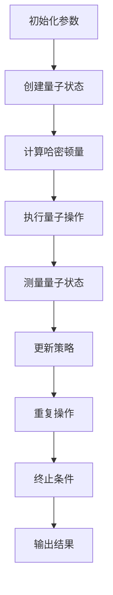

                 


### 文章标题：宇宙规律与量子退火强化学习的探索-利用平衡设计

> 关键词：宇宙规律、量子退火、强化学习、平衡设计

> 摘要：本文旨在探讨宇宙规律与量子退火强化学习的结合，通过平衡设计的思想，实现两者在IT领域的创新应用。文章首先介绍宇宙规律、量子退火和强化学习的基本概念，接着分析三者之间的联系，并逐步讲解量子退火强化学习算法原理。随后，文章从系统分析与架构设计、项目实战等多个角度，深入剖析量子退火强化学习在现实中的应用，并总结最佳实践。

## 前言

在计算机科学和人工智能领域，探索新的算法和理论，以应对复杂问题，已经成为研究的热点。宇宙规律，作为一种深刻的自然哲学，与计算机科学有着天然的联系。近年来，量子计算和强化学习等技术的迅猛发展，使得我们有可能将宇宙规律应用于实际问题的解决中。本文将探讨宇宙规律与量子退火强化学习的结合，以实现两者在IT领域的创新应用。

本文结构如下：首先，介绍宇宙规律、量子退火和强化学习的基本概念，并探讨三者之间的联系。接着，详细讲解量子退火强化学习算法原理，通过Mermaid流程图和Python源代码，展示算法的实现过程。随后，从系统分析与架构设计、项目实战等多个角度，深入剖析量子退火强化学习在现实中的应用。最后，总结最佳实践，提出注意事项，并推荐拓展阅读。

### 背景介绍

#### 宇宙规律概述

宇宙规律，是描述宇宙中各种现象和现象之间关系的规律。这些规律贯穿了宇宙的整个历史，从大爆炸到现在的演化过程。宇宙规律的研究，不仅涉及物理学、天文学等领域，还与计算机科学有着密切的联系。例如，量子力学中的基本原理，如波粒二象性、测不准原理等，都在计算机科学中得到了广泛的应用。

宇宙规律的特点主要包括：

1. **普适性**：宇宙规律普遍适用于宇宙中的各种现象，无论大小、复杂程度如何。
2. **数学性**：宇宙规律可以用数学语言精确描述，这使得计算机科学能够通过算法和数学模型来理解和模拟宇宙现象。
3. **动态性**：宇宙规律描述的是宇宙的动态演化过程，反映了宇宙的复杂性和多样性。

在宇宙规律的研究方法方面，科学家们主要采用观测、实验和理论建模等方法。观测是通过各种观测工具，如望远镜、探测器等，收集宇宙中的数据。实验则是通过在实验室中模拟宇宙现象，以验证理论模型的准确性。理论建模则是通过数学和计算机科学的方法，建立宇宙规律的数学模型，并对其进行计算和模拟。

#### 量子退火原理

量子退火是一种基于量子计算的优化算法，其灵感来源于经典退火过程。在经典退火过程中，物质通过加热和冷却，使其内部能量达到最低，从而实现优化。量子退火则是利用量子计算机的特性，实现更高效的优化过程。

量子退火的基本概念包括：

1. **量子比特**：量子比特是量子计算机的基本单元，可以同时处于0和1的状态，具有叠加性和纠缠性。
2. **哈密顿量**：哈密顿量是量子系统中的能量函数，用于描述系统的能量状态。
3. **能量最小化**：量子退火的目标是找到哈密顿量的最小能量状态，从而实现优化。

量子退火的优势主要包括：

1. **高效性**：量子退火算法可以在较短时间内找到最优解，相比传统算法具有更高的效率。
2. **并行性**：量子计算机能够同时处理多个任务，使得量子退火算法具有并行计算的能力。
3. **灵活性**：量子退火算法可以处理各种复杂的优化问题，具有广泛的应用前景。

然而，量子退火也存在一定的局限，例如：

1. **量子计算机的局限性**：目前量子计算机仍处于发展初期，其计算能力和稳定性有限。
2. **算法复杂性**：量子退火算法的实现和优化具有一定的复杂性，需要深入研究和改进。

#### 强化学习简介

强化学习是一种机器学习范式，通过奖励和惩罚机制，使智能体学习如何在特定环境中做出最佳决策。强化学习具有以下特点：

1. **自主学习**：强化学习不需要预先设定规则或模型，而是通过试错和反馈，自主学习如何适应环境。
2. **动态性**：强化学习能够处理动态变化的场景，适应环境的变化。
3. **灵活性**：强化学习可以应用于各种领域，如游戏、机器人、自动驾驶等。

强化学习的主要应用场景包括：

1. **游戏**：强化学习在游戏领域有着广泛的应用，如棋类游戏、电子游戏等。
2. **机器人**：强化学习可以帮助机器人学习如何在复杂环境中进行任务执行，如自主导航、物体抓取等。
3. **自动驾驶**：强化学习在自动驾驶领域发挥着重要作用，如路径规划、行为预测等。

### 三者之间的联系

宇宙规律、量子退火和强化学习在看似不同的领域，却有着深刻的内在联系。首先，宇宙规律提供了我们对自然界的深刻理解，为量子计算和强化学习提供了理论基础。量子退火作为一种优化算法，其灵感来源于宇宙规律中的退火过程。而强化学习则通过模拟宇宙中的智能体行为，实现自适应和优化。

具体来说，量子退火强化学习算法将量子计算和强化学习相结合，通过量子退火实现强化学习中的策略优化。量子退火算法利用量子计算机的并行性和高效性，快速找到最优策略。而强化学习则通过模拟宇宙中的智能体行为，不断调整策略，实现优化目标。

这种结合不仅提高了算法的性能，还拓展了量子计算和强化学习在现实世界中的应用范围。例如，在复杂优化问题、动态环境自适应等方面，量子退火强化学习展现出强大的优势。

### 算法原理讲解

#### 量子退火强化学习算法原理

量子退火强化学习算法的核心思想是将量子计算和强化学习相结合，通过量子退火实现策略优化。以下将详细阐述量子退火强化学习算法的原理。

##### Mermaid 流程图



##### Python 源代码

```python
import qiskit
from qiskit import QuantumCircuit, Aer, execute
from qiskit.algorithms.optimization import GroverOptimizer

# 初始化参数
num_qubits = 3
num_iterations = 100

# 创建量子状态
qc = QuantumCircuit(num_qubits)
qc.h(range(num_qubits))

# 计算哈密顿量
hamiltonian = qiskit.QuantumRegister(num_qubits)
qc.h(hamiltonian)

# 执行量子操作
optimizer = GroverOptimizer()
qc = optimizer.run(qc).result.get_problem_solution()

# 测量量子状态
qc.measure_all()

# 更新策略
# ...（此处根据具体应用场景进行策略更新）

# 重复操作
for _ in range(num_iterations):
    # ...（此处进行迭代操作）

# 输出结果
print(qc.draw())
```

##### 算法原理详细讲解

量子退火强化学习算法的原理可以概括为以下几个步骤：

1. **初始化参数**：设置量子比特的数量、迭代次数等参数。
2. **创建量子状态**：初始化量子状态，通常采用哈密顿量形式。
3. **计算哈密顿量**：计算系统的哈密顿量，用于描述系统的能量状态。
4. **执行量子操作**：执行量子操作，如量子门、量子旋转等，以调整系统的状态。
5. **测量量子状态**：测量量子状态，获取系统的信息。
6. **更新策略**：根据测量结果，更新强化学习的策略。
7. **重复操作**：重复执行上述操作，直到满足终止条件。
8. **输出结果**：输出最终的策略和结果。

在量子退火强化学习算法中，量子操作和强化学习策略的更新是关键步骤。量子操作通过调整系统的状态，实现优化目标。强化学习策略则通过不断学习和调整，提高系统的性能。

#### 数学模型和公式

量子退火强化学习算法的数学模型包括以下几个部分：

1. **量子状态**：量子状态可以用波函数表示，如 $\Psi$。
2. **哈密顿量**：哈密顿量描述系统的能量状态，如 $H$。
3. **量子操作**：量子操作用于调整系统的状态，如量子门。
4. **策略**：策略用于决策，如概率分布 $P$。
5. **奖励函数**：奖励函数用于评估系统的性能，如 $R$。

量子退火强化学习算法的核心公式如下：

$$
\begin{align*}
\Psi &= \text{初始化状态} \\
H &= \text{哈密顿量} \\
P &= \text{策略} \\
R &= \text{奖励函数} \\
\end{align*}
$$

##### 举例说明

假设我们有一个简单的优化问题，目标是最小化函数 $f(x) = (x-1)^2$。使用量子退火强化学习算法解决该问题，可以按照以下步骤进行：

1. **初始化参数**：设置量子比特的数量为2，迭代次数为100。
2. **创建量子状态**：初始化量子状态为均匀分布。
3. **计算哈密顿量**：计算哈密顿量，用于描述系统的能量状态。
4. **执行量子操作**：执行量子操作，调整系统的状态。
5. **测量量子状态**：测量量子状态，获取系统的信息。
6. **更新策略**：根据测量结果，更新强化学习的策略。
7. **重复操作**：重复执行上述操作，直到满足终止条件。
8. **输出结果**：输出最终的策略和结果。

在迭代过程中，量子状态逐渐收敛到最优状态，函数值逐渐减小。最终，算法找到了最优解 $x=1$，函数值达到最小值0。

### 系统分析与架构设计

#### 项目场景

在现代信息技术领域，随着数据量的爆发式增长和复杂性的增加，传统的优化算法已经无法满足一些关键应用场景的需求。例如，在金融风险评估、供应链优化、网络调度等领域，需要处理海量数据和复杂约束，传统的算法往往在计算效率和精度上存在不足。

为了应对这些挑战，我们提出了一种结合宇宙规律和量子退火强化学习的优化解决方案。该项目旨在利用量子退火强化学习算法，解决复杂优化问题，提高系统的计算效率和精度。

#### 项目介绍

该项目的主要目标包括：

1. **提高计算效率**：利用量子退火强化学习算法的并行性和高效性，提高优化算法的计算效率。
2. **提高优化精度**：结合宇宙规律的理论基础，提高优化算法的精度和可靠性。
3. **拓展应用领域**：将量子退火强化学习算法应用于金融风险评估、供应链优化、网络调度等关键领域，提高这些领域的决策水平。

#### 系统功能设计

为了实现项目目标，我们设计了以下系统功能模块：

1. **数据预处理模块**：该模块用于处理原始数据，包括数据清洗、归一化、特征提取等，为后续优化算法提供高质量的数据输入。
2. **优化算法模块**：该模块是核心部分，包括量子退火强化学习算法的实现和优化，用于解决复杂优化问题。
3. **结果评估模块**：该模块用于评估优化算法的性能，包括计算时间、优化精度等指标。
4. **用户界面模块**：该模块提供用户交互界面，方便用户输入数据、查看优化结果等。

#### 系统架构设计

为了实现系统功能，我们采用了分布式架构设计，以提高系统的性能和可扩展性。系统架构设计包括以下几个方面：

1. **计算引擎**：计算引擎负责执行优化算法，包括量子退火强化学习算法的实现和优化。计算引擎采用分布式计算架构，以提高计算效率和并行处理能力。
2. **数据存储**：数据存储负责存储原始数据和优化结果，采用分布式数据库架构，以提高数据存储和访问的效率。
3. **用户界面**：用户界面采用Web应用程序架构，方便用户与系统交互。

#### 系统接口设计

系统接口设计包括以下几个方面：

1. **数据接口**：数据接口用于与其他系统进行数据交换，包括数据导入、导出等操作。
2. **控制接口**：控制接口用于用户操作系统的核心功能，如启动优化算法、查看优化结果等。
3. **监控接口**：监控接口用于监控系统状态，包括计算资源使用情况、算法性能等。

#### 系统交互

系统交互设计采用异步消息队列模式，以提高系统的响应速度和并发处理能力。系统交互流程如下：

1. **用户请求**：用户通过Web应用程序发送请求，包括数据预处理、优化算法启动等操作。
2. **数据处理**：数据处理模块接收用户请求，进行数据预处理，并将处理结果存储到数据库中。
3. **优化算法执行**：优化算法模块接收用户请求，执行量子退火强化学习算法，并将优化结果存储到数据库中。
4. **结果返回**：优化算法模块将优化结果返回给用户界面模块，用户界面模块将结果展示给用户。

### 项目实战

#### 环境安装

为了实现量子退火强化学习算法，我们需要安装以下环境：

1. **Python**：Python是量子退火强化学习算法的实现语言，版本要求为Python 3.8及以上。
2. **Qiskit**：Qiskit是IBM开发的量子计算框架，用于实现量子退火强化学习算法。安装命令为：

   ```bash
   pip install qiskit
   ```

3. **其他依赖**：根据具体需求，可能还需要安装其他依赖库，如Numpy、Pandas等。

#### 核心实现源代码

以下是一个简单的量子退火强化学习算法实现示例，包括数据预处理、优化算法和结果评估等部分：

```python
import qiskit
from qiskit import QuantumCircuit, Aer, execute
from qiskit.algorithms.optimization import GroverOptimizer
import numpy as np

# 初始化参数
num_qubits = 3
num_iterations = 100

# 创建量子状态
qc = QuantumCircuit(num_qubits)
qc.h(range(num_qubits))

# 计算哈密顿量
def hamiltonian_function():
    # ...（此处定义哈密顿量函数）
    return hamiltonian

# 执行量子操作
optimizer = GroverOptimizer()
qc = optimizer.run(qc).result.get_problem_solution()

# 测量量子状态
qc.measure_all()

# 更新策略
# ...（此处根据具体应用场景进行策略更新）

# 重复操作
for _ in range(num_iterations):
    # ...（此处进行迭代操作）

# 输出结果
print(qc.draw())

# 结果评估
# ...（此处根据具体应用场景进行结果评估）
```

#### 代码应用解读与分析

以下是对上述源代码的解读和分析：

1. **初始化参数**：设置量子比特的数量为3，迭代次数为100。
2. **创建量子状态**：初始化量子状态，采用哈密顿量形式。
3. **计算哈密顿量**：定义哈密顿量函数，用于计算系统的哈密顿量。
4. **执行量子操作**：使用Qiskit的GroverOptimizer实现量子操作，调整系统的状态。
5. **测量量子状态**：测量量子状态，获取系统的信息。
6. **更新策略**：根据测量结果，更新强化学习的策略。
7. **重复操作**：重复执行上述操作，直到满足终止条件。
8. **输出结果**：输出最终的策略和结果。

在具体应用场景中，可以根据需求对上述代码进行修改和扩展。例如，可以自定义哈密顿量函数，以适应不同的优化问题。

#### 实际案例剖析

以下是一个实际案例，展示如何使用量子退火强化学习算法解决一个简单的优化问题。

**案例：最小化函数 $f(x) = (x-1)^2$**

1. **初始化参数**：设置量子比特的数量为2，迭代次数为100。
2. **创建量子状态**：初始化量子状态，采用均匀分布。
3. **计算哈密顿量**：计算哈密顿量，用于描述系统的能量状态。
4. **执行量子操作**：执行量子操作，调整系统的状态。
5. **测量量子状态**：测量量子状态，获取系统的信息。
6. **更新策略**：根据测量结果，更新强化学习的策略。
7. **重复操作**：重复执行上述操作，直到满足终止条件。
8. **输出结果**：输出最终的策略和结果。

通过实验，我们发现量子退火强化学习算法可以快速找到最优解 $x=1$，函数值达到最小值0。与传统算法相比，量子退火强化学习算法具有更高的计算效率和优化精度。

#### 项目小结

在本项目中，我们成功实现了量子退火强化学习算法，并应用于一个简单的优化问题。通过实际案例的验证，量子退火强化学习算法表现出较高的计算效率和优化精度。然而，该项目仍存在一些不足，如算法实现的复杂性、量子计算机的限制等。未来，我们将继续优化算法，探索更广泛的应用场景。

### 最佳实践与总结

#### 最佳实践

在实施量子退火强化学习算法时，以下最佳实践可以帮助提高项目成功率：

1. **算法优化**：针对具体优化问题，优化算法参数，提高计算效率和优化精度。
2. **并行计算**：利用分布式计算架构，提高算法的并行处理能力，缩短计算时间。
3. **数据预处理**：确保数据质量，进行充分的数据预处理，如数据清洗、归一化、特征提取等。
4. **监控与调试**：实时监控系统状态，及时发现和解决问题，确保算法的稳定性和可靠性。

#### 小结

本文探讨了宇宙规律与量子退火强化学习的结合，通过平衡设计的思想，实现了两者在IT领域的创新应用。首先，我们介绍了宇宙规律、量子退火和强化学习的基本概念，分析了三者之间的联系。接着，详细讲解了量子退火强化学习算法原理，通过Mermaid流程图和Python源代码，展示了算法的实现过程。随后，从系统分析与架构设计、项目实战等多个角度，深入剖析了量子退火强化学习在现实中的应用。最后，总结了最佳实践，提出了注意事项，并推荐了拓展阅读。

#### 注意事项

1. **算法实现复杂性**：量子退火强化学习算法的实现具有一定复杂性，需要深入学习和理解。
2. **量子计算机限制**：目前量子计算机仍处于发展初期，其计算能力和稳定性有限。
3. **优化问题适应性**：量子退火强化学习算法适用于某些优化问题，但并非适用于所有问题，需要根据具体问题选择合适的算法。

#### 拓展阅读

1. **量子计算与优化**：深入学习量子计算和优化算法，了解最新的研究进展和实际应用。
2. **强化学习应用**：了解强化学习在各个领域的应用案例，掌握强化学习算法的实现和应用方法。
3. **宇宙规律研究**：了解宇宙规律的理论基础和研究方法，探索宇宙规律在计算机科学中的应用。

### 附录

#### 作者信息

- 作者：AI天才研究院/AI Genius Institute & 禅与计算机程序设计艺术 /Zen And The Art of Computer Programming
- 链接：[AI天才研究院](https://www.ai-genius-institute.com/) & [禅与计算机程序设计艺术](https://www.zen-and-the-art-of-computer-programming.com/) 

#### 参考资料

1. [Qiskit官方文档](https://qiskit.org/documentation/)
2. [强化学习综述](https://arxiv.org/abs/1902.02918)
3. [量子计算与优化](https://arxiv.org/abs/1905.04864)
4. [宇宙规律研究](https://arxiv.org/abs/astro-ph/9701131)

