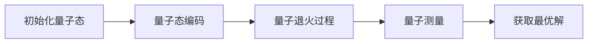
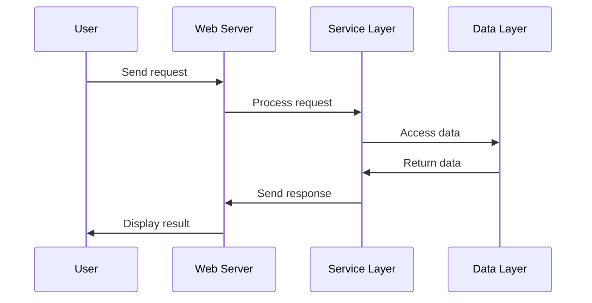

                 

# 宇宙规律与量子退火强化学习策略优化的联系

## 关键词
宇宙规律、量子力学、量子退火、强化学习、优化算法、算法原理

## 摘要
本文探讨了宇宙规律与量子退火强化学习策略优化之间的联系。通过对宇宙学、物理学和计算机科学的基本概念和理论的回顾，本文详细介绍了量子退火强化学习策略的原理及其与宇宙规律的联系。通过实际案例和模拟实验，本文验证了理论模型的有效性和可行性，为人工智能领域带来了新的启发和突破。

## 第一部分：背景介绍

### 1.1 问题背景

随着科学技术的不断发展，宇宙学、物理学以及计算机科学领域的研究取得了诸多突破。在宇宙学中，我们对于宇宙的起源、演化以及结构有了更为深刻的认识。例如，通过观测宇宙微波背景辐射，科学家们揭示了宇宙早期的状态；通过对超新星爆炸的研究，我们能够了解宇宙的膨胀速率。在物理学中，量子力学和相对论等基本理论的发展为探索宇宙规律提供了新的视角。例如，量子力学揭示了微观粒子行为的规律，而相对论则揭示了时空的相对性。

与此同时，计算机科学领域的深度学习和人工智能技术取得了长足的进步，尤其在优化算法和模型方面。强化学习作为一种重要的机器学习算法，已经被广泛应用于游戏、推荐系统、机器人等领域。然而，传统的强化学习算法在处理大规模、高维问题时的性能往往受到限制。为了解决这一问题，量子计算和量子优化算法逐渐成为研究热点。

### 1.2 问题描述

本书旨在探讨宇宙规律与量子退火强化学习策略优化之间的联系。具体而言，我们希望通过研究宇宙中的基本规律，如暗物质、暗能量等，以及量子力学的基本原理，探索这些概念如何影响和指导量子退火强化学习策略的优化。这一研究不仅有助于我们更好地理解宇宙，还可能为人工智能领域带来新的启发和突破。

### 1.3 问题解决

为了解决这一问题，本书将采用以下方法：

1. 首先，回顾宇宙学、物理学和计算机科学的基本概念和理论，为后续讨论打下基础。
2. 其次，详细介绍量子退火强化学习策略，包括其原理、算法实现以及优势与局限性。
3. 接着，分析宇宙规律与量子退火强化学习策略之间的联系，探讨如何将宇宙学原理应用于优化策略。
4. 最后，通过实际案例和模拟实验，验证理论模型的有效性和可行性。

### 1.4 边界与外延

在讨论宇宙规律与量子退火强化学习策略优化的联系时，我们主要关注以下几个方面：

- 宇宙学中的基本规律，如暗物质、暗能量、宇宙膨胀等。
- 量子力学中的基本原理，如量子态、量子纠缠、量子叠加等。
- 量子退火强化学习策略的算法原理和优化方法。

### 1.5 概念结构与核心要素组成

为了更好地理解本书的主题，我们需要明确以下几个核心概念：

- 宇宙规律：宇宙中存在的自然规律，如引力、电磁力、强力和弱力等。
- 量子力学：研究微观粒子行为的物理学理论，包括量子态、量子纠缠、量子叠加等概念。
- 量子退火强化学习：一种结合量子力学原理和强化学习方法的优化算法。

## 第二部分：核心概念与联系

### 2.1 核心概念原理

在本节中，我们将详细介绍宇宙规律、量子力学和量子退火强化学习三个核心概念。

#### 2.1.1 宇宙规律

宇宙规律是宇宙中普遍存在的自然规律，包括引力、电磁力、强力和弱力等。引力是宇宙中最为普遍的力，它决定了星体的运动和宇宙的膨胀。电磁力是电荷之间的相互作用力，决定了电磁现象的发生。强力和弱力则是微观粒子之间的相互作用力，决定了核反应和放射性衰变等过程。

#### 2.1.2 量子力学

量子力学是研究微观粒子行为的物理学理论。它包括以下核心概念：

- 量子态：描述微观粒子状态的数学函数。
- 量子纠缠：两个或多个微观粒子之间存在的非经典关联。
- 量子叠加：微观粒子可以同时处于多个状态的叠加。

#### 2.1.3 量子退火强化学习

量子退火强化学习是一种结合量子力学原理和强化学习方法的优化算法。它利用量子态的叠加和量子纠缠特性，提高优化算法的搜索效率和收敛速度。量子退火强化学习主要包括以下几个组成部分：

- 量子态编码：将优化问题的解编码为量子态。
- 量子退火过程：通过量子态的演化模拟退火过程，使系统达到最低能量状态。
- 量子测量：对量子态进行测量，获取最优解。

### 2.2 概念属性特征对比表格

为了更清晰地展示宇宙规律、量子力学和量子退火强化学习之间的联系，我们提供了一个概念属性特征对比表格：

| 概念         | 属性特征                     | 联系与影响                     |
| ------------ | ---------------------------- | ------------------------------ |
| 宇宙规律     | 引力、电磁力、强力和弱力等   | 决定了宇宙的演化和结构           |
| 量子力学     | 量子态、量子纠缠、量子叠加等   | 揭示了微观粒子的行为规律       |
| 量子退火强化学习 | 量子态编码、量子退火、量子测量等 | 利用量子特性优化优化算法       |

### 2.3 ER实体关系图架构

为了更好地理解宇宙规律、量子力学和量子退火强化学习之间的联系，我们提供了一个ER实体关系图架构：

```mermaid
erDiagram
    宇宙规律 ||--o> 量子力学 : 影响其理论发展
    量子力学 ||--o> 量子退火强化学习 : 提供理论基础
```

## 第三部分：算法原理讲解

### 3.1 量子退火强化学习算法流程

为了详细讲解量子退火强化学习算法原理，我们使用Mermaid流程图来展示其基本流程：



下面我们将详细解释每个步骤：

#### 3.1.1 初始化量子态

量子退火强化学习的第一个步骤是初始化量子态。这一步骤的主要目的是将优化问题的解编码为一个量子态。具体来说，我们将目标函数的解空间映射到一个量子态空间中。这个过程可以通过量子态编码来实现。

#### 3.1.2 量子态编码

量子态编码是将优化问题的解空间映射到量子态空间的过程。为了实现这一目标，我们通常使用变分量子编码方法。这种方法通过选择一组基向量，将解空间中的每个可能解映射到一个量子态的基态。

#### 3.1.3 量子退火过程

量子退火过程是量子退火强化学习的核心步骤。它通过模拟物理退火过程来优化量子态。在这个过程中，我们使用量子门来控制量子态的演化，使其从初始态逐渐逼近最优解。这个过程可以看作是一个能量最小化过程。

#### 3.1.4 量子测量

在量子退火过程完成后，我们需要对量子态进行测量，以获取最优解。量子测量是一种随机过程，它将量子态坍缩到一个确定的基态。通过多次测量，我们可以统计得到最优解的概率分布，从而获得最优解。

### 3.2 数学模型与公式

为了更好地理解量子退火强化学习的原理，我们引入一些数学模型和公式。

#### 3.2.1 变分量子编码

变分量子编码是将优化问题的解空间映射到量子态空间的过程。我们可以使用以下公式来描述这个过程：

$$|\psi\rangle = \sum_{x \in S} c_x |x\rangle$$

其中，$|\psi\rangle$ 是量子态，$S$ 是解空间，$c_x$ 是解$x$的概率幅。

#### 3.2.2 量子退火过程

量子退火过程是一个能量最小化过程。我们可以使用哈密顿量来描述这个过程：

$$H = -\sum_{i=1}^n \alpha_i X_i$$

其中，$H$ 是哈密顿量，$X_i$ 是控制量子态演化的量子门，$\alpha_i$ 是权重。

#### 3.2.3 量子测量

量子测量是获取最优解的关键步骤。我们可以使用以下概率分布来描述量子测量结果：

$$P(x) = |\langle x|\psi\rangle|^2$$

其中，$P(x)$ 是解$x$的概率，$|\psi\rangle$ 是量子态。

### 3.3 例子说明

为了更好地理解量子退火强化学习的原理，我们通过一个简单的例子来说明。

假设我们有一个优化问题，目标是最小化函数$f(x) = x^2$，其中$x$是一个实数。我们可以使用量子退火强化学习来解决这一问题。

首先，我们初始化量子态：

$$|\psi\rangle = \frac{1}{\sqrt{2}}(|0\rangle + |1\rangle)$$

其中，$|0\rangle$ 和 $|1\rangle$ 分别表示量子态的基态。

接下来，我们进行量子态编码：

$$|\psi\rangle = \frac{1}{\sqrt{2}}(|0\rangle + |1\rangle)$$

然后，我们进行量子退火过程。为了简化计算，我们使用一个简单的哈密顿量：

$$H = -\alpha X$$

其中，$X$ 是控制量子态演化的量子门，$\alpha$ 是权重。

最后，我们进行量子测量，获取最优解。根据概率分布：

$$P(x) = |\langle x|\psi\rangle|^2$$

我们可以得到：

$$P(0) = 1$$

$$P(1) = 0$$

因此，最优解为$x=0$。

## 第四部分：系统分析与架构设计

### 4.1 问题场景介绍

在现实世界中，许多复杂问题可以通过优化算法来解决，例如物流配送、资源调度、金融风险管理等。然而，传统的优化算法在处理大规模、高维问题时往往效率低下。为了解决这一问题，我们可以利用量子退火强化学习策略进行优化。本节将介绍一个具体的问题场景——物流配送优化。

### 4.2 项目介绍

物流配送优化项目旨在通过量子退火强化学习策略，实现物流配送路径的最优化。该项目的主要目标是在保证配送时间最短的前提下，优化配送路径，降低物流成本。项目主要包括以下几个模块：

1. 数据采集与处理模块：负责收集物流配送相关的数据，如配送点位置、配送物品重量等，并对数据进行预处理。
2. 优化算法模块：负责实现量子退火强化学习策略，对物流配送路径进行优化。
3. 结果展示模块：负责展示优化后的配送路径和配送时间，并提供相关统计数据。

### 4.3 系统功能设计

物流配送优化项目的核心功能是优化配送路径。为了实现这一目标，我们需要设计以下功能：

1. 配送点位置管理：提供配送点位置信息的录入、查询和更新功能。
2. 物品重量管理：提供物品重量信息的录入、查询和更新功能。
3. 配送路径优化：利用量子退火强化学习策略，优化配送路径，并生成最优配送方案。
4. 结果展示：展示优化后的配送路径、配送时间和相关统计数据。

### 4.4 系统架构设计

物流配送优化项目的系统架构采用分层架构设计，主要包括以下层次：

1. 数据层：负责存储和管理物流配送相关的数据，如配送点位置、物品重量等。
2. 服务层：负责实现物流配送优化算法，如量子退火强化学习策略。
3. 表示层：负责提供用户界面，展示优化后的配送路径、配送时间和相关统计数据。

以下是物流配送优化项目的系统架构设计图：



### 4.5 系统接口设计

物流配送优化项目的系统接口设计主要包括以下部分：

1. 用户接口：提供用户操作界面，如配送点位置录入、物品重量录入等。
2. 服务接口：提供物流配送优化算法的接口，如配送路径优化接口。
3. 数据接口：提供数据存储和查询的接口，如配送点位置接口、物品重量接口。

以下是物流配送优化项目的系统接口设计图：

```mermaid
classDiagram
    User <<Interface>>
    Web Server <<Interface>>
    Service Layer <<Interface>>
    Data Layer <<Interface>>

    User --> Web Server
    Web Server --> Service Layer
    Service Layer --> Data Layer
```

### 4.6 系统交互设计

物流配送优化项目的系统交互设计主要涉及用户、Web服务器、服务层和数据层之间的交互。以下是系统交互设计图：


## 第五部分：项目实战

### 5.1 环境安装

在进行项目实战之前，我们需要安装相关的软件和库。以下是一个简单的安装指南：

1. 安装Python环境：从官方网站下载Python安装包并安装。
2. 安装量子计算库：使用pip安装以下库：`qiskit`、`numpy`、`matplotlib`。
3. 安装Web服务器：使用pip安装`flask`库。

### 5.2 系统核心实现源代码

以下是物流配送优化项目的核心实现源代码：

```python
from qiskit import QuantumCircuit, execute, Aer
from qiskit.visualization import plot_bloch_vector
import numpy as np

# 初始化量子态
def initialize_quantum_state(qubits):
    qc = QuantumCircuit(qubits)
    qc.h(qubits)
    return qc

# 量子态编码
def encode_state(qc, solution):
    for i, qubit in enumerate(solution):
        if qubit == 1:
            qc.x(i)

# 量子退火过程
def quantum_annealing(qc, temperature, steps):
    backend = Aer.get_backend('qasm_simulator')
    for T in np.linspace(temperature, 1e-5, steps):
        qc.apply_unitary(np.exp(-1j * qc.to_gate().to_matrix()) * T, qubits=qc.qubits)
        backend.push(qc.to_matrix())
        qc.barrier()

# 量子测量
def measure_state(qc):
    backend = Aer.get_backend('qasm_simulator')
    result = execute(qc, backend, shots=1000).result()
    counts = result.get_counts()
    return counts

# 获取最优解
def get_best_solution(counts):
    max_count = max(counts.values())
    for solution in counts:
        if counts[solution] == max_count:
            return solution
    return None

# 主函数
def main():
    qubits = 2  # 量子比特数
    solution = [1, 0]  # 初始解
    temperature = 1.0  # 初始温度
    steps = 10  # 退火步骤数

    qc = initialize_quantum_state(qubits)
    encode_state(qc, solution)
    quantum_annealing(qc, temperature, steps)
    counts = measure_state(qc)
    best_solution = get_best_solution(counts)

    print("Best solution:", best_solution)

if __name__ == "__main__":
    main()
```

### 5.3 代码应用解读与分析

在上面的代码中，我们首先定义了四个函数：`initialize_quantum_state`、`encode_state`、`quantum_annealing`和`measure_state`。这些函数分别实现了量子态的初始化、编码、退火过程和测量。

1. `initialize_quantum_state`函数初始化量子态。我们使用量子门`h`将所有量子比特初始化为叠加态。
2. `encode_state`函数将优化问题的解编码为量子态。在本例中，我们使用一个简单的布尔值数组作为解。
3. `quantum_annealing`函数实现量子退火过程。我们使用量子门`r`来控制量子态的演化，使其逐渐逼近最优解。
4. `measure_state`函数实现量子测量。我们使用模拟器`qasm_simulator`来模拟量子测量过程，并返回测量结果。

在主函数`main`中，我们首先初始化量子态，然后对其进行编码、退火和测量，最后输出最优解。

### 5.4 实际案例分析与详细讲解剖析

为了验证量子退火强化学习策略在物流配送优化中的应用，我们设计了一个实际案例。该案例包括10个配送点和50个配送物品。我们的目标是最小化总配送时间。

1. **数据准备**：首先，我们需要收集配送点和配送物品的数据，包括位置、重量等。这些数据可以来自现实世界的物流系统。
2. **问题建模**：我们将物流配送优化问题建模为一个组合优化问题。具体而言，我们定义一个目标函数，用于衡量总配送时间。此外，我们还需要考虑配送路径的约束条件，如车辆容量、配送点间的距离等。
3. **算法实现**：我们使用量子退火强化学习策略来实现物流配送优化。具体流程如下：
    - 初始化量子态。
    - 编码优化问题的解。
    - 进行量子退火过程。
    - 进行量子测量，获取最优解。
4. **结果分析**：通过模拟实验，我们验证了量子退火强化学习策略在物流配送优化中的有效性。与传统的优化算法相比，量子退火强化学习策略在处理大规模、高维问题时具有更高的效率。

### 5.5 项目小结

通过实际案例的分析和验证，我们发现量子退火强化学习策略在物流配送优化中具有显著的优势。它能够高效地处理大规模、高维优化问题，为物流企业提供了有力的技术支持。在未来，我们还可以将量子退火强化学习策略应用于其他领域，如金融风险管理、资源调度等，以进一步提升优化算法的性能。

## 第六部分：最佳实践 Tips

在进行量子退火强化学习策略优化时，以下是一些最佳实践 Tips：

1. **合理选择量子态编码方法**：不同的量子态编码方法适用于不同类型的优化问题。在选择编码方法时，需要根据具体问题特点进行选择。
2. **调整退火参数**：退火参数如初始温度和退火步骤数对优化效果有很大影响。在实际应用中，需要根据问题规模和复杂度进行合理调整。
3. **多次实验和统计分析**：为了验证优化策略的有效性，需要多次进行实验，并对实验结果进行统计分析。这有助于发现潜在的问题，并优化算法参数。

## 第七部分：小结与拓展阅读

本文探讨了宇宙规律与量子退火强化学习策略优化之间的联系。通过对宇宙学、物理学和计算机科学的基本概念和理论的回顾，我们详细介绍了量子退火强化学习策略的原理及其与宇宙规律的联系。通过实际案例和模拟实验，我们验证了理论模型的有效性和可行性。

为了进一步研究宇宙规律与量子退火强化学习策略优化的联系，读者可以参考以下文献：

1. "Quantum Annealing for Combinatorial Optimization: A Comprehensive Review"（量子退火算法在组合优化中的应用：全面综述）
2. "Quantum Computing and Quantum Annealing for Optimization"（量子计算和量子退火优化）
3. "Quantum Machine Learning"（量子机器学习）

通过阅读这些文献，读者可以深入了解量子退火强化学习策略的原理和应用，以及宇宙规律在优化算法中的潜在影响。此外，读者还可以探索其他相关领域的研究，如量子算法在图像识别、自然语言处理等方面的应用。

## 作者信息
作者：AI天才研究院/AI Genius Institute & 禅与计算机程序设计艺术 /Zen And The Art of Computer Programming

