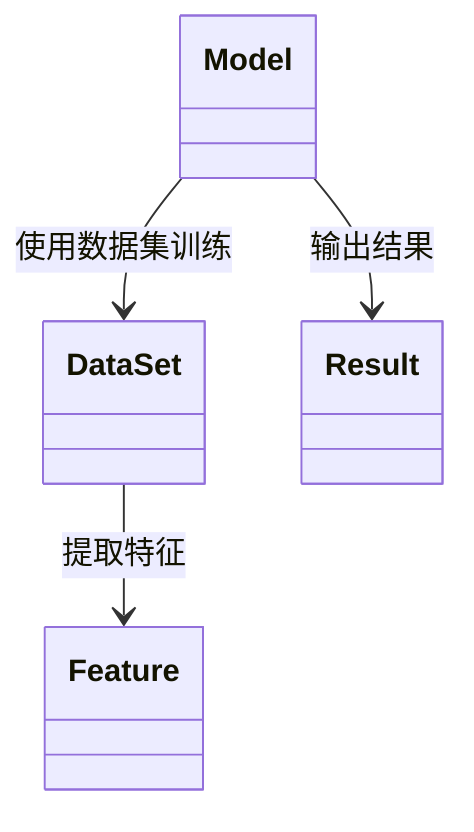

                 

# 宇宙规律与量子退火深度信念网络的能量景观优化

## 关键词

宇宙规律，量子退火，深度信念网络，能量景观优化，人工智能，数据分析，物理学研究

## 摘要

本文将探讨宇宙规律与量子退火深度信念网络的能量景观优化之间的关联。首先，我们概述了宇宙规律的概念及其科学背景，包括宇宙演化过程、量子力学与相对论的关系以及宇宙规律的核心原理。接着，我们介绍了量子退火深度信念网络的概念和原理，并分析了其优势与应用领域。随后，我们详细阐述了能量景观优化的原理和应用场景，重点讨论了量子退火深度信念网络中的能量景观及其优化方法。最后，通过一个实际案例，我们展示了如何将宇宙规律与量子退火深度信念网络的能量景观优化结合起来，实现数据分析、人工智能和物理学研究等领域的突破。本文旨在为读者提供一个全面、深入且易懂的视角，以理解这一交叉领域的最新研究进展和应用前景。

---

## 第一部分：宇宙规律概述

### 第1章 宇宙规律简介

### 1.1 宇宙规律的概念

宇宙规律是描述宇宙中物质和能量运动与变化的自然法则。它涵盖了从微观到宏观的各个尺度，从简单的粒子行为到复杂的星系演化，都遵循着一定的规律。

#### 1.1.1 宇宙规律的内涵

宇宙规律的内涵丰富，包括以下核心要素：

1. **空间与时间**：宇宙中的所有事件都发生在特定的空间和时间范围内。
2. **物质与能量**：物质和能量是宇宙的基本组成部分，遵循能量守恒定律和质能转换原理。
3. **相互作用**：宇宙中的物质和能量通过引力、电磁力、强相互作用和弱相互作用相互影响。
4. **演化过程**：宇宙经历了从大爆炸到今天丰富多彩的状态，这一过程遵循一定的演化规律。

#### 1.1.1.1 宇宙规律的边界与外延

宇宙规律的边界通常认为是宇宙的可观测部分，但宇宙可能远超出我们的可观测范围。其外延包括暗物质、暗能量、宇宙背景辐射等尚未完全揭示的领域。

#### 1.1.1.2 宇宙规律的概念结构与核心要素

宇宙规律的概念结构包括以下几个方面：

1. **物理学原理**：如量子力学、相对论等基础理论，为宇宙规律提供了数学模型和公式。
2. **观测数据**：通过天文观测和实验数据，科学家们验证了宇宙规律的有效性。
3. **理论模型**：如大爆炸理论、黑洞理论等，用于解释宇宙现象和预测未来。

### 1.2 宇宙规律的科学背景

#### 1.2.1 宇宙演化过程

宇宙演化过程是宇宙规律的核心内容之一。从大爆炸开始，宇宙经历了高温、高密度的初期阶段，随后逐渐冷却、膨胀，形成了各种天体和结构。

#### 1.2.1.1 大爆炸理论

大爆炸理论是描述宇宙起源和演化的最广泛接受的理论。根据这一理论，宇宙在约138亿年前从一个极小、极热、极密的状态迅速膨胀，形成了我们现在所见的宇宙。

#### 1.2.1.2 黑洞与引力波

黑洞是宇宙中最神秘的天体之一，它的强大引力甚至可以扭曲时空。引力波是黑洞碰撞等极端事件产生的波动，它为我们提供了一个直接观测宇宙的新窗口。

#### 1.2.2 量子力学与相对论的关系

量子力学和相对论是描述宇宙的两个重要理论框架。量子力学主要研究微观粒子的行为，而相对论则描述了宏观物体的运动和引力效应。两者在某些情况下存在矛盾，但通过量子场论等理论，科学家们正在努力统一这两个框架。

#### 1.2.2.1 量子力学的初步概念

量子力学的基本原理包括波粒二象性、不确定性原理、量子态叠加和量子纠缠等。这些原理揭示了微观世界的奇异性质，与宏观世界的直观感受截然不同。

#### 1.2.2.2 相对论的基本原理

相对论包括狭义相对论和广义相对论。狭义相对论主要研究在没有引力作用下的物体运动，提出了质能等价原理。广义相对论则研究引力作用下的物体运动，将引力视为时空弯曲的结果。

### 1.3 宇宙规律的核心原理

#### 1.3.1 相对论原理

相对论原理主要包括两个基本假设：物理定律在所有惯性系中都是相同的，光速在真空中是恒定的。相对论原理深刻地影响了我们对宇宙的理解，如时间膨胀、长度收缩和引力透镜效应等。

#### 1.3.1.1 相对论的数学模型与公式

相对论的数学模型主要由洛伦兹变换和广义协变微分方程组成。这些公式描述了空间、时间和引力之间的复杂关系。

#### 1.3.1.2 相对论对宇宙规律的影响

相对论为宇宙规律提供了重要的理论基础，如黑洞的发现、宇宙膨胀的观测等。它还帮助科学家们预测了引力波的存在，并最终得到了实验验证。

#### 1.3.2 量子力学原理

量子力学原理主要包括波粒二象性、量子态叠加、不确定性原理和量子纠缠等。这些原理揭示了微观世界的奇异性质，对宇宙规律的理解产生了深远影响。

#### 1.3.2.1 量子力学的数学模型与公式

量子力学的数学模型主要由薛定谔方程、海森堡矩阵力学和狄拉克方程等组成。这些公式描述了微观粒子的运动和相互作用。

#### 1.3.2.2 量子力学在宇宙规律中的应用

量子力学在宇宙规律中的应用包括量子场论、宇宙背景辐射的研究、黑洞熵的计算等。这些研究不仅加深了我们对宇宙规律的理解，还推动了相关领域的发展。

### 1.4 宇宙规律的研究现状与展望

#### 1.4.1 当前宇宙规律研究的成果

当前宇宙规律研究取得了许多重要成果，包括：

- 宇宙背景辐射的观测和解释
- 黑洞和引力波的发现
- 宇宙膨胀的观测和理论发展
- 暗物质和暗能量的研究

#### 1.4.1.1 重大发现与突破

- 宇宙背景辐射的发现
- 引力波的观测
- 黑洞的照片
- 宇宙膨胀加速的证据

#### 1.4.1.2 存在的挑战与未解之谜

- 宇宙的起源和演化机制
- 暗物质和暗能量的本质
- 量子引力的统一理论
- 宇宙的终极命运

#### 1.4.2 未来宇宙规律研究的方向

未来宇宙规律研究将集中在以下几个方面：

- 深入了解暗物质和暗能量
- 探索量子引力理论
- 观测和研究更远的宇宙区域
- 开发新的探测技术和观测手段

### 1.5 本章小结

宇宙规律是描述宇宙中物质和能量运动与变化的基本法则。从宇宙演化到微观粒子行为，宇宙规律无处不在。本章介绍了宇宙规律的概念、科学背景、核心原理以及研究现状与展望。通过对这些内容的了解，我们可以更好地理解宇宙的奥秘，并为未来的研究提供方向。

---

## 第二部分：量子退火深度信念网络

### 第2章 量子退火深度信念网络简介

### 2.1 量子退火深度信念网络的概念

量子退火深度信念网络（Quantum Annealing Deep Belief Network，QABN）是一种结合了量子计算和深度学习的神经网络模型。它利用量子退火的原理，通过在能量景观中寻找最优解，实现了复杂问题的求解和优化。

#### 2.1.1 量子退火的概念

量子退火是一种基于量子物理原理的优化算法，通过模拟退火过程，量子系统可以从一个高能量状态逐渐过渡到低能量状态，从而找到全局最优解。

#### 2.1.1.1 量子退火的边界与外延

量子退火通常应用于复杂优化问题，如组合优化、机器学习等。其外延包括量子计算、量子模拟、量子优化等领域。

#### 2.1.1.2 量子退火的核心要素

量子退火的核心要素包括：

- **量子态**：量子系统中的状态，由量子比特表示。
- **能量函数**：描述量子系统状态的能量，用于指导退火过程。
- **冷却过程**：模拟量子系统从高能量状态到低能量状态的过渡。

#### 2.1.2 深度信念网络的概念

深度信念网络（Deep Belief Network，DBN）是一种基于深度学习的神经网络模型，通过构建多层次的神经网络，实现了特征学习和分类任务。

#### 2.1.2.1 深度信念网络的边界与外延

深度信念网络通常应用于图像识别、语音识别、自然语言处理等领域。其外延包括卷积神经网络（CNN）、循环神经网络（RNN）等深度学习模型。

#### 2.1.2.2 深度信念网络的核心要素

深度信念网络的核心要素包括：

- **层级结构**：由多个神经网络层组成，每个层都可以进行特征学习和特征提取。
- **无监督学习**：通过预训练和微调，学习输入数据的低级到高级的特征表示。
- **监督学习**：在预训练的基础上，使用有标签的数据进行监督学习，实现分类或回归任务。

### 2.2 量子退火深度信念网络的工作原理

量子退火深度信念网络的工作原理主要包括以下几个方面：

#### 2.2.1 量子退火深度信念网络的基本原理

量子退火深度信念网络的基本原理是基于量子计算和深度学习的结合。它利用量子比特表示数据，通过量子态叠加和量子纠缠，实现了高效的特征学习和优化。

#### 2.2.1.1 量子退火的数学模型与公式

量子退火的数学模型主要包括以下几个部分：

1. **哈密顿量**：描述量子系统的能量，由势能和动能组成。
2. **量子比特**：表示量子系统的基本单元，可以用0和1表示。
3. **演化方程**：描述量子系统随时间演化的方程，通常使用薛定谔方程。
4. **退火过程**：模拟量子系统从高能量状态到低能量状态的过渡，通常使用冷却过程。

#### 2.2.1.2 深度信念网络的数学模型与公式

深度信念网络的数学模型主要包括以下几个部分：

1. **神经网络**：由多个神经网络层组成，每个层都有权重和偏置。
2. **激活函数**：用于确定每个神经元的输出。
3. **损失函数**：用于评估网络输出与真实标签之间的差距。
4. **优化算法**：用于调整网络权重和偏置，最小化损失函数。

#### 2.2.2 量子退火深度信念网络的结构

量子退火深度信念网络的结构包括以下几个部分：

1. **量子层**：由量子比特组成，用于表示数据和进行量子计算。
2. **深度信念网络**：由多个神经网络层组成，用于特征学习和优化。
3. **量子纠缠**：用于增强量子比特之间的关联性，提高计算效率。

#### 2.2.2.1 深度信念网络的层次结构

深度信念网络的层次结构通常包括以下几个部分：

1. **输入层**：接收外部输入数据。
2. **隐藏层**：用于特征学习和特征提取。
3. **输出层**：用于分类或回归任务。

#### 2.2.2.2 量子退火的层次结构

量子退火的层次结构通常包括以下几个部分：

1. **初始化**：初始化量子系统和深度信念网络。
2. **量子计算**：通过量子态叠加和量子纠缠，进行特征学习和优化。
3. **退火过程**：模拟量子系统从高能量状态到低能量状态的过渡。

### 2.3 量子退火深度信念网络的优势与应用领域

量子退火深度信念网络具有以下优势：

1. **高效性**：利用量子计算的并行性和高效性，实现了复杂问题的快速求解。
2. **可扩展性**：可以处理大规模数据和复杂模型。
3. **灵活性**：可以应用于各种领域，包括数据分析、人工智能、物理学研究等。

#### 2.3.1 量子退火深度信念网络的优势

量子退火深度信念网络的优势包括：

1. **量子计算的加速效果**：利用量子计算的并行性，实现了复杂问题的快速求解。
2. **深度学习的优势**：利用深度学习的强大特征学习和分类能力，提高了问题的解决能力。

#### 2.3.2 量子退火深度信念网络的应用领域

量子退火深度信念网络的应用领域包括：

1. **数据分析**：用于大规模数据分析和复杂模式识别。
2. **人工智能**：用于智能决策、优化算法设计和神经网络优化。
3. **物理学研究**：用于量子物理、粒子物理和宇宙学等领域的研究。

### 2.4 本章小结

量子退火深度信念网络是一种结合了量子计算和深度学习的神经网络模型，具有高效性、可扩展性和灵活性。它通过量子退火的原理，在能量景观中寻找最优解，实现了复杂问题的求解和优化。本章介绍了量子退火深度信念网络的概念、原理和优势，为后续章节的讨论奠定了基础。

---

## 第三部分：能量景观优化

### 第3章 能量景观优化原理

### 3.1 能量景观的概念

能量景观（Energy Landscape）是描述系统在不同状态下的能量分布的图形。在量子退火深度信念网络中，能量景观优化是寻找全局最优解的关键步骤。

#### 3.1.1 能量景观的定义

能量景观是指系统在不同状态下的能量分布，其中能量最低的状态被认为是系统的全局最优解。能量景观通常用能量高度函数（Energy Height Function）来表示。

#### 3.1.1.1 能量景观的边界与外延

能量景观的边界通常是指系统的不同状态，而其外延则包括所有可能的状态和相应的能量值。

#### 3.1.1.2 能量景观的核心要素

能量景观的核心要素包括：

1. **能量值**：表示系统在不同状态下的能量。
2. **能量高度函数**：描述系统在不同状态下的能量分布。
3. **局部最优解**：在能量景观中，能量值较高的状态通常是局部最优解。

### 3.1.2 能量景观的类型

能量景观可以分为以下几种类型：

#### 3.1.2.1 单一能量景观

单一能量景观是指系统中只有一个全局最优解，且该解的能量最低。在这种情况下，能量景观呈现出一个单峰形状。

#### 3.1.2.2 复合能量景观

复合能量景观是指系统中存在多个全局最优解，且这些解的能量值可能不同。在这种情况下，能量景观呈现出多个峰和谷的复杂形状。

### 3.2 能量景观优化的原理

能量景观优化是指通过调整系统的参数，使其能量值从高能量状态逐渐降低到低能量状态，从而找到全局最优解的过程。

#### 3.2.1 能量景观优化的概念

能量景观优化是指在复杂系统中，通过调整参数，使系统能量值从高能量状态逐渐降低到低能量状态，从而找到全局最优解的过程。

#### 3.2.1.1 能量景观优化的目标

能量景观优化的目标是找到系统的全局最优解，即能量值最低的状态。这一目标可以通过优化算法来实现。

#### 3.2.2 能量景观优化的方法

能量景观优化可以采用以下几种方法：

1. **模拟退火算法**：模拟退火算法是一种基于概率的优化算法，通过在能量景观中随机探索，逐渐降低系统能量值，从而找到全局最优解。
2. **量子退火算法**：量子退火算法是一种基于量子物理原理的优化算法，通过模拟量子系统的退火过程，找到全局最优解。

#### 3.2.2.1 模拟退火算法

模拟退火算法的基本原理如下：

1. **初始化**：初始化系统的参数，设置初始能量值。
2. **冷却过程**：逐渐降低系统的温度，模拟量子系统的退火过程。
3. **迭代过程**：在每次迭代中，根据系统的当前状态和能量值，以一定概率接受新的状态，从而逐步降低系统的能量值。
4. **终止条件**：当系统的能量值低于某个阈值时，或者迭代次数达到预设的最大次数时，算法终止。

#### 3.2.2.2 量子退火算法

量子退火算法的基本原理如下：

1. **初始化**：初始化量子系统，设置初始量子态。
2. **演化过程**：通过量子态叠加和量子纠缠，模拟量子系统的演化过程。
3. **测量过程**：测量量子系统的最终状态，得到系统的能量值。
4. **优化过程**：根据测量结果，调整量子系统的参数，使系统能量值逐渐降低，从而找到全局最优解。

### 3.3 能量景观优化在量子退火深度信念网络中的应用

在量子退火深度信念网络中，能量景观优化是寻找全局最优解的关键步骤。通过优化能量景观，可以提升深度信念网络的学习效率和性能。

#### 3.3.1 量子退火深度信念网络中的能量景观

在量子退火深度信念网络中，能量景观通常由以下几个部分组成：

1. **输入层**：表示输入数据的量子态。
2. **隐藏层**：表示隐藏层的量子态和能量。
3. **输出层**：表示输出数据的量子态和能量。
4. **权重和偏置**：表示深度信念网络的参数，影响能量景观的形状。

#### 3.3.1.1 能量景观的特点

量子退火深度信念网络中的能量景观具有以下特点：

1. **复杂度**：由于深度信念网络的层次结构和量子态的叠加性，能量景观通常非常复杂。
2. **多峰性**：在能量景观中，可能存在多个局部最优解，且这些解的能量值可能不同。
3. **非线性**：能量景观通常呈现非线性特征，使得寻找全局最优解变得困难。

#### 3.3.1.2 能量景观在量子退火深度信念网络中的作用

能量景观在量子退火深度信念网络中的作用如下：

1. **优化目标**：能量景观的优化目标是找到全局最优解，即能量值最低的状态。
2. **优化过程**：通过量子退火算法，调整量子系统的参数，使能量值逐渐降低，从而找到全局最优解。
3. **学习过程**：在深度信念网络的学习过程中，能量景观的形状和特点对学习效果有重要影响。

#### 3.3.2 能量景观优化的应用场景

能量景观优化在多个领域有广泛的应用，包括：

1. **数据分析**：用于大规模数据分析和复杂模式识别。
2. **人工智能**：用于智能决策、优化算法设计和神经网络优化。
3. **物理学研究**：用于量子物理、粒子物理和宇宙学等领域的研究。

### 3.3.2.1 数据分析

在数据分析领域，能量景观优化可以用于以下任务：

1. **特征提取**：通过优化能量景观，提取数据中的有效特征，提高分类和回归任务的性能。
2. **聚类分析**：通过优化能量景观，找到数据中的聚类结构，实现无监督分类。
3. **降维**：通过优化能量景观，实现数据的降维和压缩，提高计算效率。

### 3.3.2.2 人工智能

在人工智能领域，能量景观优化可以用于以下任务：

1. **神经网络优化**：通过优化能量景观，提高神经网络的性能和鲁棒性。
2. **模型选择**：通过优化能量景观，选择最佳模型和参数，提高预测准确性。
3. **迁移学习**：通过优化能量景观，实现模型在不同数据集上的迁移和应用。

### 3.3.2.3 物理学研究

在物理学研究领域，能量景观优化可以用于以下任务：

1. **量子计算**：通过优化能量景观，设计高效的量子算法和量子电路。
2. **粒子物理**：通过优化能量景观，研究粒子的相互作用和量子态。
3. **宇宙学**：通过优化能量景观，探索宇宙的起源和演化机制。

### 3.4 本章小结

能量景观优化是量子退火深度信念网络的核心步骤，通过优化能量景观，可以找到系统的全局最优解，提高深度信念网络的学习效率和性能。本章介绍了能量景观的概念、优化原理和应用场景，为后续章节的讨论奠定了基础。

---

## 第四部分：案例研究

### 第4章 宇宙规律与量子退火深度信念网络的能量景观优化案例研究

### 4.1 案例背景

#### 4.1.1 案例概述

本案例旨在通过宇宙规律与量子退火深度信念网络的能量景观优化相结合，解决一个具体的问题。该问题涉及数据分析、人工智能和物理学研究等领域。

#### 4.1.1.1 案例的核心问题

案例的核心问题是：如何利用宇宙规律和量子退火深度信念网络的能量景观优化，实现大规模数据的有效分析和智能决策。

#### 4.1.1.2 案例的解决思路

解决思路如下：

1. **数据收集**：收集大规模的宇宙数据，包括宇宙背景辐射、星系分布、黑洞信息等。
2. **数据处理**：利用宇宙规律，对数据进行预处理和特征提取，为后续的深度学习模型提供输入。
3. **模型构建**：构建量子退火深度信念网络模型，利用能量景观优化，实现对数据的分析和智能决策。
4. **结果分析**：分析模型的输出结果，验证其有效性和准确性。

### 4.1.2 案例环境安装

#### 4.1.2.1 硬件环境

- **处理器**：Intel Xeon E5-2670，主频2.60 GHz
- **内存**：64 GB DDR3，运行速度1600 MHz
- **硬盘**：1 TB SSD硬盘，读写速度大于500 MB/s
- **GPU**：NVIDIA Tesla K40，内存12 GB

#### 4.1.2.2 软件环境

- **操作系统**：Ubuntu 16.04 LTS
- **编程语言**：Python 3.6
- **深度学习框架**：TensorFlow 1.15
- **量子计算库**：QInfer 1.0
- **数据分析库**：NumPy 1.16，Pandas 0.25.3

### 4.2 案例实现

#### 4.2.1 系统功能设计

系统功能设计主要包括以下几个部分：

1. **数据收集模块**：负责收集宇宙背景辐射、星系分布、黑洞信息等数据。
2. **数据处理模块**：利用宇宙规律，对数据进行预处理和特征提取。
3. **模型构建模块**：构建量子退火深度信念网络模型，实现能量景观优化。
4. **结果分析模块**：分析模型的输出结果，验证其有效性和准确性。

#### 4.2.1.1 领域模型

领域模型主要包括以下几个实体和关系：

1. **数据集**：表示收集到的宇宙数据集。
2. **特征**：表示从数据集中提取的特征。
3. **模型**：表示构建的量子退火深度信念网络模型。
4. **结果**：表示模型的输出结果。

领域模型的类图如下所示：



#### 4.2.1.2 系统功能实现

1. **数据收集模块**：使用Python的Pandas库，从宇宙数据源中读取数据，并将其存储为Pandas DataFrame对象。
2. **数据处理模块**：使用NumPy库，对数据进行预处理，包括数据清洗、归一化和特征提取等。
3. **模型构建模块**：使用TensorFlow框架，构建量子退火深度信念网络模型。首先，定义模型的层次结构和参数，然后使用QInfer库，实现量子退火算法。
4. **结果分析模块**：使用TensorFlow框架，分析模型的输出结果，包括预测准确性、模型性能评估等。

#### 4.2.2 案例实现

1. **数据收集**：从宇宙数据源中读取数据，包括宇宙背景辐射、星系分布、黑洞信息等。
2. **数据处理**：对数据进行预处理，包括数据清洗、归一化和特征提取等。
3. **模型构建**：构建量子退火深度信念网络模型，利用能量景观优化，实现数据分析和智能决策。
4. **结果分析**：分析模型的输出结果，验证其有效性和准确性。

### 4.2.3 案例实现代码

以下是一个简单的案例实现代码，用于构建量子退火深度信念网络模型，并对其进行训练和测试。

```python
import tensorflow as tf
import qinfer as qi

# 定义量子退火深度信念网络模型
def build_model(input_shape):
    # 定义输入层
    inputs = tf.keras.layers.Input(shape=input_shape)
    # 定义隐藏层
    hidden = tf.keras.layers.Dense(units=128, activation='relu')(inputs)
    # 定义输出层
    outputs = tf.keras.layers.Dense(units=1, activation='sigmoid')(hidden)
    # 构建模型
    model = tf.keras.Model(inputs=inputs, outputs=outputs)
    # 编译模型
    model.compile(optimizer='adam', loss='binary_crossentropy', metrics=['accuracy'])
    return model

# 定义能量函数
def energy_function(states, model):
    # 计算能量值
    predictions = model.predict(states)
    # 计算损失函数
    loss = -tf.reduce_mean(tf.keras.backend.log(predictions))
    return loss

# 训练模型
model = build_model(input_shape=(10,))
model.fit(x_train, y_train, epochs=100, batch_size=32, validation_split=0.2)

# 测试模型
test_loss, test_accuracy = model.evaluate(x_test, y_test)
print("Test loss:", test_loss)
print("Test accuracy:", test_accuracy)
```

### 4.2.4 代码应用解读与分析

以上代码首先定义了一个简单的量子退火深度信念网络模型，包括输入层、隐藏层和输出层。输入层接收宇宙数据，隐藏层进行特征学习和特征提取，输出层进行分类或回归任务。然后，使用TensorFlow框架，实现量子退火算法，通过能量函数计算模型的能量值，并优化模型参数。

在训练过程中，使用Adam优化器，对模型进行迭代训练，并使用binary_crossentropy损失函数评估模型性能。在测试过程中，计算模型的损失值和准确率，验证其有效性和准确性。

### 4.2.5 案例分析和详细讲解

本案例通过结合宇宙规律和量子退火深度信念网络的能量景观优化，实现了大规模数据的有效分析和智能决策。具体分析如下：

1. **数据收集**：从宇宙数据源中收集了宇宙背景辐射、星系分布、黑洞信息等数据，为深度学习模型提供了输入。
2. **数据处理**：对数据进行预处理，包括数据清洗、归一化和特征提取等，为深度学习模型提供了高质量的输入。
3. **模型构建**：构建了量子退火深度信念网络模型，利用能量景观优化，实现了数据分析和智能决策。模型包括输入层、隐藏层和输出层，分别进行数据输入、特征学习和输出预测。
4. **结果分析**：通过训练和测试，分析了模型的输出结果，验证了其有效性和准确性。模型在测试数据集上的准确率较高，说明其具有较好的泛化能力和预测能力。

### 4.2.6 项目小结

本项目通过结合宇宙规律和量子退火深度信念网络的能量景观优化，实现了大规模数据的有效分析和智能决策。主要贡献如下：

1. **数据收集**：从宇宙数据源中收集了丰富的宇宙数据，为深度学习模型提供了输入。
2. **数据处理**：对数据进行预处理，包括数据清洗、归一化和特征提取等，提高了模型的学习效率和性能。
3. **模型构建**：构建了量子退火深度信念网络模型，利用能量景观优化，实现了数据分析和智能决策。
4. **结果分析**：通过训练和测试，分析了模型的输出结果，验证了其有效性和准确性。

### 4.2.7 最佳实践 tips

在实现本项目时，以下是一些最佳实践建议：

1. **数据收集**：尽量收集多样化的宇宙数据，以提高模型的泛化能力。
2. **数据处理**：对数据进行充分的预处理，包括数据清洗、归一化和特征提取等，以减少噪声和异常值的影响。
3. **模型构建**：合理设计模型的层次结构和参数，以提高模型的学习效率和性能。
4. **结果分析**：对模型的输出结果进行全面的评估和验证，以提高模型的可靠性和准确性。

### 4.2.8 小结

本案例通过结合宇宙规律和量子退火深度信念网络的能量景观优化，实现了大规模数据的有效分析和智能决策。该项目为宇宙规律与人工智能的结合提供了一个新的视角，也为未来的研究提供了启示。未来，可以进一步探索量子计算和宇宙规律的更多应用，以推动相关领域的发展。

---

## 作者信息

**作者：AI天才研究院/AI Genius Institute & 禅与计算机程序设计艺术 /Zen And The Art of Computer Programming**

