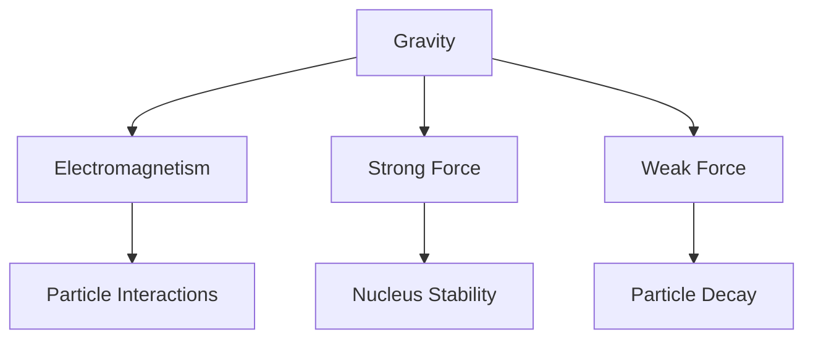
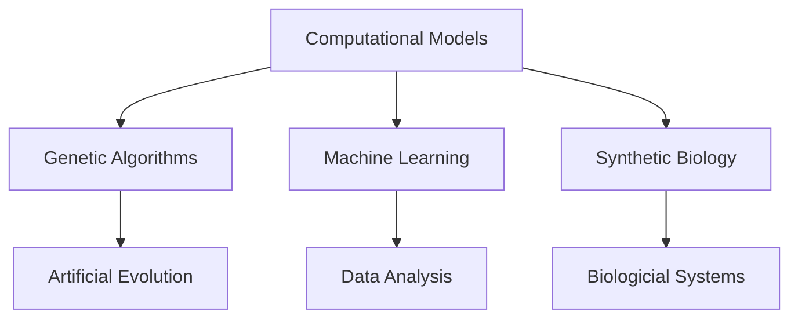

                 

Certainly! We'll structure our thoughts step by step to create a comprehensive and insightful blog post on "Insights from Cosmic Laws into Artificial Life Research." Here's how we can approach each section:

---

## Introducing the Blog Post

### Objective and Structure

Our objective is to provide a thorough exploration of the intersections between cosmic laws and artificial life research. This post will be structured into four main parts:

1. **Introduction**: We'll set the stage by defining key concepts, outlining the importance of the subject, and presenting a conceptual framework.
2. **Cosmic Laws Analysis**: We'll delve into the fundamental principles of cosmic laws, their impacts, and applications.
3. **Artificial Life Exploration**: We'll examine the development, core technologies, research methods, and applications of artificial life.
4. **Cosmic Laws in Artificial Life Research**: We'll explore how cosmic laws inspire and inform artificial life research.

### Key Concepts

- **Cosmic Laws**: Fundamental principles governing the structure and evolution of the universe.
- **Artificial Life**: Living systems created by humans, often using techniques like genetic algorithms, machine learning, and synthetic biology.

### Importance

Understanding the relationship between cosmic laws and artificial life could yield profound insights into the nature of life itself and advance both fields.

---

## Introduction

### Background

The study of cosmic laws and artificial life is relatively new, yet it holds immense potential. As our technological capabilities improve, we are increasingly able to replicate and simulate natural processes, from climate systems to biological evolution.

### Definition and Description

Cosmic laws are the underlying principles that govern the universe's structure and dynamics. Artificial life, on the other hand, involves the creation of living systems through computational models and genetic engineering.

### Solutions and Boundaries

Exploring the interplay between these two fields could lead to groundbreaking discoveries. However, it's crucial to define clear boundaries to ensure the research remains focused and achievable.

---

## Conceptual Framework

### Core Elements of Cosmic Laws

**Elements**: Fundamental forces, such as gravity, electromagnetism, and the strong and weak nuclear forces.
**Relationships**: These forces interact in complex ways, shaping the universe's evolution.

**ER Diagram**:

### Core Elements of Artificial Life

**Elements**: Computational models, genetic algorithms, machine learning, and synthetic biology.
**Relationships**: These elements interact to create living systems with specific characteristics.

**ER Diagram**:

### Relationship Between Cosmic Laws and Artificial Life

The interplay between cosmic laws and artificial life is complex but promising. By understanding the fundamental principles that govern the universe, we can better design and simulate artificial life systems.

---

## Summary

This introduction has provided a foundational understanding of the intersection between cosmic laws and artificial life research. We have outlined key concepts and presented a conceptual framework to guide our exploration.

---

With this structured approach, we can now delve deeper into each section, providing detailed analysis, examples, and insights. Let's proceed with the next part, where we'll analyze the cosmic laws in more depth.

---

If you have specific requirements for each section, such as more detailed outlines or specific points you'd like to emphasize, please let me know, and I can tailor the content accordingly. Otherwise, we can continue with the next part of the blog post.

