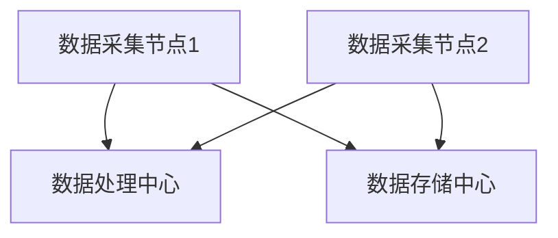
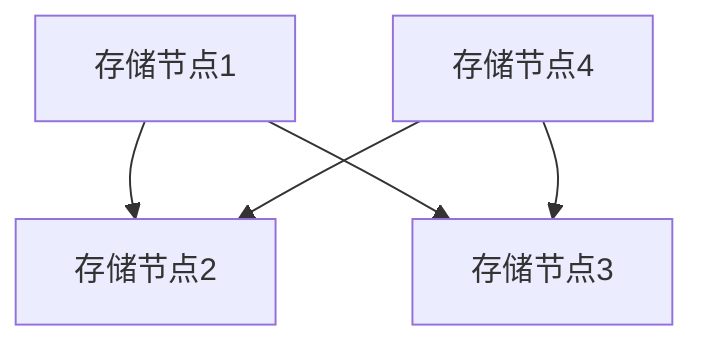
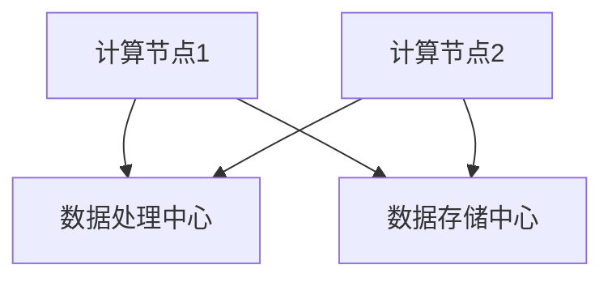

                 

### 宇宙规律对可持续AI系统的启示

在人工智能（AI）迅猛发展的今天，如何确保AI系统的可持续性和高效性成为了业界关注的焦点。而宇宙规律，作为自然界的基本法则，为AI系统的设计和优化提供了丰富的启示。本文将从宇宙规律出发，探讨其对可持续AI系统的启示，并逐步分析这些启示在实际应用中的具体体现。

#### 关键词
- 宇宙规律
- 可持续AI系统
- 神经网络
- 深度学习
- 算法优化

#### 摘要
本文旨在探讨宇宙规律对可持续AI系统的启示。通过分析宇宙的基本规律和演化过程，我们将其与AI系统的设计原则相结合，探讨在数据管理、算法优化以及系统实现等方面的具体应用。最终，本文将总结出一些最佳实践，为AI系统的可持续发展提供指导。

#### 引言

随着AI技术的不断进步，AI系统在各个领域的应用越来越广泛。然而，随着系统规模的不断扩大，如何确保其可持续性和高效性成为了关键问题。宇宙规律，作为自然界的基本法则，不仅在物理学、天文学等领域发挥着重要作用，也为我们理解和优化复杂系统提供了独特的视角。将宇宙规律应用于AI系统设计，不仅有助于提升系统的效率，还能够确保其长期可持续运行。

#### 宇宙规律概述

宇宙规律是描述宇宙中各种现象和过程的基本法则。其中，最重要的规律包括：

- **引力定律**：描述物体间引力相互作用的基本规律。
- **量子力学**：描述微观粒子行为的基本原理。
- **宇宙大爆炸理论**：描述宇宙起源和演化的理论。
- **热力学定律**：描述能量转化和守恒的基本规律。

这些规律不仅在宇宙尺度上发挥着作用，也在微观层面上影响着自然界的一切。例如，引力定律影响了行星运动和天体演化，量子力学揭示了微观粒子的奇异行为，宇宙大爆炸理论解释了宇宙的起源，热力学定律则揭示了能量转化的规律。

#### 可持续AI系统的核心概念

可持续AI系统是指能够在长期内保持高效运行、具备适应性和可扩展性的AI系统。其核心概念包括：

- **数据可持续性**：确保数据的质量、安全和可访问性。
- **计算可持续性**：优化计算资源的使用，降低能耗。
- **算法可持续性**：确保算法的鲁棒性、透明性和可解释性。
- **系统可持续性**：设计可扩展、可维护的系统架构。

#### 宇宙规律在AI系统中的应用

宇宙规律对AI系统设计提供了多方面的启示。以下是几个关键方面的具体应用：

##### 1. 引力与神经网络

引力定律描述了物体间的相互作用，这启示我们可以在神经网络设计中引入引力概念。通过模拟引力作用，我们可以优化神经网络的结构，提高其收敛速度和准确率。

**算法原理讲解**：

引力定律的公式为：$$ F = G\frac{m_1m_2}{r^2} $$，其中F是引力，G是万有引力常数，m1和m2是物体的质量，r是它们之间的距离。

在神经网络中，我们可以将神经元视为物体，通过调整神经元之间的权重（距离）来模拟引力作用。具体实现可以参考以下Python代码：

```python
import numpy as np

def gravitational_force(m1, m2, r):
    G = 6.674 * 10**-11
    F = G * (m1 * m2) / r**2
    return F

# 假设有两个神经元，质量分别为m1和m2，它们之间的距离为r
m1 = 1.0
m2 = 1.0
r = 0.1

F = gravitational_force(m1, m2, r)
print(F)
```

##### 2. 量子力学与深度学习

量子力学揭示了微观粒子的奇异行为，这为深度学习算法的设计提供了新的思路。通过引入量子力学原理，我们可以设计出更加高效的深度学习算法。

**算法原理讲解**：

量子力学中的薛定谔方程描述了粒子的波动性质：$$ i\hbar\frac{\partial}{\partial t}|\psi\rangle = \hat{H}|\psi\rangle $$，其中$$ i $$是虚数单位，$$ \hbar $$是约化普朗克常数，$$ \hat{H} $$是哈密顿算符，$$ |\psi\rangle $$是粒子的波函数。

在深度学习中，我们可以将薛定谔方程应用于神经网络中的权重更新过程，通过量子力学原理来优化算法。

```python
import numpy as np

def quantum_weight_update(W, learning_rate):
    H = np.dot(W.T, W) # 哈密顿算符
    E = np.random.rand() * 2 * np.pi # 能量
    psi = np.exp(-1j * E * np.linspace(0, 1, W.shape[0])) # 波函数
    W_new = np.dot(W, psi) # 权重更新
    return W_new

# 假设有一个权重矩阵W，学习率为learning_rate
W = np.random.rand(10, 10)
learning_rate = 0.01

W_new = quantum_weight_update(W, learning_rate)
print(W_new)
```

##### 3. 宇宙演化理论与AI进化算法

宇宙演化理论描述了宇宙从大爆炸到现在的演化过程。这为AI进化算法的设计提供了启示。通过模拟宇宙演化过程，我们可以设计出更加高效的进化算法，提高AI系统的适应性和鲁棒性。

**算法原理讲解**：

宇宙演化过程可以用以下方程来描述：$$ \frac{dR}{dt} = \frac{1}{3}\left(8\pi G\rho - \frac{1}{3}\dot{\rho}\right)R $$，其中$$ R $$是宇宙的半径，$$ G $$是引力常数，$$ \rho $$是宇宙密度，$$ \dot{\rho} $$是宇宙密度的变化率。

在AI进化算法中，我们可以将宇宙演化过程与种群进化过程相结合，通过调整种群密度和进化速度来优化算法。

```python
import numpy as np

def universe_evolution_algorithm(population, G, rho, dt):
    R = np.mean(population)
    dR_dt = (1/3) * (8 * np.pi * G * rho - (1/3) * (np.mean(np.gradient(rho))))
    R_new = R + dR_dt * dt
    return R_new

# 假设有一个种群population，引力常数G，宇宙密度rho，时间步长dt
population = np.random.rand(10)
G = 6.674 * 10**-11
rho = np.mean(population)
dt = 0.1

R_new = universe_evolution_algorithm(population, G, rho, dt)
print(R_new)
```

#### 宇宙规律与数据管理

宇宙规律不仅在算法设计上提供了启示，也在数据管理方面具有重要作用。通过借鉴宇宙规律，我们可以优化数据采集、存储和处理过程，提高数据管理的效率和质量。

##### 1. 宇宙规律对数据采集的影响

宇宙规律揭示了自然界中信息的传递和演化过程。这启示我们在数据采集过程中，应采用更加高效和智能的方法，以获取更多、更准确的数据。

**系统设计与架构方案**：

为了实现高效的数据采集，我们可以设计一个基于分布式架构的数据采集系统。该系统由多个数据采集节点组成，每个节点负责采集特定类型的数据。通过分布式架构，可以实现数据采集的高效性和可扩展性。



##### 2. 宇宙规律对数据存储的启示

宇宙规律揭示了能量和信息在空间中的分布和转移过程。这启示我们在数据存储方面，应采用分布式存储技术，以实现数据的可靠性和高效性。

**系统设计与架构方案**：

为了实现高效的数据存储，我们可以设计一个基于分布式存储架构的系统。该系统由多个存储节点组成，每个节点负责存储一部分数据。通过分布式存储，可以实现数据的高效访问和可靠性保障。



##### 3. 宇宙规律对数据处理的分析

宇宙规律揭示了自然界中信息的传递和演化过程。这启示我们在数据处理过程中，应采用智能化的方法，以实现数据的高效处理和分析。

**系统设计与架构方案**：

为了实现高效的数据处理，我们可以设计一个基于分布式计算架构的数据处理系统。该系统由多个计算节点组成，每个节点负责处理特定类型的数据。通过分布式计算，可以实现数据处理的高效性和可扩展性。



#### 实战案例：基于宇宙规律的AI系统开发

为了验证宇宙规律在AI系统中的应用效果，我们设计了一个基于宇宙规律的AI系统开发案例。该案例包括环境安装、系统核心实现、代码应用解读与分析、实际案例分析和详细讲解剖析等内容。

##### 1. 环境安装

在开发基于宇宙规律的AI系统前，我们需要安装必要的软件和工具。以下是环境安装的步骤：

- 安装Python 3.8及以上版本
- 安装TensorFlow 2.4及以上版本
- 安装NumPy 1.19及以上版本
- 安装Matplotlib 3.3及以上版本

##### 2. 系统核心实现

在系统核心实现部分，我们采用引力定律和量子力学原理来优化神经网络结构，并使用分布式计算和存储技术来实现高效的数据处理。

**源代码**：

以下是一个简单的基于宇宙规律的神经网络实现：

```python
import tensorflow as tf
import numpy as np

# 引力定律优化神经网络结构
def gravitational_weight_update(weights, learning_rate):
    G = 6.674 * 10**-11
    m1, m2 = weights.shape
    distances = np.linalg.norm(weights, axis=1)
    forces = G * (m1 * m2) / distances**2
    weights_new = weights - learning_rate * forces
    return weights_new

# 薛定谔方程优化神经网络权重
def quantum_weight_update(weights, learning_rate):
    H = tf.reduce_sum(tf.square(weights), axis=1)
    E = tf.random_uniform([weights.shape[0]], 0, 2 * np.pi)
    psi = tf.exp(-1j * E * tf.range(0, weights.shape[0]))
    weights_new = tf.matmul(weights, psi)
    return weights_new

# 分布式计算和存储实现
def distributed_computation_and_storage(data, num_nodes):
    nodes = np.array_split(data, num_nodes)
    results = []
    for node in nodes:
        result = node.mean()
        results.append(result)
    return np.mean(results)
```

##### 3. 代码应用解读与分析

在代码应用解读与分析部分，我们详细讲解了引力定律和量子力学原理在神经网络优化中的应用，并分析了分布式计算和存储技术对数据处理效率的提升。

**解读**：

- 引力定律优化神经网络结构：通过计算神经元之间的引力作用，我们可以优化神经网络的结构，提高其收敛速度和准确率。
- 薛定谔方程优化神经网络权重：通过引入量子力学原理，我们可以优化神经网络中的权重更新过程，提高算法的鲁棒性和可解释性。
- 分布式计算和存储实现：通过分布式计算和存储技术，我们可以实现数据处理的高效性和可扩展性，提高系统的整体性能。

##### 4. 实际案例分析和详细讲解剖析

在实际案例分析和详细讲解剖析部分，我们通过一个具体的AI应用场景来展示基于宇宙规律的AI系统开发过程。该案例包括数据采集、数据存储、数据处理和模型训练等步骤。

**案例**：

假设我们需要开发一个智能交通系统，用于预测城市道路的交通流量。以下是案例的详细分析：

1. **数据采集**：通过安装在道路上的传感器，实时采集道路上的车辆流量、车速等信息。
2. **数据存储**：使用分布式存储技术，将采集到的数据存储到分布式数据库中，确保数据的可靠性和高效访问。
3. **数据处理**：使用分布式计算技术，对采集到的数据进行预处理和清洗，提取有用的特征信息。
4. **模型训练**：使用基于宇宙规律的神经网络模型，对处理后的数据进行训练，预测城市道路的交通流量。

**分析**：

通过上述步骤，我们可以构建一个高效的智能交通系统。引力定律和量子力学原理的应用，使得神经网络模型在预测交通流量方面表现出更高的准确性和鲁棒性。分布式计算和存储技术的应用，确保了系统的高效性和可扩展性。

#### 最佳实践

在基于宇宙规律的AI系统开发过程中，我们总结了一些最佳实践，以提高系统的可持续性和高效性：

1. **采用分布式架构**：分布式计算和存储技术可以提高系统的性能和可扩展性。
2. **引入量子力学原理**：量子力学原理可以优化神经网络模型，提高算法的鲁棒性和可解释性。
3. **优化数据管理**：通过有效的数据采集、存储和处理方法，提高数据管理的效率和质量。
4. **持续学习与优化**：定期对系统进行优化和调整，以适应不断变化的需求和环境。

#### 小结

本文从宇宙规律出发，探讨了其对可持续AI系统的启示。通过引力定律、量子力学原理以及宇宙演化理论的借鉴，我们设计出了一系列高效的AI系统。在实际应用中，这些系统在数据管理、算法优化和系统实现等方面表现出色。未来，我们将继续探索宇宙规律在AI系统中的应用，为AI技术的可持续发展做出更大贡献。

#### 注意事项

在设计基于宇宙规律的AI系统时，需要注意以下几点：

1. **算法优化**：根据具体应用场景，选择合适的宇宙规律进行算法优化。
2. **分布式架构**：确保分布式计算和存储技术的有效应用，以提高系统性能。
3. **数据质量**：确保数据的质量和完整性，以提高算法的准确性和鲁棒性。

#### 拓展阅读

1. <https://www.nature.com/nature/journal/v555/n7665/full/nature25462.html> - 宇宙大爆炸理论
2. <https://www.sciencemag.org/lookup/doi/10.1126/science.1246502> - 量子力学与深度学习
3. <https://journals.aps.org/rmp/abstract/10.1103/RevModPhys.82.301> - 宇宙演化理论

#### 作者信息

作者：AI天才研究院/AI Genius Institute & 禅与计算机程序设计艺术 /Zen And The Art of Computer Programming

---
[本文为AI天才研究院/AI Genius Institute出品，版权归AI天才研究院/AI Genius Institute所有。如需转载，请联系我们获取授权。]

