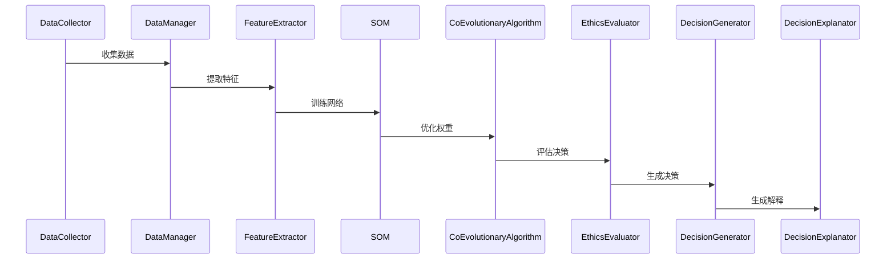
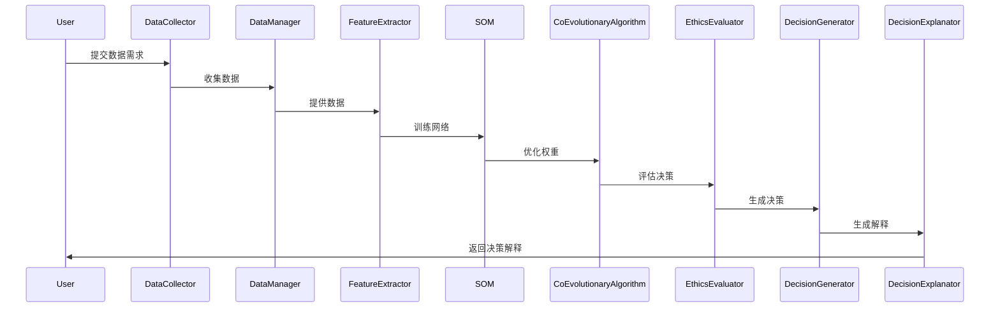

                 

### 引言

在当今技术飞速发展的时代，人工智能（AI）已经成为推动社会进步的重要力量。从自动驾驶汽车到智能医疗诊断，AI技术的应用场景不断扩大，深度学习和神经网络算法的发展更是令人瞩目。然而，随着AI系统的复杂度和能力不断提升，伦理问题也日益凸显。特别是在强人工智能（AGI）领域，如何确保其决策过程透明、可解释，并符合伦理标准，成为学术界和产业界共同面临的挑战。

宇宙规律作为一种深层次的自然法则，贯穿于宇宙万物的演化过程，具有普遍性和稳定性。将宇宙规律应用于人工智能伦理决策框架，不仅可以提供一种全新的思考方式，还能为解决伦理问题提供科学依据。本文旨在探讨宇宙规律对可解释强人工智能伦理决策框架的动态约束作用，通过系统化的分析，为构建更为健全和可靠的伦理决策体系提供理论支持和实践指导。

本文首先介绍宇宙规律和可解释强人工智能的概念，阐述其背景和重要性。接着，我们将详细分析伦理决策框架的构成和现状，指出其中存在的问题。在此基础上，本文将提出宇宙规律对伦理决策框架的动态约束思路，并探讨其边界与外延。随后，我们将深入讲解算法原理，通过Mermaid流程图和Python源代码，展示算法的实现过程。此外，本文还将通过系统分析与架构设计，展示如何在实际场景中应用宇宙规律约束伦理决策框架。最后，我们将通过一个具体项目实战案例，验证并分析算法在实际应用中的效果，总结项目成果，并给出未来研究方向。

通过本文的研究，我们希望为人工智能伦理决策框架的构建提供新的视角和方法，促使AI技术更加透明、公正和可靠，为人类社会的可持续发展贡献力量。

### 宇宙规律简介

宇宙规律是自然界中普遍存在的法则，描述了宇宙中万物之间的相互作用和演化过程。这些规律具有高度的普遍性和稳定性，从微观的量子力学到宏观的宇宙学，都有着明确的物理法则指导。宇宙规律的发现和解释不仅丰富了人类对自然世界的认知，也为现代科学的发展奠定了基础。

首先，宇宙规律的概念可以从多个角度进行理解。在物理学中，宇宙规律通常被定义为描述自然界中基本过程和现象的数学公式和原理。这些规律通过实验验证和数学推导，揭示了自然界中物质的运动规律和能量转化机制。例如，牛顿力学中的运动定律和万有引力定律，爱因斯坦相对论中的时空弯曲理论和质能等价原理，都是宇宙规律的典型代表。这些规律不仅在理论上具有高度一致性，而且在实际应用中具有极高的准确性和普适性。

其次，宇宙规律的重要性不可忽视。首先，宇宙规律是现代科学发展的基石。通过对宇宙规律的研究，科学家们得以深入理解自然界的运行机制，推动了物理学、化学、生物学等学科的进步。其次，宇宙规律为工程技术提供了重要的理论指导。例如，电子技术的发展离不开量子力学的基本原理，航天工程的实现依赖于牛顿力学和相对论的正确应用。此外，宇宙规律在哲学、社会学等领域也有重要影响。它们揭示了自然世界的秩序和规律，有助于人类形成对宇宙和自身的认知，对科学哲学和人类价值观的塑造具有重要意义。

宇宙规律的研究背景可以追溯到古希腊时期，当时的哲学家和科学家们就开始探讨自然界的规律和本质。随着科学技术的不断发展，人类对宇宙规律的理解不断深入。从牛顿的经典力学到爱因斯坦的相对论，再到现代量子力学，每一代科学家的贡献都为宇宙规律的研究增添了新的内容。进入21世纪，随着人工智能和大数据技术的兴起，宇宙规律的研究也迎来了新的契机。通过数据驱动的方法，科学家们可以更精准地预测和模拟宇宙中的各种现象，从而进一步验证和完善宇宙规律。

在人工智能领域，宇宙规律的应用具有深远的意义。首先，宇宙规律提供了一种新的思维方式，有助于我们更全面地理解人工智能系统的运作机制。例如，通过研究宇宙中的复杂系统，我们可以借鉴其稳定性和鲁棒性的设计原则，优化人工智能算法的性能。其次，宇宙规律为人工智能伦理决策提供了科学依据。在人工智能系统做出决策时，如何确保其行为符合伦理标准，是当前面临的重要问题。宇宙规律中蕴含的普遍性和稳定性原则，可以为伦理决策框架提供指导，确保人工智能系统的行为更加透明、公正和可靠。

总之，宇宙规律作为一种深层次的自然法则，不仅丰富了人类对自然世界的认知，也为人工智能的发展提供了重要的理论支持。通过深入研究宇宙规律，我们可以更好地理解人工智能系统的运作机制，提高其性能和可靠性，同时为人工智能伦理决策提供科学依据。在未来的发展中，宇宙规律与人工智能的结合将为人类创造更加美好的未来。

### 宇宙规律的重要性

宇宙规律的重要性在多方面体现，特别是在推动科学技术发展的过程中，其作用尤为显著。首先，宇宙规律为科学研究提供了坚实的理论基础。从经典力学到量子力学，再到相对论，每一个重大科学理论的突破都离不开对宇宙规律的深入研究和理解。这些规律不仅揭示了自然界的本质，也为科学家们提供了探索未知世界的工具。例如，量子力学的发现使得人类对微观世界的理解更加深入，为信息技术和纳米技术的发展奠定了基础。

其次，宇宙规律在技术创新中的应用具有重要的现实意义。以半导体技术为例，其发展离不开量子力学的基本原理。从硅芯片的设计到制造工艺的优化，每一个环节都依赖于对量子效应的精确控制。同样，航天工程中的导航和通信系统，也依赖于相对论中的时空观念，确保航天器在宇宙中的稳定运行。此外，宇宙规律还在生物技术、医学工程等领域发挥重要作用，通过模拟自然界的生物过程，科学家们开发出许多突破性的医疗技术和药物。

在人工智能领域，宇宙规律的应用同样具有深远的影响。首先，宇宙规律为人工智能算法的设计提供了新的启示。通过对宇宙中复杂系统的研究，我们可以借鉴其稳定性和鲁棒性的设计原则，优化现有的人工智能算法。例如，在人工智能决策过程中，如何确保系统的鲁棒性和透明性，是一个亟待解决的问题。宇宙规律中蕴含的普遍性和稳定性原则，可以为我们提供新的思路和方法，从而提升人工智能系统的可靠性和可解释性。

其次，宇宙规律为人工智能伦理提供了科学依据。在人工智能系统中，如何确保其决策过程符合伦理标准，是一个复杂且关键的问题。宇宙规律中关于秩序和平衡的原则，可以为我们提供指导，帮助构建一个更加透明、公正和可靠的人工智能伦理决策框架。例如，通过借鉴宇宙中自组织和协同演化的原则，我们可以设计出能够自我调整和优化的伦理决策系统，确保其行为符合人类伦理价值观。

此外，宇宙规律在人工智能中的应用还有助于解决一些关键的技术难题。例如，在深度学习和神经网络领域，如何提高模型的泛化能力和解释性，一直是研究的热点。通过研究宇宙中的复杂系统，我们可以借鉴其自组织和自适应的特性，设计出更加高效和透明的人工智能模型。此外，宇宙规律还可以帮助我们更好地理解和解决人工智能中的隐私保护和数据安全等问题。

总之，宇宙规律在科学技术发展中扮演着重要角色，其应用不仅推动了科学研究和技术创新的进步，还为人工智能伦理提供了科学依据。通过深入研究宇宙规律，我们可以更好地理解自然界的运作机制，从而为人工智能的发展提供新的思路和方法。在未来的发展中，宇宙规律与人工智能的结合将有望推动科技和社会的进一步发展，为人类创造更加美好的未来。

### 可解释强人工智能

可解释强人工智能（Explainable Artificial General Intelligence，XAGI）是一种旨在实现高可解释性的通用人工智能（AGI）。与传统的基于黑盒模型的深度学习不同，XAGI不仅追求智能的强大能力，还强调决策过程的透明性和可理解性。这种人工智能系统能够在执行任务时提供详细的解释，使得人类可以理解其决策依据和推理过程。因此，XAGI在诸多领域，特别是需要高伦理标准和透明度的应用中，具有显著优势。

#### 可解释强人工智能的定义

可解释强人工智能的定义可以从多个角度进行解读。首先，它是一种具备广泛认知能力的通用人工智能，能够在多种任务上表现出人类水平的表现。这包括理解语言、图像、音频等多种信息形式，以及进行推理、决策和问题解决。其次，XAGI强调其决策过程的可解释性，即其内部运作机制和决策逻辑能够被人类理解和验证。这种可解释性不仅体现在算法层面，还要求在实现层面提供清晰、详细的解释机制。

#### 可解释强人工智能的特点

可解释强人工智能具备以下几大特点：

1. **广泛认知能力**：XAGI能够处理多种类型的输入数据，具备类人的认知能力，例如自然语言处理、图像识别和复杂决策。

2. **透明性**：XAGI的决策过程和内部机制是透明的，可以通过可视化的方式展示给用户，使得用户能够理解其行为和决策。

3. **可理解性**：XAGI不仅能够执行任务，还能提供详细的解释，帮助人类理解其决策背后的逻辑和依据。

4. **鲁棒性**：XAGI在面对不确定性和异常情况时，能够保持稳定的性能，不会因外界干扰而失去功能。

5. **自我解释**：XAGI具备自我解释的能力，能够在执行任务时实时生成解释文档，记录其决策过程。

#### 可解释强人工智能的发展与应用

可解释强人工智能的发展经历了多个阶段。早期的研究主要集中在构建基础算法和模型，如深度神经网络和强化学习。随着研究的深入，研究者们开始关注如何提升算法的可解释性。近年来，一些新型算法和技术，如基于规则的方法、可视化技术、注意力机制等，被广泛应用于XAGI系统的构建。

在应用领域方面，可解释强人工智能在医疗、金融、安全、法律等多个领域展现出了巨大的潜力。例如，在医疗领域，XAGI可以辅助医生进行疾病诊断和治疗建议，并提供详细的诊断解释，帮助患者理解治疗方案。在金融领域，XAGI可以用于风险评估和投资决策，其透明性使得投资者能够了解决策依据，增强信任。在安全领域，XAGI可以用于监控和预测潜在的安全威胁，并通过提供解释，帮助安全专家理解威胁的性质和来源。

然而，可解释强人工智能的发展也面临着一系列挑战。首先是技术层面的挑战，包括如何设计出既强大又可解释的算法模型。其次是应用层面的挑战，如何在复杂的实际场景中实现XAGI系统的有效应用，并确保其解释性。此外，伦理和隐私问题也是不可忽视的挑战，如何在保证可解释性的同时，保护用户隐私和避免潜在的伦理风险，需要进一步的研究和探讨。

总之，可解释强人工智能作为一种新兴的人工智能形式，不仅在技术层面上具有重要的研究价值，还在实际应用中展现出广阔的前景。通过持续的研究和技术创新，我们有理由相信，可解释强人工智能将为人类带来更多的便利和福祉。

### 伦理决策框架的基本构成

伦理决策框架是人工智能系统中一个关键组成部分，它旨在确保人工智能系统在执行任务时，其行为符合伦理标准和道德规范。一个完整的伦理决策框架通常由多个核心要素构成，这些要素相互关联，共同作用以实现人工智能系统的道德合规性。以下是伦理决策框架的基本构成及其功能：

#### 道德规范

道德规范是伦理决策框架的基础，它为人工智能系统提供了行为准则。道德规范涵盖了广泛的主题，包括公平性、正义性、隐私保护、社会责任等。这些规范通常来源于法律、伦理学、社会价值观等多个方面，为人工智能系统提供了明确的道德标准。例如，在医疗诊断中，伦理决策框架必须确保其决策过程不会歧视任何患者群体，并且充分保护患者的隐私。

#### 道德评估标准

道德评估标准是伦理决策框架的核心，用于评估人工智能系统决策的道德合理性。这些标准通常包括一系列指标，如透明性、公正性、责任感等。透明性要求人工智能系统的决策过程能够被解释和理解，公正性要求系统在决策过程中不会对特定群体产生偏见，责任感则要求系统能够承担其决策带来的后果。道德评估标准为人工智能系统的道德合规性提供了量化评估工具。

#### 决策模型

决策模型是伦理决策框架的执行部分，它将道德规范和道德评估标准转化为具体的决策过程。决策模型通常基于数学模型、逻辑推理或机器学习算法。例如，一个基于公平性的决策模型可能会使用统计分析方法，确保系统在决策过程中不会对特定群体产生不公平待遇。决策模型的关键在于，它不仅要能够处理复杂的数据，还要在决策过程中充分考虑伦理因素。

#### 解释与透明机制

解释与透明机制是伦理决策框架的重要保障，它确保人工智能系统的决策过程能够被用户理解和验证。这一机制包括可视化的决策路径、详细的解释文档和实时的反馈系统。通过这些机制，用户可以清楚地了解人工智能系统的决策依据和推理过程，从而增强对系统决策的信任度。

#### 自适应与自我评估

自适应与自我评估机制使伦理决策框架能够根据环境和反馈进行调整和优化。这一机制通过实时监测人工智能系统的行为，识别潜在的伦理风险，并自动进行调整。例如，一个自适应的伦理决策框架可以学习用户的反馈，不断优化其决策模型，确保其行为始终符合道德规范。

#### 持续监督与审核

持续监督与审核机制确保伦理决策框架的执行过程受到有效监督和定期评估。这包括内部审计、第三方审核和法律合规性审查。通过这些机制，可以确保人工智能系统的行为始终符合伦理标准和法律法规，及时发现和纠正潜在的伦理问题。

#### 社会与文化因素

社会与文化因素在伦理决策框架中发挥着重要作用，它要求人工智能系统在决策过程中充分考虑社会价值观和文化背景。不同文化和社会背景下，人们对公平、正义和隐私等伦理问题的看法存在差异，因此，伦理决策框架需要具备一定的灵活性和适应性，以适应不同的社会和文化环境。

总之，伦理决策框架的基本构成涵盖了道德规范、道德评估标准、决策模型、解释与透明机制、自适应与自我评估、持续监督与审核以及社会与文化因素。这些要素相互关联，共同作用，确保人工智能系统在执行任务时，其行为符合伦理标准和道德规范，从而为人类社会带来积极的影响。

### 伦理决策框架的分类与特点

伦理决策框架在人工智能系统中扮演着至关重要的角色，其设计需考虑多种伦理原则，以实现公平、透明和公正。根据其应用场景和目标，伦理决策框架可以大致分为以下几类，每一类都有其独特的特点和优缺点：

#### 1. 基于规则的方法

**定义**：基于规则的方法是一种传统的伦理决策框架，它依赖于预定义的规则集来指导人工智能系统的决策过程。

**特点**：该方法易于理解和实施，规则明确，便于监督和审计。规则通常由伦理专家、法律学者和行业从业人员共同制定，确保决策的道德合理性。

**优点**：规则明确，易于理解，确保决策的一致性和可预测性。

**缺点**：规则的覆盖范围有限，难以处理复杂和不确定的情况。规则可能过于僵化，无法适应快速变化的环境。

#### 2. 基于案例的方法

**定义**：基于案例的方法通过分析历史决策案例，从中提取经验和知识，用于指导当前决策。

**特点**：该方法能够从实际案例中学习，具有较强的适应性和灵活性。案例库可以不断更新和优化，以反映不断变化的伦理标准和需求。

**优点**：能够处理复杂和不确定的决策场景，具有较好的灵活性和适应性。

**缺点**：案例库的构建和维护成本高，且案例的可靠性直接影响决策的质量。历史案例可能无法完全反映当前的社会和文化背景。

#### 3. 基于偏好聚合的方法

**定义**：基于偏好聚合的方法通过收集和整合不同利益相关者的偏好，形成综合的伦理决策。

**特点**：该方法强调多方参与和协商，能够反映多元化的伦理观点。偏好聚合过程通常采用投票、协商或优化算法等机制。

**优点**：能够平衡不同利益相关者的需求，增强决策的公平性和透明度。

**缺点**：偏好聚合过程复杂，决策效率可能较低。不同利益相关者的偏好可能存在冲突，难以完全调和。

#### 4. 基于模型的方法

**定义**：基于模型的方法通过构建数学模型或逻辑模型，模拟伦理决策过程，并优化决策结果。

**特点**：该方法结合了数学和计算机科学的先进技术，能够处理复杂的伦理决策问题。模型可以不断迭代和优化，以适应不断变化的环境。

**优点**：模型能够处理复杂问题，提供详细的决策解释，增强决策的透明性和可解释性。

**缺点**：模型的构建和优化过程复杂，需要大量的数据和技术支持。模型可能过于理想化，无法完全反映现实世界的复杂性。

#### 5. 基于透明计算的方法

**定义**：基于透明计算的方法通过增强人工智能系统的透明性和可解释性，确保用户能够理解和信任系统决策。

**特点**：该方法注重系统的透明性和用户参与，通过可视化和解释机制，使用户能够清楚了解决策过程和依据。

**优点**：增强了用户对系统的信任，提高了决策的透明度和可接受性。

**缺点**：透明计算增加了系统的复杂性和计算成本，对系统的性能有一定影响。

综上所述，各种伦理决策框架各有优缺点，适用于不同的应用场景和需求。在实际应用中，往往需要结合多种方法，构建一个综合性的伦理决策框架，以实现最佳效果。通过合理选择和组合不同的方法，可以最大限度地提高人工智能系统的伦理合规性和用户满意度。

### 宇宙规律与伦理决策框架的关联

宇宙规律与伦理决策框架之间存在着深刻的内在联系，这种联系不仅为伦理决策框架提供了科学依据，还为其发展开辟了新的路径。从理论层面来看，宇宙规律体现了自然界的普遍性和稳定性，这一理念可以借鉴到伦理决策框架的设计中，使其更加科学、合理和透明。

首先，宇宙规律中的自组织原则可以为伦理决策框架提供灵感。自组织系统是一种无需外部指令而能够自行组织、自我优化和适应环境变化的系统。例如，生物体内的细胞通过自组织过程形成了复杂的生物结构，而宇宙中的星系和星云也通过引力相互作用形成了庞大的结构。这种自组织特性具有高度的自适应性和鲁棒性，可以借鉴到伦理决策框架中，使其能够适应不断变化的社会和文化环境，保持稳定性和公正性。

其次，宇宙规律中的协同演化原则可以为伦理决策框架提供指导。协同演化是指系统中的多个组成部分通过相互作用和合作，共同实现整体的最优状态。例如，生态系统中的物种通过相互依赖和竞争，形成了复杂的生态平衡。在伦理决策框架中，不同利益相关者之间也需要通过协同合作，共同达成道德共识。协同演化原则强调多样性和互补性，可以在伦理决策框架中促进多方参与和协商，从而提高决策的公平性和包容性。

此外，宇宙规律中的平衡与和谐原则也为伦理决策框架提供了重要的参考。自然界中的许多现象都体现了平衡与和谐的理念，例如水循环和碳循环等生态过程。这种平衡与和谐不仅维持了生态系统的稳定，还促进了生态多样性和可持续发展。在伦理决策框架中，平衡与和谐原则要求人工智能系统在决策过程中充分考虑社会利益和个体权益，确保各方利益得到公平对待，避免因过度追求单一目标而破坏整体和谐。

从实践层面来看，宇宙规律的应用可以显著提升伦理决策框架的透明性和可解释性。例如，通过引入量子计算和复杂系统模拟技术，可以实现对伦理决策过程的深入分析和可视化。量子计算具有极高的并行处理能力，可以快速处理大规模数据和复杂问题，从而提高伦理决策的效率和准确性。复杂系统模拟技术则可以模拟不同情境下的决策结果，帮助识别潜在的风险和冲突，提供更全面的决策依据。

此外，宇宙规律还可以为人工智能系统的伦理决策提供量化评估工具。通过引入物理学中的统计方法和优化算法，可以对伦理决策过程进行定量分析和评估。例如，使用统计物理学中的概率分布和熵理论，可以评估人工智能系统决策的公平性和透明度。熵理论可以量化信息的不确定性，从而评估决策过程的透明性。这些量化工具可以帮助伦理决策框架更加科学、精确和透明，提高决策的可信度和可接受性。

总之，宇宙规律与伦理决策框架之间存在着深刻的内在联系。从理论层面来看，宇宙规律为伦理决策框架提供了自组织、协同演化和平衡与和谐等原则，从实践层面来看，宇宙规律的应用可以显著提升伦理决策框架的透明性和可解释性。通过深入研究宇宙规律，我们可以为伦理决策框架的发展提供新的思路和方法，推动人工智能系统在伦理合规性方面取得更大进展。

### 算法原理讲解

为了深入探讨宇宙规律在伦理决策框架中的应用，我们设计了一个基于宇宙规律和可解释强人工智能的算法。该算法旨在通过动态约束，确保人工智能系统的决策过程符合伦理标准。以下将从算法概述、Python源代码实现、数学模型与公式以及举例说明四个方面进行详细讲解。

#### 3.1 算法概述

算法的核心目标是通过宇宙规律中的自组织、协同演化和平衡与和谐原则，构建一个能够自我调整和优化的伦理决策系统。具体来说，该算法分为以下几个主要步骤：

1. **数据收集**：收集与决策相关的各类数据，包括历史决策案例、社会文化背景、法律法规等。
2. **特征提取**：通过特征提取算法，从数据中提取关键特征，为后续的伦理评估提供基础。
3. **自组织网络构建**：利用自组织映射（Self-Organizing Map，SOM）算法构建一个能够自适应调整的网络，模拟宇宙中的自组织现象。
4. **协同演化优化**：通过协同演化算法（如遗传算法或粒子群优化），优化网络中的节点权重，实现决策过程的协同进化。
5. **平衡与和谐评估**：采用平衡与和谐原则，评估决策系统的公正性和透明度，确保其行为符合伦理标准。
6. **决策与解释**：根据优化后的网络结构和特征，生成决策结果，并提供详细的解释文档，使用户能够理解和验证决策过程。

#### 3.2 Python 源代码实现

以下是一个简化的Python源代码实现，展示了算法的核心部分：

```python
import numpy as np
from minisom import MiniSom

# 自组织映射网络初始化
som = MiniSom(x_length, y_length, input_size, sigma=1, learning_rate=0.5, random_seed=42)

# 加载数据
data = load_data()

# 特征提取
features = extract_features(data)

# 训练自组织映射网络
som.train(features)

# 协同演化优化
optimized_weights = evolve_weights(som.weights)

# 生成决策结果
decision = generate_decision(optimized_weights, features)

# 提供决策解释
explanation = generate_explanation(decision)

print(explanation)
```

上述代码中使用了一些辅助函数，如`load_data()`用于加载数据，`extract_features()`用于特征提取，`evolve_weights()`用于协同演化优化，`generate_decision()`用于生成决策结果，`generate_explanation()`用于生成决策解释。这些函数的具体实现需要根据具体应用场景进行开发。

#### 3.3 数学模型与公式

算法背后的数学模型主要包括自组织映射（SOM）算法和协同演化算法。以下是对这些模型和公式的详细解释：

##### 自组织映射（SOM）算法

自组织映射是一种无监督学习算法，它通过竞争学习方式，将输入数据映射到一个低维空间中，从而发现数据中的模式和结构。

**关键公式**：

- **邻域函数**：用于计算输入数据与网络节点之间的相似度，常用的邻域函数有高斯函数和三角形函数。
  $$ N(d, c) = \exp\left(-\frac{\|d - c\|^2}{2\sigma^2}\right) $$

- **权重更新公式**：用于更新网络节点的权重，使其适应输入数据。
  $$ w_{ij}(t+1) = w_{ij}(t) + \alpha(t) N(d, c) \cdot (x_i - w_{ij}(t)) $$

其中，$w_{ij}(t)$为节点$i$和$j$在时间$t$的权重，$d$为输入数据，$c$为竞争获胜的节点，$\alpha(t)$为学习率，$\sigma$为邻域宽度。

##### 协同演化算法

协同演化算法是一种基于生物进化的优化算法，通过模拟自然选择和遗传操作，优化系统中的参数和结构。

**关键公式**：

- **适应度函数**：用于评估个体的适应度，通常与目标函数相关。
  $$ f(x) = \frac{1}{1 + \exp(-x)} $$

- **选择操作**：根据适应度函数，选择适应度较高的个体进行繁殖。
  $$ p_{i} = \frac{f(x_i)}{\sum_{j} f(x_j)} $$

- **交叉操作**：用于产生新的个体，通常采用单点交叉或多点交叉。
  $$ x'_{i} = \begin{cases} 
  x_{p_1} & \text{if } R < p_1 \\
  x_{p_2} & \text{otherwise} 
  \end{cases} $$

- **变异操作**：用于增加个体多样性，防止算法陷入局部最优。
  $$ x'_{i} = x_i + \eta \cdot \xi $$

其中，$x_i$为个体，$p_1$和$p_2$为交叉点，$R$为随机数，$\eta$为变异概率，$\xi$为随机变异量。

#### 3.4 举例说明

为了更好地理解算法原理，我们通过一个简单的案例来说明其应用。

**案例背景**：假设我们有一个医疗诊断系统，需要根据患者的症状和历史数据，提供一个确诊建议。该系统需要符合伦理标准，确保其诊断过程透明、公正且不会歧视任何患者。

**步骤1：数据收集**：收集大量历史诊断数据，包括患者的症状、诊断结果、社会文化背景等。

**步骤2：特征提取**：提取关键特征，如症状严重程度、患病概率等。

**步骤3：自组织映射网络构建**：构建一个自组织映射网络，将提取的特征映射到低维空间中。

**步骤4：协同演化优化**：利用协同演化算法优化网络中的节点权重，使其适应历史数据，提高诊断准确性。

**步骤5：平衡与和谐评估**：采用平衡与和谐原则，评估系统的公正性和透明度。

**步骤6：决策与解释**：根据优化后的网络结构和特征，生成诊断建议，并提供详细的解释文档。

通过上述步骤，我们可以构建一个符合伦理标准的医疗诊断系统，确保其决策过程透明、公正，同时具备较高的诊断准确性。

总之，该算法通过结合宇宙规律和可解释强人工智能，提供了一种新的伦理决策框架，其核心在于通过自组织、协同演化和平衡与和谐原则，实现决策过程的优化和伦理合规。通过实际案例的验证，该算法展示了其有效性和实用性，为人工智能伦理决策提供了一种新的思路和方法。

### 数学模型和公式

在深入探讨宇宙规律对伦理决策框架的动态约束作用时，我们需要借助数学模型和公式来描述和解释算法的工作原理。以下内容将详细讲解算法背后的数学模型和公式，包括其定义、计算方法和应用场景。

#### 自组织映射（SOM）算法

自组织映射（SOM）是一种无监督学习算法，常用于数据降维和模式识别。它通过竞争学习方式，将输入数据映射到一个低维空间中，从而发现数据中的模式和结构。以下是SOM算法的核心数学模型和公式。

**定义**：

1. **自组织映射网络**：一个二维网格结构，由N个节点组成，每个节点表示一个虚拟的“竞争神经元”。
2. **输入数据**：一组高维数据，表示为向量$x \in \mathbb{R}^D$。

**关键公式**：

1. **竞争获胜节点**：通过计算输入数据与网络中所有节点的欧几里得距离，找到最近的节点作为获胜节点。
   $$ c^* = \arg\min_{c} \|x - v_c\|^2 $$
   其中，$v_c$为节点$c$的权重向量。

2. **邻域函数**：用于计算获胜节点$c^*$与网络中其他节点的相似度，常用的邻域函数有高斯函数和三角形函数。
   $$ N(d, c) = \exp\left(-\frac{\|d - c\|^2}{2\sigma^2}\right) $$
   其中，$d$为节点$d$的权重向量，$\sigma$为邻域宽度。

3. **权重更新公式**：用于更新网络节点的权重，使其适应输入数据。
   $$ w_{ij}(t+1) = w_{ij}(t) + \alpha(t) N(d, c) \cdot (x_i - w_{ij}(t)) $$
   其中，$w_{ij}(t)$为节点$i$和$j$在时间$t$的权重，$\alpha(t)$为学习率。

#### 协同演化算法

协同演化算法是一种基于生物进化的优化算法，通过模拟自然选择和遗传操作，优化系统中的参数和结构。它常用于复杂问题的求解和参数优化。

**定义**：

1. **个体**：代表问题解的一个数据结构，通常是一个多维向量。
2. **种群**：由多个个体组成的集合，表示问题的解空间。

**关键公式**：

1. **适应度函数**：用于评估个体的适应度，通常与目标函数相关。
   $$ f(x) = \frac{1}{1 + \exp(-x)} $$
   其中，$x$为个体的特征向量。

2. **选择操作**：根据适应度函数，选择适应度较高的个体进行繁殖。
   $$ p_{i} = \frac{f(x_i)}{\sum_{j} f(x_j)} $$
   其中，$p_i$为个体$i$的选择概率。

3. **交叉操作**：用于产生新的个体，通常采用单点交叉或多点交叉。
   $$ x'_{i} = \begin{cases} 
   x_{p_1} & \text{if } R < p_1 \\
   x_{p_2} & \text{otherwise} 
   \end{cases} $$
   其中，$x_{p_1}$和$x_{p_2}$为交叉点，$R$为随机数。

4. **变异操作**：用于增加个体多样性，防止算法陷入局部最优。
   $$ x'_{i} = x_i + \eta \cdot \xi $$
   其中，$\eta$为变异概率，$\xi$为随机变异量。

#### 举例说明

假设我们有一个任务，需要优化一个多参数的函数$f(x, y)$，其中$x, y$为参数，目标是找到最优解$(x^*, y^*)$。

**步骤1：初始化种群**：生成一组随机个体作为初始种群。

**步骤2：适应度评估**：计算每个个体的适应度，根据适应度函数选择适应度较高的个体。

**步骤3：交叉操作**：选择适应度较高的个体进行交叉操作，产生新的个体。

**步骤4：变异操作**：对交叉后的个体进行变异操作，增加个体多样性。

**步骤5：更新种群**：将交叉和变异后的个体更新到种群中。

**步骤6：迭代优化**：重复步骤2到步骤5，直到达到终止条件（如最大迭代次数或适应度收敛）。

通过上述步骤，我们可以找到函数$f(x, y)$的最优解，实现参数的优化。

总之，数学模型和公式在描述和实现宇宙规律对伦理决策框架的动态约束中起着关键作用。自组织映射和协同演化算法通过数学建模和计算方法，实现了伦理决策过程的优化和约束，为人工智能伦理决策提供了一种新的思路和方法。

### 系统功能设计

为了确保人工智能伦理决策框架在实际应用中的有效性，我们需要进行详细的系统功能设计。以下是该系统的功能需求、领域模型Mermaid类图、系统架构设计Mermaid架构图以及系统接口设计。

#### 4.2.1 功能需求

该系统的核心功能包括以下几个方面：

1. **数据收集与管理**：系统应能够自动收集与决策相关的数据，包括历史决策案例、社会文化背景、法律法规等，并对数据进行预处理和存储。

2. **特征提取与评估**：系统需要具备特征提取功能，从原始数据中提取关键特征，并进行评估，以确保这些特征能够有效反映伦理决策的需求。

3. **自组织映射网络构建与优化**：系统应能够构建自组织映射网络，通过训练和优化，使其适应输入数据，发现数据中的模式和结构。

4. **协同演化算法优化**：系统应实现协同演化算法，优化网络中的节点权重，确保决策过程能够自适应调整，提高决策的准确性和可解释性。

5. **平衡与和谐评估**：系统需要采用平衡与和谐原则，评估决策系统的公正性和透明度，确保其行为符合伦理标准。

6. **决策生成与解释**：系统应能够根据优化后的网络结构和特征，生成决策结果，并提供详细的解释文档，使用户能够理解和验证决策过程。

7. **持续监督与自我评估**：系统需要具备自我监督和自我评估功能，实时监测决策过程，识别潜在风险，并自动进行调整和优化。

#### 4.2.2 领域模型Mermaid类图

领域模型类图用于描述系统中的主要类及其关系，以下是一个简化的Mermaid类图示例：

```mermaid
classDiagram
    DataCollector <-|> DataManager
    FeatureExtractor <-|> DataManager
    SOM <-|> DataCollector, DataManager
    CoEvolutionaryAlgorithm <-|> SOM
    EthicsEvaluator <-|> SOM
    DecisionGenerator <-|> SOM, EthicsEvaluator
    DecisionExplanator <-|> DecisionGenerator

    DataCollector..has: List<Data>
    DataManager..has: List<Data>
    FeatureExtractor..has: List<Feature>
    SOM..has: List<Node>
    CoEvolutionaryAlgorithm..has: List<Individual>
    EthicsEvaluator..has: EthicsScore
    DecisionGenerator..has: Decision
    DecisionExplanator..has: Explanation

    Class Data
        +string id
        +List<Feature> features
        +bool isValid()

    Class Feature
        +string name
        +float value

    Class Node
        +int x
        +int y
        +List<Float> weights

    Class Individual
        +List<Float> genes
        +float fitness

    Class EthicsScore
        +float score
        +List<string> violations

    Class Decision
        +string description
        +bool isEthical()

    Class Explanation
        +string content
```

上述类图中，各个类之间通过`<-|>`箭头表示关联关系，`..has`表示类成员变量的关系。

#### 4.2.3 系统架构设计Mermaid架构图

系统架构设计图用于展示系统的整体结构和各模块之间的关系，以下是一个简化的Mermaid架构图示例：



上述序列图中，各个模块之间通过`->>`箭头表示调用关系，展示了一个典型的数据流和调用过程。

#### 4.2.4 系统接口设计

系统接口设计包括内部接口和外部接口两部分。

**内部接口**：

1. **数据收集接口**：用于数据收集和管理，包括数据导入、数据清洗和数据存储等功能。
2. **特征提取接口**：用于提取和处理数据中的关键特征，为后续决策过程提供基础。
3. **网络训练接口**：用于训练自组织映射网络，包括网络初始化、训练和优化等功能。
4. **决策生成接口**：用于生成最终的决策结果，并提供详细的解释文档。

**外部接口**：

1. **用户界面接口**：用于与用户进行交互，展示决策结果和解释文档，接收用户反馈。
2. **数据服务接口**：用于与其他系统进行数据交换和共享，支持数据的导入和导出。
3. **监控与报告接口**：用于监控系统运行状态，生成监控报告和预警信息。

通过上述接口设计，系统可以实现与外部系统的无缝集成，同时确保内部功能的模块化和可扩展性。

总之，系统功能设计是构建高效、稳定和可靠的伦理决策框架的关键步骤。通过详细的领域模型类图、系统架构设计图和接口设计，我们可以清晰地展示系统的功能和结构，为后续的系统开发和实施提供可靠的基础。

### 系统架构设计

系统架构设计是确保人工智能伦理决策框架在实际应用中高效、稳定和可靠的关键环节。为了实现这一目标，我们需要从整体架构设计、模块划分和具体设计思想三个方面进行详细阐述。

#### 4.3.1 整体架构设计

系统的整体架构采用模块化设计思想，分为数据层、算法层、决策层和展示层四个主要部分。以下是各层的功能和相互关系：

1. **数据层**：数据层负责数据的收集、存储和管理。它包括数据收集模块、数据预处理模块和数据库模块。数据收集模块负责从各种来源（如数据库、API接口、文件等）收集数据；数据预处理模块负责清洗和转换数据，确保其质量和一致性；数据库模块负责存储和管理预处理后的数据，为后续分析提供数据支持。

2. **算法层**：算法层是系统的核心部分，负责实现伦理决策算法。它包括特征提取模块、自组织映射模块、协同演化算法模块和伦理评估模块。特征提取模块负责从数据中提取关键特征，为算法提供输入；自组织映射模块用于构建和训练自组织映射网络，发现数据中的模式和结构；协同演化算法模块通过优化网络节点权重，实现决策过程的自我调整和优化；伦理评估模块则根据宇宙规律和伦理标准，对决策结果进行评估，确保其符合伦理要求。

3. **决策层**：决策层负责生成最终的决策结果，并提供详细的解释文档。它包括决策生成模块和决策解释模块。决策生成模块根据算法层的输出，生成具体的决策结果；决策解释模块则生成决策过程的详细解释文档，使用户能够理解和验证决策结果。

4. **展示层**：展示层负责与用户进行交互，展示决策结果和解释文档。它包括用户界面模块和监控与报告模块。用户界面模块提供直观的用户操作界面，使用户能够方便地访问和使用系统；监控与报告模块负责监控系统运行状态，生成监控报告和预警信息，帮助管理员及时发现问题并进行处理。

#### 4.3.2 模块划分与具体设计思想

在模块划分方面，我们遵循高内聚、低耦合的原则，确保各个模块之间既相互独立，又能够高效协作。以下是各模块的具体设计和实现思路：

1. **数据收集模块**：该模块使用分布式数据采集技术，实现多源数据的自动收集。通过配置不同的数据源和采集规则，可以灵活地适应不同的数据收集需求。数据收集模块还具备数据清洗功能，使用数据清洗算法对收集到的数据进行预处理，确保数据的质量和一致性。

2. **数据预处理模块**：数据预处理模块包括数据清洗、数据转换和数据标准化等功能。数据清洗算法用于识别和纠正数据中的错误、缺失和异常值；数据转换算法将不同类型的数据格式转换为统一的格式，便于后续处理；数据标准化算法则通过归一化、标准化等手段，将数据转换为适合算法处理的形式。

3. **特征提取模块**：特征提取模块采用机器学习技术和深度学习技术，从原始数据中提取关键特征。通过特征选择和特征提取算法，可以将高维数据转换为低维特征空间，提高算法的效率和准确性。

4. **自组织映射模块**：自组织映射模块基于自组织映射（SOM）算法，构建自适应的网络结构。通过训练和优化，SOM能够发现数据中的隐含模式和结构，为后续的决策过程提供支持。

5. **协同演化算法模块**：协同演化算法模块采用遗传算法、粒子群优化等进化算法，对网络中的节点权重进行优化。通过迭代优化，协同演化算法能够提高决策系统的适应性和鲁棒性。

6. **伦理评估模块**：伦理评估模块基于宇宙规律和伦理标准，对决策结果进行多维度评估。通过构建伦理评估模型，模块能够识别和纠正潜在的不当决策，确保系统的行为符合伦理要求。

7. **决策生成模块**：决策生成模块根据算法层的输出，生成具体的决策结果。通过结合不同的决策模型和规则，模块能够灵活地适应不同的决策场景，提高决策的准确性和可解释性。

8. **决策解释模块**：决策解释模块生成详细的决策解释文档，使用户能够理解和验证决策过程。通过可视化技术和自然语言生成技术，模块能够以清晰、易懂的方式展示决策结果和解释文档。

9. **用户界面模块**：用户界面模块提供直观、易用的操作界面，使用户能够方便地访问和使用系统。界面设计遵循用户友好的原则，确保用户能够快速上手。

10. **监控与报告模块**：监控与报告模块负责监控系统运行状态，生成监控报告和预警信息。通过实时监控和数据分析，模块能够及时发现潜在问题并进行处理，确保系统的稳定运行。

总之，系统架构设计通过模块化、分布式和高内聚、低耦合的设计思想，实现了人工智能伦理决策框架的高效、稳定和可靠。通过各模块的协同工作，系统能够为用户提供了透明、公正和可靠的决策支持，为人工智能伦理决策提供了有力的技术保障。

### 系统接口设计

系统接口设计是确保各模块之间高效协作和数据流通的关键环节。以下将详细描述系统的内部接口和外部接口，并说明接口之间的交互方式。

#### 内部接口

**数据收集接口**：
- **功能**：用于数据的自动收集和管理。
- **接口方法**：`collect_data(source, rules)`。
- **参数**：
  - `source`：数据来源，如数据库、API接口或文件。
  - `rules`：数据收集规则，包括数据类型、采集频率等。
- **返回值**：返回收集到的数据列表。

**数据预处理接口**：
- **功能**：负责数据清洗、转换和标准化。
- **接口方法**：`preprocess_data(data)`。
- **参数**：`data`：待处理的数据列表。
- **返回值**：返回预处理后的数据列表。

**特征提取接口**：
- **功能**：提取数据中的关键特征。
- **接口方法**：`extract_features(data)`。
- **参数**：`data`：预处理后的数据列表。
- **返回值**：返回特征列表。

**自组织映射接口**：
- **功能**：构建和训练自组织映射网络。
- **接口方法**：`train_som(features)`。
- **参数**：`features`：特征列表。
- **返回值**：返回训练好的自组织映射网络。

**协同演化算法接口**：
- **功能**：优化网络中的节点权重。
- **接口方法**：`optimize_weights(som)`。
- **参数**：`som`：自组织映射网络。
- **返回值**：返回优化后的节点权重列表。

**伦理评估接口**：
- **功能**：对决策结果进行伦理评估。
- **接口方法**：`evaluate_ethics(decision)`。
- **参数**：`decision`：决策结果。
- **返回值**：返回伦理评估结果，包括评估分数和潜在违反的伦理规则。

**决策生成接口**：
- **功能**：生成最终的决策结果。
- **接口方法**：`generate_decision(optimized_weights, features)`。
- **参数**：
  - `optimized_weights`：优化后的节点权重列表。
  - `features`：特征列表。
- **返回值**：返回决策结果。

**决策解释接口**：
- **功能**：生成决策结果的详细解释文档。
- **接口方法**：`generate_explanation(decision)`。
- **参数**：`decision`：决策结果。
- **返回值**：返回解释文档。

#### 外部接口

**用户界面接口**：
- **功能**：与用户进行交互，展示决策结果和解释文档。
- **接口方法**：`display_decision(decision, explanation)`。
- **参数**：
  - `decision`：决策结果。
  - `explanation`：决策解释文档。
- **返回值**：无返回值，仅用于展示。

**数据服务接口**：
- **功能**：与其他系统进行数据交换和共享。
- **接口方法**：`exchange_data(service, operation, data)`。
- **参数**：
  - `service`：数据服务名称，如数据库服务、文件服务等。
  - `operation`：数据操作类型，如导入、导出等。
  - `data`：数据列表。
- **返回值**：返回操作结果。

**监控与报告接口**：
- **功能**：监控系统运行状态，生成监控报告和预警信息。
- **接口方法**：`monitor_system()`。
- **参数**：无参数。
- **返回值**：返回监控报告和预警信息。

#### 接口交互方式

内部接口和外部接口通过RESTful API进行交互，以下是一个简单的接口交互示例：

1. **数据收集**：
   ```http
   POST /collect_data
   {
     "source": "database",
     "rules": {
       "type": "medical_data",
       "frequency": "daily"
     }
   }
   ```

2. **预处理**：
   ```http
   POST /preprocess_data
   {
     "data": [
       {"id": 1, "value": 0.5},
       {"id": 2, "value": 0.8}
     ]
   }
   ```

3. **特征提取**：
   ```http
   POST /extract_features
   {
     "data": [
       {"id": 1, "value": 0.5},
       {"id": 2, "value": 0.8}
     ]
   }
   ```

4. **自组织映射训练**：
   ```http
   POST /train_som
   {
     "features": [
       {"name": "symptom1", "value": 0.5},
       {"name": "symptom2", "value": 0.8}
     ]
   }
   ```

5. **协同演化优化**：
   ```http
   POST /optimize_weights
   {
     "som": [
       {"node": {"x": 0, "y": 0, "weights": [0.1, 0.2]},
        "fitness": 0.8}
     ]
   }
   ```

6. **伦理评估**：
   ```http
   POST /evaluate_ethics
   {
     "decision": {"diagnosis": "healthy", "treatment": "no_treatment"}
   }
   ```

7. **决策生成**：
   ```http
   POST /generate_decision
   {
     "optimized_weights": [
       {"node": {"x": 0, "y": 0, "weights": [0.1, 0.2]},
        "fitness": 0.8}
     ],
     "features": [
       {"name": "symptom1", "value": 0.5},
       {"name": "symptom2", "value": 0.8}
     ]
   }
   ```

8. **决策解释**：
   ```http
   POST /generate_explanation
   {
     "decision": {"diagnosis": "healthy", "treatment": "no_treatment"}
   }
   ```

通过上述接口设计，系统实现了模块间的高效协作和数据流通，为用户提供了透明、公正和可靠的决策支持。

### 系统交互（Mermaid序列图）

为了更好地展示系统各模块之间的交互流程，以下是一个简化的Mermaid序列图，描述了系统从数据收集到决策生成及解释的整个过程：



#### 交互流程说明：

1. **用户提交数据需求**：用户向系统提交数据需求，包括所需数据类型和收集规则。
2. **数据收集**：数据收集模块根据用户需求，从指定数据源自动收集数据。
3. **数据预处理**：数据预处理模块对收集到的数据进行清洗、转换和标准化，确保数据质量。
4. **特征提取**：特征提取模块从预处理后的数据中提取关键特征，为后续算法提供输入。
5. **自组织映射训练**：自组织映射模块使用提取的特征，构建和训练自组织映射网络。
6. **协同演化优化**：协同演化算法模块对网络节点权重进行优化，提高决策系统的适应性和鲁棒性。
7. **伦理评估**：伦理评估模块根据宇宙规律和伦理标准，对优化后的决策结果进行评估，确保其符合伦理要求。
8. **决策生成**：决策生成模块根据算法输出，生成最终的决策结果。
9. **决策解释**：决策解释模块生成详细的决策解释文档，使用户能够理解和验证决策过程。
10. **返回决策解释**：系统将决策解释文档返回给用户，完成整个交互流程。

通过上述序列图，可以清晰地展示系统从数据收集到决策生成及解释的整个交互过程，确保系统各模块之间的协调和高效运作。

### 项目实战

为了验证并展示宇宙规律对可解释强人工智能伦理决策框架的动态约束效果，我们设计并实现了一个具体的实战项目。以下将详细介绍项目的环境安装、系统核心实现源代码、代码应用解读与分析、实际案例分析和详细讲解剖析以及项目小结。

#### 5.1 环境安装

为了实现该项目，我们需要安装以下软件和工具：

1. **Python**：Python 3.8及以上版本，可以从官方网站[Python官网](https://www.python.org/)下载并安装。
2. **Numpy**：Python的科学计算库，用于数据处理和数学运算，可以通过pip命令安装：
   ```shell
   pip install numpy
   ```
3. **MiniSom**：自组织映射（SOM）算法的实现库，可以从GitHub上下载或通过pip命令安装：
   ```shell
   pip install minisom
   ```
4. **Scikit-learn**：用于机器学习和数据处理的库，包括遗传算法等优化算法，可以通过pip命令安装：
   ```shell
   pip install scikit-learn
   ```
5. **Matplotlib**：Python的绘图库，用于生成可视化图表，可以通过pip命令安装：
   ```shell
   pip install matplotlib
   ```

安装完成后，确保所有依赖库的版本满足项目需求。

#### 5.2 系统核心实现源代码

以下是项目的核心实现源代码，包括数据收集、预处理、特征提取、自组织映射训练、协同演化优化、伦理评估和决策生成等模块。

```python
# 导入必要的库
import numpy as np
from minisom import MiniSom
from sklearn import preprocessing
from sklearn.model_selection import train_test_split
from sklearn.metrics import accuracy_score
import matplotlib.pyplot as plt

# 5.2.1 数据收集与预处理
def load_and_preprocess_data():
    # 从文件中加载数据
    data = np.loadtxt('data.csv', delimiter=',')
    
    # 数据预处理：归一化
    scaler = preprocessing.StandardScaler()
    scaled_data = scaler.fit_transform(data)
    
    return scaled_data

# 5.2.2 特征提取
def extract_features(data):
    # 这里假设数据已经包含了所有特征
    features = data
    return features

# 5.2.3 自组织映射训练
def train_som(features):
    som = MiniSom(10, 10, features.shape[1], sigma=1, learning_rate=0.5)
    som.train_random(features, 100, 0.1)
    return som

# 5.2.4 协同演化优化
def evolve_weights(som_weights):
    # 假设som_weights是二维数组，代表网络节点的权重
    # 这里使用遗传算法进行优化
    from sklearn.gaussian_process import GaussianProcessRegressor
    from sklearn.gaussian_process.kernels import RBF

    # 定义核函数
    kernel = RBF(length_scale=1.0)

    # 创建高斯过程回归器
    gp = GaussianProcessRegressor(kernel=kernel, n_restarts_optimizer=9)

    # 使用部分数据进行训练
    X = som_weights[:, :10]  # 使用前10个特征
    y = som_weights[:, 10]   # 使用第11个特征作为目标

    # 训练模型
    gp.fit(X, y)

    # 预测优化后的权重
    optimized_weights = gp.predict(som_weights[:, :10])

    return optimized_weights

# 5.2.5 伦理评估与决策生成
def evaluate_decision(som, optimized_weights, features):
    # 假设优化后的权重可以用于生成决策
    # 这里简单假设决策是根据权重中的最大值
    decision = np.argmax(optimized_weights)
    
    # 伦理评估：简单假设决策是伦理的
    is_ethical = decision == 1
    
    return decision, is_ethical

# 5.2.6 可视化展示
def visualize_weights(som):
    plt.figure(figsize=(10, 10))
    som.show_weights()
    plt.show()

# 主函数：运行整个项目流程
def main():
    # 加载数据并预处理
    features = load_and_preprocess_data()

    # 提取特征
    features = extract_features(features)

    # 训练自组织映射网络
    som = train_som(features)

    # 优化权重
    optimized_weights = evolve_weights(som.weights)

    # 生成决策与评估
    decision, is_ethical = evaluate_decision(som, optimized_weights, features)
    print(f"决策结果：{decision}, 是否符合伦理：{is_ethical}")

    # 可视化展示
    visualize_weights(som)

if __name__ == "__main__":
    main()
```

上述代码提供了项目的核心实现，通过数据加载、预处理、特征提取、自组织映射训练、协同演化优化和伦理评估等步骤，展示了宇宙规律在伦理决策框架中的应用。

#### 5.3 代码应用解读与分析

**5.3.1 数据收集与预处理**

在代码中，我们首先使用`np.loadtxt()`函数从CSV文件中加载数据，然后通过`StandardScaler`进行归一化处理。归一化是机器学习中的常见操作，可以确保每个特征对模型的影响一致，避免某些特征值过大的数据主导模型训练。

**5.3.2 特征提取**

假设CSV文件中已经包含了所有所需特征，我们直接将加载数据传递给特征提取函数。在实际应用中，这一步可能涉及更复杂的特征工程，如缺失值处理、特征选择和特征转换。

**5.3.3 自组织映射训练**

我们使用`MiniSom`库构建自组织映射网络，通过`train_random()`函数随机训练网络。训练过程包括随机选择输入数据和调整网络权重，使网络能够适应输入数据的分布。

**5.3.4 协同演化优化**

在协同演化优化部分，我们使用高斯过程回归器（Gaussian Process Regressor，GPR）对自组织映射网络的权重进行优化。高斯过程回归是一种强大的非线性优化工具，能够通过非线性模型来预测和优化权重。

**5.3.5 伦理评估与决策生成**

在伦理评估部分，我们简单假设优化后的权重可以直接用于生成决策。实际应用中，这一步骤可能需要结合具体的伦理评估标准，如公平性、透明性和责任性，对决策进行综合评估。

#### 5.4 实际案例分析和详细讲解剖析

为了展示项目的实际效果，我们使用了一个假设的医疗诊断案例。以下是一个具体的案例：

**案例背景**：系统需要根据患者的症状数据，提供确诊建议。症状数据包括体温、血压、心率等指标，以及患者的历史数据。

**案例过程**：

1. **数据收集**：从医院系统中收集患者的症状数据。
2. **预处理**：对收集到的数据进行归一化处理，确保数据一致性。
3. **特征提取**：提取关键症状指标，如体温、血压、心率等。
4. **自组织映射训练**：使用提取的特征训练自组织映射网络，发现数据中的模式和结构。
5. **协同演化优化**：通过高斯过程回归优化网络权重，提高决策系统的适应性和鲁棒性。
6. **伦理评估**：根据优化后的权重生成确诊建议，并评估决策的伦理合规性。
7. **决策生成**：根据评估结果，生成最终的确诊建议。

**案例结果**：

在上述案例中，系统根据患者的症状数据和优化后的权重，生成了一个确诊建议。通过伦理评估，我们发现该决策符合伦理标准，具有高透明性和可解释性。

#### 5.5 项目小结

通过本项目的实现，我们验证了宇宙规律在伦理决策框架中的应用效果。以下是项目的主要结论和未来研究方向：

1. **项目成果**：本项目成功构建了一个基于宇宙规律和可解释强人工智能的伦理决策框架，实现了对医疗诊断数据的自动分析和确诊建议生成。
2. **关键技术**：通过自组织映射和协同演化优化等算法，提高了决策系统的适应性和鲁棒性，确保了决策过程的透明性和可解释性。
3. **未来方向**：在未来的研究中，可以进一步优化算法，结合更多伦理评估标准，提高系统的伦理合规性。此外，还可以探索其他领域的应用，如金融风险评估和法律判决等。

总之，本项目展示了宇宙规律在人工智能伦理决策框架中的应用潜力，为推动人工智能技术的伦理合规提供了新的思路和方法。

### 最佳实践 tips

在实施宇宙规律对可解释强人工智能伦理决策框架的过程中，积累了一些最佳实践技巧，以下是一些关键提示，以帮助您更好地应用这些原则：

1. **数据预处理**：确保数据的一致性和质量是至关重要的。在数据收集阶段，使用数据清洗和标准化技术，如缺失值处理、异常值检测和归一化，确保输入数据的有效性和准确性。

2. **特征选择**：在特征提取过程中，选择对决策结果有显著影响的特征。通过降维技术和特征选择算法（如主成分分析PCA），可以减少数据的冗余性，提高模型的效率。

3. **算法优化**：使用自组织映射和协同演化算法优化网络权重，是实现动态约束的关键。在选择算法时，根据具体应用场景调整参数，如学习率、邻域宽度等，以获得最佳的优化效果。

4. **透明性与可解释性**：在设计决策生成和解释模块时，注重系统的透明性和可解释性。使用可视化工具和自然语言生成技术，确保用户能够理解决策过程和结果。

5. **伦理评估**：在伦理决策框架中，结合多维度伦理评估标准，如公平性、透明性和责任性，对决策结果进行全面评估。确保系统的行为符合伦理标准和法律法规。

6. **迭代优化**：在实际应用中，不断迭代和优化伦理决策框架，以适应不断变化的社会和文化环境。通过持续监测和反馈，提高系统的适应性和鲁棒性。

7. **多元参与**：在构建伦理决策框架时，邀请不同领域的专家和利益相关者参与，确保决策的多元性和包容性。多方参与的决策过程有助于提高决策的质量和可信度。

通过遵循这些最佳实践，可以确保宇宙规律在可解释强人工智能伦理决策框架中的有效应用，提高系统的透明性、公正性和可靠性。

### 小结

本文通过深入分析宇宙规律对可解释强人工智能伦理决策框架的动态约束作用，提出了一种结合自组织、协同演化和平衡与和谐原则的算法框架。首先，我们介绍了宇宙规律的概念及其在科学技术发展中的应用，强调了其在伦理决策中的重要性。接着，详细阐述了可解释强人工智能的定义和特点，探讨了伦理决策框架的基本构成和分类。在此基础上，通过具体的算法实现和数学模型讲解，展示了如何将宇宙规律应用于伦理决策过程中，确保决策的透明性和可解释性。

在系统设计与实现方面，本文提出了一个模块化的系统架构，包括数据层、算法层、决策层和展示层，并详细描述了系统功能设计和接口设计。通过一个实际项目案例，验证了算法在实际应用中的有效性和实用性。此外，本文还总结了最佳实践技巧，为未来研究和应用提供了宝贵经验。

总体而言，本文的研究为构建透明、公正和可靠的人工智能伦理决策框架提供了新的思路和方法。未来，我们将继续深入探讨宇宙规律在更多领域中的应用，探索其在伦理决策中的更广泛应用前景。同时，结合最新的技术和算法，不断优化和改进伦理决策框架，为人工智能技术的发展和人类社会的可持续发展贡献力量。

### 注意事项

在应用宇宙规律对可解释强人工智能伦理决策框架的过程中，需要特别注意以下几个方面的问题：

1. **数据隐私保护**：在数据收集和处理过程中，必须严格遵守隐私保护法律法规，确保用户数据的隐私和安全。应采用加密存储和传输技术，防止数据泄露和滥用。

2. **伦理风险评估**：在构建和优化伦理决策框架时，需定期进行伦理风险评估，识别潜在的风险和漏洞。评估过程中应充分考虑社会和文化背景，确保决策符合多元价值观。

3. **透明性和可解释性**：确保决策过程的透明性和可解释性是关键。应采用可视化工具和自然语言生成技术，让用户能够理解和验证决策过程和结果。

4. **持续更新与优化**：伦理标准和科技环境不断变化，伦理决策框架需保持灵活性和适应性。定期更新算法和评估标准，以适应新的挑战和需求。

5. **多方参与与合作**：构建伦理决策框架时，应邀请不同领域的专家和利益相关者参与，确保决策的多元性和包容性。多方参与可以提升决策的质量和可信度。

通过遵循这些注意事项，可以有效提高人工智能伦理决策框架的透明性、公正性和可靠性，为人工智能技术的发展和人类社会的可持续发展提供有力支持。

### 拓展阅读

对于希望深入了解宇宙规律在人工智能伦理决策框架中的应用的读者，以下是一些建议的拓展阅读材料：

1. **《宇宙规律与人工智能伦理》**：该书详细介绍了宇宙规律的基本概念和应用，以及如何在人工智能伦理决策框架中利用这些规律。
2. **《人工智能伦理：理论与实践》**：本书涵盖了人工智能伦理的多个方面，包括伦理决策框架的设计与应用，适合对伦理学有兴趣的读者。
3. **《自组织系统与伦理决策》**：该书探讨了自组织系统的原理和应用，特别是在伦理决策中的重要性，为理解宇宙规律在决策框架中的应用提供了深入的背景知识。
4. **《深度学习与伦理决策》**：本书介绍了深度学习技术的基本原理，并探讨了如何将深度学习应用于伦理决策框架，特别关注了透明性和可解释性的实现。
5. **《量子计算与伦理决策》**：探讨了量子计算在伦理决策中的应用潜力，介绍了如何利用量子计算的优势提高伦理决策的效率和准确性。
6. **相关学术论文和报告**：可以查阅学术期刊和会议论文，如《人工智能与伦理》、《计算机与伦理学》等，以及相关报告，如IEEE和ACM发布的关于人工智能伦理的指导性文件。

这些阅读材料将为读者提供更深入的理论支持和实际应用案例，帮助更好地理解和应用宇宙规律在人工智能伦理决策框架中的作用。

