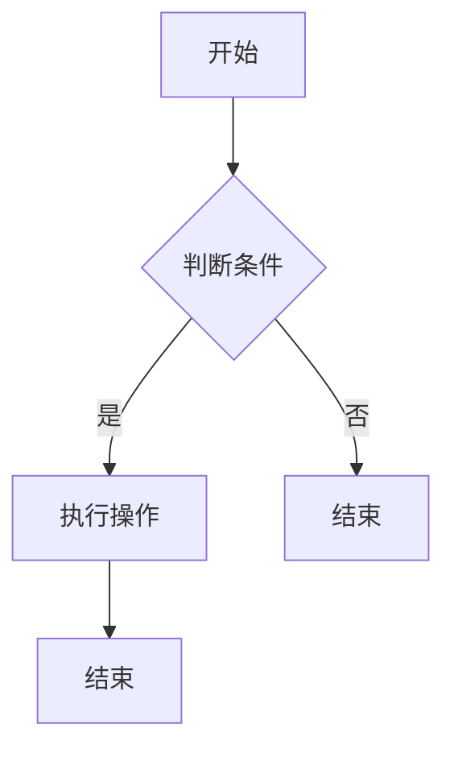

                 

# 宇宙规律对可解释强人工智能伦理框架的启示

> 关键词：宇宙规律、可解释强人工智能、伦理框架、启示

> 摘要：本文从宇宙规律出发，探讨了其对构建可解释强人工智能伦理框架的启示。通过分析宇宙基本规律、宇宙规律的科学证据以及宇宙规律的影响与应用，结合可解释强人工智能技术的定义与特点，伦理学基础以及伦理框架构建方法，本文提出了一套基于宇宙规律的伦理框架，并分析了其在实际案例中的应用，旨在为可解释强人工智能伦理框架的构建提供新的视角。

----------------------------------------------------------------

## 第一部分 引言

### 1.1 宇宙规律简介

宇宙规律是指宇宙中普遍存在的、稳定的、可预测的基本法则。这些规律是科学家们通过长时间观测和实验研究得出的，包括但不限于万有引力定律、量子力学定律、热力学定律等。宇宙规律具有普遍性和客观性，它们不仅适用于宇宙的宏观现象，也适用于微观粒子的行为。理解宇宙规律对于人类认识世界、探索自然、推动科技发展具有重要意义。

### 1.2 可解释强人工智能的概念

可解释强人工智能（Explainable Artificial Intelligence，XAI）是一种新兴的人工智能研究方向，旨在使人工智能系统的决策过程具有可解释性。与传统的不可解释人工智能相比，可解释强人工智能不仅能够提供准确的预测结果，还能清晰地解释其决策过程。这对于确保人工智能系统的可信度、透明度和公平性具有重要意义。可解释强人工智能的关键技术包括可视性技术、解释性算法和模型可理解性等。

### 1.3 伦理框架的重要性

伦理框架是指在特定领域内，根据伦理原则和价值观所制定的一系列指导原则和行为规范。在人工智能领域，伦理框架的建立有助于规范人工智能的研发和应用，防止技术滥用和伦理风险。伦理框架的重要性体现在以下几个方面：

1. **确保技术安全**：伦理框架可以帮助识别和防范潜在的安全风险，确保人工智能系统的稳定运行。
2. **保护用户隐私**：伦理框架可以规范数据收集、处理和共享行为，保护用户的隐私权。
3. **促进社会公平**：伦理框架有助于消除人工智能应用中的偏见和歧视，确保技术公平地服务于所有人。
4. **增强社会信任**：伦理框架可以提高公众对人工智能的信任度，促进人工智能的广泛应用。

### 1.4 三者的联系与意义

宇宙规律、可解释强人工智能和伦理框架三者之间存在密切的联系。宇宙规律为理解自然提供了基础，可解释强人工智能则为人工智能系统的可解释性提供了技术手段，而伦理框架则为人工智能的研发和应用提供了行为规范。这三者的结合对于推动人工智能技术的发展、确保技术的安全性和公平性具有重要意义。

- **宇宙规律**：为人工智能的研究提供了理论基础，帮助科学家们理解和模拟自然现象，从而提升人工智能的预测和决策能力。
- **可解释强人工智能**：通过提供可解释性技术，使人工智能系统的决策过程更加透明，有助于建立公众对人工智能的信任。
- **伦理框架**：为人工智能的研发和应用提供了行为规范，确保技术在符合伦理原则和价值观的前提下发展。

## 第二部分 宇宙规律基础

### 2.1 宇宙基本规律概述

宇宙基本规律是宇宙运行的基本法则，它们贯穿于宇宙的各个层面，包括宏观的星系运动和微观的粒子相互作用。以下是一些重要的宇宙基本规律：

1. **万有引力定律**：牛顿在1687年提出的万有引力定律描述了任何两个物体之间的引力作用。这个规律表明，两个物体之间的引力与它们的质量成正比，与它们之间的距离的平方成反比。

   $$ F = G \frac{m_1 m_2}{r^2} $$

   其中，\( F \) 是引力，\( G \) 是万有引力常数，\( m_1 \) 和 \( m_2 \) 是两个物体的质量，\( r \) 是它们之间的距离。

2. **量子力学定律**：量子力学是描述微观粒子行为的物理学分支。它提出了波粒二象性、量子叠加态和量子纠缠等现象，打破了经典物理学的观念。例如，海森堡不确定性原理表明，粒子的位置和动量不能同时被精确测量。

   $$ \Delta x \Delta p \geq \frac{\hbar}{2} $$

   其中，\( \Delta x \) 和 \( \Delta p \) 分别是位置和动量的不确定度，\( \hbar \) 是约化普朗克常数。

3. **热力学定律**：热力学定律描述了能量转换和守恒的基本规律。第一定律表明能量守恒，第二定律描述了熵增原理，即孤立系统的总熵总是趋向增加。

   $$ \Delta U = Q - W $$

   其中，\( \Delta U \) 是系统内能的变化，\( Q \) 是系统吸收的热量，\( W \) 是系统对外做的功。

### 2.2 宇宙规律的科学证据

宇宙规律的科学证据来自于广泛的观测和实验。例如，万有引力定律在开普勒行星运动定律的基础上得到了验证，而量子力学定律则通过双缝实验、电子双缝干涉实验等实验得到了证实。以下是一些关键的科学证据：

1. **引力透镜效应**：宇宙中的星系和大尺度结构可以像透镜一样弯曲光线，这一效应为万有引力定律提供了直接观测证据。

2. **量子纠缠**：量子纠缠现象的实验验证表明，微观粒子之间存在着非局域的关联，这与量子力学定律的预测一致。

3. **热辐射**：普朗克黑体辐射定律的实验验证证明了热力学定律的正确性，这一发现对理解宇宙中的能量分布具有重要意义。

### 2.3 宇宙规律的影响与应用

宇宙规律对科学研究、技术发展和日常生活产生了深远影响。以下是一些具体的影响和应用：

1. **科学研究**：宇宙规律为天文学、物理学、化学等科学领域提供了理论基础，推动了人类对宇宙和微观世界的理解。

2. **技术创新**：宇宙规律的应用促进了技术进步，例如，量子计算和量子通信的发展依赖于量子力学定律，而引力波探测技术则基于万有引力定律。

3. **日常生活**：宇宙规律在日常生活中也有广泛应用，例如，热力学定律指导了能源开发和利用，万有引力定律在建筑设计中考虑了建筑物的稳定性。

## 第三部分 可解释强人工智能技术

### 3.1 可解释强人工智能的定义与特点

可解释强人工智能（Explainable Artificial Intelligence，XAI）是一种旨在使人工智能系统具备可解释性的技术。与传统的人工智能系统相比，可解释强人工智能不仅能够提供准确的预测和决策结果，还能够清晰地解释其决策过程。以下是可解释强人工智能的定义与特点：

1. **定义**：可解释强人工智能是指具有可解释性的人工智能系统，其决策过程和结果可以被人理解和验证。可解释性不仅包括对模型本身的解释，还包括对模型输入和输出以及决策过程的解释。

2. **特点**：

   - **可解释性**：可解释强人工智能系统能够提供对决策过程的详细解释，使用户能够理解系统的行为。
   - **透明性**：可解释强人工智能系统的内部结构和决策逻辑是透明的，用户可以查看和验证系统的工作原理。
   - **可靠性**：可解释强人工智能系统能够通过解释来证明其决策的可靠性和稳定性，减少错误和不确定性。
   - **可回溯性**：可解释强人工智能系统能够记录和追溯其决策过程，便于后续分析和改进。

### 3.2 可解释性技术介绍

可解释性技术是构建可解释强人工智能的核心。以下是一些主要的可解释性技术：

1. **模型可视化**：模型可视化技术通过图形化方式展示人工智能模型的内部结构和决策过程，帮助用户理解模型的工作原理。

2. **解释性算法**：解释性算法通过特定的算法设计，使人工智能系统的决策过程具有可解释性。常见的解释性算法包括决策树、线性回归、LASSO回归等。

3. **模型可理解性**：模型可理解性技术通过简化模型结构或引入额外的解释性信息，提高人工智能系统的可理解性。例如，使用简洁的模型来近似复杂模型，或者通过注释和标签来增强模型的可解释性。

### 3.3 可解释强人工智能的发展趋势

可解释强人工智能技术正处于快速发展阶段，未来将在多个领域产生重要影响。以下是可解释强人工智能的发展趋势：

1. **技术融合**：可解释性技术将与其他人工智能技术，如深度学习、强化学习等相结合，推动人工智能技术的整体发展。

2. **应用拓展**：可解释强人工智能将在金融、医疗、法律、安全等领域得到广泛应用，提高人工智能系统的可靠性和可接受度。

3. **伦理关注**：随着可解释强人工智能的普及，伦理问题将受到更多关注，构建合理的伦理框架以确保人工智能技术的安全性和公平性。

## 第四部分 伦理框架构建

### 4.1 伦理学基础

伦理学是研究道德原则和行为规范的科学。在人工智能领域，伦理学基础包括以下几个方面：

1. **道德原则**：道德原则是伦理学研究的核心，包括公平性、公正性、尊重个人隐私、责任等。这些原则为人工智能的研发和应用提供了伦理指导。

2. **伦理学理论**：伦理学理论是分析道德问题的基础。常见的伦理学理论包括功利主义、义务论、康德伦理学等。这些理论为人工智能伦理问题的分析和解决提供了不同的视角。

3. **伦理困境**：伦理困境是指在面对两个或多个道德选择时，难以做出决策的情况。在人工智能领域，伦理困境主要体现在技术滥用、隐私保护、公平性等方面。

### 4.2 人工智能伦理问题

人工智能的快速发展带来了许多伦理问题，以下是其中几个主要问题：

1. **隐私保护**：人工智能系统在处理大量数据时，可能会侵犯用户的隐私权。如何保护用户隐私、确保数据安全是人工智能伦理的重要问题。

2. **算法偏见**：人工智能系统可能会在训练数据中继承偏见，导致决策过程中出现不公平、歧视现象。如何消除算法偏见、确保公平性是人工智能伦理的挑战之一。

3. **责任归属**：在人工智能系统的决策过程中，如何界定责任归属是一个复杂的问题。例如，自动驾驶汽车发生事故时，责任应归属于车主、制造商还是人工智能系统？

4. **就业影响**：人工智能的发展可能会替代某些工作岗位，引发就业问题。如何平衡人工智能技术与就业市场的需求是伦理学需要关注的问题。

### 4.3 伦理框架构建方法

伦理框架是指为特定领域制定的一系列伦理原则和行为规范。在人工智能领域，伦理框架的构建方法包括以下几个方面：

1. **伦理审查**：伦理审查是确保人工智能系统符合伦理原则的重要环节。伦理审查应包括系统的设计、开发、部署和维护全过程。

2. **伦理规范**：制定一套适用于人工智能领域的伦理规范，明确系统研发和应用的道德底线和行为准则。

3. **伦理决策模型**：构建伦理决策模型，帮助人工智能系统在面对伦理困境时做出符合伦理原则的决策。伦理决策模型可以基于伦理学理论、道德原则和实际案例进行分析。

4. **伦理培训**：对人工智能研发人员、用户和监管者进行伦理培训，提高他们的伦理意识和能力。

## 第五部分 案例分析

### 5.1 案例一：AI在医疗领域的应用与伦理

医疗领域是人工智能应用的重要领域之一，以下是AI在医疗领域的应用与伦理分析：

1. **应用**：

   - **疾病诊断**：人工智能系统可以通过分析医学影像数据，帮助医生更准确地诊断疾病。
   - **药物研发**：人工智能可以帮助药物研发人员快速筛选药物候选物，提高药物研发效率。
   - **个性化治疗**：基于患者的基因、病史和生活方式，人工智能可以为患者提供个性化的治疗方案。

2. **伦理**：

   - **隐私保护**：在医疗数据收集和使用过程中，需要严格保护患者隐私，确保数据安全。
   - **算法偏见**：确保人工智能系统在疾病诊断和治疗中不带有偏见，避免对某些患者群体不公平。
   - **责任归属**：当人工智能系统在诊断和治疗中产生错误时，如何界定责任归属是一个复杂问题。

### 5.2 案例二：自动驾驶汽车的伦理问题

自动驾驶汽车是人工智能在交通运输领域的应用之一，以下是自动驾驶汽车的伦理问题分析：

1. **应用**：

   - **安全驾驶**：自动驾驶汽车可以减少人为驾驶错误，提高道路安全。
   - **交通效率**：自动驾驶汽车可以实现智能交通管理，提高交通运行效率。
   - **节能减排**：自动驾驶汽车可以实现更高效的能源利用，降低碳排放。

2. **伦理**：

   - **事故责任**：当自动驾驶汽车发生事故时，如何界定责任归属是一个复杂问题。
   - **道德决策**：在面临道德困境时，例如需要选择保护乘客还是行人的情况下，自动驾驶汽车应该如何做出决策？
   - **隐私侵犯**：自动驾驶汽车收集和存储了大量交通数据，如何保护用户隐私是一个重要问题。

### 5.3 案例三：社会信用体系的伦理思考

社会信用体系是人工智能在社会治理领域的应用之一，以下是社会信用体系的伦理问题分析：

1. **应用**：

   - **诚信建设**：社会信用体系可以促进社会成员的诚信行为，提高社会整体诚信水平。
   - **社会治理**：社会信用体系可以用于管理社会秩序，促进社会和谐稳定。
   - **经济发展**：社会信用体系可以为经济发展提供支持，优化资源配置。

2. **伦理**：

   - **公平性**：社会信用体系需要确保对所有人的评价都是公平的，避免出现歧视现象。
   - **隐私保护**：在收集和使用个人信用信息时，需要严格保护个人隐私。
   - **透明度**：社会信用体系的运作过程需要透明，确保公众了解信用体系的运行规则。

## 第六部分 最佳实践

### 6.1 伦理审查流程

伦理审查是确保人工智能研发和应用符合伦理要求的重要环节。以下是伦理审查的基本流程：

1. **项目申请**：人工智能项目团队需要提交伦理审查申请，详细说明项目目标、技术方案、数据来源和使用方式等。
2. **初步审查**：伦理委员会对项目申请进行初步审查，评估项目是否符合伦理原则和法律法规。
3. **详细审查**：伦理委员会对项目进行详细审查，包括数据隐私保护、算法偏见评估、责任归属等方面。
4. **批准与监督**：伦理委员会根据审查结果，决定是否批准项目，并在项目实施过程中进行监督。

### 6.2 可解释性技术在伦理框架中的应用

可解释性技术在伦理框架中的应用主要体现在以下几个方面：

1. **增强透明度**：通过模型可视化和技术解释，使伦理决策过程更加透明，便于公众监督。
2. **提高可信度**：可解释性技术可以帮助用户理解人工智能系统的决策过程，提高系统的可信度。
3. **伦理决策支持**：可解释性技术可以为伦理决策提供支持，帮助伦理委员会在审查过程中做出更科学的决策。

### 6.3 伦理决策模型

伦理决策模型是基于伦理学理论和实际案例构建的，用于解决人工智能伦理困境的决策模型。以下是伦理决策模型的基本框架：

1. **道德原则**：基于功利主义、义务论等伦理学理论，确定道德原则。
2. **情景分析**：分析具体伦理困境，明确问题的背景、利益相关者和决策选项。
3. **伦理计算**：根据道德原则和情景分析，计算各决策选项的道德得分。
4. **决策推荐**：根据伦理计算结果，推荐最佳决策选项。

## 第七部分 总结与展望

### 7.1 本书总结

本书从宇宙规律、可解释强人工智能和伦理框架三个角度探讨了人工智能伦理问题。通过分析宇宙规律，理解自然的基本法则；通过可解释强人工智能技术，提升人工智能系统的可解释性；通过伦理框架构建，规范人工智能的研发和应用。这些研究为人工智能伦理问题的解决提供了新的视角和方法。

### 7.2 未来研究方向

未来人工智能伦理研究应重点关注以下几个方面：

1. **可解释性技术的完善**：进一步研究可解释性技术，提高人工智能系统的可解释性和透明度。
2. **伦理框架的规范化**：制定统一的伦理框架，为人工智能研发和应用提供明确的道德指导。
3. **跨学科研究**：加强人工智能、伦理学、社会学等学科的合作，共同解决人工智能伦理问题。

### 7.3 对可解释强人工智能伦理框架的启示

宇宙规律对可解释强人工智能伦理框架的启示主要体现在以下几个方面：

1. **理论基础**：宇宙规律为人工智能研究提供了理论基础，有助于理解自然现象和模拟复杂系统。
2. **透明性**：宇宙规律强调事物的内在联系和规律性，这对提升人工智能系统的透明度和可解释性具有重要意义。
3. **伦理思考**：宇宙规律启示我们在面对人工智能伦理问题时，应遵循客观、公正、透明的原则，确保人工智能技术的安全性和公平性。

作者：AI天才研究院/AI Genius Institute & 禅与计算机程序设计艺术 /Zen And The Art of Computer Programming

----------------------------------------------------------------

### 附录

本文使用Mermaid流程图、LaTeX公式和Markdown格式进行了详细的格式排版，以便读者更好地理解和学习。以下是相关示例：

#### Mermaid 流程图示例



#### LaTeX 公式示例

```markdown
$$
E = mc^2
$$
```

```markdown
$
E = mc^2
$
```

#### Markdown 格式示例

```markdown
# 标题一

## 标题二

### 标题三

这是一个普通段落。
这是一个数学公式：$E = mc^2$。
这是一个LaTeX公式：
$$
E = mc^2
$$
```

通过上述示例，读者可以更好地理解如何使用这些工具进行排版和格式化。希望这些工具能够帮助读者更好地学习和理解本文的内容。

