                 

# 宇宙规律对可解释量子AI的启示

> 关键词：宇宙规律、量子AI、可解释性、计算模型、算法设计

> 摘要：本文探讨了宇宙规律对可解释量子AI的启示。通过对宇宙规律的概述、量子AI的介绍以及二者之间关系的分析，本文提出了宇宙规律在量子AI设计中的应用，以及如何通过可解释量子AI更好地理解和模拟宇宙现象。文章还讨论了当前研究的进展、挑战以及未来发展的趋势。

## 目录大纲

----------------------------------------------------------------

# 第一部分：宇宙规律概述

## 第1章：宇宙规律的概念与背景

### 1.1 宇宙规律的定义

### 1.2 宇宙规律的研究历史

### 1.3 宇宙规律的重要性

## 第2章：宇宙规律的分类与特征

### 2.1 宇宙物理规律

#### 2.1.1 广义相对论

#### 2.1.2 量子力学

#### 2.1.3 宇宙膨胀定律

### 2.2 宇宙化学规律

#### 2.2.1 元素合成

#### 2.2.2 星系形成

#### 2.2.3 黑洞与中子星

## 第3章：宇宙规律与量子AI的关联

### 3.1 量子AI的概念

### 3.2 量子AI的特点

### 3.3 宇宙规律对量子AI的影响

### 3.4 量子AI对宇宙规律的启示

## 第4章：宇宙规律在量子AI中的应用

### 4.1 量子计算

#### 4.1.1 量子比特

#### 4.1.2 量子门

#### 4.1.3 量子纠缠

### 4.2 量子机器学习

#### 4.2.1 量子支持向量机

#### 4.2.2 量子神经网络

#### 4.2.3 量子深度学习

## 第5章：宇宙规律与可解释量子AI

### 5.1 可解释量子AI的概念

### 5.2 可解释量子AI的重要性

### 5.3 宇宙规律对可解释量子AI的启示

### 5.4 可解释量子AI的发展趋势

## 第6章：量子AI在宇宙探索中的应用

### 6.1 量子计算在天文学中的应用

### 6.2 量子计算在宇宙学中的应用

### 6.3 量子AI在行星探测中的应用

## 第7章：未来展望

### 7.1 量子AI与宇宙规律的未来关系

### 7.2 量子AI在宇宙规律研究中的潜在应用

### 7.3 宇宙规律与量子AI的融合发展趋势

## 第8章：结论与展望

### 8.1 主要发现

### 8.2 研究意义

### 8.3 未来研究方向

----------------------------------------------------------------

### 第一部分：宇宙规律概述

#### 第1章：宇宙规律的概念与背景

##### 1.1 宇宙规律的定义

宇宙规律是指宇宙中普遍存在并支配自然现象的基本规则。它们是科学研究和理解宇宙的基础，涵盖了从宇宙大爆炸到星系形成、恒星演化、生命起源等多个方面。

##### 1.2 宇宙规律的研究历史

宇宙规律的研究可以追溯到古代哲学家对天空和星辰的观测。然而，系统的宇宙规律研究始于17世纪的科学革命，特别是牛顿的万有引力定律和后来的广义相对论。20世纪以来，量子力学和宇宙学的发展进一步深化了我们对宇宙规律的理解。

##### 1.3 宇宙规律的重要性

宇宙规律的重要性体现在其对科学研究和技术发展的推动上。通过理解宇宙规律，我们不仅能够更好地理解宇宙本身，还能够开发新的技术，如量子计算和量子AI，以应对复杂的科学问题。

#### 第2章：宇宙规律的分类与特征

##### 2.1 宇宙物理规律

宇宙物理规律包括描述宇宙基本结构和运动的定律。广义相对论和量子力学是两个最重要的宇宙物理规律。

###### 2.1.1 广义相对论

广义相对论由爱因斯坦提出，描述了重力作为时空曲率的现象。它成功解释了水星轨道的异常、光线在重力场中的弯曲等现象。

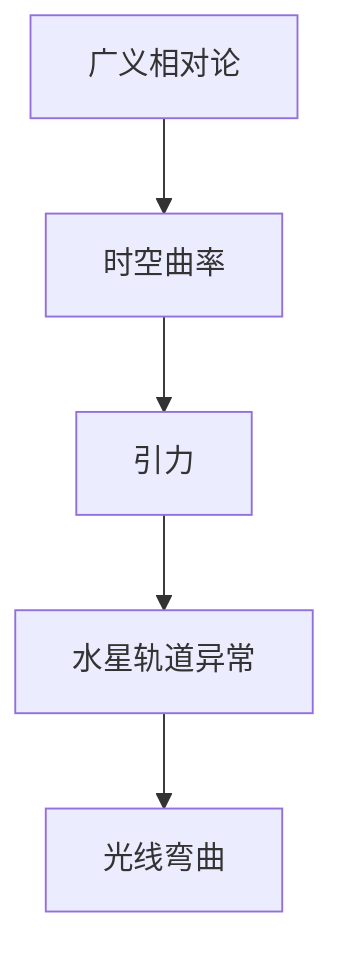

###### 2.1.2 量子力学

量子力学描述了微观粒子的行为，如电子、光子和原子核。它引入了量子比特、量子态等概念，对现代计算机科学和技术产生了深远影响。

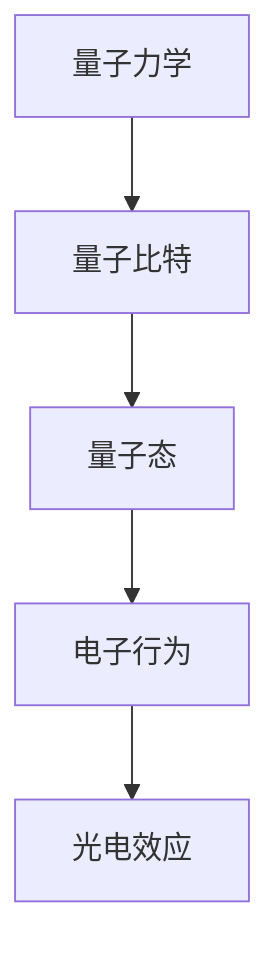

###### 2.1.3 宇宙膨胀定律

宇宙膨胀定律描述了宇宙从大爆炸以来不断膨胀的现象。哈勃定律是宇宙膨胀的一个重要表现，它表明星系之间的距离随着时间线性增加。

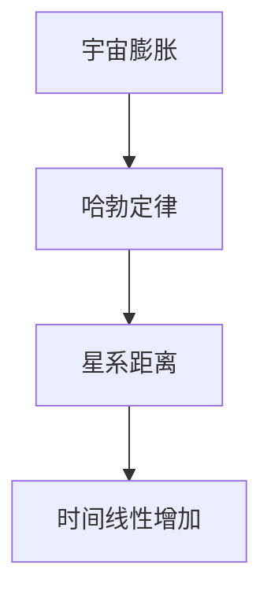

##### 2.2 宇宙化学规律

宇宙化学规律描述了宇宙中元素和化合物的生成和分布。元素合成、星系形成和黑洞与中子星都是宇宙化学规律的重要体现。

###### 2.2.1 元素合成

元素合成是指在恒星内部通过核反应生成更重的元素。恒星核心的核聚变过程是宇宙元素合成的主要途径。

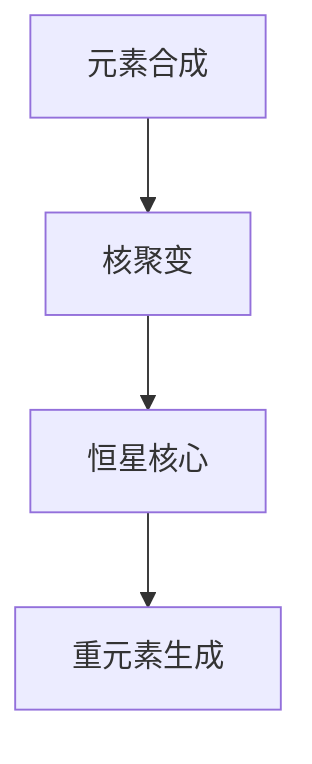

###### 2.2.2 星系形成

星系形成是宇宙化学规律的重要方面，它描述了星系如何从气体和尘埃云中形成。引力是星系形成的主要动力。

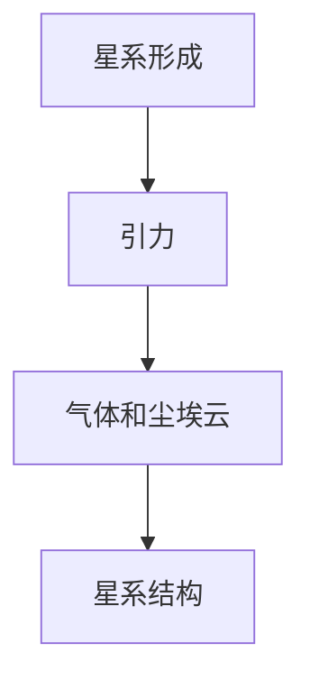

###### 2.2.3 黑洞与中子星

黑洞和中子星是宇宙中极端天体的代表。它们通过吸积盘、喷流等现象表现出独特的物理特性。

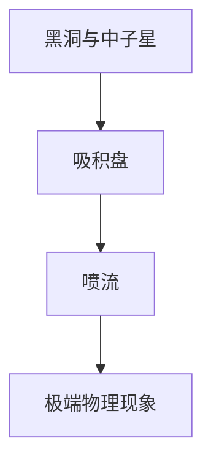

### 第3章：宇宙规律与量子AI的关联

##### 3.1 量子AI的概念

量子AI是指利用量子计算和量子信息理论来增强人工智能系统的能力。它结合了量子计算的高速并行处理能力和AI的强大数据分析和学习能力。

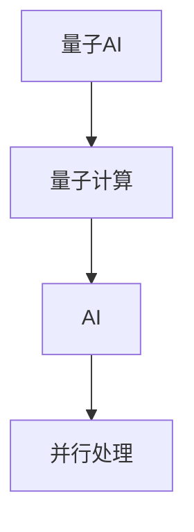

##### 3.2 量子AI的特点

量子AI具有高速并行处理、强大的量子搜索能力和高效的量子机器学习算法等特点。这些特点使得量子AI在解决复杂科学问题和优化算法方面具有显著优势。

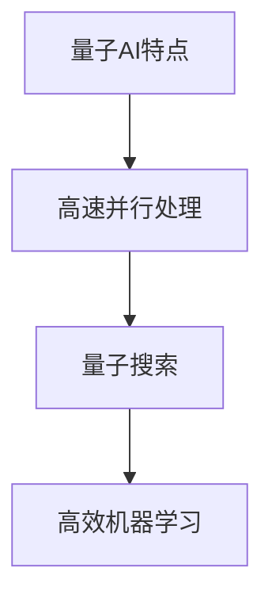

##### 3.3 宇宙规律对量子AI的影响

宇宙规律对量子AI的影响主要体现在两个方面：一是宇宙规律中的量子现象为量子AI提供了丰富的理论基础；二是宇宙规律中的复杂现象为量子AI提供了实际应用场景。例如，量子纠缠和量子态的叠加原理为量子AI提供了独特的计算优势。

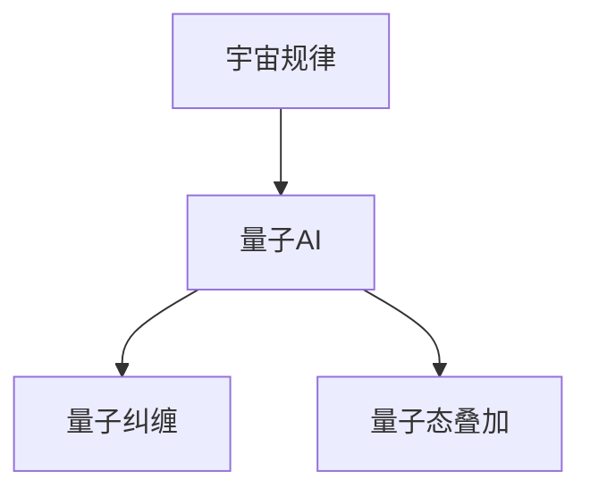

##### 3.4 量子AI对宇宙规律的启示

量子AI对宇宙规律的启示主要体现在两个方面：一是通过量子计算模拟宇宙现象，帮助我们更好地理解宇宙规律；二是通过量子AI的分析和优化，为宇宙探索提供新的工具和方法。例如，量子计算可以用于模拟黑洞事件视界，帮助我们更深入地理解黑洞的性质。

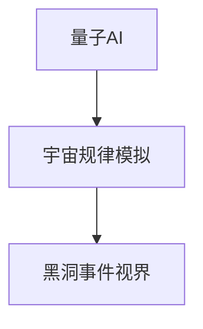

### 第二部分：宇宙规律在量子AI中的应用

#### 第4章：宇宙规律在量子AI中的应用

##### 4.1 量子计算

量子计算是量子AI的核心技术之一。它利用量子比特和量子门来实现高速并行计算和量子态的叠加，从而在解决复杂科学问题和优化算法方面具有显著优势。

###### 4.1.1 量子比特

量子比特是量子计算的基本单元，它不仅可以表示0和1的状态，还可以同时表示0和1的叠加状态。这种叠加状态使得量子计算具有并行处理能力。

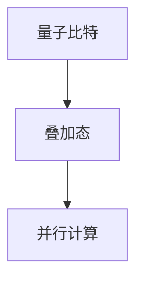

###### 4.1.2 量子门

量子门是量子计算的操作符，它通过改变量子比特的状态来实现计算。量子门的设计和优化是量子计算的关键。

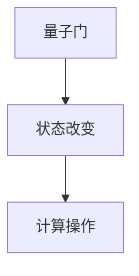

###### 4.1.3 量子纠缠

量子纠缠是量子计算中的重要现象，它描述了两个或多个量子比特之间的强关联。量子纠缠可以用来实现量子计算中的并行处理和高效通信。

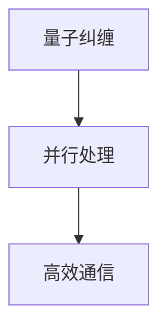

##### 4.2 量子机器学习

量子机器学习是量子AI的重要组成部分。它利用量子计算的优势来提高机器学习算法的效率和准确性。

###### 4.2.1 量子支持向量机

量子支持向量机是一种基于量子计算的机器学习算法，它通过优化量子比特的参数来实现分类和回归任务。

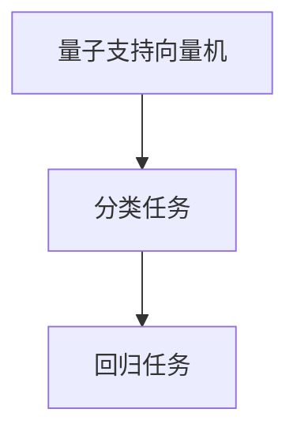

###### 4.2.2 量子神经网络

量子神经网络是一种基于量子计算的神经网络，它通过量子比特和量子门的相互作用来实现学习和预测。

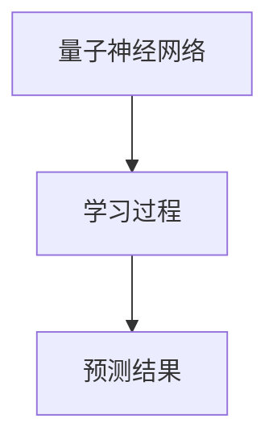

###### 4.2.3 量子深度学习

量子深度学习是一种基于量子计算的深度学习算法，它通过多层的量子门来实现复杂的神经网络结构。

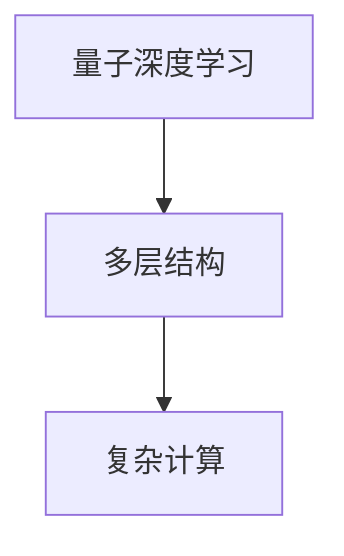

### 第三部分：宇宙规律与可解释量子AI

#### 第5章：宇宙规律与可解释量子AI

##### 5.1 可解释量子AI的概念

可解释量子AI是指具有可解释性和透明性的量子AI系统。它通过提供清晰的计算过程和解释机制，使量子AI的可理解性和可解释性得到提高。

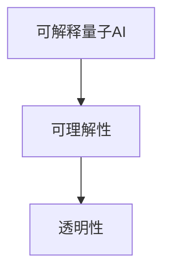

##### 5.2 可解释量子AI的重要性

可解释量子AI的重要性体现在其对科学研究和工程应用的实际价值。它可以帮助我们更好地理解量子计算的过程，提高算法的可靠性和安全性。

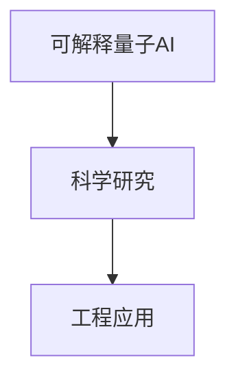

##### 5.3 宇宙规律对可解释量子AI的启示

宇宙规律对可解释量子AI的启示主要体现在两个方面：一是宇宙规律中的复杂现象为可解释量子AI提供了丰富的应用场景；二是宇宙规律中的量子现象为可解释量子AI提供了理论基础。

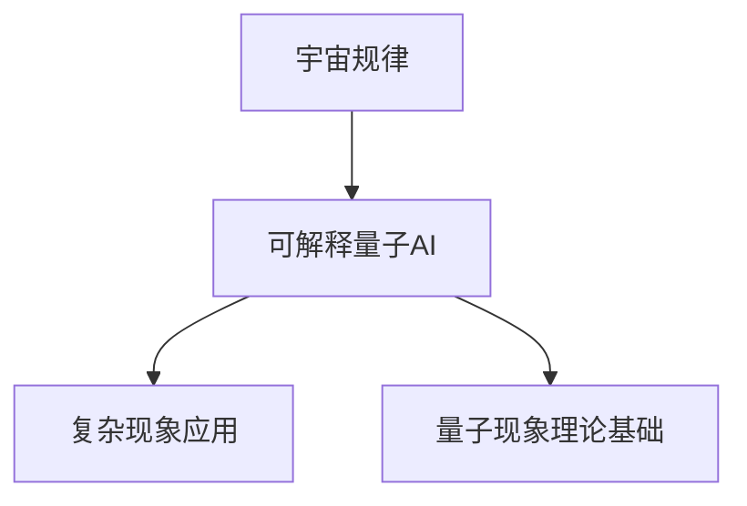

##### 5.4 可解释量子AI的发展趋势

随着量子计算技术的不断进步，可解释量子AI的发展趋势将越来越明显。未来，可解释量子AI将在科学研究、工程应用和商业领域发挥重要作用。

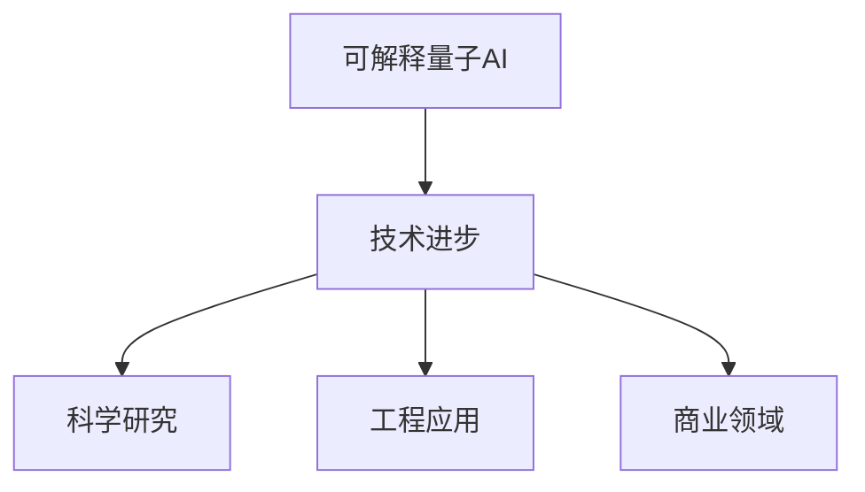

### 第四部分：量子AI在宇宙探索中的应用

#### 第6章：量子AI在宇宙探索中的应用

##### 6.1 量子计算在天文学中的应用

量子计算在天文学中的应用主要体现在对大规模天文数据的处理和分析上。量子计算可以显著提高天文数据的处理速度和准确性，为天文学家提供更精确的天文观测数据。

```mermaid
graph TB
    A[量子计算] --> B[大规模数据]
    B --> C[天文观测]
    B --> D[数据准确性]
```

##### 6.2 量子计算在宇宙学中的应用

量子计算在宇宙学中的应用主要体现在对宇宙膨胀、黑洞事件视界等宇宙现象的模拟上。通过量子计算，宇宙学家可以更深入地理解宇宙的起源和演化。

```mermaid
graph TB
    A[量子计算] --> B[宇宙现象模拟]
    B --> C[宇宙膨胀]
    B --> D[黑洞事件视界]
```

##### 6.3 量子AI在行星探测中的应用

量子AI在行星探测中的应用主要体现在对行星数据的分析和解释上。通过量子AI的分析，我们可以更准确地判断行星的环境条件是否适合生命存在。

```mermaid
graph TB
    A[量子AI] --> B[行星数据]
    B --> C[环境条件分析]
    B --> D[生命存在判断]
```

### 第五部分：未来展望

#### 第7章：未来展望

##### 7.1 量子AI与宇宙规律的未来关系

随着量子计算技术的不断进步，量子AI与宇宙规律的关系将越来越紧密。量子AI将成为理解宇宙规律的重要工具，为宇宙探索提供新的视角和方法。

```mermaid
graph TB
    A[量子AI] --> B[宇宙规律]
    B --> C[宇宙探索]
```

##### 7.2 量子AI在宇宙规律研究中的潜在应用

量子AI在宇宙规律研究中的潜在应用包括：利用量子计算模拟宇宙现象、优化宇宙探索算法、提高天文数据的处理和分析能力等。这些应用将为宇宙规律研究带来新的突破。

```mermaid
graph TB
    A[量子AI应用] --> B[宇宙规律研究]
    B --> C[模拟宇宙现象]
    B --> D[优化算法]
    B --> E[数据处理]
```

##### 7.3 宇宙规律与量子AI的融合发展趋势

未来，宇宙规律与量子AI的融合发展趋势将体现在以下几个方面：一是量子AI将成为理解宇宙规律的重要工具；二是宇宙规律将推动量子AI的理论发展；三是量子AI与宇宙规律的融合将为科学研究和技术创新带来新的机遇。

```mermaid
graph TB
    A[宇宙规律] --> B[量子AI]
    B --> C[科学研究]
    B --> D[技术创新]
```

### 第六部分：结论与展望

#### 第8章：结论与展望

##### 8.1 主要发现

本文主要发现包括：宇宙规律对量子AI的设计和应用具有重要启示；可解释量子AI在理解宇宙规律和探索宇宙现象方面具有巨大潜力；量子AI在宇宙规律研究中具有广泛的应用前景。

##### 8.2 研究意义

本文的研究意义在于：通过探讨宇宙规律与量子AI的关系，为量子AI在宇宙规律研究中的应用提供了新的思路和方法；通过分析可解释量子AI的特点和优势，为提高量子AI的可理解性和透明性提供了理论基础；通过总结量子AI在宇宙探索中的应用，为未来的宇宙探索提供了新的工具和方法。

##### 8.3 未来研究方向

未来研究方向包括：进一步研究宇宙规律与量子AI的深度融合，探索量子AI在宇宙规律研究中的新应用；深入研究可解释量子AI的理论和方法，提高量子AI的可理解性和透明性；开发更高效、更准确的量子计算算法，为宇宙探索提供更强的计算支持。

