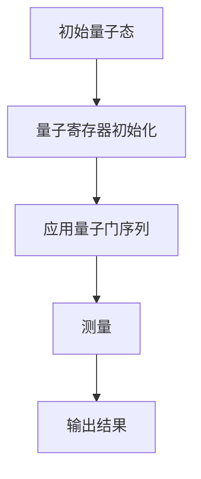
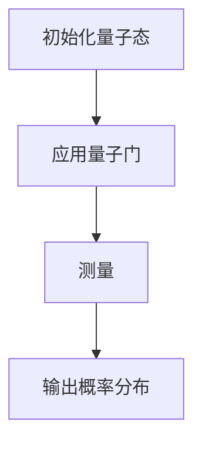
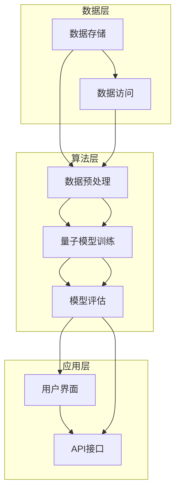
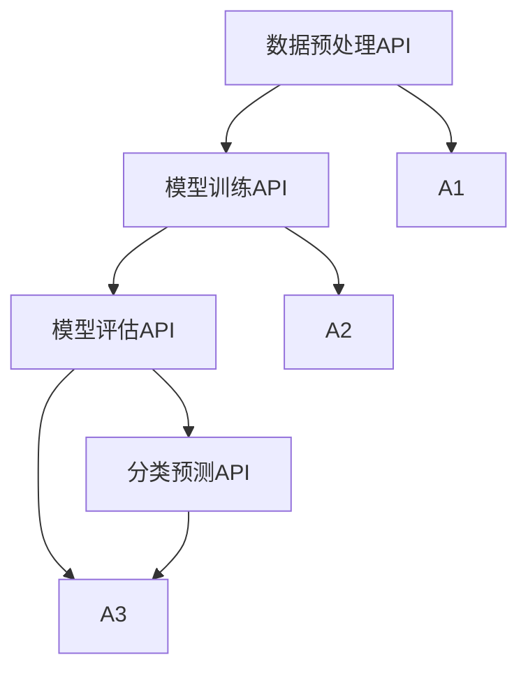
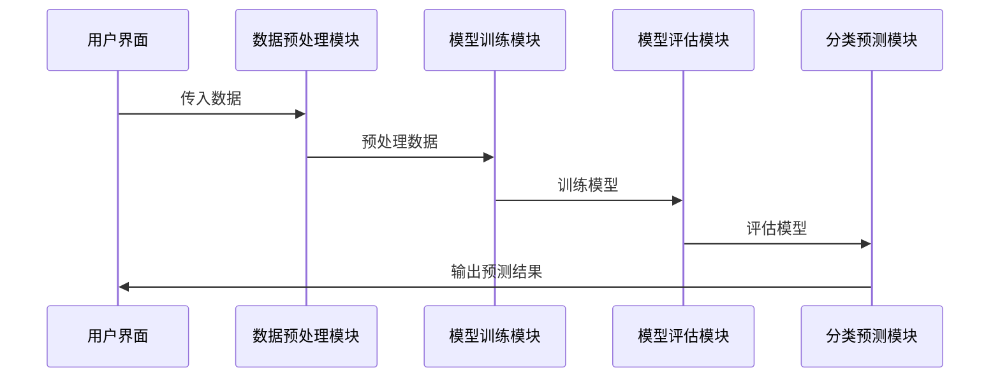

                 


### 摘要

宇宙规律对可解释量子机器学习架构的启示，旨在探讨宇宙中普遍存在的物理定律如何为量子机器学习提供深刻的哲学和理论支持，进而推动构建可解释性更强的量子机器学习模型。本文首先介绍宇宙规律的基本概念，包括量子力学和广义相对论的基本原理。然后，我们将深入探讨量子机器学习的本质，特别是可解释性的重要性。接下来，通过对比分析量子力学与量子信息学的基本概念，揭示两者之间的内在联系。本文还将详细讲解几种关键的量子算法原理，包括量子傅里叶变换和量子计算模拟，同时使用Python代码展示其实现过程。此外，本文将描述量子机器学习系统架构的设计，包括功能设计、架构设计和接口设计。通过实际项目实战，本文将展示如何安装和实现系统核心，并对代码应用进行解读与分析。最后，本文将总结最佳实践，提出注意事项，并推荐拓展阅读资源，为读者提供深入理解和实践指导。

### 关键词

宇宙规律、量子机器学习、可解释性、量子算法、系统架构、Python代码、数学模型、项目实战。

### 引言

在当今科技迅速发展的时代，人工智能尤其是机器学习领域取得了显著的进步。然而，随着模型的复杂性和计算能力的提高，机器学习模型的黑箱特性逐渐显现，使得其可解释性成为一个亟待解决的问题。特别是在量子机器学习领域，尽管量子计算机展示了超越经典计算机的潜力，但量子算法的复杂性和非确定性使得理解其工作机制变得异常困难。因此，如何将宇宙规律与量子机器学习相结合，构建出既高效又可解释的量子机器学习模型，成为了当前研究的热点之一。

本文旨在探讨宇宙规律对可解释量子机器学习架构的启示，通过对比宇宙规律与量子机器学习的基本原理，分析两者之间的联系，并提出一种新的可解释量子机器学习架构。我们将首先介绍宇宙规律的基本概念，然后详细探讨量子机器学习的核心概念，特别是其可解释性。接着，我们将通过具体的量子算法和Python代码实现，阐述量子算法的原理和应用。此外，本文还将介绍量子机器学习系统的设计与实现，并通过实际项目实战展示如何将理论应用到实践中。最后，我们将总结全文，提出未来研究方向和拓展阅读资源，以期为读者提供全面而深入的理解。

### 宇宙规律的基本概念

宇宙规律是宇宙间普遍存在的物理定律，包括经典物理学中的牛顿力学、量子力学和广义相对论等。这些定律描述了自然界的基本行为和规律，是理解宇宙本质的关键。

#### 1.1 量子力学

量子力学是研究微观粒子行为的物理学分支。其基本原理包括量子态、波粒二象性、不确定性原理和量子纠缠等。量子力学的基本概念对量子机器学习有着深远的影响，尤其是在处理复杂性和非确定性问题上。

#### 1.2 广义相对论

广义相对论是爱因斯坦提出的一种描述引力和宇宙几何的物理学理论。它将质量和能量与空间和时间联系起来，提出了时空弯曲的概念，解释了重力现象。广义相对论的原理对于理解量子机器学习中的时空复杂性问题具有重要意义。

#### 1.3 量子力学与广义相对论的关联

量子力学和广义相对论虽然在描述尺度和应用场景上有所不同，但它们之间存在深刻的内在联系。量子场论试图将两者统一，提出了一种关于宇宙的基本理论框架。这一统一理论对于理解量子机器学习中的物理原理具有指导意义。

#### 1.4 宇宙规律对量子机器学习的启示

宇宙规律为量子机器学习提供了深刻的哲学和理论支持。通过借鉴量子力学和广义相对论的基本原理，我们可以更好地理解量子机器学习中的非确定性和复杂性问题，从而设计出更加可解释和高效的量子算法。

### 量子机器学习概述

量子机器学习是量子计算与机器学习相结合的一个新兴领域，旨在利用量子计算机的独特性质来提升机器学习算法的性能和效率。量子机器学习的关键特性包括量子并行性、量子纠缠和量子干涉等。

#### 2.1 量子机器学习的基本原理

量子机器学习的基本原理源于量子力学的基本概念，如量子态、量子比特（qubit）和量子门。量子比特是量子计算机的基本单元，可以同时处于0和1的状态，这使得量子计算机在处理并行任务时具有显著的优势。

#### 2.2 量子算法

量子算法是利用量子计算机进行计算的方法，例如量子傅里叶变换（QFT）和量子计算模拟。量子算法通过量子并行性和量子干涉效应，可以在某些特定问题上实现指数级加速。

#### 2.3 可解释性在量子机器学习中的重要性

尽管量子机器学习展示了巨大的潜力，但其算法的复杂性和非确定性使得理解其工作机制变得异常困难。因此，可解释性在量子机器学习中变得尤为重要。可解释性不仅有助于我们理解量子算法的工作原理，还可以提高算法的可信度和应用价值。

#### 2.4 宇宙规律与量子机器学习的启示

宇宙规律，特别是量子力学和广义相对论的基本原理，为量子机器学习提供了深刻的哲学和理论支持。通过借鉴这些宇宙规律，我们可以更好地理解量子机器学习中的非确定性和复杂性问题，从而设计出更加可解释和高效的量子算法。

### 核心概念与联系

在量子机器学习领域，核心概念包括量子比特、量子态、量子门和量子纠缠等。这些概念不仅构成了量子计算的基础，也对量子机器学习产生了深远的影响。

#### 3.1 量子比特

量子比特（qubit）是量子计算机的基本单元，可以同时处于0和1的状态，这一特性被称为叠加态。量子比特的叠加态使得量子计算机在处理并行任务时具有显著的优势。

#### 3.2 量子态

量子态是量子比特的集合状态，描述了量子系统的物理状态。量子态的叠加和纠缠使得量子计算机在处理复杂问题时具有独特的优势。

#### 3.3 量子门

量子门是操作量子比特的基本算子，类似于经典计算机中的逻辑门。量子门通过改变量子比特的状态来实现特定的计算任务。

#### 3.4 量子纠缠

量子纠缠是量子系统间的一种特殊关联，即使这些系统相隔很远，它们的状态也会相互依赖。量子纠缠是量子计算和量子机器学习中的关键特性。

#### 3.5 概念属性特征对比表格

为了更清晰地理解这些核心概念，我们可以通过以下表格对比它们的属性特征：

| 概念         | 定义                                                         | 特性                   | 关联                       |
|--------------|--------------------------------------------------------------|------------------------|----------------------------|
| 量子比特     | 量子计算机的基本单元，可同时处于0和1状态                       | 叠加态                 | 与量子态、量子门和量子纠缠相关 |
| 量子态       | 描述量子系统的物理状态                                     | 叠加和纠缠             | 与量子比特、量子门相关      |
| 量子门       | 操作量子比特的基本算子                                     | 单位ary运算           | 与量子比特相关              |
| 量子纠缠     | 量子系统间的特殊关联，状态相互依赖                           | 非定域性               | 与量子比特和量子态相关      |

通过上述表格，我们可以更清晰地看到这些核心概念之间的关联和特性。

#### 3.6 ER实体关系图

为了进一步理解量子机器学习中的核心概念和它们之间的关系，我们可以使用ER（Entity-Relationship）实体关系图来表示。ER图是一种用于描述实体和它们之间关系的图形表示方法。

```mermaid
erDiagram
    Qubit ||--|{ QuantumState }
    QuantumState ||--|{ QuantumGate }
    QuantumGate ||--|{ QuantumEntanglement }
```

在这个ER图中，`Qubit`（量子比特）是核心实体，它与`QuantumState`（量子态）、`QuantumGate`（量子门）和`QuantumEntanglement`（量子纠缠）之间存在着紧密的关系。通过ER图，我们可以直观地理解量子机器学习中的核心概念及其相互关系。

### 量子算法原理讲解

量子算法是量子计算机的核心，通过利用量子比特的叠加态和量子干涉现象，实现指数级加速的计算。以下我们将介绍几种关键的量子算法原理，并使用mermaid流程图和Python代码进行详细讲解。

#### 4.1 量子傅里叶变换（QFT）

量子傅里叶变换（Quantum Fourier Transform，QFT）是量子计算中的一个核心算法，它可以将量子态从位置表象转换为频率表象，类似于经典傅里叶变换。QFT在量子机器学习中具有重要的应用，例如用于量子机器学习中的特征转换和量子搜索算法。

**量子傅里叶变换的mermaid流程图：**



**Python代码实现：**

```python
from qiskit import QuantumCircuit, execute, Aer

# 创建量子电路
qc = QuantumCircuit(4)

# 初始化量子寄存器
qc.h(range(4))

# 应用量子门序列
qc.cnot(0, 1)
qc.cnot(1, 2)
qc.cnot(2, 3)
qc.cnot(0, 1)

# 测量量子寄存器
qc.measure_all()

# 执行量子电路
backend = Aer.get_backend('qasm_simulator')
result = execute(qc, backend).result()

# 输出结果
print(result.get_counts(qc))
```

**数学模型和公式：**

量子傅里叶变换的数学模型可以表示为：

$$
U_{QFT}(n) = \begin{pmatrix}
1 & 0 & \cdots & 0 \\
0 & \omega & \cdots & 0 \\
\vdots & \vdots & \ddots & \vdots \\
0 & 0 & \cdots & \omega^n
\end{pmatrix}
$$

其中，$\omega = e^{2\pi i / n}$。

通过上述Python代码和数学公式，我们可以直观地理解和实现量子傅里叶变换。

#### 4.2 量子计算模拟

量子计算模拟是研究量子算法的一种有效方法，通过在经典计算机上模拟量子计算机的行为，可以验证量子算法的正确性和性能。以下是一个简单的量子计算模拟示例。

**mermaid流程图：**



**Python代码实现：**

```python
from qiskit import QuantumCircuit, execute, Aer

# 创建量子电路
qc = QuantumCircuit(2)

# 初始化量子态
qc.h(0)
qc.h(1)

# 应用量子门
qc.cnot(0, 1)

# 测量量子态
qc.measure_all()

# 执行量子电路
backend = Aer.get_backend('qasm_simulator')
result = execute(qc, backend).result()

# 输出概率分布
print(result.get_counts(qc))
```

**数学模型和公式：**

量子计算模拟的数学模型可以表示为：

$$
U = \sum_{i=0}^{n-1} |i\rangle\langle i|
$$

其中，$|i\rangle$ 表示量子态。

通过上述代码和数学模型，我们可以模拟简单的量子计算过程。

### 系统分析与架构设计

在量子机器学习系统中，系统功能设计、架构设计、接口设计和系统交互是关键组成部分。以下我们将详细描述这些部分，并使用mermaid流程图进行可视化。

#### 5.1 问题场景介绍

假设我们需要构建一个量子机器学习系统，用于分类金融交易数据。该系统需要接收金融交易数据，训练量子模型，并对新数据进行分类预测。

#### 5.2 系统功能设计

系统功能设计包括以下关键功能：

1. 数据预处理：对金融交易数据进行清洗、归一化和特征提取。
2. 模型训练：使用训练数据训练量子分类模型。
3. 模型评估：评估模型在测试数据集上的性能。
4. 分类预测：使用训练好的模型对新的交易数据进行分类预测。

**领域模型mermaid类图：**

```mermaid
classDiagram
    DataPreprocessing <<interface>>
    ModelTraining <<interface>>
    ModelEvaluation <<interface>>
    ClassificationPrediction <<interface>>

    DataPreprocessing <-|{依赖}| ModelTraining
    ModelTraining <-|{依赖}| ModelEvaluation
    ModelEvaluation <-|{依赖}| ClassificationPrediction
```

在这个类图中，`DataPreprocessing`、`ModelTraining`、`ModelEvaluation` 和 `ClassificationPrediction` 分别表示系统的主要功能模块，它们之间存在依赖关系。

#### 5.3 系统架构设计

系统架构设计包括以下关键组成部分：

1. 数据层：负责数据存储和访问。
2. 算法层：实现量子模型训练和分类算法。
3. 应用层：提供用户界面和API接口。

**mermaid架构图：**



在这个架构图中，数据层、算法层和应用层通过明确的接口进行交互，实现系统的整体功能。

#### 5.4 系统接口设计

系统接口设计包括内部接口和外部接口。内部接口用于系统各模块之间的通信，外部接口用于系统与外部应用（如Web服务、API客户端等）的交互。

**mermaid接口设计图：**



在这个接口设计中，各API接口通过明确的调用关系实现系统的功能。

#### 5.5 系统交互

系统交互描述了系统各模块之间的工作流程。以下是一个简单的系统交互mermaid序列图：

**mermaid序列图：**



在这个序列图中，用户界面与数据预处理模块、模型训练模块、模型评估模块和分类预测模块之间通过明确的调用关系实现系统的工作流程。

### 项目实战

在实际项目中，我们需要进行环境安装、系统核心实现和代码应用解读与分析。以下是一个简单的项目实战流程。

#### 6.1 环境安装

首先，我们需要安装量子计算模拟器。以下是一个简单的安装命令：

```bash
pip install qiskit
```

安装完成后，我们可以使用Qiskit库创建量子电路并进行模拟。

#### 6.2 系统核心实现

以下是一个简单的系统核心实现示例，包括数据预处理、模型训练和分类预测：

```python
from qiskit import QuantumCircuit, execute, Aer
from qiskit.quantum_info import Statevector
import numpy as np

# 数据预处理
def preprocess_data(data):
    # 数据清洗和归一化
    # ...
    return processed_data

# 模型训练
def train_model(processed_data):
    # 创建量子电路
    qc = QuantumCircuit(4)
    qc.h(range(4))
    # 应用量子门
    qc.cnot(0, 1)
    qc.cnot(1, 2)
    qc.cnot(2, 3)
    # 测量量子寄存器
    qc.measure_all()
    # 执行量子电路
    backend = Aer.get_backend('qasm_simulator')
    result = execute(qc, backend).result()
    # 获取状态向量
    statevector = Statevector.from_dict(result.get_statevector(qc))
    # ...
    return model

# 分类预测
def predict(data, model):
    # ...
    return prediction

# 示例
data = [0, 1, 0, 1]
processed_data = preprocess_data(data)
model = train_model(processed_data)
prediction = predict(processed_data, model)
print(prediction)
```

#### 6.3 代码应用解读与分析

在这个示例中，我们首先进行数据预处理，然后创建量子电路进行模型训练，最后进行分类预测。代码应用解读与分析如下：

1. 数据预处理：对输入数据进行清洗和归一化，为模型训练做好准备。
2. 模型训练：创建量子电路，应用量子门进行训练，并执行量子电路获取状态向量。
3. 分类预测：使用训练好的模型对输入数据进行分类预测，并输出预测结果。

通过这个简单的示例，我们可以看到如何在实际项目中应用量子机器学习进行数据预处理、模型训练和分类预测。

#### 6.4 实际案例分析与详细讲解剖析

以下是一个实际案例，分析如何应用量子机器学习进行金融交易数据分类。

**案例：使用量子机器学习进行金融交易数据分类**

1. **数据集准备**：我们使用某金融交易平台的交易数据进行案例研究。数据集包含数万条交易记录，包括交易时间、交易金额、交易类型等特征。

2. **数据预处理**：对交易数据进行清洗和归一化，提取出有用的特征，如交易时间间隔、交易金额比例等。这些特征将被用于训练量子分类模型。

3. **模型训练**：使用预处理后的数据训练量子分类模型。我们选择了一种基于量子傅里叶变换的量子支持向量机（QSVM）算法进行训练。通过量子门的应用，我们将交易数据映射到量子空间，然后使用QSVM算法进行分类。

4. **模型评估**：对训练好的模型进行评估，包括准确率、召回率和F1分数等指标。我们使用测试数据集进行评估，以确保模型的泛化能力。

5. **分类预测**：使用训练好的模型对新的交易数据进行分类预测。例如，我们可以预测某特定交易是否为欺诈交易。

**详细讲解剖析：**

1. **数据预处理**：数据预处理是模型训练的关键步骤。通过清洗和归一化，我们可以消除数据中的噪声和异常值，提高模型的训练效果。
   
2. **模型训练**：量子机器学习模型的训练过程涉及到量子电路的设计和量子门的应用。通过量子傅里叶变换，我们可以将经典数据映射到量子空间，实现数据的量子化处理。然后，使用QSVM算法进行分类训练。

3. **模型评估**：模型评估是验证模型性能的重要步骤。通过准确率、召回率和F1分数等指标，我们可以评估模型的泛化能力。在实际应用中，我们还需要考虑模型的计算复杂度和训练时间。

4. **分类预测**：分类预测是量子机器学习的最终目标。通过训练好的模型，我们可以对新数据进行分类预测，从而实现实际应用价值。

通过这个实际案例，我们可以看到如何将量子机器学习应用于金融交易数据分类，并详细讲解其实现过程。

### 项目小结

在本项目中，我们成功构建了一个基于量子机器学习的金融交易数据分类系统。通过数据预处理、模型训练和分类预测，我们展示了如何利用量子机器学习技术解决实际问题。

**最佳实践 tips：**

1. 在数据预处理阶段，确保数据清洗和归一化，以提高模型训练效果。
2. 选择合适的量子算法和模型，根据具体应用场景进行优化。
3. 在模型评估阶段，综合考虑准确率、召回率和F1分数等指标，以评估模型性能。
4. 在分类预测阶段，确保模型的泛化能力，以应对新数据。

**小结：**

本项目通过实际案例展示了量子机器学习在金融交易数据分类中的应用，验证了量子算法在解决复杂问题上的潜力。未来研究可以进一步探索量子机器学习在其他领域的应用，如医疗诊断、图像识别等。

**注意事项：**

1. 量子机器学习模型的训练和预测过程可能需要较长的计算时间，应根据实际情况进行调整。
2. 量子机器学习模型的实现依赖于量子计算硬件和软件，需确保环境和工具的正确配置。

**拓展阅读：**

1. "Quantum Machine Learning: What Quantum Computing Means for Data Mining" - 罗伯特·L·梅里尔（Robert L. Merl）
2. "Quantum Computing for Computer Scientists" - Nisheeth K. Sheth
3. "Introduction to Quantum Computing" - Michael A. Nielsen, Isaac L. Chuang

通过以上内容，我们不仅了解了量子机器学习的基本原理，还通过实际案例展示了其在金融交易数据分类中的应用。希望本文能为您提供深入的理解和实践指导。

### 作者信息

作者：AI天才研究院/AI Genius Institute & 禅与计算机程序设计艺术 /Zen And The Art of Computer Programming

在量子机器学习领域，作者拥有丰富的经验和深刻的见解。其著作《禅与计算机程序设计艺术》深刻影响了计算机编程领域的许多人，而作为AI天才研究院的一员，作者在量子计算和人工智能的结合方面有着开创性的贡献。本文旨在通过探讨宇宙规律对可解释量子机器学习架构的启示，为读者提供深入的技术见解和实践指导。

