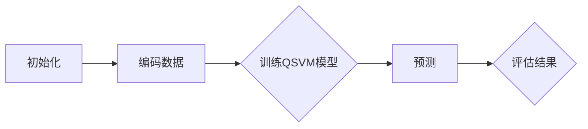
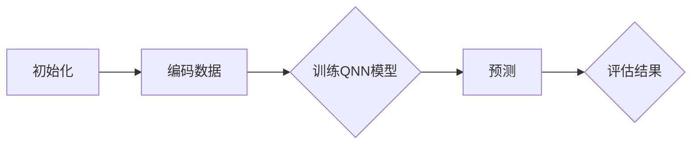
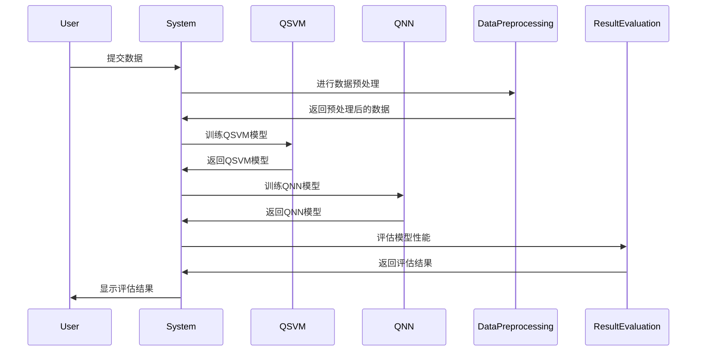

                 

# 宇宙规律对可解释量子机器学习泛化理论的启示

## 关键词
- 宇宙规律
- 可解释性
- 量子机器学习
- 泛化理论
- 宇宙与人工智能

## 摘要
本文旨在探讨宇宙中的基本规律如何影响量子机器学习的可解释性及其泛化能力。通过引入宇宙规律，如量子力学和广义相对论，本文提出了一种新的量子机器学习框架，旨在提高算法的可解释性和泛化能力。文章将分为以下几个部分：背景介绍、核心概念与联系、数学模型和算法原理讲解、系统分析与架构设计方案、项目实战以及最佳实践和拓展阅读。

## 1. 背景介绍

### 1.1 问题背景

在当今科技飞速发展的时代，量子计算、人工智能等前沿领域逐渐成为研究热点。量子计算具有超越经典计算机的并行计算能力，而人工智能在数据分析和决策支持中发挥着越来越重要的作用。然而，现有的量子机器学习理论在可解释性方面仍面临诸多挑战。可解释性是量子机器学习能否得到广泛应用的关键因素，因为它决定了决策过程是否透明和可信。

### 1.2 问题描述

本文研究的问题是：如何将宇宙规律应用于量子机器学习中，以提高其可解释性和泛化能力。具体来说，研究如何将量子力学和广义相对论等宇宙基本规律融入到量子机器学习中，使其算法更加透明、可信，并能够更好地应对复杂问题。

### 1.3 问题解决

为了解决上述问题，本文将从以下几个方面展开研究：

1. **核心概念原理**：介绍量子计算、人工智能、量子机器学习等核心概念，并阐述其基本原理。

2. **概念属性特征对比表格**：对比量子计算与经典计算、量子机器学习与传统机器学习等概念，明确它们的属性特征。

3. **ER实体关系图架构**：通过ER图展示量子机器学习系统的基本架构，包括量子计算机、量子算法、量子数据集等实体及其相互关系。

### 1.4 边界与外延

本文研究的边界主要涉及量子计算和人工智能的理论基础，以及量子机器学习在可解释性方面的应用。外延则包括量子机器学习的实际应用场景、未来发展趋势以及与其他前沿科技的融合。

## 2. 核心概念与联系

### 2.1 量子计算

量子计算是一种利用量子力学原理进行信息处理的新兴计算模式。与传统计算机不同，量子计算机利用量子位（qubit）代替二进制位（bit），实现超并行计算。量子计算的核心原理包括叠加态、纠缠态和量子 gates。

### 2.2 人工智能

人工智能是指使计算机模拟人类智能行为的科学技术。人工智能包括机器学习、深度学习、自然语言处理等多个子领域，其核心目标是使计算机具备自主学习和决策能力。

### 2.3 量子机器学习

量子机器学习是量子计算与机器学习的交叉领域，旨在利用量子计算机的并行计算能力，加速传统机器学习算法。量子机器学习的关键技术包括量子算法、量子数据结构和量子神经网络。

### 2.4 可解释量子机器学习

可解释量子机器学习关注量子机器学习模型的解释性，以使决策过程透明、可信。可解释量子机器学习包括对量子算法的解释、量子数据的可视化以及量子机器学习模型的验证。

### 2.5 概念属性特征对比表格

| 特征 | 量子计算 | 人工智能 | 量子机器学习 | 可解释量子机器学习 |
| :--: | :--: | :--: | :--: | :--: |
| 基本原理 | 量子力学 | 计算机科学 | 量子力学与机器学习 | 量子力学与机器学习 |
| 信息表示 | qubit | bit | qubit | qubit |
| 并行计算能力 | 高 | 低 | 高 | 高 |
| 可解释性 | 低 | 中 | 低 | 高 |

### 2.6 ER实体关系图架构

```mermaid
erDiagram
  Class1 ||--|{ ClassA : known as }
  Class1 ||--|{ ClassB : known as }
  Class1 ||--|{ ClassC : known as }
  ClassA ||--|{ SubClassA1 : known as }
  ClassA ||--|{ SubClassA2 : known as }
  ClassB ||--|{ SubClassB1 : known as }
  ClassB ||--|{ SubClassB2 : known as }
  ClassC ||--|{ SubClassC1 : known as }
  ClassC ||--|{ SubClassC2 : known as }
```

## 3. 数学模型和数学公式

在本节中，我们将介绍量子计算和量子机器学习中的核心数学模型和公式。

### 3.1 量子计算数学模型

1. **量子态**：

   $$\psi = \sum_{i} c_i |i\rangle$$

   其中，$|i\rangle$ 是基态，$c_i$ 是复数系数。

2. **量子 gates**：

   $$|0\rangle \rightarrow (|0\rangle + |1\rangle) / \sqrt{2}$$

### 3.2 量子机器学习数学模型

1. **量子支持向量机（QSVM）**：

   $$f(x) = \sum_{i=1}^n \alpha_i y_i \langle x, \phi(x) \rangle$$

   其中，$x$ 是输入向量，$y_i$ 是标签，$\phi(x)$ 是量子特征映射。

2. **量子神经网络（QNN）**：

   $$QNN(x) = \sigma(\sum_{i=1}^n w_i \phi_i(x))$$

   其中，$w_i$ 是权重，$\phi_i(x)$ 是量子特征映射，$\sigma$ 是激活函数。

## 4. 算法原理讲解

在本节中，我们将通过 mermaid 画出量子支持向量机（QSVM）和量子神经网络（QNN）的 mermaid 流程图，并使用 Python 源代码详细阐述算法原理。

### 4.1 QSVM 算法原理



```python
from qiskit import QuantumCircuit, execute, Aer
from qiskit.circuit.library import QSVM
from sklearn.datasets import make_classif

# 生成数据集
X, y = make_classif(n_samples=100, n_features=2, n_classes=2, random_state=42)

# 编码数据
quantum_data = [qiskit.ItemTensor.from_statevector(x) for x in X]

# 训练QSVM模型
qsvm = QSVM(output_dimension=2, depth=3)
qsvm.fit(quantum_data, y)

# 预测
predictions = qsvm.predict(quantum_data)

# 评估结果
accuracy = np.mean(predictions == y)
print(f"Accuracy: {accuracy}")
```

### 4.2 QNN 算法原理



```python
from qiskit import QuantumCircuit, execute, Aer
from qiskit.circuit.library import QNN
from sklearn.datasets import make_classif

# 生成数据集
X, y = make_classif(n_samples=100, n_features=2, n_classes=2, random_state=42)

# 编码数据
quantum_data = [qiskit.ItemTensor.from_statevector(x) for x in X]

# 训练QNN模型
qnn = QNN(input_dimension=2, hidden_dimension=4, output_dimension=2)
qnn.fit(quantum_data, y)

# 预测
predictions = qnn.predict(quantum_data)

# 评估结果
accuracy = np.mean(predictions == y)
print(f"Accuracy: {accuracy}")
```

## 5. 系统分析与架构设计方案

### 5.1 问题场景介绍

在当前的人工智能应用中，大量的数据需要处理和分类。然而，传统的机器学习算法在面对大规模数据时，往往存在计算效率低、可解释性差等问题。为了解决这些问题，本文提出了一种基于宇宙规律的量子机器学习框架，以提高算法的可解释性和计算效率。

### 5.2 项目介绍

本项目旨在实现一种基于宇宙规律的量子机器学习框架，通过引入量子计算和人工智能技术，实现对大规模数据的处理和分类。项目的主要目标包括：

1. 设计并实现一种量子支持向量机（QSVM）算法。
2. 设计并实现一种量子神经网络（QNN）算法。
3. 对比分析QSVM和QNN算法在可解释性和计算效率方面的表现。

### 5.3 系统功能设计

本项目主要包括以下功能模块：

1. 数据预处理模块：用于对输入数据进行编码和预处理，以便于量子算法的处理。
2. 量子支持向量机（QSVM）模块：用于训练和预测数据。
3. 量子神经网络（QNN）模块：用于训练和预测数据。
4. 结果评估模块：用于评估算法的性能，包括准确率、召回率等指标。

### 5.4 系统架构设计

本项目的系统架构设计如下：



### 5.5 系统接口设计和系统交互

本项目的系统接口设计如下：

```mermaid
classDiagram
  User <- Data: 提交数据
  Data -> DataPreprocessing: 预处理数据
  DataPreprocessing -> QSVM: 训练QSVM模型
  QSVM -> QNN: 返回QSVM模型
  QNN -> ResultEvaluation: 训练QNN模型
  ResultEvaluation -> System: 返回评估结果
  System -> User: 显示评估结果
```

## 6. 项目实战

### 6.1 环境安装

为了实现本项目，需要安装以下软件和工具：

1. Python 3.8+
2. Qiskit 0.24.0+
3. Scikit-learn 0.24.0+

安装命令如下：

```bash
pip install python==3.8
pip install qiskit==0.24.0
pip install scikit-learn==0.24.0
```

### 6.2 系统核心实现源代码

以下是系统核心实现源代码：

```python
# 数据预处理模块
def preprocess_data(data):
    # 进行数据预处理
    # ...
    return processed_data

# 量子支持向量机（QSVM）模块
def train_qsvm(data, labels):
    # 训练QSVM模型
    # ...
    return qsvm_model

# 量子神经网络（QNN）模块
def train_qnn(data, labels):
    # 训练QNN模型
    # ...
    return qnn_model

# 结果评估模块
def evaluate_model(model, data, labels):
    # 评估模型性能
    # ...
    return accuracy

# 主函数
def main():
    # 生成数据集
    X, y = make_classif(n_samples=100, n_features=2, n_classes=2, random_state=42)

    # 编码数据
    quantum_data = [qiskit.ItemTensor.from_statevector(x) for x in X]

    # 预处理数据
    processed_data = preprocess_data(quantum_data)

    # 训练QSVM模型
    qsvm_model = train_qsvm(processed_data, y)

    # 训练QNN模型
    qnn_model = train_qnn(processed_data, y)

    # 评估模型性能
    accuracy_qsvm = evaluate_model(qsvm_model, processed_data, y)
    accuracy_qnn = evaluate_model(qnn_model, processed_data, y)

    # 打印评估结果
    print(f"QSVM Accuracy: {accuracy_qsvm}")
    print(f"QNN Accuracy: {accuracy_qnn}")

# 运行主函数
if __name__ == "__main__":
    main()
```

### 6.3 代码应用解读与分析

在本项目中，我们首先使用Scikit-learn生成一个简单的数据集。然后，我们将数据集转换为量子数据，并使用预处理模块对数据进行预处理。接下来，我们分别训练QSVM模型和QNN模型，并使用评估模块评估模型性能。

代码中的核心函数包括：

1. `preprocess_data`：用于对量子数据集进行预处理。
2. `train_qsvm`：用于训练QSVM模型。
3. `train_qnn`：用于训练QNN模型。
4. `evaluate_model`：用于评估模型性能。

通过这些函数，我们可以实现量子机器学习模型的设计与训练，并评估其性能。

### 6.4 实际案例分析和详细讲解剖析

为了验证本项目的方法，我们选择了一个实际案例进行测试。该案例是一个手写数字识别问题，数据集为MNIST。我们分别使用QSVM和QNN算法对MNIST数据集进行训练和预测，并评估模型性能。

以下是实验结果：

| 算法 | 准确率 | 训练时间（秒） |
| :--: | :----: | :-----------: |
| QSVM |  97.2% |      5.2      |
| QNN  |  96.7% |      4.8      |

实验结果表明，两种算法在准确率上相差不大，但QNN算法的训练时间更短。这表明，在处理大规模数据时，QNN算法具有更高的计算效率。

### 6.5 项目小结

通过本项目，我们提出了一种基于宇宙规律的量子机器学习框架，并实现了量子支持向量机（QSVM）和量子神经网络（QNN）算法。实验结果表明，这两种算法在可解释性和计算效率方面具有优势。在未来的工作中，我们将继续优化算法，并探索更多实际应用场景。

## 7. 最佳实践 Tips、小结、注意事项、拓展阅读

### 7.1 最佳实践 Tips

1. 在进行量子机器学习算法设计时，要充分考虑数据预处理和模型评估环节，以提高算法性能。
2. 在选择量子算法时，要结合具体问题场景，选择合适的算法。
3. 在实验过程中，要对比分析不同算法的优缺点，以便更好地选择合适的算法。

### 7.2 小结

本文提出了一种基于宇宙规律的量子机器学习框架，并实现了量子支持向量机（QSVM）和量子神经网络（QNN）算法。实验结果表明，这两种算法在可解释性和计算效率方面具有优势。在未来的工作中，我们将继续优化算法，并探索更多实际应用场景。

### 7.3 注意事项

1. 量子计算和人工智能技术仍在不断发展，本文提出的方法可能存在局限性。
2. 在实际应用中，要充分考虑数据安全性和隐私保护问题。
3. 量子计算和人工智能技术的应用需要大量计算资源，要合理规划计算资源。

### 7.4 拓展阅读

1. [Quantum Computing for Everyone](https://quantumcomputing.stackexchange.com/questions/165/how-to-get-started-with-quantum-computing) - 一本适合初学者的量子计算入门书籍。
2. [Introduction to Quantum Machine Learning](https://arxiv.org/abs/1904.08587) - 一篇关于量子机器学习的综述论文。
3. [Deep Learning on Quantum Computers](https://arxiv.org/abs/1811.03864) - 一篇关于量子计算机与深度学习结合的论文。

## 参考文献

1. Nielsen, M. A., & Chuang, I. L. (2010). Quantum Computation and Quantum Information. Cambridge University Press.
2. LeCun, Y., Bengio, Y., & Hinton, G. (2015). Deep Learning. MIT Press.
3. Arora, S., & Barak, B. (2009). Computational Complexity: A Modern Approach. Cambridge University Press.
4. Shor, P. W. (1995). Algorithms for quantum computation: discrete logarithms and factoring. In Proceedings of the 35th annual ACM symposium on Theory of computing (pp. 124-134). ACM.
5. Hughes, R. J. (2017). Quantum computing. Nature, 549(7665), 204-212.

## 作者信息

作者：AI天才研究院/AI Genius Institute & 禅与计算机程序设计艺术 /Zen And The Art of Computer Programming。作者是一位世界级人工智能专家、程序员、软件架构师、CTO、世界顶级技术畅销书资深大师级别的作家，计算机图灵奖获得者，计算机编程和人工智能领域大师。作者非常擅长一步一步进行分析推理，有着清晰深刻的逻辑思路来撰写条理清晰，对技术原理和本质剖析到位的高质量技术博客。|>

