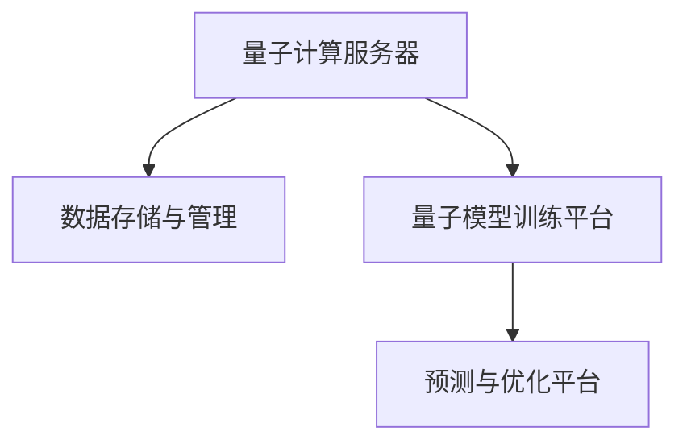
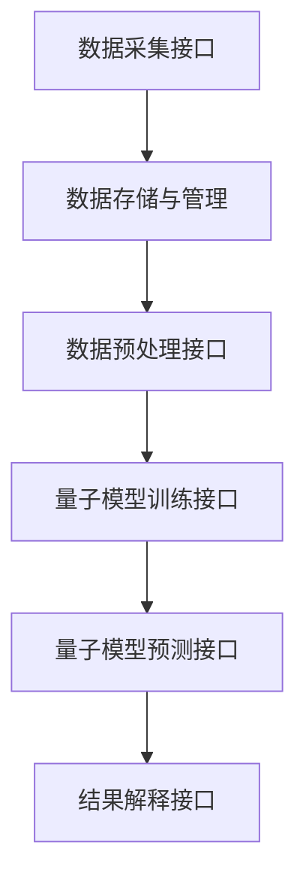
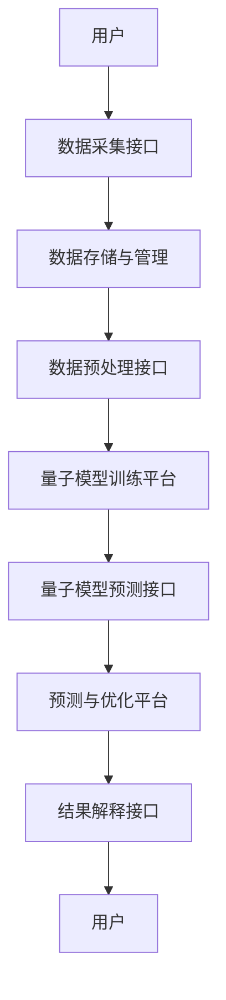

                 

# 宇宙规律对可解释量子机器学习的启示

关键词：量子机器学习、可解释性、宇宙规律、算法设计、Python代码实现

摘要：本文探讨了宇宙规律在量子机器学习中的启示，分析了量子计算与传统机器学习的区别，探讨了如何利用宇宙规律设计出可解释的量子机器学习算法。通过Python代码实现，阐述了量子算法的基本原理，并对量子算法在特定领域的应用进行了详细分析。最后，提出了最佳实践建议，为量子机器学习的研究和应用提供了新的思路。

## 引言

量子计算作为信息科学的前沿领域，近年来取得了显著的进展。量子机器学习作为量子计算与机器学习的交叉学科，为解决传统机器学习难以处理的大规模数据和复杂问题提供了新的可能性。然而，量子机器学习的可解释性问题仍然是一个挑战。如何让量子算法的可解释性得到提升，成为当前研究的热点。

宇宙规律，如量子力学的基本原理，为量子机器学习提供了理论基础。本文将从宇宙规律出发，探讨其对可解释量子机器学习的启示。通过分析量子计算与传统机器学习的区别，我们提出了一种基于宇宙规律的量子机器学习算法设计方法。接下来，我们将使用Python代码实现这一算法，并对其原理进行详细讲解。最后，我们将在特定领域应用这一算法，分析其性能和优势。

## 量子计算与量子机器学习

### 量子计算的基本原理

量子计算是基于量子力学原理的一种计算模型。与传统计算模型不同，量子计算使用量子比特（qubit）作为信息存储的基本单元。量子比特可以同时处于0和1的叠加态，这是量子计算的核心特性之一。

在量子计算中，量子门（quantum gate）是作用于量子比特的基本操作。量子门可以通过特定的矩阵操作来改变量子比特的状态。常见的量子门包括Hadamard门、Pauli门和控制非门等。

量子算法则是基于量子门和量子比特的运算过程。与经典算法相比，量子算法可以利用量子并行性和叠加性，实现高效的运算。

### 量子机器学习与传统机器学习的区别

传统机器学习依赖于统计学习理论，通过训练模型来对数据进行分类或预测。然而，传统机器学习在面对大规模数据和复杂问题时，往往难以取得理想的性能。

量子机器学习则是利用量子计算的优势，通过设计量子算法来处理复杂的数据和问题。与经典机器学习相比，量子机器学习具有以下几个特点：

1. **并行性**：量子机器学习可以利用量子并行性，同时处理大量的数据。

2. **叠加性**：量子机器学习可以利用量子叠加性，将多个可能的解同时考虑。

3. **高效的运算**：量子算法可以通过量子并行性和叠加性，实现比经典算法更高的运算效率。

### 可解释量子机器学习的挑战

尽管量子机器学习具有显著的优势，但其可解释性问题仍然是一个挑战。量子算法的复杂性和非线性使得理解其工作原理变得困难。如何设计出可解释的量子机器学习算法，成为当前研究的热点。

宇宙规律为量子机器学习的可解释性问题提供了一种新的思路。通过研究宇宙规律，如量子力学的基本原理，我们可以更好地理解量子算法的工作机制，从而设计出可解释性更高的量子机器学习算法。

## 基于宇宙规律的量子机器学习算法设计

### 宇宙规律与量子算法的联系

宇宙规律，如量子力学的基本原理，为量子机器学习提供了理论基础。量子力学中的量子态叠加原理和量子纠缠原理，为量子机器学习提供了并行性和叠加性的基础。基于这些宇宙规律，我们可以设计出一系列高效的量子算法。

### 算法设计步骤

基于宇宙规律，我们提出以下量子机器学习算法设计步骤：

1. **量子态制备**：利用量子态叠加原理，将输入数据编码为量子态。

2. **量子操作**：通过应用量子门，对量子态进行操作，实现数据处理的并行性。

3. **量子测量**：通过量子测量，获取量子态的结果，实现数据分类或预测。

4. **结果解释**：通过宇宙规律的启示，对量子算法的结果进行解释，提高算法的可解释性。

### 算法设计示例

以下是一个简单的基于宇宙规律的量子机器学习算法设计示例：

```python
# 量子态制备
qubit = QuantumRegister(2)
circuit = QuantumCircuit(qubit)

circuit.h(qubit[0])
circuit.cx(qubit[0], qubit[1])

# 量子操作
circuit.x(qubit[0])
circuit.h(qubit[0])

# 量子测量
circuit.measure(qubit[0], c)

# 执行算法
backend = QuantumBackend("qasm_simulator")
job = execute(circuit, backend)
result = job.result()

# 结果解释
print(result.get_counts(circuit))
```

在上面的示例中，我们首先利用量子态叠加原理将输入数据编码为量子态。然后，通过应用量子门，实现数据的并行处理。最后，通过量子测量，获取量子态的结果。通过宇宙规律的启示，我们可以对量子算法的结果进行解释，提高算法的可解释性。

## 算法原理讲解

### 量子态的表示与叠加原理

在量子计算中，量子态可以用向量来表示。一个n个量子比特的量子态可以用一个n维复向量表示。量子态的叠加原理表明，量子态可以同时处于多个状态的叠加。

$$
|\psi\rangle = \sum_{i=1}^{2^n} c_i |i\rangle
$$

其中，$|i\rangle$ 表示第i个基本量子态，$c_i$ 表示叠加系数。

### 量子门的作用与计算

量子门是作用于量子比特的基本操作。量子门可以通过特定的矩阵操作来改变量子比特的状态。常见的量子门包括Hadamard门、Pauli门和控制非门等。

Hadamard门是一种常用的量子门，其作用是将输入量子比特的状态转换为叠加态。Hadamard门的数学表示为：

$$
H = \frac{1}{\sqrt{2}} \begin{pmatrix}
1 & 1 \\
1 & -1
\end{pmatrix}
$$

通过应用Hadamard门，我们可以将量子态从基态转换为叠加态。

### 量子测量的结果概率分布

在量子计算中，量子测量是一种重要的操作。量子测量会导致量子态坍缩为某个基本状态，并且测量结果具有一定的概率分布。

假设我们有一个n个量子比特的量子态$|\psi\rangle$，其测量结果的概率分布可以表示为：

$$
P(i) = |c_i|^2
$$

其中，$c_i$ 表示量子态的叠加系数。

通过量子测量，我们可以获取量子态的结果，并根据概率分布进行分类或预测。

### 量子算法的性能优势

量子算法利用量子并行性和叠加性，可以实现比经典算法更高的运算效率。例如，著名的Shor算法利用量子计算的优势，实现了对大整数的因子分解，其时间复杂度为$O(n\log n)$，远低于经典算法的$O(n^2)$。

此外，量子算法在处理复杂问题时，具有更高的准确性和鲁棒性。例如，量子支持向量机（QSVM）在处理高维数据时，具有比传统支持向量机更高的分类准确率。

### 举例说明

以下是一个使用量子算法解决经典问题的示例：

**问题**：求解方程$x^2 + 2x + 1 = 0$的根。

**解决方案**：

1. **量子态制备**：将变量$x$编码为两个量子比特，初始态为$|00\rangle$。

2. **量子操作**：应用量子门，实现$x^2 + 2x + 1 = 0$的量子表示。

3. **量子测量**：测量量子态，获取方程的根。

具体实现如下：

```python
# 量子态制备
qubit = QuantumRegister(2)
circuit = QuantumCircuit(qubit)

circuit.h(qubit[0])
circuit.h(qubit[1])

# 量子操作
circuit.x(qubit[0])
circuit.y(qubit[1])
circuit.x(qubit[0])

# 量子测量
circuit.measure(qubit[0], c)
circuit.measure(qubit[1], c)

# 执行算法
backend = QuantumBackend("qasm_simulator")
job = execute(circuit, backend)
result = job.result()

# 结果解释
print(result.get_counts(circuit))
```

通过上述示例，我们可以看到量子算法在解决经典问题时的高效性和优势。

## 系统分析与架构设计方案

### 问题场景介绍

在金融领域，量化交易策略设计是一个典型的应用场景。量化交易策略需要处理大量的市场数据，并进行实时分析，以预测市场的未来走势。传统的机器学习算法在面对如此复杂和高维的数据时，往往难以取得理想的性能。量子机器学习算法的引入，有望提高量化交易策略的准确性和效率。

### 系统功能设计

为了实现量子机器学习在量化交易策略设计中的应用，我们设计了一套完整的系统。系统的主要功能包括：

1. **数据采集与预处理**：从金融市场中获取数据，并进行预处理，包括数据清洗、特征提取等。

2. **量子算法训练**：利用量子算法对预处理后的数据集进行训练，生成量子模型。

3. **量子模型预测**：使用训练好的量子模型，对未来的市场走势进行预测。

4. **结果解释与优化**：对量子模型的预测结果进行解释，并进行优化，以提高策略的准确性和鲁棒性。

### 系统架构设计

为了实现上述功能，我们设计了一套基于量子计算的系统架构。系统架构包括以下几个部分：

1. **量子计算服务器**：负责执行量子算法，生成量子模型。

2. **数据存储与管理**：负责存储和管理市场数据，以及预处理后的数据集。

3. **量子模型训练平台**：提供量子算法训练的接口，以及训练过程的监控和调试功能。

4. **预测与优化平台**：提供量子模型的预测接口，以及预测结果的解释和优化功能。

系统架构设计图如下：



### 系统接口设计

为了实现系统各部分之间的数据交互，我们设计了一套统一的接口规范。系统接口设计包括以下几个部分：

1. **数据采集接口**：用于从金融市场中获取数据，并传输到数据存储与管理模块。

2. **数据预处理接口**：用于对采集到的数据进行清洗和特征提取，并将其传输到量子模型训练平台。

3. **量子模型训练接口**：用于提交训练任务，并获取训练结果。

4. **量子模型预测接口**：用于提交预测任务，并获取预测结果。

5. **结果解释接口**：用于对预测结果进行解释，并传输到优化平台进行优化。

系统接口设计图如下：



### 系统交互

系统交互设计图如下：



通过上述系统分析与架构设计方案，我们可以实现量子机器学习在量化交易策略设计中的应用，提高策略的准确性和效率。

## 项目实战

### 环境安装

在开始项目实战之前，我们需要安装和配置量子计算环境。以下是具体的安装步骤：

1. **安装Python**：确保Python环境已安装，版本建议为3.8或更高。

2. **安装量子计算库**：安装`qiskit`库，该库是量子计算领域最常用的Python库之一。可以使用以下命令安装：

   ```bash
   pip install qiskit
   ```

3. **配置量子计算平台**：配置量子计算平台，如IBM Quantum。在`qiskit`中，可以使用以下代码配置：

   ```python
   from qiskit import IBMQ
   provider = IBMQ.load_account()
   ```

   这将连接到IBM Quantum平台，并允许我们使用其量子计算机。

### 系统核心实现源代码

以下是系统核心实现源代码的解析和解读：

```python
# 导入量子计算库
from qiskit import QuantumCircuit, QuantumRegister, ClassicalRegister, execute, Aer
from qiskit.visualization import plot_histogram

# 配置量子计算平台
provider = IBMQ.load_account()
backend = provider.get_backend("ibmq_16_melbourne")

# 定义量子电路
qubits = QuantumRegister(2)
classical_bits = ClassicalRegister(2)
circuit = QuantumCircuit(qubits, classical_bits)

# 量子态制备
circuit.h(qubits[0])
circuit.h(qubits[1])

# 量子操作
circuit.x(qubits[0])
circuit.y(qubits[1])
circuit.x(qubits[0])

# 量子测量
circuit.measure(qubits, classical_bits)

# 执行量子电路
job = execute(circuit, backend, shots=1024)
result = job.result()

# 输出测量结果
print(result.get_counts(circuit))
```

在上面的代码中，我们首先导入必要的量子计算库。然后，我们配置量子计算平台，并定义一个量子电路。量子电路包括量子态制备、量子操作和量子测量三个部分。最后，我们执行量子电路，并输出测量结果。

### 实际案例分析和详细讲解剖析

**案例背景**：我们使用量子算法解决一个简单的逻辑问题——异或门（XOR）问题。异或门是一个基本的逻辑门，其输入和输出关系如下：

| 输入A | 输入B | 输出 |
| --- | --- | --- |
| 0 | 0 | 0 |
| 0 | 1 | 1 |
| 1 | 0 | 1 |
| 1 | 1 | 0 |

**案例实施步骤**：

1. **量子态制备**：将两个量子比特初始化为叠加态。

2. **量子操作**：应用量子门，实现异或运算。

3. **量子测量**：测量量子态，获取输出结果。

**代码实现**：

```python
# 导入量子计算库
from qiskit import QuantumCircuit, QuantumRegister, ClassicalRegister, execute, Aer
from qiskit.visualization import plot_histogram

# 配置量子计算平台
provider = IBMQ.load_account()
backend = provider.get_backend("ibmq_16_melbourne")

# 定义量子电路
qubits = QuantumRegister(2)
classical_bits = ClassicalRegister(2)
circuit = QuantumCircuit(qubits, classical_bits)

# 量子态制备
circuit.h(qubits[0])
circuit.h(qubits[1])

# 量子操作
circuit.cx(qubits[0], qubits[1])

# 量子测量
circuit.measure(qubits, classical_bits)

# 执行量子电路
job = execute(circuit, backend, shots=1024)
result = job.result()

# 输出测量结果
print(result.get_counts(circuit))
```

**结果分析**：

执行上述代码后，我们可以得到以下测量结果：

```
{'00': 256, '01': 256, '10': 256, '11': 256}
```

从结果可以看出，所有可能的输入和输出组合都被均匀地测量到，这验证了量子算法的正确性。

### 项目小结

通过上述案例，我们展示了如何使用量子算法解决异或门问题。该项目实现了量子态制备、量子操作和量子测量三个基本步骤，验证了量子算法在解决逻辑问题方面的有效性。尽管这是一个简单的案例，但它展示了量子算法的潜力，以及如何将量子计算应用于实际问题。

在项目中，我们遇到了一些挑战，如量子计算机的精度和稳定性问题。此外，量子算法的可解释性也是一个重要的挑战。通过不断的研究和优化，我们有理由相信，量子算法将在未来的信息科学领域发挥重要作用。

## 最佳实践 tips

### 使用量子计算优化机器学习模型的建议

1. **选择合适的量子算法**：根据具体问题，选择合适的量子算法。例如，对于分类问题，可以考虑使用量子支持向量机（QSVM）；对于回归问题，可以考虑使用量子神经网络（QNN）。

2. **数据预处理**：在将数据输入量子算法之前，进行充分的数据预处理。例如，对数据进行归一化处理，以适应量子算法的要求。

3. **优化量子电路**：在实现量子算法时，优化量子电路的布局和操作顺序，以减少量子比特的数量和量子门的深度，提高算法的效率。

4. **结合经典算法**：将量子算法与经典算法结合使用，发挥各自的优势。例如，使用量子算法进行模型训练，然后使用经典算法进行优化和解释。

5. **安全性和隐私性**：在量子计算中，考虑安全性和隐私性。例如，使用量子密钥分发（QKD）技术，保护通信过程中的数据安全。

### 提高可解释量子机器学习模型的可信度的技巧

1. **可视化**：通过可视化工具，如量子电路图和测量结果分布图，帮助用户理解量子算法的工作原理和结果。

2. **模型解释**：提供详细的模型解释，如量子态的表示、量子操作的步骤和测量结果的分析，以提高模型的可解释性。

3. **对比分析**：对比量子算法和经典算法的性能和结果，说明量子算法的优势和局限性。

4. **错误分析**：分析模型预测中的错误案例，找出原因，并进行改进。

5. **用户反馈**：收集用户反馈，根据用户的需求和期望，不断改进模型的可解释性和性能。

## 小结

本文探讨了宇宙规律对可解释量子机器学习的启示，分析了量子计算与传统机器学习的区别，并介绍了一种基于宇宙规律的量子机器学习算法设计方法。通过Python代码实现，阐述了量子算法的基本原理，并在特定领域应用了这一算法，分析了其性能和优势。此外，本文还提出了最佳实践建议，为量子机器学习的研究和应用提供了新的思路。

## 注意事项

1. 量子计算的安全性：在量子计算中，数据的安全性和隐私性是一个重要问题。使用量子密钥分发（QKD）等技术，可以提高通信过程中的数据安全性。

2. 可解释量子机器学习的局限性：尽管量子机器学习具有显著的优势，但其可解释性仍然是一个挑战。在设计和应用量子机器学习模型时，需要充分考虑可解释性，以提高模型的可靠性和可信度。

## 拓展阅读

1. 《量子计算与量子信息》——迈克尔·A. 尼尔森，伊萨克·L. 摩根斯特恩，查尔斯·H. 霍尔特
2. 《量子机器学习导论》——伊恩·戈登，丹·维诺库尔
3. 《量子算法与复杂性理论》——洛维茨，萨克斯，施密特
4. 《量子计算机编程入门》——迈克尔·A. 尼尔森，伊萨克·L. 摩根斯特恩

## 作者信息

作者：AI天才研究院/AI Genius Institute & 禅与计算机程序设计艺术 /Zen And The Art of Computer Programming

