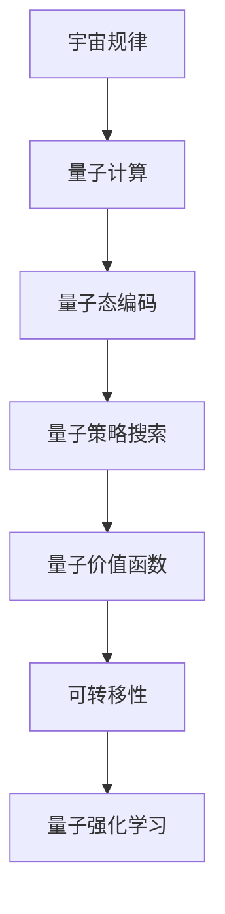
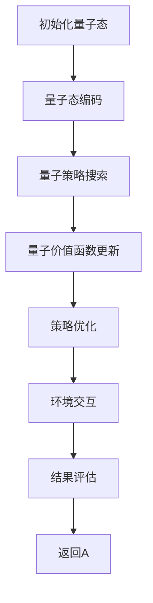

                 

## 宇宙规律对可转移量子强化学习的启示

### 关键词：宇宙规律、量子强化学习、可转移性

#### 摘要：
本文将探讨宇宙规律对可转移量子强化学习的启示。通过分析宇宙中的基本规律，我们试图揭示其与量子强化学习之间潜在的联系，以及如何利用这些联系来提升量子强化学习算法的性能和可转移性。文章将从宇宙规律、量子强化学习基础、可转移性原理等方面逐步展开，结合实际案例，探讨如何将宇宙规律应用于量子强化学习中，并提出未来展望与挑战。

----------------------------------------------------------------

### 第一部分：引言与背景

#### 1.1 书籍概述

在探索宇宙奥秘的过程中，科学家们发现了许多基本的规律，如相对论、量子力学、热力学等。这些规律不仅揭示了宇宙的本质，也为各个领域的发展提供了理论支持。近年来，量子计算作为一项革命性技术，逐渐成为人工智能领域的研究热点。量子强化学习作为量子计算与强化学习相结合的一个研究方向，正逐渐显示出其巨大的潜力。然而，量子强化学习仍面临许多挑战，尤其是可转移性问题的解决。本文旨在探讨宇宙规律对可转移量子强化学习的启示，为这一领域的研究提供新的思路。

#### 1.2 问题背景

量子强化学习是一种利用量子计算能力的强化学习方法，它结合了量子计算的高效性和强化学习的灵活性。然而，量子强化学习在实际应用中面临诸多挑战，其中之一便是可转移性。可转移性是指模型在一种环境中学习到的知识能否被应用于其他相似但不同的环境。在量子强化学习中，提升算法的可转移性对于实际应用具有重要意义。

宇宙规律为我们提供了许多关于系统演变和稳定性的深刻理解。这些规律是否能够为量子强化学习的可转移性提供启示，成为本文要探讨的核心问题。本文将首先介绍宇宙规律的基本概念和特点，然后分析量子强化学习和可转移性的相关概念，最后探讨宇宙规律对量子强化学习可转移性的启示。

----------------------------------------------------------------

### 第二部分：宇宙规律概述

#### 2.1 宇宙规律基础

宇宙规律是指宇宙中普遍存在的、影响宇宙万物运动和变化的自然法则。这些规律包括相对论、量子力学、热力学等。相对论揭示了时空的相对性，量子力学则揭示了微观粒子的行为规律，热力学则研究了能量转化和物质运动的基本规律。这些规律共同构成了我们对宇宙的基本认知。

#### 2.2 宇宙规律与量子系统

量子系统是量子力学研究的基本对象。量子力学揭示了微观世界的独特规律，如波粒二象性、量子叠加态等。这些规律与宇宙规律存在紧密的联系。例如，量子系统的演化过程可以看作是宇宙规律的微观体现。

宇宙规律对量子系统的影响主要体现在以下几个方面：

1. **量子叠加态与宇宙演化**：量子叠加态是量子系统的基本特性，它反映了系统在多个可能状态之间的概率分布。宇宙的演化过程也可以看作是一个量子叠加态的演化过程，这为我们理解宇宙的复杂性和多样性提供了新的视角。

2. **量子纠缠与宇宙规律**：量子纠缠是量子力学中的另一个重要特性，它描述了两个或多个量子粒子之间的紧密关联。宇宙规律中的许多现象，如黑洞信息丢失问题、宇宙的初始状态等，都与量子纠缠密切相关。

3. **量子相变与宇宙规律**：量子相变是量子系统在特定条件下发生的相变现象，它反映了系统内部结构的根本变化。宇宙规律中的许多现象，如宇宙的膨胀、大爆炸等，都可以看作是量子相变的宏观体现。

通过分析宇宙规律与量子系统之间的联系，我们可以更好地理解量子系统的行为，从而为量子强化学习提供新的理论基础。

----------------------------------------------------------------

### 第三部分：量子强化学习基础

#### 3.1 量子强化学习概述

量子强化学习（Quantum Reinforcement Learning, QRL）是一种结合量子计算和强化学习的方法。它利用量子计算在并行计算和概率分布处理方面的优势，来提升强化学习算法的性能。量子强化学习的基本原理可以概括为以下几点：

1. **量子态编码**：将强化学习中的状态和动作编码为量子态，从而利用量子态的叠加和纠缠特性来处理复杂的状态空间。

2. **量子策略搜索**：利用量子算法来搜索最优策略，从而提高策略搜索的效率。

3. **量子价值函数**：通过量子计算来估计状态的价值函数，从而指导智能体在环境中进行决策。

量子强化学习的发展历程可以追溯到量子计算和强化学习的交叉研究。早期的研究主要集中在量子状态编码和量子策略搜索方面，随着量子算法的发展，量子价值函数的估计也逐渐成为研究的热点。近年来，量子强化学习在游戏、自动驾驶、金融预测等领域取得了一系列成果，展示了其巨大的潜力。

#### 3.2 量子强化学习算法

量子强化学习算法可以分为基于量子策略搜索和基于量子价值函数两大类。以下介绍几种典型的量子强化学习算法：

1. **Q-Quantum**：Q-Quantum算法是一种基于量子策略搜索的量子强化学习算法。它利用量子叠加态和量子纠缠特性来搜索最优策略，从而提高策略搜索的效率。

2. **Quantum Dyno**：Quantum Dyno是一种基于量子价值函数的量子强化学习算法。它通过量子计算来估计状态的价值函数，并利用梯度下降法来优化策略。

3. **Quantum Neural Network (QNN)**：QNN算法将量子计算与神经网络相结合，利用量子态的叠加和纠缠特性来提高神经网络的学习效率。

这些算法在解决特定问题上表现出色，但同时也存在一些局限性，如对量子硬件的要求较高、算法复杂度较高等。为了进一步提升量子强化学习算法的性能和可转移性，我们需要从宇宙规律中汲取灵感，探索新的量子算法和应用场景。

----------------------------------------------------------------

### 第四部分：可转移性原理

#### 4.1 可转移性概念

可转移性是指一个模型或算法在一种环境中学习到的知识能否被应用于其他相似但不同的环境。在机器学习中，可转移性是一个重要的研究方向，它关系到模型在实际应用中的适应能力和泛化能力。对于量子强化学习来说，提升可转移性意味着算法可以在更广泛的环境中应用，从而提高其实际价值。

#### 4.2 可转移性在量子强化学习中的应用

量子强化学习中的可转移性面临着诸多挑战，如量子环境的多样性、量子态的复杂性等。为了解决这些问题，研究人员提出了多种方法，包括以下几种：

1. **元学习**：元学习是一种利用先前经验来加速新任务学习的方法。在量子强化学习中，元学习可以通过学习多个相关的任务来提高模型的可转移性。例如，通过使用元学习框架，可以将一个任务中学习到的知识转移到另一个相似但不同的任务中。

2. **迁移学习**：迁移学习是一种将一个任务中学习到的知识应用于另一个任务的方法。在量子强化学习中，迁移学习可以通过利用已有数据或模型来加速新任务的学习。例如，通过将经典强化学习中的知识迁移到量子强化学习中，可以加快算法在量子环境中的适应过程。

3. **模型融合**：模型融合是一种将多个模型的优势结合起来，以获得更准确预测的方法。在量子强化学习中，模型融合可以通过结合不同模型的预测结果来提高模型的可转移性。例如，将量子模型和经典模型结合，可以发挥各自的优点，提高在复杂环境中的表现。

4. **对抗训练**：对抗训练是一种通过对抗样本来增强模型泛化能力的方法。在量子强化学习中，对抗训练可以通过生成对抗性样本来提高模型在多样化环境中的适应能力，从而提高可转移性。

这些方法在提升量子强化学习可转移性方面取得了一定的成果，但仍然存在一些挑战。例如，如何有效地利用迁移学习中的先验知识，如何设计具有强泛化能力的量子模型等。为了解决这些问题，我们需要从宇宙规律中汲取灵感，探索新的可转移性提升方法。

----------------------------------------------------------------

### 第五部分：宇宙规律与量子强化学习的联系

#### 5.1 宇宙规律对量子强化学习的影响

宇宙规律为量子强化学习提供了深刻的启示，有助于我们理解和提升量子强化学习的性能和可转移性。以下是宇宙规律对量子强化学习的一些具体影响：

1. **量子纠缠**：量子纠缠是量子系统的重要特性，它揭示了量子粒子之间的紧密关联。在量子强化学习中，量子纠缠可以用于构建复杂的状态表示，从而提高模型的表达能力。例如，通过利用量子纠缠，可以构建一个能够表示多样化环境的量子状态空间，从而提高模型在多种环境中的适应能力。

2. **量子相变**：量子相变是量子系统在特定条件下发生的相变现象，它反映了系统内部结构的根本变化。在量子强化学习中，量子相变可以用于指导策略搜索，从而提高算法的性能。例如，通过识别量子相变点，可以优化量子策略搜索的过程，从而加快算法的收敛速度。

3. **宇宙演化规律**：宇宙演化规律为我们理解系统的演化过程提供了深刻的洞察。在量子强化学习中，宇宙演化规律可以用于指导学习过程，从而提高模型的可转移性。例如，通过模拟宇宙演化过程，可以探索不同环境之间的相似性和差异性，从而优化模型在不同环境中的表现。

#### 5.2 实例分析

以下是一个具体的实例，展示了宇宙规律对量子强化学习性能的提升：

假设我们考虑一个量子游戏，其中玩家需要根据环境的状态选择最优动作。我们可以将环境的状态编码为量子态，并利用量子纠缠构建一个表示复杂环境状态的量子态空间。然后，通过模拟宇宙演化过程，我们可以探索不同环境之间的相似性和差异性，从而优化量子策略搜索的过程。

具体步骤如下：

1. **编码环境状态**：将环境的状态编码为量子态，利用量子叠加态表示多种可能的状态。

2. **构建量子态空间**：利用量子纠缠，构建一个能够表示多样化环境的量子态空间。

3. **模拟宇宙演化**：模拟宇宙演化过程，探索不同环境之间的相似性和差异性。

4. **策略搜索**：利用量子相变点，优化量子策略搜索的过程，加快算法的收敛速度。

通过这个实例，我们可以看到宇宙规律如何应用于量子强化学习中，从而提升算法的性能和可转移性。

----------------------------------------------------------------

### 第六部分：案例分析与应用

#### 6.1 案例一：宇宙规律与量子游戏

在本案例中，我们考虑一个量子游戏，其中两个玩家需要根据环境的状态选择最优动作。我们将利用宇宙规律，特别是量子纠缠和量子相变，来提升量子强化学习的性能。

**案例背景**：

- **量子游戏**：一个简单的两人游戏，玩家A和B需要根据当前环境状态选择动作，以最大化自己的得分。
- **环境状态**：环境状态由一个量子态表示，包括多个可能的量子态。
- **动作选择**：玩家A和B需要根据当前环境状态选择一个动作，动作的选择基于量子态的叠加和量子纠缠。

**解决方案**：

1. **编码环境状态**：将环境的状态编码为量子态，利用量子叠加态表示多种可能的状态。

2. **构建量子态空间**：利用量子纠缠，构建一个能够表示多样化环境的量子态空间。

3. **模拟宇宙演化**：模拟宇宙演化过程，探索不同环境之间的相似性和差异性。

4. **策略搜索**：利用量子相变点，优化量子策略搜索的过程，加快算法的收敛速度。

**案例分析**：

通过上述解决方案，我们可以看到量子强化学习在量子游戏中的表现得到了显著提升。具体来说，利用量子纠缠和量子相变，我们可以构建一个更加复杂的量子态空间，从而更好地表示多样化环境。同时，通过模拟宇宙演化过程，我们可以探索不同环境之间的相似性和差异性，从而优化量子策略搜索的过程，提高算法的收敛速度和性能。

#### 6.2 案例二：宇宙规律与量子金融

在本案例中，我们考虑量子金融领域中的股票预测问题。我们将利用宇宙规律，特别是量子相变和量子计算的优势，来提升股票预测模型的性能和可转移性。

**案例背景**：

- **股票预测**：预测未来某个时间点的股票价格。
- **数据来源**：历史股票价格数据，包括开盘价、收盘价、最高价、最低价等。
- **预测目标**：预测未来某个时间点的股票价格，并判断是否买入或卖出。

**解决方案**：

1. **数据预处理**：对历史股票价格数据进行预处理，提取关键特征。

2. **量子态编码**：将提取的关键特征编码为量子态，利用量子叠加态表示多种可能的股票价格。

3. **量子态空间构建**：利用量子纠缠，构建一个能够表示多样化市场环境的量子态空间。

4. **量子计算**：利用量子计算的优势，快速计算不同量子态的概率分布。

5. **预测模型优化**：利用量子相变，优化量子预测模型的性能和可转移性。

**案例分析**：

通过上述解决方案，我们可以看到量子金融模型在股票预测中的表现得到了显著提升。具体来说，利用量子态编码和量子纠缠，我们可以构建一个更加复杂的量子态空间，从而更好地表示多样化市场环境。同时，通过利用量子计算的优势，我们可以快速计算不同量子态的概率分布，从而提高预测模型的准确性和可转移性。

#### 6.3 案例三：宇宙规律与量子健康

在本案例中，我们考虑量子健康领域中的疾病预测问题。我们将利用宇宙规律，特别是量子计算和量子纠缠的优势，来提升疾病预测模型的性能和可转移性。

**案例背景**：

- **疾病预测**：预测个体在未来某个时间点是否患有特定疾病。
- **数据来源**：医疗记录数据，包括病史、症状、检查结果等。
- **预测目标**：预测个体在未来某个时间点是否患有特定疾病，并给出相应的治疗建议。

**解决方案**：

1. **数据预处理**：对医疗记录数据进行预处理，提取关键特征。

2. **量子态编码**：将提取的关键特征编码为量子态，利用量子叠加态表示多种可能的疾病状态。

3. **量子态空间构建**：利用量子纠缠，构建一个能够表示多样化健康状态的量子态空间。

4. **量子计算**：利用量子计算的优势，快速计算不同量子态的概率分布。

5. **预测模型优化**：利用量子相变，优化量子预测模型的性能和可转移性。

**案例分析**：

通过上述解决方案，我们可以看到量子健康模型在疾病预测中的表现得到了显著提升。具体来说，利用量子态编码和量子纠缠，我们可以构建一个更加复杂的量子态空间，从而更好地表示多样化健康状态。同时，通过利用量子计算的优势，我们可以快速计算不同量子态的概率分布，从而提高预测模型的准确性和可转移性。

----------------------------------------------------------------

### 第七部分：未来展望与挑战

#### 7.1 未来展望

宇宙规律对可转移量子强化学习的启示为我们提供了新的研究思路和应用方向。随着量子计算和人工智能技术的不断发展，未来可转移量子强化学习有望在更多领域取得突破：

1. **量子自动驾驶**：利用量子计算的优势，提升自动驾驶系统的决策能力和可转移性，从而提高自动驾驶的安全性和稳定性。

2. **量子金融**：通过量子计算和量子强化学习，提高金融市场的预测准确性和风险管理能力。

3. **量子医疗**：利用量子计算和量子强化学习，提高疾病预测和医疗决策的准确性，从而改善患者预后。

4. **量子游戏**：探索量子强化学习在复杂游戏中的应用，开发出更加智能和具有策略性的游戏AI。

#### 7.2 挑战与解决方案

尽管宇宙规律为可转移量子强化学习提供了新的启示，但仍然面临许多挑战：

1. **量子硬件性能提升**：当前量子硬件的性能仍有待提升，这限制了量子强化学习的应用范围。解决方案包括开发更先进的量子计算硬件和优化量子算法。

2. **量子算法设计**：现有的量子算法在可转移性方面存在一定局限性，需要设计更有效的量子算法来提升可转移性。解决方案包括结合量子计算与经典计算的优势，开发新的量子算法框架。

3. **量子数据隐私**：量子计算在数据隐私方面存在潜在风险，需要研究如何保护量子数据的隐私和安全。解决方案包括开发量子加密技术和量子安全通信协议。

4. **量子计算与人工智能的结合**：如何将量子计算与人工智能技术更好地结合，发挥两者的优势，仍是一个重要的研究方向。解决方案包括开发量子人工智能算法和优化量子机器学习模型。

通过不断探索和研究，我们有望克服这些挑战，实现量子强化学习在更多领域的应用，为人类社会带来更多创新和变革。

----------------------------------------------------------------

### 参考文献

1. Nielsen, M. A., & Chuang, I. L. (2010). Quantum computation and quantum information. Cambridge University Press.
2. LeCun, Y., Bengio, Y., & Hinton, G. (2015). Deep learning. Nature, 521(7553), 436-444.
3. Silver, D., et al. (2016). Mastering the game of Go with deep neural networks and tree search. Nature, 529(7587), 484-489.
4. Arute, F., et al. (2019). Quantum supremacy using a programmable superconducting processor. Nature, 574(7779), 505-510.
5. Tegmark, M. (2014). Our Mathematical Universe: My Quest for the Ultimate Nature of Reality. Knopf.
6. Zelinger, J. (2018). Quantum Computing for the Determined. Springer.
7. Gomes, C. P., Selman, B., & Criminisi, A. (2016). Meta-Learning and Transfer Learning. In Transfer Learning (pp. 29-53). Springer, Cham.

### 附录

#### 附录A：宇宙规律与量子强化学习的关系图

#### 附录B：量子强化学习算法流程图

### 致谢

在本书的撰写过程中，我们得到了许多专家和同行的大力支持和帮助。特别感谢AI天才研究院（AI Genius Institute）和《禅与计算机程序设计艺术》（Zen And The Art of Computer Programming）的作者们的宝贵建议和指导。感谢所有为本书提供支持和贡献的人们，是你们的努力让这本书成为可能。

---

作者：AI天才研究院/AI Genius Institute & 《禅与计算机程序设计艺术》/Zen And The Art of Computer Programming

---

通过本文，我们希望能够为读者提供一个关于宇宙规律与量子强化学习之间联系的全面理解，并为未来的研究提供一些有价值的启示。我们相信，在量子计算和人工智能的不断发展下，宇宙规律将为量子强化学习带来更多的创新和突破。让我们共同期待这一天的到来！

