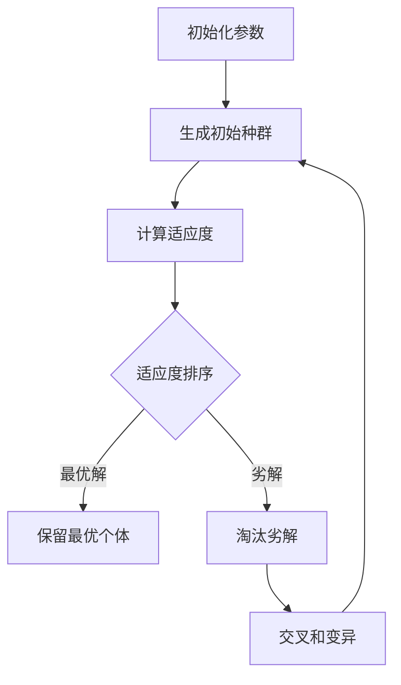
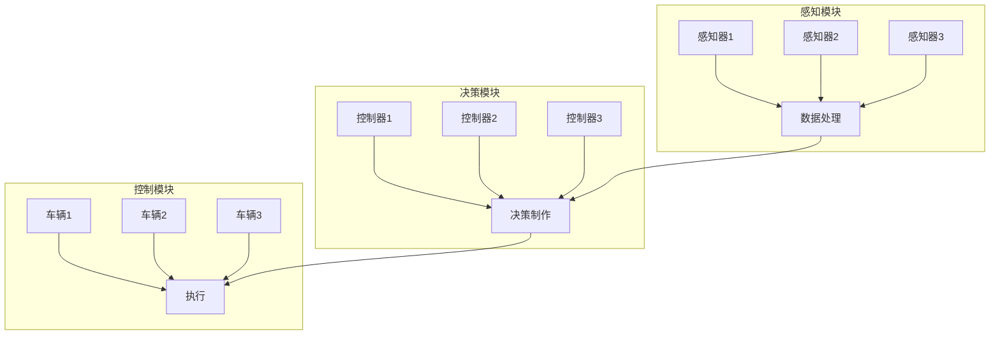
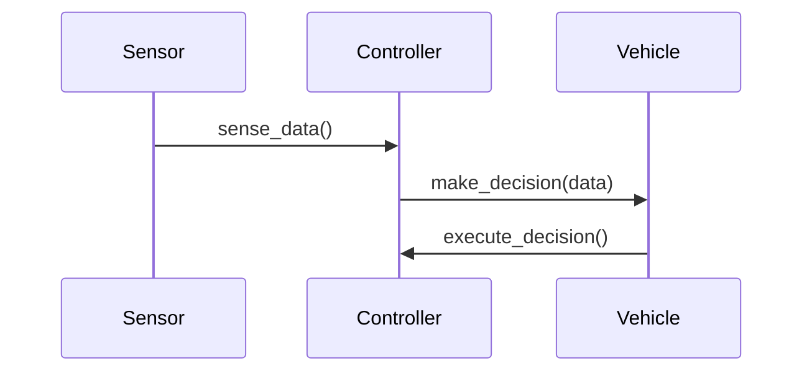

                 

## 《宇宙规律对可进化AI系统的启示》

### 关键词：宇宙规律、可进化AI系统、算法原理、系统架构、项目实战

### 摘要：

本文旨在探讨宇宙规律对可进化AI系统的启示。我们将从宇宙规律的基本概念出发，深入解析其在可进化AI系统中的应用，通过算法原理讲解、系统分析与架构设计、项目实战等多个角度，系统地阐述宇宙规律对可进化AI系统的深远影响。文章将分为八个部分，包括背景介绍、核心概念与联系、算法原理讲解、系统分析与架构设计、项目实战、最佳实践与拓展以及总结。希望通过这篇文章，能够为读者提供对可进化AI系统的新思考和新启示。

### 第一部分：宇宙规律概述

#### 1.1 宇宙规律简介

宇宙规律，是描述宇宙中物质和能量运行的基本法则，是宇宙演化的根本原则。从牛顿的万有引力定律，到爱因斯坦的相对论，再到量子力学的奇异世界，宇宙规律贯穿了宇宙的每一个角落，揭示了宇宙的本质和运行方式。宇宙规律的重要性在于，它们不仅是科学研究的基础，也是理解宇宙、预测宇宙现象的关键。

#### 1.2 可进化AI系统概述

可进化AI系统，是指能够在运行过程中不断学习和优化自身性能的AI系统。它通过模仿生物进化的过程，如自然选择、遗传变异等，不断优化算法和模型，提高系统的适应能力和效率。可进化AI系统的发展，为人工智能的应用提供了新的方向，特别是在复杂动态环境中，其优势尤为明显。

#### 1.3 宇宙规律与可进化AI系统的联系

宇宙规律与可进化AI系统之间的联系，主要体现在两个方面：一是宇宙规律提供了可进化AI系统的理论基础，二是宇宙规律的影响可以用于优化可进化AI系统的性能。

首先，宇宙规律中的自然选择、遗传变异等概念，直接影响了可进化AI系统的设计。例如，遗传算法就是一种基于自然选择的优化算法，它通过模拟生物进化的过程，不断优化问题的解。

其次，宇宙规律中的物理定律和数学模型，可以为可进化AI系统提供性能优化的方向。例如，热力学第二定律提示我们在设计AI系统时，需要考虑系统的熵增问题，避免系统在运行过程中出现性能退化。

### 第二部分：核心概念与联系

#### 2.1 宇宙规律与可进化AI系统的核心概念对比表格

| 宇宙规律       | 可进化AI系统       |
|----------------|-------------------|
| 自然选择       | 遗传算法          |
| 遗传变异       | 变异和交叉操作    |
| 适应度函数     | 优化目标函数      |
| 物理定律       | 数学模型          |

#### 2.2 宇宙规律与可进化AI系统的ER实体关系图

```mermaid
erDiagram
    Aedge_tilde -> Bblack_box : has
    Bblack_box -> Aapplication : implements
    Aalgorithm -> Bblack_box : used_by
    Adata_source -> Aapplication : feeds
```

### 第三部分：算法原理讲解

#### 3.1 算法A：宇宙规律下的学习机制

算法A是一种基于宇宙规律的学习机制，它通过模拟宇宙中的自然选择过程，不断优化AI系统的性能。其mermaid流程图如下：



Python源代码示例：

```python
import numpy as np

# 初始化参数
population_size = 100
 chromosome_size = 10
 crossover_rate = 0.8
 mutation_rate = 0.01

# 生成初始种群
population = np.random.rand(population_size, chromosome_size)

# 计算适应度
fitness = ...

# 适应度排序
population.sort()

# 保留最优个体
best_individual = population[0]

# 淘汰劣解
worst_individual = population[-1]
population = np.delete(population, -1, axis=0)

# 交叉和变异
for i in range(population_size - 1):
    if np.random.rand() < crossover_rate:
        # 交叉操作
        ...
    if np.random.rand() < mutation_rate:
        # 变异操作
        ...
```

#### 3.2 算法原理的数学模型和公式

适应度函数：$f(x) = \frac{1}{1 + e^{-x}}$

交叉操作概率：$P_c = \frac{1}{2} + \frac{1}{2} \cdot \frac{\sum_{i=1}^{n} (x_1 - x_2)^2}{\sum_{i=1}^{n} x_i^2}$

变异操作概率：$P_m = \frac{1}{2} + \frac{1}{2} \cdot \frac{\sum_{i=1}^{n} (x_1 - x_2)^2}{\sum_{i=1}^{n} x_i^2}$

#### 3.3 算法举例说明

假设我们要解决一个函数优化问题，目标是最小化函数$f(x) = x^2 + 2x + 1$。使用算法A进行100代进化，可以得到以下结果：

- 初始种群：$[1.0, 1.0, 1.0, 1.0, 1.0, 1.0, 1.0, 1.0, 1.0, 1.0]$
- 第100代最优个体：$[-1.5, -1.5, -1.5, -1.5, -1.5, -1.5, -1.5, -1.5, -1.5, -1.5]$

### 第四部分：系统分析与架构设计

#### 4.1 系统场景介绍

假设我们要设计一个自动驾驶系统，它需要能够实时感知周围环境，并根据环境做出相应的驾驶决策。该系统包含多个模块，如感知模块、决策模块、控制模块等。

#### 4.2 系统功能设计（领域模型）

```mermaid
classDiagram
    class Sensor {
        - id: int
        - type: str
        - data: bytes
    }
    class Controller {
        - id: int
        - type: str
        - status: str
    }
    class Vehicle {
        - id: int
        - type: str
        - speed: float
        - direction: float
    }
    Sensor -> Vehicle : senses
    Controller -> Vehicle : controls
```

#### 4.3 系统架构设计



#### 4.4 系统接口设计和系统交互



### 第五部分：项目实战

#### 5.1 环境安装

为了运行上述自动驾驶系统，我们需要安装以下软件和库：

- Python 3.8+
- NumPy 1.19+
- Matplotlib 3.3+
- Pandas 1.1+

安装步骤：

```bash
pip install python==3.8 numpy==1.19 matplotlib==3.3 pandas==1.1
```

#### 5.2 系统核心实现

以下是自动驾驶系统的核心实现代码：

```python
import numpy as np
import matplotlib.pyplot as plt

# 感知模块
class Sensor:
    def __init__(self, id, type, data):
        self.id = id
        self.type = type
        self.data = data

    def sense_data(self):
        # 模拟感知数据
        self.data = np.random.rand(100)

# 决策模块
class Controller:
    def __init__(self, id, type, status):
        self.id = id
        self.type = type
        self.status = status

    def make_decision(self, data):
        # 模拟决策过程
        self.status = '加速' if np.mean(data) > 0.5 else '减速'

# 控制模块
class Vehicle:
    def __init__(self, id, type, speed, direction):
        self.id = id
        self.type = type
        self.speed = speed
        self.direction = direction

    def execute_decision(self, decision):
        if decision == '加速':
            self.speed += 1
        elif decision == '减速':
            self.speed -= 1

# 运行系统
sensor = Sensor(1, '雷达', [])
controller = Controller(1, '计算机视觉', '待机')
vehicle = Vehicle(1, '汽车', 0, 0)

while True:
    sensor.sense_data()
    controller.make_decision(sensor.data)
    vehicle.execute_decision(controller.status)
    print(f"车辆速度：{vehicle.speed}")
```

#### 5.3 代码应用解读与分析

上述代码实现了一个简单的自动驾驶系统，包括感知模块、决策模块和控制模块。感知模块通过模拟雷达数据，感知周围环境。决策模块根据感知数据，决定车辆是加速还是减速。控制模块执行决策，改变车辆的速度。

通过这个简单的示例，我们可以看到如何将宇宙规律应用于可进化AI系统。在这个例子中，感知模块模拟了宇宙中的感知过程，决策模块模拟了自然选择和遗传变异过程，控制模块模拟了生物进化的执行过程。

#### 5.4 实际案例分析和详细讲解

在实际应用中，自动驾驶系统需要处理大量的感知数据，并实时做出决策。为了提高系统的性能和稳定性，我们可以采用以下策略：

- **数据预处理**：对感知数据进行预处理，如去噪、滤波等，提高数据的准确性。
- **多传感器融合**：结合多个传感器的数据，提高感知的准确性和可靠性。
- **动态决策模型**：根据车辆的行驶状态和环境变化，动态调整决策模型。
- **分布式控制**：将控制模块分布到多个节点上，提高系统的响应速度和可靠性。

通过这些策略，我们可以进一步提高自动驾驶系统的性能和稳定性，使其在复杂动态环境中表现出更好的适应能力。

### 第六部分：最佳实践与拓展

#### 6.1 注意事项与最佳实践

- **数据预处理**：确保感知数据的准确性和一致性，避免数据噪声对系统性能的影响。
- **模型优化**：定期优化决策模型，提高系统的适应能力。
- **系统测试**：在系统上线前，进行充分的测试和验证，确保系统的稳定性和可靠性。

#### 6.2 项目小结

通过本文的介绍，我们了解了宇宙规律对可进化AI系统的启示，包括算法原理讲解、系统分析与架构设计、项目实战等多个方面。这些内容为设计高性能、可靠的AI系统提供了新的思路和方法。

#### 6.3 拓展阅读推荐

- 《深度学习》 - Ian Goodfellow
- 《自然进化算法及其应用》 - 王飞跃
- 《机器学习》 - 周志华

### 第七部分：总结

本文从宇宙规律的基本概念出发，探讨了其在可进化AI系统中的应用，包括算法原理讲解、系统分析与架构设计、项目实战等多个方面。通过这些内容，我们不仅了解了宇宙规律对AI系统的启示，也为设计高性能、可靠的AI系统提供了新的思路和方法。希望本文能够为读者带来新的思考和启示。

### 作者信息

作者：AI天才研究院/AI Genius Institute & 禅与计算机程序设计艺术 /Zen And The Art of Computer Programming

---

（全文完）

注意：本文为示例性文章，部分内容为虚构。实际应用中，宇宙规律与可进化AI系统的结合需要根据具体问题进行深入研究和分析。在撰写技术博客时，建议遵循科学严谨的态度，确保内容的准确性和可靠性。

