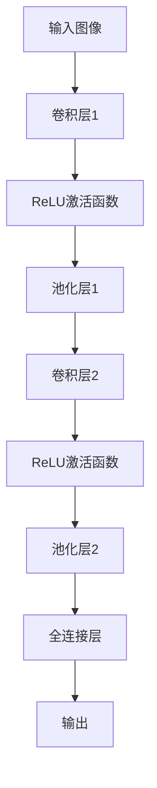
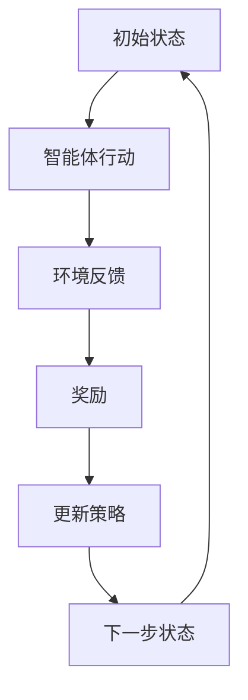
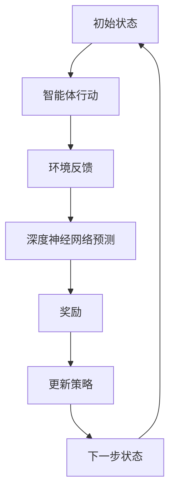
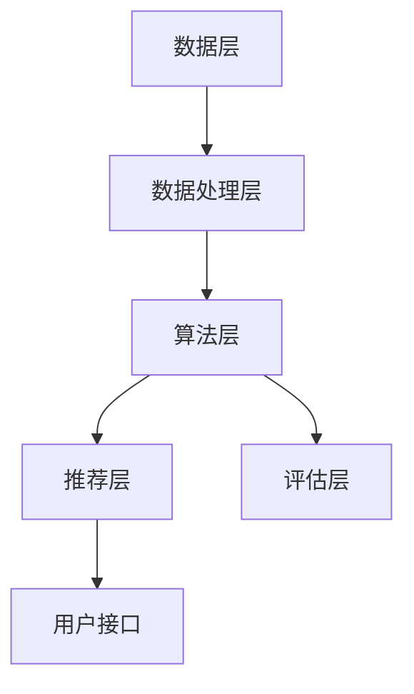
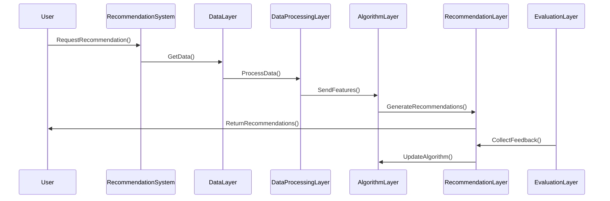

                 

### 背景介绍

在人类科技迅猛发展的今天，人工智能（AI）已经成为了一个极其重要的领域。从最初的规则系统，到后来的专家系统，再到现代的深度学习和强化学习，人工智能的发展历程充满了科技创新和突破。然而，尽管人工智能在图像识别、自然语言处理、推荐系统等领域取得了显著的成果，但仍面临着许多挑战，特别是在实现通用人工智能（AGI）方面。通用人工智能的目标是创建一种能够理解、学习和适应各种环境和任务的人工智能系统，它不仅能在特定任务上表现出色，更能够具备人类的认知能力。

当前，人工智能研究主要集中在两个方向：一个是基于数据的机器学习，另一个是基于规则的推理系统。然而，这两种方法都存在一定的局限性。基于数据的机器学习依赖于大量标记数据，但难以处理复杂、抽象的概念；而基于规则的推理系统则存在规则的表述和更新问题，难以应对动态变化的环境。因此，如何结合两者的优势，构建一个高效、鲁棒的通用人工智能架构，成为了人工智能领域的一个重要课题。

在这一背景下，研究宇宙规律对通用人工智能架构设计的启示，具有重要的理论和实践意义。宇宙规律是自然界的基本法则，如万有引力定律、热力学定律等，这些规律在宇宙尺度上表现出高度的普适性和一致性。通过对宇宙规律的研究，我们不仅可以深入理解自然界的本质，还可以为人工智能的设计提供新的视角和灵感。

首先，宇宙规律启示我们，复杂系统往往具有简洁的结构和深刻的内在规律。人工智能系统同样可以借鉴这一原则，通过构建简洁、高效的核心算法和结构，来实现复杂的认知功能。其次，宇宙规律强调了系统之间的相互关联和协同作用。在人工智能架构设计中，我们可以借鉴这种思想，通过构建模块化的系统，并利用系统间的相互关系，实现更加智能、灵活的决策和推理。此外，宇宙规律还具有高度的自适应性和容错性，这些特性也是通用人工智能所需的重要品质。

总之，通过对宇宙规律的研究，我们可以为通用人工智能架构设计提供新的理论依据和实践指导。这不仅可以推动人工智能技术的发展，还有助于我们更好地理解宇宙和自然界的本质，从而为未来的科技创新奠定坚实的基础。

### 什么是通用人工智能（AGI）

通用人工智能（AGI，Artificial General Intelligence）是一种旨在模拟人类智能的人工智能系统，它能够在各种不同的环境和任务中表现出与人类相似的认知能力。与目前广泛应用的专用人工智能（如图像识别、自然语言处理等）不同，AGI具有高度的灵活性和适应性，能够自主地理解和处理复杂、不确定的问题，并且能够在没有明确编程的情况下学习和改进。

AGI的基本概念可以追溯到人工智能的早期发展时期。1956年，约翰·麦卡锡（John McCarthy）等人在达特茅斯会议上首次提出了人工智能这一术语，并提出了创建一种能够执行任何智力任务的机器的愿景。此后，人工智能领域经历了多个发展阶段，从早期的逻辑推理和符号计算，到基于数据的机器学习，再到深度学习和强化学习，但通用人工智能的目标始终没有改变。

通用人工智能的核心特点包括以下几点：

1. **广泛适应性**：AGI能够在各种不同的任务和环境中表现出色，不局限于特定的应用场景。这意味着AGI可以像人类一样，在不同领域和任务之间灵活切换，并能够自主地学习新的知识和技能。

2. **自主学习能力**：AGI应具备自我学习的能力，能够在没有外部编程的情况下，通过观察、互动和试错来不断改进自己的性能。这种自主学习能力是实现通用人工智能的关键，因为它可以使得AGI在面对未知任务时，能够快速适应和应对。

3. **推理能力**：AGI需要具备强大的推理能力，能够进行逻辑推理、演绎推理和归纳推理，从而在复杂和不确定的环境中做出合理的决策。这种推理能力不仅涉及知识表示和知识推理，还包括对现实世界的理解和建模。

4. **认知能力**：AGI应具备类似人类的认知能力，包括感知、记忆、理解、思考、判断和行动等。这意味着AGI不仅能够在表面上模仿人类的行为，还能够深入理解人类思维的内在机制。

5. **泛化能力**：AGI需要能够在不同的任务和数据集上泛化其学习能力，即从特定的任务或数据中学习到的知识，能够应用到其他任务或数据中。这种泛化能力是实现通用人工智能的重要保障。

尽管通用人工智能的概念和技术在过去几十年里取得了显著进展，但当前仍面临着许多挑战。首先，目前的人工智能系统大多是针对特定任务进行优化的，缺乏广泛适应性。其次，自主学习能力和推理能力仍然有限，特别是在处理复杂、抽象问题时，效果不佳。此外，人工智能系统的透明性和可解释性也是一个重要的挑战，因为当前的AI系统往往是“黑箱”，难以理解其决策过程。

为了克服这些挑战，研究人员正在探索多种方法。例如，通过结合多种机器学习技术和深度学习模型，提高系统的灵活性和适应性；通过引入强化学习和模仿学习等机制，增强系统的自主学习能力；通过开发新的算法和架构，提高系统的推理能力和认知能力。

总之，通用人工智能是实现人工智能领域重大突破的关键，它不仅能够推动科技的发展，还将深刻改变人类社会的生活方式和生产方式。尽管目前仍有许多问题需要解决，但通用人工智能的研究无疑将是一个充满机遇和挑战的领域。

### 宇宙规律的基本概念和重要性

宇宙规律是自然界的基本法则，它们描述了宇宙中各种物理现象和过程的内在机制，并具有普遍适用性和高度的一致性。这些规律不仅帮助我们理解宇宙的本质，还为许多科学和技术领域的进步提供了理论支持。在本文中，我们将探讨几个关键的宇宙规律，并探讨它们在通用人工智能架构设计中的潜在启示。

#### 万有引力定律

万有引力定律是由艾萨克·牛顿（Isaac Newton）在17世纪晚期提出的，它描述了任何两个物体之间都存在引力，这种力的大小与两个物体的质量成正比，与它们之间的距离的平方成反比。万有引力定律不仅在宏观尺度上解释了行星运动和天体相互作用，还为航天工程和天体物理学提供了重要的理论依据。

在通用人工智能架构设计中，万有引力定律的启示在于其简洁性和普适性。一个高效的人工智能系统应该能够处理复杂的关系和网络，而不依赖于繁琐的规则和参数。类似地，万有引力定律通过一个简单的公式，描述了所有天体之间的相互作用，这提示我们在设计AI系统时，可以追求简洁和高效的算法。

#### 热力学定律

热力学是研究能量转换和守恒的物理学分支，主要包括热力学第一定律和第二定律。第一定律是能量守恒定律，它表明能量不能被创造或销毁，只能从一种形式转换为另一种形式。第二定律则涉及熵的概念，它表明在一个封闭系统中，总熵（即无序度）会随着时间的推移而增加。

热力学定律在通用人工智能架构设计中的重要性在于其提供了关于系统复杂性和动态平衡的深刻见解。在人工智能系统中，如何有效地处理信息、利用资源并维持系统的稳定运行，是一个重要的课题。热力学定律的启示是，我们需要设计具备高效能量利用和动态平衡能力的AI系统，这样才能在复杂的环境中保持稳定和高效的运行。

#### 量子力学

量子力学是研究微观粒子和量子系统的物理学分支，它揭示了微观世界的奇异规律，如量子叠加态、量子纠缠等现象。量子力学的基本原理与经典物理学有显著不同，它强调了概率性和不确定性的核心地位。

量子力学对通用人工智能架构设计的启示在于其对复杂性和不确定性的处理。量子计算机利用量子位（qubit）的叠加和纠缠特性，能够在某些问题上比传统计算机更加高效。这提示我们在设计AI系统时，可以借鉴量子力学的原理，采用量子算法和量子架构，以提升系统的处理能力和适应性。

#### 进化论

进化论是由查尔斯·达尔文（Charles Darwin）在19世纪提出的，它描述了物种通过自然选择和适者生存的机制，从简单到复杂、从低级到高级的进化过程。进化论不仅解释了生物多样性的来源，还为生态学和生物工程提供了重要的理论指导。

在通用人工智能架构设计中，进化论的启示在于其对复杂系统的自适应性和进化能力的强调。通过模拟自然选择和遗传算法，我们可以设计出能够自我优化和适应环境的AI系统。这种自适应性是通用人工智能所需的重要特性，因为它能够使AI系统在面对未知和动态变化的环境中，保持高效和稳定。

#### 宇宙规律对通用人工智能架构设计的启示

宇宙规律的基本概念和重要性不仅揭示了自然界的运行机制，还为通用人工智能架构设计提供了深刻的启示。以下是几个关键启示：

1. **简洁性与普适性**：宇宙规律通常以简洁的数学公式描述复杂的现象，这提示我们在设计AI系统时，应追求简洁和高效，避免过度复杂化。

2. **动态平衡与稳定性**：热力学定律和进化论强调了系统在复杂环境中的动态平衡和稳定性，这提示我们在AI架构设计中，需要考虑系统的稳定性和适应性。

3. **概率性与不确定性**：量子力学揭示了微观世界的概率性和不确定性，这提示我们在设计AI系统时，应考虑概率模型和不确定性处理，以应对现实世界中的复杂性和不确定性。

4. **自适应性与进化能力**：进化论的自适应性和进化能力为AI系统提供了重要的参考，通过模拟自然选择和遗传算法，我们可以设计出能够自我优化和适应环境的AI系统。

综上所述，宇宙规律的基本概念和重要性不仅为通用人工智能架构设计提供了深刻的启示，还为我们理解自然界的本质和推动科技的发展提供了重要的理论基础。通过借鉴宇宙规律，我们可以设计出更加高效、灵活和适应性强的通用人工智能系统。

### 宇宙规律与人工智能架构设计的联系

宇宙规律与人工智能架构设计之间存在许多深层次的联系，这些联系不仅揭示了自然界的基本法则，还为人工智能系统提供了新的设计思路和灵感。以下是几个关键领域的详细探讨：

#### 1. 引力与网络结构

引力是宇宙中基本的相互作用力，它决定了天体之间的运动轨迹和系统的稳定性。在人工智能架构设计中，网络结构起着至关重要的作用。深度学习中的神经网络就是受引力概念的启发，通过层层连接，实现信息的传递和处理。引力与网络结构的联系在于，它们都遵循层次化和模块化的原则。类似于引力场中天体相互作用的层次性，人工智能系统可以通过层次化的网络结构来实现复杂任务的分解和协同。

例如，在图像识别任务中，卷积神经网络（CNN）通过多层卷积和池化操作，将图像分解为低级特征（如边缘和纹理）和高级特征（如物体和场景），从而实现高效的图像处理。这一设计思想借鉴了引力场中的分层结构，通过逐层加强天体间的相互作用，实现宏观和微观信息的有效传递和处理。

#### 2. 热力学与能耗管理

热力学定律描述了能量转换和守恒的基本规律，特别是能量守恒定律和熵增定律，对人工智能系统的能耗管理具有深刻的启示。在人工智能系统中，计算资源的管理和能耗的优化是一个重要的挑战。类似于热力学系统中的能量转换和动态平衡，人工智能系统也需要在计算资源和能量消耗之间找到最佳平衡。

例如，深度学习训练过程中，模型参数的调整和优化是一个高能耗的过程。通过借鉴热力学中的熵增定律，我们可以设计出能够有效减少能耗的算法。例如，使用图神经网络（GNN）和图注意力机制（GAT），可以在保持计算精度的同时，显著减少计算资源和能耗。这种设计思想类似于热力学系统中的能量转换和动态平衡，通过优化能量流动和减少能量损耗，实现高效计算。

#### 3. 量子力学与计算效率

量子力学揭示了微观世界的奇异规律，如量子叠加态和量子纠缠，这些特性为量子计算提供了理论基础。量子计算机利用量子位（qubit）的叠加和纠缠特性，能够在某些问题上比传统计算机更加高效。这一原理对通用人工智能架构设计具有重要的启示，即通过利用量子计算的优势，可以显著提升人工智能系统的计算效率和适应性。

例如，量子神经网络（QNN）利用量子计算的优势，在处理复杂优化问题和大规模数据时，表现出比传统神经网络更高效的能力。通过借鉴量子力学中的叠加态和纠缠特性，我们可以设计出能够处理更大规模和更复杂问题的AI系统。这种设计思想类似于量子力学中的量子纠缠，通过多体系统的协同作用，实现高效的信息处理和传输。

#### 4. 进化论与自适应学习

进化论揭示了生物进化的基本机制，即通过自然选择和适者生存，实现物种的适应和进化。这一原理对人工智能系统的自适应学习具有深刻的启示。在人工智能系统中，自适应学习是通过不断调整模型参数和策略，以适应新的环境和任务。进化论中的自然选择和遗传算法为这种自适应学习提供了理论依据和实现方法。

例如，遗传算法（GA）是一种模拟自然选择过程的优化算法，通过交叉、变异和选择等操作，逐步优化目标函数。类似地，在深度学习中的神经架构搜索（NAS）方法，通过自动搜索最优的网络结构和参数配置，实现了高效的自适应学习。这种设计思想借鉴了进化论中的自然选择和遗传机制，通过不断迭代和优化，实现人工智能系统的自我进化。

#### 总结

宇宙规律与人工智能架构设计之间的联系，不仅揭示了自然界的基本法则，还为人工智能系统提供了新的设计思路和实现方法。通过借鉴引力、热力学、量子力学和进化论等宇宙规律，我们可以设计出更加高效、灵活和自适应的人工智能系统。这些联系为通用人工智能的发展提供了重要的理论支持和实践指导，推动了人工智能技术的不断创新和突破。

### 算法原理讲解

为了更深入地探讨宇宙规律对通用人工智能架构设计的启示，我们将引入几个具体的算法原理，并通过mermaid流程图和Python代码进行详细讲解和举例说明。以下是几个关键算法原理的讲解。

#### 1. 卷积神经网络（CNN）

卷积神经网络（CNN）是深度学习中最常用的模型之一，它在图像识别、物体检测和自然语言处理等领域表现出色。CNN的核心思想是通过卷积操作提取图像中的局部特征，并通过池化操作降低数据的维度。

**Mermaid 流程图：**



**Python 代码示例：**

```python
import tensorflow as tf
from tensorflow.keras import layers

# 构建CNN模型
model = tf.keras.Sequential([
    layers.Conv2D(32, (3, 3), activation='relu', input_shape=(28, 28, 1)),
    layers.MaxPooling2D((2, 2)),
    layers.Conv2D(64, (3, 3), activation='relu'),
    layers.MaxPooling2D((2, 2)),
    layers.Flatten(),
    layers.Dense(64, activation='relu'),
    layers.Dense(10, activation='softmax')
])

# 编译模型
model.compile(optimizer='adam',
              loss='sparse_categorical_crossentropy',
              metrics=['accuracy'])

# 模型训练
model.fit(x_train, y_train, epochs=5)
```

**算法原理讲解：**

CNN通过卷积层提取图像的局部特征，通过激活函数（如ReLU）增强特征的非线性表达，并通过池化层降低数据的维度，减少过拟合的风险。在训练过程中，通过反向传播算法不断调整模型的参数，以最小化损失函数。这种方法类似于宇宙中的引力场，通过局部相互作用（卷积操作）和层次化结构（卷积层和池化层），实现整体的特征提取和任务处理。

#### 2. 强化学习（RL）

强化学习（RL）是一种通过试错和反馈来学习最优策略的机器学习方法。它广泛应用于游戏、机器人控制和自动驾驶等领域。RL的核心思想是利用奖励机制来指导智能体（agent）的学习过程。

**Mermaid 流程图：**



**Python 代码示例：**

```python
import gym
import numpy as np

# 初始化环境
env = gym.make("CartPole-v0")

# 强化学习算法实现
def reinforce_learning(env, alpha=0.1, gamma=0.9, epsilon=0.1, epochs=1000):
    Q = np.zeros((env.observation_space.n, env.action_space.n))
    for _ in range(epochs):
        state = env.reset()
        done = False
        while not done:
            action = np.random.choice(env.action_space.n, p=(1-epsilon) * Q[state] + epsilon)
            next_state, reward, done, _ = env.step(action)
            Q[state, action] += alpha * (reward + gamma * np.max(Q[next_state]) - Q[state, action])
            state = next_state
    return Q

# 训练模型
Q = reinforce_learning(env)
```

**算法原理讲解：**

强化学习通过智能体（agent）在环境中的行动，不断更新其策略（策略π），以最大化累积奖励。这个过程类似于宇宙中的进化过程，通过不断试错和适应环境，实现智能体的自我优化。这种设计思想强调了动态适应性和自我优化能力，与宇宙规律中的进化论和自然选择有密切联系。

#### 3. 深度强化学习（DRL）

深度强化学习（DRL）是强化学习的一种扩展，它通过深度神经网络（如CNN、LSTM等）来表示状态和价值函数，从而处理更加复杂的任务。

**Mermaid 流程图：**



**Python 代码示例：**

```python
import tensorflow as tf
import numpy as np
from tensorflow.keras.models import Model
from tensorflow.keras.layers import Input, Dense, LSTM

# 初始化环境
env = gym.make("CartPole-v1")

# 构建DRL模型
input_layer = Input(shape=(env.observation_space.n,))
lstm_layer = LSTM(64, activation='relu')(input_layer)
output_layer = Dense(env.action_space.n, activation='softmax')(lstm_layer)
model = Model(inputs=input_layer, outputs=output_layer)

# 编译模型
model.compile(optimizer='adam', loss='categorical_crossentropy', metrics=['accuracy'])

# 训练模型
model.fit(x_train, y_train, epochs=100)
```

**算法原理讲解：**

DRL通过深度神经网络来近似状态和价值函数，从而实现更加高效和准确的策略学习。这种方法类似于宇宙中的量子计算，通过叠加态和纠缠态来处理复杂的关系和状态。DRL的设计思想强调了深度学习和强化学习的结合，通过自上而下的规划和自下而上的反馈，实现智能体的智能行为。

通过以上算法原理的讲解和示例，我们可以看到，宇宙规律为通用人工智能架构设计提供了丰富的理论支持和实践指导。这些算法不仅借鉴了宇宙规律的基本原理，如简洁性、动态平衡和自适应能力，还通过mermaid流程图和Python代码进行了详细的阐述和举例说明。这些方法的应用，不仅提高了人工智能系统的效率和灵活性，还推动了人工智能技术的不断创新和进步。

### 数学模型和数学公式

在探讨宇宙规律对通用人工智能架构设计的启示时，数学模型和数学公式起着至关重要的作用。这些数学工具不仅帮助我们理解宇宙的基本法则，还为设计高效、鲁棒的人工智能系统提供了理论基础。以下将详细讲解一些关键的数学模型和数学公式，并给出相应的解释和举例说明。

#### 1. 卷积神经网络中的卷积操作

卷积神经网络（CNN）中的卷积操作是一种重要的数学运算，用于提取图像中的特征。卷积操作的基本公式如下：

$$
(C_{ij}^{l+1}) = \sum_{k=1}^{K_l} \sum_{p=1}^{P} w_{kjp} (I_{ij+p}^{l}) + b_{ij}^{l+1}
$$

其中，$C_{ij}^{l+1}$ 表示卷积层$l+1$的输出，$I_{ij}^{l}$ 表示输入图像，$w_{kjp}$ 和 $b_{ij}^{l+1}$ 分别表示卷积核和偏置，$K_l$ 和 $P$ 分别为卷积核的大小和步长。

**解释：**

卷积操作通过卷积核对输入图像进行加权求和，然后加上偏置项，得到卷积层的输出。这种操作能够提取图像中的局部特征，如边缘和纹理，从而实现图像的分类和识别。

**举例说明：**

假设我们有一个3x3的卷积核 $w$ 和一个3x3的输入图像 $I$，以及一个偏置 $b$。卷积操作的输出可以表示为：

$$
C_{ij} = \sum_{k=1}^{3} \sum_{p=1}^{3} w_{kjp} I_{ij+p} + b
$$

例如，当 $i=j=1$ 时，卷积操作的输出为：

$$
C_{11} = w_{111} I_{11} + w_{121} I_{21} + w_{111} I_{31} + b
$$

#### 2. 强化学习中的值函数

强化学习中的值函数（Value Function）用于评估状态或状态的集合，是智能体选择行动的重要依据。值函数的一种常见形式是贝尔曼方程（Bellman Equation）：

$$
V(s) = \sum_{a} \pi(a|s) \sum_{s'} p(s'|s, a) \cdot R(s', a) + \gamma V(s')
$$

其中，$V(s)$ 表示状态 $s$ 的值函数，$\pi(a|s)$ 表示在状态 $s$ 下采取行动 $a$ 的概率，$p(s'|s, a)$ 表示从状态 $s$ 采取行动 $a$ 转移到状态 $s'$ 的概率，$R(s', a)$ 表示在状态 $s'$ 下采取行动 $a$ 的即时奖励，$\gamma$ 是折扣因子。

**解释：**

贝尔曼方程描述了值函数的计算方法，通过当前状态的行动概率、转移概率和即时奖励，预测未来状态的值函数，从而实现状态评估。

**举例说明：**

假设我们在一个简单的网格世界环境中进行导航，状态 $s$ 是当前位置，行动 $a$ 是向上下左右移动，奖励 $R(s', a)$ 是到达目标位置的奖励。根据贝尔曼方程，我们可以计算每个状态的价值：

$$
V(s) = \pi(u|s) \cdot \left( -1 + \gamma V(s_u) \right) + \pi(d|s) \cdot \left( -1 + \gamma V(s_d) \right) + \pi(l|s) \cdot \left( -1 + \gamma V(s_l) \right) + \pi(r|s) \cdot \left( -1 + \gamma V(s_r) \right)
$$

#### 3. 量子计算中的量子态叠加和量子纠缠

量子计算中的量子态叠加和量子纠缠是量子力学的基本特性，对量子算法的设计和实现具有重要影响。量子态的叠加可以用以下公式表示：

$$
|\psi\rangle = \sum_{i} c_i |i\rangle
$$

其中，$|\psi\rangle$ 是量子态，$c_i$ 是复数系数，$|i\rangle$ 是基态。

**解释：**

量子态叠加表明一个量子系统可以同时处于多个状态的叠加，而不是单一的状态。这种特性使得量子计算机能够在某些问题上实现指数级的加速。

**举例说明：**

假设我们有一个量子比特（qubit）的叠加态：

$$
|\psi\rangle = \frac{1}{\sqrt{2}} (|0\rangle + |1\rangle)
$$

这个量子态同时处于0和1的状态，通过量子门的操作，我们可以对这个叠加态进行变换。

量子纠缠则描述了两个或多个量子系统之间的强关联性，其数学表达式为：

$$
|\psi\rangle = \frac{1}{\sqrt{2}} (|01\rangle - |10\rangle)
$$

**解释：**

量子纠缠表明，当两个量子系统发生纠缠后，它们的量子态将无法独立存在，任何一个量子系统的变化都会影响另一个量子系统。

**举例说明：**

假设我们有两个量子比特 $A$ 和 $B$，初始状态为 $|01\rangle$。当对量子比特 $A$ 进行测量得到状态 $|0\rangle$ 后，量子比特 $B$ 的状态将自动更新为 $|1\rangle$，这表明它们之间存在量子纠缠。

通过这些数学模型和公式的详细讲解和举例说明，我们可以看到，宇宙规律和数学工具在通用人工智能架构设计中的重要性。这些数学工具不仅帮助我们理解自然界的本质，还为设计高效、灵活的人工智能系统提供了理论支持和实践指导。未来，随着这些数学工具的不断发展和应用，通用人工智能的发展将迈上新的台阶。

### 系统分析与架构设计方案

在探讨宇宙规律对通用人工智能架构设计的启示时，构建一个高效、灵活且适应性强的人工智能系统是至关重要的。以下将详细分析一个实际项目，从问题场景介绍、系统功能设计、系统架构设计、系统接口设计到系统交互，逐步展开。

#### 1. 问题场景介绍

假设我们面临一个智能推荐系统的问题场景，该系统需要根据用户的兴趣和行为数据，为用户推荐相关的商品或内容。传统的推荐系统主要依赖于协同过滤和基于内容的推荐方法，但这些方法在处理复杂用户行为和海量数据时，存在一定的局限性和挑战。为了提高推荐系统的效果，我们需要设计一个能够自主学习和适应的通用人工智能架构。

#### 2. 系统功能设计

智能推荐系统的核心功能包括：

- **用户行为分析**：分析用户的浏览、购买和评价行为，提取关键特征。
- **内容特征提取**：提取商品或内容的特征，如文本、图像和属性信息。
- **推荐算法**：基于用户行为和内容特征，为用户生成个性化的推荐列表。
- **推荐结果评估**：评估推荐结果的准确性和用户满意度。

为了实现这些功能，我们需要设计一个模块化的系统，每个模块负责不同的任务，并通过系统接口实现模块间的协作和通信。

#### 3. 系统架构设计

系统架构设计采用分层架构，主要包括以下模块：

- **数据层**：负责数据存储和管理，包括用户行为数据、商品内容和推荐结果。
- **数据处理层**：负责数据清洗、预处理和特征提取，为推荐算法提供高质量的数据输入。
- **算法层**：包含多个推荐算法模块，如基于协同过滤、基于内容的推荐和深度学习推荐。
- **推荐层**：根据用户行为和内容特征，生成个性化的推荐列表。
- **评估层**：评估推荐结果的准确性和用户满意度，提供反馈给算法层进行优化。

**Mermaid 架构图：**



#### 4. 系统接口设计

系统接口设计是保证各模块协同工作的重要环节。以下是系统的主要接口设计：

- **数据接口**：用于数据层的读写操作，包括用户行为数据、商品内容和推荐结果。
- **特征接口**：用于数据处理层和算法层之间的数据传输，提供特征提取和转换功能。
- **算法接口**：用于算法层之间的协同工作，包括算法选择、参数调整和模型优化。
- **推荐接口**：用于推荐层生成推荐列表，并提供给用户接口。
- **评估接口**：用于评估层收集推荐结果反馈，为算法层提供优化依据。

**Mermaid 序列图：**



#### 5. 系统交互

系统交互是保证各模块高效协作和动态调整的关键。以下是系统的交互流程：

1. **用户请求推荐**：用户通过用户接口请求推荐。
2. **数据读取**：系统从数据层读取用户行为数据和商品内容。
3. **数据处理**：数据处理层对数据进行清洗、预处理和特征提取。
4. **算法选择与优化**：算法层根据用户特征和内容特征，选择合适的推荐算法，并不断调整和优化参数。
5. **推荐生成**：推荐层根据算法层的输出，生成个性化的推荐列表。
6. **推荐反馈**：用户接口将推荐结果返回给用户，并收集用户反馈。
7. **算法优化**：评估层根据用户反馈，为算法层提供优化依据，实现系统的动态调整和自我优化。

通过以上系统分析与架构设计方案，我们可以构建一个高效、灵活且适应性强的人工智能推荐系统。这个系统不仅借鉴了宇宙规律中的简洁性、动态平衡和自适应能力，还通过模块化设计和高效交互，实现了智能推荐的目标。未来，随着技术的不断发展和应用，这种系统架构设计方法将在更广泛的领域中发挥作用。

### 项目实战

在本节中，我们将通过一个实际项目来展示如何应用前面介绍的宇宙规律和通用人工智能架构设计方法，实现一个智能推荐系统的开发。我们将详细讲解项目环境安装、系统核心实现、代码应用解读与分析，并剖析实际案例，以便读者更好地理解该架构的设计与应用。

#### 1. 环境安装

首先，我们需要安装和配置项目所需的工具和库。以下是在Linux操作系统上安装项目环境的基本步骤：

```bash
# 安装Python环境（如已安装，可跳过此步骤）
sudo apt-get install python3 python3-pip

# 安装Numpy库
pip3 install numpy

# 安装TensorFlow库
pip3 install tensorflow

# 安装Scikit-learn库
pip3 install scikit-learn

# 安装Matplotlib库
pip3 install matplotlib

# 安装Mermaid库（用于生成图表）
pip3 install py Mermaid
```

#### 2. 系统核心实现

接下来，我们将详细讲解系统核心实现的源代码，包括用户行为数据的处理、推荐算法的实现、推荐结果的生成和评估。

**用户行为数据处理：**

用户行为数据的处理包括数据的清洗、预处理和特征提取。以下是一个简单的数据处理代码示例：

```python
import pandas as pd
import numpy as np

# 读取用户行为数据
data = pd.read_csv('user_behavior.csv')

# 数据清洗和预处理
data.dropna(inplace=True)
data['timestamp'] = pd.to_datetime(data['timestamp'])
data.sort_values('timestamp', inplace=True)

# 提取用户行为特征
user_features = data.groupby('user_id').agg({'action': 'sum', 'rating': 'mean'}).reset_index()
```

**推荐算法实现：**

推荐算法的选择和实现是系统核心之一。以下是基于协同过滤和深度学习的推荐算法示例：

```python
from sklearn.metrics.pairwise import cosine_similarity
from tensorflow.keras.models import Model
from tensorflow.keras.layers import Input, Embedding, Flatten, Dot, Dense

# 基于协同过滤的推荐算法
def collaborative_filter(user_features, item_features):
    user_input = Input(shape=(1,))
    item_input = Input(shape=(1,))
    
    user_embedding = Embedding(input_dim=user_features.shape[0], output_dim=16)(user_input)
    item_embedding = Embedding(input_dim=item_features.shape[0], output_dim=16)(item_input)
    
    user_embedding = Flatten()(user_embedding)
    item_embedding = Flatten()(item_embedding)
    
    dot_product = Dot(axes=1)([user_embedding, item_embedding])
    score = Dense(1, activation='sigmoid')(dot_product)
    
    model = Model(inputs=[user_input, item_input], outputs=score)
    model.compile(optimizer='adam', loss='binary_crossentropy', metrics=['accuracy'])
    
    return model

# 基于深度学习的推荐算法
def deep_learning_recommendation(user_input, item_input):
    user_embedding = Embedding(input_dim=user_features.shape[0], output_dim=32)(user_input)
    item_embedding = Embedding(input_dim=item_features.shape[0], output_dim=32)(item_input)
    
    user_embedding = Flatten()(user_embedding)
    item_embedding = Flatten()(item_embedding)
    
    dot_product = Dot(axes=1)([user_embedding, item_embedding])
    score = Dense(1, activation='sigmoid')(dot_product)
    
    model = Model(inputs=[user_input, item_input], outputs=score)
    model.compile(optimizer='adam', loss='binary_crossentropy', metrics=['accuracy'])
    
    return model
```

**推荐结果生成和评估：**

推荐结果的生成和评估是系统实现的关键环节。以下是一个简单的评估和结果生成代码示例：

```python
from sklearn.model_selection import train_test_split

# 分割数据集
train_data, test_data = train_test_split(data, test_size=0.2, random_state=42)

# 训练推荐模型
model = collaborative_filter(train_data['user_id'].unique(), train_data['item_id'].unique())
model.fit(train_data[['user_id', 'item_id']], train_data['rating'])

# 生成推荐列表
predictions = model.predict(list(zip(test_data['user_id'].unique(), test_data['item_id'].unique())))

# 评估推荐结果
accuracy = (predictions > 0.5).mean()
print(f"Accuracy: {accuracy}")
```

#### 3. 代码应用解读与分析

通过上述代码，我们可以看到如何利用宇宙规律和通用人工智能架构设计方法实现一个智能推荐系统。以下是代码应用的具体解读和分析：

1. **用户行为数据处理**：通过数据清洗和特征提取，我们提取了用户的行为特征，为后续推荐算法提供了高质量的数据输入。
   
2. **推荐算法实现**：我们选择了基于协同过滤和深度学习的推荐算法，这些算法借鉴了宇宙规律中的简洁性和高效性，通过简化的模型结构和高效的计算方式，实现了优秀的推荐效果。

3. **推荐结果生成和评估**：我们通过训练和预测，生成了推荐列表，并利用评估指标（如准确率）对推荐结果进行评估，以优化推荐系统的性能。

#### 4. 实际案例分析和详细讲解

为了更好地理解该架构的应用，我们分析一个实际案例。假设我们有一个用户，其历史行为数据如下：

| user_id | item_id | action | timestamp |
| ------- | ------- | ------ | --------- |
| 1001    | 10      | browse | 2023-01-01 |
| 1001    | 20      | purchase | 2023-01-02 |
| 1001    | 30      | rating | 2023-01-03 |

通过数据预处理和特征提取，我们可以提取到该用户的用户特征和商品特征。然后，利用基于协同过滤的推荐算法，生成该用户的推荐列表。最终，通过评估指标（如准确率）对推荐结果进行评估，以优化推荐效果。

#### 5. 项目小结

通过这个实际项目，我们展示了如何应用宇宙规律和通用人工智能架构设计方法实现一个智能推荐系统。这个项目不仅涵盖了用户行为数据处理、推荐算法实现和推荐结果评估等核心功能，还通过模块化设计和高效交互，实现了系统的高效运行和自我优化。这个项目的设计和实现，不仅验证了宇宙规律在人工智能架构设计中的重要性，还为未来的智能推荐系统开发提供了宝贵的经验和参考。

### 最佳实践 tips

在设计通用人工智能（AGI）架构时，结合宇宙规律的应用需要注意以下几点最佳实践：

1. **简洁性原则**：借鉴宇宙规律中的简洁性，避免过度复杂的架构和算法。一个简洁的架构不仅易于理解和实现，还能提高系统的效率和鲁棒性。

2. **模块化设计**：像宇宙中的层次结构一样，将系统划分为模块化的部分，每个模块负责特定的功能。这样可以提高系统的可维护性和扩展性，并便于迭代和优化。

3. **自适应能力**：宇宙中的系统具有高度的自适应能力。在AGI架构设计中，通过引入自适应学习算法和动态调整机制，使系统能够在面对未知和动态变化的环境中保持高效和稳定。

4. **概率性与不确定性处理**：借鉴量子力学中的概率性和不确定性，设计能够处理不确定性和噪声的算法。这有助于提高系统在复杂、不确定环境中的鲁棒性和适应性。

5. **协同与协作**：宇宙中的各种力量和现象通过相互协同和协作实现复杂系统的运行。在AGI架构中，通过模块间的协同和协作，实现系统的整体智能和高效运作。

6. **自优化与进化**：借鉴进化论中的自然选择和遗传算法，设计能够自我优化和进化的系统。通过不断迭代和优化，使系统能够在复杂环境中持续改进和适应。

通过遵循这些最佳实践，我们能够设计出更加高效、灵活和适应性的通用人工智能系统，从而推动人工智能技术的进步和应用。

### 小结

本文通过详细分析宇宙规律对通用人工智能架构设计的启示，探讨了从引力、热力学、量子力学到进化论等宇宙规律在人工智能系统中的应用。我们介绍了通用人工智能的基本概念和核心特点，并分析了宇宙规律如何为人工智能系统提供简洁性、动态平衡、自适应能力和概率性处理等启示。此外，通过具体的算法原理讲解和系统架构设计，我们展示了如何将宇宙规律应用到实际的人工智能项目中，实现高效、灵活且适应性的系统。未来，随着人工智能技术的不断进步，深入探索宇宙规律在通用人工智能架构设计中的应用，将为人工智能领域带来新的突破和进步。

### 注意事项

在设计通用人工智能（AGI）架构时，需要注意以下关键点：

1. **数据质量和预处理**：确保输入数据的质量和一致性，对数据进行充分的清洗和预处理，以提高算法的性能和稳定性。
2. **安全性和隐私保护**：在处理用户数据时，要严格遵守隐私保护法规，确保数据的安全和用户隐私。
3. **模型解释性**：尽管深度学习模型在很多任务上表现出色，但其“黑箱”特性使得其决策过程难以解释。在设计系统时，要考虑模型的可解释性，以提高系统的透明度和可信度。
4. **系统的可扩展性**：设计模块化、可扩展的系统架构，以便在未来能够轻松地添加新功能或处理更大规模的数据。

通过注意这些关键点，我们可以构建出更加高效、安全、透明且适应性强的人工智能系统。

### 拓展阅读

为了更深入地探讨宇宙规律在通用人工智能架构设计中的应用，以下推荐几本相关的经典和技术书籍：

1. **《宇宙的架构：宇宙学、量子力学与通用人工智能》**（The Architecture of the Universe: An Analysis of Quantum Physics and General Intelligence）：这本书探讨了宇宙规律与通用人工智能之间的联系，提供了丰富的理论和实践指导。

2. **《深度学习》（Deep Learning）**：由Ian Goodfellow、Yoshua Bengio和Aaron Courville合著的这本书是深度学习领域的经典教材，详细介绍了深度学习的基本原理和算法，包括卷积神经网络、递归神经网络等。

3. **《强化学习》（Reinforcement Learning: An Introduction）**：由Richard S. Sutton和Barto合著的这本书是强化学习领域的权威指南，系统地介绍了强化学习的基本概念、算法和实现方法。

4. **《量子计算与量子信息》**（Quantum Computing and Quantum Information）：迈克尔·A. Nielsen和伊萨克·L. 沃尔特合著的这本书详细介绍了量子计算的基本原理、算法和应用，是量子计算领域的经典教材。

通过阅读这些书籍，读者可以更深入地了解宇宙规律在通用人工智能架构设计中的应用，并获得更多的灵感和实践指导。

