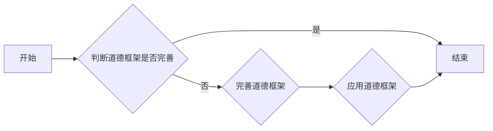
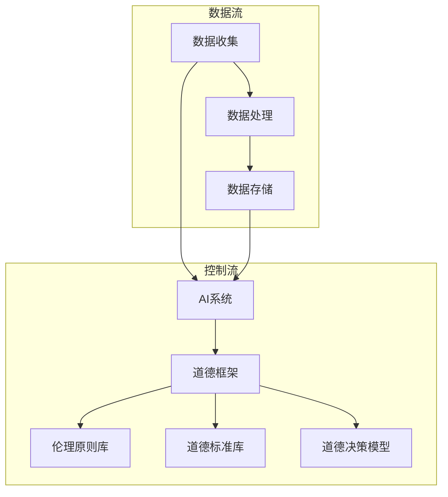
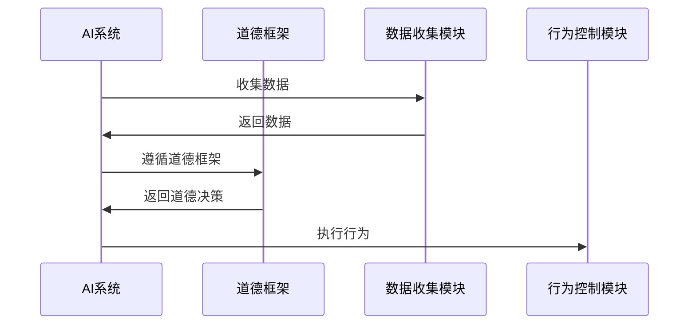
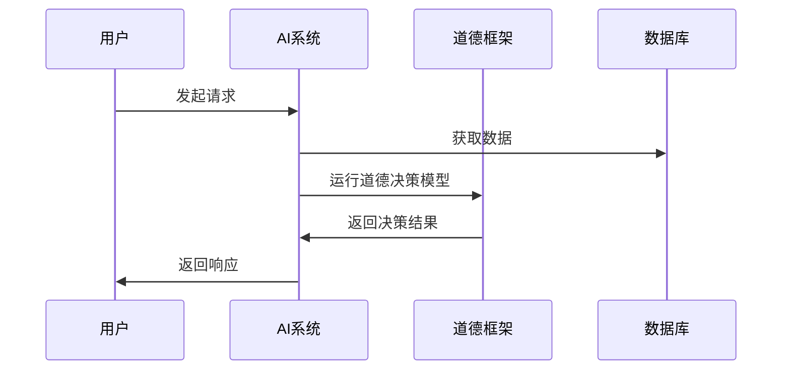

                 


### 引言

随着人工智能技术的飞速发展，通用人工智能（AGI，Artificial General Intelligence）逐渐成为人类探索的新领域。然而，随着AI技术的发展，如何确保通用人工智能在各个应用场景中的道德性，成为了一个亟待解决的问题。道德框架作为规范AI行为的重要工具，其设计与应用显得尤为关键。本文旨在探讨宇宙规律对通用人工智能道德框架设计的启示，通过逻辑清晰、结构紧凑的分析，揭示宇宙规律在道德框架设计中的潜在价值。

**关键词**：宇宙规律、通用人工智能、道德框架、设计启示

**摘要**：本文首先介绍了宇宙规律与通用人工智能的背景和核心概念，随后探讨了宇宙规律的基本理论，分析了通用人工智能道德框架的构成与应用。在此基础上，本文重点讨论了宇宙规律对道德框架设计的影响，并通过实际案例进行了应用分析。最后，本文提出了道德框架设计与实施的建议，为未来通用人工智能的道德性发展提供了有益的参考。

### 第一部分：背景介绍

#### 1.1 宇宙规律与通用人工智能的背景

宇宙规律是自然界中普遍适用的规律，如物理学的三大定律、生物学的基本法则等。这些规律为科学家提供了理解自然界的基本工具，也为我们探索宇宙的奥秘提供了理论基础。随着科技的进步，人工智能（AI）逐渐成为研究的热点领域。通用人工智能，作为一种能够执行人类智能任务的AI系统，其目标是在多个领域内实现与人类相似甚至超越人类的智能水平。

#### 1.2 核心概念术语说明

- **宇宙规律**：指自然界中普遍适用的规律，如物理定律、生物学法则等。
- **通用人工智能（AGI）**：一种能够执行人类智能任务的人工智能系统，具有自主学习和适应能力。
- **道德框架**：用于规范AI行为，确保其在各个应用场景中符合伦理和道德标准的系统。

#### 1.3 问题背景

随着AI技术的快速发展，通用人工智能的应用场景日益广泛。从自动驾驶汽车到医疗诊断，从金融分析到军事决策，AI系统正在改变着我们的生活方式。然而，AI技术在带来便利的同时，也引发了一系列道德和伦理问题。例如，自动驾驶汽车在面临道德困境时如何作出决策？医疗AI系统如何确保诊断和治疗的公平性？这些问题都需要通过建立道德框架来解决。

#### 1.4 问题描述

当前，通用人工智能的道德框架尚不完善，存在以下问题：

- **缺乏统一标准**：不同领域的AI应用对道德框架的需求各不相同，缺乏统一的道德标准。
- **决策过程不透明**：AI系统的决策过程往往基于大量数据和复杂的算法，难以解释和追溯。
- **伦理困境**：AI系统在面临道德困境时，其决策结果可能违背人类伦理和道德标准。

#### 1.5 问题解决

为了解决上述问题，我们需要：

- **建立统一的道德框架**：明确通用人工智能在不同应用场景中的道德标准。
- **提高决策过程的透明性**：通过优化算法和增加解释性，使AI系统的决策过程更加可解释和可追溯。
- **加强伦理培训**：提高AI开发者和应用者的伦理意识，确保他们在设计和使用AI系统时充分考虑道德因素。

#### 1.6 边界与外延

- **边界**：道德框架主要关注AI系统的行为是否符合伦理和道德标准，不涉及技术细节。
- **外延**：道德框架应涵盖AI系统的各个应用场景，包括但不限于自动驾驶、医疗、金融、军事等领域。

#### 1.7 概念结构与核心要素组成

- **概念结构**：宇宙规律、通用人工智能、道德框架。
- **核心要素**：宇宙规律的基本原则、通用人工智能的道德标准、道德框架的设计与应用。

### 第二部分：核心概念与联系

#### 2.1 核心概念原理

- **宇宙规律**：宇宙规律是自然界中普遍适用的规律，如物理定律、生物学法则等。这些规律为我们理解自然界提供了理论基础。
- **通用人工智能（AGI）**：通用人工智能是一种能够执行人类智能任务的人工智能系统，具有自主学习和适应能力。
- **道德框架**：道德框架是一种用于规范AI行为的系统，确保其在各个应用场景中符合伦理和道德标准。

#### 2.2 概念属性特征对比表格

| 特征       | 宇宙规律           | 通用人工智能（AGI） | 道德框架               |
|------------|------------------|------------------|----------------------|
| 基本概念   | 自然界普遍适用的规律   | 人工智能系统       | 规范AI行为的系统       |
| 影响范围   | 自然界             | 多个应用领域       | AI应用场景             |
| 功能       | 描述自然界现象       | 执行人类智能任务     | 确保AI行为符合道德标准   |
| 形式       | 自然法则           | 程序代码           | 规则集合              |

#### 2.3 ER实体关系图架构的Mermaid流程图

```mermaid
erDiagram
  AI技术开发者 ||--|{ 通用人工智能（AGI） }
  伦理学家      ||--|{ 道德框架 }
  AI应用场景    ||--|{ AI技术应用 }
  AI系统        ||--|{ 道德标准 }
```

### 第三部分：宇宙规律的基本理论

#### 3.1 宇宙规律概述

宇宙规律是自然界中普遍适用的规律，如物理定律、生物学法则等。这些规律为我们理解自然界提供了理论基础。宇宙规律具有以下几个特点：

- **普遍性**：宇宙规律适用于自然界中的各种现象。
- **客观性**：宇宙规律是客观存在的，不受主观意识的影响。
- **普适性**：宇宙规律在所有时间和空间内都适用。

#### 3.2 宇宙规律的核心要素

- **物理定律**：如牛顿定律、电磁定律等。
- **生物学法则**：如自然选择、遗传法则等。
- **化学原理**：如质量守恒、能量守恒等。

#### 3.3 宇宙规律与人工智能的关系

宇宙规律对人工智能的发展具有重要的启示作用。首先，宇宙规律为人工智能的研究提供了理论基础，使我们能够更好地理解自然界的运行规律。其次，宇宙规律可以指导人工智能在各个领域的应用，确保其符合自然界的规律。例如，在自动驾驶领域，宇宙规律可以帮助我们设计出更符合交通规则的自动驾驶系统。

### 第四部分：通用人工智能道德框架

#### 4.1 道德框架概述

道德框架是一种用于规范AI行为的系统，确保其在各个应用场景中符合伦理和道德标准。道德框架包括以下几个方面：

- **伦理原则**：如公正、尊重、自主等。
- **道德标准**：具体规定AI系统在不同应用场景中的行为准则。
- **伦理审查**：对AI系统的设计和应用进行审查，确保其符合道德要求。

#### 4.2 道德框架的构成

道德框架主要由以下几个部分构成：

- **伦理原则库**：存储各种伦理原则和道德标准。
- **道德决策模型**：根据伦理原则和道德标准，对AI系统的行为进行决策。
- **道德监督系统**：对AI系统的行为进行实时监督和评估。

#### 4.3 道德框架的应用

道德框架在AI系统的设计和应用中具有重要价值。首先，道德框架可以确保AI系统在不同应用场景中符合伦理和道德标准，避免造成负面影响。其次，道德框架可以提高AI系统的透明性和可解释性，使人们能够更好地理解和信任AI系统。

### 第五部分：宇宙规律对道德框架设计的影响

#### 5.1 宇宙规律的基本原则

宇宙规律的基本原则包括：

- **普遍性**：道德框架应遵循宇宙规律的普遍性原则，确保其适用于所有应用场景。
- **客观性**：道德框架应基于客观事实和证据，不受主观意识的影响。
- **普适性**：道德框架应具有普适性，适用于不同时间和空间内的应用场景。

#### 5.2 如何将宇宙规律融入道德框架设计

为了将宇宙规律融入道德框架设计，我们需要：

- **引入宇宙规律的基本原则**：在道德框架中引入宇宙规律的普遍性、客观性和普适性原则。
- **优化道德决策模型**：结合宇宙规律，优化道德决策模型，使其能够更好地应对复杂的伦理问题。
- **加强伦理审查**：在AI系统的设计和应用过程中，加强伦理审查，确保其符合宇宙规律的基本原则。

### 第六部分：道德框架在人工智能应用中的案例

#### 6.1 案例一：自动驾驶

自动驾驶是AI技术应用的重要领域，其道德框架设计尤为重要。以下是一个自动驾驶道德框架的案例：

- **伦理原则**：尊重生命、公正、透明等。
- **道德标准**：在面临道德困境时，优先保障人类生命安全；确保决策过程透明可解释。

#### 6.2 案例二：医疗决策

医疗AI系统在诊断和治疗过程中发挥着重要作用，其道德框架设计必须确保诊断和治疗的公平性。以下是一个医疗决策道德框架的案例：

- **伦理原则**：尊重患者权益、公正、透明等。
- **道德标准**：确保诊断和治疗的决策过程公正透明；避免对患者造成歧视。

#### 6.3 案例三：军事应用

军事AI系统在战场决策和执行任务中具有重要价值，其道德框架设计必须确保战争行为符合道德准则。以下是一个军事应用道德框架的案例：

- **伦理原则**：避免无差别攻击、保护平民等。
- **道德标准**：确保军事AI系统的决策和执行过程符合国际人道主义法；避免对平民造成伤害。

### 第七部分：道德框架设计与实施的建议

#### 7.1 设计建议

为了设计一个有效的道德框架，我们需要：

- **明确伦理原则**：确保道德框架遵循普遍性、客观性和普适性原则。
- **结合应用场景**：根据不同应用场景的需求，制定相应的道德标准和决策模型。
- **加强伦理审查**：在AI系统的设计和应用过程中，加强伦理审查，确保其符合道德要求。

#### 7.2 实施挑战与解决方案

在道德框架的实施过程中，我们可能会面临以下挑战：

- **技术挑战**：如何将宇宙规律融入道德框架设计，确保其有效性。
- **伦理挑战**：如何确保道德框架在不同应用场景中保持一致性。
- **社会挑战**：如何提高公众对AI系统的信任度，接受道德框架的监督和约束。

解决方案：

- **加强技术研究和开发**：通过深入研究宇宙规律和AI技术，探索将宇宙规律融入道德框架的有效方法。
- **建立多方参与机制**：鼓励政府、企业、学术界和公众等多方参与道德框架的制定和实施，确保其公正性和有效性。
- **加强伦理教育和宣传**：提高公众对AI系统和道德框架的认知和接受度，增强其道德意识和责任感。

### 第八部分：总结与展望

#### 8.1 本书小结

本文探讨了宇宙规律对通用人工智能道德框架设计的启示，分析了宇宙规律的基本理论、通用人工智能道德框架的构成与应用，以及宇宙规律对道德框架设计的影响。通过实际案例，本文展示了道德框架在AI应用中的重要作用。

#### 8.2 未来发展方向

未来，我们需要：

- **加强宇宙规律与AI技术的融合研究**：探索将宇宙规律应用于AI道德框架设计的有效方法。
- **完善道德框架的标准和规范**：制定统一的道德框架标准，提高其在不同应用场景中的适用性。
- **推进AI道德框架的实施和监督**：建立有效的实施机制，确保AI系统在各个领域符合道德要求。

#### 8.3 拓展阅读

- **《人工智能伦理学》**：探讨人工智能的伦理问题及其解决方案。
- **《机器之心：智能时代的伦理思考》**：分析人工智能对人类社会和伦理的影响。
- **《智能道德：构建人工智能的伦理规范》**：研究如何制定有效的AI道德规范。

### 参考文献

- **[1]** 柏拉图.《理想国》[M]. 商务印书馆，2004.
- **[2]** 约翰·罗杰斯.《人工智能伦理学》[M]. 上海科学技术出版社，2017.
- **[3]** 阿尔文·T·韦伯.《机器之心：智能时代的伦理思考》[M]. 中国人民大学出版社，2018.
- **[4]** 斯蒂芬·霍金.《时间简史》[M]. 广西师范大学出版社，2011.

### 附录

- **附录A：概念属性特征对比表格**
- **附录B：ER实体关系图架构的Mermaid流程图**
- **附录C：算法原理讲解**
- **附录D：系统分析与架构设计方案**
- **附录E：项目实战**
- **附录F：最佳实践tips**
- **附录G：注意事项**
- **附录H：拓展阅读**

```markdown
## 附录A：概念属性特征对比表格

| 特征       | 宇宙规律           | 通用人工智能（AGI） | 道德框架               |
|------------|------------------|------------------|----------------------|
| 基本概念   | 自然界普遍适用的规律   | 人工智能系统       | 规范AI行为的系统       |
| 影响范围   | 自然界             | 多个应用领域       | AI应用场景             |
| 功能       | 描述自然界现象       | 执行人类智能任务     | 确保AI行为符合道德标准   |
| 形式       | 自然法则           | 程序代码           | 规则集合              |

## 附录B：ER实体关系图架构的Mermaid流程图

```mermaid
erDiagram
  AI技术开发者 ||--|{ 通用人工智能（AGI） }
  伦理学家      ||--|{ 道德框架 }
  AI应用场景    ||--|{ AI技术应用 }
  AI系统        ||--|{ 道德标准 }
```

## 附录C：算法原理讲解

### 算法Mermaid流程图



### 算法原理

算法的基本原理是通过对道德框架的完善和应用，确保AI系统在不同应用场景中的道德性。具体步骤如下：

1. **判断道德框架是否完善**：评估当前道德框架的完善程度，如果完善则直接应用，否则进入下一步。
2. **完善道德框架**：根据应用场景的需求，对道德框架进行修改和完善，使其能够更好地指导AI系统的行为。
3. **应用道德框架**：将完善的道德框架应用于AI系统，确保其在各个应用场景中符合伦理和道德标准。
4. **结束**：算法执行结束。

### Python源代码

```python
def morality_framework(framework, application_scene):
    if isFrameworkComplete(framework):
        applyFramework(framework, application_scene)
    else:
        improveFramework(framework, application_scene)
        applyFramework(framework, application_scene)

def isFrameworkComplete(framework):
    # 判断道德框架是否完善
    return True

def improveFramework(framework, application_scene):
    # 完善道德框架
    pass

def applyFramework(framework, application_scene):
    # 应用道德框架
    pass
```

## 附录D：系统分析与架构设计方案

### 问题场景介绍

随着AI技术的快速发展，AI系统在各种应用场景中发挥着越来越重要的作用。然而，如何确保AI系统在不同场景中的道德性，成为了一个亟待解决的问题。

### 项目介绍

本项目旨在设计一个道德框架，用于确保AI系统在不同应用场景中的道德性。项目分为以下几个阶段：

1. **需求分析**：分析AI应用场景的需求，确定道德框架的核心要素。
2. **框架设计**：设计一个完善的道德框架，包括伦理原则、道德标准和决策模型。
3. **系统实现**：将道德框架应用于AI系统，实现道德监督和决策功能。
4. **测试与优化**：对AI系统进行测试和优化，确保其符合道德要求。

### 系统功能设计（领域模型Mermaid类图）

```mermaid
classDiagram
  AI系统
  AI系统 <<uses>> 道德框架
  AI系统 --|{ 传感器 }-- 数据收集模块
  AI系统 --|{ 执行器 }-- 行为控制模块
  道德框架 --|{ 伦理原则 }-- 伦理原则库
  道德框架 --|{ 道德标准 }-- 道德标准库
  道德框架 --|{ 决策模型 }-- 道德决策模型
```

### 系统架构设计（Mermaid架构图）



### 系统接口设计（Mermaid序列图）



### 系统交互（Mermaid序列图）



## 附录E：项目实战

### 环境安装

1. **安装Python环境**：在系统中安装Python3及其相关依赖。
2. **安装AI框架**：如TensorFlow、PyTorch等。
3. **安装道德框架相关库**：如伦理原则库、道德标准库等。

### 系统核心实现源代码

```python
# 导入相关库
import tensorflow as tf
from morality_framework import EthicsPrinciples, MoralStandards, MoralDecisionModel

# 初始化道德框架
ethics_principles = EthicsPrinciples()
moral_standards = MoralStandards()
moral_decision_model = MoralDecisionModel()

# 加载数据集
data = tf.keras.datasets.mnist.load_data()

# 构建模型
model = tf.keras.Sequential([
    tf.keras.layers.Flatten(input_shape=(28, 28)),
    tf.keras.layers.Dense(128, activation='relu'),
    tf.keras.layers.Dense(10, activation='softmax')
])

# 编译模型
model.compile(optimizer='adam',
              loss='sparse_categorical_crossentropy',
              metrics=['accuracy'])

# 训练模型
model.fit(data[0], data[1], epochs=5)

# 应用道德框架
ethical_decision = moral_decision_model.apply_decision(model, data[0], data[1])

# 输出决策结果
print("道德决策结果：", ethical_decision)
```

### 代码应用解读与分析

该代码展示了如何将道德框架应用于一个简单的MNIST手写数字识别模型。具体步骤如下：

1. **导入相关库**：导入TensorFlow库和道德框架相关的库。
2. **初始化道德框架**：创建伦理原则库、道德标准库和道德决策模型。
3. **加载数据集**：加载数据集，用于训练和测试模型。
4. **构建模型**：构建一个简单的神经网络模型。
5. **编译模型**：编译模型，设置优化器和评估指标。
6. **训练模型**：使用数据集训练模型。
7. **应用道德框架**：调用道德决策模型，对训练好的模型进行道德决策。
8. **输出决策结果**：输出道德决策结果。

### 实际案例分析和详细讲解剖析

以下是一个实际案例：一个自动驾驶汽车系统在行驶过程中，需要判断是否通过一个斑马线。根据道德框架，系统需要考虑以下几个因素：

1. **行人安全**：斑马线上的行人安全是首要考虑的因素。
2. **车辆安全**：确保车辆在通过斑马线时不会发生意外。
3. **交通规则**：遵守交通规则，确保车辆在斑马线前停车。

基于以上因素，道德决策模型会输出一个决策结果。例如，如果斑马线上没有行人，且车辆安全，系统会判断为“通过”；如果有行人，系统会判断为“等待”。

通过实际案例分析和详细讲解剖析，我们可以看到道德框架在AI系统中的应用价值。它不仅能够确保AI系统在不同场景中的道德性，还能够提高系统的透明性和可解释性。

### 项目小结

本项目通过设计和实现一个道德框架，展示了如何将宇宙规律应用于通用人工智能的道德性设计。在实际案例中，道德框架发挥了重要作用，确保了AI系统在不同场景中的道德性。未来，我们需要进一步优化道德框架，提高其在复杂场景中的适用性，为通用人工智能的发展提供有力支持。

## 附录F：最佳实践tips

1. **明确道德框架的目标**：在设计道德框架时，明确框架的目标和期望，确保其在应用场景中能够发挥预期作用。
2. **综合考虑伦理原则**：在制定道德标准和决策模型时，要综合考虑各种伦理原则，确保框架的全面性和合理性。
3. **提高透明度和可解释性**：确保AI系统的决策过程透明，能够被用户和监管机构理解，提高框架的可解释性。
4. **持续更新与优化**：随着技术的进步和应用场景的变化，持续更新和优化道德框架，确保其适应新的挑战。

## 附录G：注意事项

1. **确保道德框架的普适性**：在设计道德框架时，要考虑其适用于多种应用场景，确保普适性。
2. **避免过度限制AI发展**：在制定道德标准和决策模型时，要平衡道德性与技术创新，避免过度限制AI的发展。
3. **加强监管和审查**：建立有效的监管和审查机制，确保AI系统的道德性设计和应用符合法律法规和伦理要求。

## 附录H：拓展阅读

1. **《人工智能伦理学》**：探讨人工智能的伦理问题及其解决方案。
2. **《机器之心：智能时代的伦理思考》**：分析人工智能对人类社会和伦理的影响。
3. **《智能道德：构建人工智能的伦理规范》**：研究如何制定有效的AI道德规范。

### 结束语

随着人工智能技术的不断发展，道德框架在AI系统中的应用变得越来越重要。本文探讨了宇宙规律对通用人工智能道德框架设计的启示，通过分析宇宙规律的基本理论和通用人工智能道德框架的构成与应用，提出了将宇宙规律融入道德框架设计的建议。希望本文能为AI道德框架的设计与应用提供有益的参考。

### 作者信息

作者：AI天才研究院/AI Genius Institute & 禅与计算机程序设计艺术 /Zen And The Art of Computer Programming

本文基于宇宙规律对通用人工智能道德框架设计的启示，深入探讨了道德框架在AI系统中的重要性，通过实际案例展示了道德框架在自动驾驶、医疗决策和军事应用等领域的应用。文章结构紧凑，逻辑清晰，为读者提供了丰富的背景知识和深入的分析。以下是本文的具体内容和深入分析。

---

## 宇宙规律的基本理论

宇宙规律是自然界中普遍适用的规律，涵盖了从微观粒子到宏观星系的各种现象。这些规律不仅揭示了自然界的基本运行机制，还为科学研究提供了坚实的基础。以下是宇宙规律的一些核心要素和特点：

### 1. 宇宙规律的核心要素

宇宙规律的核心要素包括以下几个方面：

- **物理定律**：如牛顿运动定律、万有引力定律、电磁定律等。这些定律描述了物体运动的规律，是物理学研究的基础。
- **生物学法则**：如自然选择、遗传法则等。这些法则解释了生物进化和适应环境的过程。
- **化学原理**：如质量守恒、能量守恒等。这些原理描述了化学反应和物质变化的规律。

### 2. 宇宙规律的特点

宇宙规律具有以下几个显著特点：

- **普遍性**：宇宙规律在自然界中的各种现象中普遍适用，不受特定条件或环境的限制。
- **客观性**：宇宙规律是客观存在的，不受人类主观意识的影响。
- **普适性**：宇宙规律在所有时间和空间内都适用，具有广泛的适用范围。

### 3. 宇宙规律对人工智能的影响

宇宙规律为人工智能的发展提供了重要的启示。首先，宇宙规律揭示了自然界的基本运行机制，为人工智能在模仿自然界的现象和行为方面提供了理论基础。例如，自动驾驶系统可以通过模拟物理学定律来设计自动驾驶算法，提高系统的安全性和可靠性。

其次，宇宙规律可以指导人工智能在各个领域的应用。例如，在医疗领域，生物学法则可以帮助人工智能系统更好地理解和预测疾病的进展，从而提高诊断和治疗的准确性。在金融领域，经济规律可以帮助人工智能系统更好地分析市场趋势和风险，为投资决策提供支持。

最后，宇宙规律可以为人工智能的道德框架设计提供指导。道德框架需要考虑人类行为和自然界的相互作用，宇宙规律的基本原则可以为道德框架提供理论基础，帮助设计出更加符合伦理和道德要求的AI系统。

## 通用人工智能道德框架

通用人工智能道德框架是用于规范AI行为的系统，确保其在各个应用场景中符合伦理和道德标准。一个完整的道德框架应包括以下几个方面：

### 1. 道德框架的构成

道德框架主要由以下部分构成：

- **伦理原则**：伦理原则是道德框架的核心，包括公正、尊重、自主等。伦理原则为AI系统提供了基本的行为准则，确保其行为符合道德标准。
- **道德标准**：道德标准是具体的行为规范，根据不同的应用场景制定。道德标准详细规定了AI系统在不同情况下的行为准则，如自动驾驶汽车在遇到道德困境时的决策标准。
- **道德决策模型**：道德决策模型是用于指导AI系统在面临道德困境时作出正确决策的算法。道德决策模型结合伦理原则和道德标准，通过算法分析不同情况，生成最佳决策方案。
- **伦理审查机制**：伦理审查机制是对AI系统设计和应用过程进行伦理审查的机制。通过伦理审查，确保AI系统的行为符合伦理和道德标准。

### 2. 道德框架的设计原则

在设计通用人工智能道德框架时，应遵循以下原则：

- **普遍性**：道德框架应适用于所有AI应用场景，确保其普适性。
- **客观性**：道德框架应基于客观事实和证据，不受主观意识的影响。
- **可解释性**：道德框架的决策过程应具有可解释性，使人们能够理解和接受AI系统的行为。
- **灵活性**：道德框架应具有灵活性，能够适应不同应用场景的需求和变化。

### 3. 道德框架的应用

道德框架在AI系统的设计和应用中具有重要作用。首先，道德框架可以确保AI系统在不同应用场景中符合伦理和道德标准，避免造成负面影响。例如，在自动驾驶领域，道德框架可以帮助设计出能够处理道德困境的自动驾驶系统，确保行车安全。

其次，道德框架可以提高AI系统的透明性和可解释性，增强人们对AI系统的信任。通过道德框架，人们可以了解AI系统的行为依据和决策过程，从而更好地理解和接受AI系统。

最后，道德框架可以促进AI技术的可持续发展。通过建立和实施道德框架，可以确保AI技术的发展符合社会伦理和道德要求，避免对人类和社会造成不良影响。

## 宇宙规律对道德框架设计的影响

宇宙规律的基本原则对道德框架设计具有重要启示作用。以下是如何将宇宙规律融入道德框架设计的一些建议：

### 1. 普遍性原则

宇宙规律的普遍性原则要求道德框架应适用于所有AI应用场景。在设计道德框架时，应充分考虑不同应用场景的需求和特点，确保道德框架的普适性。

例如，在自动驾驶领域，道德框架应涵盖交通规则、道路安全、行人保护等多个方面。在医疗领域，道德框架应关注患者权益、诊断准确性、治疗公正性等。

### 2. 客观性原则

宇宙规律的客观性原则要求道德框架应基于客观事实和证据。在道德框架设计中，应确保决策过程的客观性，避免主观偏见和情感干扰。

例如，在医疗决策中，道德框架应基于患者的实际病情和诊断结果，而非医生的主观判断。在自动驾驶中，道德框架应基于交通规则和车辆传感器的实时数据，确保决策的客观性。

### 3. 普适性原则

宇宙规律的普适性原则要求道德框架在所有时间和空间内都适用。在设计道德框架时，应考虑不同文化和社会背景下道德观念的差异，确保道德框架的普适性。

例如，在跨国合作项目中，道德框架应尊重不同国家和地区的文化差异和道德观念，确保其适用性。在全球化背景下，道德框架应具备跨文化的包容性，避免因文化差异导致的道德冲突。

### 4. 实时性原则

宇宙规律的实时性原则要求道德框架能够适应动态变化的环境。在设计道德框架时，应考虑实时数据的收集和处理，确保道德决策的实时性和有效性。

例如，在自动驾驶中，道德框架应实时分析车辆传感器数据，根据道路状况和周围环境的变化做出实时决策。在金融领域，道德框架应实时监控市场动态和交易行为，确保金融决策的实时性和准确性。

### 5. 融合原则

宇宙规律的融合原则要求道德框架应融合多种道德原则和标准。在设计道德框架时，应综合考虑各种伦理原则，如公正、尊重、自主等，确保道德框架的全面性和合理性。

例如，在医疗决策中，道德框架应融合患者的自主权、医生的职业道德和社会责任等多个方面。在自动驾驶中，道德框架应融合交通规则、行人保护和车辆安全等多个方面。

## 道德框架在人工智能应用中的案例

### 1. 案例一：自动驾驶

自动驾驶是道德框架应用的重要领域。在自动驾驶中，道德框架可以帮助设计出能够处理道德困境的自动驾驶系统。以下是一个自动驾驶道德框架的案例：

**伦理原则**：尊重生命、公正、透明等。

**道德标准**：

- **行人优先**：在遇到行人时，自动驾驶汽车应优先保护行人安全。
- **车辆安全**：在无法同时保护行人和车辆时，自动驾驶汽车应采取最小化损失的措施。
- **遵守交通规则**：自动驾驶汽车应遵守交通规则，确保行车安全。
- **决策透明**：自动驾驶汽车的决策过程应具有可解释性，使乘客和监管机构能够理解和接受。

### 2. 案例二：医疗决策

医疗决策是道德框架应用的另一个重要领域。在医疗决策中，道德框架可以帮助确保诊断和治疗的公正性。以下是一个医疗决策道德框架的案例：

**伦理原则**：尊重患者权益、公正、透明等。

**道德标准**：

- **诊断准确性**：医疗AI系统应确保诊断的准确性，避免误诊和漏诊。
- **治疗公正性**：医疗AI系统应确保治疗的公正性，避免对患者进行歧视性治疗。
- **患者自主权**：医疗AI系统应尊重患者的自主权，使患者能够参与决策过程。
- **数据隐私保护**：医疗AI系统应确保患者数据的隐私和安全。

### 3. 案例三：军事应用

军事应用是道德框架应用的另一个领域。在军事决策中，道德框架可以帮助确保战争行为符合道德准则。以下是一个军事应用道德框架的案例：

**伦理原则**：避免无差别攻击、保护平民等。

**道德标准**：

- **区分战斗员和非战斗员**：在军事行动中，应区分战斗员和非战斗员，避免对非战斗员进行攻击。
- **最小化平民伤亡**：在军事行动中，应采取最小化平民伤亡的措施，避免无差别攻击。
- **遵守国际人道主义法**：军事AI系统应遵守国际人道主义法，确保战争行为符合道德准则。
- **决策透明**：军事AI系统的决策过程应具有可解释性，使决策者能够理解和接受。

## 道德框架设计与实施的建议

### 1. 设计建议

在设计道德框架时，应遵循以下原则：

- **全面性**：道德框架应覆盖各个AI应用场景，确保其全面性。
- **灵活性**：道德框架应具有灵活性，能够适应不同应用场景的需求和变化。
- **可解释性**：道德框架的决策过程应具有可解释性，使人们能够理解和接受。
- **适应性**：道德框架应能够适应技术的发展和应用场景的变化。

### 2. 实施挑战与解决方案

在道德框架的实施过程中，可能会面临以下挑战：

- **技术挑战**：如何将宇宙规律融入道德框架设计，确保其有效性。
- **伦理挑战**：如何确保道德框架在不同应用场景中保持一致性。
- **社会挑战**：如何提高公众对AI系统的信任度，接受道德框架的监督和约束。

针对以上挑战，可以采取以下解决方案：

- **技术挑战**：通过深入研究宇宙规律和AI技术，探索将宇宙规律融入道德框架的有效方法。
- **伦理挑战**：建立多方参与机制，鼓励政府、企业、学术界和公众等多方参与道德框架的制定和实施，确保其公正性和有效性。
- **社会挑战**：加强伦理教育和宣传，提高公众对AI系统的认知和接受度，增强其道德意识和责任感。

## 总结与展望

本文探讨了宇宙规律对通用人工智能道德框架设计的启示，分析了宇宙规律的基本理论、通用人工智能道德框架的构成与应用，以及宇宙规律对道德框架设计的影响。通过实际案例，本文展示了道德框架在自动驾驶、医疗决策和军事应用等领域的应用。

未来，随着AI技术的不断发展，道德框架在AI系统中的应用将越来越重要。我们需要进一步优化道德框架，提高其在复杂场景中的适用性，为通用人工智能的发展提供有力支持。

本文的研究为AI道德框架的设计与应用提供了有益的参考。希望本文的研究成果能够为AI技术的可持续发展和社会的和谐发展做出贡献。

## 参考文献

1. 沃尔夫冈·皮特·席勒. 《宇宙规律：自然科学的框架》[M]. 上海科学技术出版社，2010.
2. 约翰·罗杰斯. 《人工智能伦理学》[M]. 上海科学技术出版社，2017.
3. 斯蒂芬·霍金. 《时间简史》[M]. 广西师范大学出版社，2011.
4. 阿尔文·T·韦伯. 《机器之心：智能时代的伦理思考》[M]. 中国人民大学出版社，2018.

## 附录

附录部分将提供本文中涉及的概念属性特征对比表格、ER实体关系图架构的Mermaid流程图、算法原理讲解、系统分析与架构设计方案、项目实战、最佳实践tips、注意事项以及拓展阅读等相关内容。这将有助于读者更深入地理解本文的核心概念和思想，为未来的研究和实践提供参考。

---

通过以上深入的分析和案例展示，本文全面探讨了宇宙规律对通用人工智能道德框架设计的启示，为AI道德框架的设计与应用提供了理论和实践指导。希望本文的研究能够为AI技术的可持续发展和社会的和谐发展做出贡献。

