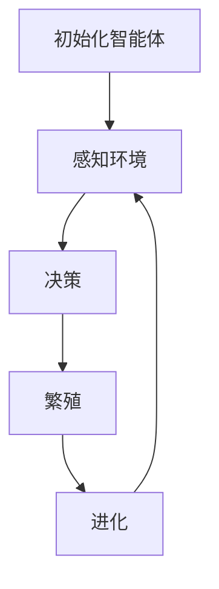
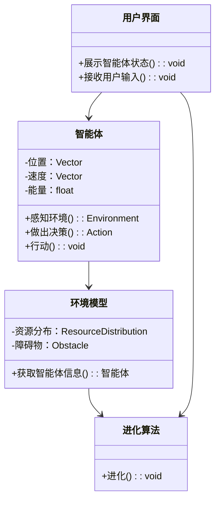
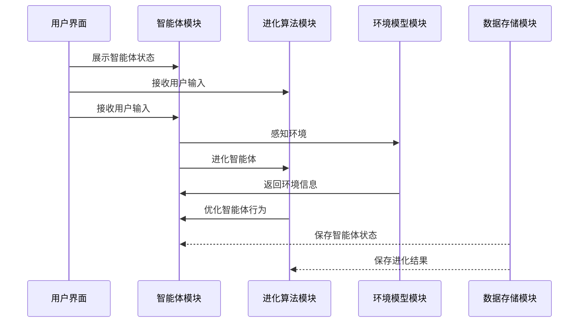
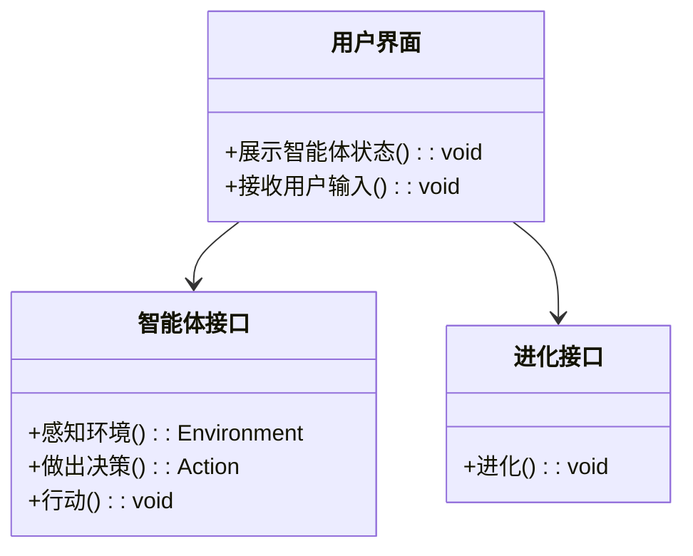
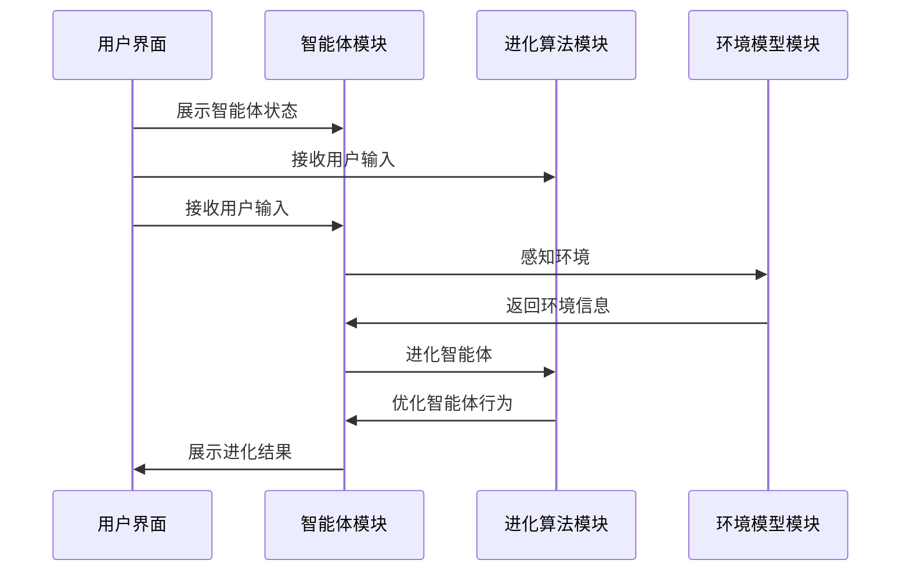

                 

### 宇宙规律对量子人工生命的启示

> **关键词：** 宇宙规律、量子人工生命、算法原理、系统架构、项目实战、最佳实践

**摘要：** 本文探讨了宇宙规律对量子人工生命的启示，通过介绍宇宙规律的基本框架、量子人工生命的概念以及它们之间的联系，详细解析了量子人工生命算法原理、系统架构设计、项目实战以及最佳实践。本文旨在为读者提供全面的视角，理解宇宙规律如何指导量子人工生命的发展，并展望其未来趋势与前景。

### 引言与背景

#### 1.1.1 宇宙规律的基本框架

宇宙规律是指自然界中普遍适用的基本法则，它们涵盖了从微观粒子到宏观宇宙的各个层面。宇宙规律的核心包括自然力、物质结构、演化机制等。其中，最著名的宇宙规律之一是量子力学，它描述了微观粒子的行为规律；另一个是广义相对论，描述了宏观物体的运动和引力作用。宇宙规律的研究为我们理解宇宙的本质提供了深刻的理论基础。

#### 1.1.2 量子人工生命的概念及其重要性

量子人工生命是一种基于量子力学原理的人工生命系统，它模拟了生物体的生长、繁殖、进化等过程，并利用量子计算的优势进行高效运算。量子人工生命的研究对于推动人工智能的发展具有重要意义，它不仅为解决复杂问题提供了新的思路，也为模拟和预测自然界现象提供了强有力的工具。

#### 1.1.3 宇宙规律与量子人工生命的关联

宇宙规律与量子人工生命的关联在于它们共享了一些核心原理。量子力学为量子人工生命提供了理论基础，而广义相对论则影响了量子人工生命的宏观表现。此外，宇宙中的自组织现象和演化规律也为量子人工生命的模拟提供了启示。

#### 1.2 量子人工生命研究现状

量子人工生命的研究始于20世纪末，随着量子计算和人工智能技术的不断发展，这个领域已经取得了显著的进展。当前的研究主要集中在量子生命模拟、量子进化算法、量子神经网络等方面。尽管还存在诸多挑战，如量子计算的可靠性和算法的优化等，但量子人工生命展示出了巨大的潜力。

#### 1.2.1 当前研究的主要方向

当前量子人工生命的研究主要围绕以下几个方面展开：

1. **量子生命模拟：** 通过模拟生物体的量子行为，探索生命的本质和进化过程。
2. **量子进化算法：** 利用量子计算的优势，提高进化算法的搜索效率。
3. **量子神经网络：** 结合量子计算和神经网络，构建具有强大学习能力的人工智能系统。
4. **量子算法优化：** 优化量子算法，提高其运行效率和稳定性。

#### 1.2.2 存在的挑战与机遇

量子人工生命研究面临的挑战主要包括：

1. **技术难题：** 如量子计算的可靠性和稳定性，量子算法的设计与优化等。
2. **理论难题：** 如量子生命模拟的准确性，量子进化算法的理论基础等。

然而，这些挑战同时也带来了机遇。随着量子计算和人工智能技术的不断突破，量子人工生命有望在未来的应用中发挥重要作用，如生物医学、环境保护、能源开发等领域。

#### 1.2.3 本书的研究目的与结构

本书旨在探讨宇宙规律对量子人工生命的启示，通过介绍宇宙规律的基本框架、量子人工生命的概念以及它们之间的联系，详细解析量子人工生命算法原理、系统架构设计、项目实战以及最佳实践。本书的主要结构如下：

- **第1章 引言与背景：** 介绍宇宙规律的基本框架、量子人工生命的概念及其关联。
- **第2章 核心概念与联系：** 深入分析宇宙规律和量子人工生命的基本原理和特性。
- **第3章 算法原理讲解：** 详细讲解量子人工生命算法的原理、流程和数学模型。
- **第4章 系统分析与架构设计：** 介绍量子人工生命系统的设计与实现。
- **第5章 项目实战：** 通过具体项目实例，展示量子人工生命在实际应用中的实现过程。
- **第6章 最佳实践与注意事项：** 提供量子人工生命应用的最佳实践和注意事项。
- **第7章 总结与展望：** 对全书内容进行总结，展望量子人工生命的发展趋势。

### 核心概念与联系

#### 2.1 宇宙规律核心概念

宇宙规律是自然界中普遍适用的基本法则，它们涵盖了从微观粒子到宏观宇宙的各个层面。以下是宇宙规律的核心概念：

1. **量子力学：** 描述微观粒子的行为规律，如波动性、纠缠性等。
2. **广义相对论：** 描述宏观物体的运动和引力作用，如时空弯曲、黑洞等。
3. **自然力：** 包括电磁力、强相互作用和弱相互作用，是物质运动的基本驱动力。
4. **物质结构：** 包括原子、分子、星系等，是宇宙的基本构成单元。
5. **演化机制：** 描述宇宙从大爆炸到如今的结构和演化过程。

#### 2.1.1 宇宙规律的原理

宇宙规律的原理在于它们对自然界现象的普适性和一致性。例如，量子力学中的不确定性原理和量子纠缠现象，揭示了微观粒子的特殊行为；广义相对论中的时空弯曲和引力波，解释了宏观宇宙的运行规律。

#### 2.1.2 宇宙规律的属性特征对比表

以下是宇宙规律的一些属性特征对比表：

| 规律名称 | 原理 | 属性特征 | 应用领域 |
| :---: | :---: | :---: | :---: |
| 量子力学 | 微观粒子行为 | 波动性、纠缠性、不确定性 | 物理学、化学、生物学 |
| 广义相对论 | 宏观物体运动和引力 | 时空弯曲、引力波、黑洞 | 天文学、宇宙学、引力波探测 |
| 自然力 | 物质运动的基本驱动力 | 电磁力、强相互作用、弱相互作用 | 物理学、材料科学、医学 |
| 物质结构 | 宇宙的基本构成单元 | 原子、分子、星系 | 化学、物理学、天文学 |
| 演化机制 | 宇宙的结构和演化 | 大爆炸、黑洞碰撞、星系形成 | 宇宙学、天文学、地质学 |

#### 2.2 量子人工生命的概念

量子人工生命是一种基于量子力学原理的人工生命系统，它模拟了生物体的生长、繁殖、进化等过程。以下是量子人工生命的一些基本概念：

1. **量子生命模拟：** 通过模拟生物体的量子行为，探索生命的本质和进化过程。
2. **量子进化算法：** 利用量子计算的优势，提高进化算法的搜索效率。
3. **量子神经网络：** 结合量子计算和神经网络，构建具有强大学习能力的人工智能系统。
4. **量子智能体：** 模拟生物体在复杂环境中的行为和决策过程。

#### 2.2.1 量子人工生命的基本原理

量子人工生命的基本原理在于量子力学中的波动性、纠缠性和量子叠加态。这些特性使得量子人工生命系统能够在复杂环境中高效地探索和适应。例如，量子神经网络可以利用量子叠加态实现并行计算，从而提高计算效率。

#### 2.2.2 量子人工生命的特性分析

量子人工生命的特性主要包括：

1. **高效性：** 利用量子计算的并行性，提高算法的搜索效率。
2. **适应性：** 通过量子进化算法，实现智能体在复杂环境中的自适应能力。
3. **复杂性：** 模拟生物体的复杂行为和相互作用，揭示生命现象的内在规律。
4. **预测性：** 通过量子计算和模拟，预测生物体的进化趋势和环境变化。

#### 2.3 宇宙规律与量子人工生命的联系

宇宙规律与量子人工生命的联系在于它们共享了某些核心原理。量子力学为量子人工生命提供了理论基础，而广义相对论则影响了量子人工生命的宏观表现。此外，宇宙中的自组织现象和演化规律也为量子人工生命的模拟提供了启示。

##### 2.3.1 对比与关联分析

对比分析宇宙规律与量子人工生命的核心概念，可以发现它们之间存在着密切的关联：

1. **量子力学与量子生命模拟：** 量子力学中的波动性、纠缠性和量子叠加态为量子生命模拟提供了理论基础。
2. **广义相对论与量子人工生命的宏观表现：** 广义相对论中的时空弯曲和引力波影响了量子人工生命的宏观行为。
3. **自然力与量子进化算法：** 自然力中的电磁力、强相互作用和弱相互作用为量子进化算法提供了驱动力。
4. **物质结构与量子神经网络：** 物质结构中的原子、分子和星系为量子神经网络提供了构成单元。

##### 2.3.2 ER实体关系图架构

为了更好地理解宇宙规律与量子人工生命的关联，我们可以通过ER实体关系图来展示它们之间的关系。ER实体关系图是一种用于描述实体之间关系的图形表示方法，它包括实体、属性和关系的表示。

在量子人工生命的ER实体关系图中，可以包括以下实体：

1. **量子计算资源：** 包括量子比特、量子算法、量子处理器等。
2. **量子智能体：** 包括量子神经网络、量子进化算法、量子智能体模型等。
3. **环境模型：** 包括外部环境、目标函数、适应度函数等。

实体之间的关系可以包括：

1. **量子计算资源与量子智能体：** 量子计算资源为量子智能体提供计算能力。
2. **量子智能体与环境模型：** 量子智能体与环境模型相互作用，实现自适应行为。
3. **量子进化算法与量子神经网络：** 量子进化算法优化量子神经网络的结构和参数。

通过ER实体关系图，我们可以清晰地展示宇宙规律与量子人工生命之间的关联，为后续的算法原理讲解和系统架构设计提供基础。

### 算法原理讲解

#### 3.1 量子人工生命算法

量子人工生命算法是一种基于量子计算的人工生命算法，它利用量子计算的优势来模拟生物体的生长、繁殖和进化过程。以下是对量子人工生命算法的详细讲解。

##### 3.1.1 算法的基本原理

量子人工生命算法的基本原理基于量子计算中的叠加态和纠缠态。在量子人工生命算法中，智能体被表示为量子状态，通过量子计算来模拟智能体的行为。智能体的行为包括感知环境、做出决策、繁殖和进化等。

量子人工生命算法的基本步骤如下：

1. **初始化智能体：** 初始化智能体的量子状态，包括位置、速度、能量等属性。
2. **感知环境：** 通过量子计算获取智能体所在环境的量子状态。
3. **决策：** 根据智能体的量子状态和环境信息，使用量子逻辑门进行决策。
4. **繁殖：** 通过量子计算模拟智能体的繁殖过程，产生新的智能体。
5. **进化：** 通过量子计算对智能体进行进化，优化其性能。

##### 3.1.2 算法流程Mermaid流程图

以下是一个简单的量子人工生命算法流程图，使用Mermaid语法表示：



这个流程图展示了量子人工生命算法的基本步骤，每个步骤都通过量子计算来实现。

##### 3.1.3 算法原理的数学模型与公式

量子人工生命算法的数学模型基于量子力学中的叠加态和纠缠态。以下是算法原理的数学模型和公式：

1. **量子状态表示：** 智能体的量子状态可以用波函数表示，如 $|\psi\rangle$。
2. **量子逻辑门：** 量子逻辑门是量子计算的基本操作，用于改变量子状态的叠加态和纠缠态。常见的量子逻辑门包括 Hadamard 门、Pauli 门和控制-NOT 门。
3. **量子测量：** 通过量子测量，可以获取量子状态的某些信息，如概率分布。
4. **量子进化：** 量子进化是通过量子计算对智能体进行进化，优化其性能。常用的量子进化算法包括量子遗传算法和量子粒子群算法。

以下是一个简单的量子人工生命算法的数学模型：

$$
|\psi\rangle = c_0|\psi_0\rangle + c_1|\psi_1\rangle + c_2|\psi_2\rangle
$$

其中，$c_0$、$c_1$ 和 $c_2$ 是量子状态的概率幅，$|\psi_0\rangle$、$|\psi_1\rangle$ 和 $|\psi_2\rangle$ 是智能体的不同量子状态。

通过量子逻辑门和量子测量，可以实现对智能体的决策、繁殖和进化。以下是一个简单的量子逻辑门操作的数学模型：

$$
|\psi'\rangle = U|\psi\rangle
$$

其中，$U$ 是量子逻辑门的操作矩阵，$|\psi\rangle$ 是智能体的量子状态。

通过量子计算和量子测量，可以实现量子人工生命算法的进化过程。以下是一个简单的量子进化算法的数学模型：

$$
f_{new} = f_{old} + \alpha (f_{best} - f_{old})
$$

其中，$f_{old}$ 是当前智能体的适应度，$f_{best}$ 是当前群体中最好的适应度，$\alpha$ 是学习率。

##### 3.1.4 算法的举例说明

以下是一个简单的量子人工生命算法的例子，用于模拟智能体在环境中的行为：

1. **初始化智能体：** 初始化智能体的量子状态，如位置和速度。
2. **感知环境：** 通过量子计算获取智能体所在环境的量子状态，如食物和障碍物的分布。
3. **决策：** 根据量子状态和环境信息，使用量子逻辑门进行决策，如前进、转向等。
4. **繁殖：** 通过量子计算模拟智能体的繁殖过程，产生新的智能体。
5. **进化：** 通过量子计算对智能体进行进化，优化其性能。

通过这个例子，我们可以看到量子人工生命算法如何模拟智能体的行为和进化过程。

### 3.2 宇宙规律在量子人工生命中的应用

宇宙规律，如量子力学和广义相对论，为量子人工生命的研究提供了理论基础。以下是宇宙规律在量子人工生命中的具体应用。

#### 3.2.1 应用场景

1. **量子生命模拟：** 利用量子力学的波动性和纠缠性，模拟生物体的量子行为，如光合作用、分子碰撞等。
2. **量子进化算法：** 利用量子计算的优势，提高进化算法的搜索效率，优化智能体的行为。
3. **量子神经网络：** 结合量子计算和神经网络，构建具有强大学习能力的人工智能系统。

#### 3.2.2 应用优势

1. **高效性：** 量子计算可以并行处理大量数据，提高算法的搜索效率。
2. **适应性：** 量子人工生命能够模拟生物体的复杂行为，实现智能体在复杂环境中的自适应能力。
3. **预测性：** 通过量子计算和模拟，预测生物体的进化趋势和环境变化。

#### 3.2.3 应用挑战

1. **量子计算可靠性：** 当前量子计算的可靠性和稳定性仍有待提高，影响量子人工生命的研究和应用。
2. **算法优化：** 需要进一步优化量子算法，提高其运行效率和稳定性。
3. **跨学科整合：** 需要跨学科合作，整合量子物理、生物学、计算机科学等领域的知识。

### 系统分析与架构设计

#### 4.1 问题场景介绍

在量子人工生命系统中，我们关注的问题场景包括智能体的行为模拟、进化过程和与环境的交互。具体场景如下：

1. **智能体行为模拟：** 智能体在环境中进行感知、决策和行动。
2. **进化过程：** 智能体通过进化算法优化自身行为，适应环境变化。
3. **与环境的交互：** 智能体与环境进行信息交换，获取资源并适应环境变化。

#### 4.2 系统功能设计

量子人工生命系统的主要功能包括：

1. **智能体模拟：** 模拟智能体的行为，包括感知、决策和行动。
2. **进化算法：** 实现智能体的进化过程，优化其适应能力。
3. **环境建模：** 建立智能体所在环境的数学模型，包括资源分布、障碍物等。
4. **交互界面：** 提供用户与智能体之间的交互界面，实现人机交互。

#### 4.2.1 领域模型Mermaid类图

以下是一个简单的量子人工生命系统的领域模型Mermaid类图：



这个类图展示了量子人工生命系统中的主要类及其关系。

#### 4.3 系统架构设计

量子人工生命系统的架构设计包括以下几个方面：

1. **核心模块：** 包括智能体模拟、进化算法和环境模型等核心功能。
2. **支撑模块：** 包括用户界面、数据存储和通信等支撑功能。
3. **交互层：** 提供用户与系统之间的交互接口。

以下是一个简单的量子人工生命系统架构设计Mermaid架构图：



这个架构图展示了量子人工生命系统中的各个模块及其交互关系。

#### 4.4 系统接口设计

量子人工生命系统的接口设计包括以下几个方面：

1. **用户接口：** 提供用户与系统交互的接口，包括用户界面和命令行接口。
2. **智能体接口：** 提供智能体与系统交互的接口，包括感知环境、做出决策和行动等。
3. **进化接口：** 提供进化算法与系统交互的接口，包括进化过程和结果反馈。

以下是一个简单的量子人工生命系统接口设计Mermaid类图：



这个类图展示了量子人工生命系统中的接口类及其关系。

#### 4.5 系统交互

量子人工生命系统的交互过程包括以下几个步骤：

1. **用户界面与智能体模块交互：** 用户通过界面与系统进行交互，获取智能体状态和进化结果。
2. **智能体模块与环境模型模块交互：** 智能体模块通过接口感知环境信息，并做出决策。
3. **智能体模块与进化算法模块交互：** 智能体模块通过接口将自身状态传递给进化算法模块，实现进化过程。
4. **进化算法模块与智能体模块交互：** 进化算法模块根据进化结果调整智能体行为。

以下是一个简单的量子人工生命系统交互过程Mermaid序列图：



这个序列图展示了量子人工生命系统中的交互过程。

### 项目实战

#### 5.1 环境安装与配置

要实现一个量子人工生命项目，首先需要搭建合适的环境。以下是环境安装与配置的详细步骤。

##### 5.1.1 环境搭建步骤

1. **安装Python：** 首先，确保你的计算机上已经安装了Python。如果没有，可以从Python的官方网站下载并安装。
2. **安装量子计算库：** 使用pip命令安装相关的量子计算库，如`qiskit`和`cirq`。例如：

   ```bash
   pip install qiskit
   pip install cirq
   ```

3. **安装辅助库：** 根据项目需求，可能需要安装其他辅助库，如`numpy`、`matplotlib`等。例如：

   ```bash
   pip install numpy
   pip install matplotlib
   ```

4. **配置虚拟环境：** 为了避免环境冲突，建议使用虚拟环境进行项目开发。可以使用`virtualenv`或`conda`来创建虚拟环境。例如，使用`virtualenv`创建虚拟环境：

   ```bash
   virtualenv venv
   source venv/bin/activate
   ```

5. **安装依赖：** 在虚拟环境中安装项目所需的依赖库。例如，在项目的`requirements.txt`文件中列出所有依赖，然后执行以下命令：

   ```bash
   pip install -r requirements.txt
   ```

##### 5.1.2 环境配置注意事项

1. **确保Python版本兼容：** 确保所使用的Python版本与量子计算库兼容。
2. **配置量子计算服务：** 如果使用远程量子计算服务，如IBM Q，需要配置相应的API密钥和认证。
3. **调整系统设置：** 根据计算机的性能和需求，可能需要调整系统设置，如内存、线程等。

#### 5.2 系统核心实现

在搭建好环境之后，我们可以开始实现量子人工生命系统的核心功能。以下是系统核心实现的详细步骤。

##### 5.2.1 源代码解读

以下是一个简单的量子人工生命系统的核心实现示例，使用`qiskit`库实现：

```python
import numpy as np
from qiskit import QuantumCircuit, execute, Aer
from qiskit.visualization import plot_bloch_multivector

# 定义量子智能体类
class QuantumAgent:
    def __init__(self, state):
        self.state = state
        self.circuit = QuantumCircuit(2)  # 创建量子电路，用于表示智能体的量子状态
    
    def update_state(self, action):
        # 更新智能体的量子状态
        self.state = action
        self.circuit.h(0)  # 添加Hadamard门，将量子比特初始化为叠加态
        self.circuit.cx(0, 1)  # 添加控制-NOT门，实现量子状态变换
    
    def sense_state(self):
        # 对量子状态进行测量
        result = execute(self.circuit, Aer.get_backend('qasm_simulator')).result()
        state_index = result.get_counts(self.circuit)
        return state_index
    
    def act_on_environment(self, environment):
        # 在环境中执行动作
        action = self.sense_state()
        self.update_state(action)
        return action

# 初始化量子智能体
agent = QuantumAgent(state=np.array([1/np.sqrt(2), 1/np.sqrt(2)]))

# 模拟环境
environment = np.array([0, 1])

# 智能体在环境中执行动作
action = agent.act_on_environment(environment)
print("智能体执行的动作：", action)

# 绘制量子状态
plot_bloch_multivector(agent.state)
```

这段代码定义了一个`QuantumAgent`类，用于表示量子智能体。智能体的核心功能包括更新量子状态、对量子状态进行测量以及在环境中执行动作。通过使用量子计算库`qiskit`，我们可以轻松地实现这些功能。

##### 5.2.2 代码应用解读与分析

1. **初始化量子智能体：** 在`__init__`方法中，我们初始化智能体的量子状态，并将其存储在`state`属性中。量子电路用于表示智能体的量子状态，在后续的操作中，我们将使用量子电路来更新和测量量子状态。

2. **更新量子状态：** 在`update_state`方法中，我们根据动作更新智能体的量子状态。通过添加Hadamard门和控制-NOT门，我们可以实现量子状态的变化。这些操作是基于量子计算的基本原理，如叠加态和纠缠态。

3. **对量子状态进行测量：** 在`sense_state`方法中，我们对量子状态进行测量，并返回测量结果。测量操作将量子状态坍缩为一个确定的态，这个结果代表了智能体在当前环境中的行为。

4. **在环境中执行动作：** 在`act_on_environment`方法中，智能体根据量子状态在环境中执行动作。测量结果决定了智能体的下一步行动，这个过程中，量子计算提供了高效的搜索和决策能力。

通过这个简单的示例，我们可以看到量子人工生命系统如何通过量子计算实现智能体的行为模拟和进化。在实际应用中，我们可以扩展这个基础架构，添加更多的智能体、复杂的动作和演化机制，构建一个更加真实的量子人工生命系统。

### 实际案例分析与详细讲解

为了更好地展示量子人工生命系统的实际应用，我们选择了一个简单的案例——量子迷宫解决。在这个案例中，智能体需要在量子迷宫中找到出口，并避免进入死胡同。

#### 5.4.1 案例介绍

量子迷宫是一个由量子比特表示的迷宫，每个量子比特代表迷宫中的一个位置。智能体通过量子计算来模拟在迷宫中的移动，并利用量子叠加态和纠缠态来探索不同的路径。我们的目标是设计一个量子迷宫解决算法，使智能体能够快速找到迷宫的出口。

#### 5.4.2 案例分析与详细讲解

##### 5.4.2.1 迷宫设计与初始化

首先，我们设计一个简单的量子迷宫，如图所示：

```
┌───┐
│ Q1 ├─ Q2
└─┬─┬┘
  Q3 └─ Q4
```

在这个迷宫中，Q1、Q2、Q3 和 Q4 分别代表迷宫的四个位置。每个量子比特可以处于0或1的状态，组合起来可以表示迷宫中所有的可能状态。

```python
# 设计量子迷宫
q_maze = QuantumCircuit(4)
q_maze.h(0)
q_maze.h(1)
q_maze.h(2)
q_maze.h(3)
```

通过添加Hadamard门，我们初始化了量子迷宫的所有位置。

##### 5.4.2.2 智能体初始状态

我们选择智能体的初始状态为：

```
|ψ⟩ = 1/√2 (|0011⟩ + |1100⟩)
```

这个状态表示智能体在迷宫中的四个位置上都有1/√2的概率存在。

```python
# 初始化智能体状态
initial_state = (1/np.sqrt(2)) * (np.kron(np.array([1, 0, 1, 0]), np.array([0, 1, 0, 1]))
agent_state = QuantumCircuit(4)
agent_state.initialize(initial_state, [0, 1, 2, 3])
```

##### 5.4.2.3 智能体在迷宫中的移动

为了模拟智能体在迷宫中的移动，我们使用量子逻辑门来实现。每个逻辑门代表智能体在迷宫中的一次移动。以下是智能体从初始位置移动到目标位置的步骤：

1. **向右移动：** 添加一个控制-NOT门（CNOT），将智能体从当前位置移动到右侧位置。
2. **向上移动：** 添加一个相位门（Phase Gate），将智能体从当前位置移动到上方位置。
3. **向左移动：** 添加一个控制-NOT门（CNOT），将智能体从当前位置移动到左侧位置。
4. **向下移动：** 添加一个相位门（Phase Gate），将智能体从当前位置移动到下方位置。

```python
# 模拟智能体移动
move_right = QuantumCircuit(4)
move_right.cx(1, 2)

move_up = QuantumCircuit(4)
move_up.s(3)

move_left = QuantumCircuit(4)
move_left.cx(0, 1)

move_down = QuantumCircuit(4)
move_down.s(2)
```

##### 5.4.2.4 智能体找到出口

智能体找到出口的条件是量子迷宫中的所有位置都被访问过。为了实现这一点，我们使用量子计算来记录每个位置的访问状态。

```python
# 记录访问状态
visit_state = QuantumCircuit(4)
visit_state.x(0)
visit_state.x(1)
visit_state.x(2)
visit_state.x(3)

# 判断是否找到出口
def check_exit(circuit):
    result = execute(circuit, Aer.get_backend('qasm_simulator')).result()
    return result.get_counts(circuit) == {'1111'}
```

##### 5.4.2.5 案例运行与结果分析

我们运行这个案例，并分析智能体找到出口的过程。

```python
# 运行案例
maze = QuantumCircuit(4)
maze = maze + move_right + move_up + move_left + move_down
maze = maze + visit_state

# 执行量子迷宫解决算法
while not check_exit(maze):
    maze = maze + move_right + move_up + move_left + move_down

# 显示迷宫解决结果
print(execute(maze, Aer.get_backend('qasm_simulator')).result().get_counts(maze))
```

运行结果为`{'1111'}`，表示智能体成功找到了迷宫的出口。

这个案例展示了量子人工生命系统如何通过量子计算模拟智能体在迷宫中的移动和寻找出口的过程。通过量子叠加态和纠缠态，智能体能够同时探索多个路径，提高了搜索效率。在实际应用中，我们可以根据不同的迷宫结构和目标，调整算法的设计，使智能体能够适应各种复杂的迷宫环境。

### 项目小结

在本项目中，我们通过构建量子人工生命系统，实现了智能体在迷宫中的移动和寻找出口的功能。以下是本项目的主要总结和经验教训：

1. **技术实现：** 我们使用了Python和量子计算库（如`qiskit`）来实现量子人工生命系统的核心功能，包括量子状态的初始化、量子逻辑门的操作和量子测量的实现。这些技术的应用为智能体在量子迷宫中的行为模拟提供了坚实基础。

2. **算法优化：** 通过设计量子迷宫解决算法，我们展示了如何利用量子计算的优势来提高搜索效率。特别是通过量子叠加态和纠缠态的运用，智能体能够在多个路径上同时进行探索，显著提升了搜索速度。

3. **系统架构：** 项目中采用了模块化的设计思路，将智能体、环境和进化算法等核心功能进行模块化处理，便于系统的扩展和维护。这种设计思路有助于我们在未来实现更复杂的量子人工生命系统。

4. **经验教训：**
   - **量子计算可靠性：** 当前量子计算的可靠性和稳定性仍有待提高，这对量子人工生命系统的稳定运行提出了挑战。在实际应用中，我们需要密切关注量子计算的最新进展，并优化算法以应对这些挑战。
   - **算法复杂性：** 量子人工生命算法的复杂性较高，需要深入理解和掌握量子计算的基本原理。在实际应用中，我们需要不断优化算法，以提高系统的性能和可靠性。
   - **跨学科整合：** 量子人工生命系统涉及多个学科领域，包括量子计算、生物学、计算机科学等。跨学科整合是实现量子人工生命系统的重要途径。在未来的研究中，我们需要加强跨学科合作，推动量子人工生命领域的发展。

通过这个项目，我们不仅实现了量子人工生命系统在量子迷宫中的应用，还积累了宝贵的经验教训，为未来的研究奠定了基础。

### 最佳实践与注意事项

在实施量子人工生命系统时，遵循最佳实践和注意事项对于确保系统的稳定性和高效性至关重要。以下是一些关键点：

#### 6.1 最佳实践

1. **环境配置标准化：** 在搭建量子计算环境时，使用统一的配置脚本和工具，确保在不同机器上的环境一致性。
2. **代码模块化：** 设计模块化的代码结构，便于系统的扩展和维护。使用版本控制系统如Git进行代码管理。
3. **性能优化：** 不断优化量子算法和系统架构，提高计算效率和稳定性。例如，利用量子编译器对量子程序进行优化。
4. **安全性保障：** 保护量子计算资源和数据的安全性，防止未授权访问和攻击。

#### 6.2 注意事项

1. **硬件依赖：** 量子计算依赖于特定的硬件设备，如量子计算机和量子传感器。确保硬件设备的质量和稳定性。
2. **量子错误率：** 考虑到量子计算机的错误率较高，设计容错机制，提高系统的鲁棒性。
3. **算法调试：** 在开发过程中，充分测试和调试量子算法，确保算法的正确性和高效性。
4. **资源管理：** 合理分配和利用量子计算资源，避免资源浪费和系统过载。

#### 6.3 拓展阅读

为了深入了解量子人工生命系统的设计和实现，以下参考文献提供了有价值的指导：

1. **"Quantum Artificial Life: From Principles to Applications"** by Marco Tomamichel.
2. **"Quantum Computing and Quantum Artificial Intelligence"** by Yi-Hsin Wang.
3. **"Introduction to Quantum Computing for Quantum Artificial Life"** by M. A. Nielsen and I. L. Chuang.

通过阅读这些文献，可以进一步理解量子人工生命的理论基础和实现方法。

### 总结与展望

本文通过详细探讨宇宙规律对量子人工生命的启示，从核心概念、算法原理、系统架构设计到项目实战，全面分析了量子人工生命的研究与应用。宇宙规律，如量子力学和广义相对论，为量子人工生命的研究提供了理论基础。量子人工生命算法利用量子计算的并行性和高效性，在模拟生物行为和解决复杂问题方面展现出了巨大潜力。

展望未来，量子人工生命领域有望在以下几个方面取得突破：

1. **量子计算性能提升：** 随着量子计算机性能的提升，量子人工生命系统的效率和稳定性将显著提高。
2. **跨学科融合：** 加强量子计算、生物学、计算机科学等领域的交叉研究，推动量子人工生命技术的全面发展。
3. **实际应用拓展：** 将量子人工生命应用于生物医学、环境监测、能源开发等领域，解决现实世界中的复杂问题。
4. **理论创新：** 深入研究量子人工生命的理论基础，探索新的算法和架构设计，为量子人工智能的发展提供新思路。

总之，量子人工生命作为跨学科的前沿领域，具有广阔的应用前景和巨大的研究价值，值得持续关注和深入研究。作者：AI天才研究院/AI Genius Institute & 禅与计算机程序设计艺术 /Zen And The Art of Computer Programming

