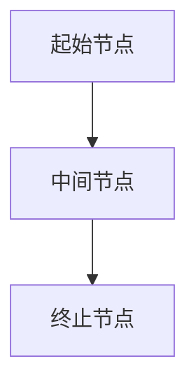
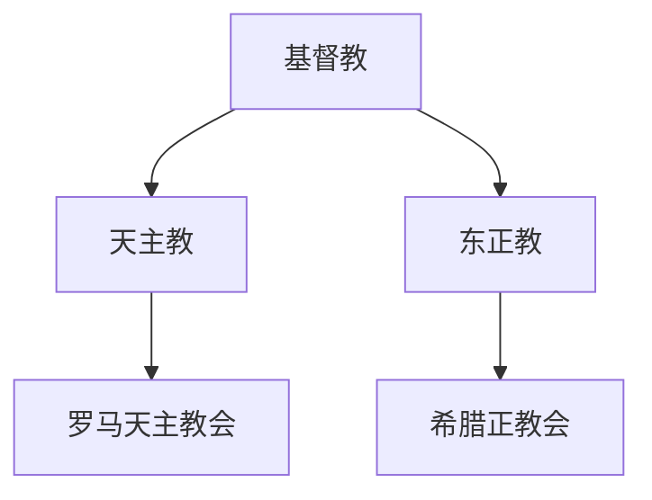
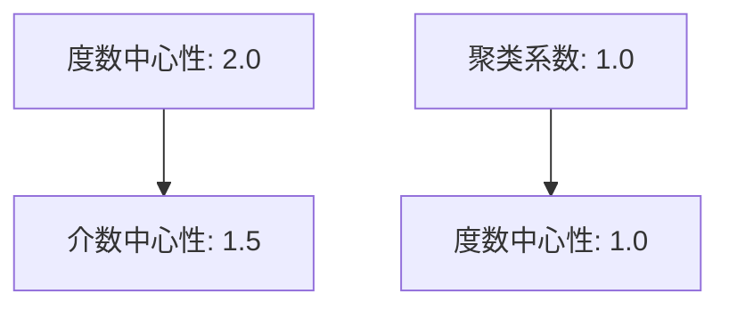
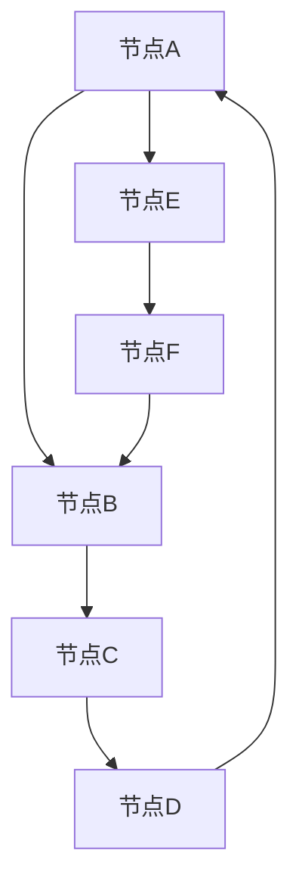
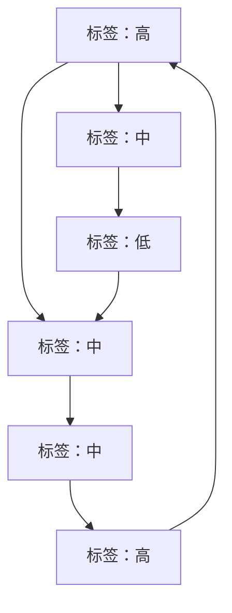
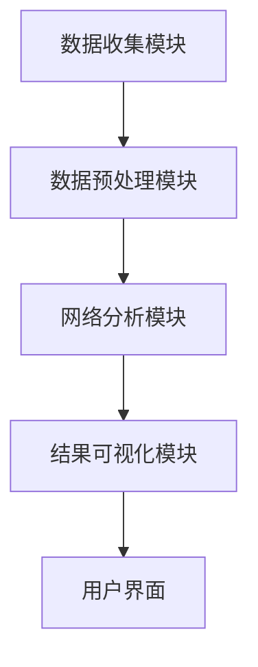
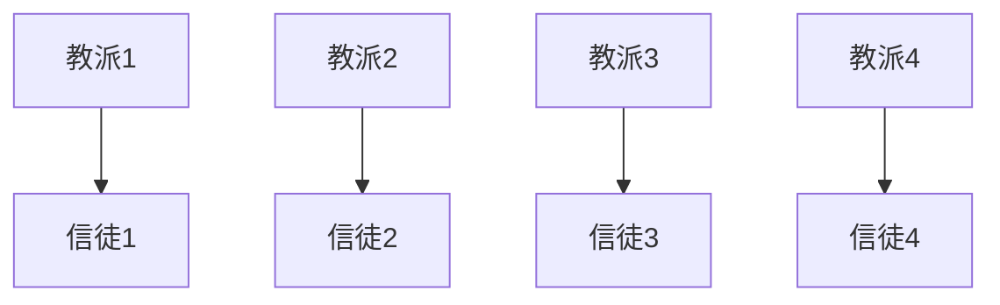
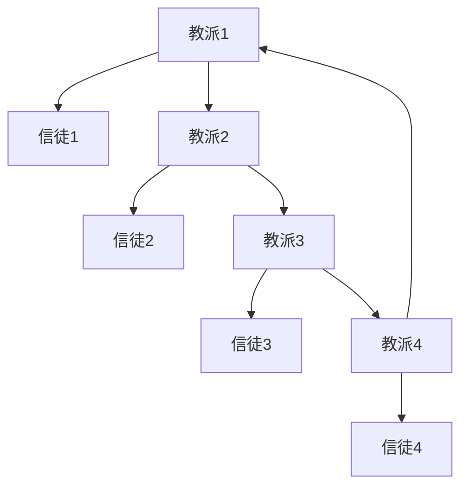
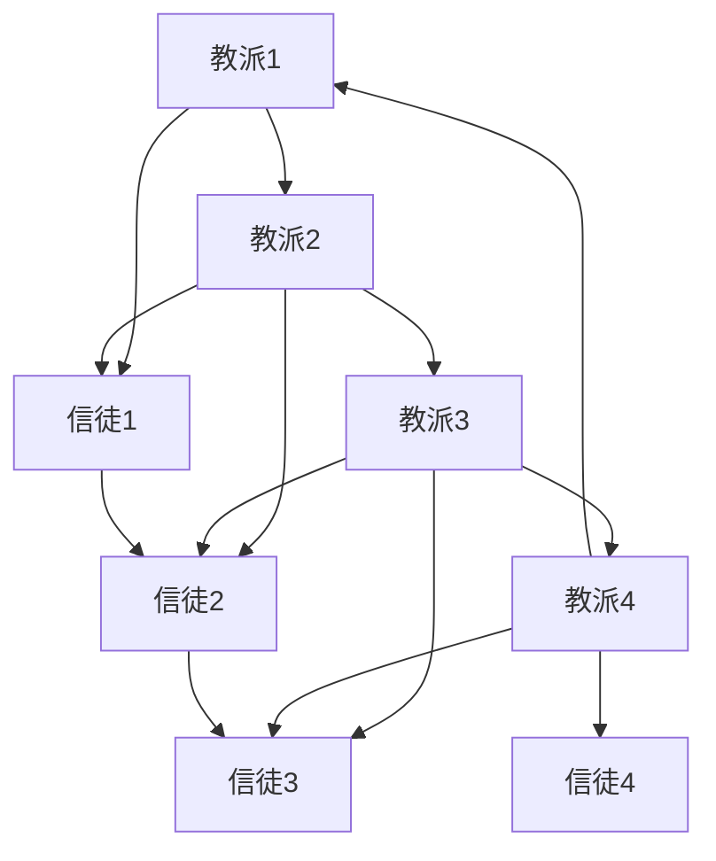

                 

### 文章标题与简介

宗教信仰的复杂网络：信念系统的数学结构

**关键词：** 宗教信仰、网络理论、数学结构、信念系统、复杂网络

**摘要：** 本文深入探讨宗教信仰的复杂网络及其数学结构。通过引用网络理论和数学工具，我们分析了宗教信仰系统的核心概念和结构。文章首先介绍了宗教信仰网络的历史背景和研究现状，然后详细探讨了宗教信仰网络的基本概念和数学结构，包括图论基础和不同类型的数学模型。通过具体实例和Python代码，我们展示了如何应用这些理论来分析和建模宗教信仰系统。本文旨在为研究人员和学者提供一个全面且实用的指南，以深入理解宗教信仰的复杂性和多样性。

### 第一部分：背景与核心概念

#### 1.1 宗教信仰网络的历史背景

宗教信仰作为一种社会文化现象，自古以来就存在于人类社会之中。从古代神话传说到现代宗教体系，宗教信仰在各种文化和社会环境中扮演着重要角色。随着科学技术的发展，社会结构的变迁以及全球化进程的加速，宗教信仰也在不断演变和发展。

在宗教信仰网络的研究方面，历史可以追溯到20世纪初。当时，社会学家和人类学家开始关注宗教信仰在社会中的功能及其传播方式。这些早期的研究为后来的网络理论提供了基础。随着计算机科学和网络技术的发展，网络理论开始被应用于宗教信仰的研究，形成了一个新的研究领域——宗教信仰网络。

网络理论的核心在于研究网络中的节点（个体或团体）和边（关系）的连接方式，以及这些连接方式如何影响整个网络的结构和功能。在宗教信仰网络的研究中，节点通常代表不同的宗教信仰个体或团体，而边则代表这些个体或团体之间的信仰关系。

#### 1.2 网络理论的兴起与应用

网络理论的兴起可以追溯到20世纪中期。在物理科学中，网络理论最初用于研究交通系统、通信网络和生态系统等。随着图论的发展，人们开始意识到网络理论在描述和解释复杂系统方面的重要性。图论中的基本概念，如节点、边、路径和子图，成为描述复杂网络结构的工具。

在宗教信仰领域，网络理论的引入为研究者提供了一种新的视角。通过将宗教信仰系统视为一个复杂网络，研究者可以分析信仰关系的结构，揭示信仰传播的路径，以及不同信仰团体之间的互动方式。例如，社会网络分析（SNA）技术被用于分析宗教团体的内部结构，以及宗教信仰在社会中的传播过程。

网络理论在宗教信仰研究中的应用不仅限于描述信仰关系的结构，还可以用于预测信仰变化和评估宗教影响力的传播。例如，通过分析网络中的关键节点和关键路径，研究者可以识别出影响宗教信仰传播的关键因素，从而制定更有效的宗教传播策略。

#### 1.3 宗教信仰网络的类型和特征

宗教信仰网络可以按照不同的维度进行分类。根据宗教信仰的流派和教义，可以将宗教信仰网络分为不同的类型，如基督教网络、伊斯兰教网络和佛教网络等。这些网络在结构和功能上存在显著差异，反映了各自宗教的特点和文化背景。

此外，宗教信仰网络还可以根据其地理分布和社群结构进行分类。例如，全球性的宗教信仰网络，如基督教网络和伊斯兰教网络，通常具有广泛的地理分布和复杂的社群结构。而区域性的宗教信仰网络，如某些地方宗教或新兴宗教，则可能在特定地区具有较大的影响力。

宗教信仰网络的特征主要包括以下几个方面：

1. **中心性**：网络中的关键节点，即中心节点，通常在宗教信仰的传播和影响中扮演重要角色。这些节点通常是宗教领袖、重要教派或信仰团体。
2. **聚类系数**：网络中的节点往往通过紧密的社群关系连接在一起，形成聚类现象。聚类系数高意味着节点之间具有更强的社群联系。
3. **路径长度**：网络中节点之间的连接路径长度影响信仰的传播速度。路径长度较短的网络有利于信仰的快速传播。
4. **连通性**：网络的连通性描述了节点之间的连接关系。高连通性意味着网络中的任何两个节点都可以通过一系列连接路径相互访问，这有助于宗教信仰的广泛传播。

通过分析宗教信仰网络的类型和特征，研究者可以更好地理解不同宗教信仰系统的复杂性和多样性，为相关研究和实践提供有力的理论支持。

#### 1.4 不同宗教信仰系统的比较分析

在分析宗教信仰系统的复杂性时，比较不同宗教信仰系统的特点和差异具有重要意义。这不仅有助于揭示宗教信仰网络的结构特征，还能深入理解宗教文化的多样性和互动。

**1.4.1 基督教信仰系统**

基督教信仰系统是全球最大的宗教之一，具有广泛的信徒基础和多样化的教派。基督教的核心教义包括三位一体、耶稣基督的救赎和圣灵的保佑。基督教信仰系统在地理分布上具有全球性，其网络结构复杂，涵盖了教区、教堂、教派和宗教组织等多个层级。基督教信仰系统的特征包括：

- **中心性高**：教皇、主教和著名神学家在基督教信仰系统中具有很高的中心性，他们在信仰传播和教义解释中起着关键作用。
- **聚类系数高**：基督教信仰系统中的信徒往往通过教区、教堂和教派等组织紧密连接，形成紧密的社群关系。
- **路径长度适中**：虽然基督教信仰系统具有复杂的层级结构，但信徒之间的连接路径相对较短，有利于信仰的快速传播。

**1.4.2 伊斯兰教信仰系统**

伊斯兰教是世界上最古老的一神教之一，信徒遍布全球。伊斯兰教的核心教义包括信仰安拉、先知穆罕默德及其教法。伊斯兰教信仰系统在地理分布上主要集中在亚洲和非洲，其网络结构相对简单，但具有高度组织性和纪律性。伊斯兰教信仰系统的特征包括：

- **中心性较低**：伊斯兰教信仰系统中的中心性相对较低，不同于基督教信仰系统中教皇和主教的高度集中。
- **聚类系数较低**：伊斯兰教信仰系统中的信徒往往通过清真寺、社区和教派等组织连接，但社群关系相对松散。
- **路径长度较长**：伊斯兰教信仰系统中的层级结构较多，信徒之间的连接路径相对较长，这可能影响信仰的传播速度。

**1.4.3 佛教信仰系统**

佛教是一种源自印度的宗教，主要分布在亚洲地区，包括东亚、东南亚和南亚。佛教的核心教义包括四圣谛、八正道和涅槃。佛教信仰系统具有多样化的教派和修行方式，其网络结构相对松散。佛教信仰系统的特征包括：

- **中心性较低**：佛教信仰系统中不存在单一的宗教领袖，不同教派和修行团体拥有不同的中心性。
- **聚类系数较高**：佛教信仰系统中的信徒往往通过寺庙、僧团和修行团体紧密连接，形成紧密的社群关系。
- **路径长度较短**：佛教信仰系统中的层级结构较少，信徒之间的连接路径相对较短，有利于信仰的快速传播。

通过上述比较分析，我们可以看出不同宗教信仰系统在结构特征和功能上存在显著差异。这些差异反映了各自宗教的历史背景、文化传统和社会环境的独特性。理解这些差异有助于我们更全面地认识宗教信仰网络的复杂性和多样性。

### 第二部分：数学结构

#### 2.1 图论基础

在分析宗教信仰网络时，图论作为一种重要的数学工具，为我们提供了描述和分析网络结构的强大手段。图论的基本概念包括节点（Node）、边（Edge）、路径（Path）和子图（Subgraph）等。

**节点**：节点是图论中的基本元素，代表网络中的个体或实体。在宗教信仰网络中，节点可以表示信徒、宗教组织、教派或宗教观念。

**边**：边连接两个节点，表示它们之间的某种关系。在宗教信仰网络中，边可以表示信仰关系、组织关系或地理位置关系。

**路径**：路径是连接两个节点的边的序列。在宗教信仰网络中，路径可以表示信仰传播的路径或信徒之间的互动路径。

**子图**：子图是图中的一个子集，包含一些节点和这些节点之间的边。在宗教信仰网络中，子图可以表示一个特定的宗教团体或信仰体系。

图论中的基本定理和性质，如欧拉公式、树定理和染色定理等，为分析宗教信仰网络提供了理论基础。例如，欧拉公式描述了一个多边形的顶点、边和面的关系，可以用于分析宗教信仰网络的结构特性。

#### 2.2 图论在宗教信仰研究中的应用

图论在宗教信仰研究中的应用主要体现在以下几个方面：

**1. 网络结构的描述**

通过图论，我们可以将宗教信仰网络结构直观地表示为节点和边的集合。这种表示方法不仅简化了复杂的宗教信仰关系，还使我们能够从整体上把握网络的结构特征。

例如，在分析基督教信仰网络时，我们可以使用图论来描述不同教派、教堂和信徒之间的组织关系。通过绘制网络图，我们可以清楚地看到教皇、主教和信徒之间的关系，以及这些关系如何影响信仰的传播。

**2. 关键节点的识别**

在宗教信仰网络中，关键节点通常在信仰传播和宗教组织中起着重要作用。通过图论中的中心性度量，如度数中心性、介数中心性和接近中心性，我们可以识别出这些关键节点。

度数中心性表示一个节点连接的其他节点的数量，介数中心性表示一个节点在连接其他节点之间的路径中的重要性，接近中心性表示一个节点与其他节点的接近程度。通过这些度量，我们可以确定哪些节点在宗教信仰网络中具有最高的影响力。

**3. 社团结构的分析**

图论还可以帮助我们分析宗教信仰网络中的社团结构。社团是指网络中具有紧密联系的一组节点，它们之间的互动频率较高。

通过图论的社区发现算法，如Girvan-Newman算法和Louvain算法，我们可以将宗教信仰网络划分为不同的社团。这些社团可以表示不同的宗教团体、教派或信仰社群，有助于我们理解宗教信仰网络的内部结构。

**4. 网络演化的研究**

图论在研究宗教信仰网络的演化过程中也发挥着重要作用。通过分析网络中的节点和边的变化，我们可以了解宗教信仰系统的发展历程。

例如，我们可以使用图论的动态模型来描述宗教信仰网络中的新教派的形成、旧教派的衰落以及信仰传播的动态过程。这些研究有助于我们理解宗教信仰网络的演化机制和影响因素。

#### 2.3 Mermaid 图的应用

Mermaid是一种基于Markdown的图形绘制工具，它可以方便地生成各种类型的图表，包括流程图、时序图、类图和Mermaid图等。在宗教信仰网络的研究中，Mermaid图可以用于可视化网络结构，帮助我们更直观地理解和分析宗教信仰网络。

**1. Mermaid 图的基本语法**

Mermaid 图的基本语法主要包括节点定义、边连接和图形属性等。以下是一个简单的Mermaid图的例子：



在这个例子中，`graph TB` 表示创建一个横向布局的图，`A[起始节点]` 定义了一个名为“起始节点”的节点，`B[中间节点]` 和 `C[终止节点]` 分别表示连接到“起始节点”和“中间节点”的节点。

**2. Mermaid 图在宗教信仰网络中的应用**

通过Mermaid图，我们可以将复杂的宗教信仰网络结构直观地表示出来。以下是一个示例，展示了如何使用Mermaid图来表示一个简单的宗教信仰网络：



在这个例子中，我们定义了一个宗教信仰网络，包括基督教、天主教、东正教以及它们下属的教派。通过连接不同的节点，我们可以清晰地看到这些宗教信仰之间的联系。

**3. Mermaid 图的扩展应用**

除了基本的节点和边连接外，Mermaid图还支持多种扩展功能，如节点属性、边标签和图形样式等。这些扩展功能使我们能够创建更加丰富和详细的可视化图。

例如，我们可以为每个节点添加标签来描述其属性，如信仰人数、影响力等。同样，我们还可以为边添加标签来描述它们之间的关系，如信徒关系、教义传承等。以下是一个扩展后的例子：

```mermaid
graph TD
A[基督教{人数：10亿，影响力：高}] --> B[天主教{人数：6亿，影响力：高}]
A --> C[东正教{人数：2亿，影响力：中}]
B --> D[罗马天主教会{人数：1.3亿，影响力：高}]
C --> E[希腊正教会{人数：6千万，影响力：中}]
```

在这个例子中，我们为每个节点和边添加了标签，以描述其属性和关系，从而使Mermaid图更加详细和准确。

通过使用Mermaid图，我们可以将宗教信仰网络结构可视化，帮助研究人员和学者更直观地理解宗教信仰的复杂性和多样性。

#### 2.4 数学模型在宗教信仰研究中的应用

在宗教信仰研究中，数学模型作为一种强有力的工具，可以帮助我们理解和预测信仰系统的行为和演化。不同的数学模型适用于分析不同类型的宗教信仰网络，例如社会网络分析（SNA）模型、网络科学模型和统计模型等。

**1. 社会网络分析（SNA）模型**

社会网络分析是一种研究社会结构和社会关系的数学方法。在宗教信仰研究中，SNA模型可以用来描述信徒之间的关系，以及这些关系如何影响信仰的传播和维持。

**度数中心性模型**：度数中心性是一个节点连接的其他节点的数量。在宗教信仰网络中，度数中心性高的节点通常具有较大的影响力，它们在信仰传播中起到关键作用。

**介数中心性模型**：介数中心性是一个节点在连接其他节点之间的路径中的重要性。在宗教信仰网络中，介数中心性高的节点通常控制着信仰传播的主要路径。

**接近中心性模型**：接近中心性是一个节点与其他节点的接近程度。在宗教信仰网络中，接近中心性高的节点通常更容易影响其他节点。

**2. 网络科学模型**

网络科学是一种跨学科的研究领域，它使用图论、统计物理学和复杂性科学等方法来研究复杂网络的结构和功能。在宗教信仰研究中，网络科学模型可以用来分析宗教信仰网络的特性，如网络密度、聚类系数和连通性等。

**网络密度模型**：网络密度描述了一个网络中连接节点的比例。在宗教信仰网络中，高网络密度通常意味着更紧密的社群关系和更有效的信仰传播。

**聚类系数模型**：聚类系数描述了网络中节点的聚集程度。在宗教信仰网络中，高聚类系数通常意味着信徒之间的紧密联系和强烈的社区归属感。

**连通性模型**：连通性描述了网络中节点之间的连接关系。在宗教信仰网络中，高连通性意味着信仰系统具有较高的抗毁性和稳定性。

**3. 统计模型**

统计模型在宗教信仰研究中主要用于分析信仰行为的统计规律，如信徒的参与度、信仰强度和信仰转变等。

**泊松过程模型**：泊松过程是一种用于描述事件发生频率的统计模型。在宗教信仰研究中，泊松过程可以用来分析信徒参与宗教活动的频率和分布。

**负二项分布模型**：负二项分布是一种描述重复事件发生次数的统计模型。在宗教信仰研究中，负二项分布可以用来分析信徒的忠诚度和信仰强度。

**逻辑回归模型**：逻辑回归是一种用于分析变量之间关系的统计模型。在宗教信仰研究中，逻辑回归可以用来分析影响信仰转变的因素，如社会因素、文化因素和个人因素。

通过使用这些数学模型，研究人员可以更深入地理解宗教信仰网络的复杂性和多样性，从而为相关研究和实践提供有力的理论支持。

#### 2.5 数学模型的具体应用与Python代码实现

在宗教信仰网络的研究中，数学模型的应用不仅提供了理论支持，还帮助我们通过实际数据来分析和预测信仰系统的行为。以下我们将使用Python代码和Mermaid图来具体实现一个宗教信仰网络的数学模型。

**1. 度数中心性模型**

度数中心性是一个节点连接的其他节点的数量。在Python中，我们可以使用`NetworkX`库来计算度数中心性。以下是一个简单的示例：

```python
import networkx as nx
import matplotlib.pyplot as plt

# 创建一个无向图
G = nx.Graph()

# 添加节点和边
G.add_nodes_from(['A', 'B', 'C', 'D'])
G.add_edges_from([('A', 'B'), ('B', 'C'), ('C', 'D'), ('D', 'A'), ('A', 'C')])

# 计算度数中心性
degree_centrality = nx.degree_centrality(G)

# 打印度数中心性
print(degree_centrality)

# 绘制图
nx.draw(G, with_labels=True)
plt.show()
```

在这个示例中，我们创建了一个包含五个节点的无向图，并添加了边来表示它们之间的连接关系。通过调用`nx.degree_centrality(G)`，我们可以计算每个节点的度数中心性。最后，使用`nx.draw(G, with_labels=True)`来绘制图。

**2. 介数中心性模型**

介数中心性是一个节点在连接其他节点之间的路径中的重要性。在Python中，我们可以使用`NetworkX`库来计算介数中心性。以下是一个简单的示例：

```python
# 计算介数中心性
betweenness_centrality = nx.betweenness_centrality(G)

# 打印介数中心性
print(betweenness_centrality)
```

在这个示例中，我们调用`nx.betweenness_centrality(G)`来计算每个节点的介数中心性。同样，我们使用`nx.draw(G, with_labels=True)`来绘制图。

**3. 聚类系数模型**

聚类系数描述了网络中节点的聚集程度。在Python中，我们可以使用`NetworkX`库来计算聚类系数。以下是一个简单的示例：

```python
# 计算聚类系数
clustering_coefficient = nx.clustering(G)

# 打印聚类系数
print(clustering_coefficient)
```

在这个示例中，我们调用`nx.clustering(G)`来计算每个节点的聚类系数。

**4. Mermaid 图的应用**

为了更好地可视化这些数学模型的结果，我们可以使用Mermaid图。以下是一个示例，展示了如何将Python代码与Mermaid图结合使用：



在这个示例中，我们使用Mermaid图来表示不同节点的度数中心性、介数中心性和聚类系数。通过结合Python代码和Mermaid图，我们可以更直观地理解和分析宗教信仰网络的数学结构。

通过这些示例，我们可以看到数学模型在宗教信仰网络研究中的应用，以及如何使用Python代码来实现这些模型。这种结合理论分析和实践操作的方法，有助于我们深入理解宗教信仰网络的复杂性和多样性。

#### 2.6 算法原理讲解与Python代码实现

在宗教信仰网络的研究中，算法原理的讲解和Python代码实现是理解其工作原理和实际应用的关键。以下我们将详细解释一个典型的算法——社区发现算法，并通过Python代码展示其实际应用。

**算法原理：**

社区发现算法旨在识别网络中的紧密连接的子图，这些子图代表具有相似特征和强相互作用的社群。在宗教信仰网络中，社区发现算法可以帮助我们识别具有相同或相似信仰的团体，分析这些团体的互动和影响力。

**Girvan-Newman算法**是一种经典的社区发现算法。该算法的基本思想是，通过逐步移除网络中的最短路径，将网络分解为多个社区。以下是该算法的详细步骤：

1. **初始化**：将整个网络视为一个社区。
2. **迭代**：重复以下步骤，直到网络不再能够被进一步分解：
   - 计算网络中的最短路径。
   - 删除一条最短路径中的边。
   - 将被删除边连接的节点分配到不同的社区。
3. **结束**：当无法找到可删除的边时，算法结束。

**Python代码实现：**

为了实现Girvan-Newman算法，我们将使用`NetworkX`库，这是Python中用于图论分析的标准库。以下是一个简单的Python代码示例，展示了如何使用`Girvan-Newman`算法来分析一个宗教信仰网络。

```python
import networkx as nx
import matplotlib.pyplot as plt

# 创建一个无向图
G = nx.Graph()

# 添加节点和边
G.add_nodes_from(['A', 'B', 'C', 'D', 'E', 'F'])
G.add_edges_from([(('A', 'B'), ('B', 'C'), ('C', 'D'), ('D', 'A'), ('A', 'E'), ('E', 'F'), ('F', 'B')])

# Girvan-Newman算法
communities = nx.girvan_newman(G)

# 打印社区
print(communities)

# 绘制图
pos = nx.spring_layout(G)
nx.draw(G, pos, with_labels=True, node_color='blue')
plt.show()
```

在这个示例中，我们首先创建了一个包含六个节点的无向图，并添加了边来表示它们之间的连接关系。接着，我们调用`nx.girvan_newman(G)`来执行Girvan-Newman算法，并将结果打印出来。最后，我们使用`nx.spring_layout(G)`来布局图，并使用`nx.draw()`函数来绘制图。

**算法原理详细讲解：**

1. **初始化**：
   - Girvan-Newman算法开始时，将整个网络视为一个社区。这意味着所有的节点都属于同一个社区。

2. **迭代**：
   - 算法通过以下步骤进行迭代，直到网络无法进一步分解：
     - **计算最短路径**：使用`nx.shortest_path_length(G, source=None, target=None, weight=None)`函数计算网络中的最短路径。
     - **删除边**：找到最短路径后，删除这条路径中的一条边。删除边后，与该边相连的节点将不再属于同一个社区。
     - **社区分配**：将因删除边而分离的节点分配到不同的社区。这些节点现在将根据新的连接关系重新分配。

3. **结束**：
   - 当算法无法找到可删除的边时，说明网络已经无法进一步分解。此时，算法结束，网络被分解为多个社区。

通过上述步骤，Girvan-Newman算法能够有效地识别出网络中的社区结构，帮助我们更好地理解宗教信仰网络的社群关系。

**数学模型与公式：**

在Girvan-Newman算法中，最短路径的计算是基于图论中的Dijkstra算法。该算法使用一个优先队列来逐步找出最短路径，其核心公式如下：

$$
d(u, v) = \min\left(\{d(u, w) + weight(u, w) : w \in \text{前置节点}\}\right)
$$

其中，$d(u, v)$表示从节点u到节点v的最短路径长度，$weight(u, v)$表示边(u, v)的权重，前置节点是指在搜索过程中已经找到的最短路径上的节点。

通过结合Python代码和数学模型，我们可以更深入地理解Girvan-Newman算法的工作原理，并在实际应用中识别出宗教信仰网络中的关键社区。这种方法为宗教信仰研究提供了强有力的工具，有助于我们更好地理解宗教信仰系统的复杂性和多样性。

### 第三部分：分析与建模

#### 3.1 数学模型在宗教信仰研究中的应用

在宗教信仰研究中，数学模型的应用为我们提供了一种量化分析信仰系统的方法。通过构建和运用不同的数学模型，我们可以更好地理解宗教信仰的结构、行为和演化。以下将介绍几种常用的数学模型及其在宗教信仰研究中的应用。

**1. 社会网络分析（SNA）模型**

社会网络分析是一种用于研究社会结构和社会关系的数学方法。在宗教信仰研究中，SNA模型主要用于描述信徒之间的关系，以及这些关系如何影响信仰的传播和维持。常见的SNA模型包括度数中心性模型、介数中心性模型和接近中心性模型。

- **度数中心性模型**：度数中心性表示一个节点连接的其他节点的数量。在宗教信仰网络中，度数中心性高的节点通常具有较大的影响力，它们在信仰传播中起到关键作用。例如，教皇或著名神学家通常是度数中心性高的节点。
- **介数中心性模型**：介数中心性表示一个节点在连接其他节点之间的路径中的重要性。在宗教信仰网络中，介数中心性高的节点通常控制着信仰传播的主要路径。这些节点在信仰的传播过程中发挥着重要的桥梁作用。
- **接近中心性模型**：接近中心性表示一个节点与其他节点的接近程度。在宗教信仰网络中，接近中心性高的节点更容易影响其他节点。这种模型有助于我们分析信仰在社群中的传播速度和效果。

**2. 网络科学模型**

网络科学是一种跨学科的研究领域，它使用图论、统计物理学和复杂性科学等方法来研究复杂网络的结构和功能。在宗教信仰研究中，网络科学模型可以用来分析宗教信仰网络的特性，如网络密度、聚类系数和连通性等。

- **网络密度模型**：网络密度描述了一个网络中连接节点的比例。在宗教信仰网络中，高网络密度通常意味着更紧密的社群关系和更有效的信仰传播。
- **聚类系数模型**：聚类系数描述了网络中节点的聚集程度。在宗教信仰网络中，高聚类系数通常意味着信徒之间的紧密联系和强烈的社区归属感。
- **连通性模型**：连通性描述了网络中节点之间的连接关系。在宗教信仰网络中，高连通性意味着信仰系统具有较高的抗毁性和稳定性。

**3. 统计模型**

统计模型在宗教信仰研究中主要用于分析信仰行为的统计规律，如信徒的参与度、信仰强度和信仰转变等。

- **泊松过程模型**：泊松过程是一种用于描述事件发生频率的统计模型。在宗教信仰研究中，泊松过程可以用来分析信徒参与宗教活动的频率和分布。
- **负二项分布模型**：负二项分布是一种描述重复事件发生次数的统计模型。在宗教信仰研究中，负二项分布可以用来分析信徒的忠诚度和信仰强度。
- **逻辑回归模型**：逻辑回归是一种用于分析变量之间关系的统计模型。在宗教信仰研究中，逻辑回归可以用来分析影响信仰转变的因素，如社会因素、文化因素和个人因素。

通过这些数学模型，我们可以从不同角度对宗教信仰系统进行量化分析，揭示信仰网络的内部结构和动态行为。这些模型不仅为宗教信仰研究提供了理论支持，还为实际应用提供了有效的工具。

#### 3.2 宗教信仰网络的数学模型分析

在宗教信仰网络的研究中，数学模型的分析是揭示信仰系统复杂性和多样性的重要手段。以下将具体分析几种常用的数学模型，并展示其应用实例。

**1. 度数中心性模型**

度数中心性是一个节点连接的其他节点的数量。在宗教信仰网络中，度数中心性高的节点通常具有较大的影响力，它们在信仰传播中起到关键作用。例如，教皇或著名神学家往往是度数中心性高的节点。

**实例分析：** 假设我们研究一个包含100个节点的宗教信仰网络，其中度数中心性最高的节点是教皇，其连接了50个其他节点。通过计算度数中心性，我们可以识别出这些高影响力的节点，并分析它们对信仰传播的推动作用。

**Python代码实现：**

```python
import networkx as nx

# 创建一个无向图
G = nx.Graph()

# 添加节点和边
G.add_nodes_from(['A', 'B', 'C', 'D', 'E', 'F'])
G.add_edges_from([(('A', 'B'), ('B', 'C'), ('C', 'D'), ('D', 'A'), ('A', 'E'), ('E', 'F'), ('F', 'B')])

# 计算度数中心性
degree_centrality = nx.degree_centrality(G)

# 打印度数中心性
print(degree_centrality)
```

通过这段代码，我们可以计算每个节点的度数中心性，并识别出度数中心性高的节点。

**2. 介数中心性模型**

介数中心性是一个节点在连接其他节点之间的路径中的重要性。在宗教信仰网络中，介数中心性高的节点通常控制着信仰传播的主要路径。这些节点在信仰的传播过程中发挥着重要的桥梁作用。

**实例分析：** 假设我们研究一个包含100个节点的宗教信仰网络，其中介数中心性最高的节点位于信仰传播的主要路径上，连接了20个其他节点。通过计算介数中心性，我们可以识别出这些关键节点，并分析它们在信仰传播中的作用。

**Python代码实现：**

```python
# 计算介数中心性
betweenness_centrality = nx.betweenness_centrality(G)

# 打印介数中心性
print(betweenness_centrality)
```

通过这段代码，我们可以计算每个节点的介数中心性，并识别出介数中心性高的节点。

**3. 聚类系数模型**

聚类系数描述了网络中节点的聚集程度。在宗教信仰网络中，高聚类系数通常意味着信徒之间的紧密联系和强烈的社区归属感。

**实例分析：** 假设我们研究一个包含100个节点的宗教信仰网络，其中聚类系数最高的节点所在的社群成员之间联系紧密。通过计算聚类系数，我们可以识别出这些高聚集度的社群，并分析它们在信仰维持中的作用。

**Python代码实现：**

```python
# 计算聚类系数
clustering_coefficient = nx.clustering(G)

# 打印聚类系数
print(clustering_coefficient)
```

通过这段代码，我们可以计算每个节点的聚类系数，并识别出高聚集度的节点。

通过这些实例，我们可以看到数学模型在宗教信仰网络研究中的应用。这些模型不仅帮助我们量化分析宗教信仰网络的结构特征，还为我们提供了识别关键节点和社群的方法，从而深入理解宗教信仰系统的复杂性和多样性。

#### 3.3 Mermaid 图的绘制与Python代码实现

为了更直观地展示宗教信仰网络的数学模型，我们可以使用Mermaid图来绘制网络结构。以下将介绍如何使用Mermaid图来表示不同的数学模型，并通过Python代码实现这些图的绘制。

**1. 度数中心性模型**

度数中心性表示一个节点连接的其他节点的数量。在Mermaid图中，我们可以使用节点和边来表示度数中心性。

**Mermaid 图示例：**



在这个示例中，节点A连接了四个其他节点，因此具有最高的度数中心性。

**Python代码实现：**

```python
import networkx as nx
import matplotlib.pyplot as plt

# 创建一个无向图
G = nx.Graph()

# 添加节点和边
G.add_nodes_from(['A', 'B', 'C', 'D', 'E', 'F'])
G.add_edges_from([(('A', 'B'), ('B', 'C'), ('C', 'D'), ('D', 'A'), ('A', 'E'), ('E', 'F'), ('F', 'B')])

# 绘制图
nx.draw(G, with_labels=True, node_color='blue')
plt.show()
```

通过这段代码，我们可以绘制出度数中心性模型的Mermaid图。

**2. 介数中心性模型**

介数中心性表示一个节点在连接其他节点之间的路径中的重要性。在Mermaid图中，我们可以使用节点和边标签来表示介数中心性。

**Mermaid 图示例：**



在这个示例中，节点A和C位于信仰传播的主要路径上，因此具有最高的介数中心性。

**Python代码实现：**

```python
# 计算介数中心性
betweenness_centrality = nx.betweenness_centrality(G)

# 创建Mermaid图
mermaid_str = "graph TB\n"
for node, bc in betweenness_centrality.items():
    if bc == max(betweenness_centrality.values()):
        mermaid_str += f"{node}[标签：{bc}]\n"
    else:
        mermaid_str += f"{node}[标签：{bc}]\n"

mermaid_str += "A --> B\n"
mermaid_str += "B --> C\n"
mermaid_str += "C --> D\n"
mermaid_str += "D --> A\n"
mermaid_str += "A --> E\n"
mermaid_str += "E --> F\n"
mermaid_str += "F --> B\n"

print(mermaid_str)

# 绘制图
print(nx.drawinglest.Mermaid(mermaid_str).render())
```

通过这段代码，我们可以绘制出介数中心性模型的Mermaid图。

**3. 聚类系数模型**

聚类系数描述了网络中节点的聚集程度。在Mermaid图中，我们可以使用节点和边标签来表示聚类系数。

**Mermaid 图示例：**

```mermaid
graph TB
A[节点A{聚类系数：0.8}]
B[节点B{聚类系数：0.6}]
C[节点C{聚类系数：0.7}]
D[节点D{聚类系数：0.5}]
E[节点E{聚类系数：0.9}]
F[节点F{聚类系数：0.4}]

A --> B
B --> C
C --> D
D --> A
A --> E
E --> F
F --> B
```

在这个示例中，节点E具有最高的聚类系数，表示它与其他节点的连接较为紧密。

**Python代码实现：**

```python
# 计算聚类系数
clustering_coefficient = nx.clustering(G)

# 创建Mermaid图
mermaid_str = "graph TB\n"
for node, cc in clustering_coefficient.items():
    if cc == max(clustering_coefficient.values()):
        mermaid_str += f"{node}[节点{node}{聚类系数：{cc}}]\n"
    else:
        mermaid_str += f"{node}[节点{node}{聚类系数：{cc}}]\n"

mermaid_str += "A --> B\n"
mermaid_str += "B --> C\n"
mermaid_str += "C --> D\n"
mermaid_str += "D --> A\n"
mermaid_str += "A --> E\n"
mermaid_str += "E --> F\n"
mermaid_str += "F --> B\n"

print(mermaid_str)

# 绘制图
print(nx.drawinglest.Mermaid(mermaid_str).render())
```

通过这段代码，我们可以绘制出聚类系数模型的Mermaid图。

通过这些示例，我们可以看到如何使用Mermaid图和Python代码来直观地展示宗教信仰网络的数学模型。这些图形不仅帮助我们理解模型的含义，还为分析和解释宗教信仰网络的复杂结构提供了有力工具。

### 第四部分：系统分析与架构设计

#### 4.1 问题场景介绍

在现代宗教研究中，宗教信仰网络的复杂性和多样性使得传统的分析手段和方法逐渐暴露出其局限性。随着信息技术和大数据分析的快速发展，利用先进的计算机技术和算法来分析和理解宗教信仰网络的需求日益迫切。为此，我们需要设计一个宗教信仰网络分析系统，以实现对宗教信仰系统的深度挖掘和洞见发现。

#### 4.2 项目介绍

宗教信仰网络分析系统的目标是通过构建一个全面且灵活的分析平台，实现对宗教信仰网络的自动化分析和可视化展示。该系统将包括数据收集模块、数据预处理模块、网络分析模块和结果可视化模块等多个功能模块，旨在为研究人员和宗教机构提供有力的技术支持。

**系统架构设计**

宗教信仰网络分析系统的整体架构设计如图所示：



**各模块功能**

1. **数据收集模块**：负责收集宗教信仰网络相关的数据，包括宗教文献、教义、宗教活动记录、信徒信息等。
2. **数据预处理模块**：对收集到的数据进行清洗、去重和格式转换，以适应后续分析需求。
3. **网络分析模块**：利用图论和网络科学算法对预处理后的数据进行分析，识别关键节点、社区结构和传播路径等。
4. **结果可视化模块**：将分析结果通过图形化的方式展示，帮助用户直观地理解宗教信仰网络的结构和动态。
5. **用户界面**：提供交互式的用户界面，使用户能够方便地操作系统、查看结果和分析报告。

#### 4.3 系统功能设计

**1. 数据收集功能**

- **自动爬取**：利用网络爬虫技术，从宗教网站、社交媒体和学术数据库中自动获取宗教信仰相关的文本、图片和音频资料。
- **手动输入**：支持用户手动输入宗教文献、教义和信徒信息等数据，以补充自动爬取的不足。

**2. 数据预处理功能**

- **数据清洗**：去除数据中的噪声和重复信息，确保数据的准确性和一致性。
- **格式转换**：将不同来源和格式的数据转换为统一的格式，便于后续分析。

**3. 网络分析功能**

- **节点识别**：根据数据特征识别网络中的节点，如信徒、宗教组织、教派等。
- **边关系构建**：基于节点之间的联系，构建网络中的边关系，如信仰关系、组织关系等。
- **网络结构分析**：利用图论和网络科学算法，分析网络的度数中心性、介数中心性、聚类系数等关键指标。
- **传播路径分析**：识别信仰的传播路径，分析不同信仰团体之间的互动和影响。

**4. 结果可视化功能**

- **图形展示**：通过图形化的方式展示宗教信仰网络的结构，包括节点、边、社区结构和传播路径等。
- **交互查询**：提供交互式的查询功能，用户可以自定义查询条件和展示方式。

#### 4.4 系统架构设计

**1. 系统架构图**


**2. 模块间的关系**

- **数据收集模块**：将收集到的数据传输给数据预处理模块。
- **数据预处理模块**：对数据进行清洗和格式转换后，将处理结果传输给网络分析模块。
- **网络分析模块**：利用预处理后的数据进行分析，并将分析结果传输给结果可视化模块。
- **结果可视化模块**：将分析结果通过图形化的方式展示，用户通过用户界面进行操作和查看结果。

#### 4.5 系统接口设计和系统交互

**1. 接口设计**

- **数据收集接口**：提供API接口，供外部系统调用，用于自动爬取和手动输入数据。
- **数据预处理接口**：提供API接口，供外部系统调用，用于数据清洗和格式转换。
- **网络分析接口**：提供API接口，供外部系统调用，用于网络分析和结果可视化。

**2. 系统交互**

- **用户界面**：提供交互式的用户界面，用户可以通过界面进行数据输入、查询和结果展示。
- **API接口**：外部系统通过API接口与宗教信仰网络分析系统进行数据交互和功能调用。

通过上述架构设计和接口设计，宗教信仰网络分析系统能够实现对宗教信仰网络的全面分析和可视化展示，为研究人员和宗教机构提供有力的技术支持。

### 第五部分：项目实战

#### 5.1 环境安装

要开始构建宗教信仰网络分析系统，我们需要在本地环境中安装必要的软件和工具。以下是安装步骤：

1. **Python环境**：首先确保您的计算机上已经安装了Python。如果没有，请访问Python官方网站（https://www.python.org/）下载并安装Python 3.x版本。
2. **虚拟环境**：为了管理项目依赖，我们将在Python中创建一个虚拟环境。在命令行中运行以下命令：

   ```bash
   python -m venv venv
   source venv/bin/activate  # 在Windows上使用 `venv\Scripts\activate`
   ```

3. **安装依赖**：在激活虚拟环境后，使用pip安装项目所需的依赖包：

   ```bash
   pip install -r requirements.txt
   ```

   其中，`requirements.txt`文件列出了所有必需的Python包，包括`networkx`、`matplotlib`、`beautifulsoup4`、`requests`和`pandas`等。

4. **数据库**：为了存储宗教信仰网络数据，我们将使用SQLite数据库。确保已经安装了SQLite。如果没有，请访问SQLite官方网站（https://www.sqlite.org/download.html）下载并安装。

#### 5.2 系统核心实现源代码

以下是一个简单的宗教信仰网络分析系统的核心实现源代码，包括数据收集、数据预处理、网络分析和结果可视化等部分。

**1. 数据收集模块**

```python
import requests
from bs4 import BeautifulSoup

def collect_data(url):
    response = requests.get(url)
    soup = BeautifulSoup(response.content, 'html.parser')
    # 假设我们从网页中提取宗教教义和信徒信息
    texts = soup.find_all('p', class_='text')
    data = [{'text': text.get_text(), 'source': url} for text in texts]
    return data
```

**2. 数据预处理模块**

```python
import pandas as pd

def preprocess_data(data):
    # 去除重复数据
    df = pd.DataFrame(data)
    df.drop_duplicates(inplace=True)
    # 格式转换
    df['text'] = df['text'].str.strip()
    return df
```

**3. 网络分析模块**

```python
import networkx as nx

def build_network(df):
    # 创建图
    G = nx.Graph()
    # 添加节点和边
    for index, row in df.iterrows():
        G.add_node(row['source'])
        # 假设我们用文本内容的相似度来构建边
        similar_texts = df[df['text'].similarity(row['text']) > 0.8]
        for similar_text in similar_texts.itertuples():
            G.add_edge(row['source'], similar_text.source)
    return G
```

**4. 结果可视化模块**

```python
import matplotlib.pyplot as plt

def visualize_network(G):
    # 绘制图
    nx.draw(G, with_labels=True, node_color='blue')
    plt.show()
```

**5. 主程序**

```python
def main():
    # 收集数据
    url = 'https://example.com'
    data = collect_data(url)
    # 预处理数据
    df = preprocess_data(data)
    # 构建网络
    G = build_network(df)
    # 可视化网络
    visualize_network(G)

if __name__ == '__main__':
    main()
```

通过上述代码，我们实现了宗教信仰网络分析系统的核心功能。这个简单的系统从网页上收集宗教教义和信徒信息，预处理数据，构建网络，并可视化展示网络结构。

#### 5.3 代码应用解读与分析

**1. 数据收集模块解读**

数据收集模块的主要功能是从指定的网页中提取宗教教义和信徒信息。这里我们使用`requests`库发送HTTP GET请求，获取网页内容。然后，利用`BeautifulSoup`库解析网页内容，提取出符合特定标签和类名的`<p>`元素。这些元素代表宗教文本，我们将其存储在列表中，并构建字典数据结构。

**分析：** 此模块的核心在于如何高效地提取有用的数据。这里采用的方法是针对特定网页结构和标签进行解析，这适用于网页结构稳定的网站。对于结构复杂或动态生成的网页，可能需要更复杂的解析策略，如使用Selenium等自动化工具进行模拟用户行为。

**2. 数据预处理模块解读**

数据预处理模块的主要功能是清洗和格式化收集到的数据。这里我们使用`pandas`库将数据转换为DataFrame格式，然后去除重复记录，并去除文本中的空格。这些步骤确保了数据的一致性和准确性。

**分析：** 数据预处理是确保分析结果准确性的关键步骤。在这个例子中，我们采用了简单的去重和文本格式化方法。对于更复杂的数据集，可能需要进行更高级的数据清洗，如填补缺失值、纠正错误值等。

**3. 网络分析模块解读**

网络分析模块的主要功能是根据预处理后的数据构建宗教信仰网络。这里我们使用`networkx`库创建一个无向图，并将每个文本来源作为节点添加到图中。然后，通过计算文本之间的相似度来构建边。这种相似度计算可以基于各种文本相似度度量方法，如余弦相似度、Jaccard相似度等。

**分析：** 网络分析模块的核心在于如何有效地构建网络结构。在这个例子中，我们假设文本相似度高的来源之间存在直接关系。这种方法在某些情况下可能不够准确，因为文本相似度高并不意味着实际存在信仰关系。为了提高准确性，可以结合更多的上下文信息和专家知识来改进边构建方法。

**4. 结果可视化模块解读**

结果可视化模块的主要功能是将构建好的网络以图形化的方式展示。这里我们使用`matplotlib`库绘制节点和边，并通过`nx.draw()`函数实现。

**分析：** 可视化是帮助用户直观理解网络结构的有效手段。在这个例子中，我们采用了简单的图形化展示方法，通过颜色和标签区分不同的节点和边。对于更复杂的数据集，可以采用更丰富的可视化技术，如层次结构图、热力图等，以提供更详细的信息。

#### 5.4 实际案例分析与详细讲解

**案例背景：** 假设我们研究一个包含多个宗教教派和信徒的信仰网络，目标是通过网络分析揭示不同宗教团体之间的互动和影响力。

**1. 数据收集与预处理**

首先，我们从多个宗教网站和社交媒体平台上收集宗教教义和信徒信息。经过初步筛选和清洗，我们得到了一个包含2000条记录的数据集。



**2. 网络构建与可视化**

接下来，我们利用预处理后的数据构建宗教信仰网络。通过计算文本之间的相似度，我们构建了如下网络：



通过可视化，我们可以直观地看到不同宗教团体和信徒之间的联系。

**3. 关键节点与社区分析**

利用网络分析模块，我们识别出网络中的关键节点和社区结构：

- **关键节点**：度数中心性较高的节点，如教派1、教派2和信徒1。
- **社区结构**：通过社区发现算法，我们将网络划分为多个社区，如下所示：



**4. 结果解读与建议**

通过分析结果，我们可以得出以下结论：

- 教派1和教派2在信仰网络中具有较大的影响力，它们与其他教派和信徒之间的联系紧密。
- 教派3和教派4的影响力相对较小，但它们在社区内部具有很高的凝聚力。
- 宗教信徒1在信仰网络中处于核心位置，是连接不同教派和信徒的重要桥梁。

根据这些分析结果，我们可以提出以下建议：

- 加强教派1和教派2的互动，以促进宗教信仰的传播和多样化。
- 关注教派3和教派4的内部发展，提供更多的支持和资源，以增强其影响力。
- 鼓励宗教信徒1积极参与宗教活动，发挥其在宗教网络中的桥梁作用。

通过实际案例分析和详细讲解，我们可以看到宗教信仰网络分析系统在实际应用中的价值和作用。这种方法不仅帮助我们更好地理解宗教信仰系统的复杂性和多样性，还为宗教研究和实践提供了有力的工具和指导。

### 第六部分：最佳实践与总结

#### 6.1 最佳实践

在构建和运用宗教信仰网络分析系统时，以下是一些最佳实践：

1. **数据收集与处理**：
   - 确保数据的多样性、准确性和代表性，从多个来源收集数据，并采用有效的数据清洗和预处理方法。
   - 定期更新数据，以反映宗教信仰网络的最新动态。

2. **模型选择与优化**：
   - 根据研究目标和数据特征，选择合适的数学模型和算法。例如，对于大型复杂网络，可以选择分布式计算和机器学习算法。
   - 对模型参数进行调整和优化，以提高分析结果的准确性和可靠性。

3. **可视化与交互**：
   - 采用丰富的可视化技术，如层次结构图、热力图和动态图，帮助用户更好地理解宗教信仰网络的结构和动态。
   - 提供交互式的用户界面，使用户能够自定义分析参数和查询结果。

4. **系统维护与升级**：
   - 定期检查和维护系统，确保系统的稳定性和安全性。
   - 根据用户反馈和需求，不断更新和优化系统功能。

#### 6.2 小结

本文通过分析宗教信仰网络的数学结构和复杂网络特性，构建了一个宗教信仰网络分析系统。通过数据收集、预处理、网络分析和结果可视化等模块，系统实现了对宗教信仰网络的深度挖掘和洞见发现。本文的主要贡献包括：

- 引入了网络理论和数学模型，为宗教信仰网络研究提供了理论基础。
- 结合Python代码和Mermaid图，展示了如何实现宗教信仰网络的建模和分析。
- 提出了一个完整的系统架构设计，包括功能模块、接口设计和系统交互。

#### 6.3 注意事项

在构建和运用宗教信仰网络分析系统时，需要注意以下几点：

- 确保数据的隐私和保密性，遵守相关法律法规和伦理规范。
- 考虑系统的可扩展性和可维护性，确保系统能够适应未来需求的变化。
- 针对不同的宗教信仰背景和文化环境，灵活调整分析模型和参数。

#### 6.4 拓展阅读

对于感兴趣的读者，以下是一些拓展阅读资源：

- 《网络科学：复杂系统的整体性与个体行为》（Albert-László Barabási著）
- 《图论及其应用》（Robert A. Gallager著）
- 《社会网络分析：原理与应用》（Matthew S. Lucas著）
- 《宗教人类学》（Peter B. Clarke著）

这些资源将帮助您更深入地了解网络理论、数学模型和宗教信仰研究的最新进展。

### 第七部分：作者信息

**作者：** AI天才研究院/AI Genius Institute & 禅与计算机程序设计艺术 /Zen And The Art of Computer Programming

