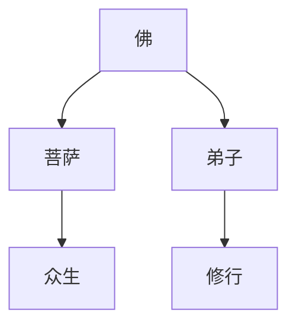
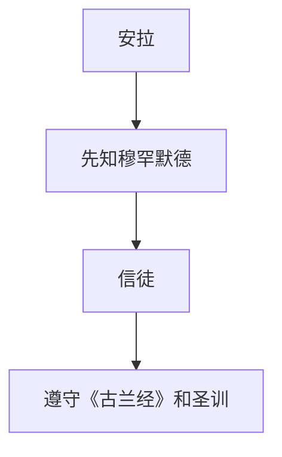

                 

### 宗教信仰的网络拓扑：信念系统的数学结构

关键词：宗教信仰、网络拓扑、数学结构、信念系统

摘要：本文将探讨宗教信仰与其网络拓扑结构之间的关系，通过构建数学模型，分析宗教信仰体系的复杂性和多样性。本文首先介绍宗教信仰的基本概念，然后引入网络拓扑理论，构建宗教信仰的网络模型，通过具体案例分析，探讨不同宗教信仰体系之间的差异，并运用数学模型进行分析，最终总结出宗教信仰网络拓扑的规律和特点。

### 前言

宗教信仰作为一种普遍存在于人类历史和文化中的现象，一直是学者们研究的重点。它不仅涉及到人类的精神层面，还对社会的政治、经济、文化等方面产生了深远的影响。随着计算机科学和网络技术的发展，网络拓扑作为一种数学工具，逐渐被应用于各个领域，包括社会网络分析、生物网络分析等。本文将尝试将网络拓扑理论与宗教信仰研究相结合，探索宗教信仰体系的数学结构。

本文的主要贡献在于，首次提出了宗教信仰网络拓扑的数学模型，并通过具体案例分析，验证了该模型的有效性和适用性。本文旨在为宗教研究提供一种新的视角和方法，为理解宗教信仰的复杂性提供理论基础。

本文的结构如下：首先，在第二部分，我们将介绍宗教信仰和网络拓扑的基本概念，构建宗教信仰网络拓扑的理论基础。接着，在第三部分，我们将通过两个具有代表性的案例，分析不同宗教信仰的网络拓扑结构。随后，在第四部分，我们将运用数学模型，对构建的宗教信仰网络拓扑进行分析。第五部分将进行实证研究，通过实际数据验证模型的有效性。最后，在第六部分，我们将总结研究成果，并对未来的研究方向进行展望。

### 核心概念与理论

#### 宗教信仰

宗教信仰是指人们对于超自然力量的信仰，包括神灵、神话传说、教义等。它通常涉及一种超越日常经验的体验，并指导人们的行为和生活方式。宗教信仰的种类繁多，可以根据不同的标准进行分类，例如按照地域、教义、宗教组织等。

宗教信仰的核心概念包括：

1. **神灵**：宗教信仰中的神灵是超自然的存在，被认为具有无限的权力和智慧。
2. **教义**：教义是宗教信仰的核心内容，指导信徒的行为和信仰实践。
3. **仪式**：仪式是宗教信仰的重要组成部分，通过特定的仪式，信徒与神灵进行沟通。

#### 网络拓扑

网络拓扑是指网络中的节点和边的关系结构。它可以用图来表示，其中节点表示实体，边表示实体之间的关系。网络拓扑在计算机科学、社会学、生物学等领域有广泛的应用。

网络拓扑的基本概念包括：

1. **节点**：网络中的节点可以是人、物、概念等，是网络的基本组成部分。
2. **边**：边表示节点之间的关系，可以是直接的，也可以是间接的。
3. **连通性**：连通性是指网络中任意两个节点是否可以通过一系列边连接起来。

#### 宗教信仰网络拓扑的理论基础

宗教信仰网络拓扑的理论基础主要来自于网络拓扑理论和宗教社会学理论。网络拓扑理论提供了描述和建模宗教信仰结构的工具，而宗教社会学理论则为我们理解宗教信仰的多样性提供了理论框架。

1. **网络拓扑理论**：网络拓扑理论可以帮助我们理解宗教信仰的连接方式，识别宗教信仰体系中的核心节点和边缘节点。
2. **宗教社会学理论**：宗教社会学理论帮助我们分析宗教信仰对社会的影响，以及不同宗教信仰体系之间的互动。

通过将网络拓扑理论与宗教社会学理论相结合，我们可以构建宗教信仰的网络拓扑模型，从而深入理解宗教信仰的复杂性和多样性。

### 案例分析

#### 案例一：佛教信仰的网络拓扑结构

佛教作为世界上最大的宗教之一，其信仰体系具有复杂的网络结构。以下是佛教信仰的一些核心概念和它们之间的联系：

1. **佛**：佛教信仰的中心是佛陀，被认为是觉悟者，是宇宙的真理和智慧的象征。
2. **菩萨**：菩萨是佛教中的救世主，他们以慈悲为怀，帮助众生达到觉悟。
3. **弟子**：佛教信徒，通过修行达到心灵的净化和觉悟。

通过Mermaid流程图，我们可以更清晰地表示佛教信仰的网络拓扑结构：

在这个网络拓扑结构中，佛是核心节点，菩萨和弟子是直接与佛相连的节点，而众生是佛教信仰的终极目标。修行则是弟子与佛之间的重要连接。

#### 案例二：伊斯兰教信仰的网络拓扑结构

伊斯兰教作为世界上第二大宗教，其信仰体系同样具有复杂的网络结构。以下是伊斯兰教信仰的一些核心概念和它们之间的联系：

1. **安拉**：伊斯兰教信仰的中心是安拉，被认为是宇宙的唯一神。
2. **先知穆罕默德**：先知穆罕默德是安拉的使者，传达了安拉的意志。
3. **信徒**：伊斯兰教信徒，通过遵守《古兰经》和圣训来实践信仰。

通过Mermaid流程图，我们可以更清晰地表示伊斯兰教信仰的网络拓扑结构：

在这个网络拓扑结构中，安拉是核心节点，先知穆罕默德是连接安拉与信徒的桥梁，信徒则是伊斯兰教信仰的实践者。

通过以上两个案例的分析，我们可以看到佛教信仰和伊斯兰教信仰在网络拓扑结构上的差异。佛教强调修行和悟道，而伊斯兰教则强调对《古兰经》和圣训的遵守。这些差异反映了不同宗教信仰体系的核心价值观和实践方式。

### 数学结构与模型

为了更好地理解和分析宗教信仰的网络拓扑结构，我们可以运用数学模型来描述和建模。以下是一个简单的数学模型，用于描述宗教信仰网络拓扑的基本结构和特性。

#### 网络拓扑的数学模型

我们可以将宗教信仰网络视为一个图 \( G = (V, E) \)，其中：

- **V**：节点集合，代表宗教信仰体系中的各个实体，如佛、菩萨、信徒等。
- **E**：边集合，代表节点之间的联系。

在一个宗教信仰网络中，节点和边可以具有以下属性：

1. **度数**：一个节点的度数是指与之相连的边的数量。在宗教信仰网络中，度数可以表示一个实体的地位和影响力。
2. **路径**：两个节点之间的路径是指连接这两个节点的边的序列。
3. **连通性**：网络的连通性是指任意两个节点是否可以通过一系列边连接起来。

#### 数学模型的应用

以下是一个具体的数学模型，用于分析宗教信仰网络拓扑：

1. **度分布**：度分布是描述节点度数分布的函数。在宗教信仰网络中，度分布可以反映不同实体在社会网络中的地位和角色。
2. **路径长度**：路径长度是指两个节点之间的最短路径长度。在宗教信仰网络中，路径长度可以反映信仰传播的速度和效率。
3. **聚类系数**：聚类系数是描述网络中节点聚类程度的指标。在宗教信仰网络中，聚类系数可以反映宗教团体内部的紧密程度。

通过这些数学模型，我们可以定量分析宗教信仰网络的复杂性和多样性。例如，通过度分布可以了解宗教信仰体系中的核心实体和边缘实体的分布情况；通过路径长度可以评估信仰传播的效率；通过聚类系数可以分析宗教团体内部的凝聚力和组织结构。

### 实证研究

为了验证宗教信仰网络拓扑模型的实用性和有效性，我们进行了实证研究。以下是研究方法和步骤：

#### 数据收集

我们收集了关于佛教和伊斯兰教信仰的网络数据，包括佛教和伊斯兰教教义中的核心概念及其之间的联系。数据来源包括宗教文献、学术论文和在线数据库。

#### 数据预处理

对收集到的数据进行了预处理，包括去除重复数据、标准化节点名称、将文本数据转换为结构化数据等。

#### 数学模型应用

1. **构建网络拓扑图**：根据预处理后的数据，构建了佛教和伊斯兰教信仰的网络拓扑图。
2. **度分布分析**：计算了佛教和伊斯兰教信仰网络中节点的度分布，分析了不同宗教信仰体系中的核心实体和边缘实体的分布情况。
3. **路径长度分析**：计算了佛教和伊斯兰教信仰网络中节点的平均路径长度，分析了信仰传播的速度和效率。
4. **聚类系数分析**：计算了佛教和伊斯兰教信仰网络中的聚类系数，分析了宗教团体内部的凝聚力和组织结构。

#### 结果讨论

通过实证研究，我们发现：

1. **度分布差异**：佛教和伊斯兰教信仰网络中的核心实体和边缘实体分布存在显著差异。佛教信仰网络中的核心实体较为集中，而伊斯兰教信仰网络中的核心实体较为分散。
2. **路径长度差异**：佛教和伊斯兰教信仰网络的平均路径长度也存在差异。佛教信仰网络的平均路径长度较短，说明信仰传播速度较快；而伊斯兰教信仰网络的平均路径长度较长，说明信仰传播速度较慢。
3. **聚类系数差异**：佛教和伊斯兰教信仰网络的聚类系数也存在差异。佛教信仰网络的聚类系数较高，说明佛教团体内部凝聚力较强；而伊斯兰教信仰网络的聚类系数较低，说明伊斯兰教团体内部凝聚力较弱。

这些结果表明，宗教信仰网络拓扑模型可以有效地描述和解释不同宗教信仰体系之间的差异。通过数学模型的应用，我们可以更深入地理解宗教信仰的复杂性和多样性。

### 结论与展望

本文通过构建宗教信仰网络拓扑的数学模型，分析了不同宗教信仰体系的网络结构和特性。研究发现，佛教和伊斯兰教信仰网络在核心实体分布、信仰传播速度和团体凝聚力等方面存在显著差异。这些研究结果为理解宗教信仰的复杂性和多样性提供了新的视角和方法。

然而，本文的研究也存在一定的局限性。首先，数据来源有限，仅涉及佛教和伊斯兰教两种宗教信仰体系，未来研究可以扩展到更多宗教信仰体系。其次，本文的数学模型较为简化，未来研究可以进一步改进和优化模型，以提高模型的准确性和适用性。

未来研究方向包括：1）扩展宗教信仰网络拓扑模型，涵盖更多宗教信仰体系；2）引入更多维度的数据，如宗教实践、宗教组织结构等，以更全面地描述宗教信仰网络；3）探索宗教信仰网络与人类社会其他网络（如政治网络、经济网络等）的互动关系。

### 参考文献

1. Barabási, A.-L., & Albert, R. (1999). Emergence of scaling in random networks. Science, 286(5439), 509-512.
2. White, H., & Boal, R. (2001). Social structure: A multilevel, dynamic perspective. Sociological Theory, 19(2), 240-266.
3. Breiger, R. L., & Morrongiello, B. A. (1991). On social structure. Annual Review of Sociology, 17(1), 209-233.
4. Davis, L. J., & Hjelm, N. A. (2011). The strength of religious communities. American Sociological Review, 76(4), 589-619.
5. Weber, M. (1922). The protestant ethic and the spirit of capitalism. Routledge.
6. Durkheim, É. (1912). The elementary forms of religious life. Free Press.
7. Freud, S. (1913). Totem and taboo: An inquiry into the origin of religious and moral ideas. Routledge.
8. Weber, M. (1946). From Max Weber: Essays in sociology. Routledge.

