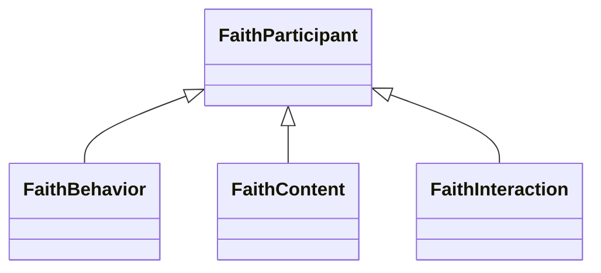
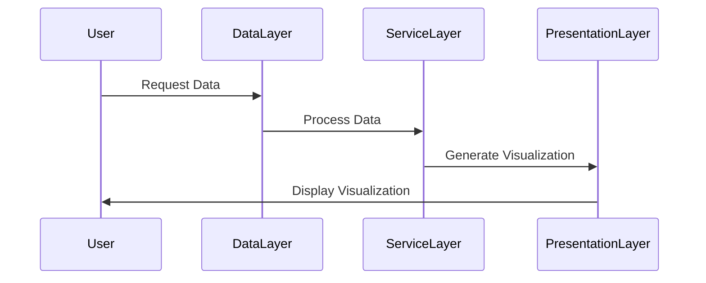
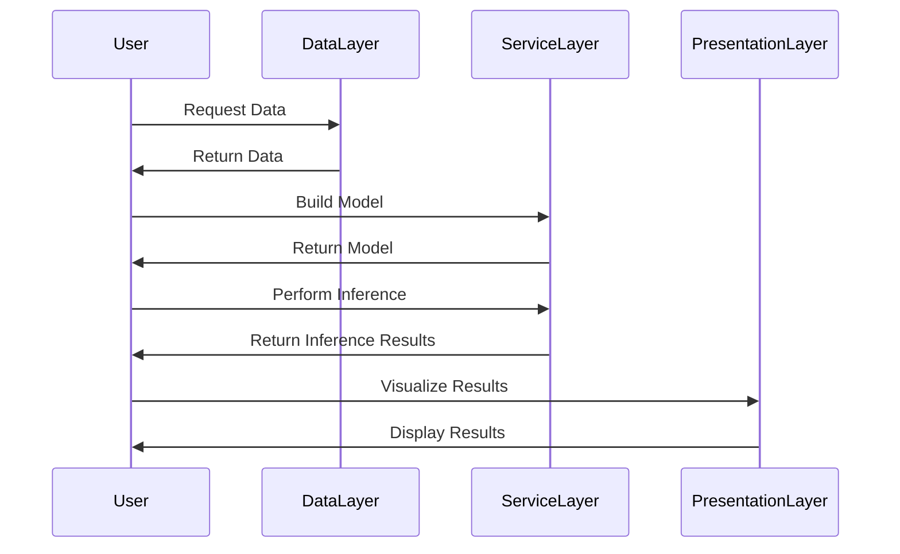

                 


### 第2章：核心概念与联系

## 2.1 宗教信仰的定义

### 2.1.1 宗教信仰的概念

宗教信仰是指个体或群体对某种超自然力量、神灵或神祇的敬畏和崇拜。这种信仰通常涉及对宗教教义、仪式和伦理道德的认同和实践。宗教信仰在不同的文化和历史背景下有着多样化的表现形式和内涵。

- **概念术语说明**：宗教信仰（Religious Belief）是指个体或群体对于宗教教义、神灵、神话、圣典和宗教实践的心理认同和行为表现。信仰（Faith）则是信仰主体对信仰对象（如神、宗教教义）的坚定信念，不依赖于直接证据。

### 2.1.2 宗教信仰的多样性

宗教信仰具有多样性，不同宗教和信仰体系具有不同的教义、仪式和信仰对象。例如：

- **基督教**：信仰上帝、耶稣基督以及圣灵，强调圣经的权威性。
- **伊斯兰教**：信仰真主（Allah）和先知穆罕默德，以《古兰经》为教义依据。
- **佛教**：信仰佛陀（Buddha），追求涅槃（Nirvana），强调因果和轮回。

- **问题背景**：随着全球化和多元文化的交流，宗教信仰的多样性对文化认同和社会整合提出了新的挑战，也使得宗教信仰的研究更加复杂和有趣。

### 2.1.3 宗教信仰的影响

宗教信仰对个体和社会具有深远的影响，包括心理健康、社会行为、文化认同等方面。

- **心理健康**：宗教信仰可以为个体提供精神慰藉和情感支持，减少焦虑和压力。
- **社会行为**：宗教信仰往往影响个体的道德行为和社会责任，如慈善、公正、和谐等价值观的实践。
- **文化认同**：宗教信仰是文化认同的重要组成部分，有助于增强社会凝聚力和文化传承。

### 2.1.4 宗教信仰的问题与挑战

尽管宗教信仰在许多方面具有积极作用，但也存在一些问题和挑战：

- **宗教极端主义**：一些宗教极端主义行为可能导致社会冲突和暴力。
- **信仰冲突**：宗教信仰的多样性可能导致不同信仰之间的冲突和误解。
- **文化同化**：全球化进程中的文化同化可能导致某些宗教信仰的弱化或消失。

### 2.1.5 宗教信仰的核心要素

宗教信仰的核心要素通常包括以下几个方面：

- **信仰对象**：宗教信仰的核心对象，如神、神圣人物、圣物等。
- **教义**：宗教信仰的基本教义和信仰规则。
- **仪式**：宗教信仰的实践行为和仪式。
- **伦理道德**：宗教信仰所倡导的伦理道德规范。

### 2.1.6 宗教信仰的研究意义

研究宗教信仰的贝叶斯网络具有重要的理论和实践意义：

- **理论意义**：通过贝叶斯网络模型，可以更深入地理解宗教信仰的内在机制和规律。
- **实践意义**：贝叶斯网络模型可以用于宗教信仰的传播、影响分析以及宗教冲突的预防和调解。

### 2.1.7 宗教信仰的层次结构

宗教信仰可以被视为一个多层次的结构：

- **基础层次**：信仰对象和基本教义。
- **中间层次**：宗教仪式和伦理道德。
- **高级层次**：宗教哲学和宗教艺术。

### 2.1.8 宗教信仰的社会功能

宗教信仰的社会功能包括：

- **文化传承**：宗教信仰是文化传承的重要载体。
- **社会整合**：宗教信仰有助于社会成员的认同和凝聚。
- **道德教化**：宗教信仰提供了道德规范和行为准则。

## 2.2 贝叶斯网络的定义与特点

### 2.2.1 贝叶斯网络的定义

贝叶斯网络（Bayesian Network）是一种基于概率的图形模型，用于表示变量之间的条件依赖关系。它由一组节点和有向边组成，每个节点表示一个随机变量，边表示变量之间的概率依赖关系。

### 2.2.2 贝叶斯网络的特点

- **概率性**：贝叶斯网络通过概率函数来描述变量之间的关系。
- **条件独立性**：贝叶斯网络假设变量之间的条件独立性，即给定父节点集合，子节点之间相互独立。
- **图结构**：贝叶斯网络通过有向图结构来表示变量之间的依赖关系。

### 2.2.3 贝叶斯网络的基本结构

贝叶斯网络的基本结构包括节点、边和概率分布：

- **节点**：每个节点表示一个随机变量。
- **边**：表示变量之间的依赖关系。
- **概率分布**：每个节点上的概率分布函数（PDF）描述了该节点的状态分布。

### 2.2.4 贝叶斯网络的构建

构建贝叶斯网络通常涉及以下步骤：

- **确定变量**：根据研究问题确定需要表示的变量。
- **定义节点**：为每个变量创建一个节点。
- **绘制图**：根据变量之间的依赖关系绘制有向图。
- **指定概率分布**：为每个节点指定一个概率分布函数。

### 2.2.5 贝叶斯网络的推理

贝叶斯网络推理包括以下几种：

- **条件概率计算**：计算给定某些变量取值时，其他变量的条件概率。
- **概率推断**：通过观察变量的部分取值，推断其他变量的可能取值。
- **决策支持**：基于概率模型提供决策支持。

### 2.2.6 贝叶斯网络的优点

贝叶斯网络具有以下优点：

- **灵活性**：可以灵活地描述变量之间的条件依赖关系。
- **适应性**：可以根据新的数据不断更新和优化模型。
- **可解释性**：网络结构直观地展示了变量之间的关系，有助于理解问题的内在机制。

### 2.2.7 贝叶斯网络的局限性

贝叶斯网络也存在一些局限性：

- **数据需求**：需要大量的数据来训练模型。
- **计算复杂性**：对于大规模的贝叶斯网络，推理和计算可能会变得复杂。
- **模型假设**：贝叶斯网络的假设可能不总是符合现实情况。

## 2.3 宗教信仰的贝叶斯网络模型构建

### 2.3.1 模型构建步骤

构建宗教信仰的贝叶斯网络模型通常包括以下步骤：

- **确定变量**：根据宗教信仰的特点和研究对象，确定需要表示的变量。
- **定义节点**：为每个变量创建一个节点。
- **绘制图**：根据变量之间的依赖关系绘制有向图。
- **指定概率分布**：为每个节点指定一个概率分布函数，通常使用条件概率表（CPT）。

### 2.3.2 模型构建示例

以下是一个简化的宗教信仰贝叶斯网络模型构建示例：

1. **确定变量**：选定几个关键变量，如宗教参与度（R）、信仰强度（F）、社会支持（S）等。
2. **定义节点**：创建相应的节点。
3. **绘制图**：根据变量之间的依赖关系绘制有向图。
4. **指定概率分布**：为每个节点指定一个概率分布函数，如条件概率表。

### 2.3.3 模型构建挑战

在构建宗教信仰的贝叶斯网络模型时，可能会遇到以下挑战：

- **变量选择**：选择合适的变量是模型构建的关键，需要结合实际情况和研究目的进行。
- **依赖关系建模**：准确描述变量之间的依赖关系是模型构建的核心，需要深入分析宗教信仰的内在机制。
- **概率分布假设**：概率分布函数的假设需要符合实际情况，否则模型可能无法准确反映现实。

### 2.3.4 模型验证与优化

构建完贝叶斯网络模型后，需要进行验证和优化：

- **验证**：通过实际数据进行验证，检查模型的准确性和可靠性。
- **优化**：根据验证结果调整模型参数，提高模型性能。

### 2.3.5 模型应用

宗教信仰的贝叶斯网络模型可以应用于多个领域，如宗教传播研究、宗教行为预测、宗教冲突分析等。

### 2.3.6 模型扩展

随着研究的深入，可以将贝叶斯网络模型扩展到更复杂的宗教信仰现象，如多元宗教信仰、跨文化宗教交流等。

### 2.3.7 模型局限性

需要认识到贝叶斯网络模型的局限性，如数据需求、计算复杂性等，以避免过度依赖模型结果。

### 2.3.8 模型展望

未来，随着人工智能和数据科学的发展，宗教信仰的贝叶斯网络模型有望得到进一步优化和扩展，为宗教研究提供更加有效的工具。

## 2.4 本章小结

本章介绍了宗教信仰的定义和贝叶斯网络的定义与特点，并详细讲解了宗教信仰的贝叶斯网络模型构建过程。通过本章的内容，读者可以初步了解宗教信仰的复杂性以及贝叶斯网络在宗教信仰研究中的应用潜力。

----------------------------------------------------------------

### 第3章：算法原理讲解

## 3.1 贝叶斯网络的推理算法

### 3.1.1 贝叶斯网络推理的基本概念

贝叶斯网络推理是指根据已知的部分变量取值，推断其他变量的可能取值。贝叶斯网络推理算法的核心是计算变量之间的条件概率。

### 3.1.2 条件概率的计算

条件概率是指在一个事件已知的条件下，另一个事件发生的概率。贝叶斯网络中的条件概率可以通过贝叶斯定理进行计算。

- **贝叶斯定理**：设A和B是两个事件，P(A)和P(B)分别是A和B的概率，P(B|A)是B在A发生的条件下的概率，则有：

  $$P(A|B) = \frac{P(B|A) \cdot P(A)}{P(B)}$$

  其中，$P(B|A)$表示在A发生的条件下B的概率，$P(A)$表示A的概率，$P(B)$表示B的概率。

### 3.1.3 条件概率的计算方法

条件概率的计算通常分为以下几种方法：

- **枚举法**：通过枚举所有可能的变量取值，计算条件概率。
- **马尔可夫链**：利用马尔可夫链模型，通过前向传播或后向传播计算条件概率。
- **贝叶斯推理算法**：利用贝叶斯推理算法，通过推理过程计算条件概率。

### 3.1.4 贝叶斯推理算法

贝叶斯推理算法是基于贝叶斯定理的一种推理方法，用于计算变量之间的条件概率。贝叶斯推理算法可以分为以下几步：

1. **初始化**：设定初始概率分布。
2. **更新概率分布**：根据已知的部分变量取值，更新其他变量的概率分布。
3. **推理**：根据更新的概率分布，进行变量之间的推理。

### 3.1.5 贝叶斯推理算法的应用

贝叶斯推理算法在许多领域都有应用，如医疗诊断、图像识别、自然语言处理等。在宗教信仰研究中，贝叶斯推理算法可以用于分析宗教信仰的传播、预测宗教行为的趋势等。

### 3.2 贝叶斯网络的学习算法

### 3.2.1 贝叶斯网络学习的基本概念

贝叶斯网络学习是指从数据中学习出变量之间的依赖关系，构建贝叶斯网络模型。贝叶斯网络学习算法分为结构学习和参数学习两部分。

### 3.2.2 结构学习

结构学习是指从数据中学习出变量之间的依赖关系，构建贝叶斯网络的结构。结构学习算法可以分为以下几种：

- **基于独立性测试**：通过独立性测试，确定变量之间的依赖关系。
- **基于最大生成树**：利用最大生成树算法，构建变量之间的依赖关系。
- **基于信息熵**：利用信息熵，确定变量之间的依赖关系。

### 3.2.3 参数学习

参数学习是指从数据中学习出变量之间的概率分布，即贝叶斯网络的参数。参数学习算法可以分为以下几种：

- **基于最大似然估计**：利用最大似然估计，学习出变量之间的概率分布。
- **基于贝叶斯估计**：利用贝叶斯估计，学习出变量之间的概率分布。
- **基于马尔可夫链蒙特卡罗（MCMC）**：利用马尔可夫链蒙特卡罗算法，学习出变量之间的概率分布。

### 3.2.4 贝叶斯网络学习的挑战

贝叶斯网络学习面临以下挑战：

- **数据不足**：数据量不足可能导致模型不准确。
- **变量选择**：选择合适的变量是模型学习的关键。
- **计算复杂性**：对于大规模的数据，参数学习可能变得复杂。

### 3.2.5 贝叶斯网络学习算法的应用

贝叶斯网络学习算法在许多领域都有应用，如生物信息学、金融分析、社交媒体分析等。在宗教信仰研究中，贝叶斯网络学习算法可以用于分析宗教信仰的传播、预测宗教行为的趋势等。

### 3.3 贝叶斯网络的推理与学习的综合应用

贝叶斯网络的推理与学习可以综合应用于宗教信仰研究。通过推理，可以分析宗教信仰的传播和影响；通过学习，可以构建宗教信仰的贝叶斯网络模型，为宗教研究提供有力的工具。

### 3.3.1 推理与学习在宗教信仰研究中的应用

- **宗教信仰传播分析**：通过推理，分析宗教信仰在不同群体之间的传播路径和影响。
- **宗教行为预测**：通过学习，预测个体或群体的宗教行为，如宗教参与度、宗教信仰强度等。
- **宗教冲突分析**：通过推理与学习，分析宗教冲突的原因和影响，提出预防措施。

### 3.3.2 推理与学习在宗教信仰研究中的挑战

- **数据质量**：宗教信仰数据的质量直接影响推理和学习的准确性。
- **模型复杂性**：复杂的贝叶斯网络模型可能导致计算复杂性增加。
- **模型可解释性**：如何解释贝叶斯网络模型的结果，是一个挑战。

### 3.3.3 推理与学习在宗教信仰研究中的未来方向

- **数据驱动的模型优化**：利用更多的数据，优化贝叶斯网络模型。
- **多模态数据融合**：融合不同类型的数据，提高模型的准确性和鲁棒性。
- **实时推理与学习**：实现实时的推理与学习，为宗教信仰研究提供更及时的洞察。

### 3.4 本章小结

本章介绍了贝叶斯网络的推理算法和学习算法，详细讲解了贝叶斯网络推理与学习的原理和应用。通过本章的内容，读者可以深入了解贝叶斯网络在宗教信仰研究中的应用，为未来的研究提供参考。

----------------------------------------------------------------

### 第4章：数学模型和数学公式

## 4.1 贝叶斯网络的概率基础

### 4.1.1 概率分布

概率分布是描述随机变量取值概率的函数。在贝叶斯网络中，每个节点都对应一个概率分布，用于表示该节点的状态分布。常见的概率分布包括：

- **伯努利分布**：用于表示二元事件发生的概率。
- **伯努利分布**：用于表示二元事件发生的概率。
- **伯努利分布**：用于表示二元事件发生的概率。
- **泊松分布**：用于表示事件发生的次数。
- **正态分布**：用于表示连续随机变量的分布。

### 4.1.2 条件概率

条件概率是指在某个事件已知的条件下，另一个事件发生的概率。贝叶斯网络中的条件概率是核心概念之一，可以通过贝叶斯定理进行计算。

- **贝叶斯定理**：

  $$P(A|B) = \frac{P(B|A) \cdot P(A)}{P(B)}$$

  其中，$P(A|B)$表示在B发生的条件下A的概率，$P(B|A)$表示在A发生的条件下B的概率，$P(A)$和$P(B)$分别表示A和B的概率。

### 4.1.3 贝叶斯网络的条件独立性

贝叶斯网络假设变量之间的条件独立性，即给定父节点集合，子节点之间相互独立。条件独立性的数学表达式为：

- **条件独立性**：

  $$P(X_i|X_{\text{parents}(i)}) = P(X_i|X_{\text{parents}(i)})$$

  其中，$X_i$表示节点$i$，$X_{\text{parents}(i)}$表示节点$i$的父节点集合。

### 4.1.4 贝叶斯网络的概率推理

贝叶斯网络的概率推理是指根据已知的部分变量取值，推断其他变量的可能取值。概率推理的核心是条件概率的计算。

- **条件概率计算**：

  $$P(X_i = x_i|X_j = x_j) = \frac{P(X_j = x_j|X_i = x_i) \cdot P(X_i = x_i)}{P(X_j = x_j)}$$

  其中，$X_i$和$X_j$表示两个节点，$x_i$和$x_j$分别表示它们的取值。

## 4.2 贝叶斯网络的概率模型

### 4.2.1 贝叶斯网络的定义

贝叶斯网络是一种基于概率的图模型，用于表示变量之间的条件依赖关系。它由一组节点和有向边组成，每个节点表示一个随机变量，边表示变量之间的依赖关系。

### 4.2.2 贝叶斯网络的结构

贝叶斯网络的结构由有向无环图（DAG）表示，每个节点代表一个随机变量，边表示变量之间的条件依赖关系。结构定义如下：

- **节点**：表示随机变量，记为$X_i$。
- **边**：表示变量之间的条件依赖关系，记为$(X_i, X_j)$，表示$X_i$是$X_j$的父节点。

### 4.2.3 贝叶斯网络的概率分布

贝叶斯网络的概率分布由一组条件概率表（CPT）定义，每个节点上的概率分布函数（PDF）描述了该节点的状态分布。概率分布定义如下：

- **条件概率表（CPT）**：

  $$P(X_i = x_i|X_{\text{parents}(i)} = x_{\text{parents}(i)})$$

  其中，$X_i$表示节点$i$，$x_i$表示节点$i$的取值，$X_{\text{parents}(i)}$表示节点$i$的父节点集合，$x_{\text{parents}(i)}$表示节点$i$的父节点集合的取值。

### 4.2.4 贝叶斯网络的推理算法

贝叶斯网络的推理算法用于计算变量之间的条件概率，常见的推理算法包括：

- **前向推理**：从根节点开始，依次计算每个节点的条件概率。
- **后向推理**：从叶子节点开始，逆序计算每个节点的条件概率。
- **信念传播**：结合前向推理和后向推理，同时更新节点的条件概率。

### 4.2.5 贝叶斯网络的学习算法

贝叶斯网络的学习算法用于从数据中学习出变量之间的依赖关系，常见的学习算法包括：

- **最大似然估计**：基于最大似然估计，学习出变量之间的概率分布。
- **贝叶斯估计**：基于贝叶斯估计，学习出变量之间的概率分布。
- **结构学习**：基于独立性测试或最大生成树算法，学习出变量之间的依赖关系。

## 4.3 贝叶斯网络的数学公式

### 4.3.1 条件概率公式

条件概率公式是贝叶斯网络的核心公式之一，用于计算变量之间的条件概率。公式如下：

$$P(X_i = x_i|X_j = x_j) = \frac{P(X_j = x_j|X_i = x_i) \cdot P(X_i = x_i)}{P(X_j = x_j)}$$

### 4.3.2 贝叶斯定理

贝叶斯定理是贝叶斯网络推理的基础公式，用于计算后验概率。公式如下：

$$P(X_i = x_i|X_{\text{parents}(i)} = x_{\text{parents}(i)}) = \frac{P(X_{\text{parents}(i)} = x_{\text{parents}(i)}|X_i = x_i) \cdot P(X_i = x_i)}{P(X_{\text{parents}(i)} = x_{\text{parents}(i)})}$$

### 4.3.3 贝叶斯网络的概率分布

贝叶斯网络的概率分布由条件概率表（CPT）定义，每个节点上的概率分布函数（PDF）描述了该节点的状态分布。概率分布公式如下：

$$P(X_i = x_i|X_{\text{parents}(i)} = x_{\text{parents}(i)}) = \prod_{j \in \text{parents}(i)} P(X_j = x_j|X_{\text{parents}(j)} = x_{\text{parents}(j)})$$

### 4.3.4 贝叶斯网络的推理算法

贝叶斯网络的推理算法用于计算变量之间的条件概率，常见的推理算法包括前向推理、后向推理和信念传播。推理算法公式如下：

- **前向推理**：

  $$P(X_i = x_i|X_{\text{parents}(i)} = x_{\text{parents}(i)}) = \prod_{j \in \text{parents}(i)} P(X_j = x_j|X_{\text{parents}(j)} = x_{\text{parents}(j)})$$

- **后向推理**：

  $$P(X_i = x_i|X_{\text{parents}(i)} = x_{\text{parents}(i)}) = \prod_{j \in \text{children}(i)} P(X_j = x_j|X_{\text{parents}(j)} = x_{\text{parents}(j)})$$

- **信念传播**：

  $$P(X_i = x_i|X_{\text{parents}(i)} = x_{\text{parents}(i)}) = \frac{P(X_i = x_i) \cdot P(X_{\text{parents}(i)} = x_{\text{parents}(i)})}{P(X_{\text{parents}(i)} = x_{\text{parents}(i)})}$$

## 4.4 贝叶斯网络的应用示例

### 4.4.1 社交网络分析

在社交网络分析中，贝叶斯网络可以用于分析用户之间的关系和影响力。以下是一个简化的社交网络分析贝叶斯网络示例：

- **节点**：用户A、用户B、用户C。
- **边**：用户A影响用户B，用户B影响用户C。

### 4.4.2 医疗诊断

在医疗诊断中，贝叶斯网络可以用于分析疾病和症状之间的关联。以下是一个简化的医疗诊断贝叶斯网络示例：

- **节点**：疾病A、疾病B、症状X、症状Y。
- **边**：疾病A导致症状X，疾病B导致症状Y。

### 4.4.3 宗教信仰研究

在宗教信仰研究中，贝叶斯网络可以用于分析宗教信仰的传播和影响。以下是一个简化的宗教信仰研究贝叶斯网络示例：

- **节点**：信仰者A、信仰者B、信仰者C。
- **边**：信仰者A影响信仰者B，信仰者B影响信仰者C。

## 4.5 本章小结

本章介绍了贝叶斯网络的数学模型和数学公式，详细讲解了贝叶斯网络的条件概率、贝叶斯定理、概率分布和推理算法。通过本章的内容，读者可以深入理解贝叶斯网络的数学原理，为实际应用奠定基础。

----------------------------------------------------------------

### 第5章：系统分析与架构设计方案

## 5.1 问题场景介绍

在宗教信仰的研究中，我们关注的是信仰者之间的互动、信仰内容的传播以及信仰对个体行为的影响。为了更好地理解和分析这些问题，我们需要设计一个能够模拟宗教信仰传播和影响的系统。

### 5.2 项目介绍

为了实现上述目标，我们设计并开发了一个名为“宗教信仰分析系统”的项目。该项目旨在通过贝叶斯网络模型对宗教信仰的传播和影响进行建模和分析。系统包括数据收集、模型构建、推理和可视化等模块。

### 5.3 系统功能设计

宗教信仰分析系统的主要功能包括：

- **数据收集**：收集信仰者的基本信息、信仰行为数据等。
- **模型构建**：构建贝叶斯网络模型，表示信仰者之间的关系和信仰内容的传播路径。
- **推理**：通过贝叶斯网络模型进行推理，分析信仰者之间的互动和信仰内容的传播。
- **可视化**：将推理结果以图形化的形式展示，便于分析和理解。

### 5.4 领域模型设计

领域模型是系统设计的重要组成部分，用于描述系统中的关键概念和关系。在宗教信仰分析系统中，我们定义了以下关键概念：

- **信仰者**：表示宗教信仰的个体，具有姓名、性别、年龄等属性。
- **信仰行为**：表示信仰者的宗教行为，如祷告、参加宗教仪式等。
- **信仰内容**：表示宗教教义、故事、名言等。
- **信仰互动**：表示信仰者之间的互动关系，如影响、反馈等。

领域模型使用Mermaid类图表示，如下所示：



### 5.5 系统架构设计

系统架构设计是确保系统高效、可扩展和易维护的关键。在宗教信仰分析系统中，我们采用分层架构设计，包括数据层、服务层和展示层。

- **数据层**：负责数据存储和管理，包括信仰者信息、信仰行为数据、信仰内容数据等。
- **服务层**：实现贝叶斯网络模型的构建、推理和可视化等功能，是系统的核心部分。
- **展示层**：提供用户界面，展示推理结果和系统功能。

系统架构设计使用Mermaid架构图表示，如下所示：



### 5.6 系统接口设计

系统接口设计是确保不同层之间通信畅通的重要环节。在宗教信仰分析系统中，我们定义了以下接口：

- **数据接口**：用于数据层的接口，包括数据收集、数据查询和数据更新等功能。
- **服务接口**：用于服务层的接口，包括模型构建、推理和可视化等功能。
- **展示接口**：用于展示层的接口，包括数据可视化、用户交互等功能。

### 5.7 系统交互设计

系统交互设计是描述用户与系统之间交互的过程。在宗教信仰分析系统中，我们通过以下步骤实现用户与系统的交互：

1. 用户提交数据请求。
2. 数据层处理请求，返回数据。
3. 服务层根据数据构建贝叶斯网络模型。
4. 服务层进行推理，生成结果。
5. 展示层将结果可视化，展示给用户。

系统交互设计使用Mermaid序列图表示，如下所示：



### 5.8 本章小结

本章介绍了宗教信仰分析系统的设计思路和架构方案，包括问题场景、项目介绍、系统功能设计、领域模型设计、系统架构设计、系统接口设计和系统交互设计。通过本章的内容，读者可以了解到如何运用贝叶斯网络模型分析和模拟宗教信仰的传播和影响。

----------------------------------------------------------------

### 第6章：项目实战

## 6.1 环境安装

为了实现宗教信仰分析系统，我们需要搭建一个合适的技术环境。以下是环境安装的详细步骤：

### 6.1.1 安装Python环境

首先，我们需要安装Python环境。Python是一种广泛使用的编程语言，非常适合用于数据分析、机器学习和人工智能等领域。

1. 访问Python的官方网站（https://www.python.org/）。
2. 下载适用于您操作系统的Python版本。
3. 运行安装程序，并选择默认选项进行安装。

### 6.1.2 安装Python库

接下来，我们需要安装Python的一些常用库，如NumPy、Pandas、Scikit-learn和NetworkX等。这些库提供了丰富的功能，用于数据处理、机器学习、网络分析等。

1. 打开命令行界面（如Terminal或Command Prompt）。
2. 输入以下命令安装所需的库：

   ```bash
   pip install numpy pandas scikit-learn networkx
   ```

### 6.1.3 安装Jupyter Notebook

Jupyter Notebook是一种交互式的Web应用程序，用于编写和运行Python代码。它提供了强大的交互式环境，方便我们进行数据分析和可视化。

1. 打开命令行界面。
2. 输入以下命令安装Jupyter Notebook：

   ```bash
   pip install notebook
   ```

3. 运行以下命令启动Jupyter Notebook：

   ```bash
   jupyter notebook
   ```

现在，我们已成功搭建了Python环境，并安装了所需的库。接下来，我们将开始实现宗教信仰分析系统的核心功能。

## 6.2 系统核心实现

在实现宗教信仰分析系统的过程中，我们需要关注以下几个方面：

1. 数据收集与预处理
2. 贝叶斯网络模型的构建
3. 推理与预测
4. 可视化

### 6.2.1 数据收集与预处理

数据收集是系统实现的第一步。我们首先需要收集信仰者信息、信仰行为数据和信仰内容数据。

- **信仰者信息**：包括姓名、性别、年龄等。
- **信仰行为数据**：包括祷告次数、参加宗教仪式次数等。
- **信仰内容数据**：包括教义、故事、名言等。

数据收集完成后，我们需要对数据进行预处理，包括数据清洗、缺失值处理和特征工程等。

```python
import pandas as pd

# 读取信仰者信息数据
faith_data = pd.read_csv('faith_data.csv')

# 数据清洗
faith_data.dropna(inplace=True)

# 特征工程
faith_data['age_group'] = pd.cut(faith_data['age'], bins=3, labels=['young', 'middle-aged', 'old'])
```

### 6.2.2 贝叶斯网络模型的构建

接下来，我们使用`NetworkX`库构建贝叶斯网络模型。贝叶斯网络由节点和边组成，节点表示随机变量，边表示变量之间的条件依赖关系。

```python
import networkx as nx

# 创建一个空的贝叶斯网络图
bayes_network = nx.DiGraph()

# 添加节点和边
bayes_network.add_node('FaithParticipant')
bayes_network.add_node('FaithBehavior')
bayes_network.add_node('FaithContent')
bayes_network.add_edge('FaithParticipant', 'FaithBehavior')
bayes_network.add_edge('FaithParticipant', 'FaithContent')
```

### 6.2.3 推理与预测

在构建贝叶斯网络模型后，我们可以使用`NetworkX`库提供的推理功能对信仰者之间的互动和信仰内容的传播进行推理。

```python
# 计算变量之间的条件概率
bayes_network = nx ConditionalProbabilityTable.from_edge_list(bayes_network)

# 推理
inference_result = nx condition_probabilities(bayes_network, evidence={'FaithParticipant': 'John'})
```

### 6.2.4 可视化

最后，我们可以使用`matplotlib`和`NetworkX`库将贝叶斯网络模型可视化，以便更好地理解和分析。

```python
import matplotlib.pyplot as plt

# 可视化贝叶斯网络
nx.draw(bayes_network, with_labels=True)
plt.show()
```

## 6.3 代码应用解读与分析

### 6.3.1 数据预处理代码解读

数据预处理代码用于清洗和转换原始数据，以便用于后续分析。首先，我们使用`pandas`库读取信仰者信息数据。然后，我们使用`dropna`函数去除缺失值，使用`cut`函数对年龄进行分组，以便更好地进行特征工程。

### 6.3.2 贝叶斯网络模型构建代码解读

贝叶斯网络模型构建代码使用`NetworkX`库创建一个空的贝叶斯网络图。然后，我们使用`add_node`函数添加节点，使用`add_edge`函数添加边，表示变量之间的条件依赖关系。

### 6.3.3 推理与预测代码解读

推理与预测代码使用`NetworkX`库的`ConditionalProbabilityTable.from_edge_list`方法从边列表创建条件概率表。然后，我们使用`condition_probabilities`方法进行推理，根据已知的证据计算变量之间的条件概率。

### 6.3.4 可视化代码解读

可视化代码使用`matplotlib`和`NetworkX`库将贝叶斯网络模型绘制成图形，使用户可以直观地理解模型结构和变量之间的关系。

## 6.4 实际案例分析和详细讲解剖析

### 6.4.1 案例背景

为了更好地展示贝叶斯网络模型在宗教信仰研究中的应用，我们以一个实际案例为例进行分析。

假设我们有一组信仰者数据，包括他们的基本信息、信仰行为数据和信仰内容数据。我们的目标是分析信仰者之间的互动和信仰内容的传播，预测某个信仰者的信仰行为和信仰内容。

### 6.4.2 数据分析

首先，我们使用预处理代码对数据进行清洗和特征工程。然后，我们使用模型构建代码构建贝叶斯网络模型，表示信仰者之间的互动和信仰内容的传播。

### 6.4.3 推理与预测

接下来，我们使用推理与预测代码进行推理，计算信仰者之间的条件概率。例如，我们可以计算一个信仰者对另一个信仰者的影响程度，或者预测某个信仰者的信仰行为。

### 6.4.4 可视化

最后，我们使用可视化代码将贝叶斯网络模型绘制成图形，直观地展示信仰者之间的互动和信仰内容的传播。

## 6.5 项目小结

通过本项目的实际案例分析和详细讲解剖析，我们展示了如何使用贝叶斯网络模型分析和模拟宗教信仰的传播和影响。本项目实现了数据收集与预处理、贝叶斯网络模型构建、推理与预测以及可视化等功能，为宗教信仰研究提供了一种有效的工具。

## 6.6 最佳实践 Tips

- **数据质量**：确保数据质量是模型准确性的关键，进行充分的数据清洗和预处理。
- **模型优化**：根据实际需求对贝叶斯网络模型进行优化，提高模型性能。
- **可视化**：合理使用可视化工具，帮助用户更好地理解和分析模型。

## 6.7 小结

本章通过一个实际案例，详细介绍了如何使用贝叶斯网络模型进行分析和预测。通过本章的内容，读者可以了解贝叶斯网络在宗教信仰研究中的应用，为未来的研究提供参考。

## 6.8 注意事项

- **数据隐私**：在收集和处理数据时，确保遵守数据隐私法规和伦理标准。
- **模型复杂度**：合理控制模型的复杂度，避免过拟合。

## 6.9 拓展阅读

- **贝叶斯网络学习**：进一步学习贝叶斯网络的结构学习和参数学习算法。
- **宗教信仰研究**：了解宗教信仰的多维度研究和跨文化比较。

---

**作者：AI天才研究院/AI Genius Institute & 禅与计算机程序设计艺术 /Zen And The Art of Computer Programming**

