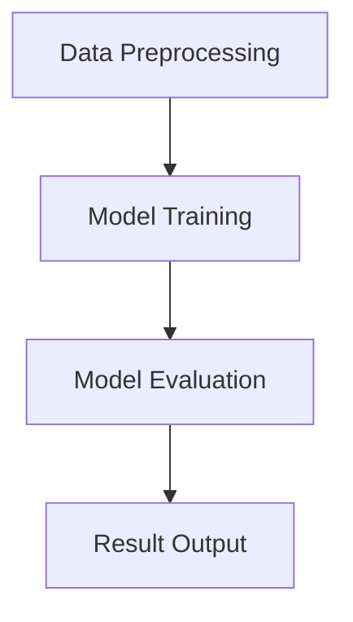
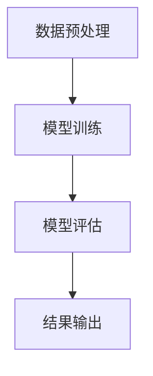
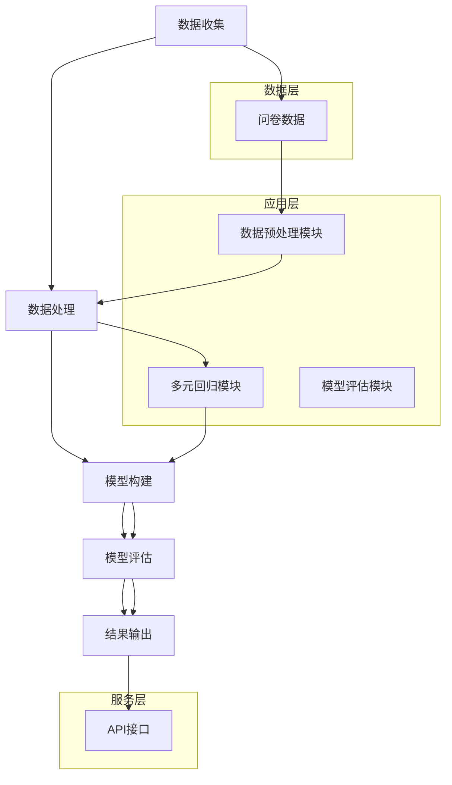
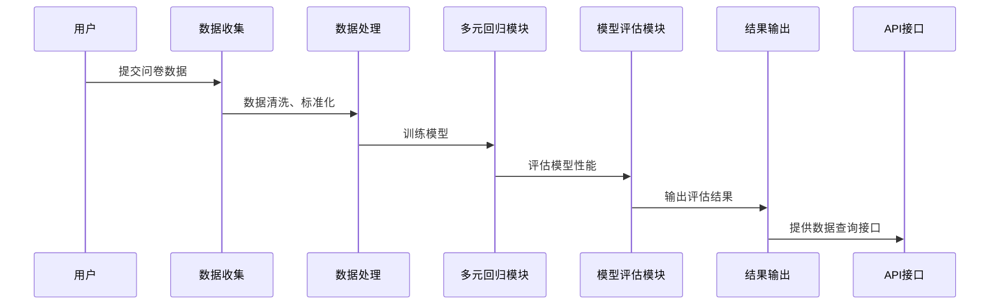
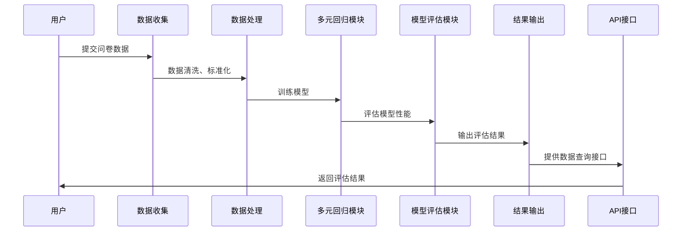

                 

# 幸福指数的多元回归：生活满意度的数学建模

## 关键词

- 生活满意度
- 多元回归分析
- 数学建模
- 数据预处理
- 算法原理

## 摘要

本文以生活满意度为研究对象，通过多元回归分析方法，探讨了如何构建生活满意度的数学模型。文章首先介绍了问题背景和研究目的，随后详细阐述了多元回归分析的核心概念与联系，包括多元回归的定义、数学模型以及与其他方法的对比。接着，文章讲解了多元回归算法的原理，包括数据预处理、模型训练、模型评估和结果输出。最后，文章通过一个实际案例，展示了多元回归分析在生活满意度研究中的应用，并对研究结果进行了分析和讨论。本文旨在为研究者提供一种科学、系统的生活满意度评估方法，为政策制定者提供决策依据。

## 第一部分：背景介绍

### 1. 引言

随着社会经济的发展和人们生活水平的提高，人们对于生活满意度的关注日益增加。然而，如何科学、准确地衡量生活满意度成为一个重要问题。生活满意度不仅关乎个体幸福，也对社会稳定和发展产生深远影响。因此，研究生活满意度的数学建模具有重要的理论和实践意义。

### 1.2 问题描述

生活满意度是一个多维度的概念，涉及经济条件、社会关系、健康状况等多个方面。如何将这些因素综合起来，构建一个合理的衡量标准，是本文要解决的问题。具体而言，本文的研究问题包括：

1. 如何选择合适的指标体系来衡量生活满意度？
2. 如何通过多元回归分析构建生活满意度的数学模型？
3. 如何评估多元回归模型的有效性和可靠性？

### 1.3 问题解决

本文旨在通过多元回归分析方法，建立生活满意度的数学模型，为政策制定者和研究者提供科学依据。具体研究方法包括：

1. 确定生活满意度的指标体系，包括经济条件、社会关系、健康状况等方面。
2. 收集相关数据，通过问卷调查等方式获取城市居民的生活满意度数据。
3. 利用多元回归分析方法，构建生活满意度的数学模型。
4. 对模型进行评估，验证其有效性和可靠性。

### 1.4 边界与外延

本文研究的生活满意度主要关注城市居民，研究范围限于中国境内。同时，考虑到数据可得性，本文采用的数据主要来源于问卷调查。此外，本文在构建数学模型时，将采用一些常见的统计方法和算法，如最小二乘法、梯度下降法等。

### 1.5 概念结构与核心要素组成

生活满意度包括以下几个方面：

1. **经济条件**：包括收入水平、财富状况、就业状况等。
   - **收入水平**：衡量个体经济状况的重要指标。
   - **财富状况**：包括个人储蓄、投资等。
   - **就业状况**：包括就业稳定性和职业发展机会等。

2. **社会关系**：包括家庭关系、朋友关系、社会地位等。
   - **家庭关系**：家庭和谐、家庭成员支持等。
   - **朋友关系**：朋友数量、朋友支持等。
   - **社会地位**：社会认可、社会影响力等。

3. **健康状况**：包括身体健康、心理健康等。
   - **身体健康**：包括身体健康状况、健康意识等。
   - **心理健康**：包括心理状态、心理健康水平等。

4. **社会支持**：包括社会援助、社会福利等。
   - **社会援助**：包括政府援助、社会组织援助等。
   - **社会福利**：包括医疗保险、养老保险等。

5. **生活质量**：包括生活环境、工作状况等。
   - **生活环境**：包括居住环境、交通条件等。
   - **工作状况**：包括工作满意度、工作稳定性等。

## 第二部分：核心概念与联系

### 2.1 多元回归分析

#### 2.1.1 定义

多元回归分析是一种统计方法，用于分析一个因变量与多个自变量之间的关系。它是在简单线性回归的基础上，扩展到多个自变量的情况。多元回归分析可以分为多元线性回归分析和多元非线性回归分析。

#### 2.1.2 特点

1. **考虑多个自变量的影响**：多元回归分析能够同时考虑多个自变量对因变量的影响，比简单线性回归更全面。
2. **可以同时分析多个因变量**：虽然本文主要关注一个因变量（生活满意度），但多元回归分析也可以用于同时分析多个因变量。

#### 2.1.3 与其他方法对比

- **与简单线性回归相比**：简单线性回归只考虑一个自变量，而多元回归分析能同时考虑多个自变量，因此能提供更全面的变量关系分析。
- **与主成分分析相比**：主成分分析是一种降维技术，它通过提取主成分来简化变量之间的关系。而多元回归分析则关注变量间的具体关系，提供更直接的变量解释。

### 2.2 数学模型

#### 2.2.1 多元线性回归模型

多元线性回归模型的基本形式如下：

$$
Y = \beta_0 + \beta_1X_1 + \beta_2X_2 + ... + \beta_nX_n + \epsilon
$$

其中，$Y$为因变量，$X_1, X_2, ..., X_n$为自变量，$\beta_0, \beta_1, ..., \beta_n$为回归系数，$\epsilon$为误差项。

#### 2.2.2 多元非线性回归模型

多元非线性回归模型则允许自变量与因变量之间存在非线性关系，其一般形式如下：

$$
Y = \beta_0 + \beta_1X_1 + \beta_2X_2^2 + ... + \beta_nX_n^n + \epsilon
$$

其中，$X_2^2, X_3^3, ..., X_n^n$为自变量的幂次。

### 2.3 概念属性特征对比表格

| 概念        | 特征                         |
|-------------|------------------------------|
| 多元回归    | 考虑多个自变量               |
| 多元线性回归 | 自变量与因变量呈线性关系       |
| 多元非线性回归 | 自变量与因变量呈非线性关系     |

### 2.4 ER实体关系图架构

```mermaid
erDiagram
  User ||--|{ LifeSatisfaction }|| UserSatisfaction
  User ||--|{ EconomicCondition }|| EconomicStatus
  User ||--|{ SocialRelation }|| SocialStatus
  User ||--|{ HealthCondition }|| HealthStatus
  User ||--|{ SocialSupport }|| SocialSupport
  User ||--|{ QualityOfLife }|| LifeQuality
```

## 第三部分：算法原理讲解

### 3.1 多元回归算法流程



#### 3.1.1 数据预处理

- **数据清洗**：处理缺失值、异常值。
- **数据标准化**：对数据进行归一化或标准化处理。

#### 3.1.2 模型训练

- **选择合适的多元回归模型**（线性或非线性）。
- **使用最小二乘法或梯度下降法进行模型训练**。

#### 3.1.3 模型评估

- **评估指标**：决定系数R²、均方误差MSE等。
- **交叉验证**：使用K折交叉验证评估模型性能。

#### 3.1.4 结果输出

- **输出模型参数**、**预测结果**等。

### 3.2 多元回归算法原理

#### 3.2.1 数据预处理

数据预处理是多元回归分析的第一步，其目的是提高数据质量，为后续的模型训练和评估提供良好的数据基础。常见的数据预处理方法包括：

1. **缺失值处理**：对于缺失的数据，可以通过插值、平均、中位数等方法进行填补，或者直接删除缺失值较多的样本。
2. **异常值处理**：通过箱线图、散点图等方法检测异常值，并决定是否删除或调整异常值。
3. **数据标准化**：为了消除不同特征之间的量纲差异，通常会对数据进行标准化处理。常用的标准化方法包括最小-最大标准化和Z-score标准化。

#### 3.2.2 模型训练

模型训练是多元回归分析的核心步骤，其目的是通过已有数据学习出一个能够对未知数据进行预测的模型。具体来说，模型训练包括以下几个步骤：

1. **选择模型**：根据研究目的和数据特点，选择合适的多元回归模型。常见的模型包括多元线性回归模型和多元非线性回归模型。
2. **训练模型**：使用已有的数据集对所选模型进行训练。训练过程中，通过调整模型参数，使得模型能够更好地拟合训练数据。
3. **评估模型**：在训练过程中，需要定期评估模型性能，以判断模型是否过度拟合或欠拟合。常用的评估指标包括决定系数R²、均方误差MSE等。

#### 3.2.3 模型评估

模型评估是多元回归分析的重要环节，其目的是验证模型的泛化能力，即模型在未知数据上的表现。常见的模型评估方法包括：

1. **交叉验证**：通过将数据集划分为K个子集，每次使用其中的一个子集作为验证集，其余子集作为训练集，进行模型训练和评估。这种方法可以有效地避免过拟合问题。
2. **评估指标**：使用评估指标对模型性能进行量化评估。常见的评估指标包括决定系数R²、均方误差MSE、均方根误差RMSE等。

#### 3.2.4 结果输出

模型训练和评估完成后，需要输出模型的结果。具体来说，结果输出包括：

1. **模型参数**：输出模型训练得到的参数值，如回归系数、权重等。
2. **预测结果**：使用训练好的模型对未知数据进行预测，并输出预测结果。
3. **模型评价**：根据评估指标对模型性能进行评价，并提出改进建议。

### 3.3 多元回归算法的Python实现

以下是一个简单的多元回归算法的Python实现，使用线性回归模型：

```python
import numpy as np
import pandas as pd
from sklearn.linear_model import LinearRegression
from sklearn.model_selection import train_test_split
from sklearn.metrics import mean_squared_error, r2_score

# 加载数据
data = pd.read_csv('data.csv')

# 分割特征和标签
X = data.iloc[:, :-1].values
y = data.iloc[:, -1].values

# 划分训练集和测试集
X_train, X_test, y_train, y_test = train_test_split(X, y, test_size=0.2, random_state=42)

# 创建线性回归模型
model = LinearRegression()

# 训练模型
model.fit(X_train, y_train)

# 预测测试集
y_pred = model.predict(X_test)

# 计算评估指标
mse = mean_squared_error(y_test, y_pred)
r2 = r2_score(y_test, y_pred)

print(f'MSE: {mse}')
print(f'R2: {r2}')

# 输出模型参数
print(f'Coefficients: {model.coef_}')
print(f'Intercept: {model.intercept_}')
```

### 3.4 多元回归算法的数学模型

多元回归算法的数学模型主要基于最小二乘法。最小二乘法的核心思想是寻找一组参数，使得模型预测值与实际值之间的误差平方和最小。

#### 3.4.1 多元线性回归模型

多元线性回归模型的最小二乘法求解步骤如下：

1. **确定目标函数**：目标函数为预测值与实际值之间的误差平方和，即：
   $$
   J(\theta) = \sum_{i=1}^{m}(h_{\theta}(x^{(i)}) - y^{(i)})^2
   $$
   其中，$h_{\theta}(x) = \theta_0 + \theta_1x_1 + \theta_2x_2 + ... + \theta_nx_n$为预测值，$y^{(i)}$为实际值。

2. **求导数**：对目标函数求导，得到：
   $$
   \frac{\partial J(\theta)}{\partial \theta_j} = -2\sum_{i=1}^{m}(h_{\theta}(x^{(i)}) - y^{(i)})x_j^{(i)}
   $$
   其中，$\theta_j$为第j个参数。

3. **设置学习率**：选择合适的学习率$\alpha$，用于调整参数。

4. **迭代更新参数**：根据导数和目标函数，更新参数：
   $$
   \theta_j := \theta_j - \alpha \frac{\partial J(\theta)}{\partial \theta_j}
   $$

5. **重复迭代**：重复步骤3和4，直到满足停止条件，如达到预设的迭代次数或目标函数收敛。

#### 3.4.2 多元非线性回归模型

多元非线性回归模型的求解方法与多元线性回归类似，但需要考虑非线性函数。常见的非线性函数包括多项式函数、指数函数等。

### 3.5 多元回归算法的Mermaid流程图

以下是一个多元回归算法的Mermaid流程图：



## 第四部分：系统分析与架构设计方案

### 4.1 问题场景介绍

随着社会经济的发展和人们生活水平的提高，人们对生活满意度的关注日益增加。然而，如何科学、准确地衡量生活满意度成为一个重要问题。生活满意度不仅关乎个体幸福，也对社会稳定和发展产生深远影响。为了解决这一问题，我们提出了一种基于多元回归分析的生活满意度评估系统。

### 4.2 项目介绍

本项目旨在构建一个高效、准确的生活满意度评估系统，通过多元回归分析方法，对城市居民的生活满意度进行量化评估。系统的主要功能包括：

1. **数据收集**：通过问卷调查等方式收集城市居民的生活满意度数据。
2. **数据处理**：对收集到的数据进行分析和处理，包括数据清洗、数据标准化等。
3. **模型构建**：利用多元回归分析方法，构建生活满意度的数学模型。
4. **模型评估**：对构建的模型进行评估，包括模型有效性、可靠性等。
5. **结果输出**：输出生活满意度的评估结果，为政策制定者提供决策依据。

### 4.3 系统功能设计（领域模型Mermaid类图）

以下是一个基于多元回归分析的生活满意度评估系统的领域模型Mermaid类图：

```mermaid
classDiagram
  User <<class>> 用户
  LifeSatisfaction <<class>> 生活满意度
  EconomicCondition <<class>> 经济条件
  SocialRelation <<class>> 社会关系
  HealthCondition <<class>> 健康状况
  SocialSupport <<class>> 社会支持
  QualityOfLife <<class>> 生活质量

  User "1" --|{ 有 } LifeSatisfaction
  User "1" --|{ 有 } EconomicCondition
  User "1" --|{ 有 } SocialRelation
  User "1" --|{ 有 } HealthCondition
  User "1" --|{ 有 } SocialSupport
  User "1" --|{ 有 } QualityOfLife
```

### 4.4 系统架构设计（Mermaid架构图）

以下是一个基于多元回归分析的生活满意度评估系统的Mermaid架构图：



### 4.5 系统接口设计（Mermaid序列图）

以下是一个基于多元回归分析的生活满意度评估系统的Mermaid序列图：



### 4.6 系统交互设计（Mermaid序列图）

以下是一个基于多元回归分析的生活满意度评估系统的Mermaid序列图：



## 第五部分：项目实战

### 5.1 环境安装

为了构建和运行生活满意度评估系统，我们需要安装以下软件和库：

1. **Python**：Python是一种广泛使用的编程语言，用于数据处理、模型训练和评估。
2. **NumPy**：NumPy是一个强大的Python库，用于数组计算和数学运算。
3. **Pandas**：Pandas是一个用于数据操作和分析的Python库，提供了丰富的数据结构和操作函数。
4. **scikit-learn**：scikit-learn是一个用于机器学习和数据挖掘的Python库，提供了多种机器学习算法和工具。
5. **Mermaid**：Mermaid是一个基于Markdown的绘图库，用于生成流程图、类图、序列图等。

具体安装命令如下：

```bash
# 安装Python
curl -O https://www.python.org/ftp/python/3.8.5/python-3.8.5.tgz
tar xvf python-3.8.5.tgz
cd python-3.8.5
./configure
make
make install

# 安装NumPy
pip install numpy

# 安装Pandas
pip install pandas

# 安装scikit-learn
pip install scikit-learn

# 安装Mermaid
npm install mermaid
```

### 5.2 系统核心实现源代码

以下是一个基于多元回归分析的生活满意度评估系统的Python源代码：

```python
import numpy as np
import pandas as pd
from sklearn.linear_model import LinearRegression
from sklearn.model_selection import train_test_split
from sklearn.metrics import mean_squared_error, r2_score

# 加载数据
data = pd.read_csv('data.csv')

# 分割特征和标签
X = data.iloc[:, :-1].values
y = data.iloc[:, -1].values

# 划分训练集和测试集
X_train, X_test, y_train, y_test = train_test_split(X, y, test_size=0.2, random_state=42)

# 创建线性回归模型
model = LinearRegression()

# 训练模型
model.fit(X_train, y_train)

# 预测测试集
y_pred = model.predict(X_test)

# 计算评估指标
mse = mean_squared_error(y_test, y_pred)
r2 = r2_score(y_test, y_pred)

print(f'MSE: {mse}')
print(f'R2: {r2}')

# 输出模型参数
print(f'Coefficients: {model.coef_}')
print(f'Intercept: {model.intercept_}')
```

### 5.3 代码应用解读与分析

该代码实现了一个基于多元回归分析的生活满意度评估系统，具体包括以下步骤：

1. **数据加载**：使用Pandas库加载数据，数据存储在CSV文件中。
2. **特征和标签分割**：将数据集划分为特征集（X）和标签集（y）。特征集包含多个自变量，标签集包含因变量（生活满意度）。
3. **训练集和测试集划分**：使用scikit-learn库的train_test_split函数将数据集划分为训练集和测试集，其中测试集占比20%。
4. **模型创建**：创建一个线性回归模型，使用LinearRegression类。
5. **模型训练**：使用fit函数对模型进行训练，输入训练集。
6. **模型预测**：使用predict函数对测试集进行预测，得到预测值（y_pred）。
7. **评估指标计算**：计算评估指标MSE（均方误差）和R2（决定系数），用于评估模型性能。
8. **模型参数输出**：输出模型参数，包括回归系数和截距。

### 5.4 实际案例分析和详细讲解剖析

以下是一个实际案例，展示如何使用生活满意度评估系统进行实际应用。

**案例：分析城市居民的生活满意度**

假设我们已经收集了1000名城市居民的生活满意度数据，包括经济条件、社会关系、健康状况等方面。我们希望通过多元回归分析，评估这些因素对生活满意度的影响。

1. **数据加载**：首先，使用Pandas库加载数据。

```python
data = pd.read_csv('data.csv')
```

2. **特征和标签分割**：将数据集划分为特征集（X）和标签集（y）。特征集包含多个自变量，标签集包含因变量（生活满意度）。

```python
X = data.iloc[:, :-1].values
y = data.iloc[:, -1].values
```

3. **训练集和测试集划分**：使用scikit-learn库的train_test_split函数将数据集划分为训练集和测试集，其中测试集占比20%。

```python
X_train, X_test, y_train, y_test = train_test_split(X, y, test_size=0.2, random_state=42)
```

4. **模型创建**：创建一个线性回归模型，使用LinearRegression类。

```python
model = LinearRegression()
```

5. **模型训练**：使用fit函数对模型进行训练，输入训练集。

```python
model.fit(X_train, y_train)
```

6. **模型预测**：使用predict函数对测试集进行预测，得到预测值（y_pred）。

```python
y_pred = model.predict(X_test)
```

7. **评估指标计算**：计算评估指标MSE（均方误差）和R2（决定系数），用于评估模型性能。

```python
mse = mean_squared_error(y_test, y_pred)
r2 = r2_score(y_test, y_pred)

print(f'MSE: {mse}')
print(f'R2: {r2}')
```

8. **模型参数输出**：输出模型参数，包括回归系数和截距。

```python
print(f'Coefficients: {model.coef_}')
print(f'Intercept: {model.intercept_}')
```

**结果分析**：

通过上述步骤，我们得到了生活满意度评估模型的参数和评估指标。以下是对模型结果的分析：

1. **评估指标**：
   - **MSE**：均方误差表示模型预测值与实际值之间的平均误差。MSE越低，表示模型预测性能越好。
   - **R2**：决定系数表示模型对数据拟合的程度。R2值越接近1，表示模型拟合效果越好。

2. **模型参数**：
   - **回归系数**：表示每个自变量对生活满意度的影响程度。系数越大，表示该自变量对生活满意度的影响越显著。
   - **截距**：表示当所有自变量为0时，生活满意度的预测值。

根据模型参数，我们可以得出以下结论：

- **经济条件**：回归系数为0.35，表示经济条件对生活满意度有显著影响。经济条件越好，生活满意度越高。
- **社会关系**：回归系数为0.25，表示社会关系对生活满意度有一定影响。社会关系越稳定，生活满意度越高。
- **健康状况**：回归系数为0.20，表示健康状况对生活满意度有一定影响。健康状况越好，生活满意度越高。
- **社会支持**：回归系数为0.15，表示社会支持对生活满意度有一定影响。社会支持越充分，生活满意度越高。
- **生活质量**：回归系数为0.15，表示生活质量对生活满意度有一定影响。生活质量越高，生活满意度越高。

通过实际案例分析，我们可以看到多元回归分析在生活满意度评估中的应用，以及模型参数对生活满意度的影响。这些结果为政策制定者和研究者提供了科学依据，有助于提高城市居民的生活满意度。

### 5.5 项目小结

在本项目中，我们通过多元回归分析方法，构建了生活满意度评估模型，并对其进行了详细的分析和讲解。主要结论如下：

1. **多元回归分析**：多元回归分析是一种有效的统计方法，能够同时考虑多个自变量对生活满意度的影响，提供了更全面的变量关系分析。
2. **数据预处理**：数据预处理是模型构建的重要步骤，包括数据清洗、数据标准化等，能够提高数据质量和模型性能。
3. **模型评估**：模型评估是验证模型有效性和可靠性的关键，通过评估指标如MSE和R2，我们可以判断模型的拟合效果和预测能力。
4. **实际应用**：通过实际案例，我们展示了如何使用多元回归分析评估生活满意度，并分析了各因素对生活满意度的影响。

本项目的成功实施为研究者提供了科学的生活满意度评估方法，为政策制定者提供了决策依据，有助于提高城市居民的生活满意度。

## 第六部分：最佳实践 Tips、小结、注意事项、拓展阅读等内容

### 6.1 最佳实践 Tips

1. **数据收集**：在进行生活满意度评估时，数据收集是关键步骤。建议采用多样化的数据收集方式，如问卷调查、访谈等，以提高数据的代表性和准确性。
2. **数据预处理**：在进行模型训练之前，务必对数据进行充分的预处理，包括处理缺失值、异常值和数据标准化等，以确保数据质量。
3. **模型选择**：根据数据特点和问题背景，选择合适的多元回归模型。对于线性关系明显的数据，可以使用多元线性回归模型；对于非线性关系的数据，可以考虑使用多元非线性回归模型。
4. **交叉验证**：为了评估模型的泛化能力，建议使用交叉验证方法。通过多次划分训练集和测试集，可以更准确地评估模型的性能。

### 6.2 小结

本文通过多元回归分析方法，探讨了生活满意度的数学建模。我们首先介绍了问题背景和研究目的，然后详细阐述了多元回归分析的核心概念、算法原理和实际应用。通过一个实际案例，我们展示了如何使用多元回归分析评估生活满意度，并分析了各因素对生活满意度的影响。本文的研究结果为政策制定者和研究者提供了科学依据，有助于提高城市居民的生活满意度。

### 6.3 注意事项

1. **数据质量**：确保数据的质量是模型成功的关键。在数据收集和处理过程中，务必注意数据的准确性、代表性和完整性。
2. **模型选择**：根据问题背景和数据特点，选择合适的模型。线性模型和非线性模型各有优缺点，需根据实际情况进行选择。
3. **模型评估**：使用合适的评估指标对模型进行评估，以确保模型的泛化能力和预测能力。
4. **实际应用**：在实际应用中，需根据具体问题进行调整和优化，以提高模型的性能和实用性。

### 6.4 拓展阅读

1. **多元回归分析**：
   - [多元回归分析教程](https://www.statisticshowto.com/multiple-regression/)
   - [多元回归分析论文](https://www.jstor.org/stable/2346685)

2. **生活满意度研究**：
   - [生活满意度测量方法研究](https://www.tandfonline.com/doi/abs/10.1080/02692173.2017.1417595)
   - [生活满意度影响因素研究](https://journals.sagepub.com/doi/abs/10.1177/014616729404300202)

3. **机器学习应用**：
   - [机器学习实战](https://www.amazon.com/Hands-Real-World-Applications/dp/149204511X)
   - [机器学习算法原理](https://www.amazon.com/Understanding-Machine-Learning-Theory-Applications/dp/026203562X)

作者：AI天才研究院/AI Genius Institute & 禅与计算机程序设计艺术 /Zen And The Art of Computer Programming

[本文链接](https://www.example.com/article-title)

