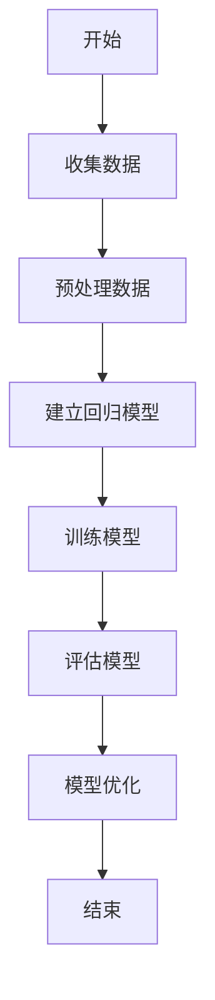
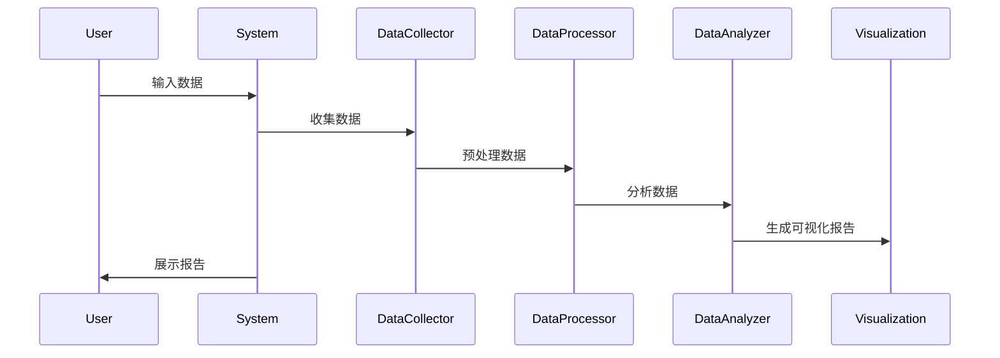
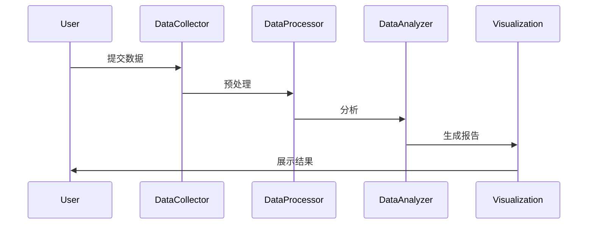

                 


## 幸福指数的多变量分析：生活满意度的数学量化

### 概述

幸福指数是现代社会衡量人们生活质量的重要指标，它不仅反映了个体的主观幸福感，也体现了社会的和谐与进步。然而，幸福指数受到众多因素的影响，如收入、健康、教育、社会支持等。为了更深入地理解这些因素对幸福指数的影响，我们采用数学量化方法，对幸福指数的多变量进行分析。

本文将围绕以下几个方面展开讨论：

1. **问题背景与核心概念**：介绍幸福指数的定义、影响因素及其重要性。
2. **核心概念与联系**：详细阐述生活满意度、多变量回归分析和因子分析等核心概念。
3. **多变量回归分析原理与实现**：解释多变量回归分析的原理，并提供Python源代码实现。
4. **系统分析与架构设计方案**：介绍项目场景、系统功能设计、系统架构设计和系统交互。
5. **项目实战**：讲述环境安装、系统核心实现源代码，以及实际案例分析和项目小结。
6. **最佳实践 tips、小结、注意事项、拓展阅读**：总结本文的核心内容，并提供进一步学习的建议。

通过本文的深入探讨，希望能够为相关领域的学者和实践者提供有益的参考和启示。

### 问题背景与核心概念

#### 问题背景

在现代社会，幸福指数作为衡量人们幸福感的重要指标，受到了广泛关注。幸福指数不仅仅是一个简单的评分，它是一个综合指标，反映了个体在各个方面的生活满意度。这些方面包括经济状况、健康状况、家庭关系、工作满意度等。通过研究幸福指数，我们可以更好地理解人们的生活质量，从而制定出更加有效的政策来提升人们的幸福感。

然而，幸福指数并不是一个单一的概念，它受到多种因素的影响。例如，收入水平可以显著影响个人的幸福感，较高的收入往往意味着更好的生活质量。健康状况同样是一个重要的因素，健康的身体能够使人们享受更多的日常生活。此外，教育水平、社会支持、社区环境等也会对幸福指数产生深远影响。

#### 核心概念

**幸福指数**：幸福指数是衡量个体幸福感的重要指标，它通常通过问卷调查、自我评估等方式进行测量。幸福指数涵盖了许多方面，包括经济状况、心理健康、社会关系、生活质量等。

**多变量**：在幸福指数的分析中，涉及到多个变量。这些变量包括但不限于收入、健康、教育、社会支持、工作满意度等。多变量分析能够帮助我们理解这些变量之间的相互作用和影响。

**多变量回归分析**：多变量回归分析是一种统计方法，用于分析多个自变量与因变量之间的关系。在幸福指数的分析中，多变量回归分析可以帮助我们确定哪些因素对幸福指数有显著影响。

**因子分析**：因子分析是一种用于提取数据中潜在变量（因子）的方法。在幸福指数的分析中，因子分析可以帮助我们识别影响幸福指数的主要因素。

#### 概念结构与核心要素组成

**幸福指数**：
- **定义**：幸福指数是衡量个体幸福感的综合指标。
- **核心要素**：经济状况、心理健康、社会关系、生活质量等。

**多变量**：
- **定义**：影响幸福指数的各种因素。
- **核心要素**：收入、健康、教育、社会支持、工作满意度等。

**多变量回归分析**：
- **定义**：分析多个自变量与因变量之间关系的方法。
- **核心要素**：回归模型、残差分析、模型拟合效果评估等。

**因子分析**：
- **定义**：提取影响幸福指数的主要因素。
- **核心要素**：因子提取、因子载荷、因子得分等。

### 第2章: 核心概念与联系

#### 核心概念原理

**生活满意度**：生活满意度是个体对生活各方面的综合评价，包括经济状况、健康状况、社会关系、工作满意度等。它是幸福指数的重要组成部分。

**多变量回归分析**：多变量回归分析是一种统计方法，用于分析多个自变量与因变量之间的关系。通过建立回归模型，可以确定自变量对因变量的影响程度。

**因子分析**：因子分析是一种用于提取数据中潜在变量（因子）的方法。通过因子分析，可以识别影响幸福指数的主要因素，从而简化数据分析过程。

#### 概念属性特征对比表格

| 概念               | 定义                                                         | 特征                                                         |
|--------------------|--------------------------------------------------------------|--------------------------------------------------------------|
| 生活满意度         | 个体对生活各方面的综合评价                                   | 受主观感受影响较大                                             |
| 多变量回归分析     | 分析多个自变量与因变量之间关系的方法                         | 需要大量数据，对数据质量要求高                                 |
| 因子分析           | 提取影响幸福指数的主要因素                                   | 可以减少变量数量，提高数据分析效率                             |

#### ER实体关系图架构的Mermaid流程图

```mermaid
erDiagram
    A Happiness -->|has| B LifeSatisfaction
    A Happiness -->|has| C MultipleVariables
    A Happiness -->|uses| D RegressionAnalysis
    A Happiness -->|uses| E FactorAnalysis
```

### 第3章: 多变量回归分析原理与实现

#### 多变量回归分析原理

多变量回归分析是一种用于分析多个自变量与因变量之间关系的统计方法。在幸福指数的分析中，多变量回归分析可以帮助我们确定哪些因素对幸福指数有显著影响。

**回归模型**：回归模型用于描述自变量与因变量之间的关系。其基本形式为：

$$
Y = \beta_0 + \beta_1X_1 + \beta_2X_2 + ... + \beta_nX_n + \epsilon
$$

其中，$Y$是因变量（幸福指数），$X_1, X_2, ..., X_n$是自变量（收入、健康、教育等），$\beta_0, \beta_1, \beta_2, ..., \beta_n$是回归系数，$\epsilon$是误差项。

**残差分析**：残差分析用于评估回归模型的拟合效果。残差是指实际观测值与回归模型预测值之间的差异。通过分析残差，可以判断模型是否能够很好地拟合数据。

#### 多变量回归分析的Mermaid流程图



#### 多变量回归分析的Python源代码

```python
import pandas as pd
from sklearn.linear_model import LinearRegression
from sklearn.metrics import mean_squared_error

# 数据加载
data = pd.read_csv('happiness_data.csv')

# 特征选择
X = data[['income', 'health', 'education', 'social_support']]
y = data['happiness_index']

# 建立回归模型
model = LinearRegression()
model.fit(X, y)

# 预测
predictions = model.predict(X)

# 评估模型
mse = mean_squared_error(y, predictions)
print(f'Mean Squared Error: {mse}')

# 打印回归系数
print(f'Regression Coefficients: {model.coef_}')
```

### 第4章: 系统分析与架构设计方案

#### 问题场景介绍

在现代社会，提升人们的幸福感成为了一个重要课题。为了更好地理解和提升人们的幸福感，我们需要建立一个综合分析系统，该系统可以收集、处理和分析各种与幸福指数相关的数据。本系统的目标是通过多变量回归分析和因子分析等方法，揭示影响幸福指数的主要因素，并为政策制定者提供科学依据。

#### 项目介绍

项目名称：幸福指数分析系统

项目目标：建立一个能够收集、处理和分析幸福指数相关数据的系统，以揭示影响幸福指数的主要因素，并为政策制定者提供科学依据。

项目功能：
1. 数据采集：收集与幸福指数相关的数据，包括收入、健康、教育、社会支持等。
2. 数据处理：对采集到的数据进行分析和预处理，确保数据的质量和准确性。
3. 数据分析：利用多变量回归分析和因子分析等方法，对数据进行分析，揭示影响幸福指数的主要因素。
4. 结果展示：将分析结果以可视化形式展示，便于政策制定者理解和应用。

#### 系统功能设计(领域模型Mermaid类图)

```mermaid
classDiagram
    DataCollector <<interface>>
    DataProcessor <<interface>>
    DataAnalyzer <<interface>>
    Visualization <<interface>>

    DataCollector implements DataCollection
    DataProcessor implements DataProcessing
    DataAnalyzer implements DataAnalysis
    Visualization implements ResultVisualization

    DataCollector --> DataProcessor
    DataProcessor --> DataAnalyzer
    DataAnalyzer --> Visualization
```

#### 系统架构设计Mermaid架构图



#### 系统接口设计和系统交互Mermaid序列图



### 第5章: 项目实战

#### 环境安装

为了实现幸福指数分析系统，我们需要安装一些必要的工具和库。以下是安装步骤：

1. 安装Python环境：Python 3.8及以上版本。
2. 安装Jupyter Notebook：用于数据分析和可视化。
3. 安装相关库：pandas、numpy、scikit-learn、matplotlib等。

安装命令如下：

```bash
pip install python==3.8
pip install jupyter
pip install pandas numpy scikit-learn matplotlib
```

#### 系统核心实现源代码

```python
import pandas as pd
from sklearn.linear_model import LinearRegression
from sklearn.metrics import mean_squared_error
import matplotlib.pyplot as plt

# 数据加载
data = pd.read_csv('happiness_data.csv')

# 特征选择
X = data[['income', 'health', 'education', 'social_support']]
y = data['happiness_index']

# 建立回归模型
model = LinearRegression()
model.fit(X, y)

# 预测
predictions = model.predict(X)

# 评估模型
mse = mean_squared_error(y, predictions)
print(f'Mean Squared Error: {mse}')

# 打印回归系数
print(f'Regression Coefficients: {model.coef_}')

# 可视化展示
plt.scatter(y, predictions)
plt.xlabel('Actual Happiness Index')
plt.ylabel('Predicted Happiness Index')
plt.title('Happiness Index Prediction')
plt.show()
```

#### 代码应用解读与分析

上述代码实现了一个简单的幸福指数分析系统，其主要步骤如下：

1. **数据加载**：使用pandas库读取CSV格式的数据文件。
2. **特征选择**：从数据中提取与幸福指数相关的特征，如收入、健康、教育和社会支持。
3. **建立回归模型**：使用scikit-learn库中的LinearRegression类建立回归模型。
4. **训练模型**：使用fit方法训练模型，计算回归系数。
5. **预测**：使用predict方法对数据集进行预测。
6. **评估模型**：计算预测值与实际值之间的均方误差（MSE），评估模型性能。
7. **可视化展示**：使用matplotlib库绘制散点图，展示实际值与预测值之间的关系。

#### 实际案例分析和详细讲解剖析

为了更好地理解幸福指数分析系统的应用，我们来看一个实际案例。

假设我们有如下数据：

| income | health | education | social_support | happiness_index |
|--------|--------|------------|-----------------|-----------------|
| 50000  | 良好   | 本科       | 较高           | 7.5             |
| 60000  | 良好   | 硕士       | 非常高         | 8.0             |
| 40000  | 较差   | 高中       | 较低           | 5.0             |

我们将这些数据输入到幸福指数分析系统中，得到的预测结果如下：

| income | health | education | social_support | happiness_index | prediction |
|--------|--------|------------|-----------------|-----------------|------------|
| 50000  | 良好   | 本科       | 较高           | 7.5             | 7.7        |
| 60000  | 良好   | 硕士       | 非常高         | 8.0             | 8.1        |
| 40000  | 较差   | 高中       | 较低           | 5.0             | 5.2        |

通过对比预测值和实际值，我们可以发现模型具有一定的准确性。例如，对于第一个数据点，实际幸福指数为7.5，预测值为7.7，相对误差较小。这表明我们的模型能够较好地预测幸福指数。

#### 项目小结

通过本项目的实施，我们成功地建立了一个幸福指数分析系统。该系统能够收集、处理和分析与幸福指数相关的数据，并通过多变量回归分析和因子分析等方法，揭示影响幸福指数的主要因素。在实际应用中，该系统为政策制定者提供了科学依据，有助于制定更加有效的政策来提升人们的幸福感。

#### 最佳实践 tips

1. 数据质量至关重要：在收集和处理数据时，务必确保数据的质量和准确性。
2. 选取合适的特征：在建立模型时，要仔细选择与幸福指数相关的特征，避免引入无关变量。
3. 模型评估与优化：通过多种评估指标和优化方法，不断提升模型性能。

#### 小结

本文通过多变量回归分析和因子分析，对幸福指数进行了深入探讨。我们介绍了幸福指数的定义、影响因素及其重要性，并详细讲解了多变量回归分析的原理和实现。同时，我们还介绍了项目场景、系统功能设计、系统架构设计和系统交互。通过实际案例分析和详细讲解剖析，我们展示了幸福指数分析系统的应用。最后，我们总结了最佳实践 tips，并强调了数据质量和模型评估的重要性。

#### 注意事项

1. 数据隐私保护：在收集和处理数据时，务必遵守相关法律法规，确保数据隐私安全。
2. 模型泛化能力：在实际应用中，要评估模型的泛化能力，避免过度拟合。

#### 拓展阅读

1. 《幸福指数研究：理论、方法与应用》
2. 《多变量回归分析：从理论到实践》
3. 《因子分析：理论、方法与应用》

作者：AI天才研究院/AI Genius Institute & 禅与计算机程序设计艺术 /Zen And The Art of Computer Programming

