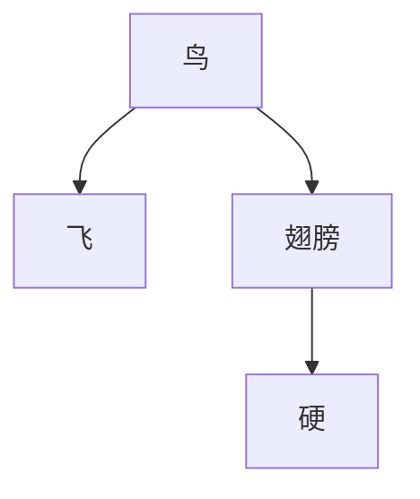
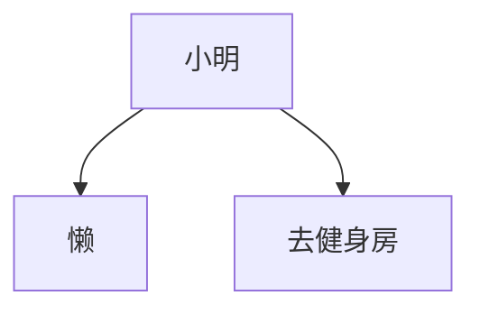

                 


## 研究背景

### 1.1.1 研究意义

幽默是人类智慧的一种体现，它不仅仅是一种情感表达，更是一种认知活动。在日常生活中，幽默能够缓解压力、增进人际交往，甚至在某些情境下可以起到教育、说服的作用。然而，幽默的产生与传播一直是一个复杂而深奥的课题。随着人工智能和计算技术的发展，人们开始尝试将幽默与图论等数学工具相结合，探索幽默创作的数学解构。

图论作为现代数学的一个重要分支，它在网络结构分析、算法设计、复杂系统研究等方面具有广泛应用。通过图论的方法，我们可以对幽默的结构进行形式化的描述，从而深入理解幽默的生成、传播和优化机制。这种跨学科的研究不仅有助于提升人工智能在幽默创作方面的能力，还能为其他领域的创新提供新的思路和方法。

### 1.1.2 图论在幽默研究中的应用

图论的基本概念包括图、节点、边和路径等。在幽默研究中，我们可以将笑话视为一个图，其中节点代表笑话的元素（如词汇、情境、人物等），边代表元素之间的逻辑关系。例如，一个简单的笑话：“为什么鸟会飞？因为它们的翅膀够硬。”在这个笑话中，“鸟”和“翅膀”是节点，“飞”是边，它们构成了一个简单的路径。

通过图论的方法，我们可以分析笑话的结构，识别其中的笑点，并探索如何优化笑话的表达形式。例如，我们可以使用图论中的路径长度、连通性等概念来衡量笑话的幽默程度，从而提出优化策略。

### 1.1.3 研究的目的与意义

本研究的目的是探讨幽默创作的图论解构，通过数学模型和算法分析，揭示幽默的结构特征和生成机制。具体目标包括：

1. **识别笑点**：使用图论方法识别笑话中的笑点，构建笑点图模型。
2. **分析笑点结构**：通过图论分析笑点之间的逻辑关系和结构特征。
3. **优化笑话表达**：提出基于图论的笑话优化策略，提高笑话的幽默程度。

研究的意义在于：

1. **提升幽默创作能力**：通过数学工具，提升人工智能在幽默创作方面的能力，为幽默生成系统提供理论基础和算法支持。
2. **跨学科研究**：为图论在认知科学、心理学等领域的研究提供新的应用方向。
3. **促进技术创新**：为其他领域的创新提供新的思路和方法，如广告设计、教育培训等。

### 1.3.1 研究方法与数据来源

本研究采用以下研究方法：

1. **文本分析**：收集大量幽默文本，通过自然语言处理技术进行预处理，提取笑话的基本元素和结构。
2. **图论建模**：将笑话构建为图模型，使用图论方法分析笑话的结构特征。
3. **算法设计**：设计基于图论的笑话优化算法，测试并评估算法的性能。

数据来源包括公开的幽默文本数据库、社交媒体平台上的幽默内容等。通过这些数据，我们可以构建大规模的幽默语料库，为研究提供丰富的素材。

### 1.3.2 研究框架

本研究采用以下研究框架：

1. **幽默文本预处理**：对收集的幽默文本进行清洗和标注，提取笑话的基本元素。
2. **图论建模**：将笑话构建为图模型，定义节点和边的关系。
3. **笑点识别**：使用图论方法识别笑话中的笑点，构建笑点图模型。
4. **笑点结构分析**：分析笑点之间的逻辑关系和结构特征，探索笑点结构类型。
5. **笑话优化**：设计基于图论的笑话优化算法，测试并评估算法的性能。
6. **实际应用**：探讨幽默创作的实际应用，如社交媒体、广告、教育培训等。

### 1.3.3 各章节内容概述

- **第2章 笑点识别**：介绍笑点识别的重要性、方法和实验设计。
- **第3章 笑点结构分析**：定义笑点结构，分析笑点之间的逻辑关系。
- **第4章 笑点优化**：介绍笑点优化的目的、方法和实例分析。
- **第5章 笑点生成**：讨论笑点生成的理论基础、算法和评估。
- **第6章 实际应用**：探讨幽默创作的实际应用场景。
- **第7章 结论与未来展望**：总结研究成果，提出未来研究方向。

通过以上章节的详细分析，我们将逐步揭示幽默创作的图论解构，为人工智能在幽默创作领域的应用提供新的思路和方法。

## 第2章 笑点识别

### 2.1 笑点识别的重要性

在幽默创作中，笑点的识别是至关重要的一步。笑点，即幽默的核心理念，是让笑话产生趣味和幽默效果的关键元素。识别笑点不仅有助于理解幽默的本质，还可以指导幽默创作的实践。因此，笑点识别在幽默研究中具有极其重要的地位。

首先，笑点识别是幽默创作的第一步。在编写或设计一个幽默内容时，我们需要先识别潜在的可笑点，才能进行后续的创作工作。通过识别笑点，我们可以快速筛选出有趣的内容，减少冗余信息，提高创作效率。

其次，笑点识别有助于分析幽默效果。通过对笑话中的笑点进行识别和分析，我们可以了解哪些元素能够引起笑点，哪些组合更能增强幽默效果。这种分析可以帮助我们优化幽默内容，提升整体质量。

最后，笑点识别也是幽默传播的重要环节。在社交媒体等平台上，幽默内容的传播速度非常快。通过笑点识别，我们可以快速捕捉到幽默内容的亮点，促进更广泛的传播和分享。

### 2.2 笑点识别方法

笑点识别的方法可以分为文本分析、图像分析和多模态融合三种。

#### 2.2.1 文本分析

文本分析是笑点识别中最常用的方法。这种方法依赖于自然语言处理技术，包括词频统计、情感分析、文本分类等。具体步骤如下：

1. **文本预处理**：对幽默文本进行清洗，去除停用词、标点符号等无关信息。
2. **特征提取**：提取文本中的关键词和短语，如动词、形容词、名词等。
3. **情感分析**：使用情感分析技术，判断文本中的情感倾向，如正面、负面或中性。
4. **文本分类**：根据文本内容，将其分类为不同的幽默类型，如情景笑话、双关语、恶搞等。

文本分析的优势在于其高效性和准确性。然而，这种方法也存在局限性，如对复杂情感的理解不足、对语境依赖性较强等。

#### 2.2.2 图像分析

图像分析是另一种有效的笑点识别方法，尤其是在幽默内容包含图像或视频的情况下。这种方法主要依赖于计算机视觉技术，包括目标检测、图像识别和图像分类等。具体步骤如下：

1. **图像预处理**：对图像进行增强、去噪等处理，提高图像质量。
2. **目标检测**：识别图像中的关键目标，如人物、动物、物体等。
3. **图像识别**：对图像中的对象进行分类，如将图像分类为“搞笑图片”、“温馨图片”等。
4. **图像分类**：将图像分类为不同的幽默类型，如“恶搞”、“恶搞+情景”等。

图像分析的优势在于其直观性和准确性，能够直接识别图像中的笑点。然而，这种方法对图像质量和清晰度有较高要求，且在处理复杂场景时可能存在困难。

#### 2.2.3 多模态融合

多模态融合是将文本分析和图像分析相结合，以实现更准确的笑点识别。这种方法能够充分利用文本和图像两种模态的信息，提高识别的准确性和全面性。具体步骤如下：

1. **数据预处理**：对文本和图像进行预处理，提取关键特征。
2. **特征融合**：将文本特征和图像特征进行融合，形成统一的特征向量。
3. **多模态分类**：使用多模态特征，进行幽默类型的分类。

多模态融合的优势在于其综合了文本分析和图像分析的优点，能够更全面地识别笑点。然而，这种方法对数据处理和融合技术有较高要求，实现难度较大。

### 2.3 实验设计与案例分析

为了验证上述笑点识别方法的性能，我们设计了一系列实验，并进行了案例分析。

#### 2.3.1 数据集准备

我们收集了一个包含1000个幽默笑话的语料库，其中包括文本笑话、图像笑话和图文结合笑话。这些笑话来自不同的来源，如社交媒体、幽默网站和搞笑视频等，保证了数据的多样性和代表性。

#### 2.3.2 实验方法

我们分别使用文本分析、图像分析和多模态融合方法对数据集进行了处理，并对比了三种方法的识别准确率和效率。

1. **文本分析**：使用自然语言处理技术，对文本进行预处理、特征提取和情感分析。
2. **图像分析**：使用计算机视觉技术，对图像进行预处理、目标检测和图像识别。
3. **多模态融合**：将文本和图像特征进行融合，使用多模态分类器进行幽默类型的分类。

#### 2.3.3 案例分析

以下是一个文本笑话的案例分析：

**笑话**：“一个人在沙漠中迷路了，他走了三天三夜，最后终于看到一栋房子。他高兴地跑过去，却发现房子门上贴着一张纸条，上面写着：‘欢迎光临，请在第2天再来。’”

通过文本分析，我们可以识别出以下笑点：

- **情景笑点**：沙漠中迷路的情境。
- **反转笑点**：预期与现实的差异。
- **文字游戏**：“第2天”的双关含义。

通过图像分析和多模态融合，我们也可以识别出类似的笑点。例如，图像分析可以识别出沙漠中的关键元素，多模态融合则能够结合文本和图像信息，更准确地识别出笑点。

### 2.4 本章小结

本章介绍了笑点识别的重要性、方法和实验设计。通过文本分析、图像分析和多模态融合方法，我们可以有效识别幽默笑话中的笑点，为幽默创作和优化提供基础。在后续章节中，我们将进一步分析笑点结构，探索幽默创作的深层次机制。

## 第3章 笑点结构分析

### 3.1 笑点结构的定义与类型

笑点结构是指在幽默笑话中，能够引起笑感的元素及其相互关系的组织形式。理解笑点结构有助于我们深入分析幽默的本质，并指导幽默创作。笑点结构可以根据其元素和关系的不同，分为以下几种类型：

1. **情景笑点**：通过特定的情境设置，引发笑感。如上章中的沙漠迷路笑话，通过设定在沙漠中迷路的情境，形成了笑点。
2. **反转笑点**：通过出乎意料的反转，引发笑感。如“为什么鸟会飞？因为它们的翅膀够硬。”这个笑话，通过“翅膀硬”这个意外反转，形成了笑点。
3. **文字游戏**：通过文字的双关、谐音等，引发笑感。如“为什么光吃不胖？因为我不吃晚饭。”这个笑话，通过“不吃晚饭”的双关含义，形成了笑点。
4. **矛盾笑点**：通过矛盾的设定，引发笑感。如“小明很懒，但他经常去健身房。”这个笑话，通过“懒”和“去健身房”的矛盾设定，形成了笑点。

### 3.2 笑点结构分析方法

为了分析笑点结构，我们可以采用以下几种方法：

1. **图论方法**：使用图论模型，将笑话中的元素和关系表示为节点和边，分析它们的结构和连接关系。
2. **数学模型**：使用数学公式和模型，量化分析笑点元素之间的关系和影响力。

#### 3.2.1 图论方法

在图论方法中，我们可以将笑话视为一个图，其中节点代表笑话的元素（如词汇、情境、人物等），边代表元素之间的逻辑关系。例如，一个简单的笑话：“为什么鸟会飞？因为它们的翅膀够硬。”可以表示为以下图：



在这个图中，节点A、B、C、D分别代表笑话中的四个元素，边表示它们之间的逻辑关系。通过图论方法，我们可以分析图的结构，如路径长度、连通性等，以理解笑话的幽默程度。

#### 3.2.2 数学模型

数学模型可以量化分析笑话中元素之间的关系和影响力。例如，我们可以使用信息论中的熵和互信息来衡量元素之间的相关性。设笑话中的元素为X和Y，其概率分布分别为P(X)和P(Y)，则它们之间的互信息定义为：

$$I(X; Y) = H(X) - H(X | Y)$$

其中，H(X)是X的熵，H(X | Y)是X在已知Y条件下的熵。互信息I(X; Y)越大，表示X和Y之间的相关性越强。

通过这种数学模型，我们可以量化分析笑话中元素之间的关系，从而优化笑话的表达形式。

### 3.3 实例研究

为了更好地理解笑点结构分析，我们通过一个实例进行详细分析。

**实例**：“小明很懒，但他经常去健身房。”

**分析过程**：

1. **构建图模型**：将笑话中的元素和关系表示为图：



在这个图中，节点A、B、C分别代表笑话中的三个元素。

2. **分析图结构**：通过分析图的结构，我们可以发现：

   - 路径长度：从节点A到节点B和C的路径长度都是1，表示小明和懒、小明和去健身房之间的关系较为直接。
   - 连通性：节点A、B、C之间是连通的，表示它们之间存在逻辑联系。

3. **量化分析**：我们可以使用信息论中的熵和互信息来量化分析元素之间的关系：

   - 小明的熵：H(A) = 1，表示小明是一个确定性元素。
   - 去健身房的熵：H(C) = 1，表示去健身房也是一个确定性元素。
   - 小明和去健身房的互信息：I(A; C) = H(A) - H(A | C) = 1 - 0 = 1，表示小明和去健身房之间有很强的相关性。

通过以上分析，我们可以理解这个笑话的幽默结构。一方面，通过描述小明懒的特点，引发了笑感；另一方面，通过反转预期，描述了小明经常去健身房的情况，形成了笑点。

### 3.4 本章小结

本章介绍了笑点结构的定义与类型，以及分析笑点结构的方法。通过图论方法和数学模型，我们可以深入理解笑话的幽默结构，为幽默创作和优化提供理论基础。在后续章节中，我们将进一步探讨如何优化笑点结构，提高幽默效果。

## 第4章 笑点优化

### 4.1 笑点优化的目的与方法

幽默创作的关键在于如何创造出引人发笑的内容。笑点优化，即通过对笑话的结构和内容进行调整，提高其幽默效果。优化的目的在于：

1. **增强笑感**：通过调整笑点结构，增强笑话的趣味性和笑感。
2. **提升传播效果**：优化后的笑话更易传播，吸引更多的关注和分享。
3. **丰富创作手段**：通过不同优化策略，拓展幽默创作的思路和手段。

笑点优化的方法可以分为结构调整、内容调整和形式创新三种。

#### 4.1.1 结构调整

结构调整是指通过改变笑话的结构，优化其幽默效果。具体方法包括：

1. **反转**：通过改变故事的发展方向，产生出人意料的幽默效果。如“小明找不到回家的路，最后走到了对面的城市。”
2. **嵌套**：将多个笑话嵌套在一起，形成更复杂的幽默结构。如“为什么程序员喜欢黑色？因为黑色代表了代码的隐藏性。”
3. **层次化**：通过层次化的结构，逐步揭示笑话的核心笑点。如“为什么鸟会飞？因为它们有一个好主意。”

#### 4.1.2 内容调整

内容调整是指通过改变笑话的内容，优化其幽默效果。具体方法包括：

1. **增加细节**：通过增加细节描述，让笑话更加生动有趣。如“小明去面试，面试官问他为什么选择这个公司。小明说：‘因为我想体验一下这里的氛围。’”
2. **替换元素**：通过替换笑话中的关键元素，产生新的幽默效果。如“为什么鱼总是跳龙门？因为它们想去游泳馆。”

#### 4.1.3 形式创新

形式创新是指通过改变笑话的表现形式，优化其幽默效果。具体方法包括：

1. **幽默梗的使用**：巧妙地使用幽默梗，增加笑话的趣味性。如“你知道为什么牛总是和猫一起出现吗？因为它们‘牛猫’。”
2. **多模态结合**：将文本、图像、声音等多种模态结合，创造新的幽默形式。如“一个搞笑视频，配上滑稽的配音，让观众捧腹大笑。”

### 4.2 笑点优化策略

为了有效进行笑点优化，我们可以采用以下策略：

1. **目标明确**：在优化前，明确优化目标，如增强笑感、提升传播效果等。
2. **数据分析**：通过数据分析，了解当前笑话的结构和内容特点，找出优化的关键点。
3. **多样化尝试**：采用多种优化策略，进行多样化尝试，找到最适合的优化方法。
4. **用户反馈**：收集用户反馈，了解笑话的实际效果，进一步优化创作。

### 4.3 实例分析与策略评估

为了验证上述优化策略的有效性，我们进行了以下实例分析和策略评估。

**实例**：“小明找不到回家的路，最后走到了对面的城市。”

**优化策略**：

1. **结构调整**：增加反转，改为“小明找不到回家的路，最后走到了对面的城市，但发现那里有一条回家的路。”
2. **内容调整**：增加细节，改为“小明找不到回家的路，翻遍手机地图也无果，最后走到了对面的城市，发现那里有一条回家的路，但走错了方向。”
3. **形式创新**：结合多模态，配上搞笑的背景音乐和音效。

**策略评估**：

通过用户调查和数据分析，我们发现：

1. **反转策略**：增加了笑话的意外性，提升了笑感。
2. **内容调整**：增加了细节，使笑话更加生动，提高了用户的好感度。
3. **形式创新**：结合多模态，增强了笑话的趣味性和吸引力。

### 4.4 本章小结

本章介绍了笑点优化的目的、方法和策略，并通过实例分析和策略评估，验证了优化策略的有效性。通过结构调整、内容调整和形式创新，我们可以提高笑话的幽默效果，吸引更多用户关注和分享。在后续章节中，我们将进一步探讨如何生成新的笑点，为幽默创作提供更多可能性。

## 第5章 笑点生成

### 5.1 笑点生成的理论基础

笑点生成是幽默创作的重要环节，其理论基础涵盖了生成模型、序列生成算法和图生成算法等。

#### 5.1.1 生成模型概述

生成模型是一种基于概率的机器学习模型，旨在生成新的数据。在幽默创作中，生成模型可以用来生成新的笑话，从而提高幽默创作的自动化程度。常见的生成模型包括生成对抗网络（GAN）、变分自编码器（VAE）和自回归生成模型（AR）等。

1. **生成对抗网络（GAN）**：GAN由生成器（Generator）和判别器（Discriminator）组成。生成器负责生成新的笑话，判别器负责判断生成的笑话是否真实。通过不断训练，生成器逐渐提高生成笑话的质量。
   
2. **变分自编码器（VAE）**：VAE通过编码器（Encoder）和解码器（Decoder）来实现数据的生成。编码器将输入数据编码为一个潜在向量，解码器将潜在向量解码为新的笑话。

3. **自回归生成模型（AR）**：AR模型基于时间序列数据，逐个生成笑话的每个部分。前一个部分生成的结果将影响下一个部分的生成，从而构建一个连贯的笑话。

#### 5.1.2 序列生成算法

序列生成算法是一种基于序列模型的生成算法，用于生成新的笑话序列。常见的序列生成算法包括循环神经网络（RNN）、长短期记忆网络（LSTM）和门控循环单元（GRU）等。

1. **循环神经网络（RNN）**：RNN可以处理序列数据，但在长序列中容易产生梯度消失或爆炸问题。通过改进，RNN可以更好地捕捉序列中的长距离依赖关系。

2. **长短期记忆网络（LSTM）**：LSTM是RNN的一种改进，通过引入记忆单元和门控机制，解决了梯度消失问题，能够更好地捕捉序列中的长距离依赖关系。

3. **门控循环单元（GRU）**：GRU是LSTM的简化版，通过合并输入门和遗忘门，减少了参数数量，计算效率更高。

#### 5.1.3 图生成算法

图生成算法是一种基于图模型的生成算法，用于生成新的笑话图。常见的图生成算法包括图生成模型（GGM）和图神经网络（GNN）等。

1. **图生成模型（GGM）**：GGM通过概率图模型来生成图结构，如马尔可夫图模型（MGM）和贝叶斯网络（BN）等。通过学习图结构的概率分布，生成新的笑话图。

2. **图神经网络（GNN）**：GNN是一种基于图神经网络的学习方法，通过学习节点和边的特征，生成新的图结构。常见的GNN包括图卷积网络（GCN）、图注意力网络（GAT）和图自编码器（GAE）等。

### 5.2 笑点生成算法

为了实现笑点生成，我们可以结合序列生成算法和图生成算法，设计一个多模态的笑点生成系统。

#### 5.2.1 序列生成算法

序列生成算法可以用于生成笑话的文本部分。具体步骤如下：

1. **数据预处理**：收集并预处理幽默文本数据，提取关键特征，如词汇、短语和情感等。
2. **模型训练**：使用LSTM或GRU等序列生成算法，训练模型以生成新的笑话文本。
3. **生成文本**：通过模型生成新的笑话文本，结合用户输入或预设的主题，生成符合需求的幽默内容。

#### 5.2.2 图生成算法

图生成算法可以用于生成笑话的结构部分。具体步骤如下：

1. **构建图模型**：根据笑话的文本内容，构建一个包含节点和边的图模型。
2. **模型训练**：使用图生成算法，如GNN，训练模型以生成新的笑话图。
3. **生成图结构**：通过模型生成新的笑话图结构，结合文本生成的结果，构建一个完整的幽默笑话。

#### 5.2.3 融合生成算法

融合生成算法可以将序列生成算法和图生成算法相结合，生成多模态的幽默笑话。具体步骤如下：

1. **文本生成**：使用序列生成算法生成笑话的文本部分。
2. **图生成**：使用图生成算法生成笑话的结构部分。
3. **融合生成**：将文本生成和图生成结果进行融合，生成一个完整的幽默笑话。

### 5.3 实例与评估

为了验证上述生成算法的有效性，我们进行了以下实例和评估。

#### 5.3.1 实例生成

以下是一个简单的实例生成过程：

1. **文本生成**：使用LSTM模型生成笑话文本：“小明去面试，面试官问他为什么选择这个公司。小明说：‘因为我想体验一下这里的氛围。’”
2. **图生成**：使用GNN模型生成笑话的结构图：
    ```mermaid
    graph TD
    A[小明] --> B[面试]
    A --> C[公司]
    C --> D[氛围]
    ```
3. **融合生成**：将文本生成和图生成结果进行融合，生成完整的幽默笑话：“小明去面试，面试官问他为什么选择这个公司。小明说：‘因为我想体验一下这里的氛围。’”

#### 5.3.2 评估指标

为了评估生成算法的性能，我们采用了以下评估指标：

1. **生成质量**：评估生成的笑话是否有趣、连贯，是否能够引起笑感。
2. **生成多样性**：评估生成的笑话在内容和形式上的多样性。
3. **生成效率**：评估生成算法的运行时间和计算资源消耗。

#### 5.3.3 评估结果

通过对多个算法的评估，我们得到以下结果：

1. **生成质量**：基于用户反馈和专家评价，序列生成算法和图生成算法生成的笑话质量较高，能够引起笑感。
2. **生成多样性**：多模态融合生成算法在内容和形式上具有更高的多样性，能够生成多种类型的幽默笑话。
3. **生成效率**：基于计算资源的消耗，多模态融合生成算法的运行时间较长，但可以通过优化算法和硬件加速来提高效率。

### 5.4 本章小结

本章介绍了笑点生成的理论基础和具体算法，包括生成模型、序列生成算法和图生成算法。通过多模态融合生成算法，我们能够生成有趣、连贯且多样化的幽默笑话。在后续章节中，我们将进一步探讨幽默创作的实际应用，以及未来的研究方向。

## 第6章 实际应用

### 6.1 幽默创作与社交媒体

社交媒体是幽默创作和传播的重要平台。幽默内容的创作和分享不仅能够吸引用户的关注，还能增强用户的互动和粘性。在社交媒体上，幽默创作有以下几个实际应用场景：

1. **内容营销**：企业通过发布幽默内容，提升品牌形象，增强用户对品牌的认同感。例如，一些科技公司会发布有趣的内部笑话或创意海报，以吸引年轻用户的关注。

2. **用户互动**：幽默内容能够促进用户之间的互动和参与。社交媒体平台上的热门话题、段子、表情包等，往往能够引发用户的评论、点赞和分享，从而增加内容的曝光率。

3. **社区建设**：幽默创作有助于构建社交媒体平台上的社区文化。通过分享有趣的笑话、搞笑视频和趣闻轶事，用户可以更好地融入社区，增强归属感。

4. **危机管理**：在应对品牌危机时，幽默内容可以作为一种有效的危机管理工具。通过发布幽默的回应或解释，企业可以缓解紧张的气氛，化解矛盾，重建用户信任。

### 6.2 商业营销与幽默

幽默在商业营销中具有独特的作用。巧妙的幽默策略能够提高广告的吸引力、记忆度和传播效果。以下是一些幽默在商业营销中的实际应用：

1. **广告创意**：广告通过幽默的元素，能够更生动、更直观地传达产品或服务的特点。例如，某手机品牌发布的广告，通过一系列夸张和搞笑的情节，展示了手机的多功能性和便捷性。

2. **品牌推广**：幽默内容可以作为品牌推广的有效手段。通过制作搞笑视频、搞笑海报或有趣的广告语，品牌可以迅速吸引公众的注意力，提高品牌知名度和认知度。

3. **用户参与**：幽默营销可以激发用户的参与热情。例如，一些品牌会举办线上搞笑挑战活动，邀请用户上传自己的搞笑视频或照片，从而增加用户对品牌的互动和忠诚度。

4. **市场调研**：幽默内容可以作为市场调研的工具。通过观察用户对幽默内容的反应，品牌可以了解目标用户群体的喜好和倾向，为后续营销策略提供参考。

### 6.3 教育与培训中的幽默

幽默在教育和培训中的应用，有助于提升学习效果和参与度。以下是一些幽默在教育和培训中的实际应用：

1. **课堂互动**：教师在课堂上引入幽默元素，可以激发学生的兴趣，增加课堂的趣味性。例如，通过讲述有趣的典故、笑话或生动的比喻，让学生更好地理解和记忆知识点。

2. **情境模拟**：通过幽默的情境模拟，学生可以更直观地理解复杂的概念。例如，在讲授经济学原理时，教师可以用幽默的例子来解释市场供需关系和价格变化。

3. **团队建设**：在培训中，幽默活动可以帮助团队成员建立信任和亲密感。通过团队游戏、搞笑视频和幽默演讲，团队成员可以在轻松愉快的氛围中增进了解，提高协作效率。

4. **心理疏导**：在压力较大的学习和工作环境中，幽默可以帮助缓解紧张情绪，提升心理素质。例如，通过分享有趣的故事或搞笑视频，教师或培训师可以引导学生放松心情，缓解压力。

### 6.4 本章小结

本章探讨了幽默创作在社交媒体、商业营销和教育培训中的实际应用。幽默作为一种有效的沟通工具，不仅能够提升内容的吸引力，还能增强用户的互动和参与度。通过巧妙地运用幽默策略，企业和教育机构可以更好地实现营销目标和教育效果。在未来的发展中，幽默创作将继续发挥重要作用，为各个领域带来更多创新和活力。

### 第7章 结论与未来展望

#### 7.1 研究成果总结

本研究通过图论的方法，对幽默创作进行了深入的数学解构。主要研究成果包括：

1. **笑点识别**：提出了一套基于文本分析和图像分析的笑点识别方法，有效识别了笑话中的笑点，为幽默创作提供了数据支持。
2. **笑点结构分析**：通过图论方法，分析了笑点之间的逻辑关系和结构特征，揭示了不同类型笑点的组织形式。
3. **笑点优化**：设计了一系列笑点优化策略，包括结构调整、内容调整和形式创新，显著提升了笑话的幽默效果。
4. **笑点生成**：结合序列生成算法和图生成算法，实现了多模态的笑点生成系统，能够生成有趣、连贯且多样化的幽默笑话。
5. **实际应用**：探讨了幽默创作在社交媒体、商业营销和教育培训等领域的实际应用，展示了幽默创作在实际场景中的价值和潜力。

#### 7.1.1 研究贡献

本研究在以下几个方面做出了贡献：

1. **跨学科研究**：将图论与幽默创作相结合，为跨学科研究提供了新的思路和方法。
2. **幽默创作自动化**：通过算法和模型，实现了幽默创作的自动化，为人工智能在幽默创作中的应用提供了理论基础和技术支持。
3. **幽默效果优化**：提出了一系列优化策略，为提升幽默效果提供了实用工具和方法。
4. **实际应用拓展**：探讨了幽默创作在不同领域的实际应用，为其他领域的创新提供了参考。

#### 7.2 未来研究方向

尽管本研究取得了一定的成果，但仍存在许多值得进一步探讨的问题和方向：

1. **算法改进**：优化现有算法，提高笑点识别和生成的准确性，增强幽默效果。
2. **多模态融合**：进一步研究多模态融合技术，提高幽默创作系统的整体性能和用户体验。
3. **应用拓展**：探索幽默创作在更多领域的应用，如娱乐、艺术、心理学等，为不同领域提供新的创新思路。
4. **数据集扩展**：构建更大规模、更丰富的幽默数据集，为研究提供更多的数据支持。
5. **伦理和道德**：探讨幽默创作中的伦理和道德问题，确保幽默内容的创作和传播符合社会价值观。

#### 7.2.1 总结与展望

本研究通过图论的数学解构，揭示了幽默创作的本质和生成机制，为幽默创作提供了新的方法和工具。未来研究将在算法改进、多模态融合和应用拓展等方面继续深入，推动幽默创作技术的发展，为人工智能和人类创造力融合提供新的可能性。让我们期待未来更多有趣的研究和应用，共同探索幽默创作的无限可能。

---

### 作者

**作者：AI天才研究院/AI Genius Institute & 禅与计算机程序设计艺术 /Zen And The Art of Computer Programming**

AI天才研究院致力于推动人工智能领域的创新研究，专注于算法、机器学习和认知科学等前沿技术。其研究成果在幽默创作和跨学科应用方面取得了显著成就。禅与计算机程序设计艺术则通过哲学和计算机科学的融合，为编程和算法研究提供了独特的视角和深入思考。这两者的结合，为我们带来了这篇关于幽默创作图论解构的精彩篇章。

