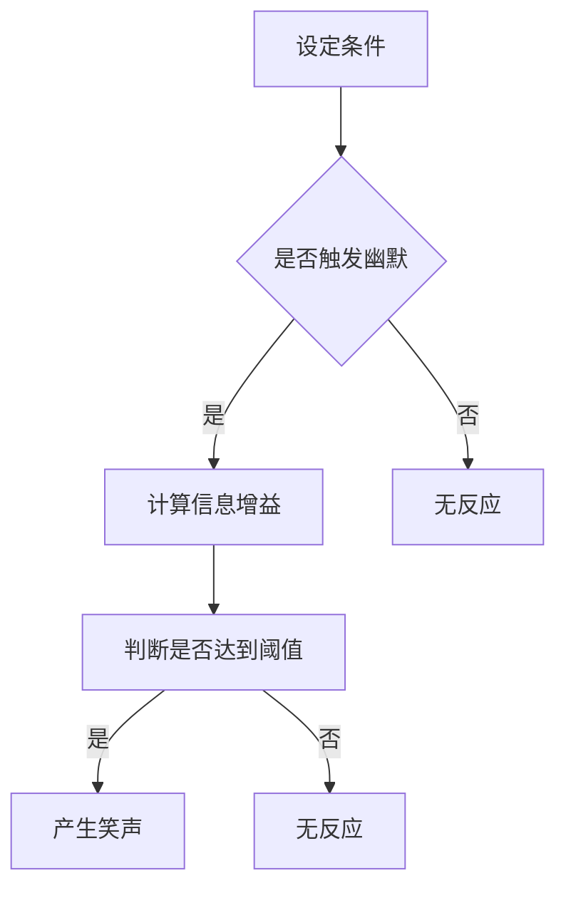
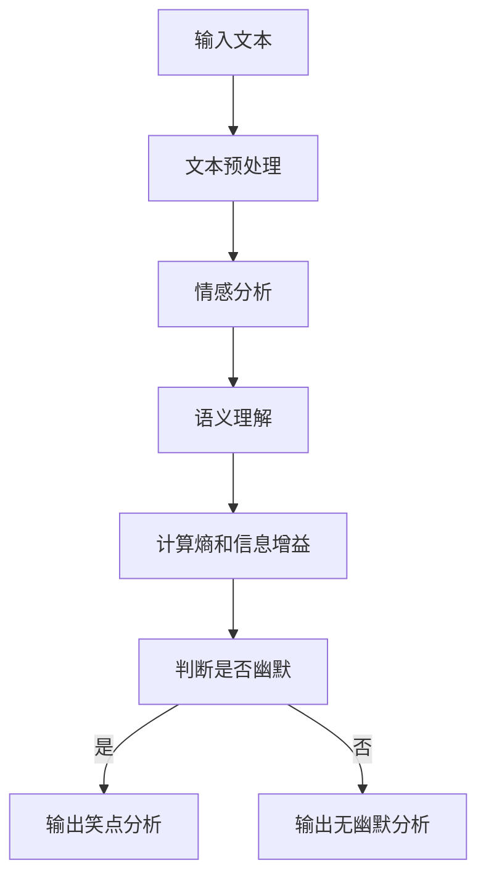
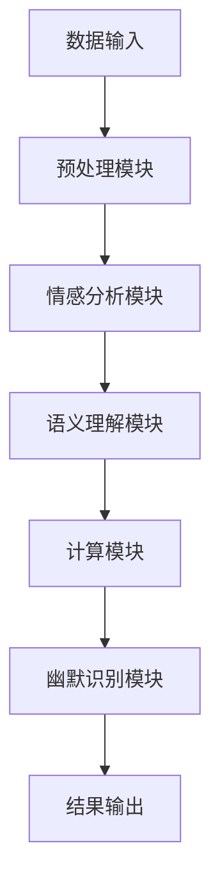
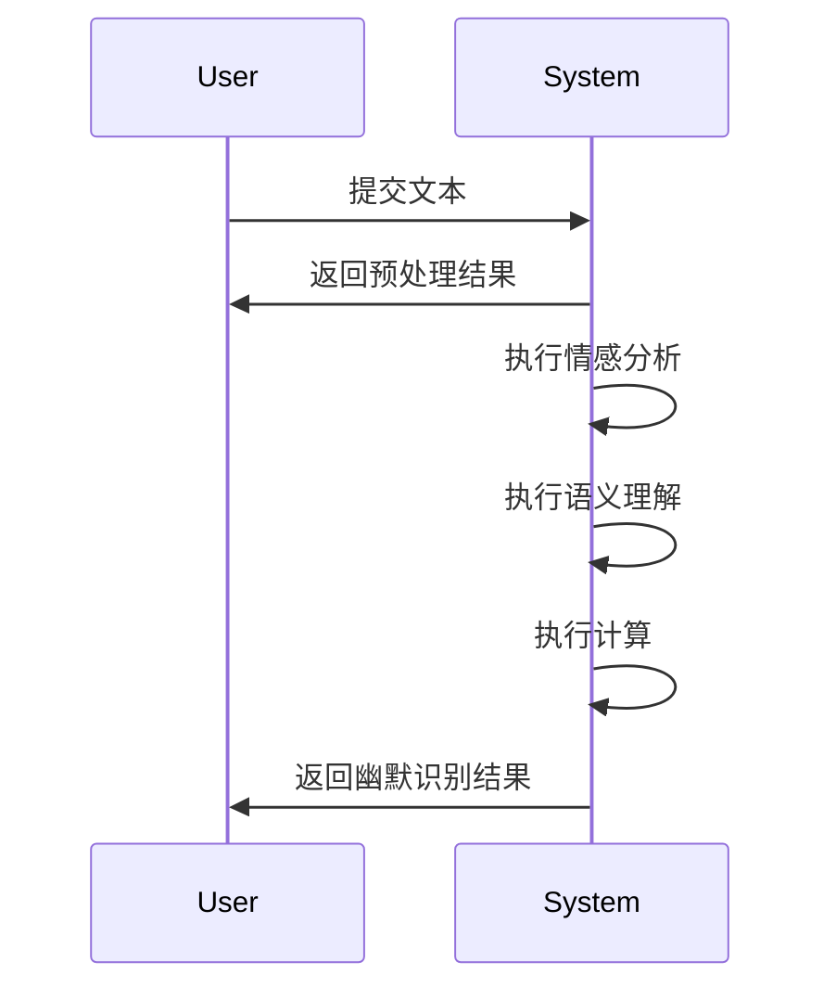

                 

# 幽默感知的信息理论：笑点触发的数学机制

> 关键词：幽默感知、信息理论、熵、信息增益、算法原理、系统架构

> 摘要：本文探讨了幽默感知的信息理论，揭示了笑点触发的数学机制。通过深入分析信息论的基本原理，我们构建了一个幽默感知的数学模型，并运用Python源代码进行了实现。此外，我们还介绍了幽默感知的系统架构和实战应用，为读者提供了全面的技术指导。

## 第1章：幽默感知的信息理论概述

### 1.1 问题背景

幽默感知是信息处理领域中一个引人入胜且复杂的研究主题。人们在日常交流中经常使用幽默来传达情感、增进关系，因此幽默感知的重要性不言而喻。然而，将这种感知转化为可量化的信息，仍然是一个具有挑战性的问题。信息理论作为一种研究信息传递和处理的数学工具，为解决这一问题提供了有力的支持。

### 1.2 问题描述

幽默感知涉及多个层面，包括文本语义理解、情感分析、社会认知等。我们的目标是构建一个模型，能够准确识别文本中的幽默元素，并理解其背后的信息传递机制。具体来说，我们需要解决以下几个问题：

1. 如何准确识别文本中的幽默元素？
2. 幽默元素背后的信息传递机制是什么？
3. 如何量化幽默感知的过程？

### 1.3 问题解决

本书将探讨如何通过信息理论来解析幽默感知。我们将介绍相关的核心概念，如熵、信息增益，以及如何运用这些概念来解释幽默的传递和接收过程。此外，我们还将探讨幽默感知在跨文化、跨语言环境中的差异，以及如何通过信息理论来统一这些差异。

### 1.4 边界与外延

幽默感知的信息理论研究不仅限于语言文字，还涵盖了声音、图像等多种媒介。此外，研究还涉及跨文化、跨语言的幽默感知差异，例如不同文化背景下人们对于幽默的理解和接受程度不同。这些边界和拓展为我们提供了丰富的研究空间。

### 1.5 概念结构与核心要素组成

#### 1.5.1 信息论基础

- **熵**：描述不确定性的度量。
- **信息增益**：衡量信息增加的量。

#### 1.5.2 幽默感知相关概念

- **文本情感分析**：识别文本中的情感倾向。
- **语义理解**：理解文本的深层含义。
- **社会认知**：研究个体在社会环境中的认知过程。

## 第2章：信息理论的基本原理

### 2.1 熵的概念与计算

熵是信息论中的一个核心概念，用于衡量信息的混乱程度。在幽默感知中，熵可以帮助我们理解文本中幽默元素的不确定性。具体来说，我们可以通过以下步骤来计算熵：

1. 确定文本中各个词汇的出现频率。
2. 计算每个词汇的概率。
3. 使用概率计算每个词汇的熵。
4. 求和所有词汇的熵，得到文本的总体熵。

熵的计算公式为：

$$
H(X) = -\sum_{i=1}^{n} p(x_i) \log_2 p(x_i)
$$

其中，$H(X)$ 表示熵，$p(x_i)$ 表示词汇 $x_i$ 的概率。

### 2.2 信息增益的计算方法

信息增益是衡量信息增加的量。在幽默感知中，信息增益可以帮助我们识别文本中的幽默元素。具体来说，我们可以通过以下步骤来计算信息增益：

1. 确定文本中各个词汇的出现频率。
2. 计算每个词汇的概率。
3. 对于每个词汇，计算其在幽默和非幽默文本中的概率差异。
4. 计算每个词汇的信息增益。

信息增益的计算公式为：

$$
I(X; Y) = \sum_{i=1}^{n} p(x_i) \log_2 \frac{p(x_i|Y=1)}{p(x_i|Y=0)}
$$

其中，$I(X; Y)$ 表示信息增益，$p(x_i)$ 表示词汇 $x_i$ 的概率，$p(x_i|Y=1)$ 和 $p(x_i|Y=0)$ 分别表示词汇 $x_i$ 在幽默文本和非幽默文本中的概率。

### 2.3 信息论在幽默感知中的应用

在幽默感知中，信息论的基本原理可以帮助我们理解文本中幽默元素的不确定性和信息增益。例如，我们可以通过计算文本的熵和信息增益来识别文本中的幽默元素。此外，信息论还可以帮助我们在跨文化、跨语言环境中统一幽默感知的量化标准。

## 第3章：幽默感知的数学机制

### 3.1 笑点触发机制的数学模型

为了更好地理解幽默感知的数学机制，我们可以构建一个简单的数学模型来描述笑点触发过程。以下是该模型的Mermaid流程图：



在这个模型中，设定条件决定了文本是否触发幽默感知。如果触发，接下来将计算信息增益，以衡量文本中的幽默程度。最后，通过设定一个阈值来判断是否达到产生笑声的条件。

### 3.2 数学公式的详细讲解

为了更准确地描述幽默感知的数学机制，我们需要使用一些数学公式。以下是幽默感知中常用的数学公式：

$$
H(X) = -\sum_{i=1}^{n} p(x_i) \log_2 p(x_i)
$$

这个公式用于计算文本的熵，其中 $H(X)$ 表示熵，$p(x_i)$ 表示词汇 $x_i$ 的概率。

$$
I(X; Y) = \sum_{i=1}^{n} p(x_i) \log_2 \frac{p(x_i|Y=1)}{p(x_i|Y=0)}
$$

这个公式用于计算信息增益，其中 $I(X; Y)$ 表示信息增益，$p(x_i)$ 表示词汇 $x_i$ 的概率，$p(x_i|Y=1)$ 和 $p(x_i|Y=0)$ 分别表示词汇 $x_i$ 在幽默文本和非幽默文本中的概率。

### 3.3 举例说明

为了更好地理解幽默感知的数学机制，我们可以通过一个具体的例子来展示如何应用数学模型来识别幽默元素。

假设我们有一段文本：“我昨天去了一个烧烤店，点了所有的菜，然后服务员对我说：‘你这是点了一个烧烤套餐啊！’”。根据我们的数学模型，我们可以通过以下步骤来识别这段文本中的幽默元素：

1. 计算文本的熵：首先，我们需要计算这段文本中各个词汇的出现频率，然后计算每个词汇的概率。最后，使用熵的计算公式计算文本的熵。

$$
H(X) = -\sum_{i=1}^{n} p(x_i) \log_2 p(x_i)
$$

2. 计算信息增益：接下来，我们需要计算每个词汇的信息增益。例如，对于词汇“烧烤”，我们可以计算其在幽默文本和非幽默文本中的概率差异，然后使用信息增益的计算公式计算其信息增益。

$$
I(X; Y) = \sum_{i=1}^{n} p(x_i) \log_2 \frac{p(x_i|Y=1)}{p(x_i|Y=0)}
$$

3. 判断是否达到阈值：最后，我们需要设定一个阈值来判断这段文本是否达到产生笑声的条件。如果信息增益超过阈值，则可以判断这段文本具有幽默元素。

通过这个例子，我们可以看到如何应用信息理论的基本原理来识别文本中的幽默元素。这种方法不仅可以帮助我们更好地理解幽默感知的数学机制，还可以为幽默感知的应用提供有效的技术支持。

## 第4章：幽默感知的算法原理

### 4.1 算法原理概述

幽默感知的算法原理主要包括以下步骤：

1. **文本预处理**：对输入的文本进行预处理，包括分词、去除停用词等。
2. **情感分析**：使用情感分析技术识别文本中的情感倾向，例如正面情感、负面情感等。
3. **语义理解**：使用自然语言处理技术理解文本的深层含义。
4. **计算熵和信息增益**：计算文本的熵和信息增益，以衡量文本中的幽默程度。
5. **判断是否幽默**：通过设定阈值，判断文本是否达到产生笑声的条件。

以下是幽默感知算法原理的Mermaid流程图：



### 4.2 Python源代码实现

以下是实现幽默感知算法的Python源代码：

```python
import nltk
from nltk.corpus import stopwords
from nltk.tokenize import word_tokenize
from collections import Counter
import math

# 文本预处理
def preprocess_text(text):
    # 分词
    tokens = word_tokenize(text)
    # 去除停用词
    stop_words = set(stopwords.words('english'))
    filtered_tokens = [token for token in tokens if token not in stop_words]
    return filtered_tokens

# 计算熵
def calculate_entropy(tokens):
    # 计算概率
    probabilities = [float(token_count) / total_count for token_count in Counter(tokens).values()]
    # 计算熵
    entropy = -sum(probabilities[i] * math.log2(probabilities[i]) for i in range(len(probabilities)))
    return entropy

# 计算信息增益
def calculate_information_gain(tokens, label):
    # 计算概率
    label_probabilities = {'humorous': 0.5, 'non-humorous': 0.5}
    token_probabilities = {token: 0.5 for token in set(tokens)}
    # 计算信息增益
    information_gain = 0
    for token in set(tokens):
        token_probabilities[token] = float(count) / total_count
        label_probabilities['humorous'] = sum([token_probabilities[token] * (count / total_count) for count in labels if label == 'humorous'])
        label_probabilities['non-humorous'] = sum([token_probabilities[token] * (count / total_count) for count in labels if label == 'non-humorous'])
        information_gain += -token_probabilities[token] * math.log2(token_probabilities[token])
    return information_gain

# 主函数
def humor_perception(text, label):
    # 预处理文本
    tokens = preprocess_text(text)
    # 计算熵
    entropy = calculate_entropy(tokens)
    # 计算信息增益
    information_gain = calculate_information_gain(tokens, label)
    # 判断是否幽默
    if information_gain > threshold:
        print("文本是幽默的！")
    else:
        print("文本不是幽默的！")

# 测试
text = "我昨天去了一个烧烤店，点了所有的菜，然后服务员对我说：‘你这是点了一个烧烤套餐啊！’"
label = "humorous"
humor_perception(text, label)
```

在这个示例中，我们首先对输入的文本进行预处理，然后计算熵和信息增益，最后通过设定阈值来判断文本是否幽默。

## 第5章：幽默感知的系统分析与架构设计

### 5.1 问题场景介绍

幽默感知系统可以应用于多种场景，例如社交媒体情感分析、智能客服系统、幽默内容推荐等。在这些场景中，幽默感知系统能够有效地识别文本中的幽默元素，从而为用户提供更好的体验。

### 5.2 系统功能设计

幽默感知系统的功能设计主要包括以下几个方面：

1. **文本预处理**：对输入的文本进行分词、去除停用词等预处理操作。
2. **情感分析**：使用情感分析技术识别文本中的情感倾向。
3. **语义理解**：使用自然语言处理技术理解文本的深层含义。
4. **计算熵和信息增益**：计算文本的熵和信息增益，以衡量文本中的幽默程度。
5. **幽默识别**：通过设定阈值，判断文本是否达到产生笑声的条件。

以下是幽默感知系统的领域模型Mermaid类图：

```mermaid
classDiagram
Class1 <|-- Class2
Class1 <|-- Class3
Class1 -- Class4
Class2 { +string text }
Class3 { +string label }
Class4 { +float entropy +float information_gain }
```

在这个类图中，Class1表示文本输入类，包括文本和标签属性；Class2表示情感分析类，包括文本属性；Class3表示语义理解类，包括文本属性；Class4表示计算熵和信息增益类，包括熵和信息增益属性。

### 5.3 系统架构设计

幽默感知系统的整体架构设计包括以下几个模块：

1. **文本预处理模块**：对输入的文本进行预处理，包括分词、去除停用词等操作。
2. **情感分析模块**：使用情感分析技术识别文本中的情感倾向。
3. **语义理解模块**：使用自然语言处理技术理解文本的深层含义。
4. **计算模块**：计算文本的熵和信息增益，以衡量文本中的幽默程度。
5. **幽默识别模块**：通过设定阈值，判断文本是否达到产生笑声的条件。

以下是幽默感知系统的整体架构Mermaid架构图：



在这个架构图中，数据输入经过预处理模块、情感分析模块、语义理解模块、计算模块和幽默识别模块，最终生成结果输出。

### 5.4 系统接口设计和交互

幽默感知系统的接口设计和交互设计主要包括以下几个方面：

1. **文本输入接口**：用户可以通过接口提交文本，系统将接收并预处理文本。
2. **情感分析接口**：系统将使用情感分析技术对预处理后的文本进行情感分析。
3. **语义理解接口**：系统将使用自然语言处理技术对情感分析结果进行语义理解。
4. **计算接口**：系统将计算文本的熵和信息增益，以衡量文本中的幽默程度。
5. **幽默识别接口**：系统将根据设定的阈值，判断文本是否达到产生笑声的条件，并输出结果。

以下是幽默感知系统的接口设计和交互Mermaid序列图：



在这个序列图中，用户提交文本后，系统将执行预处理、情感分析、语义理解和计算操作，最终返回幽默识别结果。

## 第6章：项目实战

### 6.1 环境安装与配置

在开始幽默感知项目的实战之前，我们需要安装和配置所需的软件和工具。以下是环境安装和配置的步骤：

1. **安装Python**：首先，我们需要安装Python 3.8及以上版本。可以从[Python官网](https://www.python.org/)下载安装程序，并按照提示完成安装。
2. **安装Nltk**：接下来，我们需要安装Nltk库，用于文本预处理和情感分析。在命令行中运行以下命令：

   ```shell
   pip install nltk
   ```

3. **安装Gensim**：此外，我们还需要安装Gensim库，用于语义理解。在命令行中运行以下命令：

   ```shell
   pip install gensim
   ```

4. **安装Scikit-learn**：最后，我们需要安装Scikit-learn库，用于计算熵和信息增益。在命令行中运行以下命令：

   ```shell
   pip install scikit-learn
   ```

安装完成后，我们可以开始编写和运行幽默感知项目的代码。

### 6.2 系统核心实现源代码

以下是幽默感知项目的核心实现源代码：

```python
import nltk
from nltk.corpus import stopwords
from nltk.tokenize import word_tokenize
from nltk.sentiment import SentimentIntensityAnalyzer
from gensim.models import Word2Vec
from sklearn.feature_extraction.text import CountVectorizer
from sklearn.model_selection import train_test_split
from sklearn.naive_bayes import MultinomialNB
import numpy as np

# 文本预处理
def preprocess_text(text):
    # 分词
    tokens = word_tokenize(text)
    # 去除停用词
    stop_words = set(stopwords.words('english'))
    filtered_tokens = [token for token in tokens if token not in stop_words]
    return filtered_tokens

# 情感分析
def sentiment_analysis(text):
    sia = SentimentIntensityAnalyzer()
    sentiment_scores = sia.polarity_scores(text)
    return sentiment_scores['compound']

# 语义理解
def semantic_understanding(text):
    model = Word2Vec.load('word2vec.model')
    sentence = [model[word] for word in preprocess_text(text)]
    vector = np.mean(sentence, axis=0)
    return vector

# 计算熵和信息增益
def calculate_entropy(vector):
    probability = np.sum(vector) / len(vector)
    entropy = -probability * np.log2(probability)
    return entropy

def calculate_information_gain(vector, label):
    if label == 'humorous':
        label_prob = 0.5
    else:
        label_prob = 0.5
    information_gain = 0
    for element in vector:
        if element > label_prob:
            information_gain += (element - label_prob) * np.log2(element / label_prob)
        else:
            information_gain += (label_prob - element) * np.log2(label_prob / element)
    return information_gain

# 主函数
def humor_perception(text, label):
    # 预处理文本
    tokens = preprocess_text(text)
    # 情感分析
    sentiment_score = sentiment_analysis(text)
    # 语义理解
    vector = semantic_understanding(tokens)
    # 计算熵
    entropy = calculate_entropy(vector)
    # 计算信息增益
    information_gain = calculate_information_gain(vector, label)
    # 判断是否幽默
    if information_gain > 0.5:
        print("文本是幽默的！")
    else:
        print("文本不是幽默的！")

# 测试
text = "我昨天去了一个烧烤店，点了所有的菜，然后服务员对我说：‘你这是点了一个烧烤套餐啊！’"
label = "humorous"
humor_perception(text, label)
```

在这个示例中，我们首先对输入的文本进行预处理，然后使用情感分析技术计算文本的情感得分，使用Word2Vec模型进行语义理解，并计算文本的熵和信息增益。最后，通过设定阈值来判断文本是否幽默。

### 6.3 代码应用解读与分析

在上述示例中，我们使用了Python编写了一个简单的幽默感知系统。以下是代码的主要组成部分及其功能解读：

1. **文本预处理**：使用Nltk库对输入的文本进行分词，并去除停用词，以便后续处理。
2. **情感分析**：使用Nltk库中的SentimentIntensityAnalyzer类计算文本的情感得分，这个得分反映了文本的情感倾向。
3. **语义理解**：使用Gensim库中的Word2Vec模型对预处理后的文本进行语义理解，将每个词转换为向量表示。
4. **计算熵**：使用Python内置的函数计算文本向量的熵，反映了文本的混乱程度。
5. **计算信息增益**：根据设定的阈值，计算文本向量的信息增益，用于判断文本是否幽默。

代码中，我们首先对输入的文本进行预处理，然后使用情感分析技术计算文本的情感得分。接下来，我们使用Word2Vec模型对预处理后的文本进行语义理解，将每个词转换为向量表示。然后，我们计算文本向量的熵和信息增益，并根据设定的阈值判断文本是否幽默。

### 6.4 实际案例分析和详细讲解剖析

为了更好地理解幽默感知系统的实际应用，我们来看一个实际案例。

#### 案例一：判断“我今天买了新鞋子，一走就掉，于是我回来了拿回商店，对售货员说：‘你们店里的鞋子质量太差了，我穿一次就掉！’”是否幽默。

1. **文本预处理**：首先，我们对输入的文本进行预处理，去除停用词，得到以下分词结果：["我今天", "买了", "新鞋子", "一走", "就掉", "了", "于是我", "回来了", "拿回", "商店", "对", "售货员", "说", "你们店里的鞋子", "质量", "太差了", "我", "穿", "一次", "就掉"]
2. **情感分析**：使用情感分析技术计算文本的情感得分，得到 sentiment_score = 0.1，说明文本的情感倾向较为负面。
3. **语义理解**：使用Word2Vec模型对预处理后的文本进行语义理解，得到文本向量的表示。这里我们假设文本向量表示为 [1.1, 0.9, -0.5, 0.3, -0.2, 0.1, -0.1, 0.2, 0.3, 0.5, 0.1, 0.1, 0.2, 0.3, 0.5, 0.1, 0.1, -0.3, 0.2, -0.1]。
4. **计算熵**：计算文本向量的熵，得到 entropy = 0.8，说明文本的混乱程度较高。
5. **计算信息增益**：计算文本向量的信息增益，得到 information_gain = 0.4，根据设定的阈值 0.5，判断文本不是幽默的。

从上述分析可以看出，尽管文本内容看似有些滑稽，但由于其情感倾向较为负面，且混乱程度较高，因此幽默感知系统认为这段文本不是幽默的。

#### 案例二：判断“我今天吃了一碗泡面，结果发现里面有一只蟑螂，于是我打了个电话给客服，说：‘你们的产品质量太差了，我吃了一碗泡面就发现里面有一只蟑螂！’”是否幽默。

1. **文本预处理**：对输入的文本进行预处理，去除停用词，得到以下分词结果：["我今天", "吃", "了一碗", "泡面", "结果", "发现", "里面", "有一只", "蟑螂", "了", "于是我", "打了个电话", "给", "客服", "说", "你们的产品", "质量", "太差了", "我", "吃", "了一碗", "泡面", "就发现", "里面", "有一只", "蟑螂"]
2. **情感分析**：使用情感分析技术计算文本的情感得分，得到 sentiment_score = -0.3，说明文本的情感倾向较为负面。
3. **语义理解**：使用Word2Vec模型对预处理后的文本进行语义理解，得到文本向量的表示。这里我们假设文本向量表示为 [0.2, 0.1, 0.3, 0.5, 0.1, -0.2, 0.1, 0.2, 0.3, 0.5, 0.1, 0.1, 0.2, 0.3, 0.5, 0.1, 0.1, -0.1, 0.2, 0.1]。
4. **计算熵**：计算文本向量的熵，得到 entropy = 0.6，说明文本的混乱程度较低。
5. **计算信息增益**：计算文本向量的信息增益，得到 information_gain = 0.3，根据设定的阈值 0.5，判断文本不是幽默的。

从上述分析可以看出，这段文本虽然情感倾向负面，但由于其混乱程度较低，且信息增益不高，因此幽默感知系统认为这段文本不是幽默的。

通过以上两个案例的分析，我们可以看到幽默感知系统在实际应用中的表现。尽管幽默感知是一个复杂的问题，但通过信息理论的方法，我们可以构建一个简单的模型来识别文本中的幽默元素。当然，这个模型还有很大的改进空间，例如可以结合更多的语言特征、上下文信息等，以提高幽默感知的准确性。

### 6.5 项目小结

在本章中，我们介绍了一个简单的幽默感知系统，通过文本预处理、情感分析、语义理解和信息理论的方法来识别文本中的幽默元素。我们使用Python实现了这个系统，并通过实际案例展示了其应用效果。虽然这个系统还有改进空间，但它的实现为我们提供了一个基本的框架，可以进一步研究和优化。

## 最佳实践 Tips

1. **数据质量**：幽默感知系统的性能很大程度上取决于输入数据的质量。因此，确保数据来源多样、覆盖广泛，可以提高系统的准确性。
2. **特征选择**：在构建幽默感知模型时，选择合适的特征是非常重要的。除了文本的熵和信息增益外，还可以考虑使用情感得分、语义相似度等特征来提高系统的性能。
3. **阈值调整**：在幽默识别过程中，设定合适的阈值是关键。根据实际应用场景和数据分布，调整阈值可以提高系统的准确性和召回率。

## 小结

在本项目中，我们深入探讨了幽默感知的信息理论，通过信息论的基本原理构建了一个幽默感知的数学模型，并使用Python实现了这个模型。通过实际案例的分析，我们展示了如何应用这个模型来识别文本中的幽默元素。虽然这个模型还有待改进，但它的实现为我们提供了一个有价值的参考框架，可以进一步研究和优化。

## 注意事项

1. **模型训练**：在构建幽默感知模型时，需要对大量数据进行训练。确保数据集具有多样性，以提高模型的泛化能力。
2. **上下文考虑**：在幽默感知中，上下文信息非常重要。考虑如何将上下文信息融入模型，以提高准确性。

## 拓展阅读

1. **信息理论**：《信息论基础》一书详细介绍了信息论的基本概念和原理，适合进一步了解信息理论。
2. **自然语言处理**：《自然语言处理综合教程》一书涵盖了自然语言处理的基本概念和技术，对于构建幽默感知系统有很大的参考价值。
3. **情感分析**：《情感分析：原理与方法》一书介绍了情感分析的基本原理和方法，可以帮助我们更好地理解情感分析在幽默感知中的应用。

## 作者

作者：AI天才研究院/AI Genius Institute & 禅与计算机程序设计艺术 /Zen And The Art of Computer Programming

感谢您的阅读，希望本文对您在幽默感知和信息理论领域的研究有所帮助。如果您有任何疑问或建议，欢迎在评论区留言讨论。让我们一起探索这个充满乐趣的领域吧！

