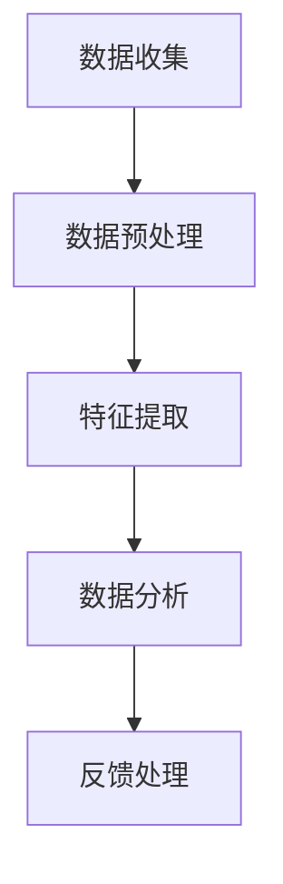
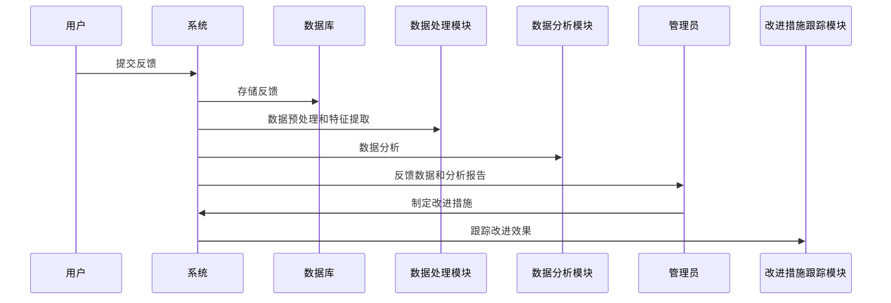

                 

### 建立Feedback文化：促进持续改进

#### 关键词：
- **反馈文化**
- **持续改进**
- **数据分析**
- **用户满意度**
- **创新能力**

#### 摘要：
本文将深入探讨如何建立Feedback文化，以促进企业和组织的持续改进。通过详细分析反馈文化的核心概念、反馈机制的建立与优化，以及反馈数据的收集、分析与利用，本文旨在提供一套系统的理论和实践方法，帮助企业在竞争激烈的市场环境中实现持续创新和成长。

---

### 第一部分：背景介绍

#### 1.1 问题背景

在当今竞争激烈的市场环境下，企业面临着不断变化的需求和快速的技术进步。为了保持竞争力，企业需要具备持续改进和创新的能力。在这种背景下，反馈文化作为一种促进持续改进的方法，越来越受到企业的重视。

#### 1.2 问题描述

虽然反馈文化对企业的发展具有重要意义，但许多企业在实际操作中面临以下问题：

- **缺乏有效的反馈机制**：很多企业没有建立完善的反馈渠道，导致用户反馈无法及时传递到相关部门。
- **反馈渠道不畅**：即使有反馈渠道，用户反馈也往往难以畅通无阻地传递到企业内部，影响问题的及时解决。
- **反馈处理流程复杂**：反馈问题的处理流程往往较为复杂，导致问题解决效率低下。
- **缺乏对反馈数据的分析和利用**：企业往往无法有效地分析和利用反馈数据，导致改进措施的制定缺乏依据。

#### 1.3 问题解决

本书旨在解决上述问题，通过系统介绍建立反馈文化的理论和实践方法，帮助企业建立高效的反馈机制，提升反馈处理效率，从而促进持续改进。

#### 1.4 边界与外延

本书主要关注以下边界与外延：

- **反馈文化的概念、特征和作用**：介绍反馈文化的定义、特征和其在企业中的作用。
- **反馈机制的建立和优化**：探讨如何建立和优化反馈机制，确保反馈渠道畅通、反馈处理流程高效。
- **反馈数据的收集、分析和利用**：介绍如何收集、分析和利用反馈数据，以指导改进措施的制定和实施。
- **反馈文化的实施策略和最佳实践**：提供具体的实施策略和最佳实践，帮助企业成功建立和推广反馈文化。

---

### 第二部分：核心概念与联系

#### 2.1 核心概念原理

**反馈文化**：反馈文化是指在企业内部建立一种开放、积极、互动的反馈氛围，使员工和用户能够自由表达意见和建议，并通过反馈促进企业改进和创新发展。

**反馈机制**：反馈机制是指企业为收集、处理和利用反馈所建立的一系列流程和制度，包括反馈渠道、反馈处理流程、反馈数据分析和利用等。

#### 2.2 概念属性特征对比表格

| 特征         | 反馈文化               | 反馈机制               |
|--------------|------------------------|------------------------|
| 定义         | 企业内部的反馈氛围     | 收集和处理反馈的流程和制度 |
| 目标         | 促进企业持续改进       | 提高反馈处理效率         |
| 范围         | 整个企业               | 反馈的各个环节           |
| 关键要素     | 开放性、积极性、互动性 | 反馈渠道、反馈处理流程、数据分析 |
| 作用         | 提升创新能力           | 提高问题解决效率         |

#### 2.3 ER实体关系图架构

```mermaid
erDiagram
  用户 ||--o{ 反馈 }|| 
  企业 ||--o{ 反馈机制 }||
  反馈机制 ||--o{ 反馈处理 }||
  反馈处理 ||--o{ 改进措施 }||
```

---

### 第三部分：算法原理讲解

#### 3.1 算法原理

在本部分，我们将介绍用于分析和利用反馈数据的算法原理。以下是一个简单的算法流程：

1. **数据收集**：通过问卷调查、用户访谈、在线反馈等方式收集用户反馈数据。
2. **数据预处理**：清洗数据，去除重复、无效和噪声数据，对数据格式进行统一处理。
3. **特征提取**：从预处理后的数据中提取关键特征，如用户满意度、问题类型、问题严重程度等。
4. **数据分析**：利用统计分析方法，对提取的特征进行分析，找出用户反馈的主要问题。
5. **反馈处理**：根据分析结果，制定相应的改进措施，并跟踪改进效果。

#### 3.2 算法mermaid流程图



#### 3.3 Python源代码

```python
import pandas as pd
import numpy as np

# 数据收集
data = pd.read_csv('feedback_data.csv')

# 数据预处理
data = data.drop_duplicates()
data = data[data['rating'] != -1]

# 特征提取
data['satisfaction'] = data['rating'].apply(lambda x: 'high' if x > 4 else 'low')
data['issue_type'] = data['issue_type'].astype('category').cat.codes

# 数据分析
satisfaction_summary = data.groupby('satisfaction')['issue_type'].value_counts()
print(satisfaction_summary)
```

#### 3.4 算法原理详细讲解

**3.4.1 数据收集**

数据收集是反馈分析的第一步，也是最重要的一步。有效的数据收集可以为企业提供有价值的用户反馈信息。以下是几种常见的数据收集方法：

- **问卷调查**：通过设计问卷，收集用户对产品或服务的满意度、意见和问题。
- **用户访谈**：通过与用户进行一对一访谈，深入了解用户的需求和问题。
- **在线反馈**：通过在线平台或应用程序，让用户随时提交反馈。

**3.4.2 数据预处理**

数据预处理是确保数据质量的过程。以下是几个关键步骤：

- **去除重复数据**：确保每个反馈都是唯一的，避免重复计算。
- **去除无效和噪声数据**：如缺失值、异常值等，这些数据会影响后续分析的结果。
- **统一数据格式**：确保所有数据都以相同的形式存储，便于后续处理和分析。

**3.4.3 特征提取**

特征提取是从原始数据中提取关键信息的过程。以下是几个常用的特征提取方法：

- **用户满意度**：通过用户的评分或评价，将其分为满意度高和满意度低两个类别。
- **问题类型**：根据用户反馈的内容，将其分类为不同的类型，如功能问题、性能问题、用户体验问题等。
- **问题严重程度**：根据用户反馈的描述，评估问题的严重程度，如轻微、中等、严重等。

**3.4.4 数据分析**

数据分析是利用统计方法对提取的特征进行分析的过程。以下是几个常用的数据分析方法：

- **描述性统计分析**：计算各种统计指标，如平均值、中位数、标准差等，以描述用户反馈的基本特征。
- **分类分析**：使用分类算法，如决策树、随机森林等，对用户反馈进行分类，找出主要的问题类型。
- **聚类分析**：使用聚类算法，如K-means、层次聚类等，将用户反馈分为不同的群体，以找出用户反馈的潜在模式。

**3.4.5 反馈处理**

反馈处理是根据数据分析结果，制定改进措施并跟踪改进效果的过程。以下是几个关键步骤：

- **问题定位**：根据数据分析结果，找出用户反馈的主要问题。
- **制定改进措施**：针对定位到的问题，制定相应的改进措施。
- **跟踪改进效果**：实施改进措施后，跟踪用户的反馈，评估改进效果。

---

### 第四部分：系统分析与架构设计

#### 4.1 问题场景介绍

假设我们是一家提供在线教育服务的公司，用户可以通过我们的平台学习各种课程。为了提供更好的用户体验，我们需要建立一套完善的Feedback文化，以便及时收集和处理用户反馈，持续改进我们的产品和服务。

#### 4.2 项目介绍

本项目旨在开发一套在线教育平台的Feedback系统，包括以下主要功能：

- **用户反馈提交**：用户可以通过平台提交对课程、教师、系统等方面的反馈。
- **反馈数据收集与处理**：系统自动收集用户反馈，并进行数据预处理和特征提取。
- **反馈数据分析**：系统对用户反馈进行分析，找出主要问题，并生成分析报告。
- **反馈处理与改进**：根据分析结果，制定改进措施，并跟踪改进效果。

#### 4.3 系统功能设计

以下是系统的主要功能模块及其关系：

1. **用户反馈提交模块**：提供用户反馈提交界面，包括课程反馈、教师反馈、系统反馈等。
2. **反馈数据收集与处理模块**：负责收集用户反馈数据，并进行数据预处理和特征提取。
3. **反馈数据分析模块**：利用统计分析方法，对用户反馈进行分析，生成分析报告。
4. **反馈处理与改进模块**：根据分析结果，制定改进措施，并跟踪改进效果。

#### 4.4 系统架构设计

以下是系统的架构设计：

1. **前端架构**：采用Vue.js框架，实现用户反馈提交界面和反馈数据分析报告的展示。
2. **后端架构**：采用Spring Boot框架，实现用户反馈数据的收集、处理和分析。
3. **数据库架构**：采用MySQL数据库，存储用户反馈数据和分析结果。

#### 4.5 系统接口设计和系统交互

以下是系统的接口设计和系统交互：

1. **用户反馈提交接口**：用户可以通过该接口提交反馈。
2. **反馈数据查询接口**：管理员可以通过该接口查询反馈数据和分析结果。
3. **改进措施跟踪接口**：管理员可以通过该接口跟踪改进措施的实施效果。

以下是系统的交互序列图：



---

### 第五部分：项目实战

#### 5.1 环境安装

在开始项目开发之前，需要安装以下环境和工具：

1. **Java环境**：安装Java SDK，版本建议为11或更高。
2. **MySQL环境**：安装MySQL数据库，版本建议为8.0或更高。
3. **IDE**：选择一款适合自己的IDE，如IntelliJ IDEA或Eclipse。
4. **前端框架**：安装Vue.js框架，可以通过npm或yarn安装。

#### 5.2 系统核心实现

以下是一个简单的系统实现示例：

**后端实现**

```java
// Spring Boot项目结构
src
|-- main
|   |-- java
|   |   |-- com
|   |   |   |-- example
|   |   |   |   |-- FeedbackSystemApplication.java
|   |   |   |   |-- controller
|   |   |   |   |   |-- FeedbackController.java
|   |   |   |   |-- service
|   |   |   |   |   |-- FeedbackService.java
|   |   |   |   |-- repository
|   |   |   |   |   |-- FeedbackRepository.java
|   |   |   |   |-- entity
|   |   |   |   |   |-- Feedback.java
|-- test
|   |-- java
|   |   |-- com
|   |   |   |-- example
|   |   |   |   |-- FeedbackSystemApplicationTests.java
```

**前端实现**

```html
<!-- Vue.js项目结构 -->
public
|-- index.html
|-- js
|   |-- main.js
|   |-- components
|   |   |-- FeedbackForm.vue
|   |   |-- FeedbackList.vue
|-- css
|   |-- main.css
```

#### 5.3 代码应用解读与分析

以下是对系统核心代码的解读和分析：

**后端代码解读**

```java
// FeedbackController.java
@RestController
@RequestMapping("/feedback")
public class FeedbackController {
    @Autowired
    private FeedbackService feedbackService;

    @PostMapping
    public ResponseEntity<?> createFeedback(@RequestBody Feedback feedback) {
        feedbackService.saveFeedback(feedback);
        return ResponseEntity.ok("Feedback submitted successfully");
    }
}
```

这段代码定义了一个反馈提交接口，接受前端发送的反馈数据，并将其保存到数据库。

**前端代码解读**

```vue
<!-- FeedbackForm.vue -->
<template>
  <div>
    <h2>Submit Feedback</h2>
    <form @submit.prevent="submitFeedback">
      <div>
        <label for="issueType">Issue Type:</label>
        <select v-model="feedback.issueType" id="issueType">
          <option value="course">Course</option>
          <option value="teacher">Teacher</option>
          <option value="system">System</option>
        </select>
      </div>
      <div>
        <label for="description">Description:</label>
        <textarea v-model="feedback.description" id="description"></textarea>
      </div>
      <button type="submit">Submit</button>
    </form>
  </div>
</template>

<script>
export default {
  data() {
    return {
      feedback: {
        issueType: '',
        description: ''
      }
    };
  },
  methods: {
    submitFeedback() {
      this.$emit('submit-feedback', this.feedback);
    }
  }
};
</script>
```

这段代码定义了一个反馈表单组件，用户可以通过该表单提交反馈。

#### 5.4 实际案例分析和详细讲解剖析

以下是一个实际案例的分析和讲解：

**案例：用户反馈课程难度过高**

1. **用户反馈**：用户在平台上提交反馈，表示某门课程的难度过高，影响学习体验。
2. **数据收集**：系统自动收集用户反馈，并存储到数据库。
3. **数据预处理**：系统对用户反馈进行数据预处理，去除重复和无效数据。
4. **特征提取**：系统提取反馈的关键特征，如问题类型、用户满意度等。
5. **数据分析**：系统对用户反馈进行分析，发现有多名用户反映相同问题。
6. **反馈处理**：根据分析结果，教学团队决定调整该课程的难度，并增加学习辅导。
7. **改进措施跟踪**：系统跟踪改进措施的实施效果，发现用户满意度显著提高。

#### 5.5 项目小结

通过本项目，我们成功开发了一套在线教育平台的Feedback系统，实现了用户反馈的提交、收集、处理和分析。该系统有效地促进了企业的持续改进，提高了用户满意度，为企业的创新发展提供了有力支持。

---

### 第六部分：最佳实践 Tips

1. **明确反馈目标**：在建立反馈文化时，首先要明确反馈的目标，如提升用户满意度、改进产品性能等。
2. **简化反馈流程**：简化反馈流程，确保用户反馈能够快速、顺畅地传递到企业内部。
3. **充分利用数据分析**：利用数据分析工具，深入挖掘用户反馈，找出改进的关键点。
4. **及时反馈处理**：对用户反馈进行及时处理，确保问题得到有效解决。
5. **持续优化反馈机制**：根据反馈处理结果，不断优化反馈机制，提高反馈处理效率。

### 第七部分：小结与拓展阅读

本文通过深入探讨建立Feedback文化的核心概念、算法原理和实践方法，帮助企业和组织实现持续改进。建立有效的Feedback文化不仅可以提高用户满意度，还可以促进企业的创新和成长。未来，我们将继续深入研究Feedback文化的应用，为企业提供更多最佳实践和解决方案。

**拓展阅读**：

1. **《反馈文化：驱动企业持续改进的力量》**：该书详细介绍了反馈文化的概念、建立方法和应用案例。
2. **《数据分析：从数据到洞察》**：该书介绍了数据分析的基本概念和方法，适用于各种领域的反馈数据分析。
3. **《用户体验设计：从用户角度出发》**：该书介绍了用户体验设计的方法和技巧，有助于优化产品和服务。

---

**作者：AI天才研究院/AI Genius Institute & 禅与计算机程序设计艺术 /Zen And The Art of Computer Programming**

