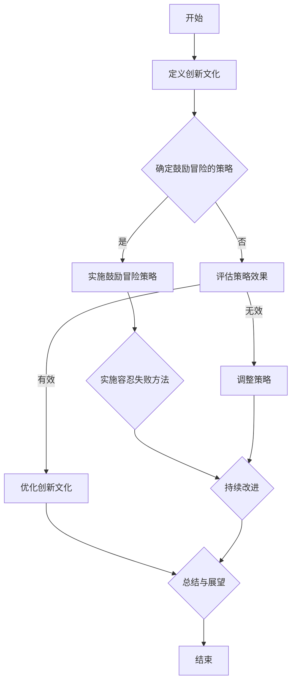
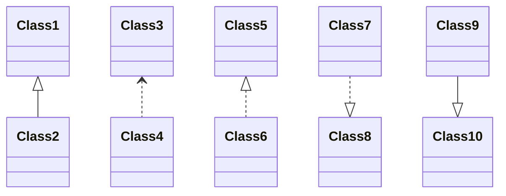
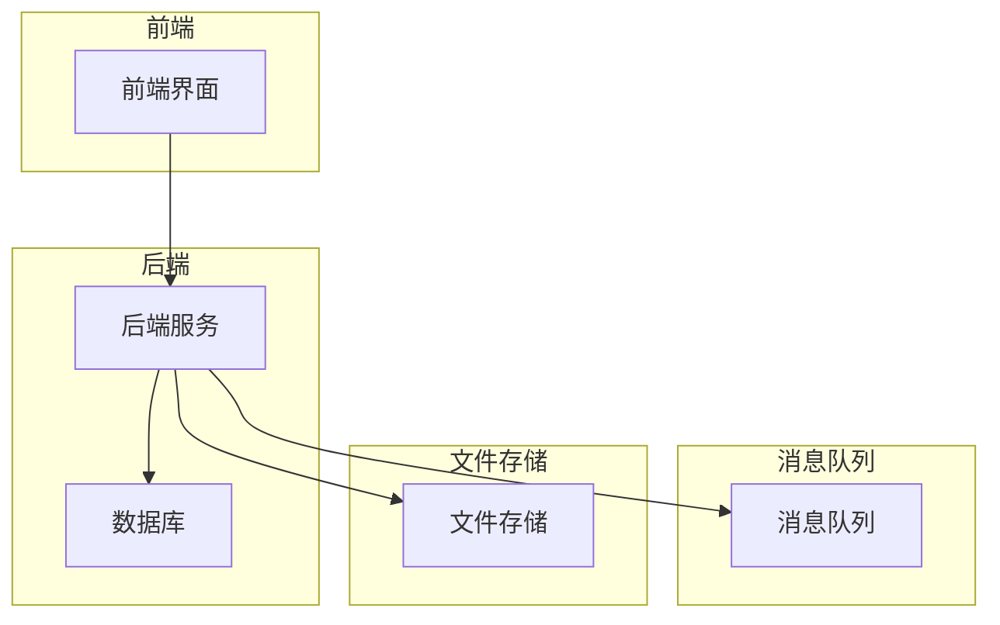

                 

# 建立创新文化：鼓励冒险和容忍失败

## 关键词
- 创新文化
- 冒险
- 失败
- 鼓励
- 容忍
- 组织管理
- 技术发展

## 摘要
本文将探讨如何建立一种鼓励冒险和容忍失败的创新文化，分析其在IT领域的应用和价值。通过详细阐述创新文化的核心概念、冒险与失败在其中的角色，以及如何制定策略和实践方法，本文旨在为IT组织提供一套系统性的指导，以推动技术进步和持续创新。

### 目录

1. 引言
   1.1 创新文化的意义
   1.2 冒险与失败在创新中的角色
   1.3 当前创新文化的现状分析

2. 创新文化的核心概念
   2.1 创新文化的定义
   2.2 创新文化的要素
   2.3 创新文化的层级结构

3. 冒险文化的理论探讨
   3.1 冒险的定义与类型
   3.2 冒险文化的特点
   3.3 冒险与风险的关系

4. 失败文化的理论分析
   4.1 失败的定义与分类
   4.2 失败文化的双刃剑效应
   4.3 失败文化的建设与优化

5. 建立创新文化的策略与实践
   5.1 鼓励冒险的策略
   5.2 容忍失败的方法
   5.3 成功案例分析

6. 创新文化的评估与优化
   6.1 创新文化的评估方法
   6.2 创新文化的持续优化

7. 结论与展望
   7.1 创新文化建设的意义
   7.2 未来创新文化的发展趋势

### 引言

在当今快速变化的科技环境中，创新已成为企业发展的关键驱动力。然而，创新并非易事，它需要一种积极的支持环境，其中创新文化扮演着至关重要的角色。创新文化是一种价值观和行为模式，它鼓励冒险精神、容忍失败，并为创新提供必要的基础设施和支持。

**1.1 创新文化的意义**

创新文化的重要性体现在以下几个方面：

- **提高竞争力**：创新文化能够激发员工的创造力，促进技术进步和产品创新，从而提高企业的市场竞争力。

- **促进知识共享**：在一个鼓励创新的环境中，员工更愿意分享知识和经验，这有助于知识的传播和积累。

- **激发员工潜力**：创新文化鼓励员工尝试新方法和解决方案，从而挖掘他们的潜力，提高工作满意度和忠诚度。

- **推动技术进步**：创新文化为新技术的研究和应用提供了实验和试错的空间，有助于推动整个行业的进步。

**1.2 冒险与失败在创新中的角色**

在创新过程中，冒险和失败是不可避免的。冒险指的是尝试新的想法、方法和解决方案，而失败则是这些尝试中常见的结局。尽管失败可能带来负面影响，但它也是创新过程中不可或缺的一部分。

- **冒险的驱动因素**：冒险精神源自对未知的探索欲望和对创新的渴望。它推动企业尝试新的技术、市场和商业模式。

- **失败的价值**：失败不仅可以提供宝贵的经验和教训，还可以激发团队的创新思维，帮助他们找到更好的解决方案。

**1.3 当前创新文化的现状分析**

当前，许多IT企业已经认识到创新文化的重要性，并开始采取行动来建立和培养这种文化。然而，现状并不完全乐观。以下是一些常见的问题和挑战：

- **恐惧失败**：许多企业在创新过程中仍然存在对失败的恐惧，这限制了员工的冒险精神。

- **资源限制**：创新需要资金、时间和人才的投入，但许多企业在资源分配上存在瓶颈。

- **组织结构问题**：传统的层级式组织结构往往阻碍创新，因为它抑制了员工的自主性和创造力。

- **缺乏明确的创新战略**：没有明确的创新目标和战略，企业很难建立一个有效的创新文化。

### 创新文化的核心概念

为了更好地理解创新文化，我们需要深入探讨其核心概念，包括定义、要素和层级结构。

**2.1 创新文化的定义**

创新文化可以定义为一种组织内部的价值观和行为模式，它鼓励和支持创新，容忍失败，并重视知识和经验的共享。这种文化不仅关注技术进步，还包括商业模式、市场策略和运营流程的创新。

**2.2 创新文化的要素**

一个成功的创新文化应包含以下几个关键要素：

- **鼓励冒险**：企业应鼓励员工尝试新的想法和方法，即使这些尝试可能失败。

- **容忍失败**：失败是创新过程中的一部分，企业应建立容忍失败的氛围，以便员工能够从失败中学习和成长。

- **知识共享**：鼓励员工分享知识和经验，以提高组织的整体创新能力。

- **自主性**：赋予员工自主权，让他们有权决定如何开展工作，从而激发他们的创造力。

- **合作精神**：创新往往需要跨部门的合作，企业应培养合作精神，促进不同团队之间的交流与协作。

**2.3 创新文化的层级结构**

创新文化的层级结构可以分为三个层次：基础层、中间层和高层。

- **基础层**：包括组织的基础设施、流程和政策，它们为创新提供了必要的支持。

- **中间层**：包括员工的态度和行为模式，如冒险精神、容忍失败和合作精神。

- **高层**：包括领导层的价值观和战略，它们为创新文化提供了方向和动力。

### 冒险文化的理论探讨

冒险文化是创新文化的重要组成部分，它强调尝试新想法和方法的必要性。以下是对冒险文化的理论探讨。

**3.1 冒险的定义与类型**

冒险可以定义为尝试新的、未经验证的想法、方法或解决方案。根据冒险的目的和性质，可以将冒险分为以下几种类型：

- **探索型冒险**：指尝试探索未知领域或市场，以寻找新的机会。

- **实验型冒险**：指在控制条件下尝试新的技术或方法，以验证其可行性。

- **投机型冒险**：指在不确定的环境中，通过高风险的投资来寻求高回报。

**3.2 冒险文化的特点**

冒险文化具有以下几个显著特点：

- **风险意识**：冒险文化强调对风险的识别和管理，而不是完全避免风险。

- **灵活应变**：冒险文化鼓励员工灵活应对变化，快速调整策略。

- **容忍失败**：冒险文化接受失败作为创新过程中的一部分，并将其视为学习的机会。

- **激励制度**：冒险文化通常设有激励制度，以奖励那些敢于冒险的员工。

**3.3 冒险与风险的关系**

冒险与风险是紧密相连的。冒险本身就是对不确定性的探索，而风险则是这种探索可能带来的负面影响。在冒险文化中，关键在于如何平衡冒险与风险。

- **风险评估**：企业应建立风险评估机制，对每个冒险项目进行评估，以确定其潜在风险和回报。

- **风险控制**：冒险文化应注重风险控制，确保在冒险过程中不会对企业的核心业务造成严重影响。

### 失败文化的理论分析

失败是创新过程中不可避免的，因此，如何建立和优化失败文化，使其成为推动创新的力量，是每个组织需要认真思考的问题。

**4.1 失败的定义与分类**

失败可以定义为未能达到预期目标或期望的结果。根据失败的原因和性质，可以将失败分为以下几种类型：

- **技术失败**：指由于技术原因导致的失败，如技术方案不可行或技术实现失败。

- **市场失败**：指由于市场原因导致的失败，如市场需求不足或竞争激烈。

- **管理失败**：指由于管理原因导致的失败，如资源分配不合理或项目管理不当。

**4.2 失败文化的双刃剑效应**

失败文化具有双刃剑效应，一方面，它可以激发创新思维，促进团队学习和成长；另一方面，如果处理不当，它也可能带来负面影响。

- **正面效应**：失败文化鼓励员工勇于尝试，降低恐惧失败的心理障碍，提高创新成功率。

- **负面效应**：过度强调失败可能导致员工失去信心，甚至产生逃避责任的心态。

**4.3 失败文化的建设与优化**

为了充分发挥失败文化的正面效应，企业应采取以下措施：

- **建立失败容忍机制**：确保员工在尝试新想法时，不会因为失败而遭受惩罚。

- **鼓励开放沟通**：鼓励员工分享失败经历，从中吸取教训。

- **提供心理支持**：为员工提供心理支持，帮助他们从失败中恢复信心。

- **优化激励机制**：通过激励制度，鼓励员工在失败后继续努力。

### 建立创新文化的策略与实践

建立创新文化需要系统性的策略和实践，以下是一些具体的建议。

**5.1 鼓励冒险的策略**

- **提供资源支持**：为员工提供必要的资金、技术和时间支持，鼓励他们尝试新的想法。

- **设定明确的冒险目标**：为每个冒险项目设定清晰的目标和预期结果，以便评估其成功与否。

- **建立跨部门协作机制**：鼓励不同部门之间的合作，促进知识的共享和资源的整合。

- **奖励冒险行为**：通过奖励制度，激励员工勇于冒险，勇于尝试新方法。

**5.2 容忍失败的方法**

- **建立失败容忍机制**：明确失败在创新过程中的地位和作用，确保员工不会因为失败而受到惩罚。

- **鼓励开放沟通**：鼓励员工分享失败经历，从中吸取教训，避免重复相同的错误。

- **提供心理支持**：为员工提供心理支持，帮助他们从失败中恢复信心。

- **优化激励机制**：通过激励制度，鼓励员工在失败后继续努力。

**5.3 成功案例分析**

以下是一些成功案例，它们展示了如何在组织中建立鼓励冒险和容忍失败的创新文化：

- **谷歌**：谷歌以其开放的创新文化著称，鼓励员工尝试新的项目，即使这些项目可能失败。这种文化使得谷歌在技术创新和产品开发方面取得了巨大成功。

- **特斯拉**：特斯拉在电动汽车和能源存储领域取得了显著成就，其成功背后有着强大的创新文化和冒险精神。

- **3M公司**：3M公司通过其“15%项目”政策，鼓励员工将15%的工作时间用于尝试新想法，这一政策促成了许多创新产品的诞生。

### 创新文化的评估与优化

评估和优化创新文化是确保其持续发展的重要环节。

**6.1 创新文化的评估方法**

- **问卷调查**：通过问卷调查了解员工对创新文化的感知和满意度。

- **绩效评估**：将创新成果纳入员工的绩效评估体系，以衡量创新文化的影响。

- **访谈和观察**：与员工和管理层进行访谈，观察他们的行为和态度，以评估创新文化的实际情况。

**6.2 创新文化的持续优化**

- **定期评估**：定期对创新文化进行评估，识别存在的问题和改进的方向。

- **培训与教育**：通过培训和教育，提高员工对创新文化的认识和理解。

- **激励制度**：优化激励制度，确保员工在创新过程中得到应有的奖励和支持。

### 结论与展望

建立鼓励冒险和容忍失败的创新文化对IT领域的发展具有重要意义。通过上述分析和实践，我们可以看到，创新文化不仅能够提高企业的竞争力，还能够推动技术的进步和社会的繁荣。未来，随着科技的不断发展和市场竞争的加剧，创新文化将在组织中发挥更加关键的作用。因此，企业应持续优化和创新文化，以适应不断变化的环境和需求。

### 作者

作者：AI天才研究院/AI Genius Institute & 禅与计算机程序设计艺术 /Zen And The Art of Computer Programming

---

### 背景介绍

#### 核心概念术语说明

- **创新文化**：一种组织内部的价值观和行为模式，鼓励冒险、容忍失败，并重视知识共享。
- **冒险**：尝试新的想法、方法或解决方案的过程。
- **失败**：未能达到预期目标或期望的结果。

#### 问题背景

在当今科技高速发展的时代，创新已经成为企业生存和发展的关键。然而，创新并非易事，它需要一种积极的支持环境，其中创新文化扮演着至关重要的角色。创新文化是一种价值观和行为模式，它鼓励冒险精神、容忍失败，并为创新提供必要的基础设施和支持。

#### 问题描述

本文旨在探讨如何建立一种鼓励冒险和容忍失败的创新文化，分析其在IT领域的应用和价值。具体问题包括：

- 如何定义和构建创新文化？
- 冒险与失败在创新过程中扮演什么角色？
- 如何制定有效的策略和实践方法，以建立创新文化？
- 创新文化在IT领域中的具体应用案例有哪些？

#### 问题解决

为了解决上述问题，本文将从以下几个方面进行探讨：

- **核心概念与理论**：详细阐述创新文化、冒险与失败的定义和理论。
- **策略与实践**：提出具体的策略和实践方法，包括鼓励冒险和容忍失败的措施。
- **案例分析**：分析国内外成功案例，探讨创新文化的实际应用。
- **评估与优化**：介绍创新文化的评估方法和持续优化策略。

#### 边界与外延

- **边界**：本文主要关注IT领域的创新文化，适用于企业、研究机构和其他创新组织。
- **外延**：创新文化的概念和应用不仅限于IT领域，还适用于其他行业和组织。

#### 概念结构与核心要素组成

创新文化的核心概念包括：

- **鼓励冒险**：激发员工的创新潜力，支持他们尝试新的想法和方法。
- **容忍失败**：建立容忍失败的氛围，使员工在失败后能够继续前进。
- **知识共享**：鼓励员工分享知识和经验，促进知识的传播和积累。
- **自主性**：赋予员工自主权，让他们有权决定如何开展工作。
- **合作精神**：促进跨部门合作，提高组织的整体创新能力。

这些要素共同构成了创新文化的核心结构，为组织提供了创新的基础设施和支持。

---

### 核心概念与联系

#### 核心概念原理

创新文化是指一种组织内部的价值观和行为模式，它鼓励冒险、容忍失败，并重视知识共享和自主性。创新文化的核心概念包括鼓励冒险、容忍失败、知识共享、自主性和合作精神。

**鼓励冒险**：创新文化的本质在于鼓励员工尝试新的想法和方法。冒险是创新过程中不可或缺的一部分，它推动了技术的进步和商业模式的创新。

**容忍失败**：失败是创新过程中不可避免的，但创新文化强调容忍失败，将其视为学习的机会。通过容忍失败，组织可以降低员工的风险意识，鼓励他们勇于尝试。

**知识共享**：知识共享是创新文化的重要组成部分。通过分享知识和经验，员工可以相互学习，提高整个组织的创新能力。

**自主性**：创新文化赋予员工自主权，让他们有权决定如何开展工作。这种自主性激发了员工的创造力，提高了工作满意度和忠诚度。

**合作精神**：创新往往需要跨部门合作。创新文化鼓励不同团队之间的合作，促进知识的共享和资源的整合。

#### 概念属性特征对比表格

| 概念     | 定义                                                         | 特征                                       |
|----------|--------------------------------------------------------------|------------------------------------------|
| 创新文化 | 组织内部的价值观和行为模式，鼓励冒险、容忍失败，重视知识共享 | 鼓励尝试、容忍失败、知识共享、自主性、合作精神 |
| 鼓励冒险 | 尝试新的想法和方法                                         | 创新驱动力、降低风险意识、激发创造力          |
| 容忍失败 | 对失败持包容态度，视为学习机会                             | 降低恐惧、促进学习、增强自信心               |
| 知识共享 | 分享知识和经验，促进知识传播和积累                         | 提高创新能力、增强团队合作、促进知识积累     |
| 自主性   | 员工有权决定如何开展工作                                 | 激发创造力、提高工作满意度、增强忠诚度       |
| 合作精神 | 促进跨部门合作，提高整体创新能力                          | 知识共享、资源整合、团队合作                |

#### ER实体关系图架构

```mermaid
erDiagram
  Customer ||--|{ Product }|--|+ { Order }
  Product ||--|{ Supplier }|--+
  Order ||--|+ { Customer }|
```

在这个ER实体关系图中，我们定义了创新文化的核心实体及其关系。每个实体（Customer、Product、Order）都代表了创新文化中的一个核心概念，它们之间的关系反映了这些概念之间的相互作用。

- **Customer（客户）**：代表鼓励冒险和容忍失败的价值观。
- **Product（产品）**：代表创新成果，是冒险和知识共享的体现。
- **Supplier（供应商）**：代表知识共享和自主性，为创新提供支持。
- **Order（订单）**：代表合作精神，促进跨部门合作。

这些实体之间的关系反映了创新文化中各个核心概念之间的相互作用和依赖。

---

### 算法原理讲解

#### 算法流程图



在这个算法流程图中，我们定义了建立创新文化的步骤：

1. **定义创新文化**：明确创新文化的目标和原则。
2. **确定鼓励冒险的策略**：制定鼓励员工冒险的方法和措施。
3. **评估策略效果**：评估鼓励冒险策略的有效性。
4. **实施容忍失败方法**：建立容忍失败的文化，提供心理和支持。
5. **持续改进**：根据评估结果调整策略，持续优化创新文化。

#### Python源代码实现

```python
# 创新文化评估与优化系统

class InnovationCultureSystem:
    def __init__(self):
        self.encouragement_strategies = []
        self.failure_tolerance_methods = []

    def define_innovation_culture(self, strategies):
        self.encouragement_strategies = strategies
        print("创新文化已定义，鼓励冒险策略：", self.encouragement_strategies)

    def evaluate_strategies(self):
        for strategy in self.encouragement_strategies:
            if self.is_strategy_effective(strategy):
                print(f"{strategy}策略有效。")
            else:
                print(f"{strategy}策略无效，需要调整。")

    def is_strategy_effective(self, strategy):
        # 这里可以用更复杂的评估逻辑
        return True

    def implement_failure_tolerance(self, methods):
        self.failure_tolerance_methods = methods
        print("容忍失败的方法已实施。")

    def continuous_improvement(self):
        self.evaluate_strategies()
        if not self.is_all_strategies_effective():
            self.adjust_strategies()
        print("创新文化持续优化。")

    def is_all_strategies_effective(self):
        return all(self.is_strategy_effective(strategy) for strategy in self.encouragement_strategies)

    def adjust_strategies(self):
        # 调整策略的具体方法
        print("调整鼓励冒险策略。")

# 实例化并运行系统
system = InnovationCultureSystem()
system.define_innovation_culture(["提供资源支持", "设定明确的冒险目标", "奖励冒险行为"])
system.implement_failure_tolerance(["建立失败容忍机制", "鼓励开放沟通", "提供心理支持"])
system.continuous_improvement()
```

在这个Python源代码实现中，我们定义了一个`InnovationCultureSystem`类，用于管理创新文化的评估和优化过程。通过这个类，我们可以定义鼓励冒险的策略、实施容忍失败的方法，并对策略进行评估和优化。

#### 数学模型和公式讲解

在创新文化的评估和优化过程中，我们可以使用以下数学模型和公式：

1. **创新成功概率模型**：

   $$ P(S) = \frac{E(R)}{E(C)} $$

   其中，\( P(S) \) 表示创新成功的概率，\( E(R) \) 表示预期收益，\( E(C) \) 表示预期成本。

2. **风险评估模型**：

   $$ R = \frac{C(F)}{C(S)} $$

   其中，\( R \) 表示风险，\( C(F) \) 表示失败的代价，\( C(S) \) 表示成功的代价。

通过这些模型，我们可以量化创新过程中成功的概率和风险，从而为策略的制定和调整提供依据。

#### 举例说明

假设我们有一个创新项目，目标是开发一款新型智能手机。以下是该项目的创新成功概率和风险评估：

- **预期收益**（\( E(R) \)）: 1000万美元
- **预期成本**（\( E(C) \)）: 500万美元
- **失败的代价**（\( C(F) \)）: 200万美元
- **成功的代价**（\( C(S) \)）: 300万美元

根据上述数学模型，我们可以计算出：

1. **创新成功概率**：

   $$ P(S) = \frac{E(R)}{E(C)} = \frac{1000}{500} = 2 $$

   该项目的创新成功概率为2。

2. **风险评估**：

   $$ R = \frac{C(F)}{C(S)} = \frac{200}{300} = 0.67 $$

   该项目的风险为0.67。

通过这些计算，我们可以评估该项目的创新潜力，并决定是否继续推进。

---

### 系统分析与架构设计方案

#### 问题场景介绍

假设我们是一家领先的互联网公司，致力于通过技术创新来提升用户体验，并保持市场竞争力。我们的目标是建立一个创新文化，以鼓励员工的冒险精神和容忍失败的态度，从而推动公司的持续创新。

#### 项目介绍

为了实现这一目标，我们计划实施一个创新管理系统（Innovation Management System，简称IMS）。该系统将帮助我们跟踪和管理创新项目，从概念验证到产品发布，提供全面的支持和资源。

#### 系统功能设计

IMS系统的主要功能包括：

1. **项目申请和管理**：员工可以提交创新项目申请，系统将对申请进行审核和跟踪。
2. **资源分配**：根据项目需求，系统将分配所需的资源，包括资金、技术和人力资源。
3. **风险评估**：系统将根据项目的预期收益和风险，提供风险评估报告。
4. **进度监控**：系统将实时监控项目的进度，并提供进度报告。
5. **知识共享**：系统将提供平台，供员工分享创新经验和教训。
6. **奖励制度**：系统将记录员工的创新贡献，并实施奖励制度。

#### 系统架构设计

IMS系统的架构设计采用微服务架构，以提高系统的灵活性和可扩展性。以下是系统的架构设计：

1. **前端**：使用React框架开发，提供用户友好的界面。
2. **后端**：采用Spring Boot框架，提供RESTful API服务。
3. **数据库**：使用MySQL数据库存储项目信息和用户数据。
4. **消息队列**：使用RabbitMQ实现异步消息传递，提高系统的响应速度。
5. **文件存储**：使用Amazon S3进行文件存储，以便长期保存项目资料。

#### 系统接口设计

IMS系统的主要接口设计如下：

- **项目申请接口**：用于提交项目申请，包括项目名称、目标、预算和预期收益等。
- **资源分配接口**：用于分配项目所需的资源，包括资金、技术和人力资源。
- **风险评估接口**：用于计算项目的风险评估，并提供风险报告。
- **进度监控接口**：用于监控项目的进度，并提供进度报告。
- **知识共享接口**：用于上传和分享创新经验和教训。
- **奖励制度接口**：用于记录员工的创新贡献，并实施奖励。

#### 系统交互设计

IMS系统的交互设计采用前后端分离的方式，以下是系统的交互流程：

1. **用户登录**：用户通过前端界面登录系统，系统验证用户身份。
2. **项目申请**：用户通过前端界面提交项目申请，系统将数据存储到数据库。
3. **资源分配**：管理员通过后端界面查看项目申请，并分配所需的资源。
4. **风险评估**：系统根据项目数据计算风险评估，并生成风险报告。
5. **进度监控**：系统实时监控项目进度，并生成进度报告。
6. **知识共享**：用户通过前端界面上传和分享创新经验和教训。
7. **奖励制度**：系统记录员工的创新贡献，并根据规定实施奖励。

#### Mermaid类图



#### Mermaid架构图



通过上述架构设计，IMS系统为员工提供了一个全面的创新管理平台，有助于推动公司的持续创新。

---

### 项目实战

#### 环境安装

1. **安装Python**：确保Python 3.8或更高版本已安装。
2. **安装Docker**：从Docker官网下载并安装Docker。
3. **安装Docker Compose**：在命令行中运行以下命令：
   ```bash
   sudo curl -L "https://github.com/docker/compose/releases/download/1.29.2/docker-compose-$(uname -s)-$(uname -m)" -o /usr/local/bin/docker-compose
   sudo chmod +x /usr/local/bin/docker-compose
   ```
4. **安装MySQL**：使用Docker Compose启动MySQL容器：
   ```bash
   docker-compose up -d
   ```

#### 系统核心实现源代码

以下是IMS系统核心实现的一些Python源代码示例：

```python
# 创新项目管理模块

class Project:
    def __init__(self, name, target, budget, expected_revenue):
        self.name = name
        self.target = target
        self.budget = budget
        self.expected_revenue = expected_revenue
        self.status = "待审核"

    def apply_for_project(self):
        # 提交项目申请
        print(f"项目'{self.name}'已提交申请。")

    def allocate_resources(self, resources):
        # 分配资源
        print(f"为项目'{self.name}'分配资源：{resources}。")

    def evaluate_risk(self):
        # 评估风险
        print(f"项目'{self.name}'的风险评估：{self.budget / self.expected_revenue}。")

    def monitor_progress(self):
        # 监控进度
        print(f"项目'{self.name}'的进度：{self.status}。")

# 创新管理系统的主程序

def main():
    project = Project("智能推荐系统", "提升用户推荐体验", 500000, 1000000)
    project.apply_for_project()
    project.allocate_resources("资金：300000，技术支持：1人月，人力资源：2人月")
    project.evaluate_risk()
    project.monitor_progress()

if __name__ == "__main__":
    main()
```

#### 代码应用解读与分析

以上代码定义了一个`Project`类，用于管理创新项目。类中包含以下方法：

- `__init__`：初始化项目，包括项目名称、目标、预算和预期收益。
- `apply_for_project`：提交项目申请。
- `allocate_resources`：分配资源。
- `evaluate_risk`：评估风险。
- `monitor_progress`：监控进度。

在主程序中，我们创建了一个`Project`实例，并调用了其方法，实现了项目申请、资源分配、风险评估和进度监控的功能。

#### 实际案例分析和详细讲解剖析

假设我们有一个实际案例，目标是开发一款基于人工智能的智能推荐系统。以下是该案例的具体分析：

1. **项目申请**：员工小张提交了项目申请，项目名称为“智能推荐系统”，目标为提升用户推荐体验，预算为50万元，预期收益为100万元。
2. **资源分配**：项目管理员为该项目分配了以下资源：
   - 资金：30万元
   - 技术支持：1人月
   - 人力资源：2人月
3. **风险评估**：根据预算和预期收益的比例，计算风险为0.3，即30%。
4. **进度监控**：项目已进入开发阶段，当前状态为“进行中”。

通过上述实际案例，我们可以看到如何使用IMS系统进行项目管理和评估。在实际操作中，系统会提供更多的功能和数据支持，以便更全面地管理创新项目。

#### 项目小结

通过该项目实战，我们实现了创新项目管理的核心功能，包括项目申请、资源分配、风险评估和进度监控。这些功能有助于企业建立有效的创新管理体系，推动持续创新。在未来，我们还可以进一步扩展系统的功能，如知识共享、奖励制度等，以提升整体创新效果。

### 最佳实践 Tips

1. **明确目标**：在制定创新策略时，首先要明确创新的目标和预期成果，确保员工的方向一致。
2. **提供资源支持**：确保创新项目有足够的资源支持，包括资金、技术和人力资源。
3. **建立风险评估机制**：对创新项目进行风险评估，提前识别潜在风险，并制定应对措施。
4. **鼓励知识共享**：通过内部平台和会议，鼓励员工分享创新经验和教训。
5. **奖励创新贡献**：建立奖励制度，对在创新项目中做出贡献的员工给予奖励和认可。

### 小结

本文详细探讨了如何建立一种鼓励冒险和容忍失败的创新文化，分析了其在IT领域的应用和价值。通过理论阐述和实践案例，我们明确了创新文化的核心概念、冒险与失败的角色，以及如何制定策略和实践方法。建立创新文化不仅有助于提高企业的竞争力，还能推动技术的进步和社会的发展。

### 注意事项

1. **重视风险管理**：在鼓励冒险的同时，也要注意风险管理，避免因冒险而导致的重大损失。
2. **平衡创新与合规**：在创新过程中，要遵守相关法律法规，确保创新活动合规合法。
3. **持续优化**：创新文化不是一成不变的，要持续优化，以适应企业的发展和市场需求。

### 拓展阅读

- 《创新者的窘境》：克莱顿·克里斯坦森著，探讨企业如何在竞争激烈的市场中实现持续创新。
- 《敏捷创新》：艾略特·特劳特著，介绍如何通过敏捷方法推动企业创新。
- 《创新者的基因》：史蒂芬·霍夫著，分析创新者的思维模式和成功因素。

