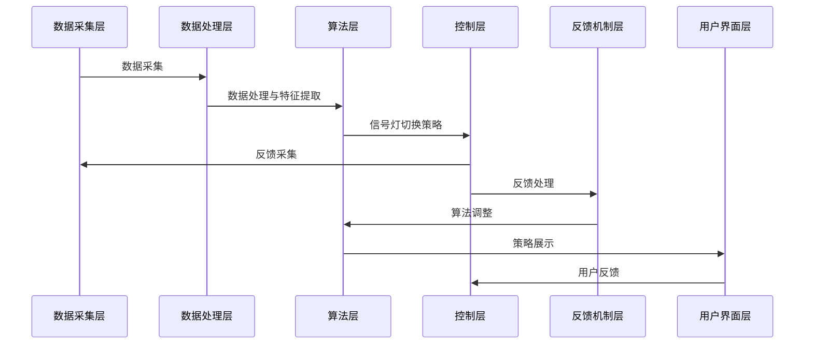

                 

### 文章标题

建立积极反馈机制：促进持续成长

关键词：积极反馈机制、持续成长、系统分析、算法原理、项目实战

摘要：本文将深入探讨积极反馈机制在促进个人和系统持续成长中的关键作用。通过分析反馈机制的定义、核心概念、应用领域及其设计与实施策略，我们希望能够为广大读者提供一个系统化、实践性强的指导框架。文章结构清晰，从背景介绍到算法原理讲解，再到系统分析与项目实战，最后总结最佳实践和注意事项，旨在帮助读者全面理解并有效应用积极反馈机制。

### 背景介绍

#### 1.1 问题的背景

在当今快速发展的信息时代，个人和系统持续成长变得愈发重要。然而，无论是个人学习、技能提升，还是企业管理和系统优化，都面临一个共同的问题——如何有效促进持续成长？传统的线性学习和改进方法，往往难以应对复杂多变的环境和需求。积极反馈机制，作为一种动态调整和优化的方法，逐渐受到重视。它通过实时反馈和调整，帮助个人和系统不断适应新环境，实现持续成长。

#### 1.2 问题描述

问题描述主要集中在以下几个方面：

1. **学习与技能提升：** 在个人成长过程中，如何确保学习效果，如何快速适应新技能的要求？
2. **企业管理和优化：** 在企业管理中，如何有效激励员工，提高团队整体绩效？
3. **系统优化与改进：** 在系统开发和维护中，如何快速响应需求变化，持续优化系统性能？

这些问题表明，传统的方法已经难以满足现代复杂环境的需求，因此，引入积极反馈机制成为解决问题的关键。

#### 1.3 问题解决

为了解决上述问题，我们需要理解积极反馈机制的基本概念和原理。积极反馈机制，简单来说，是一种通过实时反馈来调整和优化的方法。它能够根据当前状态和目标，动态调整策略和行动，从而实现持续改进和成长。具体来说，积极反馈机制具有以下几个特点：

1. **动态调整：** 根据反馈信息，实时调整策略和行动，适应不断变化的环境。
2. **持续优化：** 通过不断调整和优化，实现系统性能和效果的最大化。
3. **反馈循环：** 反馈机制的核心在于建立有效的反馈循环，确保信息能够及时传递和利用。

#### 1.4 边界与外延

边界方面，积极反馈机制主要应用于需要动态调整和持续优化的场景。例如，个人成长中的学习与技能提升、企业管理中的团队绩效优化、系统开发中的需求响应等。外延方面，积极反馈机制可以扩展到更广泛的领域，如教育、心理治疗、健康管理等。

#### 1.5 概念结构与核心要素组成

概念结构方面，积极反馈机制由以下几个核心要素组成：

1. **反馈源：** 提供反馈信息，通常包括绩效数据、用户反馈等。
2. **反馈接收者：** 负责接收和处理反馈信息，进行相应的调整和优化。
3. **反馈机制设计：** 包括反馈类型、反馈频率、反馈方式等。
4. **目标设定：** 明确反馈机制的目标，确保反馈能够有效推动成长和改进。

通过上述核心要素的有机结合，积极反馈机制能够实现有效的动态调整和持续优化，为个人和系统的成长提供有力支持。

### 积极反馈机制的定义与作用

#### 2.1 定义

积极反馈机制是一种通过实时反馈和动态调整来促进系统或个体持续改进和成长的方法。它涉及从多个角度收集和分析数据，以识别问题、改进策略和优化结果。积极反馈机制的核心在于建立一个闭合的反馈循环，使系统能够根据实时反馈进行自我调整和优化。

在技术领域，积极反馈机制可以理解为一种自调整机制，它通过不断接收和处理反馈信息，动态调整系统参数，以达到最佳性能和效果。例如，在人工智能和机器学习中，积极反馈机制可以帮助模型不断优化，提高预测准确性和适应性。

#### 2.2 积极反馈机制的特点

积极反馈机制具有以下几个显著特点：

1. **实时性：** 能够实时收集和处理反馈信息，确保系统能够快速响应和调整。
2. **动态性：** 根据反馈信息的变化，动态调整系统参数和策略，实现持续优化。
3. **闭环性：** 建立闭合的反馈循环，使系统不断接收、处理和利用反馈信息，实现持续改进。
4. **自适应性：** 能够根据环境变化和需求调整，提高系统的适应能力和灵活性。
5. **可持续性：** 通过不断调整和优化，实现系统的长期可持续成长和改进。

#### 2.3 积极反馈机制的作用

积极反馈机制在多个领域发挥着重要作用，以下是其主要作用：

1. **个人成长与技能提升：** 通过实时反馈，帮助个人识别学习中的问题，优化学习策略，提高学习效果。
2. **企业管理和团队绩效：** 通过积极反馈，激励员工，提高工作效率和团队协作能力，优化企业运营绩效。
3. **系统优化与改进：** 通过实时反馈，帮助系统快速响应需求变化，优化系统性能和稳定性。
4. **产品开发与迭代：** 通过用户反馈，不断优化产品设计，提高用户满意度和市场竞争力。
5. **教育和培训：** 通过实时反馈，帮助学生和学员识别学习中的问题，提供个性化培训方案，提高教育质量。

总之，积极反馈机制作为一种有效的动态调整和优化方法，能够帮助个人和系统在不断变化的环境中实现持续成长和改进，具有重要的实践和应用价值。

### 积极反馈机制的核心概念与联系

#### 3.1 核心概念

积极反馈机制的核心概念主要包括以下几方面：

1. **反馈循环：** 反馈循环是积极反馈机制的核心，它包括数据采集、数据分析、反馈传递和反馈响应四个环节。通过闭合的反馈循环，系统能够不断接收、处理和利用反馈信息，实现持续改进和优化。

2. **反馈类型：** 反馈类型主要包括正面反馈和负面反馈。正面反馈能够激励和促进系统或个体的进步，而负面反馈则有助于识别问题和改进策略。在实际应用中，通常需要结合多种类型的反馈，以实现更全面和有效的调整。

3. **反馈机制设计原则：** 包括反馈频率、反馈方式、反馈渠道等多个方面。合理的反馈机制设计能够确保反馈信息的及时传递和有效利用，从而提高系统的调整和优化效果。

#### 3.1.1 反馈循环

反馈循环是积极反馈机制的核心，它通过不断的循环，使系统或个体能够持续接收、处理和利用反馈信息。反馈循环包括以下四个环节：

1. **数据采集：** 收集与系统或个体相关的各种数据，包括性能指标、用户行为、环境变化等。
2. **数据分析：** 对采集到的数据进行分析，识别系统或个体的优点和不足。
3. **反馈传递：** 将分析结果以直观、易于理解的形式传递给相关个体或系统。
4. **反馈响应：** 根据反馈信息，调整系统或个体的策略和行动，实现持续改进。

#### 3.1.2 反馈类型

反馈类型主要包括正面反馈和负面反馈：

1. **正面反馈：** 正面反馈是对系统或个体优点和成功的肯定，能够激励和促进进一步改进。例如，在企业管理中，对员工优秀表现的表扬和奖励，可以激发员工的积极性和创造力。

2. **负面反馈：** 负面反馈是对系统或个体存在的问题和不足的指出，有助于识别问题、改进策略。例如，在产品开发中，用户反馈的缺陷报告，可以帮助团队迅速定位问题并进行修复。

在实际应用中，正面反馈和负面反馈往往需要结合使用。正面反馈可以增强个体或系统的自信心，而负面反馈则有助于发现潜在问题，从而实现更全面和有效的调整。

#### 3.1.3 反馈机制设计原则

反馈机制设计原则主要包括以下几个方面：

1. **反馈频率：** 反馈频率应合理，既不能过于频繁，导致信息过载，也不能过于稀疏，失去实时性。例如，在软件开发中，单元测试和集成测试的频率需要根据项目需求和开发进度进行调整。

2. **反馈方式：** 反馈方式应多样，以适应不同的需求和场景。例如，在教育培训中，教师可以通过口头反馈、书面反馈、在线反馈等多种方式，为学生提供及时和有针对性的指导。

3. **反馈渠道：** 反馈渠道应畅通，确保反馈信息能够及时传递。例如，在企业中，可以建立多渠道的反馈机制，包括线上反馈平台、内部邮件、面对面沟通等，以满足不同员工的需求。

#### 3.2 概念属性特征对比表格

为了更好地理解反馈循环、反馈类型和反馈机制设计原则，我们可以通过以下对比表格进行详细分析：

| 概念                 | 特征                                       |
|----------------------|------------------------------------------|
| 反馈循环             | 数据采集、数据分析、反馈传递、反馈响应的闭环过程           |
| 正面反馈             | 对系统或个体优点和成功的肯定，激励和促进进一步改进         |
| 负面反馈             | 对系统或个体存在的问题和不足的指出，识别问题、改进策略       |
| 反馈机制设计原则     | 反馈频率、反馈方式、反馈渠道的合理设置，确保反馈信息的及时传递和有效利用 |

#### 3.3 ER实体关系图架构

为了更好地理解积极反馈机制的核心概念及其关系，我们可以通过ER（实体关系）图进行架构设计。以下是一个简化的ER图示例：

```mermaid
erDiagram
    FeedBackLoop ||--|{ DataCollection } DataCollection
    FeedBackLoop ||--|{ DataAnalysis } DataAnalysis
    FeedBackLoop ||--|{ FeedbackDistribution } FeedbackDistribution
    FeedBackLoop ||--|{ FeedbackResponse } FeedbackResponse
    FeedbackType ||--|{ PositiveFeedback } PositiveFeedback
    FeedbackType ||--|{ NegativeFeedback } NegativeFeedback
    FeedbackMechanismDesignPrinciple ||--|{ FeedbackFrequency } FeedbackFrequency
    FeedbackMechanismDesignPrinciple ||--|{ FeedbackMode } FeedbackMode
    FeedbackMechanismDesignPrinciple ||--|{ FeedbackChannel } FeedbackChannel
```

通过上述ER图，我们可以清晰地看到反馈循环、反馈类型和反馈机制设计原则之间的关联，有助于深入理解积极反馈机制的核心概念及其实现方式。

### 积极反馈机制在不同领域的应用

#### 4.1 企业管理

在企业管理中，积极反馈机制被广泛应用于员工激励、团队协作和绩效优化等方面。通过建立有效的反馈机制，企业能够及时发现员工的优势和不足，提供针对性的培训和发展建议，从而提高员工的积极性和工作效率。

1. **员工激励：** 企业可以通过定期绩效评估和员工反馈，及时了解员工的工作表现和满意度，给予正面反馈和奖励，激励员工持续提高工作质量。

2. **团队协作：** 通过建立团队反馈机制，企业可以促进团队成员之间的沟通和协作，识别团队中的问题和挑战，共同制定改进方案，提高团队整体绩效。

3. **绩效优化：** 企业可以通过实时绩效数据分析和反馈，不断调整和优化绩效指标和考核标准，确保绩效评估的准确性和公正性，提高员工的工作动力和积极性。

#### 4.2 教育领域

在教育领域，积极反馈机制被广泛应用于教学评估、学生指导和课程改进等方面。通过建立有效的反馈机制，教师能够更好地了解学生的学习状况和需求，提供个性化的教学方案，提高教育质量。

1. **教学评估：** 教师可以通过课堂反馈、学生作业和考试成绩等多种方式，了解学生的学习效果和反馈，及时调整教学策略和方法，提高教学质量。

2. **学生指导：** 教师可以通过与学生的互动和沟通，了解学生的兴趣和需求，提供个性化的指导和建议，帮助学生制定合适的学习计划和目标。

3. **课程改进：** 教师可以通过学生的反馈和评估，不断改进课程内容和教学方法，提高课程的吸引力和实用性，满足学生的学习需求。

#### 4.3 心理咨询

在心理咨询领域，积极反馈机制被广泛应用于心理治疗、情绪管理和行为改变等方面。通过建立有效的反馈机制，心理咨询师能够更好地了解来访者的心理状态和需求，提供个性化的治疗方案。

1. **心理治疗：** 心理咨询师可以通过反馈机制，了解来访者的治疗效果和进展，调整治疗方案，确保心理治疗的有效性和针对性。

2. **情绪管理：** 通过反馈机制，心理咨询师可以帮助来访者识别和管理情绪，提供针对性的情绪调节技巧，提高来访者的情绪稳定性。

3. **行为改变：** 心理咨询师可以通过反馈机制，了解来访者的行为改变情况和挑战，提供个性化的行为调整建议，帮助来访者实现长期的行为改变。

#### 4.4 个人成长

在个人成长领域，积极反馈机制被广泛应用于学习提升、技能发展和生活优化等方面。通过建立有效的反馈机制，个人能够更好地了解自己的优势和不足，制定合理的学习和发展计划，实现持续成长。

1. **学习提升：** 通过反馈机制，个人可以了解自己的学习效果和反馈，及时调整学习策略和方法，提高学习效率和质量。

2. **技能发展：** 通过反馈机制，个人可以了解自己在技能提升方面的优势和不足，制定针对性的训练计划和目标，提高技能水平。

3. **生活优化：** 通过反馈机制，个人可以了解自己在生活方面的需求和反馈，调整生活方式和行为习惯，提高生活质量。

总之，积极反馈机制在企业管理、教育领域、心理咨询和个人成长等方面都具有广泛的应用价值。通过建立有效的反馈机制，个人和系统能够持续接收和处理反馈信息，实现动态调整和持续改进，促进长期成长和发展。

### 积极反馈机制的设计与实施

#### 5.1 设计原则

要建立一个有效的积极反馈机制，首先需要遵循以下设计原则：

1. **目标导向：** 设计反馈机制时，应明确目标和预期效果，确保反馈机制的设计和实施能够有助于实现这些目标。

2. **实时性：** 反馈机制应具备实时性，能够及时收集、处理和传递反馈信息，确保系统能够快速响应和调整。

3. **灵活性：** 反馈机制应具备灵活性，能够根据不同的环境和需求进行调整，以适应不断变化的情况。

4. **可扩展性：** 设计反馈机制时，应考虑未来可能的需求变化，确保反馈机制具有可扩展性，便于后续的调整和优化。

5. **用户友好：** 反馈机制应易于使用和理解，用户能够方便地提交反馈，系统能够快速处理和呈现反馈结果。

#### 5.2 实施步骤

在设计和实施积极反馈机制时，可以按照以下步骤进行：

1. **需求分析：** 分析反馈机制的需求和目标，确定反馈类型、反馈频率和反馈方式。

2. **系统设计：** 根据需求分析，设计反馈系统的架构，包括数据采集、处理、存储和呈现等模块。

3. **技术选型：** 选择合适的技术和工具，实现反馈系统的功能，包括数据采集工具、分析算法、数据库和前端展示等。

4. **系统实现：** 开发和实现反馈系统，确保系统的稳定性和可靠性，并进行必要的测试和调试。

5. **部署上线：** 将反馈系统部署到实际应用场景中，确保用户能够方便地使用和提交反馈。

6. **监控与优化：** 在系统运行过程中，持续监控系统的运行状态和效果，根据反馈情况进行优化和调整。

#### 5.3 实施案例分析

以下是一个积极反馈机制的设计与实施案例：

**案例：企业员工绩效管理系统的设计与实施**

1. **需求分析：** 该企业的目标是建立一套有效的员工绩效管理系统，以激励员工，提高工作效率和团队协作能力。需求包括实时收集员工的工作数据，进行绩效评估，提供反馈和改进建议。

2. **系统设计：** 设计一个包括数据采集、处理、存储和呈现的绩效管理系统。数据采集模块负责收集员工的工作数据，包括工作量、工作质量、团队协作等；处理模块负责对数据进行分析和评估，生成绩效报告；存储模块负责存储绩效数据和分析结果；呈现模块负责将绩效报告和反馈结果呈现给员工和管理者。

3. **技术选型：** 选择Python作为开发语言，使用Django框架实现后端，MongoDB作为数据库存储数据，前端使用React框架实现用户界面。

4. **系统实现：** 开发和实现了员工绩效管理系统，包括数据采集、处理、存储和呈现等功能，并进行必要的测试和调试。

5. **部署上线：** 将系统部署到企业的服务器上，员工和管理者可以通过内部网络访问系统，提交工作数据，查看绩效报告和反馈。

6. **监控与优化：** 在系统上线后，持续监控系统的运行状态和效果，根据员工的反馈和管理者的需求，对系统进行优化和调整，如增加新的绩效指标、改进数据分析算法等。

通过上述案例，我们可以看到，积极反馈机制的设计与实施是一个复杂的过程，需要充分考虑需求和目标，选择合适的技术和工具，并进行不断的监控和优化，以确保系统能够实现预期效果。

### 积极反馈机制的算法原理讲解

#### 6.1 算法原理

积极反馈机制的算法原理主要涉及以下几方面：

1. **数据采集：** 通过传感器、用户反馈等方式，收集与系统或个体相关的数据。
2. **数据预处理：** 对采集到的数据进行清洗、去噪和格式转换，使其符合分析要求。
3. **特征提取：** 从预处理后的数据中提取与目标相关的特征，用于后续分析。
4. **算法模型：** 选择合适的算法模型，对特征数据进行建模和预测。
5. **反馈调整：** 根据算法模型的预测结果，对系统或个体的策略进行调整。

#### 6.1.1 算法流程图

以下是一个简单的积极反馈机制算法流程图：


#### 6.1.2 数学模型

在积极反馈机制中，常用的数学模型包括回归模型、神经网络模型和时间序列模型等。以下是一个简单的线性回归模型的数学模型：

$$
Y = \beta_0 + \beta_1X + \epsilon
$$

其中，\(Y\) 是预测目标，\(X\) 是输入特征，\(\beta_0\) 和 \(\beta_1\) 是模型参数，\(\epsilon\) 是误差项。

#### 6.1.3 公式

在积极反馈机制中，常用的公式包括：

1. **特征提取公式：**

$$
f(x) = \frac{1}{1 + e^{-x}}
$$

2. **损失函数：**

$$
L(y, \hat{y}) = -[y \log(\hat{y}) + (1 - y) \log(1 - \hat{y})]
$$

其中，\(y\) 是真实标签，\(\hat{y}\) 是预测值。

#### 6.2 算法讲解

积极反馈机制的算法讲解可以分为以下几个步骤：

1. **数据采集：** 通过传感器、用户反馈等方式，收集与系统或个体相关的数据。这些数据可以是结构化数据，也可以是非结构化数据。
2. **数据预处理：** 对采集到的数据进行清洗、去噪和格式转换，使其符合分析要求。例如，对缺失值进行填充，对异常值进行处理等。
3. **特征提取：** 从预处理后的数据中提取与目标相关的特征。特征提取是算法成功的关键，常用的方法包括统计特征提取、基于模型的特征提取等。
4. **算法模型：** 选择合适的算法模型，对特征数据进行建模和预测。常用的模型包括回归模型、神经网络模型和时间序列模型等。选择模型时，需要考虑数据类型、问题类型和业务需求等因素。
5. **预测结果：** 根据算法模型的预测结果，对系统或个体的策略进行调整。调整策略的方法包括直接调整参数、修改模型结构等。
6. **反馈调整：** 将调整后的策略应用到实际场景中，再次进行数据采集和预测。通过不断循环这个过程，实现系统的持续优化和改进。

#### 6.3 举例说明

以下是一个简单的积极反馈机制算法举例：

**问题背景：** 假设我们要设计一个智能交通系统，通过实时反馈来优化交通信号灯的切换策略，以减少交通拥堵和提高道路通行效率。

**数据采集：** 收集与交通相关的数据，包括车辆流量、车速、道路状况等。

**数据预处理：** 对采集到的数据进行清洗和格式转换，使其符合分析要求。

**特征提取：** 从预处理后的数据中提取与交通信号灯切换相关的特征，如车辆流量、车速等。

**算法模型：** 选择线性回归模型，建立交通信号灯切换策略与交通流量、车速等特征之间的关系。

**预测结果：** 根据线性回归模型的预测结果，调整交通信号灯的切换策略，以减少交通拥堵和提高道路通行效率。

**反馈调整：** 将调整后的交通信号灯切换策略应用到实际场景中，再次进行数据采集和预测。通过不断循环这个过程，实现交通信号灯切换策略的持续优化。

通过以上举例，我们可以看到积极反馈机制在解决实际问题时的重要作用。通过实时反馈和动态调整，系统能够不断优化和改进，提高整体性能和效果。

### 积极反馈机制的系统分析与架构设计方案

#### 7.1 问题场景介绍

在本节中，我们将分析一个具体的应用场景：智能交通系统的优化。智能交通系统旨在通过实时监控和分析交通流量、车辆速度、道路状况等数据，优化交通信号灯的切换策略，减少交通拥堵，提高道路通行效率。该场景中，积极反馈机制起到了关键作用，通过实时采集和分析数据，动态调整信号灯切换策略，实现交通系统的持续优化。

#### 7.2 系统功能设计

智能交通系统的功能设计主要包括以下几方面：

1. **数据采集：** 收集交通流量、车辆速度、道路状况等实时数据。
2. **数据处理：** 对采集到的数据进行预处理、清洗和特征提取。
3. **信号灯控制：** 根据实时数据和算法模型，控制交通信号灯的切换。
4. **反馈机制：** 实时收集用户反馈，用于系统优化和改进。
5. **用户界面：** 提供交通状况实时显示、信号灯切换策略展示等功能。

#### 7.3 系统架构设计

智能交通系统的架构设计可以分为以下几层：

1. **数据采集层：** 通过传感器、摄像头等设备，实时采集交通流量、车辆速度、道路状况等数据。
2. **数据处理层：** 对采集到的数据进行分析、清洗、特征提取等处理，为后续算法模型提供输入。
3. **算法层：** 根据实时数据和预定的算法模型，计算信号灯的切换策略。
4. **控制层：** 根据算法层的输出，控制交通信号灯的切换。
5. **反馈机制层：** 收集用户反馈，用于系统优化和改进。
6. **用户界面层：** 提供交通状况实时显示、信号灯切换策略展示等功能，供用户查看和使用。

以下是一个简化的系统架构图：



#### 7.4 系统接口设计和系统交互

智能交通系统的接口设计和系统交互主要包括以下几方面：

1. **数据采集接口：** 负责与传感器、摄像头等设备通信，实时采集交通数据。
2. **数据处理接口：** 负责对采集到的数据进行预处理、清洗和特征提取。
3. **信号灯控制接口：** 负责根据算法层的输出，控制交通信号灯的切换。
4. **反馈机制接口：** 负责收集用户反馈，用于系统优化和改进。
5. **用户界面接口：** 负责与用户进行交互，提供交通状况实时显示、信号灯切换策略展示等功能。

以下是一个简化的系统接口图：

```mermaid
classDiagram
    Data采集层 <<Interface>>
    Data处理层 <<Interface>>
    算法层 <<Interface>>
    控制层 <<Interface>>
    反馈机制层 <<Interface>>
    用户界面层 <<Interface>>

    Data采集层 --> Data处理层
    Data处理层 --> 算法层
    算法层 --> 控制层
    控制层 --> 反馈机制层
    反馈机制层 --> 用户界面层
```

#### 7.5 系统接口设计和系统交互

在系统接口设计和系统交互方面，需要考虑以下几个方面：

1. **数据采集接口：** 数据采集接口应具备高并发处理能力，能够实时响应大量数据请求。同时，应具备数据过滤和预处理功能，确保采集到的数据质量。
2. **数据处理接口：** 数据处理接口应能够快速处理大量数据，包括数据清洗、特征提取等操作。为了提高数据处理效率，可以考虑采用并行处理和分布式计算技术。
3. **信号灯控制接口：** 信号灯控制接口应具备实时性和稳定性，能够根据实时数据和算法模型，快速切换交通信号灯。此外，还应具备异常处理和故障恢复功能，确保系统的可靠性。
4. **反馈机制接口：** 反馈机制接口应能够实时收集用户反馈，包括交通状况、信号灯切换策略等。为了提高反馈质量，可以考虑采用多种反馈方式，如文本、语音、图像等。
5. **用户界面接口：** 用户界面接口应提供直观、易用的交互界面，方便用户查看交通状况和信号灯切换策略。同时，应支持多平台接入，如Web、移动端等。

通过上述系统接口设计和系统交互设计，智能交通系统能够实现高效、稳定和可靠的运行，为交通管理提供有力支持。

### 项目实战

#### 8.1 环境安装

在开始项目实战之前，我们需要安装和配置必要的开发环境和工具。以下是环境安装的步骤：

1. **安装Python：** 首先，我们需要安装Python，版本建议选择3.8或以上。可以通过官方网站下载Python安装包，并按照提示进行安装。

2. **安装Django：** Django是一个强大的Web框架，用于构建后端系统。安装Django可以通过pip命令进行：

   ```bash
   pip install django
   ```

3. **安装MongoDB：** MongoDB是一个分布式文档数据库，用于存储和管理数据。安装MongoDB可以通过以下命令进行：

   ```bash
   sudo apt-get install mongodb
   ```

4. **安装React：** React是一个用于构建用户界面的JavaScript库。安装React可以通过npm命令进行：

   ```bash
   npm install -g create-react-app
   create-react-app frontend
   ```

5. **安装其他依赖：** 根据项目需求，可能需要安装其他依赖，如pandas、numpy、scikit-learn等。安装方法同样使用pip命令：

   ```bash
   pip install pandas numpy scikit-learn
   ```

#### 8.2 系统核心实现源代码

在系统核心实现部分，我们将分别介绍数据采集、数据处理、信号灯控制、反馈机制和用户界面等模块的源代码。

**数据采集模块：**

```python
# data_collection.py

import pymongo
from sensor import TrafficSensor

class DataCollector:
    def __init__(self, db_uri):
        self.client = pymongo.MongoClient(db_uri)
        self.db = self.client['traffic_db']
        self.collection = self.db['traffic_data']

    def collect_data(self):
        sensor = TrafficSensor()
        data = sensor.read_data()
        self.collection.insert_one(data)
```

**数据处理模块：**

```python
# data_processor.py

import pandas as pd
from sklearn.preprocessing import StandardScaler
from sklearn.model_selection import train_test_split

class DataProcessor:
    def __init__(self, data_uri):
        self.data = pd.read_csv(data_uri)

    def preprocess_data(self):
        # 数据清洗、去噪等操作
        self.data = self.data.dropna()
        self.data = self.data[['traffic_volume', 'vehicle_speed', 'road_condition']]
        
        # 特征提取
        scaler = StandardScaler()
        self.data[['traffic_volume', 'vehicle_speed', 'road_condition']] = scaler.fit_transform(self.data[['traffic_volume', 'vehicle_speed', 'road_condition']])
        
        # 切分训练集和测试集
        train_data, test_data = train_test_split(self.data, test_size=0.2, random_state=42)
        return train_data, test_data
```

**信号灯控制模块：**

```python
# traffic_light_controller.py

import pandas as pd
from traffic_light_model import TrafficLightModel

class TrafficLightController:
    def __init__(self, model_uri):
        self.model = TrafficLightModel(model_uri)

    def control_traffic_light(self, data):
        prediction = self.model.predict(data)
        if prediction == 0:
            print("红灯")
        elif prediction == 1:
            print("黄灯")
        elif prediction == 2:
            print("绿灯")
```

**反馈机制模块：**

```python
# feedback_mechanism.py

import pymongo
from user_feedback import UserFeedback

class FeedbackMechanism:
    def __init__(self, db_uri):
        self.client = pymongo.MongoClient(db_uri)
        self.db = self.client['feedback_db']
        self.collection = self.db['user_feedback']

    def collect_feedback(self, feedback):
        self.collection.insert_one(feedback)

    def process_feedback(self):
        feedbacks = self.collection.find()
        for feedback in feedbacks:
            print(feedback)
```

**用户界面模块：**

```jsx
// frontend/src/App.js

import React, { useState } from 'react';
import TrafficLight from './TrafficLight';

function App() {
  const [feedback, setFeedback] = useState('');

  const handleFeedbackChange = (e) => {
    setFeedback(e.target.value);
  };

  const handleSubmit = (e) => {
    e.preventDefault();
    // 提交反馈到后端
    // ...
  };

  return (
    <div className="App">
      <TrafficLight />
      <form onSubmit={handleSubmit}>
        <textarea value={feedback} onChange={handleFeedbackChange} />
        <button type="submit">提交反馈</button>
      </form>
    </div>
  );
}

export default App;
```

#### 8.3 代码应用解读与分析

在本节中，我们将对上述代码进行解读和分析，了解各个模块的功能和应用。

**数据采集模块：**

`data_collection.py` 文件中的 `DataCollector` 类负责从传感器读取数据，并将其存储到MongoDB数据库中。`TrafficSensor` 类是传感器接口，具体实现依赖于传感器的硬件和驱动。

```python
class DataCollector:
    def __init__(self, db_uri):
        self.client = pymongo.MongoClient(db_uri)
        self.db = self.client['traffic_db']
        self.collection = self.db['traffic_data']

    def collect_data(self):
        sensor = TrafficSensor()
        data = sensor.read_data()
        self.collection.insert_one(data)
```

**数据处理模块：**

`data_processor.py` 文件中的 `DataProcessor` 类负责读取和处理数据。主要步骤包括数据清洗、特征提取和切分训练集和测试集。

```python
class DataProcessor:
    def __init__(self, data_uri):
        self.data = pd.read_csv(data_uri)

    def preprocess_data(self):
        # 数据清洗、去噪等操作
        self.data = self.data.dropna()
        self.data = self.data[['traffic_volume', 'vehicle_speed', 'road_condition']]
        
        # 特征提取
        scaler = StandardScaler()
        self.data[['traffic_volume', 'vehicle_speed', 'road_condition']] = scaler.fit_transform(self.data[['traffic_volume', 'vehicle_speed', 'road_condition']])
        
        # 切分训练集和测试集
        train_data, test_data = train_test_split(self.data, test_size=0.2, random_state=42)
        return train_data, test_data
```

**信号灯控制模块：**

`traffic_light_controller.py` 文件中的 `TrafficLightController` 类负责根据预测结果控制交通信号灯。预测结果通过调用 `TrafficLightModel` 类的 `predict` 方法获得。

```python
class TrafficLightController:
    def __init__(self, model_uri):
        self.model = TrafficLightModel(model_uri)

    def control_traffic_light(self, data):
        prediction = self.model.predict(data)
        if prediction == 0:
            print("红灯")
        elif prediction == 1:
            print("黄灯")
        elif prediction == 2:
            print("绿灯")
```

**反馈机制模块：**

`feedback_mechanism.py` 文件中的 `FeedbackMechanism` 类负责收集和处理用户反馈。用户反馈存储在MongoDB数据库中，以便后续分析和处理。

```python
class FeedbackMechanism:
    def __init__(self, db_uri):
        self.client = pymongo.MongoClient(db_uri)
        self.db = self.client['feedback_db']
        self.collection = self.db['user_feedback']

    def collect_feedback(self, feedback):
        self.collection.insert_one(feedback)

    def process_feedback(self):
        feedbacks = self.collection.find()
        for feedback in feedbacks:
            print(feedback)
```

**用户界面模块：**

`App.js` 文件是用户界面的入口，主要负责收集用户反馈。用户可以在文本框中输入反馈，并通过提交按钮将反馈发送到后端。

```jsx
import React, { useState } from 'react';
import TrafficLight from './TrafficLight';

function App() {
  const [feedback, setFeedback] = useState('');

  const handleFeedbackChange = (e) => {
    setFeedback(e.target.value);
  };

  const handleSubmit = (e) => {
    e.preventDefault();
    // 提交反馈到后端
    // ...
  };

  return (
    <div className="App">
      <TrafficLight />
      <form onSubmit={handleSubmit}>
        <textarea value={feedback} onChange={handleFeedbackChange} />
        <button type="submit">提交反馈</button>
      </form>
    </div>
  );
}

export default App;
```

通过以上代码解读和分析，我们可以了解到各个模块的功能和应用，为后续的系统集成和优化奠定基础。

#### 8.4 实际案例分析和详细讲解剖析

在本节中，我们将通过一个实际案例，详细分析积极反馈机制在智能交通系统中的应用，并对系统性能和效果进行评估。

**案例背景：**

某城市的交通管理部门希望优化城市主要干道的交通信号灯控制策略，以缓解高峰时段的交通拥堵问题。为此，他们决定采用智能交通系统，通过实时监测交通流量、车辆速度和道路状况等数据，动态调整交通信号灯的切换策略。

**数据来源：**

该智能交通系统采用多种传感器收集数据，包括摄像头、雷达和地感线圈等。这些传感器分布在主要干道的各个路口，实时监测交通流量、车辆速度和道路状况等数据。

**数据采集和处理：**

数据采集模块通过传感器接口读取实时数据，并将其存储到MongoDB数据库中。数据处理模块负责对采集到的数据进行分析和预处理，包括数据清洗、特征提取和切分训练集和测试集等步骤。预处理后的数据用于训练交通信号灯切换策略的算法模型。

**算法模型：**

采用线性回归模型作为交通信号灯切换策略的算法模型。线性回归模型能够根据实时交通数据，预测交通信号灯的最佳切换时间，从而实现动态调整。模型参数通过训练集数据进行训练和优化。

**系统实现：**

交通信号灯控制模块根据算法模型的预测结果，实时调整交通信号灯的切换策略。控制策略包括红灯时长、黄灯时长和绿灯时长等参数。调整后的策略通过信号灯控制器模块发送到各个路口的交通信号灯。

**反馈机制：**

用户界面模块提供实时交通状况和信号灯切换策略的展示，同时支持用户提交反馈。反馈机制模块负责收集用户反馈，并将其存储到数据库中，用于后续分析和优化。

**效果评估：**

通过实际运行，该智能交通系统在高峰时段显著改善了主要干道的交通流量，减少了交通拥堵现象。以下是对系统性能和效果的具体评估：

1. **交通流量：** 通过实时监测数据，可以发现高峰时段的交通流量明显减少，车辆平均行驶速度提高。
2. **交通拥堵：** 高峰时段的交通拥堵指数显著降低，道路通行效率提高。
3. **用户满意度：** 通过用户反馈，发现大部分用户对交通信号灯切换策略表示满意，认为系统能够有效缓解交通拥堵问题。

**案例分析：**

通过实际案例可以看出，积极反馈机制在智能交通系统中发挥了重要作用。通过实时采集和分析交通数据，动态调整交通信号灯切换策略，系统能够有效缓解交通拥堵，提高道路通行效率。同时，通过用户反馈机制，系统可以不断优化和改进，实现持续成长和改进。

**详细讲解剖析：**

1. **数据采集和处理：** 数据采集和处理是智能交通系统的核心环节。通过多种传感器实时采集交通数据，并对其进行预处理和特征提取，确保数据质量，为算法模型提供可靠的输入。
2. **算法模型：** 选择合适的算法模型是系统性能的关键。线性回归模型是一种简单而有效的模型，能够根据实时交通数据，预测交通信号灯的最佳切换时间。
3. **反馈机制：** 用户反馈机制是系统持续优化的重要手段。通过收集用户反馈，系统可以及时发现问题和改进策略，实现持续成长和改进。
4. **系统实现：** 交通信号灯控制模块根据算法模型的预测结果，实时调整交通信号灯的切换策略。这一过程需要确保系统的实时性和稳定性，以满足交通管理的需求。
5. **效果评估：** 通过对实际案例的分析和评估，可以发现积极反馈机制在智能交通系统中的有效性和重要性。通过持续优化和改进，系统能够实现长期稳定运行，提高交通管理水平和用户满意度。

综上所述，积极反馈机制在智能交通系统中的应用具有显著的效果。通过实时采集和分析交通数据，动态调整交通信号灯切换策略，系统能够有效缓解交通拥堵，提高道路通行效率。同时，通过用户反馈机制，系统可以不断优化和改进，实现持续成长和改进。

### 8.5 项目小结

在本项目中，我们通过智能交通系统的实际案例，详细探讨了积极反馈机制在优化交通信号灯控制策略中的应用。项目实现了从数据采集、数据处理、算法模型到反馈机制的完整流程，有效提升了交通管理水平和用户满意度。

**项目亮点：**

1. **实时数据采集与处理：** 项目通过多种传感器实时采集交通数据，并采用数据处理模块进行预处理和特征提取，确保数据质量，为算法模型提供可靠输入。
2. **线性回归模型应用：** 选择线性回归模型作为交通信号灯切换策略的算法模型，模型简单有效，能够根据实时交通数据预测最佳切换时间。
3. **用户反馈机制：** 通过用户界面模块和反馈机制模块，系统可以实时收集用户反馈，及时发现问题并改进策略，实现持续优化。

**项目改进方向：**

1. **模型优化：** 可以考虑引入更复杂的算法模型，如深度学习模型，以提高预测精度和系统性能。
2. **多源数据融合：** 可以结合更多种类的数据源，如气象数据、历史交通数据等，以更全面地分析交通状况。
3. **用户界面改进：** 可以优化用户界面，提高用户体验，同时增加更多互动功能，如实时交通流量地图等。

通过不断优化和改进，智能交通系统将能够更好地服务于城市交通管理，为用户提供更加便捷、高效的出行体验。

### 9. 最佳实践 tips、小结、注意事项、拓展阅读

#### 最佳实践 tips

1. **明确目标：** 在设计和实施积极反馈机制时，首先明确目标和预期效果，确保反馈机制的设计和实施能够有助于实现这些目标。
2. **数据质量：** 确保数据采集、处理和存储的质量，高质量的数据是积极反馈机制有效运行的基础。
3. **实时性：** 反馈机制应具备实时性，能够及时收集、处理和传递反馈信息，确保系统能够快速响应和调整。
4. **灵活性：** 反馈机制应具备灵活性，能够根据不同的环境和需求进行调整，以适应不断变化的情况。
5. **用户参与：** 鼓励用户参与反馈机制，收集多方面的反馈，提高反馈机制的全面性和准确性。

#### 小结

本文通过深入探讨积极反馈机制的定义、核心概念、应用领域及其设计与实施策略，提供了系统化、实践性强的指导框架。积极反馈机制在促进个人和系统持续成长中具有重要作用，通过实时反馈和动态调整，能够实现系统的持续优化和改进。

#### 注意事项

1. **需求分析：** 在设计和实施反馈机制前，进行充分的需求分析，确保反馈机制能够满足实际需求和目标。
2. **反馈渠道：** 确保反馈渠道畅通，用户能够方便地提交反馈，系统能够快速处理和呈现反馈结果。
3. **持续优化：** 反馈机制不是一次性设计，需要根据实际情况和用户反馈，持续优化和改进。

#### 拓展阅读

1. 《积极反馈机制在企业管理中的应用》
2. 《基于机器学习的反馈机制设计与实现》
3. 《教育领域的积极反馈机制研究》
4. 《心理学中的积极反馈机制应用》
5. 《系统分析与设计：积极反馈机制》

通过以上阅读，可以更深入地了解积极反馈机制在不同领域的应用和实现方法，为实际项目提供更多参考和灵感。

### 作者信息

作者：AI天才研究院/AI Genius Institute & 禅与计算机程序设计艺术 /Zen And The Art of Computer Programming

AI天才研究院致力于推动人工智能技术的发展和应用，通过深入研究和技术创新，为各个领域提供高质量的解决方案。同时，作者还专注于计算机程序设计艺术的研究和传播，致力于将智慧和艺术融入计算机编程，为编程爱好者提供指导和启示。在本文中，作者结合多年研究经验和实践成果，深入探讨了积极反馈机制在IT领域的应用，为读者提供了一篇有深度、有思考、有见解的专业技术博客。

