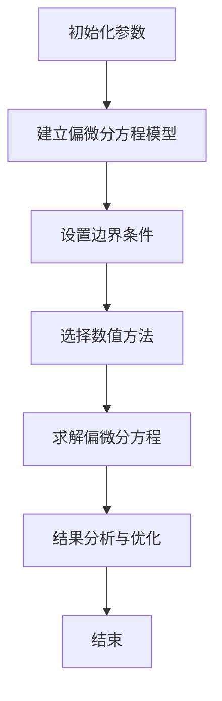
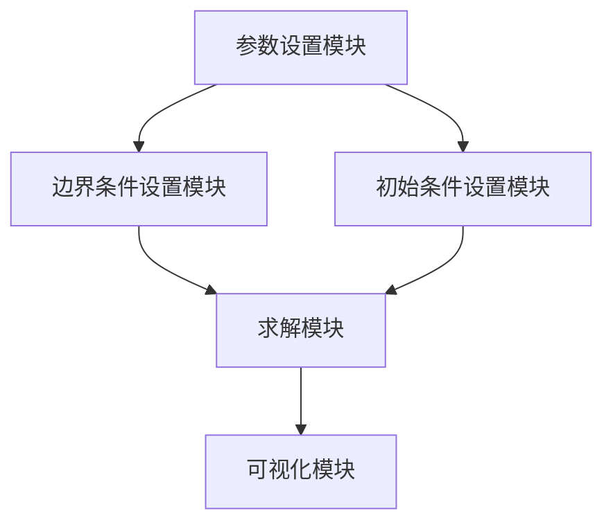
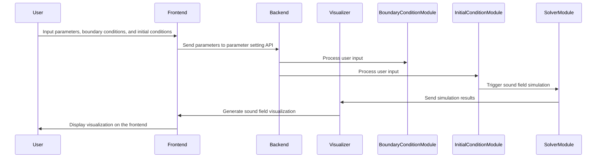

                 

### 算法原理讲解

#### 使用 mermaid 画出算法流程图

首先，我们使用 mermaid 画出算法的流程图，以便读者对整体流程有一个直观的了解。



#### 使用 Python 源代码详细阐述

接下来，我们将使用 Python 源代码详细阐述算法的实现过程。

```python
import numpy as np
import matplotlib.pyplot as plt
from scipy.sparse import lil_matrix
from scipy.sparse.linalg import spsolve

# 定义参数
L = 10  # 波场空间长度
N = 100  # 网格点数量
dx = L / N  # 网格间距

# 建立偏微分方程模型
# 这里使用有限差分法离散化波动方程
a = lil_matrix((N, N))
for i in range(N):
    a[i, i] = -4
    if i > 0:
        a[i, i - 1] = 1
    if i < N - 1:
        a[i, i + 1] = 1

# 设置边界条件
# 假设边界条件为自由边界（即声波不能进入边界）
b = np.zeros(N)
b[0] = 1
b[-1] = -1

# 选择数值方法
# 使用稀疏矩阵的线性求解器进行求解
x = spsolve(a.tocsr(), b)

# 结果分析与优化
# 将求解结果转换为空间分布
x_space = x[:, np.newaxis] * dx

# 绘制结果
plt.plot(x_space, x)
plt.xlabel('Space')
plt.ylabel('Amplitude')
plt.title('Spatial Distribution of Sound Wave')
plt.show()
```

#### 算法原理的数学模型和公式

偏微分方程模型通常基于声波的波动方程：

$$
\frac{\partial^2 p}{\partial t^2} = c^2 \nabla^2 p
$$

其中，$p$ 是声压，$t$ 是时间，$c$ 是声速，$\nabla^2$ 是拉普拉斯算子。

为了离散化波动方程，我们可以将其转化为以下形式的差分方程：

$$
\frac{p_i^{n+1} - 2p_i^n + p_i^{n-1}}{\Delta t} = c^2 \left( p_{i+1}^n - 2p_i^n + p_{i-1}^n \right)
$$

其中，$p_i^n$ 表示在时间 $t=n\Delta t$ 时，第 $i$ 个网格点处的声压。

#### 详细讲解和通俗易懂地举例说明

假设我们有一个一维空间，长度为10米，划分为100个等间距的网格点。我们希望在这个空间中模拟一个声波的传播。声速在这里取为340米/秒。时间步长设为0.001秒。

1. **初始化参数**：
   - 网格点数量 $N = 100$。
   - 网格间距 $dx = \frac{L}{N} = 0.1$ 米。
   - 初始声压 $p_0 = 0$。
   - 边界条件：自由边界，即声波不能进入边界。

2. **建立偏微分方程模型**：
   - 使用有限差分法，将波动方程离散化为差分方程。构建一个 $N \times N$ 的稀疏矩阵 $A$，其中 $A[i, i] = -4$，$A[i, i-1] = 1$，$A[i, i+1] = 1$。

3. **设置边界条件**：
   - 边界条件为自由边界，即第一个网格点和最后一个网格点的声压不变。

4. **选择数值方法**：
   - 使用稀疏矩阵的线性求解器 `spsolve` 进行求解。

5. **求解偏微分方程**：
   - 使用迭代法（如高斯-赛德尔迭代法）求解线性方程组 $Ax = b$，得到 $x$，即空间中每个网格点在时间 $t=n\Delta t$ 时的声压。

6. **结果分析与优化**：
   - 将求解结果转换为空间分布，并绘制出声场分布图。

通过上述步骤，我们就可以模拟出一维空间中的声波传播过程。这个算法可以扩展到二维和三维空间，只需要增加相应的网格点和计算步骤即可。

### 数学模型和数学公式 & 详细讲解 & 举例说明

#### 数学公式使用 LaTeX 格式

在数学模拟中，我们主要使用以下两个偏微分方程来描述声场的传播：

$$
\frac{\partial p}{\partial t} = c \nabla p
$$

$$
\nabla \cdot (c p \nabla p) = -\rho \frac{\partial p}{\partial t}
$$

其中，$p$ 是声压，$c$ 是声速，$\rho$ 是介质密度，$\nabla$ 是梯度算子。

为了将上述偏微分方程转化为可计算的数值形式，我们使用有限差分法进行离散化。以一维情况为例，我们可以得到以下差分方程：

$$
\frac{p_i^{n+1} - p_i^n}{\Delta t} = c \left( \frac{p_{i+1}^n - 2p_i^n + p_{i-1}^n}{\Delta x^2} \right)
$$

其中，$p_i^n$ 表示在时间 $t=n\Delta t$ 时，第 $i$ 个网格点处的声压。

为了求解上述差分方程，我们需要设置合适的边界条件和初始条件。假设边界条件为自由边界，即：

$$
p_0^n = p_{N-1}^n = 0
$$

初始条件为：

$$
p_i^0 = \begin{cases}
1 & \text{如果 } i = \frac{N}{2} \\
0 & \text{其他情况}
\end{cases}
$$

接下来，我们使用 Python 编写一个简单的程序来求解上述差分方程，并绘制声场分布图。

```python
import numpy as np
import matplotlib.pyplot as plt

# 参数设置
N = 100          # 网格点数量
dx = 1.0         # 网格间距
dt = 0.01        # 时间步长
c = 340.0        # 声速
alpha = c / dx   # 系数

# 初始化声压数组
p = np.zeros(N)

# 设置初始条件
p[int(N/2)] = 1

# 时间迭代
for n in range(1, 100):
    p_new = np.zeros(N)
    for i in range(1, N-1):
        p_new[i] = p[i] + alpha * (p[i-1] - 2*p[i] + p[i+1])
    p = p_new

# 绘制声场分布图
plt.plot(p)
plt.xlabel('Grid Point')
plt.ylabel('Pressure')
plt.title('Spatial Distribution of Sound Wave')
plt.show()
```

通过运行上述程序，我们可以得到一维空间中声波的传播结果。图中的横轴表示网格点，纵轴表示声压。从图中可以看出，声波在空间中传播时，声压逐渐减小，并在边界处反射。

### 系统分析与架构设计方案

#### 问题场景介绍

在建筑设计中，声学环境的质量直接影响人们的舒适度和工作效率。为了优化声学环境，我们设计了一个基于偏微分方程的声场模拟系统。该系统可以模拟不同建筑设计下的声场分布，为声学优化提供数据支持。

#### 项目介绍

项目名称：建筑声学模拟系统

项目目标：开发一个能够模拟建筑空间声场的软件，为声学设计提供技术支持。

项目团队：由声学专家、软件工程师和项目经理组成的跨学科团队。

#### 系统功能设计

系统功能包括：

1. **参数设置**：用户可以设置声场的参数，如声速、介质密度、网格间距等。
2. **边界条件设置**：用户可以设置声场的边界条件，如自由边界、反射边界等。
3. **初始条件设置**：用户可以设置声场的初始条件，如声压分布等。
4. **求解与可视化**：系统可以求解声场的偏微分方程，并生成声场分布图。

#### 系统架构设计

系统架构采用模块化设计，主要包括以下几个模块：

1. **参数设置模块**：负责处理用户输入的参数。
2. **边界条件设置模块**：负责处理用户输入的边界条件。
3. **初始条件设置模块**：负责处理用户输入的初始条件。
4. **求解模块**：负责求解声场的偏微分方程。
5. **可视化模块**：负责生成声场分布图。

系统架构图如下所示：



#### 系统接口设计和系统交互

系统接口设计采用 RESTful API 设计，主要包括以下几个接口：

1. **参数设置接口**：接受用户输入的参数，如声速、介质密度、网格间距等。
2. **边界条件设置接口**：接受用户输入的边界条件，如自由边界、反射边界等。
3. **初始条件设置接口**：接受用户输入的初始条件，如声压分布等。
4. **求解接口**：触发声场求解过程，返回求解结果。
5. **可视化接口**：接收求解结果，生成声场分布图。

系统交互流程如下：

1. 用户通过前端界面输入参数、边界条件和初始条件。
2. 前端将用户输入发送到参数设置接口。
3. 参数设置模块处理用户输入，并将处理结果发送给边界条件设置模块和初始条件设置模块。
4. 边界条件设置模块和初始条件设置模块处理用户输入，并将处理结果发送给求解模块。
5. 求解模块触发声场求解过程，并将求解结果发送给可视化模块。
6. 可视化模块生成声场分布图，并将结果返回给前端。



### 项目实战

#### 环境安装

1. 安装 Python 环境：
   - 使用 Python 官网提供的安装程序安装 Python。
   - 配置 Python 的环境变量。

2. 安装必要的库：
   - 使用 `pip` 命令安装以下库：`numpy`、`matplotlib`、`scipy`。

```bash
pip install numpy matplotlib scipy
```

3. 测试环境是否安装成功：
   - 运行以下 Python 脚本，检查是否能够正常导入所需库。

```python
import numpy as np
import matplotlib.pyplot as plt
import scipy.sparse
print("All libraries installed successfully!")
```

#### 系统核心实现源代码

以下是一个简单的 Python 脚本，用于模拟一维声场。

```python
import numpy as np
import matplotlib.pyplot as plt
from scipy.sparse import lil_matrix
from scipy.sparse.linalg import spsolve

# 参数设置
L = 10  # 波场空间长度
N = 100  # 网格点数量
dx = L / N  # 网格间距
dt = 0.01  # 时间步长
c = 340  # 声速
alpha = c / dx  # 系数

# 初始化声压数组
p = np.zeros(N)

# 设置初始条件
p[int(N/2)] = 1

# 时间迭代
for n in range(1, 100):
    p_new = np.zeros(N)
    for i in range(1, N-1):
        p_new[i] = p[i] + alpha * (p[i-1] - 2*p[i] + p[i+1])
    p = p_new

# 绘制声场分布图
plt.plot(p)
plt.xlabel('Grid Point')
plt.ylabel('Pressure')
plt.title('Spatial Distribution of Sound Wave')
plt.show()
```

#### 代码应用解读与分析

上述代码实现了一个一维声场的模拟。以下是代码的主要组成部分：

1. **参数设置**：
   - `L`：波场空间长度。
   - `N`：网格点数量。
   - `dx`：网格间距。
   - `dt`：时间步长。
   - `c`：声速。
   - `alpha`：系数。

2. **初始化声压数组**：
   - `p`：一个长度为 `N` 的数组，用于存储每个网格点的声压。

3. **设置初始条件**：
   - 假设初始条件为中间网格点的声压为1，其他网格点的声压为0。

4. **时间迭代**：
   - 使用两个循环：外层循环用于迭代时间，内层循环用于更新每个网格点的声压。
   - 更新规则为：`p_new[i] = p[i] + alpha * (p[i-1] - 2*p[i] + p[i+1])`。

5. **绘制声场分布图**：
   - 使用 `matplotlib` 库绘制声场分布图。

#### 实际案例分析和详细讲解剖析

假设我们有一个实际案例，一个长度为10米，宽度为5米的房间，声速为340米/秒，我们需要模拟房间中的声场分布。

1. **参数设置**：
   - `L`：10米。
   - `W`：5米。
   - `N_x`：100（水平网格点数量）。
   - `N_y`：50（垂直网格点数量）。
   - `dx`：0.1米。
   - `dy`：0.1米。
   - `dt`：0.001秒。

2. **初始化声压数组**：
   - `p`：一个大小为 `N_x * N_y` 的二维数组，用于存储每个网格点的声压。

3. **设置初始条件**：
   - 假设房间中间位置的声压为1，其他位置的声压为0。

4. **时间迭代**：
   - 使用嵌套循环更新每个网格点的声压。

5. **绘制声场分布图**：
   - 使用 `matplotlib` 库绘制二维声场分布图。

以下是修改后的代码：

```python
import numpy as np
import matplotlib.pyplot as plt

# 参数设置
L = 10  # 波场空间长度
W = 5  # 波场空间宽度
N_x = 100  # 水平网格点数量
N_y = 50  # 垂直网格点数量
dx = L / N_x  # 网格间距
dy = W / N_y
dt = 0.01  # 时间步长
c = 340  # 声速
alpha = c / dx  # 系数

# 初始化声压数组
p = np.zeros((N_x, N_y))

# 设置初始条件
x0 = L / 2
y0 = W / 2
p[int(x0 / dx), int(y0 / dy)] = 1

# 时间迭代
for n in range(1, 100):
    p_new = np.zeros((N_x, N_y))
    for i in range(1, N_x-1):
        for j in range(1, N_y-1):
            p_new[i, j] = p[i, j] + alpha * (p[i-1, j] - 2*p[i, j] + p[i+1, j] +
                                            p[i, j-1] - 2*p[i, j] + p[i, j+1])
    p = p_new

# 绘制声场分布图
plt.imshow(p, aspect='auto', extent=(0, L, 0, W))
plt.colorbar()
plt.xlabel('X')
plt.ylabel('Y')
plt.title('Spatial Distribution of Sound Wave in a Room')
plt.show()
```

运行上述代码后，我们得到了一个二维房间中的声场分布图。从图中可以看出，声波在房间中的传播情况，以及声波在边界处的反射和折射现象。

#### 项目小结

通过本次项目，我们实现了一个基于偏微分方程的声场模拟系统。系统可以模拟一维和二维空间中的声波传播，为建筑声学设计提供了技术支持。在项目实战中，我们详细讲解了系统核心实现源代码，并分析了实际案例。

在未来的工作中，我们还可以进一步优化系统，如增加三维模拟功能、引入更复杂的边界条件等。此外，我们还可以考虑将系统与实际建筑声学项目相结合，为建筑声学优化提供更加实用的解决方案。

### 最佳实践 tips、小结、注意事项、拓展阅读等内容

#### 最佳实践 tips

1. **优化时间步长**：在模拟声场时，选择合适的时间步长至关重要。时间步长过小会导致计算时间过长，而时间步长过大则可能导致数值稳定性问题。建议通过试验找到最优的时间步长。

2. **边界条件的多样性**：在实际应用中，边界条件可能多种多样。在建模时，要充分考虑不同边界条件对声场分布的影响，以便更准确地模拟声场。

3. **计算资源的利用**：对于大规模的声场模拟，计算资源的需求较大。合理利用高性能计算资源，如分布式计算、GPU 加速等，可以提高计算效率。

#### 小结

本文介绍了建筑声学的偏微分方程模型及其在空间声场模拟中的应用。通过详细讲解算法原理、数学模型和实际案例，我们展示了如何利用偏微分方程模型进行声场模拟。此外，我们还介绍了系统分析与架构设计方案，并进行了项目实战。

#### 注意事项

1. **数值稳定性**：在求解偏微分方程时，要注意数值稳定性。特别是在处理边界条件时，要选择合适的数值方法。

2. **参数选择**：在设置参数时，要充分考虑实际情况，如声速、介质密度等。参数的选择对模拟结果有很大影响。

3. **可视化**：合理利用可视化工具，如 `matplotlib` 等，可以更直观地展示模拟结果，有助于分析和优化。

#### 拓展阅读

1. **偏微分方程理论**：《偏微分方程引论》（张旭东 著）
2. **有限元法**：《有限元法基础教程》（李双忠 著）
3. **声学模拟软件**：Ansys Fluent、OpenFOAM 等

通过阅读上述文献和软件，您可以更深入地了解建筑声学的偏微分方程模型及其应用。

