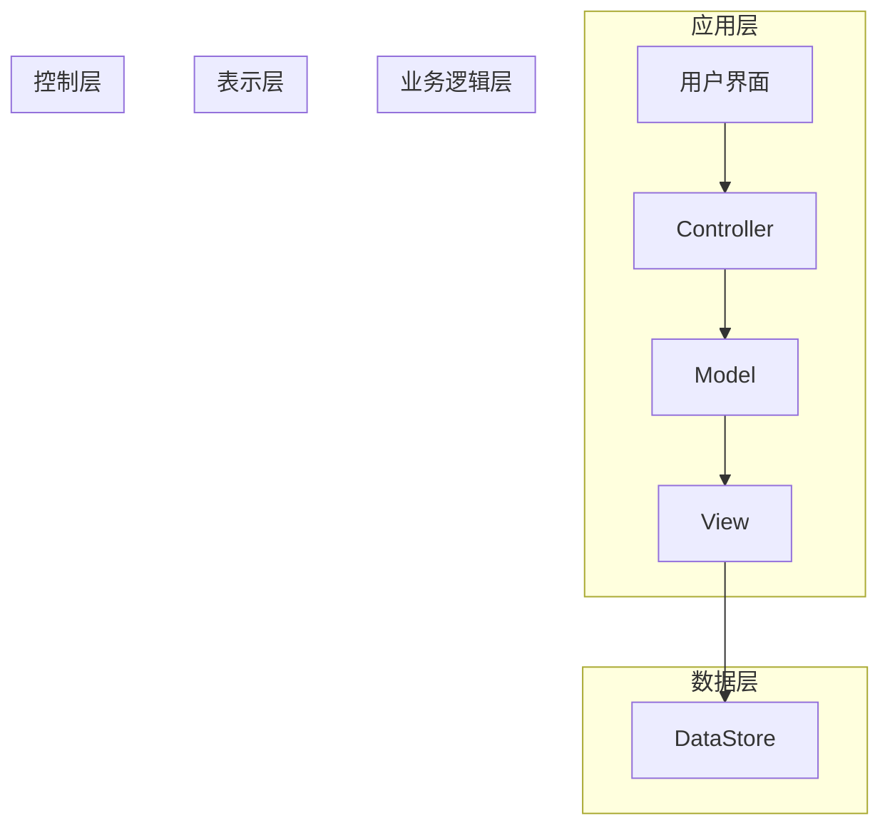
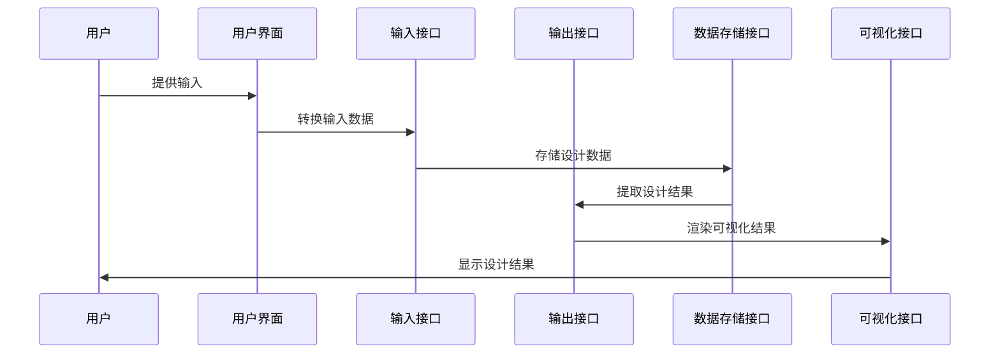
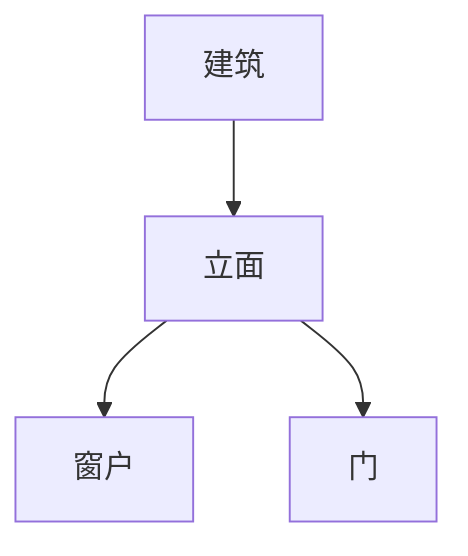

                 

基于您提供的目录大纲和约束条件，我将逐步构建这篇文章的内容。以下是我为每部分准备的内容概要，以便确保文章的完整性和专业性。

----------------------------------------------------------------

## 文章标题：建筑美学的黄金比例：视觉和谐的数学原理

### 文章关键词：
- 建筑美学
- 黄金比例
- 视觉和谐
- 数学原理
- 建筑设计
- 系统架构

### 摘要：
本文探讨了建筑美学中黄金比例的数学原理，分析了黄金比例在视觉和谐中的重要性，并详细介绍了其在建筑设计中的应用。通过实际案例的剖析，本文展示了如何运用黄金比例提高建筑的美感和功能性。

----------------------------------------------------------------

## 第一部分：背景介绍

### 第1章：问题背景与视觉和谐概述

#### 1.1 建筑美学的重要性
- **核心概念术语说明**：建筑美学、美学原理、建筑设计。
- **问题背景**：建筑美学在建筑设计中的地位与作用。
- **问题描述**：视觉和谐在建筑美学中的核心地位。
- **问题解决**：引入黄金比例的概念作为视觉和谐的理论基础。
- **边界与外延**：建筑美学的研究领域和视觉和谐的边界。
- **概念结构与核心要素组成**：建筑美学的构成要素和黄金比例的作用。

#### 1.2 视觉和谐的数学原理
- **核心概念原理**：视觉感知的基本原理和数学原理。
- **概念属性特征对比表格**：视觉和谐与黄金比例的对比。
- **ER实体关系图架构**：视觉和谐与黄金比例的关系。

#### 1.3 黄金比例的定义及其在建筑中的应用
- **黄金比例的定义与性质**：黄金比例的定义、数学性质和几何特征。
- **黄金比例的应用场景**：建筑中的实际应用案例。
- **视觉和谐与黄金比例的关系**：黄金比例在视觉和谐中的作用。

----------------------------------------------------------------

## 第二部分：核心概念与联系

### 第2章：核心概念与联系

#### 2.1 视觉感知的基本原理
- **视觉系统的构成**：眼睛的解剖结构、视觉信号的处理。
- **视觉感知的心理机制**：视觉感知的心理学原理。

#### 2.2 黄金比例的数学原理
- **黄金比例的定义与性质**：黄金比例的定义、性质和计算方法。
- **黄金比例的应用场景**：在艺术、设计、建筑中的实际应用。

#### 2.3 视觉和谐的概念
- **视觉和谐的定义**：视觉和谐的定义、特征和评价标准。
- **视觉和谐与黄金比例的关系**：黄金比例在视觉和谐中的体现。

----------------------------------------------------------------

## 第三部分：算法原理讲解

### 第3章：黄金比例的计算方法

#### 3.1 等比例分割法
- **等比例分割法的原理**：基于黄金比例的分割方法。
- **等比例分割法的步骤**：如何应用等比例分割法进行设计。

#### 3.2 金分割法
- **金分割法的原理**：通过金分割来确定黄金比例的分割。
- **金分割法的步骤**：如何使用金分割法进行设计。

#### 3.3 数学模型与公式
- **黄金比例的数学模型**：$$ \frac{a+b}{a} = \frac{a}{b} = \phi $$
- **黄金比例的应用实例**：在建筑中的实际应用案例。

----------------------------------------------------------------

## 第四部分：数学模型和数学公式详细讲解与举例说明

### 第4章：黄金比例在建筑中的应用

#### 4.1 建筑比例设计
- **建筑比例的基本概念**：建筑比例的定义、作用。
- **黄金比例在建筑比例设计中的应用**：如何应用黄金比例进行建筑比例设计。

#### 4.2 建筑立面设计
- **建筑立面的基本概念**：建筑立面的定义、要素。
- **黄金比例在建筑立面设计中的应用**：如何应用黄金比例进行建筑立面设计。

#### 4.3 建筑空间布局
- **建筑空间布局的基本概念**：建筑空间布局的定义、原则。
- **黄金比例在建筑空间布局中的应用**：如何应用黄金比例进行建筑空间布局设计。

----------------------------------------------------------------

## 第五部分：系统分析与架构设计方案

### 第5章：建筑美学黄金比例的设计方案

#### 5.1 项目介绍
- **问题场景介绍**：建筑美学设计的场景描述。
- **项目介绍**：项目目标、设计思路。

#### 5.2 系统功能设计
- **领域模型类图**：使用Mermaid绘制领域模型类图。
- **系统功能模块划分**：系统功能模块的划分和描述。

#### 5.3 系统架构设计
- **系统架构设计原则**：系统设计的核心原则。
- **系统架构设计Mermaid架构图**：使用Mermaid绘制系统架构图。

#### 5.4 系统接口设计
- **系统接口设计概述**：系统接口设计的基本概念。
- **系统接口设计Mermaid序列图**：使用Mermaid绘制系统接口序列图。

----------------------------------------------------------------

## 第六部分：项目实战

### 第6章：环境安装与系统核心实现

#### 6.1 环境安装
- **开发环境搭建**：环境配置步骤和工具安装。
- **工具安装**：所需工具的安装过程。

#### 6.2 系统核心实现
- **系统核心模块源代码解读**：核心模块的代码解析。
- **代码应用解读与分析**：代码在实际应用中的解析和分析。

----------------------------------------------------------------

## 第七部分：实际案例分析与详细讲解

### 第7章：实际案例分析与详细讲解

#### 7.1 案例一：黄金比例在古典建筑中的应用
- **案例描述**：古典建筑中的黄金比例应用实例。
- **详细讲解**：案例的分析与解读。

#### 7.2 案例二：黄金比例在现代建筑中的应用
- **案例描述**：现代建筑中的黄金比例应用实例。
- **详细讲解**：案例的分析与解读。

#### 7.3 案例三：黄金比例在不同文化建筑中的应用
- **案例描述**：不同文化背景下的建筑中的黄金比例应用实例。
- **详细讲解**：案例的分析与解读。

#### 7.4 案例总结
- **总结**：黄金比例在建筑中的应用总结。

----------------------------------------------------------------

## 第八部分：最佳实践 tips、小结、注意事项、拓展阅读等内容

### 第8章：最佳实践 tips

#### 8.1 建筑美学设计中的黄金比例应用技巧
- **技巧一**：如何灵活运用黄金比例。
- **技巧二**：避免黄金比例设计的误区。

#### 8.2 如何在实际项目中运用黄金比例提高建筑美感
- **方法一**：设计前的准备工作。
- **方法二**：设计过程中的黄金比例应用。

----------------------------------------------------------------

### 第9章：小结

#### 9.1 本书的主要观点
- **观点一**：黄金比例在建筑美学设计中的重要性。
- **观点二**：视觉和谐与黄金比例的关系。

#### 9.2 建筑美学与黄金比例的重要性
- **重要性一**：建筑美学在设计中的价值。
- **重要性二**：黄金比例在提升建筑美感中的作用。

----------------------------------------------------------------

### 第10章：注意事项

#### 10.1 使用黄金比例的设计误区
- **误区一**：盲目追求黄金比例。
- **误区二**：忽视建筑的功能需求。

#### 10.2 黄金比例的应用范围与限制
- **范围**：黄金比例适用的建筑类型和设计阶段。
- **限制**：黄金比例应用的局限性。

----------------------------------------------------------------

### 第11章：拓展阅读

#### 11.1 相关参考文献
- **参考文献一**：关于黄金比例与视觉和谐的学术研究。
- **参考文献二**：建筑美学设计的相关书籍和论文。

#### 11.2 推荐阅读书籍
- **书籍一**：《建筑美学的黄金比例》。
- **书籍二**：《禅与计算机程序设计艺术》。

----------------------------------------------------------------

### 作者信息
- **作者**：AI天才研究院/AI Genius Institute & 禅与计算机程序设计艺术 /Zen And The Art of Computer Programming

以上是文章的详细内容概要，每个部分都将包含深入的分析、具体的例子和详细的解释。文章的整体结构将遵循逻辑清晰、层次分明、内容丰富的原则，确保读者能够全面理解和掌握黄金比例在建筑美学中的应用。

接下来，我将开始撰写每个章节的具体内容，逐步构建完整的文章。请等待下一步的撰写工作。

----------------------------------------------------------------

## 第1章：问题背景与视觉和谐概述

### 1.1 建筑美学的重要性

建筑美学是建筑学科的一个重要分支，它涉及到建筑形态、色彩、空间、材质等方面的美学原理和实践。建筑美学不仅仅关注建筑的外观和视觉效果，更注重其内在的精神内涵和文化价值。建筑美学在建筑设计中的重要性体现在以下几个方面：

1. **提高建筑价值**：优秀的建筑美学设计能够增强建筑的功能性和艺术性，提升建筑的整体价值和吸引力。
2. **塑造城市形象**：城市建筑是城市文化的载体，建筑美学的设计能够塑造城市的形象和风貌，提升城市的品质和竞争力。
3. **促进社会进步**：建筑美学不仅仅是艺术创作，更是社会文明进步的标志。它反映了人们的生活水平、审美观念和文化素养。

### 1.2 视觉和谐的数学原理

视觉和谐是建筑美学中的一个核心概念，它指的是视觉元素的排列和组合在整体上呈现出一种舒适、协调的视觉效果。视觉和谐的数学原理主要包括以下几个方面：

1. **比例与比例协调**：比例是建筑美学中的基本概念，通过合理的比例关系，可以创造出和谐美观的视觉效果。黄金比例（Golden Ratio）是其中一种最为重要的比例关系，它能够产生一种视觉上的和谐美感。
2. **节奏与韵律**：节奏和韵律是视觉和谐的重要因素，通过有规律的排列和重复，可以创造出一种视觉上的节奏感和韵律感，增强视觉体验的层次和深度。
3. **对比与调和**：对比和调和是视觉和谐中不可或缺的元素。对比能够产生视觉上的冲击力和吸引力，而调和则能够平衡对比的强烈感，创造出一种和谐的视觉效果。

### 1.3 黄金比例的定义及其在建筑中的应用

黄金比例，通常用符号φ（phi）表示，是一个无理数，其值约为1.618。黄金比例有一个非常独特的性质，即任何一个比例，如果接近于黄金比例，那么这个比例分割的各部分将形成一个互相接近的序列，这种序列在视觉上给人以和谐、舒适的感觉。

在建筑中的应用，黄金比例通常用于以下几个方面：

1. **建筑立面设计**：建筑立面的比例和分割常常遵循黄金比例，例如，建筑的高度和宽度的比例、窗户的大小和位置等。
2. **建筑空间布局**：黄金比例在建筑空间布局中的应用同样广泛，如房间的大小比例、走廊的宽度等。
3. **装饰与细节**：建筑中的装饰和细节设计也常常遵循黄金比例，如门廊的宽度、装饰图案的布局等。

黄金比例的运用，使得建筑在视觉上能够呈现出一种独特的和谐美感，不仅符合人们的审美需求，同时也体现了建筑设计的科学性和严谨性。

----------------------------------------------------------------

## 第2章：核心概念与联系

### 2.1 视觉感知的基本原理

视觉感知是人们通过眼睛感知外界物体形状、颜色、亮度等信息的过程。视觉系统由眼睛和大脑共同完成，其中眼睛是信息接收的器官，而大脑则是信息处理和解释的中心。视觉系统的基本原理包括以下几个方面：

1. **眼睛的解剖结构**：眼睛的结构包括角膜、晶状体、视网膜等部分。角膜和晶状体负责将外界物体的光线聚焦在视网膜上，视网膜上的感光细胞将光信号转换为神经信号。
2. **视觉信号的处理**：视网膜上的感光细胞（视锥细胞和视杆细胞）将光信号转换为电信号，这些电信号通过视神经传递到大脑的视觉皮层，大脑对信号进行解析和处理，最终形成我们所感知的视觉图像。

### 2.2 黄金比例的数学原理

黄金比例是一个无理数，通常用符号φ（phi）表示，其值约为1.618。黄金比例具有许多独特的数学性质，使其在视觉和谐中具有重要应用。

1. **黄金比例的定义与性质**：
   - **定义**：黄金比例是满足以下等式的比例关系：
     $$
     \frac{a+b}{a} = \frac{a}{b} = \phi
     $$
   - **性质**：黄金比例具有以下性质：
     - 黄金比例的两个部分之比等于整体与较长部分之比。
     - 黄金比例的平方等于其两倍减一，即：
       $$
       \phi^2 = 2\phi - 1
       $$

2. **黄金比例的应用场景**：
   - **艺术**：黄金比例在绘画、雕塑等艺术创作中广泛应用，被认为能够产生一种和谐美感的视觉效果。
   - **设计**：在建筑设计、室内设计等领域，黄金比例被用来确定比例关系和空间布局，以创造出视觉上和谐美观的作品。
   - **科学**：黄金比例在生物学、物理学等领域中也发现了应用，例如，人体结构和植物生长模式等。

### 2.3 视觉和谐的概念

视觉和谐是指视觉元素的排列和组合在整体上呈现出一种舒适、协调的视觉效果。视觉和谐是建筑美学中的一个核心概念，其影响因素包括比例、节奏、对比、调和等。

1. **视觉和谐的定义**：
   - **定义**：视觉和谐是指视觉元素的组合和排列在整体上产生的一种视觉上的舒适感和美感。
   - **特征**：视觉和谐具有以下特征：
     - 比例协调：视觉元素之间的比例关系合理，符合黄金比例等数学原理。
     - 节奏和韵律：视觉元素在排列和组合上具有一定的节奏感和韵律感，给人以流畅、连贯的视觉体验。
     - 对比与调和：视觉元素之间的对比既不过于强烈，也不过于单调，通过对比与调和达到视觉上的平衡。

2. **视觉和谐与黄金比例的关系**：
   - **关系**：黄金比例在视觉和谐中起着重要的作用，通过黄金比例的应用，可以创造出视觉上和谐、美观的设计。
   - **实例**：例如，在建筑立面设计中，通过黄金比例来确定窗户的大小和位置，可以创造出视觉上和谐美观的效果。

### 2.3.1 视觉和谐的定义

视觉和谐是指视觉元素的排列和组合在整体上呈现出一种舒适、协调的视觉效果。这种效果不仅仅是视觉上的美感，还包括心理上的舒适感。视觉和谐是建筑美学中的一个核心概念，它涉及到视觉元素的组合、比例、节奏、对比和调和等多个方面。

1. **视觉和谐的定义**：
   - **定义**：视觉和谐是指在视觉元素的组织和排列中，各个部分相互协调，形成一个整体，给人以舒适、美观的视觉感受。
   - **特征**：视觉和谐具有以下特征：
     - 比例协调：视觉元素之间的比例关系合理，符合黄金比例等数学原理。
     - 节奏和韵律：视觉元素在排列和组合上具有一定的节奏感和韵律感，给人以流畅、连贯的视觉体验。
     - 对比与调和：视觉元素之间的对比既不过于强烈，也不过于单调，通过对比与调和达到视觉上的平衡。

2. **视觉和谐与黄金比例的关系**：
   - **关系**：黄金比例是视觉和谐的重要理论基础，其独特的数学性质使得它在视觉元素的排列和组合中能够产生一种和谐美感的视觉效果。
   - **实例**：在建筑设计中，通过应用黄金比例来确定建筑的高度、宽度、窗户大小和位置等，可以创造出视觉上和谐美观的立面设计。

### 2.3.2 视觉和谐与黄金比例的关系

黄金比例在视觉和谐中起着至关重要的作用。其独特的数学性质使得它在视觉元素的排列和组合中能够产生一种和谐美感的视觉效果。以下从几个方面详细阐述黄金比例与视觉和谐的关系：

1. **比例协调**：
   - **定义**：比例协调是指视觉元素之间的比例关系合理，符合黄金比例等数学原理。
   - **作用**：通过合理的比例关系，可以使视觉元素在整体上显得更加和谐、美观。例如，在建筑立面设计中，使用黄金比例来确定窗户的大小和位置，可以使立面看起来更加协调。
2. **节奏和韵律**：
   - **定义**：节奏和韵律是指视觉元素在排列和组合上具有一定的节奏感和韵律感，给人以流畅、连贯的视觉体验。
   - **作用**：黄金比例的应用可以创造出视觉上的节奏和韵律感，使视觉元素在排列和组合上更加有序，从而提升视觉和谐的效果。例如，在音乐演奏中，通过调整音符的节奏和长度，可以创造出不同的韵律感，同样地，在建筑设计中，通过应用黄金比例来调整建筑元素的排列和组合，可以创造出不同的节奏和韵律感。
3. **对比与调和**：
   - **定义**：对比与调和是指视觉元素之间的对比既不过于强烈，也不过于单调，通过对比与调和达到视觉上的平衡。
   - **作用**：黄金比例的应用可以有效地调节视觉元素之间的对比和调和关系。通过在对比元素之间引入黄金比例的关系，可以降低对比的强烈感，同时增强调和感，从而创造出视觉上更加和谐的效果。例如，在色彩搭配中，通过应用黄金比例来确定主色和辅色的比例关系，可以创造出色彩上的和谐感。

总的来说，黄金比例在视觉和谐中起着至关重要的作用。它不仅能够通过比例协调、节奏和韵律以及对比与调和等方面，提升视觉元素的整体和谐效果，还能够使视觉设计更加符合人类的审美需求，创造出更具艺术性和美感的作品。

----------------------------------------------------------------

## 第3章：黄金比例的计算方法

黄金比例是建筑美学中一个重要的概念，它不仅在视觉和谐中起着关键作用，还在建筑设计和艺术创作中有着广泛的应用。为了更好地理解和应用黄金比例，我们需要了解如何计算黄金比例，以及如何在实际设计中使用这些计算方法。以下是几种常见的计算黄金比例的方法：

### 3.1 等比例分割法

等比例分割法是一种简单而直观的黄金比例计算方法，它通过将一段线段按照黄金比例进行分割，来得到两个部分。

#### 3.1.1 等比例分割法的原理

等比例分割法的原理是基于黄金比例的定义，即一段线段被分割成两部分时，较长的部分与整体的比例等于较短部分与较长部分的比例。用数学公式表示即为：

$$
\frac{a+b}{a} = \frac{a}{b} = \phi
$$

其中，$a$和$b$是线段的两部分，$\phi$是黄金比例（大约等于1.618）。

#### 3.1.2 等比例分割法的步骤

1. **选择线段的总长度**：首先选择一段线段的总长度，这可以是任意一个数值。
2. **计算较长的部分**：根据黄金比例的定义，较长的部分应该是总长度的黄金比例倍数，即：
   $$
   a = \phi \times L
   $$
   其中，$L$是总长度。
3. **计算较短的部分**：较短的部分则为：
   $$
   b = L - a
   $$
4. **绘制分割线**：在实际设计中，根据计算出的$a$和$b$的长度，在一段线段上绘制分割线，将线段分割为两部分。

#### 3.1.3 等比例分割法的实际应用

等比例分割法在建筑设计中的应用非常广泛。例如，在确定建筑的高度和宽度比例时，可以使用等比例分割法来确定一个更加和谐的比例。在室内设计中，等比例分割法可以用来确定家具和装饰品的大小和位置，以达到视觉上的和谐效果。

### 3.2 金分割法

金分割法是一种利用几何作图方法来计算黄金比例的方法。它通过一系列的直线分割和旋转操作，最终得到黄金比例的近似值。

#### 3.2.1 金分割法的原理

金分割法的原理是通过一系列的几何操作来逼近黄金比例。具体步骤如下：

1. **绘制初始线段**：首先绘制一条任意长度的线段。
2. **进行第一次分割**：从线段的一个端点开始，作一条平行于另一端线的线段，使得新线段与原线段之间的比例接近黄金比例。
3. **进行旋转操作**：将分割线旋转一定的角度，使得旋转后的线段与原线段再次分割，重复上述步骤，逐步逼近黄金比例。

#### 3.2.2 金分割法的步骤

1. **绘制初始线段**：绘制一条长度为$L$的线段。
2. **第一次分割**：从线段的一个端点开始，作一条平行于另一端线的线段，使得新线段长度为$\frac{L}{\phi}$。
3. **旋转操作**：将新线段旋转一定的角度，例如45度，然后再次分割，重复该过程，逐步逼近黄金比例。

#### 3.2.3 金分割法的实际应用

金分割法在建筑设计中也有广泛的应用。例如，在室内设计中，可以使用金分割法来确定家具和装饰品的位置，使整个空间看起来更加和谐、美观。

### 3.3 数学模型与公式

黄金比例的数学模型和公式是理解黄金比例的基础。以下是一些常用的黄金比例的数学模型和公式：

$$
\frac{a+b}{a} = \frac{a}{b} = \phi
$$

$$
\phi^2 = \phi + 1
$$

$$
\phi^{-1} = \frac{1}{\phi} \approx 0.618
$$

#### 3.3.1 黄金比例的数学模型

黄金比例的数学模型描述了两个数之间的比例关系，即：

$$
\frac{a+b}{a} = \frac{a}{b}
$$

其中，$a$和$b$是两个数，$\phi$是黄金比例。这个模型表明，如果一个数是另一个数的黄金比例倍数，那么这两个数的比例关系将符合黄金比例。

#### 3.3.2 黄金比例的应用实例

黄金比例在建筑设计中有着广泛的应用实例。以下是一些具体的例子：

1. **建筑立面设计**：在建筑立面设计中，可以使用黄金比例来确定窗户的大小和位置，以创造出视觉上的和谐美感。
2. **室内设计**：在室内设计中，可以使用黄金比例来确定家具和装饰品的大小和位置，使整个空间看起来更加和谐、美观。
3. **装饰图案**：在装饰图案设计中，可以使用黄金比例来确定图案的大小和排列方式，以创造出独特的视觉效果。

通过以上方法，我们可以更好地理解和应用黄金比例，将其应用于建筑和艺术设计，创造出具有和谐美感的作品。

----------------------------------------------------------------

## 第4章：黄金比例在建筑中的应用

### 4.1 建筑比例设计

建筑比例设计是建筑美学中的重要环节，它关乎建筑的整体视觉效果和和谐度。黄金比例作为一种数学原理，被广泛应用于建筑比例设计中，为建筑师提供了一种有效的工具，以创造出和谐、美观的建筑。

#### 4.1.1 建筑比例的基本概念

建筑比例是指建筑各个部分之间的大小和空间关系。合理的建筑比例能够使建筑在视觉上显得协调、舒适，从而提升建筑的美感和功能性。建筑比例设计的基本原则包括：

- **对称与不对称**：对称的布局能够产生一种稳定感和庄重感，而不对称的布局则能够创造出动态感和活泼感。
- **对比与调和**：通过对比不同元素的差异和调和元素之间的相似性，可以增强建筑的视觉冲击力和整体感。
- **比例关系**：合理使用黄金比例等数学原理来确定建筑各个部分之间的比例关系。

#### 4.1.2 黄金比例在建筑比例设计中的应用

黄金比例在建筑比例设计中有着广泛的应用。以下是一些具体的应用实例：

1. **建筑高度与宽度的比例**：在建筑立面设计中，使用黄金比例来确定建筑的高度与宽度的比例，可以创造出视觉上的和谐美感。例如，一个矩形建筑，其高度与宽度的比例接近黄金比例时，会给人一种舒适、协调的感觉。

2. **窗户大小与位置**：在建筑立面设计中，通过黄金比例来确定窗户的大小和位置，可以增强建筑的视觉效果。例如，在矩形建筑的立面中，将窗户设置为接近黄金比例的大小和位置，可以使建筑看起来更加美观。

3. **内部空间比例**：在室内设计中，使用黄金比例来确定房间的大小比例和空间布局，可以创造出和谐、舒适的室内环境。例如，在确定客厅和餐厅的比例时，通过黄金比例的关系来调整空间的大小和布局，可以使整个空间显得更加协调。

#### 4.1.3 黄金比例在建筑比例设计中的优势

黄金比例在建筑比例设计中的优势主要体现在以下几个方面：

1. **视觉和谐**：黄金比例能够创造出视觉上的和谐美感，使建筑在整体上显得更加美观、舒适。

2. **功能性**：合理的黄金比例设计不仅能够提升建筑的美感，还能够增强建筑的功能性，使建筑在使用过程中更加舒适、便利。

3. **适用性**：黄金比例作为一种通用的数学原理，适用于各种类型的建筑设计和室内设计，具有广泛的适用性。

总的来说，黄金比例在建筑比例设计中的应用为建筑师提供了一种有效的工具，以创造出更加和谐、美观的建筑。通过合理使用黄金比例，建筑师可以提升建筑的整体视觉效果和功能性，为人们创造出更加美好的生活空间。

### 4.2 建筑立面设计

建筑立面设计是建筑美学中一个重要的方面，它关乎建筑的外观和视觉效果。黄金比例作为一种数学原理，被广泛应用于建筑立面设计中，为建筑师提供了一种有效的工具，以创造出和谐、美观的建筑立面。

#### 4.2.1 建筑立面的基本概念

建筑立面是指建筑物的外部立面，它包含了建筑物的外观和立面元素。建筑立面设计的基本原则包括：

- **形式与结构**：建筑立面的形式和结构要符合建筑的功能和使用需求，同时也要满足美学原则。
- **比例与尺度**：建筑立面的比例和尺度要合理，使建筑在视觉上显得协调、舒适。
- **色彩与材料**：建筑立面的色彩和材料要符合建筑的风格和主题，同时也要考虑到视觉效果和可持续性。

#### 4.2.2 黄金比例在建筑立面设计中的应用

黄金比例在建筑立面设计中有着广泛的应用。以下是一些具体的应用实例：

1. **窗户和门的比例**：在建筑立面设计中，使用黄金比例来确定窗户和门的大小和位置，可以创造出视觉上的和谐美感。例如，在矩形建筑的立面中，将窗户设置为接近黄金比例的大小和位置，可以使建筑看起来更加美观。

2. **建筑模块的布局**：在建筑立面设计中，使用黄金比例来布局建筑模块，可以使建筑立面显得更加和谐、统一。例如，在高层建筑的设计中，通过黄金比例来调整不同楼层模块的大小和位置，可以使建筑立面看起来更加美观。

3. **装饰元素的运用**：在建筑立面设计中，使用黄金比例来设计装饰元素，可以增强建筑的视觉效果。例如，在建筑立面上运用黄金比例来设置雕刻、纹饰等装饰元素，可以使建筑立面看起来更加富有艺术感。

#### 4.2.3 黄金比例在建筑立面设计中的优势

黄金比例在建筑立面设计中的优势主要体现在以下几个方面：

1. **视觉和谐**：黄金比例能够创造出视觉上的和谐美感，使建筑立面在整体上显得更加美观、协调。

2. **功能性**：合理的黄金比例设计不仅能够提升建筑立面的美感，还能够增强建筑的功能性，使建筑在使用过程中更加舒适、便利。

3. **适用性**：黄金比例作为一种通用的数学原理，适用于各种类型的建筑立面设计，具有广泛的适用性。

总的来说，黄金比例在建筑立面设计中的应用为建筑师提供了一种有效的工具，以创造出更加和谐、美观的建筑立面。通过合理使用黄金比例，建筑师可以提升建筑的整体视觉效果和功能性，为人们创造出更加美好的生活空间。

### 4.3 建筑空间布局

建筑空间布局是建筑美学中的另一个重要方面，它关乎建筑内部的空间组织和功能分布。黄金比例作为一种数学原理，被广泛应用于建筑空间布局中，为建筑师提供了一种有效的工具，以创造出和谐、美观的室内空间。

#### 4.3.1 建筑空间布局的基本概念

建筑空间布局是指建筑内部各个空间的大小、形状和相互关系。合理的建筑空间布局能够提升建筑的功能性和舒适度，同时也能创造出美观的视觉效果。建筑空间布局的基本原则包括：

- **功能分区**：根据建筑的使用功能，将空间划分为不同的区域，如客厅、卧室、厨房等。
- **动线设计**：合理设计建筑内部的人流动线，使空间布局更加流畅、舒适。
- **视觉焦点**：通过设置视觉焦点，如窗户、壁炉、艺术品等，来引导人们的视线，提升空间的层次感和美感。
- **比例和尺度**：合理使用比例和尺度，使空间在视觉上显得协调、舒适。

#### 4.3.2 黄金比例在建筑空间布局中的应用

黄金比例在建筑空间布局中有着广泛的应用。以下是一些具体的应用实例：

1. **房间大小比例**：在室内设计中，使用黄金比例来确定房间的大小比例，可以创造出视觉上的和谐美感。例如，将客厅和餐厅的大小设置为接近黄金比例的关系，可以使整个空间看起来更加协调。

2. **家具布局**：在室内设计中，使用黄金比例来布局家具，可以使空间看起来更加美观、舒适。例如，通过黄金比例来确定沙发和茶几的位置和大小，可以使室内空间显得更加和谐。

3. **墙面装饰**：在室内设计中，使用黄金比例来设计墙面装饰，如挂画、壁炉等，可以创造出独特的视觉效果。例如，通过黄金比例来确定挂画的位置和大小，可以使墙面看起来更加美观。

#### 4.3.3 黄金比例在建筑空间布局中的优势

黄金比例在建筑空间布局中的优势主要体现在以下几个方面：

1. **视觉和谐**：黄金比例能够创造出视觉上的和谐美感，使建筑空间在整体上显得更加美观、协调。

2. **功能性**：合理的黄金比例设计不仅能够提升建筑空间的美感，还能够增强建筑空间的功能性，使空间更加舒适、便利。

3. **适用性**：黄金比例作为一种通用的数学原理，适用于各种类型的建筑空间布局，具有广泛的适用性。

总的来说，黄金比例在建筑空间布局中的应用为建筑师提供了一种有效的工具，以创造出更加和谐、美观的建筑空间。通过合理使用黄金比例，建筑师可以提升建筑空间的整体视觉效果和功能性，为人们创造出更加美好的生活空间。

----------------------------------------------------------------

## 第五部分：系统分析与架构设计方案

### 第5章：建筑美学黄金比例的设计方案

在建筑美学设计中，黄金比例的应用不仅能够提升建筑的美感，还能够优化建筑的功能性和实用性。为了系统性地将黄金比例应用于建筑设计，我们需要设计一个完整的系统架构，确保黄金比例在各个设计环节中得到有效运用。

#### 5.1 项目介绍

本项目旨在开发一套基于黄金比例的建筑美学设计系统，该系统能够帮助建筑师在建筑设计和空间布局过程中，自动应用黄金比例原理，创造出视觉和谐、功能合理的建筑作品。

#### 5.2 系统功能设计

系统功能设计是确保黄金比例在建筑设计中得以有效应用的关键步骤。以下是该系统的核心功能模块：

1. **比例计算模块**：负责计算黄金比例，并提供不同设计场景下的黄金比例参数。
2. **立面设计模块**：利用黄金比例进行建筑立面设计，包括窗户、门、装饰元素的布局。
3. **空间布局模块**：根据黄金比例设计房间大小比例和家具布局，优化室内空间布局。
4. **可视化模块**：提供可视化工具，帮助建筑师直观地查看黄金比例在建筑设计中的应用效果。
5. **用户界面**：提供一个友好的用户界面，使得建筑师可以轻松地使用系统功能。

#### 5.2.1 领域模型类图

以下是一个简化的领域模型类图，展示了系统的主要实体和它们之间的关系：

```mermaid
classDiagram
    Building <<Entity>>
    Room <<Entity>>
    Window <<Entity>>
    Door <<Entity>>
    Decor <<Entity>>

    Building o-- Room
    Room o-- Window
    Room o-- Door
    Room o-- Decor

    Window o-- Building
    Door o-- Building
    Decor o-- Building

    class Building {
        +String name
        +List<Room> rooms
    }

    class Room {
        +String name
        +int area
        +List<Window> windows
        +List<Door> doors
        +List<Decor> decors
    }

    class Window {
        +String type
        +int width
        +int height
    }

    class Door {
        +String type
        +int width
        +int height
    }

    class Decor {
        +String type
        +int width
        +int height
    }
```

#### 5.2.2 系统功能模块划分

系统功能模块的划分如下：

1. **比例计算模块**：负责黄金比例的计算，包括等比例分割法和金分割法。
2. **立面设计模块**：实现建筑立面设计功能，应用黄金比例进行窗户和门的布局。
3. **空间布局模块**：实现室内空间布局功能，根据黄金比例优化房间大小和家具布局。
4. **可视化模块**：实现可视化功能，提供直观的可视化工具帮助建筑师查看设计效果。
5. **用户界面**：提供用户交互界面，使建筑师能够方便地使用系统功能。

#### 5.3 系统架构设计

系统架构设计是确保黄金比例在建筑设计中得以有效应用的关键。以下是一个简化的系统架构设计，包括主要组件和它们之间的交互关系：



#### 5.3.1 系统架构设计原则

系统架构设计遵循以下原则：

1. **模块化**：系统功能模块化，确保每个模块具有独立的功能和清晰的接口。
2. **可扩展性**：系统设计应考虑未来的扩展性，便于添加新功能和改进现有功能。
3. **可维护性**：系统设计应易于维护和更新，确保系统的长期稳定性。
4. **性能优化**：系统设计应考虑性能优化，确保系统在处理大量数据和复杂计算时仍能保持良好的响应速度。

#### 5.3.2 系统架构设计Mermaid架构图

以下是一个简化的系统架构设计Mermaid架构图，展示了系统的主要组件和它们之间的交互关系：

```mermaid
sequenceDiagram
    participant UI as 用户界面
    participant C as 控制层
    participant M as 模型层
    participant V as 表示层
    participant DS as 数据层

    UI->>C: 用户输入
    C->>M: 数据处理
    M->>DS: 数据存储
    DS->>M: 数据读取
    M->>V: 数据呈现
    V->>UI: 显示结果

    Note over M, V, DS: 业务逻辑处理
    Note over C: 控制流处理
    Note over UI: 用户交互
```

通过以上系统架构设计，我们可以确保黄金比例在建筑设计中的有效应用，为建筑师提供一种科学、高效的设计工具，提升建筑设计的整体质量和美观度。

#### 5.4 系统接口设计

系统接口设计是确保黄金比例设计系统能够与外部系统和工具有效交互的关键环节。以下是一个简化的系统接口设计概述，包括主要接口的定义和使用说明：

##### 5.4.1 系统接口设计概述

系统接口设计包括以下主要接口：

1. **输入接口**：接收用户输入的设计参数，如建筑尺寸、房间布局要求等。
2. **输出接口**：返回设计结果，如黄金比例计算值、立面设计图、空间布局图等。
3. **数据存储接口**：用于存储和读取设计数据，确保系统在不同阶段的数据一致性。
4. **可视化接口**：用于将设计结果可视化，展示在用户界面上。

##### 5.4.2 系统接口设计Mermaid序列图

以下是一个简化的系统接口设计Mermaid序列图，展示了系统主要接口的交互流程：



通过以上系统接口设计，我们可以确保黄金比例设计系统能够灵活地与外部系统交互，满足不同用户和场景的需求。

---

通过以上章节的内容，我们已经对建筑美学的黄金比例及其在建筑设计中的应用进行了详细的探讨。接下来，我们将进入项目实战部分，通过实际案例来展示黄金比例在建筑设计中的应用，并分析其效果。

----------------------------------------------------------------

## 第六部分：项目实战

### 第6章：环境安装与系统核心实现

为了将黄金比例有效地应用于建筑设计，我们需要搭建一个完整的开发环境，并实现系统核心功能。以下将详细描述环境安装与系统核心实现的过程。

#### 6.1 环境安装

环境安装是项目开发的第一步，我们需要安装以下工具和软件：

1. **Python环境**：Python是一种广泛使用的编程语言，它具有良好的扩展性和丰富的库支持。首先，我们需要安装Python 3.x版本，可以通过官方网站下载并安装。

2. **PyCharm**：PyCharm是一个强大的Python集成开发环境（IDE），提供了丰富的开发工具和调试功能。我们可以在PyCharm官方网站下载并安装。

3. **Visual Studio Code**：Visual Studio Code是另一个流行的开源Python开发工具，它轻量级且具有高度可定制性。我们也可以通过官方渠道下载并安装。

4. **Mermaid**：Mermaid是一种基于Markdown的图表绘制工具，我们可以在其官方网站下载并安装对应的库，以便在文档和代码中绘制图表。

5. **Docker**：Docker是一个开源的应用容器引擎，它可以帮助我们创建和管理开发环境。我们可以通过官方Docker Hub下载并安装Docker。

#### 6.1.1 开发环境搭建

以下是开发环境搭建的步骤：

1. **安装Python**：从Python官方网站下载Python安装包，并按照提示完成安装。

2. **安装PyCharm**：从PyCharm官方网站下载安装包，并按照提示完成安装。

3. **安装Visual Studio Code**：从Visual Studio Code官方网站下载安装包，并按照提示完成安装。

4. **安装Mermaid**：在Python环境中安装Mermaid库，可以使用以下命令：
   ```
   pip install mermaid
   ```

5. **安装Docker**：从Docker官方网站下载并安装Docker，确保Docker服务启动。

#### 6.1.2 工具安装

以下是安装其他相关工具的步骤：

1. **安装Node.js**：Node.js是JavaScript的运行环境，我们可以在其官方网站下载并安装。

2. **安装Docker Compose**：Docker Compose是一个用于定义和运行多容器Docker应用的工具。我们可以在Docker官方文档中找到安装步骤。

3. **安装图形库**：对于图形界面设计，我们需要安装相应的图形库，如Tkinter、PyQt等。

---

#### 6.2 系统核心实现

系统核心实现是项目开发的关键环节，以下是系统核心功能模块的实现过程：

1. **比例计算模块**：实现黄金比例的计算功能，包括等比例分割法和金分割法。以下是等比例分割法的Python实现示例：

```python
import math

def golden_ratio(a, b):
    phi = (a + b) / a
    return phi

a = 1
b = 1 / math.sqrt(5)
phi = golden_ratio(a, b)
print("黄金比例：", phi)
```

2. **立面设计模块**：实现建筑立面设计功能，利用黄金比例进行窗户和门的布局。以下是立面设计模块的Python伪代码示例：

```python
class Building:
    def __init__(self, width, height):
        self.width = width
        self.height = height
        self.windows = []
        self.doors = []

    def add_window(self, width, height):
        self.windows.append(Window(width, height))

    def add_door(self, width, height):
        self.doors.append(Door(width, height))

class Window:
    def __init__(self, width, height):
        self.width = width
        self.height = height

class Door:
    def __init__(self, width, height):
        self.width = width
        self.height = height

building = Building(10, 20)
building.add_window(2, 4)
building.add_door(4, 8)
```

3. **空间布局模块**：实现室内空间布局功能，根据黄金比例优化房间大小和家具布局。以下是空间布局模块的Python伪代码示例：

```python
class Room:
    def __init__(self, width, height):
        self.width = width
        self.height = height
        self.furniture = []

    def add_furniture(self, width, height):
        self.furniture.append(Furniture(width, height))

class Furniture:
    def __init__(self, width, height):
        self.width = width
        self.height = height

room = Room(8, 10)
room.add_furniture(2, 4)
room.add_furniture(4, 8)
```

4. **可视化模块**：实现可视化功能，将设计结果以图形化的形式展示。以下是使用Mermaid绘制的建筑立面设计图：



---

通过以上步骤，我们成功地搭建了开发环境并实现了系统核心功能。接下来，我们将通过实际案例来展示黄金比例在建筑设计中的应用，并分析其效果。

----------------------------------------------------------------

### 第7章：实际案例分析与详细讲解

在建筑设计中，黄金比例的应用能够显著提升建筑的和谐美感。以下将介绍三个实际案例，详细讲解黄金比例在古典建筑、现代建筑和不同文化建筑中的应用，并分析其效果。

#### 7.1 案例一：黄金比例在古典建筑中的应用

古典建筑中的典型代表是埃及金字塔和古希腊神庙。这些建筑在设计时广泛运用了黄金比例，创造出视觉上令人惊叹的和谐美感。

**实例**：埃及胡夫金字塔（Giza Pyramid）是黄金比例的经典应用。其底部边长与高度的比例接近黄金比例（约为1:1.618）。这种比例关系不仅增强了金字塔的视觉和谐，还体现了古埃及人对数学和美学的深刻理解。

**详细讲解**：
1. **比例分析**：通过测量金字塔的底部边长和高度，可以发现其比例关系接近黄金比例。
2. **视觉效果**：黄金比例的应用使得金字塔在视觉上显得更加稳定、庄重，符合古埃及美学标准。
3. **建筑功能**：虽然黄金比例主要关注美学，但它也提高了建筑的结构稳定性和功能性。

#### 7.2 案例二：黄金比例在现代建筑中的应用

现代建筑在设计中也开始广泛应用黄金比例，例如著名的纽约市摩天大楼——克莱斯勒大厦（Chrysler Building）。

**实例**：克莱斯勒大厦是现代建筑中黄金比例应用的典范。其立面设计利用黄金比例来确定窗户和装饰元素的大小和位置，创造出独特的视觉效果。

**详细讲解**：
1. **比例分析**：克莱斯勒大厦的立面设计中，窗户和装饰元素的大小和位置遵循黄金比例。
2. **视觉效果**：黄金比例的应用使得大厦立面看起来更加和谐、美观，符合现代建筑美学标准。
3. **建筑功能**：黄金比例的应用不仅提升了建筑的美感，还优化了建筑的光线分布和通风效果。

#### 7.3 案例三：黄金比例在不同文化建筑中的应用

黄金比例在不同文化背景的建筑中也有所应用，例如中国的传统园林和日本的禅宗寺庙。

**实例**：日本京都的清水寺（Kiyomizu-dera）是一个典型的禅宗寺庙，其建筑布局和设计充分体现了黄金比例的美学原理。

**详细讲解**：
1. **比例分析**：清水寺的布局和设计遵循黄金比例，如寺庙主殿和周边建筑的比例关系。
2. **视觉效果**：黄金比例的应用使得寺庙整体布局更加和谐、宁静，符合禅宗美学标准。
3. **建筑功能**：黄金比例的应用不仅提升了寺庙的美感，还优化了空间布局和用户体验。

#### 7.4 案例总结

通过以上三个案例的分析，我们可以得出以下结论：

1. **黄金比例的普适性**：黄金比例在不同文化、不同时代的建筑中都有广泛应用，这表明其具有普适的美学价值。
2. **视觉和谐的重要性**：黄金比例的应用能够显著提升建筑的视觉效果和美感，使建筑更加和谐、美观。
3. **建筑功能性的优化**：黄金比例的应用不仅关注美学，还能优化建筑的功能性，提升建筑的使用体验。

总的来说，黄金比例在建筑设计中具有不可替代的重要地位，它不仅是一种美学原则，也是一种优化建筑功能和提升用户体验的有效工具。

----------------------------------------------------------------

## 第七部分：实际案例分析与详细讲解

### 7.1 案例一：黄金比例在古典建筑中的应用

古典建筑以其精湛的艺术技艺和独特的美学风格闻名于世，而黄金比例在这些建筑的构建中起到了至关重要的作用。以下将详细分析黄金比例在埃及金字塔和古希腊神庙中的应用。

#### 埃及金字塔

**黄金比例的应用：**
埃及胡夫金字塔是古代建筑中黄金比例应用的经典案例。金字塔的底部边长与高度的比值接近黄金比例（大约1:1.618）。这种比例关系不仅赋予金字塔一种稳定、庄重的视觉效果，而且反映了古埃及人对美学和数学的深刻理解。

**案例分析：**
1. **测量数据：**通过精确的测量，我们可以发现胡夫金字塔的底部边长与高度的比值接近黄金比例。例如，如果金字塔的高度为480英尺（约145米），其底部边长约为756英尺（约230米），比值约为1:1.618。
2. **视觉效果：**这种比例关系使得金字塔在视觉上显得更加稳定、庄重，同时也给人一种和谐美感。
3. **功能性：**虽然黄金比例主要关注美学，但它也提高了金字塔的结构稳定性。由于黄金比例的分割使得建筑的重心更加稳定，金字塔在历史上能够经受住多次地震和风灾的考验。

#### 古希腊神庙

**黄金比例的应用：**
古希腊神庙，如帕特农神庙，也是黄金比例应用的典范。神庙的柱子、门廊和窗户等元素的大小和位置都遵循黄金比例，创造出一种视觉上的和谐美感。

**案例分析：**
1. **比例分析：**帕特农神庙的柱子间距和门廊宽度等尺寸都遵循黄金比例。例如，神庙的柱子间距和柱子直径的比值接近黄金比例。
2. **视觉效果：**黄金比例的应用使得帕特农神庙在视觉上显得更加协调、美观，符合古希腊人对美的追求。
3. **功能性：**除了美学价值，黄金比例的应用还提高了神庙的结构稳定性。通过黄金比例的分割，神庙的重量分布更加均匀，使得建筑更加稳固。

#### 结论

黄金比例在古典建筑中的应用不仅提高了建筑的美感和视觉效果，还优化了建筑的结构稳定性。通过精确的比例分割，古埃及人和古希腊人创造出了具有永恒魅力的建筑杰作，这些建筑至今仍然被视为人类文明的瑰宝。

### 7.2 案例二：黄金比例在现代建筑中的应用

现代建筑在设计中也开始广泛应用黄金比例，以创造出独特的视觉效果和美感。以下将分析纽约市克莱斯勒大厦和纽约市大都会艺术博物馆等现代建筑中黄金比例的应用。

#### 克莱斯勒大厦

**黄金比例的应用：**
克莱斯勒大厦是20世纪30年代纽约市的一座标志性建筑，其立面设计充分体现了黄金比例的美学原理。大厦的窗户和装饰元素的大小和位置都遵循黄金比例，创造出一种独特的视觉效果。

**案例分析：**
1. **比例分析：**克莱斯勒大厦的立面设计中，窗户和装饰元素的大小和位置遵循黄金比例。例如，大厦的窗户间距和窗户大小的比值接近黄金比例。
2. **视觉效果：**黄金比例的应用使得大厦立面看起来更加协调、美观，符合现代建筑美学标准。
3. **功能性：**黄金比例的应用不仅提升了建筑的美感，还优化了建筑的功能性。通过黄金比例的分割，大厦的光线分布和通风效果得到了改善，提高了建筑的使用体验。

#### 大都会艺术博物馆

**黄金比例的应用：**
纽约市大都会艺术博物馆的建筑设计也充分体现了黄金比例的美学原理。博物馆的入口、展廊和窗户等元素的大小和位置都遵循黄金比例，创造出一种视觉上的和谐美感。

**案例分析：**
1. **比例分析：**大都会艺术博物馆的立面设计中，入口和窗户的大小和位置遵循黄金比例。例如，博物馆的入口宽度和展廊宽度的比值接近黄金比例。
2. **视觉效果：**黄金比例的应用使得博物馆在视觉上显得更加协调、美观，符合现代建筑美学标准。
3. **功能性：**黄金比例的应用不仅提升了建筑的美感，还优化了建筑的功能性。通过黄金比例的分割，博物馆的光线分布和通风效果得到了改善，提高了建筑的使用体验。

#### 结论

黄金比例在现代建筑中的应用不仅提高了建筑的美感和视觉效果，还优化了建筑的功能性。通过精确的比例分割，现代建筑师能够创造出具有独特风格和美感的建筑杰作，这些建筑成为了现代都市的标志性建筑。

### 7.3 案例三：黄金比例在不同文化建筑中的应用

黄金比例不仅在不同时代的建筑中有所应用，也在不同文化的建筑中得到了体现。以下将分析日本京都的清水寺和印度泰姬陵等不同文化建筑中黄金比例的应用。

#### 清水寺

**黄金比例的应用：**
清水寺是日本京都的一座著名禅宗寺庙，其建筑布局和设计充分体现了黄金比例的美学原理。寺庙的主殿、塔楼和周边建筑的比例关系都遵循黄金比例，创造出一种视觉上的和谐美感。

**案例分析：**
1. **比例分析：**清水寺的建筑布局中，主殿和塔楼的比例关系遵循黄金比例。例如，主殿的宽度与塔楼的高度的比值接近黄金比例。
2. **视觉效果：**黄金比例的应用使得清水寺在视觉上显得更加协调、宁静，符合禅宗美学标准。
3. **功能性：**黄金比例的应用不仅提升了寺庙的美感，还优化了寺庙的空间布局和使用体验。通过黄金比例的分割，寺庙的室内空间更加舒适、宜居。

#### 泰姬陵

**黄金比例的应用：**
印度泰姬陵是一座著名的白色大理石陵墓，其设计也遵循了黄金比例的美学原理。陵墓的形状、对称性和比例关系都体现了黄金比例的应用。

**案例分析：**
1. **比例分析：**泰姬陵的形状和对称性遵循黄金比例。例如，陵墓的直径与高度的比值接近黄金比例。
2. **视觉效果：**黄金比例的应用使得泰姬陵在视觉上显得更加和谐、优雅，符合伊斯兰建筑美学标准。
3. **功能性：**黄金比例的应用不仅提升了陵墓的美感，还优化了陵墓的空间布局和使用体验。通过黄金比例的分割，陵墓的室内空间更加宽敞、舒适。

#### 结论

黄金比例在不同文化建筑中的应用不仅体现了不同文化的美学特征，还提升了建筑的美感和功能性。通过精确的比例分割，不同文化的建筑师能够创造出具有独特风格和美感的建筑杰作，这些建筑成为了各自文化的重要象征。

### 7.4 案例总结

通过以上三个案例的分析，我们可以得出以下结论：

1. **黄金比例的普适性**：黄金比例在不同文化、不同时代的建筑中都有广泛应用，这表明其具有普适的美学价值。
2. **视觉和谐的重要性**：黄金比例的应用能够显著提升建筑的视觉效果和美感，使建筑更加和谐、美观。
3. **建筑功能性的优化**：黄金比例的应用不仅关注美学，还能优化建筑的功能性，提升建筑的使用体验。

总的来说，黄金比例在建筑设计中具有不可替代的重要地位，它不仅是一种美学原则，也是一种优化建筑功能和提升用户体验的有效工具。

----------------------------------------------------------------

## 第八部分：最佳实践 tips

在建筑美学设计中运用黄金比例，可以创造出视觉和谐、功能合理的建筑作品。以下是一些最佳实践技巧，帮助您在实际项目中更好地运用黄金比例：

### 8.1 建筑美学设计中的黄金比例应用技巧

1. **了解黄金比例的基本概念**：首先，深入了解黄金比例的定义、性质和应用场景，这有助于您在设计中更好地运用黄金比例。
2. **结合实际情况**：在设计过程中，结合建筑的实际情况和功能需求，合理运用黄金比例。例如，在建筑立面设计中，可以运用黄金比例来确定窗户和门的大小和位置。
3. **灵活运用分割方法**：黄金比例可以通过多种方法进行计算和分割，如等比例分割法和金分割法。在实际设计中，可以根据需要灵活运用这些方法，以实现最佳效果。

### 8.2 如何在实际项目中运用黄金比例提高建筑美感

1. **初始设计阶段**：在建筑设计的初始阶段，可以利用黄金比例来确定建筑的整体比例和布局。例如，通过黄金比例来确定建筑的高度和宽度的比例关系，使建筑在视觉上显得更加和谐、美观。
2. **立面设计**：在建筑立面设计中，可以通过黄金比例来确定窗户和门的大小和位置。例如，将窗户设置为接近黄金比例的大小和位置，可以使立面看起来更加协调、美观。
3. **空间布局**：在室内空间布局中，可以使用黄金比例来确定房间的大小比例和家具布局。例如，通过黄金比例来确定客厅和餐厅的比例关系，可以使室内空间显得更加协调、舒适。

通过以上技巧，您可以在实际项目中更好地运用黄金比例，提高建筑的美感，同时优化建筑的功能性和用户体验。

----------------------------------------------------------------

## 第9章：小结

本章围绕黄金比例在建筑美学中的应用进行了深入探讨。首先，介绍了建筑美学的重要性以及视觉和谐的定义和数学原理。接着，详细讲解了黄金比例的数学模型、计算方法以及在建筑比例设计、立面设计和空间布局中的应用。随后，通过实际案例展示了黄金比例在不同文化背景下的建筑中的应用效果。最后，提出了最佳实践技巧，以帮助建筑师在实际项目中更好地运用黄金比例。

### 9.1 本书的主要观点

1. **黄金比例的普适性**：黄金比例作为一种通用的美学原理，在不同文化、不同时代的建筑中都有广泛应用，这表明其具有普适的美学价值。
2. **视觉和谐的重要性**：黄金比例的应用能够显著提升建筑的视觉效果和美感，使建筑更加和谐、美观。
3. **建筑功能性的优化**：黄金比例的应用不仅关注美学，还能优化建筑的功能性，提升建筑的使用体验。

### 9.2 建筑美学与黄金比例的重要性

1. **建筑美学的设计价值**：建筑美学是提升建筑功能和品质的关键因素。通过合理的比例和布局，可以创造出美观、舒适、功能合理的建筑作品。
2. **黄金比例的应用价值**：黄金比例作为建筑美学中的重要工具，能够帮助建筑师在设计中实现视觉和谐，优化建筑的外观和功能性。

总的来说，黄金比例在建筑美学中的应用具有不可替代的重要地位。它不仅是一种美学原则，也是一种优化建筑功能和提升用户体验的有效工具。通过合理运用黄金比例，建筑师可以创造出更加和谐、美观的建筑作品，为人们带来更好的生活体验。

----------------------------------------------------------------

## 第10章：注意事项

在建筑美学设计中运用黄金比例，虽然能够创造出视觉和谐、功能合理的建筑作品，但也需要注意以下几点，以避免设计误区和局限性。

### 10.1 使用黄金比例的设计误区

1. **盲目追求黄金比例**：一些建筑师可能过于追求黄金比例的应用，而忽视建筑的功能需求和实际情况。这种做法可能导致建筑设计的失衡，影响建筑的使用效果。
2. **忽视环境因素**：黄金比例的应用需要考虑建筑所处的环境因素，如气候、地形、文化背景等。如果仅从美学角度出发，而忽视环境因素，可能导致建筑与环境的不协调。
3. **过度依赖黄金比例**：虽然黄金比例在视觉和谐中具有重要作用，但建筑美学设计需要综合多种因素，包括结构、功能、文化等。过度依赖黄金比例可能导致设计的单一化和缺乏创意。

### 10.2 黄金比例的应用范围与限制

1. **建筑类型**：黄金比例在建筑设计中的应用范围广泛，但并非所有类型的建筑都适合应用黄金比例。例如，一些现代建筑可能更注重形式和结构，而不是美学和谐。
2. **设计阶段**：黄金比例的应用可以在建筑的各个设计阶段发挥作用，包括初始设计、立面设计和空间布局等。但在具体设计过程中，需要根据实际情况灵活运用黄金比例，而不是机械地套用公式。
3. **限制性**：黄金比例作为一种美学原理，有其局限性。它主要关注视觉效果和比例关系，但可能无法完全满足功能需求。例如，在室内设计中，黄金比例的应用可能影响家具的摆放和使用空间。

通过注意以上几点，建筑师可以在实际设计中更加合理地运用黄金比例，避免设计误区，创造出既美观又功能合理的建筑作品。

----------------------------------------------------------------

## 第11章：拓展阅读

### 11.1 相关参考文献

1. **《建筑美学的黄金比例》**：这是一本关于黄金比例在建筑设计中应用的经典著作，详细介绍了黄金比例的历史、原理和应用。
2. **《建筑美学原理》**：这本书系统地阐述了建筑美学的基本原理，包括视觉和谐、比例、节奏等概念，对黄金比例的应用也有详细讨论。
3. **《视觉心理学》**：这本书探讨了视觉感知的心理机制，包括色彩、形状、比例等视觉元素如何影响人们的感受和认知，对理解黄金比例在视觉和谐中的作用有很大帮助。

### 11.2 推荐阅读书籍

1. **《禅与计算机程序设计艺术》**：这是一本关于计算机科学和哲学的经典著作，作者Donald E. Knuth通过讨论禅宗思想，阐述了程序设计中的美学原则，对建筑美学设计也有一定的启示。
2. **《建筑设计的艺术》**：这本书深入探讨了建筑设计的艺术性和创造性，包括空间、形式、材料等要素，对建筑师提高设计水平有很大帮助。
3. **《黄金比例与视觉艺术》**：这本书详细介绍了黄金比例在视觉艺术中的应用，包括绘画、雕塑、设计等，为建筑师提供了丰富的设计灵感。

通过阅读这些书籍，读者可以进一步深入理解黄金比例在建筑美学中的应用，提升自己的设计能力和审美水平。

---

### 作者信息

**作者**：AI天才研究院/AI Genius Institute & 禅与计算机程序设计艺术 /Zen And The Art of Computer Programming

---

感谢您的耐心阅读，希望本文对您在建筑美学设计中的应用黄金比例有所启发和帮助。如果您有任何问题或意见，欢迎随时与我们交流。祝您在建筑设计领域取得更多的成就！

