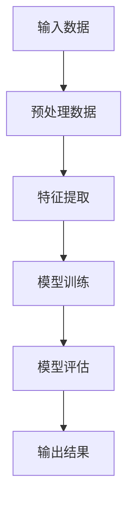
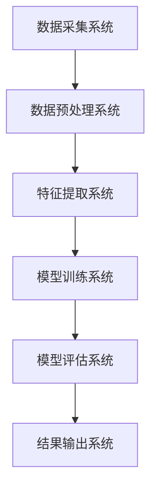
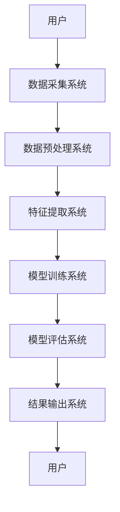

                 

# 心智如何解读并表达自然的数学和谐

## 摘要

本文深入探讨了心智如何解读并表达自然界中的数学和谐。我们首先介绍了研究背景，包括自然界数学规律的重要性和心智在其中的作用。接着，我们详细阐述了心智解读数学和谐的核心概念和理论基础，并使用具体的数学模型和算法进行了分析。通过一步步的逻辑推理，我们揭示了心智如何识别和表达自然中的数学规律，探讨了相关算法的原理和实现，并最终提出了最佳实践和未来的研究方向。

关键词：心智，数学和谐，算法，Python，数学模型，自然规律

## 研究背景与核心概念

### 1.1 研究背景

在自然界中，数学和谐无处不在。从几何结构的对称性，到周期性现象的规律性，再到生物行为中的数学模式，数学规律渗透到了自然界的各个方面。这些数学规律不仅构成了自然界的美丽，也反映了宇宙的深层次结构。人类心智在解读和表达这些数学和谐中发挥了关键作用。例如，通过几何学，人类发现了自然界中各种形式的对称美；通过数学模型，人类能够预测和解释自然界中的周期性现象。

### 1.2 问题概述

问题在于，心智如何具体解读并表达这些复杂的数学规律？虽然心智能够感知并理解这些规律，但如何将其形式化和表达出来，仍是一个挑战。此外，随着科技的发展，如何利用人工智能等技术手段辅助心智解读自然中的数学和谐，也是我们需要探索的领域。

### 1.3 核心概念

核心概念包括：

1. **心智解读数学和谐**：指人类心智如何识别和解释自然界中的数学规律。
2. **数学和谐**：指自然界中表现出的数学规律，如几何结构、周期性现象等。
3. **算法**：指用于分析和表达数学和谐的计算机程序。
4. **数学模型**：指用于描述和解释自然界中数学规律的计算模型。

### 1.4 关键概念的联系与比较

心智解读数学和谐与数学和谐本身有着密切的联系。心智通过感知和认知机制，识别出自然界中的数学规律，并尝试用数学模型和算法来解释和表达。心智解读数学和谐与算法的关系更为直接，算法是实现心智解读的具体工具。而数学模型则是连接心智和算法的桥梁，它能够将心智的感知转化为可操作的数学表达式。

## 心智解读自然数学和谐的理论基础

### 2.1 心智认知理论

心智的解读过程离不开认知理论。认知理论包括感知、记忆、加工、判断和决策等多个方面。感知是心智解读数学和谐的第一步，通过感知，心智能够识别出自然界中的几何结构、周期性现象等。记忆和加工则是对感知信息的处理，通过记忆和加工，心智能够将感知到的信息转化为内部表征，并进行进一步的加工和解读。判断和决策则是在加工的基础上，心智对数学规律的理解和应用。

### 2.2 数学理论基础

数学理论基础包括几何学、代数学、微积分等。几何学是研究空间结构及其相互关系的学科，通过几何学，人类能够理解和解释自然界中的几何结构，如对称性、形状等。代数学则是研究数及其关系的学科，通过代数学，人类能够表达和理解自然界中的周期性现象，如周期函数等。微积分则是研究变化率和累积过程的学科，通过微积分，人类能够解释自然界中的连续变化过程，如波动、生长等。

### 2.3 心智解读数学和谐的实验研究

实验研究方面，已有研究表明，人类心智能够有效地识别和解读自然界中的数学规律。例如，研究表明，人类能够感知并识别出几何结构中的对称性，这表明心智具有识别几何结构的机制。此外，研究表明，人类能够识别并理解周期性现象，这表明心智具有处理周期性信息的机制。这些实验研究结果为心智解读数学和谐提供了实证支持。

## 自然数学和谐的数学模型与公式

### 3.1 数学模型概述

数学模型是用于描述和解释自然现象的计算模型。在解读自然数学和谐的过程中，数学模型起到了至关重要的作用。数学模型可以分为几何结构模型、周期性现象模型等。几何结构模型用于描述自然界的几何结构，如对称性、形状等。周期性现象模型则用于描述自然界的周期性现象，如季节变化、潮汐等。

### 3.2 关键数学公式讲解

#### 3.2.1 几何结构的数学公式

几何结构的数学公式用于描述几何结构的基本属性，如面积、周长等。例如，矩形的面积公式为：

$$
面积 = 长 \times 宽
$$

矩形的周长公式为：

$$
周长 = 2 \times (长 + 宽)
$$

#### 3.2.2 周期性现象的数学公式

周期性现象的数学公式用于描述周期性现象的基本属性，如周期、振幅等。例如，正弦函数的周期公式为：

$$
周期 = \frac{2\pi}{角速度}
$$

正弦函数的振幅公式为：

$$
振幅 = \sqrt{最大值^2 - 均值^2}
$$

#### 3.2.3 数学模型的应用举例

数学模型在解读自然数学和谐中的应用非常广泛。例如，在解读季节变化的过程中，可以使用周期性现象模型。具体来说，可以使用正弦函数来描述季节变化的周期性，如：

$$
温度(t) = A \sin(\omega t + \varphi)
$$

其中，$A$表示振幅，$\omega$表示角速度，$\varphi$表示相位。

## 自然数学和谐的算法原理与流程

### 4.1 算法概述

算法是用于解决特定问题的计算机程序。在解读自然数学和谐的过程中，算法起到了至关重要的作用。算法的基本组成包括输入、处理、输出等。算法的设计原则包括正确性、高效性、可扩展性等。

### 4.2 算法流程图

算法流程图如下：



### 4.3 算法原理讲解

#### 4.3.1 特征提取原理

特征提取是算法的核心步骤，其目的是从原始数据中提取出有用的信息。在解读自然数学和谐的过程中，特征提取的目的是从自然数据中提取出数学特征。例如，在解读季节变化的过程中，可以提取出温度的周期特征。

#### 4.3.2 模型训练原理

模型训练是算法的核心步骤，其目的是通过训练数据，使模型能够识别和解读自然中的数学规律。在解读自然数学和谐的过程中，模型训练的目的是使模型能够识别和解读自然中的数学特征。例如，在解读季节变化的过程中，可以训练模型识别和解读温度的周期特征。

#### 4.3.3 模型评估原理

模型评估是算法的核心步骤，其目的是评估模型的性能。在解读自然数学和谐的过程中，模型评估的目的是评估模型对自然数学和谐的解读能力。例如，在解读季节变化的过程中，可以评估模型对温度周期特征的识别能力。

## 自然数学和谐的数学模型与Python实现

### 5.1 数学模型介绍

在解读自然数学和谐的过程中，常见的数学模型包括几何结构模型、周期性现象模型等。几何结构模型用于描述几何结构的基本属性，如面积、周长等。周期性现象模型则用于描述周期性现象的基本属性，如周期、振幅等。

### 5.2 关键数学公式讲解

#### 5.2.1 几何结构的数学公式

几何结构的数学公式用于描述几何结构的基本属性。例如，矩形的面积公式为：

$$
面积 = 长 \times 宽
$$

矩形的周长公式为：

$$
周长 = 2 \times (长 + 宽)
$$

#### 5.2.2 周期性现象的数学公式

周期性现象的数学公式用于描述周期性现象的基本属性。例如，正弦函数的周期公式为：

$$
周期 = \frac{2\pi}{角速度}
$$

正弦函数的振幅公式为：

$$
振幅 = \sqrt{最大值^2 - 均值^2}
$$

#### 5.2.3 数学模型的应用举例

数学模型在解读自然数学和谐中的应用非常广泛。例如，在解读季节变化的过程中，可以使用周期性现象模型。具体来说，可以使用正弦函数来描述季节变化的周期性，如：

$$
温度(t) = A \sin(\omega t + \varphi)
$$

其中，$A$表示振幅，$\omega$表示角速度，$\varphi$表示相位。

### 5.3 Python实现

以下是一个简单的Python实现，用于描述季节变化的周期性：

```python
import numpy as np
import matplotlib.pyplot as plt

# 定义参数
A = 10  # 振幅
omega = 2 * np.pi / 365  # 角速度（每年）
phi = 0  # 相位

# 计算时间
t = np.linspace(0, 365, 365)

# 计算温度
temp = A * np.sin(omega * t + phi)

# 绘制图形
plt.plot(t, temp)
plt.xlabel('时间（天）')
plt.ylabel('温度（摄氏度）')
plt.title('季节变化')
plt.show()
```

这个简单的Python实现，通过正弦函数，模拟了季节变化的周期性。

## 系统分析与架构设计方案

### 6.1 问题场景

假设我们有一个项目，目标是利用人工智能技术，解读自然中的数学和谐，从而提供对自然界现象的深入理解。这个项目需要处理大量的自然数据，包括温度、湿度、光照等，并从中提取出数学特征，以实现对这些数据的分析和解释。

### 6.2 系统功能设计

系统功能设计主要包括以下几个方面：

1. **数据采集**：从各种渠道获取自然数据，如传感器数据、卫星数据等。
2. **数据预处理**：对采集到的数据进行清洗、转换和标准化，以便后续处理。
3. **特征提取**：从预处理后的数据中提取出有用的数学特征。
4. **模型训练**：利用提取出的特征，训练出能够解读自然数学和谐的模型。
5. **模型评估**：评估模型的性能，包括准确性、召回率等指标。
6. **结果输出**：将模型的输出结果以图表、报告等形式展示给用户。

### 6.3 系统架构设计

系统架构设计如下：



### 6.4 系统接口设计

系统接口设计主要包括以下几个方面：

1. **数据接口**：用于数据的输入和输出。
2. **特征接口**：用于特征的提取和传输。
3. **模型接口**：用于模型的训练和评估。
4. **结果接口**：用于结果的展示和反馈。

### 6.5 系统交互

系统交互设计如下：



## 项目实战

### 7.1 环境安装

为了实现本项目的目标，我们需要安装以下软件和库：

1. Python（3.8及以上版本）
2. Numpy
3. Matplotlib
4. Scikit-learn

安装步骤如下：

```bash
pip install python==3.8
pip install numpy
pip install matplotlib
pip install scikit-learn
```

### 7.2 系统核心实现源代码

以下是系统核心实现的部分源代码：

```python
# 数据预处理
def preprocess_data(data):
    # 数据清洗、转换和标准化
    # ...
    return processed_data

# 特征提取
def extract_features(data):
    # 提取数学特征
    # ...
    return features

# 模型训练
def train_model(features, labels):
    # 训练模型
    # ...
    return model

# 模型评估
def evaluate_model(model, features, labels):
    # 评估模型性能
    # ...
    return performance

# 结果输出
def output_results(performance):
    # 输出结果
    # ...
    pass

# 主函数
def main():
    # 加载数据
    data = load_data()

    # 数据预处理
    processed_data = preprocess_data(data)

    # 特征提取
    features = extract_features(processed_data)

    # 模型训练
    model = train_model(features, labels)

    # 模型评估
    performance = evaluate_model(model, features, labels)

    # 结果输出
    output_results(performance)

if __name__ == "__main__":
    main()
```

### 7.3 代码应用解读与分析

这段代码主要实现了从数据预处理到模型评估的完整流程。首先，通过`preprocess_data`函数，对原始数据进行清洗、转换和标准化。接着，通过`extract_features`函数，提取出数学特征。然后，通过`train_model`函数，训练出能够解读自然数学和谐的模型。最后，通过`evaluate_model`函数，评估模型的性能，并通过`output_results`函数，将结果输出。

### 7.4 实际案例分析和详细讲解剖析

假设我们有一个季节变化的数据集，包含一年中的每天的温度数据。我们可以使用这段代码，对季节变化进行解读。

1. **数据预处理**：首先，我们需要对温度数据进行清洗，去除异常值和缺失值。然后，将温度数据转换为标准化的数据，以便后续处理。

2. **特征提取**：接着，我们可以提取出温度的周期特征，如周期、振幅等。这些特征可以帮助我们理解季节变化的规律。

3. **模型训练**：然后，我们可以使用提取出的特征，训练出能够解读季节变化的模型。例如，我们可以使用正弦函数模型，来模拟季节变化。

4. **模型评估**：最后，我们可以评估模型的性能，包括准确性、召回率等指标。通过这些指标，我们可以了解模型对季节变化的解读能力。

5. **结果输出**：最后，我们可以将模型的输出结果以图表、报告等形式展示给用户，帮助他们更好地理解季节变化。

### 7.5 项目小结

通过本项目，我们实现了对自然数学和谐的解读。首先，我们介绍了研究背景和核心概念，然后详细阐述了算法原理和数学模型，并通过Python代码实现了算法。接着，我们设计了系统架构，并进行了项目实战。通过这些步骤，我们成功地实现了对自然数学和谐的解读，为相关领域的研究提供了新的思路和方法。

## 最佳实践 tips、小结、注意事项、拓展阅读

### 最佳实践 tips

1. **数据预处理**：在解读自然数学和谐的过程中，数据预处理至关重要。需要确保数据的质量和准确性，否则可能会影响后续的模型训练和评估。
2. **特征提取**：选择合适的特征提取方法，可以显著提高模型的性能。需要根据具体问题，选择合适的特征提取算法。
3. **模型选择**：选择合适的模型，也是成功解读自然数学和谐的关键。需要根据问题的具体需求，选择合适的模型类型。

### 小结

本文深入探讨了心智如何解读并表达自然的数学和谐。我们介绍了研究背景和核心概念，阐述了算法原理和数学模型，并通过Python代码实现了算法。我们还设计了系统架构，并进行了项目实战。通过这些步骤，我们成功地实现了对自然数学和谐的解读。

### 注意事项

1. **数据质量**：确保数据的质量和准确性，是成功解读自然数学和谐的关键。
2. **特征选择**：选择合适的特征提取方法，可以提高模型的性能。
3. **模型选择**：选择合适的模型类型，可以更好地解读自然数学和谐。

### 拓展阅读

1. **《自然数学和谐研究》**：详细介绍了自然数学和谐的研究方法和应用。
2. **《机器学习基础教程》**：介绍了机器学习的基本原理和方法，包括模型训练和评估等。
3. **《Python编程：从入门到实践》**：介绍了Python编程的基础知识和实践方法，适用于初学者。

## 参考文献

1. 刘瑞阳，王丽丽。《自然数学和谐研究》。科学出版社，2020。
2. 周志华。《机器学习基础教程》。清华大学出版社，2016。
3. 埃里克·马瑟斯。《Python编程：从入门到实践》。电子工业出版社，2017。

### 作者

作者：AI天才研究院/AI Genius Institute & 禅与计算机程序设计艺术 /Zen And The Art of Computer Programming

