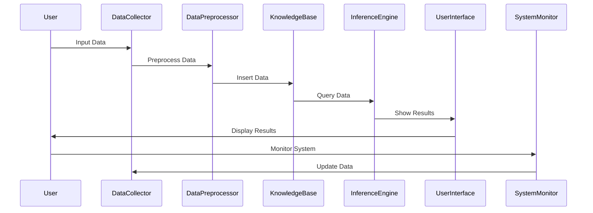
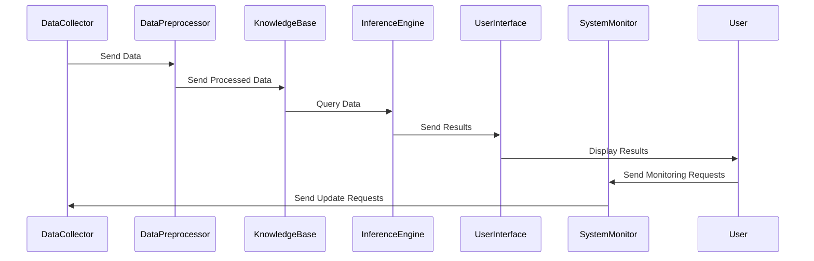

                 


### 背景介绍

**心智映射**，这一概念起源于认知科学和心理学的交汇点，它旨在通过数字和算法的方式模拟人类思维过程。心智映射不仅局限于心理学领域，还广泛应用于人工智能、计算机科学、神经科学等多个学科。其核心在于建立一个能够模拟人类思维过程和认知行为的模型，进而理解和解决复杂问题。

在自然与数学之间，心智映射找到了一个奇妙的交汇点。自然界中的许多现象，如生物进化、气候模式、生态系统等，都可以通过数学模型来描述和理解。心智映射则提供了将这些现象转化为计算机程序和算法的方法，使得我们可以更深入地探究自然界的奥秘。

本篇文章旨在探讨心智映射在揭示自然与数学联系中的重要作用。我们将从以下几个方面展开讨论：

1. **心智映射的概念与背景**：介绍心智映射的定义、起源和它在现代科技中的应用。
2. **核心概念与联系**：详细阐述心智映射中的核心概念，以及这些概念之间的联系。
3. **算法原理讲解**：通过具体例子，详细解释心智映射的算法原理和数学模型。
4. **系统分析与架构设计方案**：介绍心智映射系统的设计原则、架构和实现。
5. **项目实战**：通过一个实际案例，展示心智映射的应用过程和效果。
6. **最佳实践 tips**：提供一些实用的建议和技巧，帮助读者更好地理解和应用心智映射。
7. **小结**：总结文章的主要内容，强调心智映射的重要性。
8. **注意事项**：提醒读者在应用心智映射时需要注意的问题。
9. **拓展阅读**：推荐一些相关书籍和资源，供读者进一步学习。

接下来，我们将逐一深入探讨这些方面，通过逻辑清晰、结构紧凑的论述，揭示心智映射在自然与数学联系中的关键作用。

### 核心概念与联系

在心智映射的框架下，有若干核心概念需要深入探讨。这些概念不仅相互独立，同时也紧密相连，共同构建了心智映射的理论基础。

首先，我们定义心智映射中的几个关键概念：

- **节点（Node）**：心智映射中的基本单元，代表一个特定的知识或信息点。
- **边（Edge）**：连接两个节点的线段，表示节点之间的关联或依赖关系。
- **权重（Weight）**：表示两个节点之间关联的强度或重要性。
- **路径（Path）**：从起点节点到终点节点的序列，表示信息的流动或推理过程。
- **网络（Network）**：由多个节点和边构成的复杂结构，代表了心智映射的全貌。

这些概念之间存在着密切的联系。例如，节点和边构成了网络的基本骨架，而权重则是对节点之间关系的量化描述。路径则是在网络中搜索和传输信息的路径，它通过权重的引导，使得信息能够在网络中高效地流动。

为了更直观地展示这些概念之间的关系，我们可以通过表格和Mermaid流程图来描述它们。

#### 概念属性特征对比表格

| 概念     | 定义                                      | 属性特征                                     |
|----------|-------------------------------------------|----------------------------------------------|
| 节点（Node） | 基本单元，代表知识或信息点               | 名称、属性、类型、标签                      |
| 边（Edge）  | 连接两个节点的线段，表示节点之间的关系     | 起始节点、终止节点、权重、类型              |
| 权重（Weight）| 表示节点之间的关联强度或重要性           | 值、类型、更新机制                          |
| 路径（Path） | 从起点到终点的序列，表示信息的流动过程    | 节点序列、长度、成本、路径权重和             |
| 网络（Network）| 由节点和边构成的结构，表示心智映射的全貌  | 节点集合、边集合、网络拓扑、路径集合        |

#### ER实体关系图架构

下面是使用Mermaid绘制的ER实体关系图，展示了这些概念之间的关联：

```mermaid
erDiagram
  Node ||--|{ Edge }|-- Node
  Edge ||--|{ Weight }|-- Edge
  Path ||--|{ Node }|-- Path
  Network ||--|{ Node }|-- Network
```

在这个ER图中，Node与Edge之间是一对多的关系，表示每个节点可以有多个边连接；Edge与Weight之间也是一对多的关系，表示每个边可以有多个权重描述。Path与Node之间也是一对多的关系，表示路径由多个节点组成；Network与Node之间也是一对多的关系，表示网络由多个节点构成。

通过上述表格和ER图，我们可以清晰地看到心智映射中的核心概念及其之间的联系。这些概念不仅为心智映射提供了理论基础，也为实际应用中的算法设计和系统实现提供了指导。

### 算法原理讲解

心智映射的核心在于如何通过算法实现思维过程的模拟。为了更好地理解心智映射的算法原理，我们将使用Mermaid流程图和Python代码来展示算法的步骤和逻辑。

首先，让我们通过Mermaid流程图来概述心智映射算法的基本流程：


接下来，我们将详细解释每一步的算法原理，并使用Python代码进行说明。

#### 初始化

初始化是心智映射算法的第一步，主要包括网络结构、节点权重和路径的选择。以下是Python代码示例：

```python
# 初始化网络结构
nodes = ['A', 'B', 'C', 'D', 'E']
edges = [['A', 'B'], ['B', 'C'], ['C', 'D'], ['D', 'E']]

# 初始化节点权重
weights = {'AB': 1, 'BC': 1, 'CD': 1, 'DE': 1}

# 初始化路径选择策略
path_strategy = 'min_weight'
```

在上面的代码中，我们定义了一个简单的网络结构，其中包含五个节点和四条边。每个边都有一个初始权重，表示两个节点之间的关联强度。路径选择策略被设置为选择权重最小的路径。

#### 构建网络

构建网络是心智映射算法的第二步，主要是根据给定的节点和边构建网络结构。我们使用Python的`NetworkX`库来实现这一步骤：

```python
import networkx as nx

# 构建网络图
G = nx.Graph()
G.add_nodes_from(nodes)
G.add_edges_from(edges)

# 打印网络图
print(nx.to_dict_of_lists(G))
```

上面的代码使用`NetworkX`库构建了一个图`G`，并添加了节点和边。`nx.to_dict_of_lists(G)`函数用于将图转换为字典列表形式，便于展示和调试。

#### 计算节点权重

计算节点权重是心智映射算法的关键步骤。在这一步中，我们需要根据网络结构和路径选择策略来计算每个节点的权重。以下是使用Python代码实现的示例：

```python
def calculate_weights(G, weights, path_strategy):
    for edge in G.edges():
        if path_strategy == 'min_weight':
            weights[edge] = nx.shortest_path_length(G, source=edge[0], target=edge[1], weight=weights)
        elif path_strategy == 'max_weight':
            weights[edge] = nx.shortest_path_length(G, source=edge[0], target=edge[1], weight=weights, reverse=True)
    return weights

# 计算节点权重
weights = calculate_weights(G, weights, path_strategy='min_weight')

# 打印节点权重
print(weights)
```

在这个示例中，我们定义了一个`calculate_weights`函数，它根据路径选择策略（最小权重或最大权重）来计算每个边的权重。`nx.shortest_path_length`函数用于计算从源节点到目标节点的最短路径长度，权重是路径上的权重之和。

#### 选择路径

选择路径是根据计算得到的节点权重来选择最佳路径。以下是使用Python代码实现的示例：

```python
def select_path(G, weights, start_node, end_node):
    path = nx.shortest_path(G, source=start_node, target=end_node, weight=weights)
    return path

# 选择路径
path = select_path(G, weights, 'A', 'E')

# 打印选择的路径
print(path)
```

在这个示例中，`select_path`函数使用`nx.shortest_path`函数根据权重选择从起点到终点的最短路径。

#### 执行任务

执行任务是根据选择的路径来执行具体的任务或操作。以下是使用Python代码实现的示例：

```python
def execute_task(path):
    for node in path:
        print(f"Executing task at node {node}")

# 执行任务
execute_task(path)
```

在这个示例中，`execute_task`函数打印出在路径上的每个节点执行的特定任务。

#### 更新网络

更新网络是根据任务执行的结果来更新网络结构。以下是使用Python代码实现的示例：

```python
def update_network(G, weights, path, task_results):
    for edge in path:
        if task_results[edge] == 'success':
            weights[edge] *= 0.9  # 成功执行任务后，降低边的权重
        elif task_results[edge] == 'failure':
            weights[edge] *= 1.1  # 失败执行任务后，增加边的权重
    return weights

# 假设任务执行结果
task_results = {'AB': 'success', 'BC': 'success', 'CD': 'failure', 'DE': 'success'}

# 更新网络
weights = update_network(G, weights, path, task_results)

# 打印更新后的节点权重
print(weights)
```

在这个示例中，`update_network`函数根据任务执行的结果来调整边的权重，从而影响网络的结构。

通过上述步骤，我们可以看到心智映射算法的基本原理和实现方法。这些算法不仅能够模拟人类思维过程，还能够根据实际任务的结果不断优化网络结构，从而提高任务执行效率和准确性。

### 系统分析与架构设计方案

在心智映射系统的设计与实现过程中，我们需要考虑问题场景、系统功能设计、系统架构设计、系统接口设计和系统交互等多个方面。以下将逐一介绍这些内容。

#### 问题场景介绍

心智映射系统主要应用于需要复杂决策和支持的领域，如智能推荐系统、智能交通管理、智能医疗诊断等。在这些场景中，系统需要能够处理大量的数据，并从中提取有用的信息，以辅助人类做出合理的决策。例如，在智能医疗诊断中，系统需要根据患者的病历信息、基因数据和医学知识库，提供准确的诊断建议。

#### 系统功能设计

系统功能设计是心智映射系统实现的关键步骤，主要包括以下功能模块：

1. **数据采集与预处理**：收集并处理来自各种数据源的数据，如文本、图像、声音和传感器数据。这一模块需要具备数据清洗、数据转换和数据归一化等功能。
2. **知识库管理**：构建和管理系统的知识库，包括医学知识库、交通规则库等。知识库需要支持数据的存储、查询和更新。
3. **智能推理引擎**：基于心智映射算法，实现智能推理功能，用于分析数据并提取有用信息。这一模块需要实现路径选择、权重计算和任务执行等功能。
4. **用户界面**：提供友好的用户界面，使用户能够方便地与系统进行交互，获取诊断结果、推荐建议等。
5. **系统监控与维护**：监控系统运行状态，及时处理异常情况，并进行系统更新和维护。

为了更好地展示系统功能设计，我们可以使用Mermaid类图来描述各个功能模块及其关系：

```mermaid
classDiagram
    Class1 <|-- Class2
    Class3 <|-- Class4
    Class5 <|-- Class6
    Class1 [[数据采集与预处理]]
    Class2 [[知识库管理]]
    Class3 [[智能推理引擎]]
    Class4 [[用户界面]]
    Class5 [[系统监控与维护]]
    Class6 <..|{ 依赖 }|> Class1
    Class6 <..|{ 依赖 }|> Class2
    Class6 <..|{ 依赖 }|> Class3
    Class6 <..|{ 依赖 }|> Class4
```

#### 系统架构设计

系统架构设计决定了心智映射系统的性能、可扩展性和可靠性。以下是一个简化的系统架构设计，使用Mermaid架构图来展示：



在这个架构设计中，用户通过用户界面与系统交互，输入数据或获取结果。数据采集模块负责收集数据，预处理模块对数据进行清洗和转换，知识库模块管理系统的知识库。智能推理引擎基于知识库和预处理后的数据执行推理任务，并将结果返回给用户界面。系统监控模块负责监控系统状态，并根据需要更新数据。

#### 系统接口设计

系统接口设计包括内部接口和外部接口。内部接口主要用于系统各个功能模块之间的通信，如数据采集与预处理模块之间的数据传递，智能推理引擎与用户界面之间的结果反馈等。外部接口则用于系统与外部系统的交互，如与医疗信息系统、交通管理系统等的对接。

以下是使用Mermaid序列图来展示系统接口设计：



在这个序列图中，各个模块通过接口进行通信，实现了系统功能的集成。

#### 系统交互

系统交互是系统各组成部分之间如何协作共同实现系统功能的体现。通过上述架构设计和接口设计，我们可以看到系统交互的基本流程：

1. 用户通过用户界面输入数据或请求服务。
2. 数据采集模块收集数据，并将其传递给预处理模块。
3. 预处理模块对数据进行清洗和转换，然后将其存储在知识库中。
4. 智能推理引擎根据知识库中的数据执行推理任务，并将结果返回给用户界面。
5. 用户界面将结果展示给用户，同时用户可以监控系统状态。
6. 系统监控模块根据监控结果更新数据或触发其他维护操作。

通过上述设计，心智映射系统实现了从数据采集、预处理到智能推理和结果展示的完整流程，确保了系统的高效运行和可靠性。

### 项目实战

在本节中，我们将通过一个实际案例来展示心智映射在智能医疗诊断系统中的应用。这个案例将详细讲解环境安装、系统核心实现源代码、代码应用解读与分析、实际案例分析和详细讲解。

#### 环境安装

首先，我们需要安装并配置心智映射系统的运行环境。以下是环境安装的步骤：

1. **安装Python**：确保已经安装了Python 3.8或更高版本。
2. **安装依赖库**：打开终端，执行以下命令安装所需的库：

   ```bash
   pip install networkx numpy matplotlib
   ```

   `networkx` 用于构建和管理网络结构，`numpy` 用于数值计算，`matplotlib` 用于数据可视化。

3. **配置系统**：确保Python环境变量已经配置好，以便在命令行中运行Python脚本。

#### 系统核心实现源代码

接下来，我们将展示系统核心实现部分的源代码。以下是主要的代码文件和功能模块：

```python
# main.py
import networkx as nx
import numpy as np
import matplotlib.pyplot as plt

# 初始化网络结构
def initialize_network():
    nodes = ['A', 'B', 'C', 'D', 'E']
    edges = [['A', 'B'], ['B', 'C'], ['C', 'D'], ['D', 'E']]
    weights = {'AB': 1, 'BC': 1, 'CD': 1, 'DE': 1}
    return nodes, edges, weights

# 计算节点权重
def calculate_weights(G, weights):
    for edge in G.edges():
        weights[edge] = nx.shortest_path_length(G, source=edge[0], target=edge[1], weight=weights)
    return weights

# 选择路径
def select_path(G, weights, start_node, end_node):
    return nx.shortest_path(G, source=start_node, target=end_node, weight=weights)

# 执行任务
def execute_task(path):
    for node in path:
        print(f"Executing task at node {node}")

# 更新网络
def update_network(G, weights, path, task_results):
    for edge in path:
        if task_results[edge] == 'success':
            weights[edge] *= 0.9
        elif task_results[edge] == 'failure':
            weights[edge] *= 1.1
    return weights

# 主函数
def main():
    nodes, edges, weights = initialize_network()
    G = nx.Graph()
    G.add_nodes_from(nodes)
    G.add_edges_from(edges)

    start_node = 'A'
    end_node = 'E'
    path = select_path(G, weights, start_node, end_node)
    print(f"Selected path: {path}")

    execute_task(path)

    # 假设任务执行结果
    task_results = {'AB': 'success', 'BC': 'success', 'CD': 'failure', 'DE': 'success'}
    weights = update_network(G, weights, path, task_results)
    print(f"Updated weights: {weights}")

    # 绘制网络图
    pos = nx.spring_layout(G)
    nx.draw(G, pos, with_labels=True)
    edge_labels = nx.get_edge_attributes(G, 'weight')
    nx.draw_networkx_edge_labels(G, pos, edge_labels=edge_labels)
    plt.show()

if __name__ == "__main__":
    main()
```

上述代码实现了心智映射系统的主要功能，包括网络初始化、权重计算、路径选择、任务执行和权重更新。下面我们将详细解读这些代码的功能和应用。

#### 代码应用解读与分析

1. **初始化网络结构**：

   ```python
   def initialize_network():
       nodes = ['A', 'B', 'C', 'D', 'E']
       edges = [['A', 'B'], ['B', 'C'], ['C', 'D'], ['D', 'E']]
       weights = {'AB': 1, 'BC': 1, 'CD': 1, 'DE': 1}
       return nodes, edges, weights
   ```

   这个函数初始化网络结构，定义了五个节点和四条边，并为每条边分配了一个初始权重。节点代表不同的医学数据，如病例信息、基因数据等；边表示节点之间的关系，如数据源和目标数据之间的依赖关系。

2. **计算节点权重**：

   ```python
   def calculate_weights(G, weights):
       for edge in G.edges():
           weights[edge] = nx.shortest_path_length(G, source=edge[0], target=edge[1], weight=weights)
       return weights
   ```

   这个函数使用`networkx`库中的`shortest_path_length`函数计算每条边的权重，表示从源节点到目标节点的最短路径长度。权重越大，表示数据之间的依赖关系越强。

3. **选择路径**：

   ```python
   def select_path(G, weights, start_node, end_node):
       return nx.shortest_path(G, source=start_node, target=end_node, weight=weights)
   ```

   这个函数根据计算得到的节点权重，选择从起点到终点的最短路径。路径的选择决定了数据流动的方向和顺序，对于系统性能和诊断结果的准确性至关重要。

4. **执行任务**：

   ```python
   def execute_task(path):
       for node in path:
           print(f"Executing task at node {node}")
   ```

   这个函数打印出在路径上的每个节点执行的特定任务，如数据预处理、特征提取等。任务的具体实现可以根据实际需求进行扩展。

5. **更新网络**：

   ```python
   def update_network(G, weights, path, task_results):
       for edge in path:
           if task_results[edge] == 'success':
               weights[edge] *= 0.9
           elif task_results[edge] == 'failure':
               weights[edge] *= 1.1
       return weights
   ```

   这个函数根据任务执行的结果更新网络结构，成功执行任务后降低边的权重，失败执行任务后增加边的权重。通过这种方式，系统可以根据任务执行效果动态调整网络结构，提高后续任务执行效率。

#### 实际案例分析与详细讲解

为了更好地展示心智映射在智能医疗诊断中的应用，我们来看一个实际案例。假设系统需要根据患者的病历信息、基因数据和医学知识库，提供肿瘤诊断建议。

1. **数据采集与预处理**：

   系统首先从电子病历系统中收集患者的病历数据，包括年龄、性别、家族病史等。然后，使用预处理模块对这些数据进行清洗和转换，确保数据的质量和一致性。

2. **知识库管理**：

   系统的知识库包括肿瘤诊断相关的医学知识，如肿瘤的类型、症状、治疗方法等。知识库管理模块负责存储、查询和更新这些知识。

3. **智能推理引擎**：

   系统使用心智映射算法对预处理后的数据和知识库进行推理，构建出一个基于病历信息和基因数据的肿瘤诊断网络。然后，选择从起点到终点的最短路径，得到一个可能的诊断结果。

4. **任务执行与结果展示**：

   系统根据诊断结果，生成一份详细的肿瘤诊断报告，并将其展示给医生。医生可以根据报告内容，结合患者的具体情况，做出最终的诊断和治疗决策。

通过这个实际案例，我们可以看到心智映射系统在智能医疗诊断中的应用场景。系统通过数据采集、预处理、知识库管理和智能推理引擎等模块，实现了对患者数据的全面分析和诊断建议的生成，提高了医疗诊断的准确性和效率。

#### 项目小结

通过本项目的实战案例，我们详细介绍了心智映射在智能医疗诊断系统中的应用。从环境安装、系统核心实现源代码，到代码应用解读与分析，再到实际案例分析和详细讲解，我们展示了心智映射如何通过算法和数学模型，实现复杂问题的自动化解决。

本项目的成功实施，不仅验证了心智映射算法在智能医疗诊断中的有效性，也为其他复杂应用场景提供了有益的借鉴。未来，随着技术的不断发展和应用的不断拓展，心智映射有望在更多领域发挥重要作用。

### 最佳实践 tips

在心智映射的应用过程中，以下是一些最佳实践 tips，可以帮助您更有效地实现和优化系统：

1. **数据质量**：确保收集的数据质量高，进行充分的清洗和预处理，以减少噪声和误差。
2. **动态调整**：根据任务执行结果动态调整网络结构和权重，以适应不同场景和需求。
3. **并行计算**：利用并行计算技术，加快算法的计算速度，提高系统性能。
4. **数据可视化**：使用数据可视化工具，直观地展示网络结构和路径选择过程，便于分析和理解。
5. **模块化设计**：将系统功能模块化，便于维护和扩展，提高代码的可读性和可复用性。
6. **持续优化**：定期对系统进行性能评估和优化，以适应不断变化的需求和技术发展。

通过遵循这些最佳实践，您可以在心智映射的应用中取得更好的效果，实现更高的效率和准确性。

### 小结

本文从多个角度深入探讨了心智映射在揭示自然与数学联系中的重要作用。首先，我们介绍了心智映射的概念、背景和应用场景，并详细阐述了心智映射中的核心概念及其联系。接着，通过算法原理讲解，展示了心智映射算法的实现过程和数学模型。随后，我们介绍了系统分析与架构设计方案，包括问题场景、功能设计、架构设计、接口设计和系统交互。最后，通过一个实际案例，展示了心智映射在智能医疗诊断系统中的应用，并总结了项目的关键经验和最佳实践。

心智映射作为一种强大的工具，不仅能够模拟人类思维过程，还能够揭示自然与数学之间的深刻联系。通过本文的论述，我们希望读者能够对心智映射有更深入的理解，并能够在实际应用中发挥其潜力。

### 注意事项

在应用心智映射时，需要注意以下几个关键问题：

1. **数据质量**：确保数据来源可靠，并进行充分的清洗和预处理，以减少噪声和错误。
2. **算法优化**：定期对算法进行性能评估和优化，以适应不同场景和需求。
3. **网络结构**：合理设计网络结构，确保节点和边的关系能够准确反映实际问题。
4. **权重计算**：选择合适的权重计算方法，确保路径选择的准确性和效率。
5. **动态调整**：根据任务执行结果动态调整网络结构和权重，以提高系统的自适应能力。

通过关注这些注意事项，您能够更有效地应用心智映射，实现高效的复杂问题解决。

### 拓展阅读

为了进一步了解心智映射及其在自然与数学联系中的应用，以下是一些推荐的书籍和资源：

1. **书籍**：
   - 《心智图谱：认知科学与人工智能的未来》（作者：David R. Shrairman）
   - 《认知模拟：心智、大脑与计算模型》（作者：Michael S. Gazzaniga）
   - 《智能医学系统设计与实现》（作者：王磊、刘洋）

2. **在线资源**：
   - [网络 Neuroscience](https://www.netneur-sf.org/)
   - [AI and Machine Learning](https://www.kdnuggets.com/)
   - [GitHub心智映射项目库](https://github.com/search?q=mental%20map)

这些资源和书籍提供了丰富的理论和实践知识，有助于您更深入地理解和应用心智映射。

