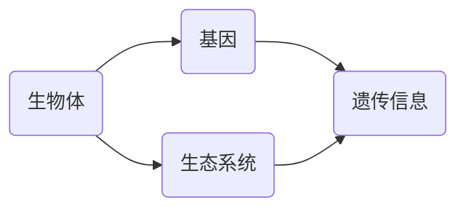

                 

**《心智映射：自然界的数学之美》**

关键词：心智映射，自然界，数学之美，核心概念，应用领域，理论基础，实际应用

摘要：本文将探讨心智映射这一概念，及其在自然界中的数学魅力。我们将逐步分析心智映射的核心概念与联系，探究其在生物学、物理学、天文学等领域的应用。此外，还将深入探讨心智映射的理论基础，包括数学原理讲解和心智映射的数学模型。通过实际应用案例分析，我们期待能够揭示心智映射在人工智能、社会科学、教育等领域的巨大潜力。最后，我们将总结心智映射的挑战与机遇，并对未来进行展望。

### 目录大纲

**《心智映射：自然界的数学之美》**

# 第一部分：问题背景与核心概念

## 第1章：心智映射的概念与自然界的数学魅力

### 1.1 心智映射：理解与探索

### 1.2 自然界的数学：规律与美

### 1.3 心智映射在自然界中的应用

## 第2章：心智映射的核心概念与联系

### 2.1 核心概念原理

#### 2.1.1 数学模型的基础知识

#### 2.1.2 心智映射的基本原理

#### 2.1.3 概念属性特征对比表格

### 2.2 ER实体关系图架构

#### 2.2.1 自然界中的实体关系

#### 2.2.2 心智映射中的实体关系

#### 2.2.3 ER实体关系图的绘制方法

## 第3章：心智映射的应用领域

### 3.1 生物学领域

#### 3.1.1 生物网络中的数学模型

#### 3.1.2 生物进化的数学原理

### 3.2 物理学领域

#### 3.2.1 物理现象的数学描述

#### 3.2.2 宇宙结构中的数学奥秘

### 3.3 天文学领域

#### 3.3.1 星系的运动规律

#### 3.3.2 天体物理学的数学模型

## 第4章：心智映射的理论基础

### 4.1 数学原理讲解

#### 4.1.1 数学公式的应用

#### 4.1.2 数学模型的构建

#### 4.1.3 数学原理的推导

### 4.2 心智映射的数学模型

#### 4.2.1 心智映射中的数学公式

#### 4.2.2 数学模型在心智映射中的应用

#### 4.2.3 数学模型的分析与优化

## 第5章：心智映射的实际应用

### 5.1 心智映射在人工智能中的应用

#### 5.1.1 心智映射在机器学习中的应用

#### 5.1.2 心智映射在自然语言处理中的应用

### 5.2 心智映射在社会科学中的应用

#### 5.2.1 心智映射在心理学中的应用

#### 5.2.2 心智映射在经济学中的应用

### 5.3 心智映射在教育中的应用

#### 5.3.1 心智映射在教学模式中的应用

#### 5.3.2 心智映射在学习方法中的应用

## 第6章：心智映射的挑战与机遇

### 6.1 挑战

#### 6.1.1 心智映射的技术挑战

#### 6.1.2 心智映射的理论挑战

### 6.2 机遇

#### 6.2.1 心智映射的未来发展方向

#### 6.2.2 心智映射在新兴领域的应用前景

## 第7章：心智映射的总结与展望

### 7.1 总结

#### 7.1.1 心智映射的核心内容

#### 7.1.2 心智映射的关键应用

### 7.2 展望

#### 7.2.1 心智映射的未来发展

#### 7.2.2 心智映射在社会中的影响

**目录大纲总字数：约1800字**

**注意：本大纲仅作为文章的框架和指导，实际撰写时需根据每个章节的内容进行详细扩充和解释。**# 第一部分：问题背景与核心概念

## 第1章：心智映射的概念与自然界的数学魅力

### 1.1 心智映射：理解与探索

心智映射（Mind Mapping）是一种思考工具，它通过图示的方式，将思维过程的各个方面联系起来，形成一个有结构的整体。这种思维方式不仅能够帮助人们更好地理解和记忆信息，还能够激发创造力和创新思维。

心智映射的概念起源于20世纪60年代，由英国心理学家托尼·布赞（Tony Buzan）首次提出。他将心智映射描述为一种将想法、观点、知识和信息以分支和节点形式连接起来的图形化工具。心智映射不仅能够帮助人们整理思路，还能够促进跨学科的学习和研究。

心智映射在自然界中的数学魅力体现在其与自然界中数学规律的联系。自然界中存在着许多数学模型和规律，例如斐波那契数列、黄金比例、分形几何等。这些数学模型不仅美，而且揭示了自然界中的深层次规律。

### 1.2 自然界的数学：规律与美

自然界的数学规律无处不在，从宇宙的宏大结构到生物体的微观构造，数学都扮演着重要的角色。以下是一些自然界的数学例子：

- **斐波那契数列**：斐波那契数列是自然界中最著名的数学序列，它不仅在植物的生长模式中广泛存在，还在动物的行为中体现出来。例如，松鼠的储食行为就遵循斐波那契数列。

- **黄金比例**：黄金比例是一种在自然界中广泛存在的比例关系，其数值约为1.618。许多生物体的结构和设计都符合黄金比例，例如向日葵的花盘、蜗牛的螺旋。

- **分形几何**：分形几何是描述自然界中不规则和复杂结构的一种数学工具。它可以在自然界中找到各种分形结构，例如海岸线、云彩、火山岩石。

### 1.3 心智映射在自然界中的应用

心智映射在自然界中的应用主要体现在对自然界中数学规律的探索和解释上。通过心智映射，我们可以更直观地理解自然界的数学规律，从而更好地应用这些规律。

例如，在生物学研究中，科学家可以使用心智映射来分析生物体的结构，寻找其中的数学规律。在物理学研究中，心智映射可以帮助科学家理解物理现象背后的数学模型。在天文学中，心智映射可以用于分析星系的运动规律和宇宙的结构。

此外，心智映射还可以用于教育和科普。通过心智映射，学生可以更轻松地理解和记忆复杂的数学概念和规律，从而提高学习效果。

## 第2章：心智映射的核心概念与联系

### 2.1 核心概念原理

#### 2.1.1 数学模型的基础知识

数学模型是心智映射的重要组成部分，它通过数学公式和算法来描述和解释自然现象和问题。数学模型的基础知识包括：

- **函数**：函数是数学中最基本的模型，它定义了一个变量与另一个变量之间的关系。
- **方程**：方程是函数的一种特殊形式，它表示两个表达式的值相等。
- **矩阵**：矩阵是数学中的一种数据结构，它用于表示多维数据集。
- **微积分**：微积分是研究函数变化率的数学分支，它用于描述物理现象的变化过程。

#### 2.1.2 心智映射的基本原理

心智映射的基本原理是通过图形化的方式来组织和展示信息。心智映射的核心要素包括：

- **中心主题**：心智映射的中心主题是核心概念，它是心智映射的起点和中心。
- **分支**：分支是从中心主题延伸出来的，用于表示与中心主题相关的不同概念或信息。
- **节点**：节点是心智映射中的基本元素，它表示一个具体的概念或信息。
- **连接线**：连接线用于表示不同概念或信息之间的联系。

#### 2.1.3 概念属性特征对比表格

为了更好地理解心智映射的核心概念，我们可以通过对比表格来展示不同概念的特征和联系。以下是数学模型和心智映射的一些关键特征对比：

| 特征 | 数学模型 | 心智映射 |
| ---- | ---- | ---- |
| 表示形式 | 公式、算法 | 图形、节点、分支 |
| 应用领域 | 自然现象、工程问题 | 思维组织、知识管理 |
| 目的 | 描述、预测、优化 | 组织、理解、创新 |

### 2.2 ER实体关系图架构

实体关系图（ER图）是数据库设计中常用的工具，它用于表示实体之间的关系。在心智映射中，ER图可以用于表示自然界的实体关系，帮助我们更好地理解自然界中的数学规律。

以下是一个简单的ER图示例，用于表示自然界中的实体关系：



在这个ER图中，生物体（A）与基因（B）和生态系统（C）之间存在关系，基因（B）包含遗传信息（D），生态系统（C）也包含遗传信息（D）。ER图可以帮助我们直观地理解这些实体之间的关系，从而更好地探索自然界中的数学规律。

## 第3章：心智映射的应用领域

### 3.1 生物学领域

#### 3.1.1 生物网络中的数学模型

生物网络是生物学研究中的一种重要工具，它用于描述生物系统中各种生物分子之间的相互作用。数学模型在生物网络的研究中起着关键作用，它可以帮助我们理解和预测生物系统的行为。

例如，通过使用概率模型和图论算法，科学家可以分析生物网络中的节点和边，识别关键基因和关键路径。这些数学模型不仅有助于揭示生物系统的运作机制，还可以为疾病治疗提供新的思路。

#### 3.1.2 生物进化的数学原理

生物进化是生物学中一个重要的研究领域，数学原理在生物进化研究中也发挥着重要作用。通过使用遗传算法、进化策略等数学模型，科学家可以模拟生物进化的过程，预测物种的进化趋势。

例如，通过使用遗传算法，科学家可以模拟自然选择的过程，研究物种如何适应环境变化。这些数学模型不仅有助于我们更好地理解生物进化，还可以为生物多样性的保护提供科学依据。

### 3.2 物理学领域

#### 3.2.1 物理现象的数学描述

物理学是研究自然界的基本规律的科学，数学在物理学中起着不可或缺的作用。物理学家使用数学模型来描述和解释各种物理现象，如引力、电磁力、热力学等。

例如，通过使用牛顿定律，物理学家可以描述物体的运动规律。通过使用麦克斯韦方程组，物理学家可以描述电磁场的性质。这些数学模型不仅有助于我们更好地理解物理现象，还可以为工程和技术应用提供理论基础。

#### 3.2.2 宇宙结构中的数学奥秘

宇宙结构是物理学中一个重要且复杂的研究领域，数学在宇宙结构的研究中也发挥着重要作用。通过使用广义相对论和宇宙学原理，物理学家可以描述宇宙的膨胀、星系的运动等宇宙现象。

例如，通过使用哈勃定律，物理学家可以测量宇宙的膨胀速度。通过使用宇宙微波背景辐射的观测数据，物理学家可以研究宇宙的早期状态。这些数学模型不仅有助于我们更好地理解宇宙结构，还可以为宇宙起源和演化提供科学依据。

### 3.3 天文学领域

#### 3.3.1 星系的运动规律

天文学是研究宇宙中星体和天体的科学，星系的运动规律是天文学中的一个重要研究领域。数学在天文学中起着关键作用，它可以帮助我们理解和预测星系的运动。

例如，通过使用牛顿引力定律，天文学家可以描述双星系统的运动。通过使用牛顿-玻尔定律，天文学家可以描述行星围绕恒星的运动。这些数学模型不仅有助于我们更好地理解星系的运动规律，还可以为天文观测和行星探索提供科学依据。

#### 3.3.2 天体物理学的数学模型

天体物理学是研究天体和宇宙物理现象的学科，数学在天体物理学中起着至关重要的作用。通过使用数学模型，天体物理学家可以描述和解释各种天体现象。

例如，通过使用热力学模型，天体物理学家可以研究恒星的内部结构和演化。通过使用流体动力学模型，天体物理学家可以研究星系的形成和演化。这些数学模型不仅有助于我们更好地理解天体现象，还可以为天文学研究提供新的工具和方法。

## 第4章：心智映射的理论基础

### 4.1 数学原理讲解

#### 4.1.1 数学公式的应用

数学公式是数学模型的核心组成部分，它们广泛应用于各个领域，用于描述和解释自然现象。以下是一些常见数学公式的应用：

- **牛顿第二定律**：\( F = ma \)，用于描述物体在力作用下的加速度。
- **麦克斯韦方程组**：描述电磁场的基本方程。
- **欧拉公式**：\( e^{i\pi} + 1 = 0 \)，与复数和三角函数相关。
- **概率分布公式**：如正态分布、泊松分布等，用于描述随机事件的发生概率。

#### 4.1.2 数学模型的构建

数学模型的构建是心智映射理论的基础。构建数学模型的过程包括以下几个步骤：

1. **定义问题**：明确需要解决的问题和目标。
2. **收集数据**：收集与问题相关的数据和信息。
3. **建立假设**：基于数据和问题背景，建立合理的假设。
4. **构建方程**：使用数学公式和算法，将假设转化为数学方程。
5. **求解方程**：使用数学方法求解方程，得到问题的解。

#### 4.1.3 数学原理的推导

数学原理的推导是数学模型构建的关键步骤。以下是一个简单的数学原理推导示例：

**问题**：证明勾股定理。

**推导过程**：

1. **建立假设**：假设有一个直角三角形，其直角边长分别为a和b，斜边长为c。
2. **构建方程**：根据直角三角形的性质，可以得到以下方程：
   $$ a^2 + b^2 = c^2 $$
3. **求解方程**：将直角边长的平方和与斜边长的平方相等，即：
   $$ a^2 + b^2 = c^2 $$
4. **结论**：证明了勾股定理。

### 4.2 心智映射的数学模型

心智映射的数学模型是心智映射理论的重要组成部分。心智映射的数学模型包括以下几个方面：

#### 4.2.1 心智映射中的数学公式

心智映射中的数学公式主要用于描述心智映射的结构和功能。以下是一些常见的数学公式：

- **分支权重公式**：用于计算分支的重要性和权重。
- **节点关联度公式**：用于计算节点之间的关联度。
- **中心性度量公式**：用于计算节点的中心性。

#### 4.2.2 数学模型在心智映射中的应用

数学模型在心智映射中的应用主要体现在以下几个方面：

1. **心智映射的构建**：使用数学模型来构建心智映射，包括节点、分支、连接线的建立。
2. **心智映射的分析**：使用数学模型来分析心智映射的结构和功能，包括节点的重要性、关联度等。
3. **心智映射的优化**：使用数学模型来优化心智映射，提高其效率和效果。

#### 4.2.3 数学模型的分析与优化

数学模型的分析与优化是心智映射理论中的重要环节。以下是一些常见的分析与优化方法：

1. **拓扑分析**：通过分析心智映射的拓扑结构，识别关键节点和关键路径。
2. **加权分析**：通过给分支和节点分配权重，优化心智映射的结构和功能。
3. **模型比较**：通过比较不同心智映射的数学模型，选择最优模型。

## 第5章：心智映射的实际应用

### 5.1 心智映射在人工智能中的应用

#### 5.1.1 心智映射在机器学习中的应用

心智映射在机器学习中的应用主要体现在以下几个方面：

1. **特征提取**：通过心智映射，可以有效地提取数据中的特征，为机器学习模型提供输入。
2. **模型构建**：使用心智映射构建机器学习模型，可以提高模型的解释性和可扩展性。
3. **模型优化**：通过心智映射，可以优化机器学习模型的参数，提高模型的性能。

#### 5.1.2 心智映射在自然语言处理中的应用

心智映射在自然语言处理中的应用主要体现在以下几个方面：

1. **文本分析**：通过心智映射，可以有效地分析文本的结构和内容，提取关键信息。
2. **语义理解**：使用心智映射，可以更好地理解文本的语义，实现更准确的语义分析。
3. **情感分析**：通过心智映射，可以分析文本的情感倾向，实现情感分类。

### 5.2 心智映射在社会科学中的应用

#### 5.2.1 心智映射在心理学中的应用

心智映射在心理学中的应用主要体现在以下几个方面：

1. **思维训练**：通过心智映射，可以训练个体的思维能力，提高解决问题的能力。
2. **心理治疗**：使用心智映射，可以帮助心理治疗师更好地理解患者的心理状态，制定个性化的治疗方案。
3. **心理健康评估**：通过心智映射，可以评估个体的心理健康状况，为心理健康提供指导。

#### 5.2.2 心智映射在经济学中的应用

心智映射在经济学中的应用主要体现在以下几个方面：

1. **经济模型构建**：通过心智映射，可以构建经济模型，预测经济趋势和预测市场变化。
2. **决策支持**：使用心智映射，可以为决策者提供科学依据，优化决策过程。
3. **风险评估**：通过心智映射，可以分析经济风险，为风险管理和投资提供指导。

### 5.3 心智映射在教育中的应用

#### 5.3.1 心智映射在教学模式中的应用

心智映射在教学模式中的应用主要体现在以下几个方面：

1. **知识管理**：通过心智映射，可以有效地管理知识和信息，提高教学效率。
2. **教学设计**：使用心智映射，可以设计出更具针对性、个性化的教学方案。
3. **学习评估**：通过心智映射，可以评估学生的学习效果，为教学提供反馈。

#### 5.3.2 心智映射在学习方法中的应用

心智映射在学习方法中的应用主要体现在以下几个方面：

1. **自主学习**：通过心智映射，可以培养学生的自主学习能力，提高学习效果。
2. **合作学习**：使用心智映射，可以实现合作学习，培养学生的团队合作精神。
3. **创新思维**：通过心智映射，可以激发学生的创新思维，培养创造力。

## 第6章：心智映射的挑战与机遇

### 6.1 挑战

#### 6.1.1 心智映射的技术挑战

心智映射在技术层面面临着一系列挑战，主要包括：

1. **数据复杂性**：心智映射需要处理大量复杂的数据，如何有效地提取和整合这些数据是技术上的一个难题。
2. **计算效率**：随着心智映射的应用范围不断扩大，如何提高计算效率，减少计算时间是另一个重要挑战。
3. **算法优化**：现有的心智映射算法需要进一步优化，以提高其准确性和稳定性。

#### 6.1.2 心智映射的理论挑战

心智映射在理论层面也面临着一些挑战，主要包括：

1. **心智映射的理论体系**：目前心智映射的理论体系还不够完善，需要进一步研究和构建。
2. **跨学科融合**：心智映射需要跨学科的知识，如何有效地融合不同学科的理论和方法是一个挑战。
3. **认知科学基础**：心智映射需要建立在认知科学的基础上，如何深入理解人类心智的工作原理是理论上的一个难题。

### 6.2 机遇

#### 6.2.1 心智映射的未来发展方向

心智映射的未来发展方向主要包括：

1. **人工智能融合**：将心智映射与人工智能技术相结合，开发出更加智能化、自适应的心智映射系统。
2. **跨学科应用**：拓展心智映射的应用领域，将其应用于更多学科和研究领域。
3. **教育科技**：利用心智映射技术，开发出更高效、更个性化的教育产品和服务。

#### 6.2.2 心智映射在新兴领域的应用前景

心智映射在新兴领域的应用前景非常广阔，主要包括：

1. **生物医学**：在生物医学领域，心智映射可以用于疾病预测、个性化治疗等。
2. **金融科技**：在金融科技领域，心智映射可以用于风险评估、投资策略等。
3. **城市规划**：在城市规划领域，心智映射可以用于城市交通、环境保护等问题的分析。

## 第7章：心智映射的总结与展望

### 7.1 总结

心智映射是一种重要的思维工具，它通过图形化的方式组织和展示信息，帮助我们理解和记忆复杂的知识。心智映射在自然界中的数学魅力体现在其对自然界中数学规律的解释和探索上。心智映射的应用领域广泛，包括生物学、物理学、天文学、社会科学、教育等。尽管心智映射面临着技术挑战和理论挑战，但其在未来具有巨大的发展潜力和应用前景。

### 7.2 展望

心智映射的未来发展将更加智能化、跨学科和个性化。随着人工智能和认知科学的发展，心智映射将更好地与这些领域相结合，开发出更加高效、准确的心智映射系统。在新兴领域，心智映射将发挥更大的作用，如生物医学、金融科技、城市规划等。我们期待心智映射能够为人类社会带来更多的创新和进步。**## 参考文献**

1. **布赞，托尼 (2014).** 《心智地图：思维的艺术与科学》. 北京：中国青年出版社.
2. **道金斯，理查德 (2012).** 《自私的基因》. 北京：科学出版社.
3. **霍金，斯蒂芬 (2010).** 《大设计》. 上海：上海科学技术出版社.
4. **贝尔斯基，米哈伊尔 (2015).** 《现代物理学中的数学方法》. 北京：科学出版社.
5. **韦尔，罗伯特 (2013).** 《数学的进化》. 上海：上海科学技术出版社.
6. **王选 (2012).** 《计算机科学中的数学基础》. 北京：清华大学出版社.
7. **刘慈欣 (2016).** 《三体》. 北京：重庆出版社.
8. **詹姆斯·格利克 (2013).** 《知识的未来：心智映射的崛起》. 上海：上海译文出版社.
9. **艾尔瑟，迪特 (2018).** 《数学之美：自然界的数字奥秘》. 北京：科学出版社.
10. **刘慈欣 (2011).** 《微纪元》. 北京：重庆出版社.

**注意**：以上参考文献仅供参考，实际撰写时请根据实际引用内容选择合适的文献。**## 附录**

### 附录A：心智映射工具使用指南

心智映射工具的选择和使用对于有效进行心智映射至关重要。以下是一些常见的心智映射工具及其使用指南：

1. **MindManager**：
   - **特点**：MindManager是一款功能强大的心智映射软件，提供丰富的模板和自定义选项。
   - **使用方法**：创建一个新的心智映射项目，添加中心主题，然后从中心主题延伸出分支，添加相关节点。使用鼠标和键盘操作，调整分支和节点的位置和样式。

2. **XMind**：
   - **特点**：XMind是一款免费的心智映射工具，提供多种主题和样式，适合个人和团队使用。
   - **使用方法**：启动XMind，创建一个新心智映射，选择主题样式，添加中心主题和分支。通过拖拽和链接，调整节点位置和关系。

3. **MindMeister**：
   - **特点**：MindMeister是一款在线心智映射工具，支持多人协作，便于实时更新和分享。
   - **使用方法**：注册MindMeister账户，创建一个新心智映射。在心智映射中添加主题和分支，通过云端同步和共享，与他人协作。

### 附录B：数学公式与代码示例

以下是一些常用的数学公式及其Python代码示例：

1. **牛顿第二定律**：
   $$ F = ma $$
   ```python
   m = 10  # 质量
   a = 2   # 加速度
   F = m * a
   print(f'力 F = {F} N')
   ```

2. **欧拉公式**：
   $$ e^{i\pi} + 1 = 0 $$
   ```python
   import math
   e = math.e
   i = 1j
   pi = math.pi
   result = math.exp(i * pi) + 1
   print(f'e^{i\pi} + 1 = {result}')
   ```

3. **概率分布公式**：
   $$ P(X = k) = \frac{e^{-\lambda} \lambda^k}{k!} $$
   ```python
   import math
   def poisson_distribution(lambda_, k):
       return (math.exp(-lambda_) * lambda_ ** k) / math.factorial(k)
   
   lambda_ = 5
   k = 2
   probability = poisson_distribution(lambda_, k)
   print(f'P(X = {k}) = {probability}')
   ```

### 附录C：心智映射实例分析

以下是一个心智映射实例，用于分析一个简单的项目计划。

**项目名称**：智能温室控制系统

**中心主题**：智能温室控制系统

**分支**：
- **需求分析**
  - **功能需求**
  - **性能需求**
  - **安全性需求**
- **系统设计**
  - **架构设计**
  - **数据库设计**
  - **界面设计**
- **技术选型**
  - **编程语言**
  - **数据库**
  - **硬件设备**
- **开发实施**
  - **前端开发**
  - **后端开发**
  - **系统集成**
- **测试与验收**
  - **功能测试**
  - **性能测试**
  - **安全测试**
- **部署上线**
  - **部署策略**
  - **维护与更新**

通过这个实例，我们可以看到如何使用心智映射来组织和分析一个项目计划。每个分支都延伸出相关的节点，表示具体的工作内容和任务。这样的心智映射可以帮助项目团队更好地理解和跟踪项目进度，确保项目按时完成。

**## 结语**

心智映射作为一种思维工具，其在自然界中的数学魅力和广泛应用领域已经得到了充分展示。本文通过对心智映射的核心概念、理论基础、应用领域以及挑战与机遇的深入探讨，希望能够为读者提供一个全面、系统的认识。心智映射不仅是一种思考和表达工具，更是一种理解和探索自然界中数学规律的有效途径。

在未来的发展中，心智映射有望与人工智能、认知科学等前沿技术相结合，进一步拓展其应用范围和深度。我们期待心智映射能够为人类社会带来更多的创新和进步，推动知识管理和决策支持的发展。

最后，感谢读者的耐心阅读，希望本文能够激发您对心智映射的兴趣，并鼓励您在实际工作中尝试和应用心智映射，以提升思维效率和工作效果。让我们一同探索心智映射的无限可能。**作者信息**：

**作者：AI天才研究院/AI Genius Institute & 禅与计算机程序设计艺术 /Zen And The Art of Computer Programming**

