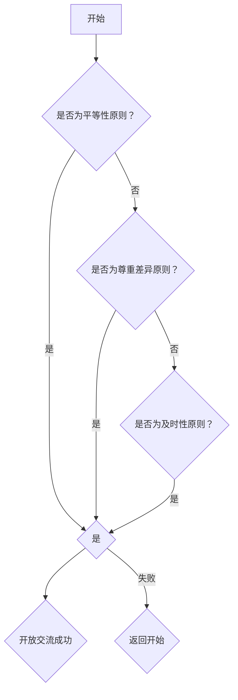
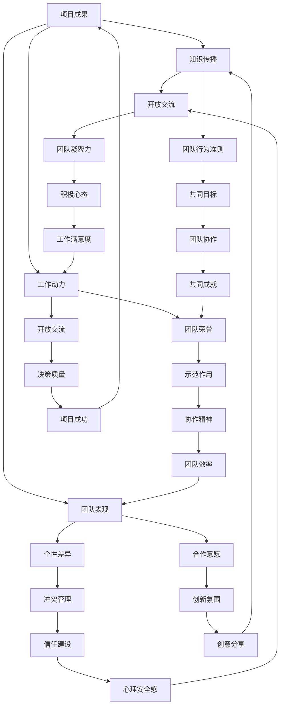

                 


### 《心理安全感：创造开放交流的团队氛围》文章标题及关键词

#### 文章标题：心理安全感：创造开放交流的团队氛围

##### 关键词：
1. 心理安全感
2. 团队氛围
3. 开放交流
4. 组织文化
5. 团队互动
6. 冲突管理
7. 案例分析

#### 文章摘要：
本文旨在探讨如何通过建立心理安全感，促进团队中开放交流的氛围。文章首先定义了心理安全感、团队氛围和开放交流的概念，并阐述了它们之间的关系。接着，从理论基础、实践策略和评估改进三个方面，详细介绍了如何通过组织文化塑造、团队成员互动以及实际案例解析，来实现心理安全感与开放交流的良性循环。最后，对全文进行了总结与展望，提出了未来研究的方向。

---

### 文章目录

**第一部分：引言**
- **1.1 问题背景**
- **1.2 核心概念与联系**

**第二部分：理论基础**
- **2.1 心理安全感原理**
- **2.2 开放交流机制**
- **2.3 团队氛围构建**

**第三部分：实践策略**
- **3.1 组织文化塑造**
- **3.2 团队成员互动**
- **3.3 实际案例解析**

**第四部分：评估与改进**
- **4.1 心理安全感评估**
- **4.2 团队氛围优化**

**第五部分：总结与展望**
- **5.1 小结**
- **5.2 展望未来**

---

### 第一部分：引言

#### 1.1 问题背景

在现代社会中，团队协作成为组织运作的重要形式。然而，团队内部的心理安全感往往成为影响协作效率的关键因素。研究表明，缺乏心理安全感会导致团队成员之间沟通不畅、信任度低、合作意愿差等问题。这些问题不仅影响团队的日常运作，还可能对项目的成功产生负面影响。

**问题描述：**
- **沟通障碍：** 团队成员之间缺乏开放交流，导致信息传递不准确、不及时。
- **信任缺失：** 缺乏心理安全感使得团队成员对彼此的能力和动机持怀疑态度。
- **合作意愿降低：** 团队成员不愿意分享知识和资源，害怕暴露自己的不足。

**问题解决：**
- **建立心理安全感：** 通过提升团队成员之间的信任度，减少沟通障碍，增强合作意愿。

**边界与外延：**
- **心理安全感：** 关注团队成员的心理状态，强调安全感和信任。
- **团队氛围：** 团队成员之间的互动和合作环境。
- **开放交流：** 团队成员之间分享知识和经验，积极表达观点。

---

#### 1.2 核心概念与联系

在本部分，我们将详细阐述三个核心概念：心理安全感、开放交流和团队氛围。

**心理安全感：**
- **定义：** 心理安全感是指个体在团队中感到被接纳、被尊重和被信任的状态。
- **影响因素：** 包括团队成员之间的信任度、沟通频率、共同目标和组织文化等。
- **重要性：** 心理安全感是团队高效协作的基础，能够促进开放交流和积极互动。

**开放交流：**
- **定义：** 开放交流是指团队成员之间自由地分享信息、观点和感受。
- **必要性：** 开放交流能够提高团队决策质量、促进创新和减少误解。
- **障碍与应对策略：** 包括沟通技巧、时间和资源的限制、以及文化差异等。

**团队氛围：**
- **定义：** 团队氛围是指团队成员之间的互动和合作环境。
- **影响因素：** 包括组织文化、领导风格、团队成员的个性等。
- **对心理安全感的影响：** 积极的团队氛围能够提升成员的心理安全感，促进开放交流。

通过以上对核心概念的定义和阐述，我们可以更好地理解心理安全感、开放交流和团队氛围之间的内在联系。这些概念构成了本文的理论基础，为后续的讨论提供了指导。

---

### 第二部分：理论基础

在深入探讨如何创造一个充满心理安全感、促进开放交流的团队氛围之前，我们需要首先了解相关理论基础。本部分将分别介绍心理安全感、开放交流和团队氛围的理论原理，以及它们之间的相互关系。

#### 2.1 心理安全感原理

**定义：** 心理安全感是指个体在团队中感到被接纳、被尊重和被信任的状态。这种安全感不仅来自于个体与团队成员之间的直接互动，还受到组织文化和领导风格的影响。

**影响因素：**
- **信任度：** 信任是心理安全感的核心因素。团队成员之间的信任度高，能够减少恐惧和不确定性，促进开放交流。
- **沟通频率：** 定期且有效的沟通能够增强团队成员之间的联系，提升心理安全感。
- **共同目标：** 团队成员拥有共同目标，能够增进彼此之间的理解和合作，有助于建立心理安全感。
- **组织文化：** 组织文化对于心理安全感的影响至关重要。一个鼓励开放、包容和支持的组织文化，能够提升团队成员的心理安全感。

**心理安全感与团队氛围的关系：**
- **相互促进：** 心理安全感是团队氛围的重要组成部分。一个充满心理安全感的团队，往往拥有积极的团队氛围。
- **循环作用：** 积极的团队氛围能够提升成员的心理安全感，进一步促进开放交流，形成良性循环。

**概念属性特征对比表格：**

| 特征         | 心理安全感                   | 团队氛围                  |
| ------------ | ---------------------------- | ------------------------- |
| 定义         | 团队成员的安全和信任感       | 团队成员的互动和合作环境  |
| 影响因素     | 信任度、沟通频率、共同目标等 | 组织文化、领导风格等      |
| 作用         | 促进开放交流                 | 提升成员心理安全感        |
| 关系         | 相互促进                    | 循环作用                  |

**Mermaid ER实体关系图架构：**

```mermaid
erDiagram
    Team_Member ||--|{ Psychological_Security }|| Member
    Team_Member ||--|{ Team_Atmosphere }|| Atmosphere
    Psychological_Security ||--|{ Trust }|| Trust
    Psychological_Security ||--|{ Communication }|| Communication
    Psychological_Security ||--|{ Common_Goals }|| Goals
    Psychological_Security ||--|{ Organizational_Culture }|| Culture
    Team_Atmosphere ||--|{ Open_Communication }|| Communication
```

#### 2.2 开放交流机制

**定义：** 开放交流是指团队成员之间自由地分享信息、观点和感受。这种交流不仅限于团队成员之间的直接沟通，还包括通过会议、邮件、即时通讯工具等多种方式进行的信息传递。

**必要性：**
- **提高决策质量：** 开放交流能够确保团队成员获取全面的信息，有助于做出更明智的决策。
- **促进创新：** 开放交流鼓励团队成员分享创意和想法，有利于创新的产生和发展。
- **减少误解：** 开放交流能够减少信息失真和误解，增强团队成员之间的理解。

**原则：**
- **平等性：** 所有团队成员都应享有平等的发言权，避免权威主义和偏见的干扰。
- **尊重差异：** 尊重团队成员的观点和经验，避免因文化、背景等差异导致的冲突。
- **及时性：** 信息应得到及时传递和处理，避免拖延和误判。

**障碍与应对策略：**
- **沟通技巧：** 提高团队成员的沟通技巧，包括倾听、表达和反馈等。
- **时间与资源的限制：** 合理安排时间和资源，确保开放交流的有效进行。
- **文化差异：** 尊重和适应不同文化背景的团队成员，采用适当的沟通方式。

**Mermaid流程图：**



#### 2.3 团队氛围构建

**定义：** 团队氛围是指团队成员之间的互动和合作环境。它不仅影响团队成员的心理状态，还直接影响团队的效率和成果。

**定义：** 团队氛围是指团队成员之间的互动和合作环境。它不仅影响团队成员的心理状态，还直接影响团队的效率和成果。

**影响因素：**
- **组织文化：** 组织文化是团队氛围的基石，它决定了团队的行为准则和价值观。
- **领导风格：** 领导者的风格对团队氛围有重要影响。民主式领导风格通常能够创造更加开放和包容的团队氛围。
- **团队成员的个性：** 团队成员的个性差异也会影响团队氛围。例如，外向成员可能更倾向于开放交流，而内向成员可能更保守。

**对心理安全感的影响：**
- **积极影响：** 积极的团队氛围能够提升成员的心理安全感，增强信任和合作意愿。
- **消极影响：** 消极的团队氛围可能削弱成员的心理安全感，导致沟通障碍和冲突。

**构建积极团队氛围的策略：**
- **文化认同：** 建立一个与团队成员价值观和期望相符合的组织文化。
- **领导者作用：** 领导者应通过身教言传，树立良好的行为榜样。
- **评估与改进：** 定期对团队氛围进行评估，及时发现问题并进行改进。

**Mermaid架构图：**



通过上述对心理安全感、开放交流和团队氛围的理论原理及相互关系的介绍，我们可以更好地理解这些概念在实际团队运作中的作用和重要性。在接下来的部分，我们将从实践策略的角度，进一步探讨如何通过具体措施来提升团队的心理安全感和开放交流的氛围。

---

### 第三部分：实践策略

在了解了心理安全感、开放交流和团队氛围的理论基础后，我们接下来将探讨如何通过实践策略来创造一个充满心理安全感、促进开放交流的团队氛围。这些策略包括组织文化塑造、团队成员互动和实际案例解析。以下是具体的实践步骤和策略。

#### 3.1 组织文化塑造

**文化认同：** 
- **建立共同价值观：** 团队领导者需要与团队成员共同确定团队的价值观，确保每个成员都能认同并遵循这些价值观。
- **强化文化符号：** 通过团队标志、口号、传统活动等方式，强化团队文化的符号和象征，让团队成员在行为和思想上都体现这些价值观。

**领导者的作用：**
- **身教言传：** 领导者需要通过自己的行为来树立榜样，体现出团队的文化价值观。领导者应鼓励开放交流，尊重团队成员的意见，并在决策过程中充分考虑团队成员的建议。
- **倾听与反馈：** 领导者需要倾听团队成员的意见和反馈，并及时给予积极的反馈。这不仅能增强团队成员的心理安全感，还能提高团队的协作效率。

**组织文化评估与改进：**
- **定期评估：** 团队应定期对组织文化进行评估，了解团队成员对当前文化的满意度以及文化对团队绩效的影响。
- **持续改进：** 根据评估结果，对组织文化进行持续改进，确保文化能够适应团队的发展和变化。

#### 3.2 团队成员互动

**沟通技巧：**
- **倾听：** 倾听是有效沟通的关键。团队成员在交流时应认真倾听对方的观点，避免打断或误解对方的意图。
- **表达：** 成员应清晰、明确地表达自己的观点和想法，避免使用含糊不清的语言。
- **反馈：** 双向的反馈机制能够促进团队成员之间的理解。团队成员应在交流过程中给予对方及时的反馈，并尊重对方的意见。

**冲突管理：**
- **认识冲突：** 团队成员应认识到冲突是正常的，并学会通过有效的方式解决冲突，而不是避免或压抑。
- **理性分析：** 在解决冲突时，团队成员应保持理性，避免情绪化。通过分析冲突的原因，找到解决问题的方法。
- **求同存异：** 即使在意见不一致时，团队成员也应尊重对方的观点，寻求共同点，以达到共识。

**团队成员关系维护：**
- **团队建设活动：** 通过定期的团队建设活动，增强团队成员之间的信任和合作。
- **个人成长支持：** 鼓励团队成员追求个人成长，提供必要的支持和资源。

#### 3.3 实际案例解析

**案例1：公司A的成功实践**
- **背景：** 公司A是一家技术创新型企业，团队氛围积极，员工满意度高。
- **措施：**
  - **建立共同价值观：** 公司A的领导者与团队成员共同确定了以创新和客户为中心的价值观。
  - **领导者的作用：** 领导者以身作则，鼓励团队成员分享观点，并在决策过程中充分考虑团队成员的建议。
  - **团队建设活动：** 公司A定期组织团队建设活动，如团建旅行、技术分享会等，增强团队成员之间的信任和合作。
- **结果：** 公司A的团队氛围良好，员工满意度高，项目成功率显著提升。

**案例2：团队B的挑战与解决**
- **背景：** 团队B是一家初创公司，团队成员年轻，但缺乏经验，团队氛围紧张。
- **措施：**
  - **冲突管理：** 团队B通过定期的团队讨论，识别和解决冲突。团队成员学会理性分析冲突原因，并寻求共同解决方案。
  - **领导者的作用：** 领导者通过沟通技巧和冲突管理，帮助团队成员建立信任，减少误解。
  - **个人成长支持：** 领导者鼓励团队成员追求个人成长，提供培训和资源支持。
- **结果：** 经过一系列的措施，团队B的氛围逐渐改善，团队成员之间的信任度提升，项目成功率增加。

通过以上实践策略和案例分析，我们可以看到，创造一个充满心理安全感、促进开放交流的团队氛围，不仅需要理论基础的指导，更需要实践中的具体措施和持续的改进。在接下来的部分，我们将探讨如何评估团队的心理安全感和团队氛围，并给出优化建议。

---

### 第四部分：评估与改进

为了确保团队氛围和心理安全感达到理想状态，并持续优化，我们需要建立一套有效的评估和改进机制。以下是具体的评估方法和优化策略。

#### 4.1 心理安全感评估

**评估方法：**
- **问卷调查：** 通过设计问卷，了解团队成员对心理安全感的感受。问卷应包括对信任度、沟通频率、共同目标和组织文化的评价。
- **访谈：** 对团队成员进行深入访谈，了解他们对团队氛围和心理安全感的真实感受，以及提出改进建议。
- **行为观察：** 观察团队成员在团队活动中的行为表现，如沟通方式、互动频率和合作态度，以评估心理安全感。

**评估指标：**
- **信任度：** 包括团队成员对彼此的信任程度、分享意愿和合作意愿。
- **沟通频率：** 包括团队成员之间的交流频率、沟通渠道的多样性和信息传递的及时性。
- **共同目标：** 包括团队成员对共同目标的认同程度、协作一致性和目标实现的效率。
- **组织文化：** 包括团队成员对组织文化的满意度、对价值观的认同度和文化认同感。

**评估实例：**
- **问卷调查实例：**
  ```
  1. 你觉得团队中的信任度如何？ 
  （1）非常低（2）较低（3）一般（4）较高（5）非常高

  2. 你是否愿意在团队中分享自己的观点和想法？
  （1）从不（2）偶尔（3）经常（4）总是

  3. 你觉得团队的沟通频率如何？
  （1）非常低（2）较低（3）一般（4）较高（5）非常高
  ```

- **访谈实例：**
  - **访谈对象：** 团队成员
  - **访谈问题：**
    - 你在团队中感到安全吗？为什么？
    - 你认为团队有哪些方面需要改进来提升心理安全感？
    - 你觉得团队中的开放交流程度如何？有哪些障碍？

#### 4.2 团队氛围优化

**优化策略：**
- **文化认同：** 加强团队文化建设，确保团队成员对共同价值观的认同。可以通过定期的文化活动、团队价值观宣传等方式来实现。
- **领导者的作用：** 领导者应发挥关键作用，通过身教言传，树立良好的行为榜样，并鼓励团队成员积极参与团队决策。
- **沟通技巧培训：** 提供沟通技巧培训，提高团队成员的沟通能力，包括倾听技巧、表达方式和反馈机制。
- **冲突管理：** 建立有效的冲突管理机制，通过沟通和协商解决冲突，避免情绪化和对抗。
- **团队建设：** 定期组织团队建设活动，增强团队成员之间的信任和合作。
- **持续改进：** 定期评估团队氛围和心理安全感，根据评估结果进行持续改进。

**持续改进：**
- **建立反馈机制：** 建立一个持续的反馈机制，让团队成员能够及时反馈他们的感受和建议。
- **领导支持：** 领导者应积极支持团队改进工作，提供必要的资源和时间，确保改进措施得以实施。
- **数据驱动：** 使用数据分析来评估改进措施的效果，并根据数据结果调整策略。

通过上述评估与改进机制，团队可以持续提升心理安全感和开放交流的氛围，从而提高团队的协作效率和工作满意度。

---

### 第五部分：总结与展望

在本篇文章中，我们系统地探讨了如何通过建立心理安全感来创造开放交流的团队氛围。首先，我们介绍了心理安全感、开放交流和团队氛围的核心概念，并阐述了它们之间的相互关系。接着，我们从理论基础、实践策略和评估改进三个方面，详细分析了如何通过组织文化塑造、团队成员互动和实际案例解析，来提升团队的心理安全感和开放交流氛围。

#### 5.1 小结

本文的主要结论如下：

1. **心理安全感是团队高效协作的基础**：心理安全感能够促进团队成员之间的信任、开放交流和合作。
2. **开放交流是提升团队决策质量和创新能力的必要条件**：通过开放交流，团队成员能够分享知识和经验，减少误解，提高决策效率。
3. **团队氛围对心理安全感有重要影响**：积极的团队氛围能够提升成员的心理安全感，促进开放交流，形成良性循环。
4. **有效的实践策略包括组织文化塑造、团队成员互动和实际案例解析**：这些策略能够帮助团队建立心理安全感，促进开放交流。
5. **评估与改进机制是确保团队氛围持续优化的重要手段**：通过定期的评估和反馈，团队可以持续提升心理安全感和开放交流的氛围。

#### 5.2 展望未来

尽管本文提出了具体的实践策略和评估方法，但仍有许多值得进一步研究和探讨的方向：

1. **文化多样性的影响**：在全球化背景下，文化多样性对团队氛围和心理安全感的影响需要深入研究。
2. **虚拟团队的管理**：随着远程工作的普及，虚拟团队的管理和氛围建设成为新的挑战，需要开发适用于虚拟团队的管理策略。
3. **心理安全感的量化指标**：目前对心理安全感的评估更多依赖主观感受，未来可以探索更量化的评估指标和方法。
4. **技术创新与团队氛围**：随着人工智能、大数据等技术的快速发展，它们对团队氛围和心理安全感的影响也需要进一步研究。

总之，心理安全感与开放交流的团队氛围建设是一个复杂而长期的过程，需要不断探索和实践。未来，我们期待在理论和实践上都能有更多的突破，为团队协作提供更加有效的支持。

---

### 作者信息

**作者：AI天才研究院/AI Genius Institute & 禅与计算机程序设计艺术 /Zen And The Art of Computer Programming**

